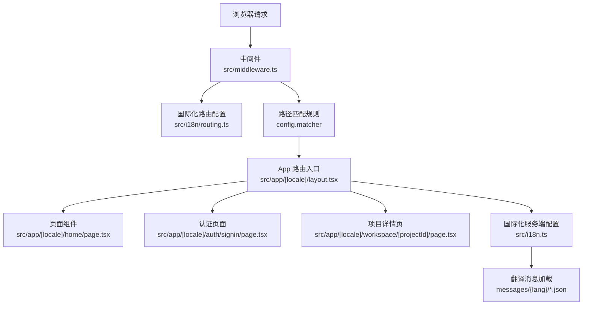
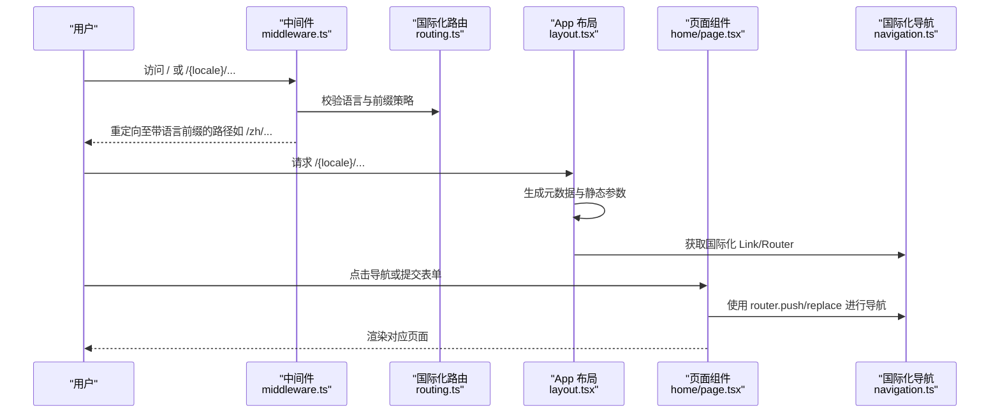
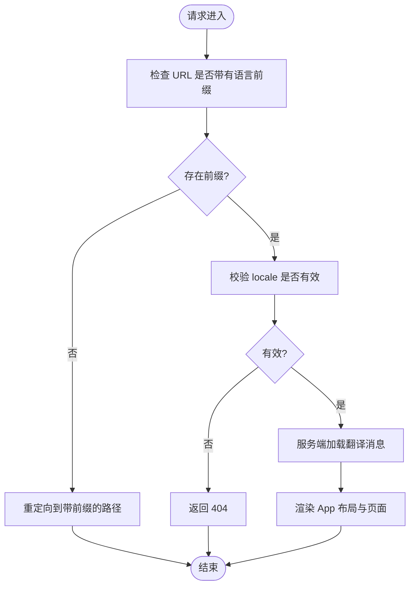
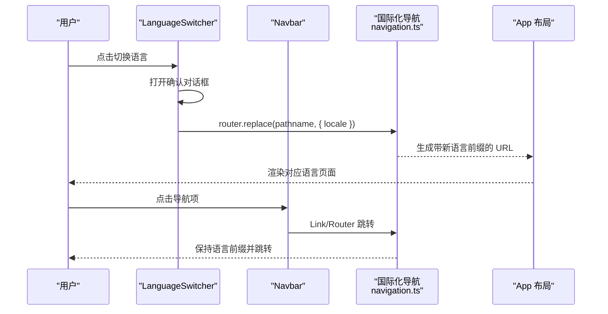
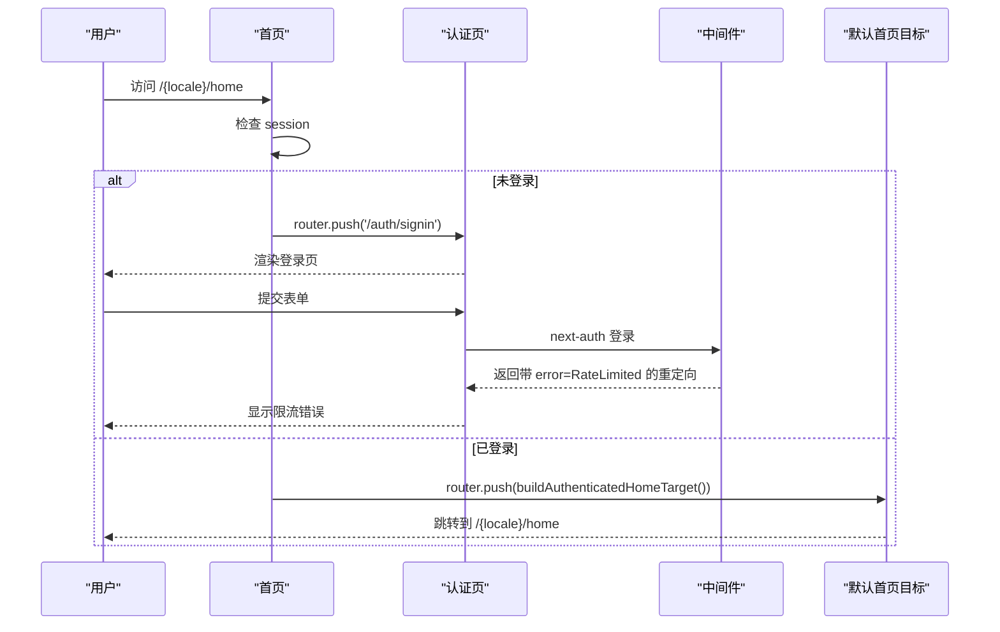
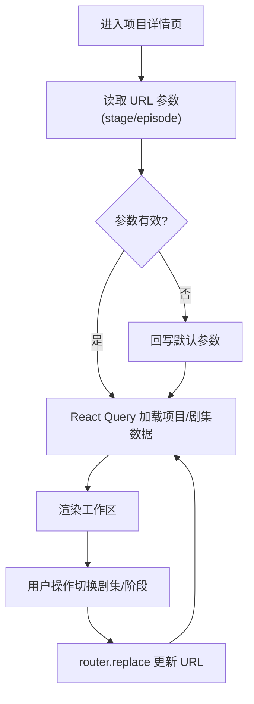
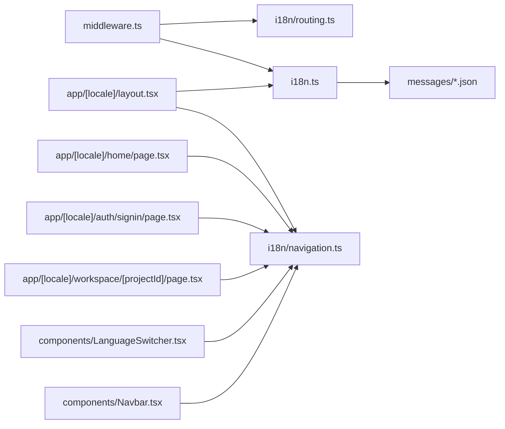

# 导航与路由

<cite>
**本文引用的文件**   
- [src/middleware.ts](file://src/middleware.ts)
- [src/i18n.ts](file://src/i18n.ts)
- [src/i18n/routing.ts](file://src/i18n/routing.ts)
- [src/i18n/navigation.ts](file://src/i18n/navigation.ts)
- [src/app/[locale]/layout.tsx](file://src/app/[locale]/layout.tsx)
- [src/components/LanguageSwitcher.tsx](file://src/components/LanguageSwitcher.tsx)
- [src/components/Navbar.tsx](file://src/components/Navbar.tsx)
- [next.config.ts](file://next.config.ts)
- [src/app/[locale]/home/page.tsx](file://src/app/[locale]/home/page.tsx)
- [src/app/[locale]/auth/signin/page.tsx](file://src/app/[locale]/auth/signin/page.tsx)
- [src/app/[locale]/workspace/[projectId]/page.tsx](file://src/app/[locale]/workspace/[projectId]/page.tsx)
- [src/lib/home/default-route.ts](file://src/lib/home/default-route.ts)
- [src/app/api/auth/[...nextauth]/route.ts](file://src/app/api/auth/[...nextauth]/route.ts)
- [scripts/guards/locale-navigation-guard.mjs](file://scripts/guards/locale-navigation-guard.mjs)
</cite>

## 目录
1. [简介](#简介)
2. [项目结构](#项目结构)
3. [核心组件](#核心组件)
4. [架构总览](#架构总览)
5. [详细组件分析](#详细组件分析)
6. [依赖关系分析](#依赖关系分析)
7. [性能考量](#性能考量)
8. [故障排查指南](#故障排查指南)
9. [结论](#结论)
10. [附录](#附录)

## 简介
本技术文档面向 Waoowaoo 的导航与路由系统，围绕基于 Next.js 15 App Router 的架构展开，重点覆盖以下方面：
- 动态路由与嵌套路由组织
- 多语言支持与国际化路由实现（含语言切换、路由重写与 SEO）
- 中间件配置与路径匹配策略
- 页面组件与布局组件的职责划分
- 路由守卫、权限控制与导航状态管理
- 性能优化、预加载策略与错误处理
- 实际路由配置示例与最佳实践

## 项目结构
Waoowaoo 采用 Next.js 15 App Router 的 App 目录结构，路由以“按 locale 分层 + 动态参数 + 嵌套路由”的方式组织。国际化通过 next-intl 提供的路由与中间件能力实现，静态资源与国际化插件在 next.config.ts 中启用。

图表来源
- [src/middleware.ts:18-27](file://src/middleware.ts#L18-L27)
- [src/i18n/routing.ts:8-17](file://src/i18n/routing.ts#L8-L17)
- [src/app/[locale]/layout.tsx:33-35](file://src/app/[locale]/layout.tsx#L33-L35)
- [src/i18n.ts:9-124](file://src/i18n.ts#L9-L124)

章节来源
- [src/middleware.ts:1-28](file://src/middleware.ts#L1-L28)
- [src/i18n/routing.ts:1-18](file://src/i18n/routing.ts#L1-L18)
- [src/i18n.ts:1-125](file://src/i18n.ts#L1-L125)
- [src/app/[locale]/layout.tsx:1-79](file://src/app/[locale]/layout.tsx#L1-L79)
- [next.config.ts:1-24](file://next.config.ts#L1-L24)

## 核心组件
- 国际化路由与中间件
  - 国际化路由定义与默认语言、前缀策略：[src/i18n/routing.ts:1-18](file://src/i18n/routing.ts#L1-L18)
  - 服务端国际化配置与翻译消息聚合：[src/i18n.ts:1-125](file://src/i18n.ts#L1-L125)
  - 中间件：启用 next-intl 中间件、禁用自动语言检测、强制语言前缀、匹配规则：[src/middleware.ts:1-28](file://src/middleware.ts#L1-L28)
- App 布局与元数据
  - 动态元数据生成与静态参数生成：[src/app/[locale]/layout.tsx](file://src/app/[locale]/layout.tsx#L18-L35)
  - 布局容器与 Provider 注入：[src/app/[locale]/layout.tsx](file://src/app/[locale]/layout.tsx#L37-L78)
- 导航与语言切换
  - 语言切换器组件：[src/components/LanguageSwitcher.tsx:1-140](file://src/components/LanguageSwitcher.tsx#L1-L140)
  - 导航栏组件（含登录态链接与语言切换）：[src/components/Navbar.tsx:1-182](file://src/components/Navbar.tsx#L1-L182)
- 页面与路由守卫
  - 首页（鉴权与跳转）：[src/app/[locale]/home/page.tsx](file://src/app/[locale]/home/page.tsx#L60-L66)
  - 认证页（登录表单与错误处理）：[src/app/[locale]/auth/signin/page.tsx](file://src/app/[locale]/auth/signin/page.tsx#L18-L43)
  - 项目详情页（URL 驱动的导航状态、剧集管理）：[src/app/[locale]/workspace/[projectId]/page.tsx](file://src/app/[locale]/workspace/[projectId]/page.tsx#L82-L102)
- 国际化导航工具
  - 国际化 Link/Router 封装：[src/i18n/navigation.ts:1-5](file://src/i18n/navigation.ts#L1-L5)
  - 默认登录后首页目标：[src/lib/home/default-route.ts:1-11](file://src/lib/home/default-route.ts#L1-L11)
- 构建配置
  - next-intl 插件启用与图片配置：[next.config.ts:1-24](file://next.config.ts#L1-L24)

章节来源
- [src/i18n/routing.ts:1-18](file://src/i18n/routing.ts#L1-L18)
- [src/i18n.ts:1-125](file://src/i18n.ts#L1-L125)
- [src/middleware.ts:1-28](file://src/middleware.ts#L1-L28)
- [src/app/[locale]/layout.tsx:1-79](file://src/app/[locale]/layout.tsx#L1-L79)
- [src/components/LanguageSwitcher.tsx:1-140](file://src/components/LanguageSwitcher.tsx#L1-L140)
- [src/components/Navbar.tsx:1-182](file://src/components/Navbar.tsx#L1-L182)
- [src/app/[locale]/home/page.tsx:60-L66](file://src/app/[locale]/home/page.tsx#L60-L66)
- [src/app/[locale]/auth/signin/page.tsx:18-L43](file://src/app/[locale]/auth/signin/page.tsx#L18-L43)
- [src/app/[locale]/workspace/[projectId]/page.tsx:82-L102](file://src/app/[locale]/workspace/[projectId]/page.tsx#L82-L102)
- [src/i18n/navigation.ts:1-5](file://src/i18n/navigation.ts#L1-L5)
- [src/lib/home/default-route.ts:1-11](file://src/lib/home/default-route.ts#L1-L11)
- [next.config.ts:1-24](file://next.config.ts#L1-L24)

## 架构总览
Waoowaoo 的导航与路由体系由“中间件 + 国际化路由 + App 布局 + 页面组件 + 国际化导航工具”构成，形成“语言前缀强制、URL 驱动、服务端消息加载”的闭环。

图表来源
- [src/middleware.ts:4-16](file://src/middleware.ts#L4-L16)
- [src/i18n/routing.ts:8-17](file://src/i18n/routing.ts#L8-L17)
- [src/app/[locale]/layout.tsx:18-L35](file://src/app/[locale]/layout.tsx#L18-L35)
- [src/i18n/navigation.ts:1-5](file://src/i18n/navigation.ts#L1-L5)

章节来源
- [src/middleware.ts:1-28](file://src/middleware.ts#L1-L28)
- [src/i18n/routing.ts:1-18](file://src/i18n/routing.ts#L1-L18)
- [src/app/[locale]/layout.tsx:1-L79](file://src/app/[locale]/layout.tsx#L1-L79)
- [src/i18n/navigation.ts:1-5](file://src/i18n/navigation.ts#L1-L5)

## 详细组件分析

### 国际化路由与中间件
- 语言与前缀策略
  - 语言集合与默认语言：[src/i18n/routing.ts:3-6](file://src/i18n/routing.ts#L3-L6)
  - 强制语言前缀（always）：[src/i18n/routing.ts](file://src/i18n/routing.ts#L16)
- 中间件行为
  - 启用 next-intl 中间件，设置 locales、defaultLocale、localePrefix
  - 显式关闭 localeDetection，避免无前缀访问触发语言漂移
  - matcher 统一匹配根路径与带语言前缀路径，并排除静态资源与 API
- 服务端国际化
  - 通过 getRequestConfig 在服务端按 locale 加载翻译消息，返回合并后的 messages 对象

图表来源
- [src/middleware.ts:4-16](file://src/middleware.ts#L4-L16)
- [src/i18n.ts:9-16](file://src/i18n.ts#L9-L16)
- [src/i18n/routing.ts:3-6](file://src/i18n/routing.ts#L3-L6)

章节来源
- [src/i18n/routing.ts:1-18](file://src/i18n/routing.ts#L1-L18)
- [src/i18n.ts:1-125](file://src/i18n.ts#L1-L125)
- [src/middleware.ts:1-28](file://src/middleware.ts#L1-L28)

### App 布局与元数据
- 动态元数据
  - generateMetadata 根据 locale 读取 layout 命名空间的翻译生成 title/description 与图标
- 静态参数
  - generateStaticParams 为 locales 生成静态路由参数，利于预渲染
- 布局容器
  - NextIntlClientProvider 注入 messages
  - Providers 包裹子树，注入全局状态与查询客户端等

章节来源
- [src/app/[locale]/layout.tsx:18-L35](file://src/app/[locale]/layout.tsx#L18-L35)
- [src/app/[locale]/layout.tsx:37-L78](file://src/app/[locale]/layout.tsx#L37-L78)

### 语言切换与导航
- 语言切换器
  - 使用国际化 router.replace 与 confirm 对话框，确保切换语言时提示用户端到端语言变更
  - 通过 usePathname/useLocale 获取当前路径与语言，支持 zh/en 双语
- 导航栏
  - 登录态下提供工作区、素材库、个人资料等链接
  - 使用国际化 Link/Router，避免硬编码根路径

图表来源
- [src/components/LanguageSwitcher.tsx:70-84](file://src/components/LanguageSwitcher.tsx#L70-L84)
- [src/components/Navbar.tsx:113-135](file://src/components/Navbar.tsx#L113-L135)
- [src/i18n/navigation.ts:1-5](file://src/i18n/navigation.ts#L1-L5)

章节来源
- [src/components/LanguageSwitcher.tsx:1-140](file://src/components/LanguageSwitcher.tsx#L1-L140)
- [src/components/Navbar.tsx:1-182](file://src/components/Navbar.tsx#L1-L182)
- [src/i18n/navigation.ts:1-5](file://src/i18n/navigation.ts#L1-L5)

### 页面与路由守卫
- 首页
  - 使用 useEffect 监听 session 状态，未登录则跳转至 /auth/signin
  - 使用国际化 router.push 跳转到默认首页目标
- 认证页
  - 使用 next-auth 的 signIn，根据返回结果设置错误信息或跳转
  - 错误码为 RateLimited 时，中间件会返回带 error=RateLimited 的重定向
- 项目详情页
  - URL 参数驱动导航状态（stage/episode），避免本地状态冗余
  - 使用 router.replace 更新 URL，保持滚动位置与语言前缀

图表来源
- [src/app/[locale]/home/page.tsx:60-L66](file://src/app/[locale]/home/page.tsx#L60-L66)
- [src/app/[locale]/auth/signin/page.tsx:18-L43](file://src/app/[locale]/auth/signin/page.tsx#L18-L43)
- [src/app/api/auth/[...nextauth]/route.ts](file://src/app/api/auth/[...nextauth]/route.ts#L26-L44)
- [src/lib/home/default-route.ts:7-11](file://src/lib/home/default-route.ts#L7-L11)

章节来源
- [src/app/[locale]/home/page.tsx:60-L66](file://src/app/[locale]/home/page.tsx#L60-L66)
- [src/app/[locale]/auth/signin/page.tsx:18-L43](file://src/app/[locale]/auth/signin/page.tsx#L18-L43)
- [src/app/api/auth/[...nextauth]/route.ts](file://src/app/api/auth/[...nextauth]/route.ts#L26-L44)
- [src/lib/home/default-route.ts:1-11](file://src/lib/home/default-route.ts#L1-L11)

### URL 驱动的导航状态管理
- 项目详情页通过 URL 参数（stage/episode）驱动视图状态，避免本地状态与后端状态不一致
- 使用 router.replace 更新 URL，保持滚动位置与语言前缀
- 通过 useMemo 与 React Query 缓存与同步数据，减少重复请求

图表来源
- [src/app/[locale]/workspace/[projectId]/page.tsx:82-L102](file://src/app/[locale]/workspace/[projectId]/page.tsx#L82-L102)
- [src/app/[locale]/workspace/[projectId]/page.tsx:196-L202](file://src/app/[locale]/workspace/[projectId]/page.tsx#L196-L202)

章节来源
- [src/app/[locale]/workspace/[projectId]/page.tsx:82-L102](file://src/app/[locale]/workspace/[projectId]/page.tsx#L82-L102)
- [src/app/[locale]/workspace/[projectId]/page.tsx:196-L202](file://src/app/[locale]/workspace/[projectId]/page.tsx#L196-L202)

## 依赖关系分析
- 中间件依赖国际化路由配置与 locales 列表
- App 布局依赖国际化服务端配置与 NextIntlClientProvider
- 页面组件依赖国际化 Link/Router 与服务端/客户端状态
- 导航守卫依赖 next-auth 与默认首页目标构建

图表来源
- [src/middleware.ts:1-2](file://src/middleware.ts#L1-L2)
- [src/i18n/routing.ts:1-3](file://src/i18n/routing.ts#L1-L3)
- [src/i18n.ts:2-3](file://src/i18n.ts#L2-L3)
- [src/app/[locale]/layout.tsx:5-L6](file://src/app/[locale]/layout.tsx#L5-L6)
- [src/i18n/navigation.ts:1-4](file://src/i18n/navigation.ts#L1-L4)
- [src/components/LanguageSwitcher.tsx:8](file://src/components/LanguageSwitcher.tsx#L8)
- [src/components/Navbar.tsx:11](file://src/components/Navbar.tsx#L11)

章节来源
- [src/middleware.ts:1-28](file://src/middleware.ts#L1-L28)
- [src/i18n.ts:1-125](file://src/i18n.ts#L1-L125)
- [src/app/[locale]/layout.tsx:1-L79](file://src/app/[locale]/layout.tsx#L1-L79)
- [src/i18n/navigation.ts:1-5](file://src/i18n/navigation.ts#L1-L5)
- [src/components/LanguageSwitcher.tsx:1-140](file://src/components/LanguageSwitcher.tsx#L1-L140)
- [src/components/Navbar.tsx:1-182](file://src/components/Navbar.tsx#L1-L182)

## 性能考量
- 预渲染与静态参数
  - App 布局通过 generateStaticParams 为 locales 生成静态参数，提升首屏性能
- 翻译消息加载
  - 服务端一次性加载多模块翻译，避免客户端多次请求
- URL 驱动状态
  - 项目详情页通过 URL 参数驱动状态，减少本地状态同步成本
- 图片与静态资源
  - next.config.ts 中限制本地图片路径模式，减少跨域风险与缓存抖动

章节来源
- [src/app/[locale]/layout.tsx:33-L35](file://src/app/[locale]/layout.tsx#L33-L35)
- [src/i18n.ts:52-85](file://src/i18n.ts#L52-L85)
- [src/app/[locale]/workspace/[projectId]/page.tsx:82-L102](file://src/app/[locale]/workspace/[projectId]/page.tsx#L82-L102)
- [next.config.ts:13-21](file://next.config.ts#L13-L21)

## 故障排查指南
- 语言切换后页面未更新
  - 确认使用国际化 router.replace 并传入 locale 参数
  - 检查 LanguageSwitcher 是否正确读取当前 locale
- 无语言前缀访问导致语言漂移
  - 中间件已关闭 localeDetection，确保访问 / 会被重定向到带前缀路径
- 登录限流
  - 中间件在认证回调中对登录进行速率限制，返回 error=RateLimited；前端应识别该错误并提示
- 导航路径硬编码
  - 使用 @/i18n/navigation 的 Link/Router 替代硬编码根路径，避免破坏语言前缀

章节来源
- [src/components/LanguageSwitcher.tsx:70-84](file://src/components/LanguageSwitcher.tsx#L70-L84)
- [src/middleware.ts:14-16](file://src/middleware.ts#L14-L16)
- [src/app/api/auth/[...nextauth]/route.ts](file://src/app/api/auth/[...nextauth]/route.ts#L26-L44)
- [scripts/guards/locale-navigation-guard.mjs:73-85](file://scripts/guards/locale-navigation-guard.mjs#L73-L85)

## 结论
Waoowaoo 的导航与路由系统通过“中间件 + 国际化路由 + App 布局 + URL 驱动状态 + 国际化导航工具”的组合，实现了稳定、可维护且具备良好性能的多语言应用。建议在后续迭代中持续遵循国际化导航规范，强化路由守卫与错误处理，进一步完善预加载与缓存策略。

## 附录
- 实际路由配置示例
  - 国际化路由与默认语言：[src/i18n/routing.ts:1-18](file://src/i18n/routing.ts#L1-L18)
  - 中间件与路径匹配：[src/middleware.ts:1-28](file://src/middleware.ts#L1-L28)
  - 服务端国际化与翻译加载：[src/i18n.ts:1-125](file://src/i18n.ts#L1-L125)
  - App 布局与元数据：[src/app/[locale]/layout.tsx](file://src/app/[locale]/layout.tsx#L1-L79)
  - 语言切换与导航：[src/components/LanguageSwitcher.tsx:1-140](file://src/components/LanguageSwitcher.tsx#L1-L140)、[src/components/Navbar.tsx:1-182](file://src/components/Navbar.tsx#L1-L182)
  - 页面路由守卫与导航：[src/app/[locale]/home/page.tsx](file://src/app/[locale]/home/page.tsx#L60-L66)、[src/app/[locale]/auth/signin/page.tsx](file://src/app/[locale]/auth/signin/page.tsx#L18-L43)、[src/app/[locale]/workspace/[projectId]/page.tsx](file://src/app/[locale]/workspace/[projectId]/page.tsx#L82-L102)
  - 构建配置与国际化插件：[next.config.ts:1-24](file://next.config.ts#L1-L24)