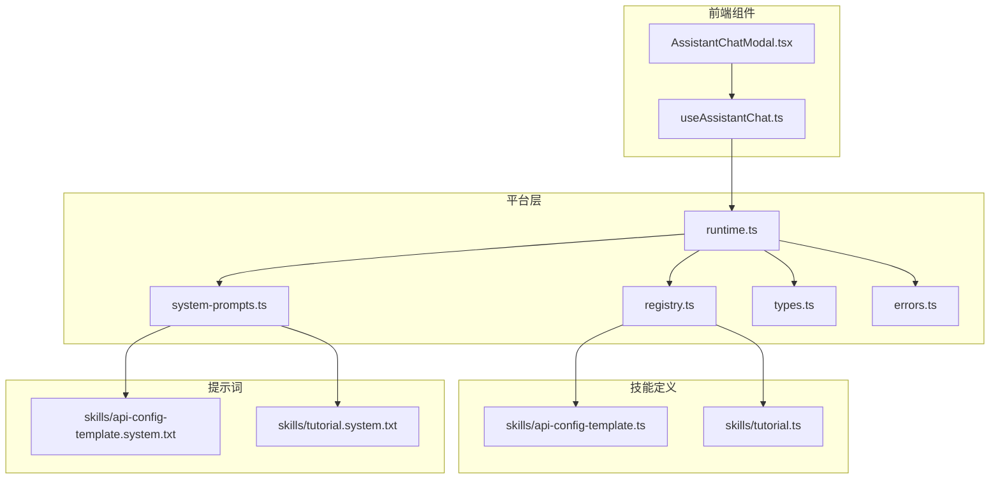
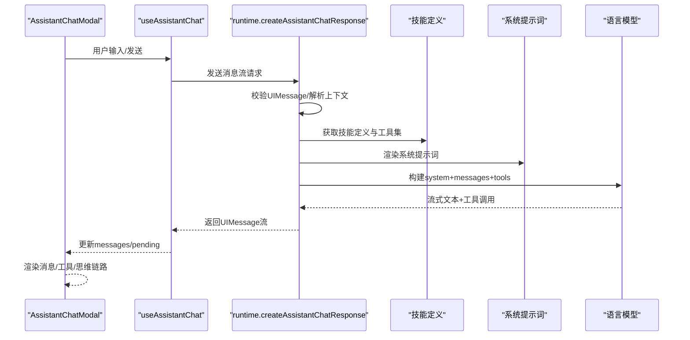
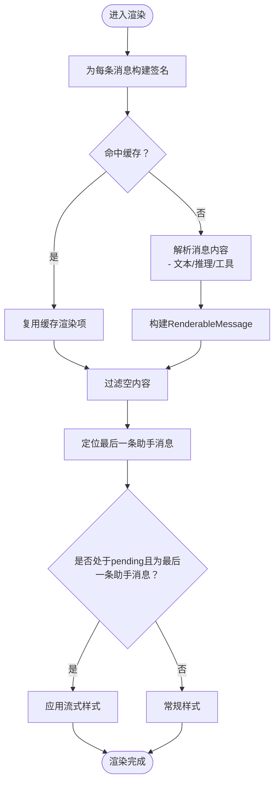
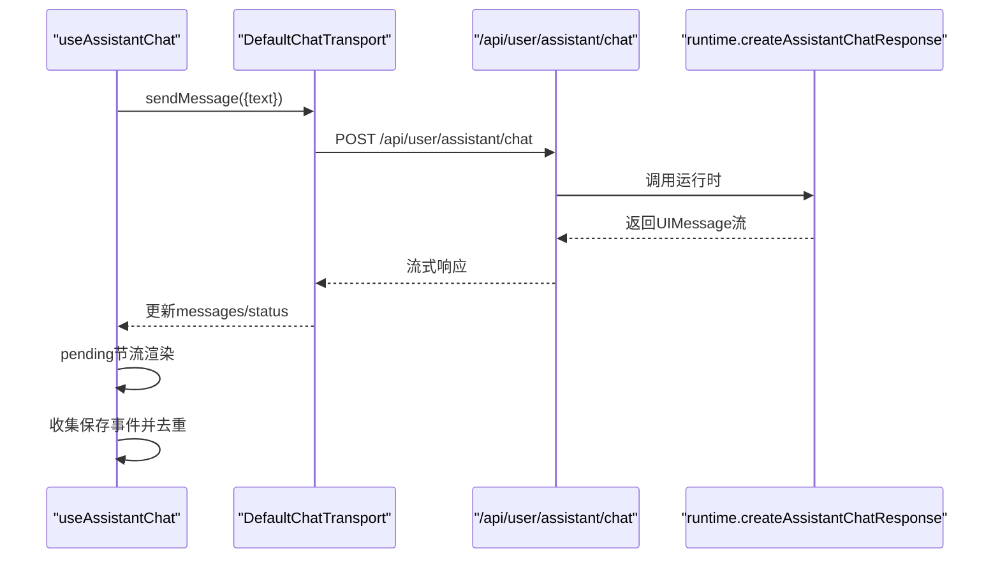
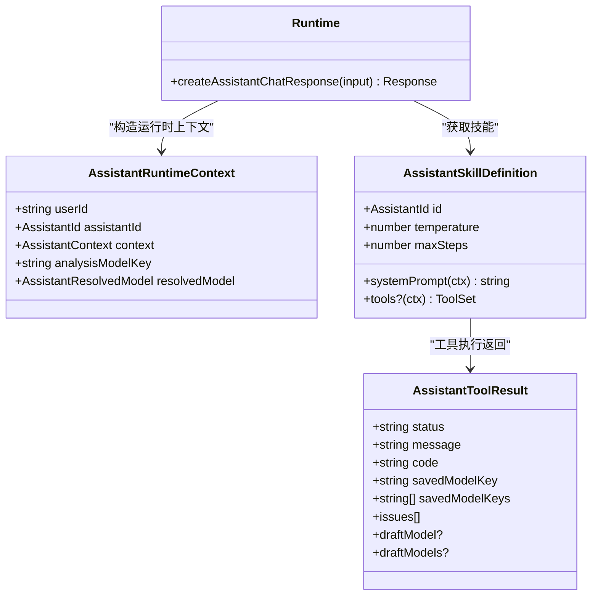
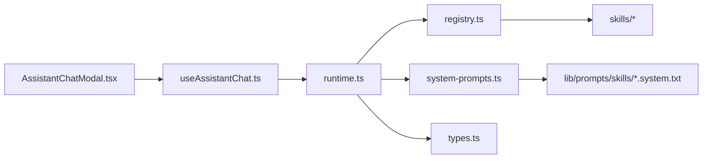

# AI助手组件

<cite>
**本文引用的文件**
- [AssistantChatModal.tsx](file://src/components/assistant/AssistantChatModal.tsx)
- [useAssistantChat.ts](file://src/components/assistant/useAssistantChat.ts)
- [runtime.ts](file://src/lib/assistant-platform/runtime.ts)
- [registry.ts](file://src/lib/assistant-platform/registry.ts)
- [system-prompts.ts](file://src/lib/assistant-platform/system-prompts.ts)
- [types.ts](file://src/lib/assistant-platform/types.ts)
- [api-config-template.ts](file://src/lib/assistant-platform/skills/api-config-template.ts)
- [tutorial.ts](file://src/lib/assistant-platform/skills/tutorial.ts)
- [api-config-template.system.txt](file://lib/prompts/skills/api-config-template.system.txt)
- [tutorial.system.txt](file://lib/prompts/skills/tutorial.system.txt)
- [errors.ts](file://src/lib/assistant-platform/errors.ts)
</cite>

## 目录
1. [简介](#简介)
2. [项目结构](#项目结构)
3. [核心组件](#核心组件)
4. [架构总览](#架构总览)
5. [详细组件分析](#详细组件分析)
6. [依赖关系分析](#依赖关系分析)
7. [性能考量](#性能考量)
8. [故障排查指南](#故障排查指南)
9. [结论](#结论)
10. [附录](#附录)

## 简介
本技术文档围绕Waoowaoo的AI助手组件展开，重点覆盖以下方面：
- AssistantChatModal：聊天对话框UI实现与渲染策略
- useAssistantChat：前端聊天状态管理与消息流控制钩子
- assistant-platform：平台层的技能注册、系统提示词、运行时与工具集
- 对话管理、上下文保持与多轮对话处理机制
- 在不同工作流阶段的作用：任务执行监控、进度提醒、错误处理
- 个性化配置、技能模板管理与对话历史记录
- 组件集成方法、自定义技能开发与性能优化策略

## 项目结构
AI助手相关代码主要分布在以下位置：
- 前端组件：src/components/assistant
- 平台能力：src/lib/assistant-platform
- 技能提示词：lib/prompts/skills/*.system.txt

图表来源
- [AssistantChatModal.tsx:1-528](file://src/components/assistant/AssistantChatModal.tsx#L1-L528)
- [useAssistantChat.ts:1-223](file://src/components/assistant/useAssistantChat.ts#L1-L223)
- [runtime.ts:1-131](file://src/lib/assistant-platform/runtime.ts#L1-L131)
- [registry.ts:1-17](file://src/lib/assistant-platform/registry.ts#L1-L17)
- [system-prompts.ts:1-47](file://src/lib/assistant-platform/system-prompts.ts#L1-L47)
- [types.ts:1-59](file://src/lib/assistant-platform/types.ts#L1-L59)
- [api-config-template.ts:1-250](file://src/lib/assistant-platform/skills/api-config-template.ts#L1-L250)
- [tutorial.ts:1-14](file://src/lib/assistant-platform/skills/tutorial.ts#L1-L14)
- [api-config-template.system.txt:1-86](file://lib/prompts/skills/api-config-template.system.txt#L1-L86)
- [tutorial.system.txt:1-5](file://lib/prompts/skills/tutorial.system.txt#L1-L5)

章节来源
- [AssistantChatModal.tsx:1-528](file://src/components/assistant/AssistantChatModal.tsx#L1-L528)
- [useAssistantChat.ts:1-223](file://src/components/assistant/useAssistantChat.ts#L1-L223)
- [runtime.ts:1-131](file://src/lib/assistant-platform/runtime.ts#L1-L131)
- [registry.ts:1-17](file://src/lib/assistant-platform/registry.ts#L1-L17)
- [system-prompts.ts:1-47](file://src/lib/assistant-platform/system-prompts.ts#L1-L47)
- [types.ts:1-59](file://src/lib/assistant-platform/types.ts#L1-L59)
- [api-config-template.ts:1-250](file://src/lib/assistant-platform/skills/api-config-template.ts#L1-L250)
- [tutorial.ts:1-14](file://src/lib/assistant-platform/skills/tutorial.ts#L1-L14)
- [api-config-template.system.txt:1-86](file://lib/prompts/skills/api-config-template.system.txt#L1-L86)
- [tutorial.system.txt:1-5](file://lib/prompts/skills/tutorial.system.txt#L1-L5)

## 核心组件
- AssistantChatModal：负责将UIMessage渲染为可读的消息块，支持思维链路折叠、工具调用面板、输入框与发送按钮、完成态与错误态展示。
- useAssistantChat：封装@ai-sdk/react的useChat，提供消息列表、输入、状态、发送与清理能力，并对工具保存事件进行去重与透传。
- assistant-platform：平台运行时，负责消息校验、模型解析、系统提示词渲染、工具集装配与流式响应生成。

章节来源
- [AssistantChatModal.tsx:270-528](file://src/components/assistant/AssistantChatModal.tsx#L270-L528)
- [useAssistantChat.ts:128-223](file://src/components/assistant/useAssistantChat.ts#L128-L223)
- [runtime.ts:77-131](file://src/lib/assistant-platform/runtime.ts#L77-L131)

## 架构总览
AI助手从“前端对话框”到“平台运行时”的整体调用链如下：

图表来源
- [AssistantChatModal.tsx:270-528](file://src/components/assistant/AssistantChatModal.tsx#L270-L528)
- [useAssistantChat.ts:128-223](file://src/components/assistant/useAssistantChat.ts#L128-L223)
- [runtime.ts:77-131](file://src/lib/assistant-platform/runtime.ts#L77-L131)
- [registry.ts:1-17](file://src/lib/assistant-platform/registry.ts#L1-L17)
- [system-prompts.ts:39-47](file://src/lib/assistant-platform/system-prompts.ts#L39-L47)

## 详细组件分析

### AssistantChatModal 对话框实现
- 职责与数据流
  - 接收UIMessage数组，按消息角色与内容拆分为可见文本、思维链路与工具调用三部分。
  - 使用签名缓存避免重复渲染，仅在消息签名变化时重建RenderableMessage。
  - 支持思维链路折叠/展开、工具调用面板展开/收起、输入框回车发送、完成态与错误态展示。
- 关键能力
  - 思维链路解析：识别<think>/<thinking>标签，分离可见文本与推理文本。
  - 工具解析：识别动态/静态工具类型与状态，渲染输入、输出与错误信息。
  - 完成态与错误态：通过completed与errorMessage参数驱动UI分支。
- 交互细节
  - 输入框禁用与发送按钮禁用由pending状态控制。
  - 最后一条助手消息高亮流式样式，提升实时反馈。

图表来源
- [AssistantChatModal.tsx:169-327](file://src/components/assistant/AssistantChatModal.tsx#L169-L327)

章节来源
- [AssistantChatModal.tsx:1-528](file://src/components/assistant/AssistantChatModal.tsx#L1-L528)

### useAssistantChat 钩子设计
- 职责与数据流
  - 基于DefaultChatTransport与@ai-sdk/react的useChat，封装消息、输入、状态与发送逻辑。
  - 在pending状态下使用requestAnimationFrame节流更新渲染消息，避免频繁重绘。
  - 提取工具保存事件，基于savedModelKey去重并透传给上层。
- 关键能力
  - 消息去抖：pending时延迟到下一帧统一渲染，保证UI流畅。
  - 保存事件收集：遍历消息parts，提取tool-saveModelTemplate(s)的输出，组装为保存事件。
  - 生命周期：clear时清理消息、错误、输入与动画帧，确保资源回收。
- 与平台的对接
  - 通过transport向/api/user/assistant/chat发起请求，携带assistantId与context。

图表来源
- [useAssistantChat.ts:128-223](file://src/components/assistant/useAssistantChat.ts#L128-L223)
- [runtime.ts:77-131](file://src/lib/assistant-platform/runtime.ts#L77-L131)

章节来源
- [useAssistantChat.ts:1-223](file://src/components/assistant/useAssistantChat.ts#L1-L223)

### assistant-platform 平台架构
- 注册中心：根据assistantId返回对应技能定义，支持扩展新技能。
- 运行时：负责消息校验、上下文归一化、模型解析（OpenAI/Gemini）、系统提示词渲染、工具集装配与流式响应。
- 类型与错误：统一的技能定义、运行时上下文、工具结果类型与错误码体系。
- 技能定义：
  - api-config-template：面向第三方API文档到模型模板的映射与保存，提供单个与批量保存工具。
  - tutorial：基础教程助手，引导用户正确操作。

图表来源
- [types.ts:1-59](file://src/lib/assistant-platform/types.ts#L1-L59)
- [runtime.ts:77-131](file://src/lib/assistant-platform/runtime.ts#L77-L131)
- [registry.ts:1-17](file://src/lib/assistant-platform/registry.ts#L1-L17)
- [api-config-template.ts:243-250](file://src/lib/assistant-platform/skills/api-config-template.ts#L243-L250)
- [tutorial.ts:8-14](file://src/lib/assistant-platform/skills/tutorial.ts#L8-L14)

章节来源
- [registry.ts:1-17](file://src/lib/assistant-platform/registry.ts#L1-L17)
- [runtime.ts:1-131](file://src/lib/assistant-platform/runtime.ts#L1-L131)
- [types.ts:1-59](file://src/lib/assistant-platform/types.ts#L1-L59)
- [errors.ts:1-18](file://src/lib/assistant-platform/errors.ts#L1-L18)
- [system-prompts.ts:1-47](file://src/lib/assistant-platform/system-prompts.ts#L1-L47)
- [api-config-template.ts:1-250](file://src/lib/assistant-platform/skills/api-config-template.ts#L1-L250)
- [tutorial.ts:1-14](file://src/lib/assistant-platform/skills/tutorial.ts#L1-L14)

### 对话管理、上下文保持与多轮对话
- 对话管理
  - UIMessage作为统一消息载体，前端通过useAssistantChat维护messages与pending状态，平台侧通过convertToModelMessages转换为模型消息。
  - 思维链路与工具调用通过消息parts承载，UI层按类型解析并渲染。
- 上下文保持
  - 上下文通过assistantId与context（如providerId、locale）传递至平台运行时，技能定义据此决定系统提示词与工具行为。
- 多轮对话
  - 平台侧限制最大步数（maxSteps），并通过温度参数控制创造性；前端在pending状态下节流渲染，保证多轮对话的流畅体验。

章节来源
- [runtime.ts:27-33](file://src/lib/assistant-platform/runtime.ts#L27-L33)
- [runtime.ts:115-122](file://src/lib/assistant-platform/runtime.ts#L115-L122)
- [useAssistantChat.ts:154-169](file://src/components/assistant/useAssistantChat.ts#L154-L169)

### 工作流阶段作用与错误处理
- 任务执行监控
  - 工具调用（如保存模型模板）返回状态与结果，前端通过collectSavedEvents提取并去重，触发上层回调。
- 进度提醒
  - pending状态控制UI显示“正在处理”，并在最后一条助手消息上应用流式样式。
- 错误处理
  - 平台侧统一抛出AssistantPlatformError，前端捕获并展示；UI层提供errorMessage分支用于显式错误提示。

章节来源
- [useAssistantChat.ts:107-115](file://src/components/assistant/useAssistantChat.ts#L107-L115)
- [useAssistantChat.ts:180-189](file://src/components/assistant/useAssistantChat.ts#L180-L189)
- [AssistantChatModal.tsx:482-486](file://src/components/assistant/AssistantChatModal.tsx#L482-L486)
- [errors.ts:1-18](file://src/lib/assistant-platform/errors.ts#L1-L18)

### 个性化配置、技能模板管理与对话历史
- 个性化配置
  - 通过context注入providerId与locale，影响系统提示词与工具可用性。
- 技能模板管理
  - api-config-template技能提供单个与批量保存工具，校验模板结构与媒体类型，保存后返回savedModelKey与draftModel供前端展示。
- 对话历史记录
  - 前端通过UIMessage数组维护历史；平台侧对消息进行校验与转换，确保历史一致性。

章节来源
- [useAssistantChat.ts:23-31](file://src/components/assistant/useAssistantChat.ts#L23-L31)
- [api-config-template.ts:66-241](file://src/lib/assistant-platform/skills/api-config-template.ts#L66-L241)
- [runtime.ts:83-91](file://src/lib/assistant-platform/runtime.ts#L83-L91)

### 集成方法、自定义技能开发与性能优化
- 集成方法
  - 在页面中引入AssistantChatModal与useAssistantChat，传入assistantId、context与回调，即可接入AI助手。
  - 通过enabled参数控制是否启用，onSaved回调接收工具保存事件。
- 自定义技能开发
  - 新增技能：在registry中注册assistantId与技能定义；在system-prompts中新增*.system.txt模板并实现渲染。
  - 工具开发：在技能定义中提供tools函数，返回ToolSet；注意输入schema校验与输出格式规范。
- 性能优化
  - 前端：pending状态节流渲染，消息签名缓存，避免重复解析。
  - 平台：限制maxSteps与temperature，减少长对话开销；工具执行前进行输入校验，降低无效调用。

章节来源
- [registry.ts:1-17](file://src/lib/assistant-platform/registry.ts#L1-L17)
- [system-prompts.ts:1-47](file://src/lib/assistant-platform/system-prompts.ts#L1-L47)
- [api-config-template.ts:1-250](file://src/lib/assistant-platform/skills/api-config-template.ts#L1-L250)
- [useAssistantChat.ts:154-169](file://src/components/assistant/useAssistantChat.ts#L154-L169)
- [runtime.ts:115-122](file://src/lib/assistant-platform/runtime.ts#L115-L122)

## 依赖关系分析
- 组件耦合
  - AssistantChatModal依赖useAssistantChat提供的messages、pending、send等状态。
  - useAssistantChat依赖runtime.ts提供的createAssistantChatResponse与registry.ts提供的技能定义。
- 外部依赖
  - @ai-sdk/react与ai库提供流式对话与工具调用能力。
  - 平台侧依赖模型网关与用户配置服务，解析provider与模型键。

图表来源
- [AssistantChatModal.tsx:1-528](file://src/components/assistant/AssistantChatModal.tsx#L1-L528)
- [useAssistantChat.ts:1-223](file://src/components/assistant/useAssistantChat.ts#L1-L223)
- [runtime.ts:1-131](file://src/lib/assistant-platform/runtime.ts#L1-L131)
- [registry.ts:1-17](file://src/lib/assistant-platform/registry.ts#L1-L17)
- [system-prompts.ts:1-47](file://src/lib/assistant-platform/system-prompts.ts#L1-L47)
- [types.ts:1-59](file://src/lib/assistant-platform/types.ts#L1-L59)

章节来源
- [AssistantChatModal.tsx:1-528](file://src/components/assistant/AssistantChatModal.tsx#L1-L528)
- [useAssistantChat.ts:1-223](file://src/components/assistant/useAssistantChat.ts#L1-L223)
- [runtime.ts:1-131](file://src/lib/assistant-platform/runtime.ts#L1-L131)
- [registry.ts:1-17](file://src/lib/assistant-platform/registry.ts#L1-L17)
- [system-prompts.ts:1-47](file://src/lib/assistant-platform/system-prompts.ts#L1-L47)
- [types.ts:1-59](file://src/lib/assistant-platform/types.ts#L1-L59)

## 性能考量
- 前端渲染
  - 使用签名缓存与节流渲染，避免高频更新导致的重排重绘。
  - 仅在存在可见内容时渲染消息，过滤空lines/reasoningLines/tools。
- 平台侧
  - 限制maxSteps与temperature，减少长对话与高复杂度推理。
  - 工具执行前进行输入校验，降低无效调用与错误重试成本。
- 网络与流式
  - 利用流式响应逐步渲染，缩短首屏等待时间；在pending状态下避免重复提交。

## 故障排查指南
- 常见错误与定位
  - ASSISTANT_INVALID_REQUEST：检查messages是否为空或格式不合法。
  - ASSISTANT_MODEL_NOT_CONFIGURED：确认用户配置analysisModel是否存在。
  - ASSISTANT_CONTEXT_REQUIRED：确认context中providerId与类型满足技能要求。
  - ASSISTANT_SKILL_NOT_FOUND：确认assistantId是否在注册表中。
- 前端排查
  - 检查pending状态与messages是否同步更新。
  - 确认onSaved回调是否被触发，savedModelKey是否去重。
- 平台排查
  - 校验系统提示词文件是否存在且非空。
  - 确认工具输入schema与输出格式符合规范。

章节来源
- [errors.ts:1-18](file://src/lib/assistant-platform/errors.ts#L1-L18)
- [runtime.ts:83-97](file://src/lib/assistant-platform/runtime.ts#L83-L97)
- [system-prompts.ts:13-30](file://src/lib/assistant-platform/system-prompts.ts#L13-L30)
- [useAssistantChat.ts:180-189](file://src/components/assistant/useAssistantChat.ts#L180-L189)

## 结论
AI助手组件通过“前端对话框 + 钩子 + 平台运行时”的分层设计，实现了稳定的多轮对话、灵活的技能扩展与可靠的工具调用。其核心优势在于：
- 明确的职责划分与清晰的数据流
- 强大的系统提示词与工具集装配能力
- 前后端协同的性能优化策略
- 可扩展的技能注册与模板保存机制

## 附录
- 提示词模板
  - api-config-template.system.txt：面向第三方API到模型模板映射的系统提示词
  - tutorial.system.txt：基础教程助手系统提示词
- 技能定义
  - api-config-template：提供单个与批量保存工具，严格校验模板结构
  - tutorial：基础引导型技能

章节来源
- [api-config-template.system.txt:1-86](file://lib/prompts/skills/api-config-template.system.txt#L1-L86)
- [tutorial.system.txt:1-5](file://lib/prompts/skills/tutorial.system.txt#L1-L5)
- [api-config-template.ts:243-250](file://src/lib/assistant-platform/skills/api-config-template.ts#L243-L250)
- [tutorial.ts:8-14](file://src/lib/assistant-platform/skills/tutorial.ts#L8-L14)