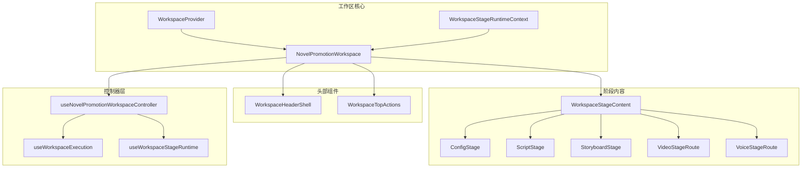
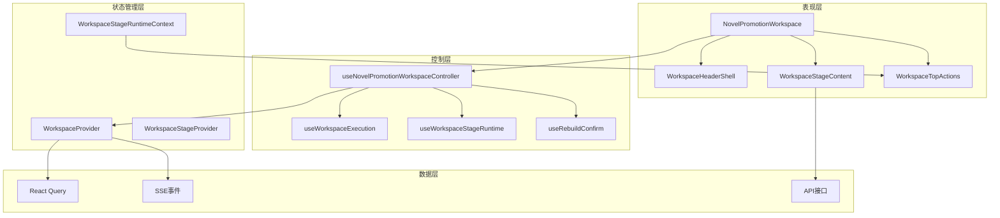
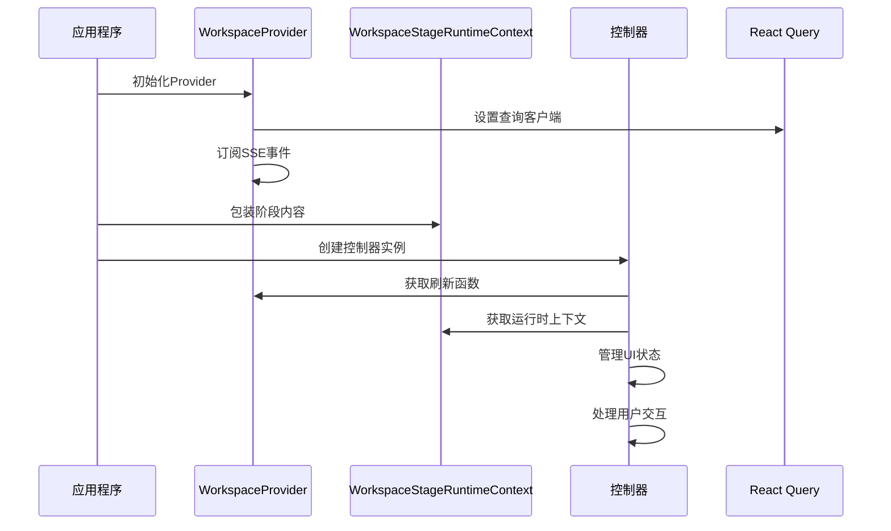
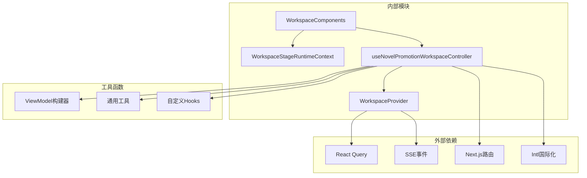

# 工作区布局系统

<cite>
**本文档引用的文件**
- [WorkspaceProvider.tsx](file://src/app/[locale]/workspace/[projectId]/modes/novel-promotion/WorkspaceProvider.tsx)
- [WorkspaceStageRuntimeContext.tsx](file://src/app/[locale]/workspace/[projectId]/modes/novel-promotion/WorkspaceStageRuntimeContext.tsx)
- [WorkspaceHeaderShell.tsx](file://src/app/[locale]/workspace/[projectId]/modes/novel-promotion/components/WorkspaceHeaderShell.tsx)
- [WorkspaceStageContent.tsx](file://src/app/[locale]/workspace/[projectId]/modes/novel-promotion/components/WorkspaceStageContent.tsx)
- [NovelPromotionWorkspace.tsx](file://src/app/[locale]/workspace/[projectId]/modes/novel-promotion/NovelPromotionWorkspace.tsx)
- [useNovelPromotionWorkspaceController.ts](file://src/app/[locale]/workspace/[projectId]/modes/novel-promotion/hooks/useNovelPromotionWorkspaceController.ts)
- [WorkspaceTopActions.tsx](file://src/app/[locale]/workspace/[projectId]/modes/novel-promotion/components/WorkspaceTopActions.tsx)
- [WorkspaceRunStreamConsoles.tsx](file://src/app/[locale]/workspace/[projectId]/modes/novel-promotion/components/WorkspaceRunStreamConsoles.tsx)
- [page.tsx](file://src/app/[locale]/workspace/[projectId]/page.tsx)
- [layout.tsx](file://src/app/[locale]/layout.tsx)
</cite>

## 目录
1. [简介](#简介)
2. [项目结构](#项目结构)
3. [核心组件](#核心组件)
4. [架构概览](#架构概览)
5. [详细组件分析](#详细组件分析)
6. [依赖关系分析](#依赖关系分析)
7. [性能考虑](#性能考虑)
8. [故障排除指南](#故障排除指南)
9. [结论](#结论)
10. [附录](#附录)

## 简介

Waoowaoo的工作区布局系统是一个基于React的现代化内容创作平台，专注于小说推广和视频生成工作流程。该系统采用模块化架构设计，通过Provider模式实现全局状态管理，支持多阶段工作流和响应式布局。

系统的核心特色包括：
- **Provider模式状态管理**：通过Context API实现全局状态共享
- **阶段化工作流**：支持配置、脚本、资产、故事板、视频、语音等多阶段
- **响应式设计**：适配多种屏幕尺寸和设备类型
- **实时协作**：基于SSE的事件驱动架构
- **动画效果**：流畅的页面过渡和交互反馈

## 项目结构

工作区布局系统主要位于以下目录结构中：



**图表来源**
- [WorkspaceProvider.tsx:36-93](file://src/app/[locale]/workspace/[projectId]/modes/novel-promotion/WorkspaceProvider.tsx#L36-L93)
- [NovelPromotionWorkspace.tsx:17-180](file://src/app/[locale]/workspace/[projectId]/modes/novel-promotion/NovelPromotionWorkspace.tsx#L17-L180)
- [WorkspaceHeaderShell.tsx:83-214](file://src/app/[locale]/workspace/[projectId]/modes/novel-promotion/components/WorkspaceHeaderShell.tsx#L83-L214)

**章节来源**
- [page.tsx:46-539](file://src/app/[locale]/workspace/[projectId]/page.tsx#L46-L539)
- [layout.tsx:1-200](file://src/app/[locale]/layout.tsx#L1-L200)

## 核心组件

### WorkspaceProvider - 全局状态管理器

WorkspaceProvider是整个工作区系统的核心状态管理组件，采用Provider模式实现全局状态共享。

**主要功能**：
- **数据刷新管理**：支持项目级和资产级的数据刷新
- **任务事件订阅**：通过SSE监听任务执行状态
- **状态同步**：维护项目和剧集的同步状态
- **生命周期管理**：处理组件挂载和卸载时的状态清理

**状态管理特性**：
- 支持三种刷新范围：'all'、'assets'、'project'
- 任务事件的多播机制
- 查询缓存的智能失效策略

**章节来源**
- [WorkspaceProvider.tsx:36-102](file://src/app/[locale]/workspace/[projectId]/modes/novel-promotion/WorkspaceProvider.tsx#L36-L102)

### WorkspaceStageRuntimeContext - 阶段运行时上下文

WorkspaceStageRuntimeContext负责管理不同工作阶段的运行时状态和操作接口。

**运行时状态**：
- `assetsLoading`: 资产加载状态
- `isSubmittingTTS`: TTS提交状态
- `isTransitioning`: 页面转换状态
- `isConfirmingAssets`: 资产确认状态
- `isStartingStoryToScript`: 故事到脚本转换启动状态
- `isStartingScriptToStoryboard`: 脚本到故事板转换启动状态

**核心操作接口**：
- 文本编辑回调
- 视频比例变更
- 艺术风格调整
- 工作流执行控制
- 资产库操作

**章节来源**
- [WorkspaceStageRuntimeContext.tsx:17-83](file://src/app/[locale]/workspace/[projectId]/modes/novel-promotion/WorkspaceStageRuntimeContext.tsx#L17-L83)

### WorkspaceHeaderShell - 头部组件设计

WorkspaceHeaderShell是工作区的顶部导航和控制面板，提供统一的用户体验。

**主要功能模块**：
- **设置模态框**：配置各种AI模型和参数
- **世界上下文模态框**：管理全局资产文本
- **剧集选择器**：在多个剧集间切换
- **胶囊导航**：阶段间快速跳转
- **顶部操作按钮**：资产库、设置、刷新操作

**响应式设计**：
- 移动端友好的紧凑布局
- 桌面端的完整功能展示
- 动态状态指示器

**章节来源**
- [WorkspaceHeaderShell.tsx:83-215](file://src/app/[locale]/workspace/[projectId]/modes/novel-promotion/components/WorkspaceHeaderShell.tsx#L83-L215)

### WorkspaceStageContent - 阶段内容容器

WorkspaceStageContent是工作区的主要内容区域，根据当前阶段动态渲染相应的内容组件。

**支持的阶段**：
- `config`: 配置阶段
- `script`: 脚本阶段  
- `assets`: 资产阶段
- `storyboard`: 故事板阶段
- `videos`: 视频阶段
- `voice`: 语音阶段

**动画效果**：
- 页面进入动画 (`animate-page-enter`)
- 平滑的阶段切换
- 状态变化的视觉反馈

**章节来源**
- [WorkspaceStageContent.tsx:13-30](file://src/app/[locale]/workspace/[projectId]/modes/novel-promotion/components/WorkspaceStageContent.tsx#L13-L30)

## 架构概览

工作区布局系统采用分层架构设计，每层都有明确的职责分工：



**图表来源**
- [NovelPromotionWorkspace.tsx:17-180](file://src/app/[locale]/workspace/[projectId]/modes/novel-promotion/NovelPromotionWorkspace.tsx#L17-L180)
- [useNovelPromotionWorkspaceController.ts:25-253](file://src/app/[locale]/workspace/[projectId]/modes/novel-promotion/hooks/useNovelPromotionWorkspaceController.ts#L25-L253)

### Provider模式实现

系统通过多个Provider实现全局状态管理：



**图表来源**
- [WorkspaceProvider.tsx:36-93](file://src/app/[locale]/workspace/[projectId]/modes/novel-promotion/WorkspaceProvider.tsx#L36-L93)
- [useNovelPromotionWorkspaceController.ts:37-40](file://src/app/[locale]/workspace/[projectId]/modes/novel-promotion/hooks/useNovelPromotionWorkspaceController.ts#L37-L40)

## 详细组件分析

### NovelPromotionWorkspace - 工作区主容器

NovelPromotionWorkspace是整个工作区的主容器组件，负责协调各个子组件的协作。

**组件层次结构**：
- WorkspaceProvider (全局状态)
- WorkspaceHeaderShell (头部控制)
- WorkspaceStageRuntimeProvider (阶段运行时)
- WorkspaceStageContent (阶段内容)
- WorkspaceAssetLibraryModal (资产库)
- WorkspaceRunStreamConsoles (运行控制台)

**动画系统**：
- 背景动画 (`AnimatedBackground`)
- 页面进入动画 (`animate-page-enter`)
- 运行控制台的最小化/展开动画
- 模态框的淡入淡出效果

**章节来源**
- [NovelPromotionWorkspace.tsx:17-181](file://src/app/[locale]/workspace/[projectId]/modes/novel-promotion/NovelPromotionWorkspace.tsx#L17-L181)

### useNovelPromotionWorkspaceController - 控制器钩子

useNovelPromotionWorkspaceController是工作区的核心控制器，负责管理复杂的状态逻辑。

**状态管理模块**：
- **项目快照** (`useWorkspaceProjectSnapshot`): 维护项目数据的稳定视图
- **执行状态** (`useWorkspaceExecution`): 管理长时间运行的任务
- **视频操作** (`useWorkspaceVideoActions`): 处理视频生成相关操作
- **资产库壳** (`useWorkspaceAssetLibraryShell`): 管理资产库的打开/关闭状态
- **阶段导航** (`useWorkspaceStageNavigation`): 处理阶段间的导航逻辑

**工作流自动化**：
- 自动运行配置检查
- 智能阶段跳转
- 错误恢复机制
- 用户会话持久化

**章节来源**
- [useNovelPromotionWorkspaceController.ts:25-253](file://src/app/[locale]/workspace/[projectId]/modes/novel-promotion/hooks/useNovelPromotionWorkspaceController.ts#L25-L253)

### WorkspaceTopActions - 顶部操作面板

WorkspaceTopActions提供便捷的操作入口，支持快速访问常用功能。

**操作功能**：
- **资产库打开**: `onOpenAssetLibrary`
- **设置面板打开**: `onOpenSettings`
- **数据刷新**: `onRefresh`

**交互设计**：
- 固定定位的悬浮按钮
- 加载状态的视觉反馈
- 成功提示的Toast通知
- 禁用状态的优雅降级

**动画效果**：
- 刷新按钮的旋转动画
- 按钮悬停的缩放效果
- 颜色过渡的平滑动画

**章节来源**
- [WorkspaceTopActions.tsx:16-74](file://src/app/[locale]/workspace/[projectId]/modes/novel-promotion/components/WorkspaceTopActions.tsx#L16-L74)

### WorkspaceRunStreamConsoles - 运行流控制台

WorkspaceRunStreamConsoles是工作区的运行时监控面板，提供详细的执行状态可视化。

**控制台类型**：
- **故事到脚本流** (`storyToScriptStream`)
- **脚本到故事板流** (`scriptToStoryboardStream`)

**功能特性**：
- 实时进度跟踪
- 错误状态显示
- 步骤重试机制
- 最小化模式
- 自动滚动到最新状态

**用户交互**：
- 步骤选择和查看详情
- 手动停止和重置
- 最小化按钮的快捷访问
- 错误重试的确认对话框

**章节来源**
- [WorkspaceRunStreamConsoles.tsx:47-248](file://src/app/[locale]/workspace/[projectId]/modes/novel-promotion/components/WorkspaceRunStreamConsoles.tsx#L47-L248)

## 依赖关系分析

工作区布局系统具有清晰的依赖关系结构：



**图表来源**
- [useNovelPromotionWorkspaceController.ts:1-253](file://src/app/[locale]/workspace/[projectId]/modes/novel-promotion/hooks/useNovelPromotionWorkspaceController.ts#L1-L253)
- [WorkspaceProvider.tsx:1-102](file://src/app/[locale]/workspace/[projectId]/modes/novel-promotion/WorkspaceProvider.tsx#L1-L102)

### 组件耦合度分析

**低耦合设计**：
- 各组件通过Context API进行松散耦合
- 控制器层集中处理复杂逻辑
- 组件间通过props传递数据
- 事件通过回调函数传播

**内聚性优化**：
- 相关功能集中在对应的Hook中
- 状态管理与UI逻辑分离
- 业务逻辑与展示逻辑分离
- 可复用的功能提取为独立模块

**潜在循环依赖**：
- 通过层级结构避免直接循环依赖
- 控制器作为中介层协调各组件
- Context API提供单向数据流

**章节来源**
- [WorkspaceProvider.tsx:36-93](file://src/app/[locale]/workspace/[projectId]/modes/novel-promotion/WorkspaceProvider.tsx#L36-L93)
- [useNovelPromotionWorkspaceController.ts:8-25](file://src/app/[locale]/workspace/[projectId]/modes/novel-promotion/hooks/useNovelPromotionWorkspaceController.ts#L8-L25)

## 性能考虑

### 渲染性能优化

**懒加载策略**：
- 阶段内容按需渲染
- 模态框延迟初始化
- 图片和媒体资源的延迟加载
- 大数据集的虚拟化处理

**状态更新优化**：
- 使用useMemo和useCallback避免不必要的重渲染
- 精确的状态分割减少更新范围
- 批量状态更新合并
- 事件防抖和节流

**内存管理**：
- 组件卸载时清理定时器和事件监听器
- 查询缓存的智能清理策略
- 大对象的及时释放
- 内存泄漏的预防措施

### 网络性能优化

**请求优化**：
- React Query的缓存和预取
- 批量API请求合并
- 条件请求和ETag支持
- 错误重试和退避策略

**实时通信**：
- SSE连接的重连机制
- 事件去重和排序
- 离线状态的处理
- 连接池的管理

## 故障排除指南

### 常见问题诊断

**状态不同步问题**：
- 检查WorkspaceProvider的刷新函数调用
- 验证Context Provider的嵌套顺序
- 确认查询缓存的有效性
- 检查SSE事件的接收情况

**阶段切换异常**：
- 验证URL参数的正确性
- 检查阶段导航的状态管理
- 确认路由参数的同步
- 验证阶段权限控制

**性能问题排查**：
- 使用React DevTools分析渲染树
- 检查内存使用情况
- 监控网络请求的性能
- 分析事件循环的阻塞

### 错误处理机制

**用户可见错误**：
- Toast通知的错误提示
- 错误边界的应用
- 友好的错误页面
- 重试机制的提供

**系统级错误**：
- 控制台日志记录
- 错误上报机制
- 自动恢复策略
- 降级模式的启用

**章节来源**
- [WorkspaceRunStreamConsoles.tsx:125-138](file://src/app/[locale]/workspace/[projectId]/modes/novel-promotion/components/WorkspaceRunStreamConsoles.tsx#L125-L138)
- [WorkspaceTopActions.tsx:32-43](file://src/app/[locale]/workspace/[projectId]/modes/novel-promotion/components/WorkspaceTopActions.tsx#L32-L43)

## 结论

Waoowaoo的工作区布局系统展现了现代前端架构的最佳实践，通过精心设计的分层结构和模块化组件实现了高度的可维护性和可扩展性。

**系统优势**：
- **清晰的架构层次**：从Provider到控制器再到UI组件的清晰分层
- **强大的状态管理**：通过Context API和React Query实现复杂状态的统一管理
- **优秀的用户体验**：流畅的动画效果和响应式的交互设计
- **完善的错误处理**：多层次的错误捕获和用户友好的提示机制

**技术亮点**：
- Provider模式的深度应用
- 阶段化工作流的设计理念
- 实时协作的SSE架构
- 模块化的组件设计

该系统为类似的内容创作平台提供了优秀的参考模板，其设计理念和实现方式值得在其他项目中借鉴和应用。

## 附录

### 扩展点和自定义指南

**添加新阶段**：
1. 在WorkspaceStageContent中添加新的阶段映射
2. 创建对应的阶段组件
3. 在胶囊导航中注册新阶段
4. 实现阶段特定的运行时逻辑

**自定义组件集成**：
1. 通过WorkspaceStageRuntimeContext扩展运行时接口
2. 在控制器中添加新的Hook处理逻辑
3. 通过Props传递自定义配置
4. 实现相应的状态管理和事件处理

**配置示例**：
```typescript
// 新增阶段配置
const customStageConfig = {
  id: 'custom',
  icon: 'custom-icon',
  label: '自定义阶段',
  status: 'empty' | 'active' | 'processing' | 'ready'
}

// 自定义运行时操作
const customRuntime = {
  ...baseRuntime,
  onCustomAction: async (params) => {
    // 自定义操作逻辑
  }
}
```

**最佳实践建议**：
- 保持组件的单一职责原则
- 使用TypeScript确保类型安全
- 实现完整的错误边界处理
- 提供充足的用户反馈和状态指示
- 考虑性能优化和内存管理
- 编写充分的单元测试和集成测试