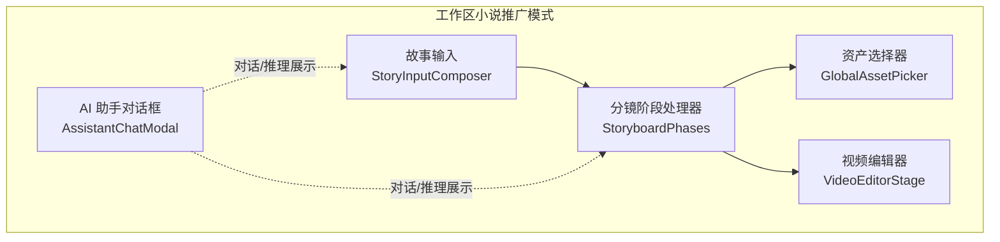
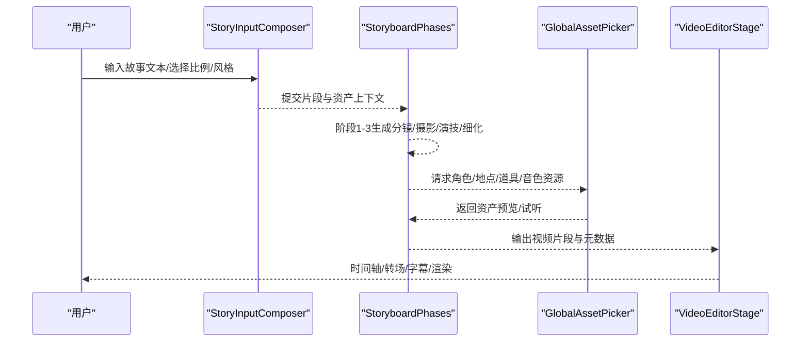
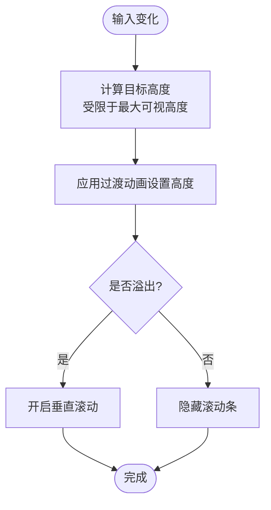
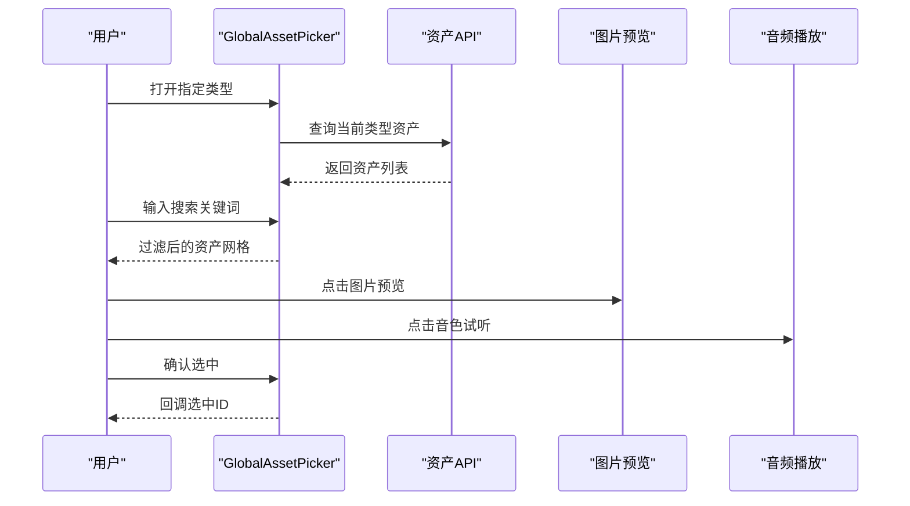
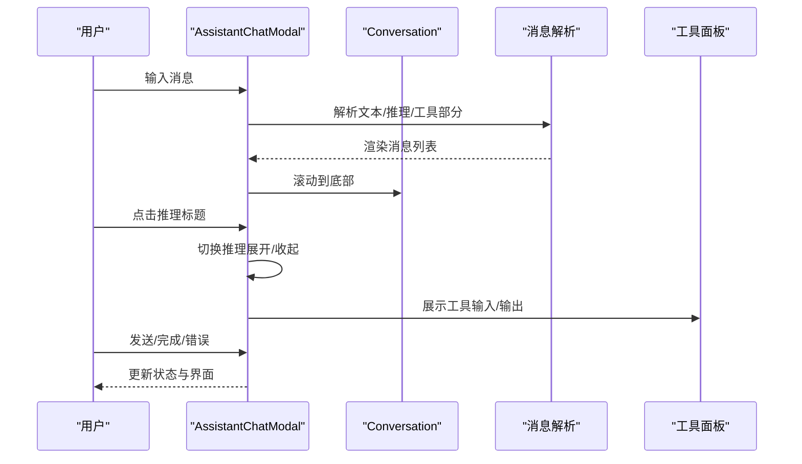
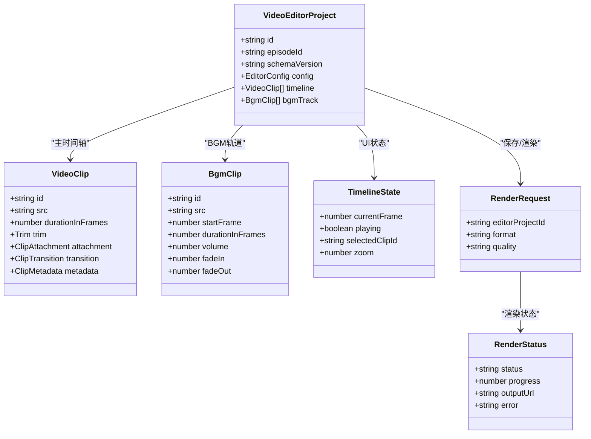
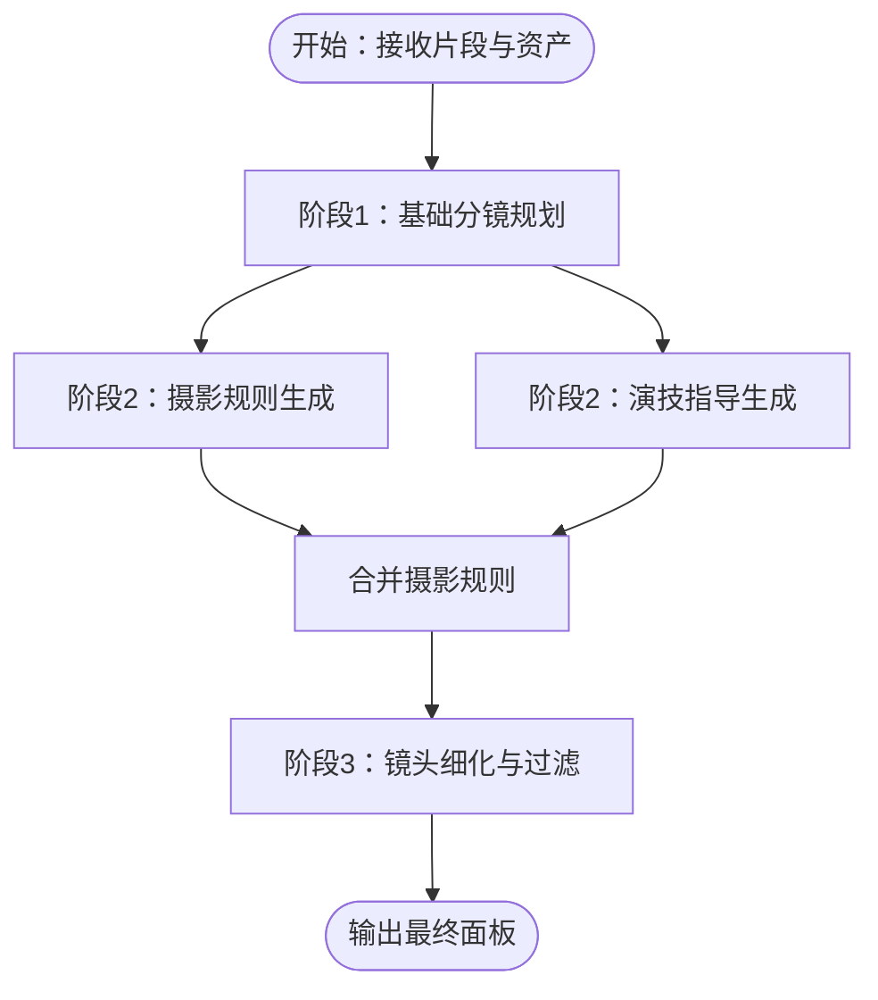
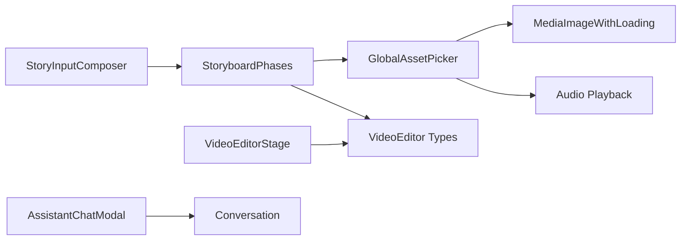

# 工作区组件

<cite>
**本文引用的文件**
- [src/app/[locale]/workspace/[projectId]/modes/novel-promotion/components/assets/hooks/index.ts](file://src/app/[locale]/workspace/[projectId]/modes/novel-promotion/components/assets/hooks/index.ts)
- [src/app/[locale]/workspace/[projectId]/modes/novel-promotion/components/video/index.ts](file://src/app/[locale]/workspace/[projectId]/modes/novel-promotion/components/video/index.ts)
- [src/components/story-input/StoryInputComposer.tsx](file://src/components/story-input/StoryInputComposer.tsx)
- [src/components/shared/assets/GlobalAssetPicker.tsx](file://src/components/shared/assets/GlobalAssetPicker.tsx)
- [src/components/assistant/AssistantChatModal.tsx](file://src/components/assistant/AssistantChatModal.tsx)
- [src/components/ai-elements/conversation.tsx](file://src/components/ai-elements/conversation.tsx)
- [src/features/video-editor/index.ts](file://src/features/video-editor/index.ts)
- [src/features/video-editor/types/editor.types.ts](file://src/features/video-editor/types/editor.types.ts)
- [src/lib/storyboard-phases.ts](file://src/lib/storyboard-phases.ts)
- [src/types/storyboard-types.ts](file://src/types/storyboard-types.ts)
</cite>

## 目录
1. [引言](#引言)
2. [项目结构](#项目结构)
3. [核心组件](#核心组件)
4. [架构总览](#架构总览)
5. [详细组件分析](#详细组件分析)
6. [依赖关系分析](#依赖关系分析)
7. [性能考量](#性能考量)
8. [故障排查指南](#故障排查指南)
9. [结论](#结论)
10. [附录](#附录)

## 引言
本技术文档聚焦于小说推广工作流中的“工作区组件”，系统性梳理故事输入组件、资产选择器、AI 助手对话框以及视频编辑器等核心模块的架构与实现。文档从布局设计、状态管理、数据流、职责划分与交互逻辑入手，辅以可视化图示，帮助开发者快速理解并扩展工作区能力；同时提供可扩展性设计建议与自定义组件集成方法，并给出典型使用场景与组件组合示例。

## 项目结构
工作区位于多语言路由下的工作空间页面，小说推广模式作为主要业务域，围绕“故事输入 → 分镜生成 → 资产选择 → 视频编辑”形成闭环。关键目录与文件如下：
- 故事输入：StoryInputComposer 提供文本输入、比例与风格选择、主次操作区。
- 资产选择：GlobalAssetPicker 提供全局资产（角色/地点/道具/音色）选择与预览。
- AI 助手：AssistantChatModal 与 conversation 子组件构成对话容器与滚动控制。
- 视频编辑：VideoEditorStage、VideoEditorProject 类型与工具函数构成编辑器骨架。
- 分镜流程：StoryboardPhases 将分镜生成拆分为三个阶段，保证长文本与并发控制。

图表来源
- [src/components/story-input/StoryInputComposer.tsx:1-173](file://src/components/story-input/StoryInputComposer.tsx#L1-L173)
- [src/components/shared/assets/GlobalAssetPicker.tsx:1-559](file://src/components/shared/assets/GlobalAssetPicker.tsx#L1-L559)
- [src/components/assistant/AssistantChatModal.tsx:1-528](file://src/components/assistant/AssistantChatModal.tsx#L1-L528)
- [src/features/video-editor/index.ts:1-43](file://src/features/video-editor/index.ts#L1-L43)
- [src/lib/storyboard-phases.ts:1-705](file://src/lib/storyboard-phases.ts#L1-L705)

章节来源
- [src/app/[locale]/workspace/[projectId]/modes/novel-promotion/components/assets/hooks/index.ts](file://src/app/[locale]/workspace/[projectId]/modes/novel-promotion/components/assets/hooks/index.ts#L1-L11)
- [src/app/[locale]/workspace/[projectId]/modes/novel-promotion/components/video/index.ts](file://src/app/[locale]/workspace/[projectId]/modes/novel-promotion/components/video/index.ts#L1-L6)

## 核心组件
- 故事输入组件（StoryInputComposer）
  - 职责：提供可伸缩文本域、视频比例与艺术风格选择、样式预设、顶部/底部/右侧操作区。
  - 关键属性：值、占位符、最小行数、禁用态、最大高度占比、回调、比例/风格/预设选项。
  - 交互：输入变化、拼音输入开始/结束、自动高度计算与溢出控制。
- 资产选择器（GlobalAssetPicker）
  - 职责：按类型筛选并展示角色/地点/道具/音色资产，支持搜索、预览、试听、任务状态指示。
  - 关键属性：是否打开、关闭回调、选中回调、类型、外部加载态。
  - 交互：搜索过滤、选中高亮、图片放大预览、音色播放/暂停。
- AI 助手对话框（AssistantChatModal + Conversation）
  - 职责：承载消息流、推理折叠、工具调用面板、输入与发送控制。
  - 关键属性：标题/副标题、消息列表、输入值、发送状态、完成态/错误态、回调。
  - 交互：键盘提交、滚动到底部、推理展开/收起、工具输入/输出展示。
- 视频编辑器（VideoEditorStage + 类型与工具）
  - 职责：时间轴与BGM轨道管理、转场与附件（配音/字幕）、渲染与保存。
  - 关键类型：VideoEditorProject、VideoClip、BgmClip、TimelineState、RenderRequest/Status。
  - 工具：时长计算、帧与时长换算、默认项目创建、迁移与校验。
- 分镜阶段处理器（StoryboardPhases）
  - 职责：将分镜生成拆分为三个阶段（规划/摄影/演技/细化），并进行重试与日志记录。
  - 关键类型：StoryboardPanel、PhotographyRule、ActingDirection、PhaseResult。
  - 流程：阶段1生成基础分镜 → 阶段2生成摄影规则/演技指导 → 阶段3细化并过滤无效分镜。

章节来源
- [src/components/story-input/StoryInputComposer.tsx:1-173](file://src/components/story-input/StoryInputComposer.tsx#L1-L173)
- [src/components/shared/assets/GlobalAssetPicker.tsx:1-559](file://src/components/shared/assets/GlobalAssetPicker.tsx#L1-L559)
- [src/components/assistant/AssistantChatModal.tsx:1-528](file://src/components/assistant/AssistantChatModal.tsx#L1-L528)
- [src/components/ai-elements/conversation.tsx:1-154](file://src/components/ai-elements/conversation.tsx#L1-L154)
- [src/features/video-editor/index.ts:1-43](file://src/features/video-editor/index.ts#L1-L43)
- [src/features/video-editor/types/editor.types.ts:1-141](file://src/features/video-editor/types/editor.types.ts#L1-L141)
- [src/lib/storyboard-phases.ts:1-705](file://src/lib/storyboard-phases.ts#L1-L705)
- [src/types/storyboard-types.ts:1-49](file://src/types/storyboard-types.ts#L1-L49)

## 架构总览
工作区采用“输入-生成-选择-编辑”的流水线式架构：
- 输入层：StoryInputComposer 负责收集故事文本、比例与风格。
- 生成层：StoryboardPhases 将输入转化为分镜计划，期间通过 AI 推理与工具调用完善摄影与演技细节。
- 选择层：GlobalAssetPicker 提供全局资产检索与试听/预览，支撑分镜所需角色/地点/道具/音色。
- 编辑层：VideoEditorStage 基于分镜与资产生成视频剪辑，支持转场、附件与渲染。

图表来源
- [src/components/story-input/StoryInputComposer.tsx:1-173](file://src/components/story-input/StoryInputComposer.tsx#L1-L173)
- [src/lib/storyboard-phases.ts:1-705](file://src/lib/storyboard-phases.ts#L1-L705)
- [src/components/shared/assets/GlobalAssetPicker.tsx:1-559](file://src/components/shared/assets/GlobalAssetPicker.tsx#L1-L559)
- [src/features/video-editor/index.ts:1-43](file://src/features/video-editor/index.ts#L1-L43)

## 详细组件分析

### 故事输入组件（StoryInputComposer）
- 设计要点
  - 可伸缩文本域：根据内容高度动态调整，结合最大可视高度限制，避免遮挡。
  - 选择器组合：视频比例、艺术风格与风格预设三选一，支持用量提示与预设切换。
  - 布局分区：顶部右侧操作、中部输入区、底部操作区与次要/主要操作按钮。
- 状态与数据流
  - 外部通过 value/onValueChange 控制与更新文本。
  - 比例/风格/预设变更通过对应回调同步到上层。
  - 自动高度计算在每次值变化后触发，确保滚动与溢出行为一致。
- 交互与事件
  - 支持拼音输入开始/结束事件透传，便于输入法体验优化。
  - 支持禁用态与自定义类名，适配不同工作区主题。

图表来源
- [src/components/story-input/StoryInputComposer.tsx:73-104](file://src/components/story-input/StoryInputComposer.tsx#L73-L104)

章节来源
- [src/components/story-input/StoryInputComposer.tsx:1-173](file://src/components/story-input/StoryInputComposer.tsx#L1-L173)

### 资产选择器（GlobalAssetPicker）
- 设计要点
  - 按类型加载：仅在当前类型下发起查询，避免冗余请求。
  - 搜索过滤：支持名称与音色描述关键词过滤。
  - 预览与试听：图片网格预览，音色卡片内置试听按钮与性别标签。
  - 任务状态：基于任务呈现状态显示加载指示，统一视觉反馈。
- 状态与数据流
  - 打开/关闭：打开时拉取对应类型资产，关闭时停止音频播放。
  - 选中态：单选高亮，确认后回调选中 ID。
  - 加载态：内部加载与外部加载态叠加，统一显示处理中。
- 交互与事件
  - 点击卡片选中，点击图片可放大预览。
  - 音频播放/暂停与错误处理，自动清理资源。

图表来源
- [src/components/shared/assets/GlobalAssetPicker.tsx:89-128](file://src/components/shared/assets/GlobalAssetPicker.tsx#L89-L128)
- [src/components/shared/assets/GlobalAssetPicker.tsx:225-254](file://src/components/shared/assets/GlobalAssetPicker.tsx#L225-L254)

章节来源
- [src/components/shared/assets/GlobalAssetPicker.tsx:1-559](file://src/components/shared/assets/GlobalAssetPicker.tsx#L1-L559)

### AI 助手对话框（AssistantChatModal + Conversation）
- 设计要点
  - 消息解析：支持 think 标签包裹的推理内容与文本消息分离。
  - 推理折叠：每个消息可展开/收起推理内容，提升阅读效率。
  - 工具面板：动态工具类型与状态（审批/输入流/输出可用/错误/拒绝）。
  - 滚动控制：Conversation/Content/ScrollButton 提供智能滚动与“跳到底部”按钮。
- 状态与数据流
  - 消息缓存：基于签名缓存渲染结果，避免重复解析与重绘。
  - 待定态：最后一条助手消息在流式输出时显示“待定”标签。
  - 完成态：完成后展示完成徽章与关闭按钮。
- 交互与事件
  - 键盘提交：Shift+Enter 换行，Enter 发送。
  - 展开/收起：点击推理标题切换状态。
  - 工具交互：工具面板根据状态自动展开或折叠。

图表来源
- [src/components/assistant/AssistantChatModal.tsx:270-332](file://src/components/assistant/AssistantChatModal.tsx#L270-L332)
- [src/components/ai-elements/conversation.tsx:44-87](file://src/components/ai-elements/conversation.tsx#L44-L87)

章节来源
- [src/components/assistant/AssistantChatModal.tsx:1-528](file://src/components/assistant/AssistantChatModal.tsx#L1-L528)
- [src/components/ai-elements/conversation.tsx:1-154](file://src/components/ai-elements/conversation.tsx#L1-L154)

### 视频编辑器（VideoEditorStage + 类型与工具）
- 设计要点
  - 项目模型：VideoEditorProject 包含配置、主时间轴与BGM轨道。
  - 片段模型：VideoClip 支持素材裁剪、附件（配音/字幕）、转场与元数据。
  - UI 状态：TimelineState 管理当前帧、播放状态、选中片段与缩放。
  - 工具函数：时长/帧换算、默认项目创建、迁移与校验。
- 状态与数据流
  - 保存：SaveEditorProjectRequest 提交项目数据。
  - 渲染：RenderRequest 指定格式与质量，RenderStatus 返回进度/结果。
- 交互与事件
  - 时间轴选择与拖拽、转场设置、附件编辑、BGM轨道管理。

图表来源
- [src/features/video-editor/types/editor.types.ts:9-141](file://src/features/video-editor/types/editor.types.ts#L9-L141)
- [src/features/video-editor/index.ts:6-42](file://src/features/video-editor/index.ts#L6-L42)

章节来源
- [src/features/video-editor/index.ts:1-43](file://src/features/video-editor/index.ts#L1-L43)
- [src/features/video-editor/types/editor.types.ts:1-141](file://src/features/video-editor/types/editor.types.ts#L1-L141)

### 分镜阶段处理器（StoryboardPhases）
- 设计要点
  - 阶段化：阶段1（规划）→ 阶段2（摄影/演技并行）→ 阶段3（细化与过滤）。
  - 重试策略：每个阶段最多失败重试一次，确保稳定性。
  - 日志记录：记录提示词与输出，便于审计与复现。
- 状态与数据流
  - 输入：片段信息、资产库、会话信息、项目上下文。
  - 输出：阶段结果（包含 panels/photography/acting/finalPanels）。
- 交互与事件
  - 并行执行阶段2子任务（摄影/演技），随后合并摄影规则与最终面板。

图表来源
- [src/lib/storyboard-phases.ts:244-387](file://src/lib/storyboard-phases.ts#L244-L387)
- [src/lib/storyboard-phases.ts:389-487](file://src/lib/storyboard-phases.ts#L389-L487)
- [src/lib/storyboard-phases.ts:489-573](file://src/lib/storyboard-phases.ts#L489-L573)
- [src/lib/storyboard-phases.ts:575-704](file://src/lib/storyboard-phases.ts#L575-L704)

章节来源
- [src/lib/storyboard-phases.ts:1-705](file://src/lib/storyboard-phases.ts#L1-L705)
- [src/types/storyboard-types.ts:1-49](file://src/types/storyboard-types.ts#L1-L49)

## 依赖关系分析
- 组件耦合
  - StoryInputComposer 与 StoryboardPhases 通过片段与资产上下文解耦，仅传递必要字段。
  - GlobalAssetPicker 与资产 API 解耦，仅在打开时按需查询，避免全局状态污染。
  - AssistantChatModal 与 Conversation 通过上下文共享滚动状态，降低重复计算。
  - VideoEditorStage 与 editor.types/index 通过导出类型与工具函数解耦，便于扩展。
- 外部依赖
  - React Query 用于资产查询与缓存。
  - 媒体组件（图片/音频）封装加载与播放，统一错误处理。
- 潜在循环依赖
  - 当前文件未见直接循环导入；若新增跨模块引用，应通过公共导出或拆分模块规避。

图表来源
- [src/components/story-input/StoryInputComposer.tsx:1-173](file://src/components/story-input/StoryInputComposer.tsx#L1-L173)
- [src/lib/storyboard-phases.ts:1-705](file://src/lib/storyboard-phases.ts#L1-L705)
- [src/components/shared/assets/GlobalAssetPicker.tsx:1-559](file://src/components/shared/assets/GlobalAssetPicker.tsx#L1-L559)
- [src/features/video-editor/index.ts:1-43](file://src/features/video-editor/index.ts#L1-L43)
- [src/components/assistant/AssistantChatModal.tsx:1-528](file://src/components/assistant/AssistantChatModal.tsx#L1-L528)
- [src/components/ai-elements/conversation.tsx:1-154](file://src/components/ai-elements/conversation.tsx#L1-L154)

章节来源
- [src/app/[locale]/workspace/[projectId]/modes/novel-promotion/components/assets/hooks/index.ts](file://src/app/[locale]/workspace/[projectId]/modes/novel-promotion/components/assets/hooks/index.ts#L1-L11)
- [src/app/[locale]/workspace/[projectId]/modes/novel-promotion/components/video/index.ts](file://src/app/[locale]/workspace/[projectId]/modes/novel-promotion/components/video/index.ts#L1-L6)

## 性能考量
- 渲染优化
  - StoryInputComposer 使用 requestAnimationFrame 与过渡动画控制高度变化，避免频繁重排。
  - AssistantChatModal 通过消息签名缓存与条件渲染，减少重复解析与重绘。
  - GlobalAssetPicker 在打开时才发起查询，关闭时释放音频资源，降低内存占用。
- 网络与任务
  - 分镜阶段处理器对每个阶段进行最多一次重试，平衡稳定性与耗时。
  - VideoEditor 工具函数提供帧与时长换算与默认项目创建，减少计算开销。
- 可扩展性
  - 类型导出与工具函数集中管理，便于替换底层实现而不影响上层组件。
  - 组件通过 props 与回调解耦，易于替换或扩展功能。

## 故障排查指南
- 文本域高度异常
  - 检查最大可视高度比例与初始最小高度是否正确设置。
  - 确认自动高度计算逻辑未被外部样式覆盖导致溢出判断错误。
- 资产选择器无结果
  - 确认当前类型与查询参数匹配，检查网络请求与错误提示。
  - 若搜索无结果，确认关键词大小写与描述字段是否包含目标内容。
- AI 助手消息不显示
  - 检查消息解析逻辑是否正确识别 think 标签与工具输出。
  - 确认消息签名缓存未阻塞渲染，必要时清理缓存重新渲染。
- 分镜生成失败
  - 查看阶段日志与重试记录，确认提示词模板与资产上下文是否完整。
  - 检查最终面板过滤逻辑，确保有效分镜数量大于零。
- 视频编辑渲染异常
  - 校验 RenderRequest 参数与 RenderStatus 状态机，关注错误信息与进度条。
  - 确认项目数据版本与迁移函数是否正确应用。

章节来源
- [src/components/story-input/StoryInputComposer.tsx:73-104](file://src/components/story-input/StoryInputComposer.tsx#L73-L104)
- [src/components/shared/assets/GlobalAssetPicker.tsx:181-199](file://src/components/shared/assets/GlobalAssetPicker.tsx#L181-L199)
- [src/components/assistant/AssistantChatModal.tsx:298-318](file://src/components/assistant/AssistantChatModal.tsx#L298-L318)
- [src/lib/storyboard-phases.ts:366-371](file://src/lib/storyboard-phases.ts#L366-L371)
- [src/features/video-editor/types/editor.types.ts:125-141](file://src/features/video-editor/types/editor.types.ts#L125-L141)

## 结论
工作区组件围绕“输入-生成-选择-编辑”的闭环构建，通过清晰的职责划分与状态管理，实现了小说推广流程的高效协作。StoryInputComposer 提供灵活的输入体验，GlobalAssetPicker 实现资产检索与预览，AssistantChatModal 保障推理与工具展示，VideoEditorStage 与类型体系支撑视频创作。StoryboardPhases 将复杂分镜生成拆分为可控阶段，配合重试与日志，显著提升了稳定性与可观测性。整体架构具备良好的可扩展性与可维护性，适合进一步集成自定义组件与第三方服务。

## 附录
- 使用场景与组件组合示例
  - 场景一：从故事输入到视频渲染
    - 步骤：输入文本 → 生成分镜 → 选择角色/地点/道具/音色 → 导入片段到视频编辑器 → 设置转场与字幕 → 渲染输出。
  - 场景二：AI 助手辅助优化
    - 步骤：在输入与分镜阶段调用助手对话框，查看推理与工具输出，确认后继续流程。
  - 场景三：资产复用与预览
    - 步骤：在资产选择器中搜索并试听音色，预览图片后复制到工作区使用。
- 可扩展性设计与自定义组件集成
  - 新增资产类型：在 GlobalAssetPicker 中扩展类型分支与预览逻辑。
  - 新增视频效果：在 VideoEditorStage 中扩展转场与附件类型，并完善类型与工具函数。
  - 新增阶段：在 StoryboardPhases 中新增阶段函数与提示词模板，保持重试与日志规范。
  - 新增对话元素：在 AssistantChatModal 中扩展工具类型与面板渲染，复用 Conversation 上下文。