# 工作区组件

<cite>
**本文引用的文件**
- [src/app/[locale]/workspace/[projectId]/modes/novel-promotion/components/assets/hooks/index.ts](file://src/app/[locale]/workspace/[projectId]/modes/novel-promotion/components/assets/hooks/index.ts)
- [src/app/[locale]/workspace/[projectId]/modes/novel-promotion/components/video/index.ts](file://src/app/[locale]/workspace/[projectId]/modes/novel-promotion/components/video/index.ts)
- [src/components/story-input/StoryInputComposer.tsx](file://src/components/story-input/StoryInputComposer.tsx)
- [src/components/shared/assets/GlobalAssetPicker.tsx](file://src/components/shared/assets/GlobalAssetPicker.tsx)
- [src/components/assistant/AssistantChatModal.tsx](file://src/components/assistant/AssistantChatModal.tsx)
- [src/components/ai-elements/conversation.tsx](file://src/components/ai-elements/conversation.tsx)
- [src/features/video-editor/index.ts](file://src/features/video-editor/index.ts)
- [src/features/video-editor/types/editor.types.ts](file://src/features/video-editor/types/editor.types.ts)
- [src/lib/storyboard-phases.ts](file://src/lib/storyboard-phases.ts)
- [src/types/storyboard-types.ts](file://src/types/storyboard-types.ts)
- [src/components/ui/CapsuleNav.tsx](file://src/components/ui/CapsuleNav.tsx)
- [src/components/ui/SegmentedControl.tsx](file://src/components/ui/SegmentedControl.tsx)
- [src/app/[locale]/workspace/[projectId]/episode-selection.ts](file://src/app/[locale]/workspace/[projectId]/episode-selection.ts)
- [src/lib/episode-marker-detector.ts](file://src/lib/episode-marker-detector.ts)
- [src/app/[locale]/workspace/[projectId]/page.tsx](file://src/app/[locale]/workspace/[projectId]/page.tsx)
- [src/components/Navbar.tsx](file://src/components/Navbar.tsx)
- [src/app/[locale]/workspace/[projectId]/modes/novel-promotion/NovelPromotionWorkspace.tsx](file://src/app/[locale]/workspace/[projectId]/modes/novel-promotion/NovelPromotionWorkspace.tsx)
- [src/app/[locale]/workspace/[projectId]/modes/novel-promotion/components/WorkspaceHeaderShell.tsx](file://src/app/[locale]/workspace/[projectId]/modes/novel-promotion/components/WorkspaceHeaderShell.tsx)
</cite>

## 更新摘要
**所做更改**
- 新增 SegmentedControl 组件章节，详细介绍统一的 iOS 风格分段控制器
- 更新胶囊导航增强章节，反映从传统按钮布局到 SegmentedControl 风格滑动 pill 指示器的重大 UI 改进
- 更新剧集选择器改进章节，涵盖 EpisodeSelector 的完全重构和状态管理增强
- 新增 React hooks 动态定位计算章节，说明滑动指示器的位置计算机制
- 更新工作区架构总览，反映新的导航系统和统一的 UI 设计语言
- 新增智能导入向导和分集标记检测功能
- 更新组件间通信机制和状态管理模式

## 目录
1. [引言](#引言)
2. [项目结构](#项目结构)
3. [核心组件](#核心组件)
4. [架构总览](#架构总览)
5. [详细组件分析](#详细组件分析)
6. [依赖关系分析](#依赖关系分析)
7. [性能考量](#性能考量)
8. [故障排查指南](#故障排查指南)
9. [结论](#结论)
10. [附录](#附录)

## 引言
本技术文档聚焦于小说推广工作流中的"工作区组件"，系统性梳理故事输入组件、资产选择器、AI 助手对话框以及视频编辑器等核心模块的架构与实现。本次更新重点反映了工作区组件系统的重大改进：从传统按钮布局转换为 SegmentedControl 风格的滑动 pill 指示器系统、剧集选择器的完全重构、React hooks 动态定位计算的引入，以及统一的 iOS 风格 UI 设计语言。文档从布局设计、状态管理、数据流、职责划分与交互逻辑入手，辅以可视化图示，帮助开发者快速理解并扩展工作区能力；同时提供可扩展性设计建议与自定义组件集成方法，并给出典型使用场景与组件组合示例。

## 项目结构
工作区位于多语言路由下的工作空间页面，小说推广模式作为主要业务域，围绕"故事输入 → 分镜生成 → 资产选择 → 视频编辑"形成闭环。关键目录与文件如下：
- 故事输入：StoryInputComposer 提供文本输入、比例与风格选择、主次操作区。
- 资产选择：GlobalAssetPicker 提供全局资产（角色/地点/道具/音色）选择与预览。
- AI 助手：AssistantChatModal 与 conversation 子组件构成对话容器与滚动控制。
- 视频编辑：VideoEditorStage、VideoEditorProject 类型与工具函数构成编辑器骨架。
- 分镜流程：StoryboardPhases 将分镜生成拆分为三个阶段，保证长文本与并发控制。
- **新增** 分段控制器：SegmentedControl 提供统一的 iOS 风格分段控制器，支持滑动 pill 指示器。
- **更新** 胶囊导航：CapsuleNav 从传统按钮布局转换为 SegmentedControl 风格的滑动 pill 指示器系统。
- **更新** 剧集选择器：EpisodeSelector 完全重构，支持更丰富的状态管理和交互。
- **新增** React hooks：动态定位计算，用于滑动指示器的精确位置计算。
- **新增** 头部系统：Navbar 重构为现代化导航栏，集成更新检查和语言切换。

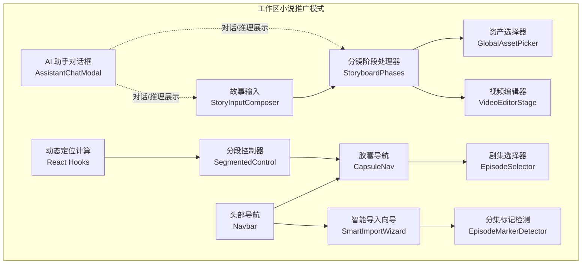

**图表来源**
- [src/components/ui/CapsuleNav.tsx:138-179](file://src/components/ui/CapsuleNav.tsx#L138-L179)
- [src/components/ui/CapsuleNav.tsx:184-415](file://src/components/ui/CapsuleNav.tsx#L184-L415)
- [src/components/ui/SegmentedControl.tsx:26-86](file://src/components/ui/SegmentedControl.tsx#L26-L86)
- [src/components/Navbar.tsx:21-187](file://src/components/Navbar.tsx#L21-L187)
- [src/app/[locale]/workspace/[projectId]/page.tsx:405-508](file://src/app/[locale]/workspace/[projectId]/page.tsx#L405-L508)
- [src/lib/episode-marker-detector.ts:188-315](file://src/lib/episode-marker-detector.ts#L188-L315)

**章节来源**
- [src/app/[locale]/workspace/[projectId]/modes/novel-promotion/components/assets/hooks/index.ts](file://src/app/[locale]/workspace/[projectId]/modes/novel-promotion/components/assets/hooks/index.ts#L1-L11)
- [src/app/[locale]/workspace/[projectId]/modes/novel-promotion/components/video/index.ts](file://src/app/[locale]/workspace/[projectId]/modes/novel-promotion/components/video/index.ts#L1-L6)

## 核心组件
- 故事输入组件（StoryInputComposer）
  - 职责：提供可伸缩文本域、视频比例与艺术风格选择、样式预设、顶部/底部/右侧操作区。
  - 关键属性：值、占位符、最小行数、禁用态、最大高度占比、回调、比例/风格/预设选项。
  - 交互：输入变化、拼音输入开始/结束、自动高度计算与溢出控制。
- 资产选择器（GlobalAssetPicker）
  - 职责：按类型筛选并展示角色/地点/道具/音色资产，支持搜索、预览、试听、任务状态指示。
  - 关键属性：是否打开、关闭回调、选中回调、类型、外部加载态。
  - 交互：搜索过滤、选中高亮、图片放大预览、音色播放/暂停。
- AI 助手对话框（AssistantChatModal + Conversation）
  - 职责：承载消息流、推理折叠、工具调用面板、输入与发送控制。
  - 关键属性：标题/副标题、消息列表、输入值、发送状态、完成态/错误态、回调。
  - 交互：键盘提交、滚动到底部、推理展开/收起、工具输入/输出展示。
- 视频编辑器（VideoEditorStage + 类型与工具）
  - 职责：时间轴与BGM轨道管理、转场与附件（配音/字幕）、渲染与保存。
  - 关键类型：VideoEditorProject、VideoClip、BgmClip、TimelineState、RenderRequest/Status。
  - 工具：时长计算、帧与时长换算、默认项目创建、迁移与校验。
- 分镜阶段处理器（StoryboardPhases）
  - 职责：将分镜生成拆分为三个阶段（规划/摄影/演技/细化），并进行重试与日志记录。
  - 关键类型：StoryboardPanel、PhotographyRule、ActingDirection、PhaseResult。
  - 流程：阶段1生成基础分镜 → 阶段2生成摄影规则/演技指导 → 阶段3细化并过滤无效分镜。
- **新增** 分段控制器（SegmentedControl）
  - 职责：提供统一的 iOS 风格分段控制器，支持滑动 pill 指示器和紧凑/填充布局模式。
  - 关键属性：选项数组、当前值、变更回调、布局模式（fill/compact）、容器类名。
  - 交互：点击切换、滑动指示器动画、动态定位计算。
- **更新** 胶囊导航（CapsuleNav）
  - 职责：提供悬浮式胶囊导航，支持状态指示、统计数显示、禁用状态和紧凑模式。**重大更新**：从传统按钮布局转换为 SegmentedControl 风格的滑动 pill 指示器系统。
  - 关键属性：导航项数组、活动ID、点击回调、项目ID、剧集ID、样式类名、紧凑模式。
  - 交互：左键点击切换、中键/Ctrl+点击新标签页打开、悬停显示禁用提示。
  - **新增** 功能：React hooks 动态定位计算，支持滑动 pill 指示器的精确位置控制。
- **更新** 剧集选择器（EpisodeSelector）
  - 职责：管理剧集列表，支持创建、重命名、删除、状态跟踪和项目名称显示。**完全重构**：支持更丰富的状态管理和交互。
  - 关键属性：剧集数组、当前剧集ID、选择回调、添加/重命名/删除回调、项目名称。
  - 交互：下拉菜单、编辑模式、删除确认、状态颜色指示。
  - **新增** 功能：状态跟踪（故事、脚本、视觉三个阶段），就地重命名，删除保护。
- **新增** React hooks 动态定位计算
  - 职责：为滑动指示器提供精确的位置计算，确保指示器与按钮元素的对齐。
  - 关键机制：useEffect 监听 activeId 和 items 变化，计算 activeButton 的 offsetLeft 和 offsetWidth。
  - 应用场景：SegmentedControl 和 CapsuleNav 的滑动 pill 指示器。
- **新增** 头部导航（Navbar）
  - 职责：提供现代化导航栏，集成应用Logo、更新检查、工作区导航、资产库、个人资料等。
  - 关键属性：会话状态、更新检查、语言切换、下载日志等功能。
  - 交互：Logo点击跳转、更新检查、导航链接、语言切换、日志下载。

**章节来源**
- [src/components/story-input/StoryInputComposer.tsx:1-173](file://src/components/story-input/StoryInputComposer.tsx#L1-L173)
- [src/components/shared/assets/GlobalAssetPicker.tsx:1-559](file://src/components/shared/assets/GlobalAssetPicker.tsx#L1-L559)
- [src/components/assistant/AssistantChatModal.tsx:1-528](file://src/components/assistant/AssistantChatModal.tsx#L1-L528)
- [src/components/ai-elements/conversation.tsx:1-154](file://src/components/ai-elements/conversation.tsx#L1-L154)
- [src/features/video-editor/index.ts:1-43](file://src/features/video-editor/index.ts#L1-L43)
- [src/features/video-editor/types/editor.types.ts:1-141](file://src/features/video-editor/types/editor.types.ts#L1-L141)
- [src/lib/storyboard-phases.ts:1-705](file://src/lib/storyboard-phases.ts#L1-L705)
- [src/types/storyboard-types.ts:1-49](file://src/types/storyboard-types.ts#L1-L49)
- [src/components/ui/SegmentedControl.tsx:1-86](file://src/components/ui/SegmentedControl.tsx#L1-L86)
- [src/components/ui/CapsuleNav.tsx:138-460](file://src/components/ui/CapsuleNav.tsx#L138-L460)
- [src/components/Navbar.tsx:21-187](file://src/components/Navbar.tsx#L21-L187)

## 架构总览
工作区采用"输入-生成-选择-编辑"的流水线式架构，结合新的导航系统和统一的 UI 设计语言：
- 输入层：StoryInputComposer 负责收集故事文本、比例与风格。
- 生成层：StoryboardPhases 将输入转化为分镜计划，期间通过 AI 推理与工具调用完善摄影与演技细节。
- 选择层：GlobalAssetPicker 提供全局资产检索与试听/预览，支撑分镜所需角色/地点/道具/音色。
- 编辑层：VideoEditorStage 基于分镜与资产生成视频剪辑，支持转场、附件与渲染。
- **新增** 导航层：CapsuleNav 提供悬浮式导航，EpisodeSelector 管理剧集，Navbar 提供头部导航。
- **新增** 统一控制器：SegmentedControl 提供统一的分段控制体验，支持滑动 pill 指示器。
- **新增** 智能导入：SmartImportWizard 结合 EpisodeMarkerDetector 实现自动分集检测与导入。

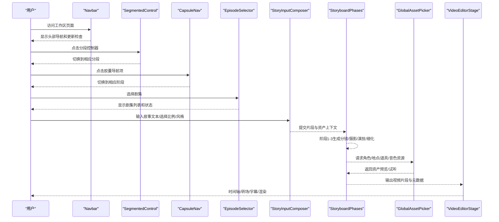

**图表来源**
- [src/components/Navbar.tsx:50-187](file://src/components/Navbar.tsx#L50-L187)
- [src/components/ui/SegmentedControl.tsx:26-86](file://src/components/ui/SegmentedControl.tsx#L26-L86)
- [src/components/ui/CapsuleNav.tsx:138-179](file://src/components/ui/CapsuleNav.tsx#L138-L179)
- [src/app/[locale]/workspace/[projectId]/page.tsx:509-524](file://src/app/[locale]/workspace/[projectId]/page.tsx#L509-L524)

## 详细组件分析

### 分段控制器（SegmentedControl）
- 设计要点
  - **iOS 风格设计**：提供统一的分段控制器，支持滑动 pill 指示器和紧凑/填充布局模式。
  - **滑动指示器**：指示器位于网格容器内部，与按钮共享相同的定位上下文，确保四边相等的内边距。
  - **动态定位**：使用 React hooks 计算 activeButton 的 offsetLeft 和 offsetWidth，实现精确的滑动动画。
  - **布局模式**：支持 fill（填充容器）和 compact（紧凑）两种布局模式，适应不同的设计需求。
  - **统一设计语言**：作为应用中所有标签/分段 UI 的单一真实来源，确保设计一致性。
- 状态与数据流
  - 选项数据结构包含 value 和 label，通过 options 属性传递。
  - 当前值通过 value 属性控制，onChange 回调通知值变化。
  - indicator 状态存储 left 和 width 坐标，用于滑动指示器的定位。
- 交互与事件
  - 点击按钮：触发 onChange 回调，更新当前值。
  - 滑动动画：使用 cubic-bezier(0.4,0,0.2,1) 缓动函数，提供流畅的滑动体验。
  - 动态计算：useEffect 监听 value 和 options 变化，重新计算指示器位置。

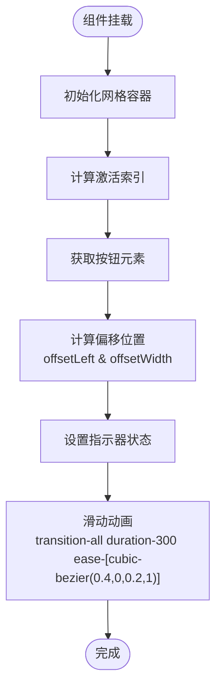

**图表来源**
- [src/components/ui/SegmentedControl.tsx:45-53](file://src/components/ui/SegmentedControl.tsx#L45-L53)

**章节来源**
- [src/components/ui/SegmentedControl.tsx:1-86](file://src/components/ui/SegmentedControl.tsx#L1-L86)

### 胶囊导航增强（CapsuleNav）
- 设计要点
  - **滑动 pill 指示器**：**重大更新**：从传统按钮布局转换为 SegmentedControl 风格的滑动 pill 指示器系统。
  - **动态定位计算**：**新增**：使用 React hooks 计算 activeButton 的精确位置，确保指示器与按钮元素完美对齐。
  - **紧凑模式**：支持紧凑模式（compact），采用 SegmentedControl 风格的滑动 pill 指示器。
  - **悬浮式设计**：采用半透明背景和毛玻璃效果，支持紧凑模式和展开模式。
  - **状态指示**：支持 empty/active/processing/ready 四种状态，通过底部指示条和状态点显示。
  - **交互增强**：支持中键和 Ctrl+点击在新标签页打开，提升多任务处理效率。
  - **统计显示**：可显示分段数、镜头数等统计信息，提供工作量直观反馈。
  - **禁用状态**：支持开发中功能的禁用状态，显示提示文字和悬停气泡。
- 状态与数据流
  - 导航项数据结构包含 id、图标、标签、状态、链接、禁用状态和统计数。
  - indicator 状态通过 useState 和 useEffect 管理，使用动态定位计算。
  - 通过 buildHref 动态构建 URL 参数，支持项目ID和剧集ID。
  - 状态变化通过 onItemClick 回调通知父组件。
- 交互与事件
  - 左键点击：切换到相应阶段，更新 URL 参数。
  - 中键/Ctrl+点击：在新标签页打开对应链接。
  - 悬停显示：禁用状态下显示提示气泡。
  - 紧凑模式：适应小屏幕和窄空间显示，使用滑动 pill 指示器。

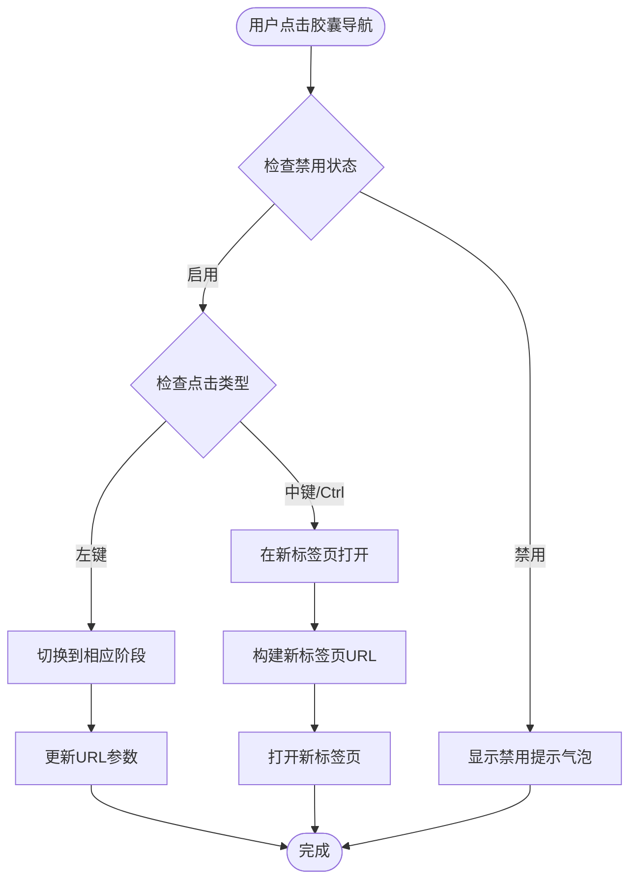

**图表来源**
- [src/components/ui/CapsuleNav.tsx:55-72](file://src/components/ui/CapsuleNav.tsx#L55-L72)
- [src/components/ui/CapsuleNav.tsx:138-148](file://src/components/ui/CapsuleNav.tsx#L138-L148)

**章节来源**
- [src/components/ui/CapsuleNav.tsx:138-460](file://src/components/ui/CapsuleNav.tsx#L138-L460)

### 剧集选择器改进（EpisodeSelector）
- 设计要点
  - **状态跟踪**：**完全重构**：支持故事、脚本、视觉三个阶段的状态跟踪，通过颜色区分进度。
  - **编辑功能**：支持就地重命名，提供确认对话框防止误操作。
  - **删除保护**：删除操作需要二次确认，防止意外删除重要数据。
  - **项目名称**：显示项目名称在左上角，提供上下文信息。
  - **响应式设计**：支持不同屏幕尺寸，下拉菜单自适应宽度。
  - **状态颜色**：根据视觉阶段 ready 状态决定，提供进度可视化。
  - **就地编辑**：支持编辑模式和删除确认模式，通过状态变量控制显示。
- 状态与数据流
  - 剧集数据包含 id、标题、序号、摘要和状态对象。
  - 状态颜色根据视觉阶段 ready 状态决定，提供进度可视化。
  - 编辑模式和删除确认模式通过状态变量控制显示。
- 交互与事件
  - 点击按钮：打开/关闭下拉菜单。
  - 点击剧集：选择剧集并关闭菜单。
  - 编辑按钮：进入编辑模式，支持 Enter 保存和 Esc 取消。
  - 删除按钮：进入删除确认模式，支持确认和取消。

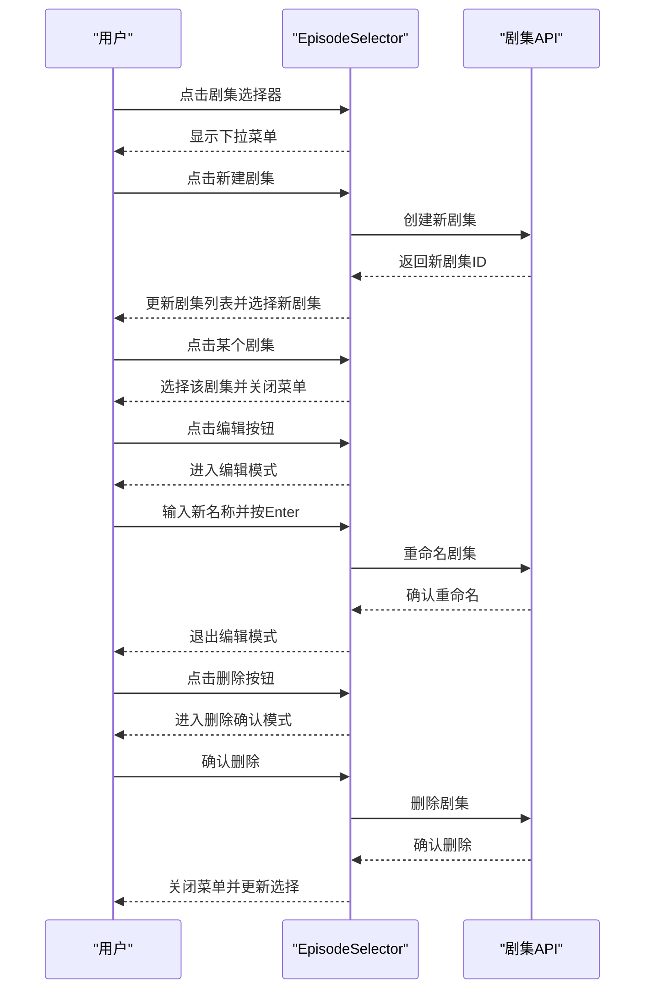

**图表来源**
- [src/components/ui/CapsuleNav.tsx:207-415](file://src/components/ui/CapsuleNav.tsx#L207-L415)

**章节来源**
- [src/components/ui/CapsuleNav.tsx:232-457](file://src/components/ui/CapsuleNav.tsx#L232-L457)

### React hooks 动态定位计算
- 设计要点
  - **精确计算**：使用 React hooks 计算 activeButton 的精确位置，确保滑动指示器与按钮元素完美对齐。
  - **响应式更新**：useEffect 监听 activeId 和 items 变化，实时更新指示器位置。
  - **性能优化**：仅在必要时计算位置，避免不必要的重渲染。
  - **通用机制**：作为通用的动态定位计算机制，应用于 SegmentedControl 和 CapsuleNav。
- 状态与数据流
  - indicator 状态通过 useState 管理，包含 left 和 width 坐标。
  - useEffect 监听 compact、activeId 和 items 变化，计算 activeButton 的位置。
  - 使用 querySelectorAll 获取所有导航项按钮，定位当前激活的按钮。
- 交互与事件
  - 组件挂载：初始化指示器状态。
  - 值变化：当 activeId 或 items 变化时，重新计算指示器位置。
  - 窗口变化：响应窗口大小变化，重新计算按钮位置。

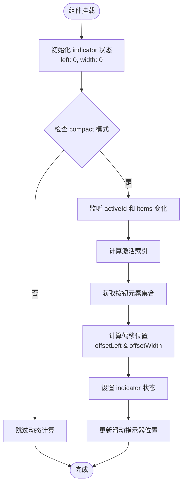

**图表来源**
- [src/components/ui/CapsuleNav.tsx:147-156](file://src/components/ui/CapsuleNav.tsx#L147-L156)
- [src/components/ui/SegmentedControl.tsx:45-53](file://src/components/ui/SegmentedControl.tsx#L45-L53)

**章节来源**
- [src/components/ui/CapsuleNav.tsx:143-156](file://src/components/ui/CapsuleNav.tsx#L143-L156)
- [src/components/ui/SegmentedControl.tsx:41-53](file://src/components/ui/SegmentedControl.tsx#L41-L53)

### 头部系统重构（Navbar）
- 设计要点
  - **现代化设计**：采用毛玻璃效果和半透明背景，提供沉浸式用户体验。
  - **更新检查**：集成 GitHub Release 更新检查，支持手动检查和自动提醒。
  - **多语言支持**：内置语言切换器，支持国际化需求。
  - **功能集成**：整合工作区导航、资产库、个人资料、日志下载等功能。
  - **响应式布局**：适配不同屏幕尺寸，移动端友好。
- 状态与数据流
  - 会话状态管理：根据用户登录状态显示不同菜单项。
  - 更新状态：检查更新状态，支持手动检查和自动更新提醒。
  - 预取功能：预取常用页面，提升用户体验。
- 交互与事件
  - Logo点击：根据会话状态跳转到不同页面。
  - 更新检查：手动检查更新，显示检查状态和结果。
  - 导航链接：工作区、资产库、个人资料等页面跳转。
  - 语言切换：切换界面语言，支持多语言环境。

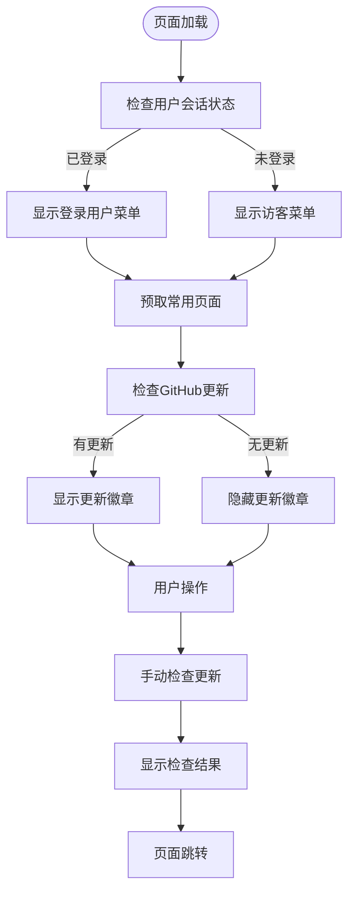

**图表来源**
- [src/components/Navbar.tsx:21-187](file://src/components/Navbar.tsx#L21-L187)

**章节来源**
- [src/components/Navbar.tsx:1-188](file://src/components/Navbar.tsx#L1-L188)

### 智能导入向导与分集标记检测
- 设计要点
  - **自动分集检测**：EpisodeMarkerDetector 支持多种中文和英文分集标记格式。
  - **智能预览**：根据检测结果生成分集预览，支持手动调整。
  - **导入流程**：SmartImportWizard 提供完整的导入向导，支持手动创建。
  - **状态管理**：集成 React Query 管理导入状态和剧集数据。
- 状态与数据流
  - 分集标记检测：支持第X集、第X章、第X幕、场景编号等多种格式。
  - 预览生成：自动生成分集预览，包含字数统计和内容预览。
  - 导入完成：刷新项目数据，自动切换到第一个剧集。
- 交互与事件
  - 标记检测：自动检测文本中的分集标记，提供置信度评估。
  - 预览调整：用户可以调整分集边界，支持手动编辑。
  - 导入确认：确认导入后刷新数据并跳转到相应阶段。

**章节来源**
- [src/lib/episode-marker-detector.ts:188-343](file://src/lib/episode-marker-detector.ts#L188-L343)
- [src/app/[locale]/workspace/[projectId]/page.tsx:405-508](file://src/app/[locale]/workspace/[projectId]/page.tsx#L405-L508)

### 故事输入组件（StoryInputComposer）
- 设计要点
  - 可伸缩文本域：根据内容高度动态调整，结合最大可视高度限制，避免遮挡。
  - 选择器组合：视频比例、艺术风格与风格预设三选一，支持用量提示与预设切换。
  - 布局分区：顶部右侧操作、中部输入区、底部操作区与次要/主要操作按钮。
- 状态与数据流
  - 外部通过 value/onValueChange 控制与更新文本。
  - 比例/风格/预设变更通过对应回调同步到上层。
  - 自动高度计算在每次值变化后触发，确保滚动与溢出行为一致。
- 交互与事件
  - 支持拼音输入开始/结束事件透传，便于输入法体验优化。
  - 支持禁用态与自定义类名，适配不同工作区主题。

**图表来源**
- [src/components/story-input/StoryInputComposer.tsx:73-104](file://src/components/story-input/StoryInputComposer.tsx#L73-L104)

**章节来源**
- [src/components/story-input/StoryInputComposer.tsx:1-173](file://src/components/story-input/StoryInputComposer.tsx#L1-L173)

### 资产选择器（GlobalAssetPicker）
- 设计要点
  - 按类型加载：仅在当前类型下发起查询，避免冗余请求。
  - 搜索过滤：支持名称与音色描述关键词过滤。
  - 预览与试听：图片网格预览，音色卡片内置试听按钮与性别标签。
  - 任务状态：基于任务呈现状态显示加载指示，统一视觉反馈。
- 状态与数据流
  - 打开/关闭：打开时拉取对应类型资产，关闭时停止音频播放。
  - 选中态：单选高亮，确认后回调选中 ID。
  - 加载态：内部加载与外部加载态叠加，统一显示处理中。
- 交互与事件
  - 点击卡片选中，点击图片可放大预览。
  - 音频播放/暂停与错误处理，自动清理资源。

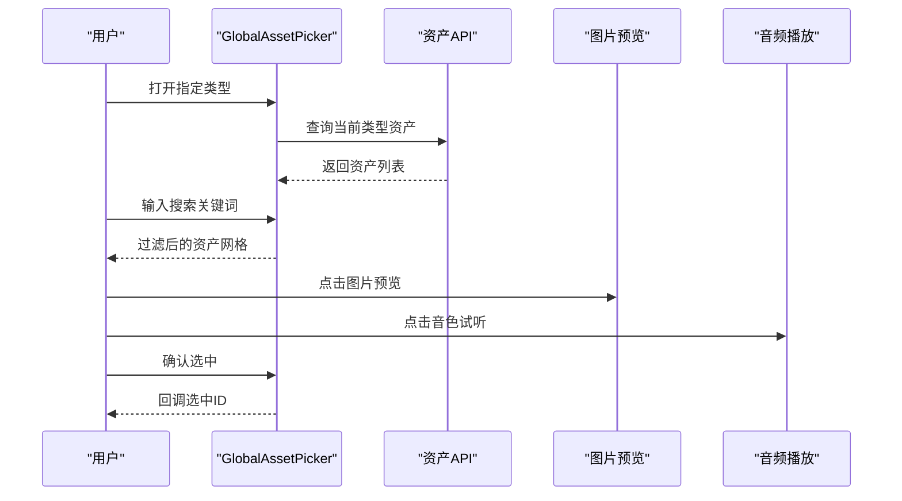

**图表来源**
- [src/components/shared/assets/GlobalAssetPicker.tsx:89-128](file://src/components/shared/assets/GlobalAssetPicker.tsx#L89-L128)
- [src/components/shared/assets/GlobalAssetPicker.tsx:225-254](file://src/components/shared/assets/GlobalAssetPicker.tsx#L225-L254)

**章节来源**
- [src/components/shared/assets/GlobalAssetPicker.tsx:1-559](file://src/components/shared/assets/GlobalAssetPicker.tsx#L1-L559)

### AI 助手对话框（AssistantChatModal + Conversation）
- 设计要点
  - 消息解析：支持 think 标签包裹的推理内容与文本消息分离。
  - 推理折叠：每个消息可展开/收起推理内容，提升阅读效率。
  - 工具面板：动态工具类型与状态（审批/输入流/输出可用/错误/拒绝）。
  - 滚动控制：Conversation/Content/ScrollButton 提供智能滚动与"跳到底部"按钮。
- 状态与数据流
  - 消息缓存：基于签名缓存渲染结果，避免重复解析与重绘。
  - 待定态：最后一条助手消息在流式输出时显示"待定"标签。
  - 完成态：完成后展示完成徽章与关闭按钮。
- 交互与事件
  - 键盘提交：Shift+Enter 换行，Enter 发送。
  - 展开/收起：点击推理标题切换状态。
  - 工具交互：工具面板根据状态自动展开或折叠。

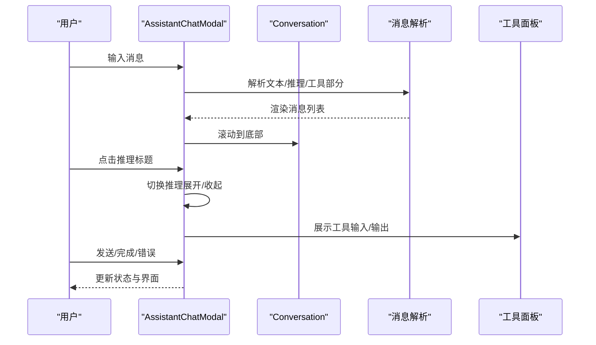

**图表来源**
- [src/components/assistant/AssistantChatModal.tsx:270-332](file://src/components/assistant/AssistantChatModal.tsx#L270-L332)
- [src/components/ai-elements/conversation.tsx:44-87](file://src/components/ai-elements/conversation.tsx#L44-L87)

**章节来源**
- [src/components/assistant/AssistantChatModal.tsx:1-528](file://src/components/assistant/AssistantChatModal.tsx#L1-L528)
- [src/components/ai-elements/conversation.tsx:1-154](file://src/components/ai-elements/conversation.tsx#L1-L154)

### 视频编辑器（VideoEditorStage + 类型与工具）
- 设计要点
  - 项目模型：VideoEditorProject 包含配置、主时间轴与BGM轨道。
  - 片段模型：VideoClip 支持素材裁剪、附件（配音/字幕）、转场与元数据。
  - UI 状态：TimelineState 管理当前帧、播放状态、选中片段与缩放。
  - 工具函数：时长/帧换算、默认项目创建、迁移与校验。
- 状态与数据流
  - 保存：SaveEditorProjectRequest 提交项目数据。
  - 渲染：RenderRequest 指定格式与质量，RenderStatus 返回进度/结果。
- 交互与事件
  - 时间轴选择与拖拽、转场设置、附件编辑、BGM轨道管理。

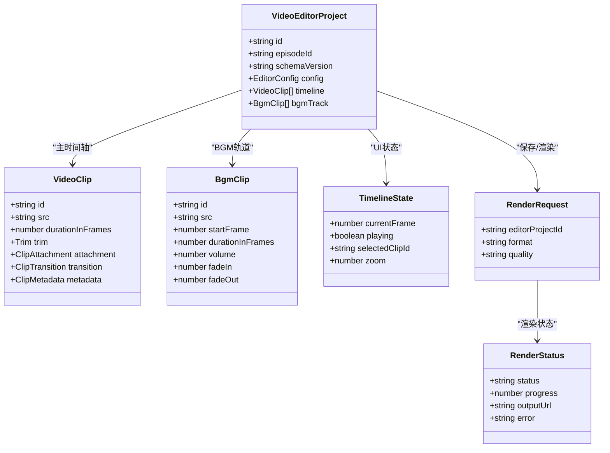

**图表来源**
- [src/features/video-editor/types/editor.types.ts:9-141](file://src/features/video-editor/types/editor.types.ts#L9-L141)
- [src/features/video-editor/index.ts:6-42](file://src/features/video-editor/index.ts#L6-L42)

**章节来源**
- [src/features/video-editor/index.ts:1-43](file://src/features/video-editor/index.ts#L1-L43)
- [src/features/video-editor/types/editor.types.ts:1-141](file://src/features/video-editor/types/editor.types.ts#L1-L141)

### 分镜阶段处理器（StoryboardPhases）
- 设计要点
  - 阶段化：阶段1（规划）→ 阶段2（摄影/演技并行）→ 阶段3（细化与过滤）。
  - 重试策略：每个阶段最多失败重试一次，确保稳定性。
  - 日志记录：记录提示词与输出，便于审计与复现。
- 状态与数据流
  - 输入：片段信息、资产库、会话信息、项目上下文。
  - 输出：阶段结果（包含 panels/photography/acting/finalPanels）。
- 交互与事件
  - 并行执行阶段2子任务（摄影/演技），随后合并摄影规则与最终面板。

**图表来源**
- [src/lib/storyboard-phases.ts:244-387](file://src/lib/storyboard-phases.ts#L244-L387)
- [src/lib/storyboard-phases.ts:389-487](file://src/lib/storyboard-phases.ts#L389-L487)
- [src/lib/storyboard-phases.ts:489-573](file://src/lib/storyboard-phases.ts#L489-L573)
- [src/lib/storyboard-phases.ts:575-704](file://src/lib/storyboard-phases.ts#L575-L704)

**章节来源**
- [src/lib/storyboard-phases.ts:1-705](file://src/lib/storyboard-phases.ts#L1-L705)
- [src/types/storyboard-types.ts:1-49](file://src/types/storyboard-types.ts#L1-L49)

## 依赖关系分析
- 组件耦合
  - StoryInputComposer 与 StoryboardPhases 通过片段与资产上下文解耦，仅传递必要字段。
  - GlobalAssetPicker 与资产 API 解耦，仅在打开时按需查询，避免全局状态污染。
  - AssistantChatModal 与 Conversation 通过上下文共享滚动状态，降低重复计算。
  - VideoEditorStage 与 editor.types/index 通过导出类型与工具函数解耦，便于扩展。
  - **更新** CapsuleNav 与 EpisodeSelector 通过 URL 参数和状态管理解耦。
  - **更新** Navbar 与更新检查服务通过钩子函数解耦。
  - **新增** SegmentedControl 作为统一的分段控制器，为 CapsuleNav 和其他组件提供一致的 UI 体验。
  - **新增** React hooks 动态定位计算为 SegmentedControl 和 CapsuleNav 提供精确的位置控制。
- 外部依赖
  - React Query 用于资产查询与缓存。
  - 媒体组件（图片/音频）封装加载与播放，统一错误处理。
  - **新增** Next-Intl 提供国际化支持。
  - **新增** Next-Auth 提供会话管理。
- 潜在循环依赖
  - 当前文件未见直接循环导入；若新增跨模块引用，应通过公共导出或拆分模块规避。

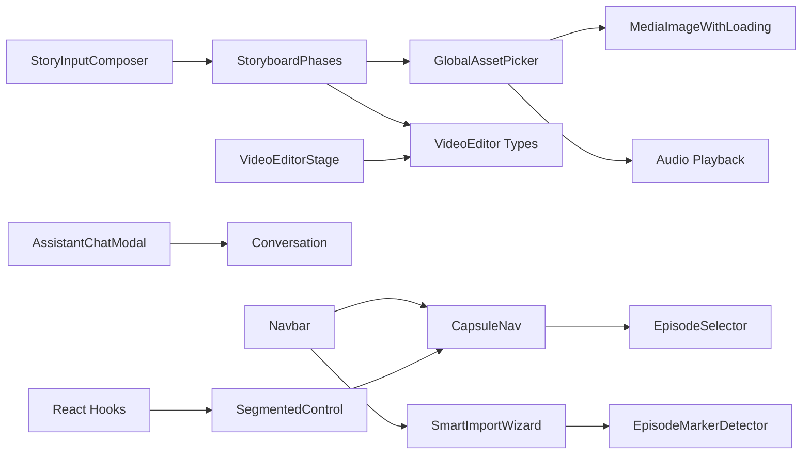

**图表来源**
- [src/components/story-input/StoryInputComposer.tsx:1-173](file://src/components/story-input/StoryInputComposer.tsx#L1-L173)
- [src/lib/storyboard-phases.ts:1-705](file://src/lib/storyboard-phases.ts#L1-L705)
- [src/components/shared/assets/GlobalAssetPicker.tsx:1-559](file://src/components/shared/assets/GlobalAssetPicker.tsx#L1-L559)
- [src/features/video-editor/index.ts:1-43](file://src/features/video-editor/index.ts#L1-L43)
- [src/components/assistant/AssistantChatModal.tsx:1-528](file://src/components/assistant/AssistantChatModal.tsx#L1-L528)
- [src/components/ai-elements/conversation.tsx:1-154](file://src/components/ai-elements/conversation.tsx#L1-L154)
- [src/components/ui/CapsuleNav.tsx:138-460](file://src/components/ui/CapsuleNav.tsx#L138-L460)
- [src/components/ui/SegmentedControl.tsx:1-86](file://src/components/ui/SegmentedControl.tsx#L1-L86)
- [src/components/Navbar.tsx:21-187](file://src/components/Navbar.tsx#L21-L187)

**章节来源**
- [src/app/[locale]/workspace/[projectId]/modes/novel-promotion/components/assets/hooks/index.ts](file://src/app/[locale]/workspace/[projectId]/modes/novel-promotion/components/assets/hooks/index.ts#L1-L11)
- [src/app/[locale]/workspace/[projectId]/modes/novel-promotion/components/video/index.ts](file://src/app/[locale]/workspace/[projectId]/modes/novel-promotion/components/video/index.ts#L1-L6)

## 性能考量
- 渲染优化
  - StoryInputComposer 使用 requestAnimationFrame 与过渡动画控制高度变化，避免频繁重排。
  - AssistantChatModal 通过消息签名缓存与条件渲染，减少重复解析与重绘。
  - GlobalAssetPicker 在打开时才发起查询，关闭时释放音频资源，降低内存占用。
  - **更新** CapsuleNav 使用 CSS 过渡动画和状态缓存，提升交互流畅度。
  - **更新** EpisodeSelector 通过虚拟滚动优化大列表渲染性能。
  - **新增** SegmentedControl 使用 React hooks 进行动态定位计算，避免不必要的重渲染。
  - **新增** React hooks 动态定位计算采用精确的 offset 计算，确保滑动指示器的平滑动画。
- 网络与任务
  - 分镜阶段处理器对每个阶段进行最多一次重试，平衡稳定性与耗时。
  - VideoEditor 工具函数提供帧与时长换算与默认项目创建，减少计算开销。
  - **新增** 智能导入向导支持分批处理，避免长时间阻塞 UI。
- 可扩展性
  - 类型导出与工具函数集中管理，便于替换底层实现而不影响上层组件。
  - 组件通过 props 与回调解耦，易于替换或扩展功能。
  - **更新** 导航系统支持插件化扩展，便于添加新的导航项。
  - **新增** SegmentedControl 作为统一的分段控制器，确保设计一致性。

## 故障排查指南
- 文本域高度异常
  - 检查最大可视高度比例与初始最小高度是否正确设置。
  - 确认自动高度计算逻辑未被外部样式覆盖导致溢出判断错误。
- 资产选择器无结果
  - 确认当前类型与查询参数匹配，检查网络请求与错误提示。
  - 若搜索无结果，确认关键词大小写与描述字段是否包含目标内容。
- AI 助手消息不显示
  - 检查消息解析逻辑是否正确识别 think 标签与工具输出。
  - 确认消息签名缓存未阻塞渲染，必要时清理缓存重新渲染。
- 分镜生成失败
  - 查看阶段日志与重试记录，确认提示词模板与资产上下文是否完整。
  - 检查最终面板过滤逻辑，确保有效分镜数量大于零。
- 视频编辑渲染异常
  - 校验 RenderRequest 参数与 RenderStatus 状态机，关注错误信息与进度条。
  - 确认项目数据版本与迁移函数是否正确应用。
- **更新** 胶囊导航点击无效
  - 检查禁用状态和链接构建逻辑，确认 URL 参数是否正确。
  - 验证中键/Ctrl+点击事件处理，确保新标签页打开功能正常。
  - **新增** 检查动态定位计算是否正常工作，确认指示器位置计算。
- **更新** 剧集选择器功能异常
  - 检查剧集数据格式和状态字段，确认状态颜色计算逻辑。
  - 验证编辑和删除功能的确认对话框，确保用户交互安全。
  - **新增** 检查状态跟踪功能，确认故事、脚本、视觉三个阶段的状态显示。
- **新增** 分段控制器滑动异常
  - 检查选项数据结构是否正确，确认 value 和 label 字段。
  - 验证动态定位计算，确保指示器与按钮元素的精确对齐。
  - 检查布局模式设置，确认 fill 和 compact 模式的正确使用。
- **新增** React hooks 动态定位计算失效
  - 检查 useEffect 依赖数组，确保 activeId 和 items 的正确监听。
  - 验证 DOM 查询是否能正确获取按钮元素，确认 data-nav-item 属性。
  - 检查容器引用是否正确设置，确保 querySelectorAll 能够找到元素。
- **新增** 头部导航显示问题
  - 检查会话状态和权限验证，确认菜单项显示逻辑。
  - 验证更新检查功能，确保网络请求和状态更新正常。

**章节来源**
- [src/components/story-input/StoryInputComposer.tsx:73-104](file://src/components/story-input/StoryInputComposer.tsx#L73-L104)
- [src/components/shared/assets/GlobalAssetPicker.tsx:181-199](file://src/components/shared/assets/GlobalAssetPicker.tsx#L181-L199)
- [src/components/assistant/AssistantChatModal.tsx:298-318](file://src/components/assistant/AssistantChatModal.tsx#L298-L318)
- [src/lib/storyboard-phases.ts:366-371](file://src/lib/storyboard-phases.ts#L366-L371)
- [src/features/video-editor/types/editor.types.ts:125-141](file://src/features/video-editor/types/editor.types.ts#L125-L141)
- [src/components/ui/CapsuleNav.tsx:55-72](file://src/components/ui/CapsuleNav.tsx#L55-L72)
- [src/components/ui/CapsuleNav.tsx:207-415](file://src/components/ui/CapsuleNav.tsx#L207-L415)
- [src/components/ui/SegmentedControl.tsx:45-53](file://src/components/ui/SegmentedControl.tsx#L45-L53)
- [src/components/Navbar.tsx:36-48](file://src/components/Navbar.tsx#L36-L48)

## 结论
工作区组件围绕"输入-生成-选择-编辑"的闭环构建，通过清晰的职责划分与状态管理，实现了小说推广流程的高效协作。本次重大改进引入了从传统按钮布局到 SegmentedControl 风格滑动 pill 指示器系统、剧集选择器的完全重构、React hooks 动态定位计算的引入，以及统一的 iOS 风格 UI 设计语言，显著提升了用户体验和工作效率。

**核心改进亮点**：
- **导航体验升级**：CapsuleNav 从传统按钮布局转换为 SegmentedControl 风格的滑动 pill 指示器系统，提供更流畅的交互体验。
- **统一设计语言**：SegmentedControl 作为统一的分段控制器，确保应用中所有标签/分段 UI 的设计一致性。
- **精确动态定位**：React hooks 动态定位计算为滑动指示器提供精确的位置控制，确保指示器与按钮元素的完美对齐。
- **剧集管理增强**：EpisodeSelector 完全重构，集成了状态跟踪、就地编辑和删除保护功能，提供了完整的剧集生命周期管理。
- **性能优化**：动态定位计算采用精确的 offset 计算，避免不必要的重渲染，提升组件性能。
- **头部系统现代化**：Navbar 重构为现代化设计，集成了更新检查、语言切换和功能导航，提升了整体用户体验。
- **智能导入功能**：结合 EpisodeMarkerDetector 的自动分集检测，简化了内容导入流程。

StoryInputComposer 提供灵活的输入体验，GlobalAssetPicker 实现资产检索与预览，AssistantChatModal 保障推理与工具展示，VideoEditorStage 与类型体系支撑视频创作。StoryboardPhases 将复杂分镜生成拆分为可控阶段，配合重试与日志，显著提升了稳定性与可观测性。整体架构具备良好的可扩展性与可维护性，适合进一步集成自定义组件与第三方服务。

## 附录
- 使用场景与组件组合示例
  - 场景一：从故事输入到视频渲染的完整流程
    - 步骤：输入文本 → 生成分镜 → 选择角色/地点/道具/音色 → 导入片段到视频编辑器 → 设置转场与字幕 → 渲染输出。
  - 场景二：AI 助手辅助优化创作过程
    - 步骤：在输入与分镜阶段调用助手对话框，查看推理与工具输出，确认后继续流程。
  - 场景三：资产复用与预览
    - 步骤：在资产选择器中搜索并试听音色，预览图片后复制到工作区使用。
  - **更新** 场景四：多剧集协同创作
    - 步骤：使用 EpisodeSelector 管理多个剧集，通过 CapsuleNav 在不同阶段间快速切换，利用 Navbar 的更新检查确保使用最新功能。
  - **更新** 场景五：智能内容导入
    - 步骤：使用 SmartImportWizard 结合分集标记检测，自动识别和分割长篇内容，一键导入到工作区。
  - **新增** 场景六：分段导航体验
    - 步骤：使用 SegmentedControl 进行分段导航，享受滑动 pill 指示器带来的流畅交互体验。
  - **新增** 场景七：动态定位计算
    - 步骤：在 CapsuleNav 和 SegmentedControl 中体验精确的动态定位计算，确保指示器与按钮元素的完美对齐。
- 可扩展性设计与自定义组件集成
  - 新增资产类型：在 GlobalAssetPicker 中扩展类型分支与预览逻辑。
  - 新增视频效果：在 VideoEditorStage 中扩展转场与附件类型，并完善类型与工具函数。
  - 新增阶段：在 StoryboardPhases 中新增阶段函数与提示词模板，保持重试与日志规范。
  - 新增对话元素：在 AssistantChatModal 中扩展工具类型与面板渲染，复用 Conversation 上下文。
  - **更新** 新增导航项：在 CapsuleNav 中添加新的导航项，支持状态管理和链接构建。
  - **更新** 新增剧集操作：在 EpisodeSelector 中扩展剧集管理功能，如批量操作和分类标签。
  - **新增** 新增分段控制器：在其他组件中集成 SegmentedControl，提供统一的分段导航体验。
  - **新增** 新增动态定位：在自定义组件中使用 React hooks 动态定位计算，确保精确的位置控制。
  - **新增** 新增头部功能：在 Navbar 中集成新的导航功能，确保响应式设计和国际化支持。