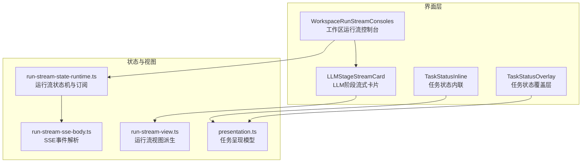
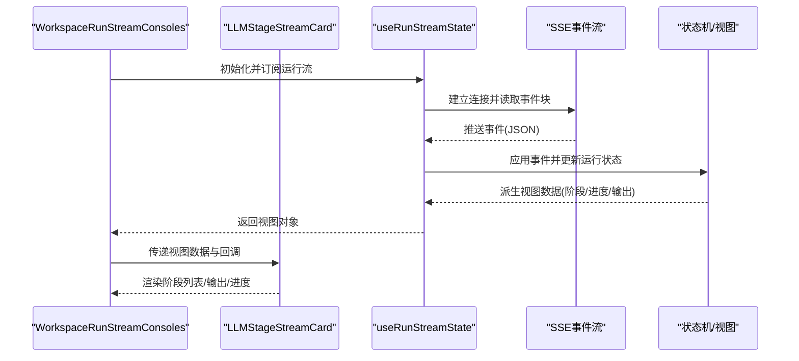
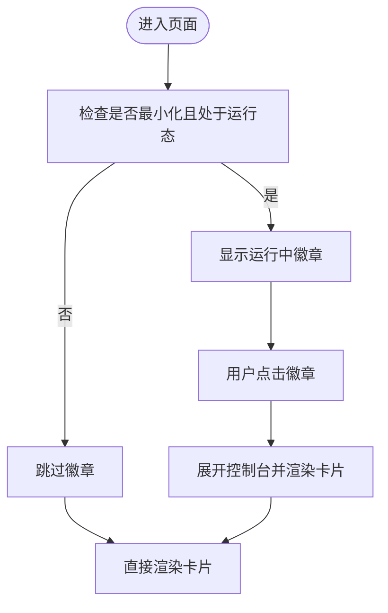
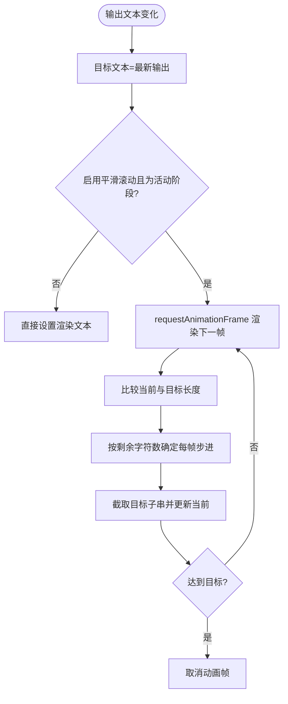
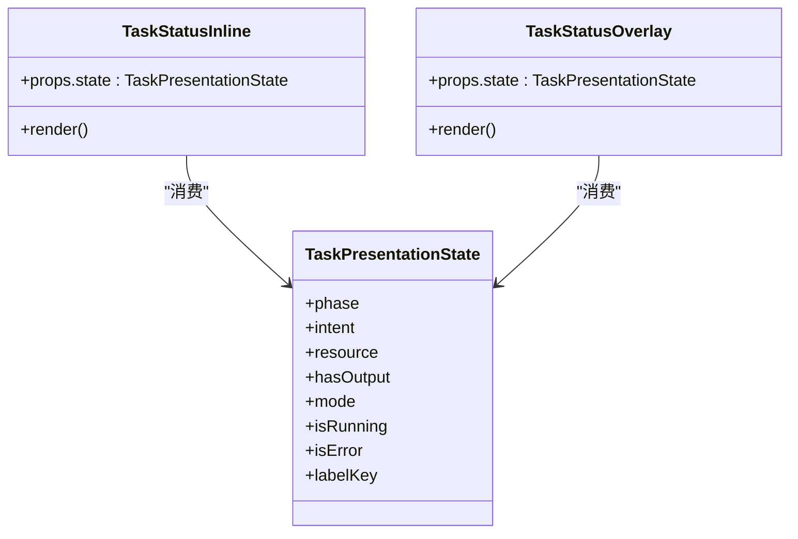
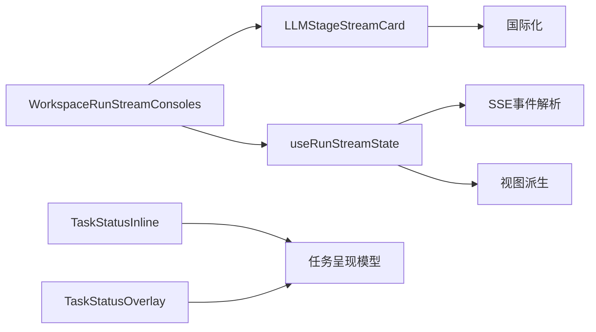

# 执行监控组件

<cite>
**本文档引用的文件**
- [WorkspaceRunStreamConsoles.tsx](file://src/app/[locale]/workspace/[projectId]/modes/novel-promotion/components/WorkspaceRunStreamConsoles.tsx)
- [LLMStageStreamCard.tsx](file://src/components/llm-console/LLMStageStreamCard.tsx)
- [TaskStatusInline.tsx](file://src/components/task/TaskStatusInline.tsx)
- [TaskStatusOverlay.tsx](file://src/components/task/TaskStatusOverlay.tsx)
- [presentation.ts](file://src/lib/task/presentation.ts)
- [run-stream-state-runtime.ts](file://src/lib/query/hooks/run-stream/run-stream-state-runtime.ts)
- [run-stream-view.ts](file://src/lib/query/hooks/run-stream/run-stream-view.ts)
- [run-stream-sse-body.ts](file://src/lib/query/hooks/run-stream/run-stream-sse-body.ts)
</cite>

## 目录
1. [简介](#简介)
2. [项目结构](#项目结构)
3. [核心组件](#核心组件)
4. [架构总览](#架构总览)
5. [详细组件分析](#详细组件分析)
6. [依赖关系分析](#依赖关系分析)
7. [性能考量](#性能考量)
8. [故障排查指南](#故障排查指南)
9. [结论](#结论)
10. [附录](#附录)

## 简介
本技术文档聚焦于 Waoowaoo 的执行监控体系，围绕以下关键组件展开：
- WorkspaceRunStreamConsoles：工作区运行流控制台，负责聚合与呈现多个阶段的执行流状态与输出。
- LLMStageStreamCard：LLM 阶段流式卡片，用于实时展示阶段列表、整体进度、当前输出与错误信息，并支持光标闪烁与平滑滚动等体验增强。
- TaskStatusInline / TaskStatusOverlay：任务状态内联与覆盖层组件，分别在行内与覆盖层模式下展示任务运行状态与错误提示。

文档将深入解析实时任务监控的实现机制、状态变更通知、错误处理策略、执行流可视化、进度条与日志输出、自定义配置、事件订阅机制、性能监控指标，以及调试工具与用户体验优化方案。

## 项目结构
执行监控相关代码主要分布在以下模块：
- 控制台与卡片：WorkspaceRunStreamConsoles 与 LLMStageStreamCard 组成可视化的执行监控界面。
- 任务状态模型：TaskStatusInline/TaskStatusOverlay 与任务呈现模型 presentation.ts 提供统一的状态语义与展示模式。
- 运行流状态机与视图：run-stream-state-runtime.ts 负责事件驱动的状态更新、恢复与重试；run-stream-view.ts 将运行时状态转换为视图数据；run-stream-sse-body.ts 解析 SSE 流事件。

图表来源
- [WorkspaceRunStreamConsoles.tsx:1-248](file://src/app/[locale]/workspace/[projectId]/modes/novel-promotion/components/WorkspaceRunStreamConsoles.tsx#L1-L248)
- [LLMStageStreamCard.tsx:1-512](file://src/components/llm-console/LLMStageStreamCard.tsx#L1-L512)
- [TaskStatusInline.tsx:1-31](file://src/components/task/TaskStatusInline.tsx#L1-L31)
- [TaskStatusOverlay.tsx:1-35](file://src/components/task/TaskStatusOverlay.tsx#L1-L35)
- [run-stream-state-runtime.ts:1-294](file://src/lib/query/hooks/run-stream/run-stream-state-runtime.ts#L1-L294)
- [run-stream-view.ts:1-125](file://src/lib/query/hooks/run-stream/run-stream-view.ts#L1-L125)
- [run-stream-sse-body.ts:1-80](file://src/lib/query/hooks/run-stream/run-stream-sse-body.ts#L1-L80)
- [presentation.ts:1-66](file://src/lib/task/presentation.ts#L1-L66)

章节来源
- [WorkspaceRunStreamConsoles.tsx:1-248](file://src/app/[locale]/workspace/[projectId]/modes/novel-promotion/components/WorkspaceRunStreamConsoles.tsx#L1-L248)
- [LLMStageStreamCard.tsx:1-512](file://src/components/llm-console/LLMStageStreamCard.tsx#L1-L512)
- [TaskStatusInline.tsx:1-31](file://src/components/task/TaskStatusInline.tsx#L1-L31)
- [TaskStatusOverlay.tsx:1-35](file://src/components/task/TaskStatusOverlay.tsx#L1-L35)
- [run-stream-state-runtime.ts:1-294](file://src/lib/query/hooks/run-stream/run-stream-state-runtime.ts#L1-L294)
- [run-stream-view.ts:1-125](file://src/lib/query/hooks/run-stream/run-stream-view.ts#L1-L125)
- [run-stream-sse-body.ts:1-80](file://src/lib/query/hooks/run-stream/run-stream-sse-body.ts#L1-L80)
- [presentation.ts:1-66](file://src/lib/task/presentation.ts#L1-L66)

## 核心组件
- WorkspaceRunStreamConsoles：接收两个运行流状态（如故事到脚本、脚本到分镜），根据可见性与活跃状态渲染对应的 LLMStageStreamCard，并提供最小化徽章、停止与最小化按钮、重试步骤等交互。
- LLMStageStreamCard：以卡片形式展示阶段列表、当前阶段标题与副标题、整体进度条、输出区域（支持结构化“思考过程/最终结果”分栏）、错误消息、重试按钮与顶部操作区。
- TaskStatusInline / TaskStatusOverlay：基于任务呈现模型（phase/intent/resource/mode）决定是否显示、如何显示（旋转加载或警示图标）以及标签文案。

章节来源
- [WorkspaceRunStreamConsoles.tsx:37-45](file://src/app/[locale]/workspace/[projectId]/modes/novel-promotion/components/WorkspaceRunStreamConsoles.tsx#L37-L45)
- [LLMStageStreamCard.tsx:25-42](file://src/components/llm-console/LLMStageStreamCard.tsx#L25-L42)
- [TaskStatusInline.tsx:7-10](file://src/components/task/TaskStatusInline.tsx#L7-L10)
- [TaskStatusOverlay.tsx:7-10](file://src/components/task/TaskStatusOverlay.tsx#L7-L10)
- [presentation.ts:7-16](file://src/lib/task/presentation.ts#L7-L16)

## 架构总览
执行监控采用“事件驱动 + 视图派生”的架构：
- 事件源：SSE 流推送运行事件（文本增量、推理增量、状态变更等）。
- 状态机：将事件应用到运行状态，维护步骤映射、顺序、活动步骤、选择步骤等。
- 视图派生：从运行状态计算阶段视图、整体进度、活动消息、输出文本与可见性。
- 界面渲染：控制台根据两个运行流状态渲染卡片，卡片内部再渲染阶段列表与输出面板。

图表来源
- [run-stream-state-runtime.ts:130-168](file://src/lib/query/hooks/run-stream/run-stream-state-runtime.ts#L130-L168)
- [run-stream-sse-body.ts:47-79](file://src/lib/query/hooks/run-stream/run-stream-sse-body.ts#L47-L79)
- [run-stream-view.ts:15-124](file://src/lib/query/hooks/run-stream/run-stream-view.ts#L15-L124)
- [WorkspaceRunStreamConsoles.tsx:152-192](file://src/app/[locale]/workspace/[projectId]/modes/novel-promotion/components/WorkspaceRunStreamConsoles.tsx#L152-L192)
- [LLMStageStreamCard.tsx:168-511](file://src/components/llm-console/LLMStageStreamCard.tsx#L168-L511)

## 详细组件分析

### WorkspaceRunStreamConsoles 组件
职责与行为：
- 接收两个运行流状态对象，根据可见性、活跃状态与错误信息决定是否渲染对应控制台。
- 当处于最小化状态且仍在运行时，显示“运行中”徽章按钮，点击后展开控制台。
- 将运行流状态映射为 LLMStageStreamCard 的 props，包括阶段列表、活动/选中阶段、输出文本、整体进度、光标显示与自动滚动策略。
- 提供重试步骤的弹窗输入与调用 retryStep，支持模型覆盖与重试原因。

关键交互流程（最小化徽章与展开）：

图表来源
- [WorkspaceRunStreamConsoles.tsx:140-150](file://src/app/[locale]/workspace/[projectId]/modes/novel-promotion/components/WorkspaceRunStreamConsoles.tsx#L140-L150)
- [WorkspaceRunStreamConsoles.tsx:152-192](file://src/app/[locale]/workspace/[projectId]/modes/novel-promotion/components/WorkspaceRunStreamConsoles.tsx#L152-L192)

章节来源
- [WorkspaceRunStreamConsoles.tsx:47-247](file://src/app/[locale]/workspace/[projectId]/modes/novel-promotion/components/WorkspaceRunStreamConsoles.tsx#L47-L247)

### LLMStageStreamCard 组件
职责与行为：
- 展示当前阶段序号/总数、标题/副标题、整体进度条、错误消息区域。
- 左侧阶段列表：每个阶段显示序号、尝试次数、标题、状态标签与进度条；支持点击切换选中阶段；失败阶段可显示重试按钮。
- 右侧输出面板：支持结构化输出（思考过程/最终结果）分栏显示；支持光标闪烁与平滑滚动；支持占位文案与国际化进度键解析。
- 自动滚动：当启用自动滚动且当前活动阶段为选中阶段时，滚动到底部。

平滑滚动与渲染帧循环：

图表来源
- [LLMStageStreamCard.tsx:257-323](file://src/components/llm-console/LLMStageStreamCard.tsx#L257-L323)
- [LLMStageStreamCard.tsx:333-343](file://src/components/llm-console/LLMStageStreamCard.tsx#L333-L343)

章节来源
- [LLMStageStreamCard.tsx:168-511](file://src/components/llm-console/LLMStageStreamCard.tsx#L168-L511)

### 任务状态管理（TaskStatusInline / TaskStatusOverlay）
职责与行为：
- 通过任务呈现模型（phase/intent/resource/mode）判断是否显示、显示方式与标签文案。
- 内联模式：仅在运行或错误时显示，错误时以危险色显示标签。
- 覆盖层模式：仅在 overlay 或 placeholder 模式下显示，错误时显示警示图标，否则显示旋转加载图标。

任务呈现模型（简化）：

图表来源
- [presentation.ts:7-16](file://src/lib/task/presentation.ts#L7-L16)
- [TaskStatusInline.tsx:12-30](file://src/components/task/TaskStatusInline.tsx#L12-L30)
- [TaskStatusOverlay.tsx:12-34](file://src/components/task/TaskStatusOverlay.tsx#L12-L34)

章节来源
- [presentation.ts:22-65](file://src/lib/task/presentation.ts#L22-L65)
- [TaskStatusInline.tsx:12-30](file://src/components/task/TaskStatusInline.tsx#L12-L30)
- [TaskStatusOverlay.tsx:12-34](file://src/components/task/TaskStatusOverlay.tsx#L12-L34)

## 依赖关系分析
- WorkspaceRunStreamConsoles 依赖 LLMStageStreamCard 与运行流状态钩子（useRunStreamState）。
- LLMStageStreamCard 依赖国际化翻译与内部状态逻辑（光标、平滑滚动、结构化输出解析）。
- 运行流状态钩子依赖 SSE 事件解析器、状态机与视图派生器。
- 任务状态组件依赖任务呈现模型。

图表来源
- [WorkspaceRunStreamConsoles.tsx:3-3](file://src/app/[locale]/workspace/[projectId]/modes/novel-promotion/components/WorkspaceRunStreamConsoles.tsx#L3-L3)
- [LLMStageStreamCard.tsx:3-4](file://src/components/llm-console/LLMStageStreamCard.tsx#L3-L4)
- [run-stream-state-runtime.ts:4-11](file://src/lib/query/hooks/run-stream/run-stream-state-runtime.ts#L4-L11)
- [run-stream-sse-body.ts:1-2](file://src/lib/query/hooks/run-stream/run-stream-sse-body.ts#L1-L2)
- [run-stream-view.ts:1-2](file://src/lib/query/hooks/run-stream/run-stream-view.ts#L1-L2)
- [presentation.ts:1-1](file://src/lib/task/presentation.ts#L1-L1)

章节来源
- [run-stream-state-runtime.ts:1-294](file://src/lib/query/hooks/run-stream/run-stream-state-runtime.ts#L1-L294)
- [run-stream-view.ts:1-125](file://src/lib/query/hooks/run-stream/run-stream-view.ts#L1-L125)
- [run-stream-sse-body.ts:1-80](file://src/lib/query/hooks/run-stream/run-stream-sse-body.ts#L1-L80)

## 性能考量
- 平滑滚动帧率控制：根据剩余字符量动态调整每帧步进，避免大段输出导致主线程阻塞。
- requestAnimationFrame 使用：在每次帧渲染后注册下一帧，确保渲染与布局稳定。
- 自动滚动策略：仅在当前选中阶段为活动阶段时滚动到底部，减少不必要的 DOM 操作。
- 整体进度计算：按阶段权重平均计算，避免单阶段进度波动对整体进度造成过大影响。
- SSE 事件解析：逐块解析事件，避免一次性解析大量数据导致内存压力。

章节来源
- [LLMStageStreamCard.tsx:257-323](file://src/components/llm-console/LLMStageStreamCard.tsx#L257-L323)
- [LLMStageStreamCard.tsx:333-343](file://src/components/llm-console/LLMStageStreamCard.tsx#L333-L343)
- [run-stream-view.ts:78-87](file://src/lib/query/hooks/run-stream/run-stream-view.ts#L78-L87)
- [run-stream-sse-body.ts:47-79](file://src/lib/query/hooks/run-stream/run-stream-sse-body.ts#L47-L79)

## 故障排查指南
常见问题与定位建议：
- 无输出或输出卡住
  - 检查 SSE 连接是否建立成功，确认事件块解析是否正常。
  - 关注 runStreamState 的 isLiveRunning/isRecoveredRunning 状态切换。
  - 若为结构化输出，确认“思考过程/最终结果”头部是否存在。
- 错误信息未显示
  - 确认运行状态中的 errorMessage 是否存在，卡片会优先展示运行级错误。
  - 检查阶段级错误消息是否为空，必要时回退到默认文案。
- 无法重试步骤
  - 确认 runId 与 stepId 是否有效，重试接口返回的 payload 是否正确。
  - 检查 retryable 标记与服务端允许重试的条件。
- 最小化徽章不出现
  - 确认运行流状态的 isVisible、isRunning/isRecoveredRunning 与 status 条件满足。
  - 检查 hideMinimizedBadges 标志位是否被设置。

调试工具与辅助手段：
- 在浏览器开发者工具中观察网络面板的 SSE 请求与响应块。
- 在控制台打印 runState 与派生视图，核对 stages/overallProgress/activeMessage。
- 使用最小化/展开按钮验证控制台渲染逻辑。

章节来源
- [run-stream-state-runtime.ts:170-219](file://src/lib/query/hooks/run-stream/run-stream-state-runtime.ts#L170-L219)
- [run-stream-view.ts:38-45](file://src/lib/query/hooks/run-stream/run-stream-view.ts#L38-L45)
- [WorkspaceRunStreamConsoles.tsx:140-150](file://src/app/[locale]/workspace/[projectId]/modes/novel-promotion/components/WorkspaceRunStreamConsoles.tsx#L140-L150)

## 结论
执行监控组件通过事件驱动与视图派生实现了高实时性的执行流可视化，结合 WorkspaceRunStreamConsoles 与 LLMStageStreamCard 提供了清晰的阶段列表、整体进度、结构化输出与错误提示。配合 TaskStatusInline/TaskStatusOverlay 的任务状态语义化展示，形成了完整的前端监控闭环。通过平滑滚动、自动滚动策略与 SSE 事件解析优化，保证了良好的用户体验与性能表现。

## 附录

### 自定义配置与扩展点
- WorkspaceRunStreamConsoles
  - 支持最小化徽章开关（hideMinimizedBadges）。
  - 支持两个运行流的最小化状态回调（onStoryToScriptMinimizedChange/onScriptToStoryboardMinimizedChange）。
  - 支持顶部操作区自定义（topRightAction）。
- LLMStageStreamCard
  - 输出文本占位文案国际化键解析（placeholderText）。
  - 光标闪烁与平滑滚动开关（showCursor/smoothStreaming）。
  - 自动滚动开关（autoScroll）。
  - 错误消息显示（errorMessage）。
- 任务状态组件
  - 通过任务呈现模型的 mode（none/overlay/placeholder）与 labelKey 控制文案与展示形态。

章节来源
- [WorkspaceRunStreamConsoles.tsx:40-44](file://src/app/[locale]/workspace/[projectId]/modes/novel-promotion/components/WorkspaceRunStreamConsoles.tsx#L40-L44)
- [LLMStageStreamCard.tsx:25-42](file://src/components/llm-console/LLMStageStreamCard.tsx#L25-L42)
- [presentation.ts:5-16](file://src/lib/task/presentation.ts#L5-L16)