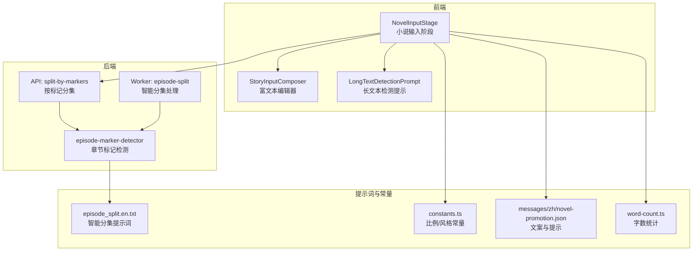
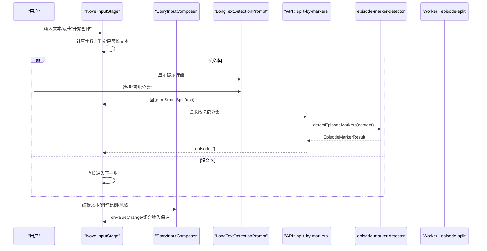
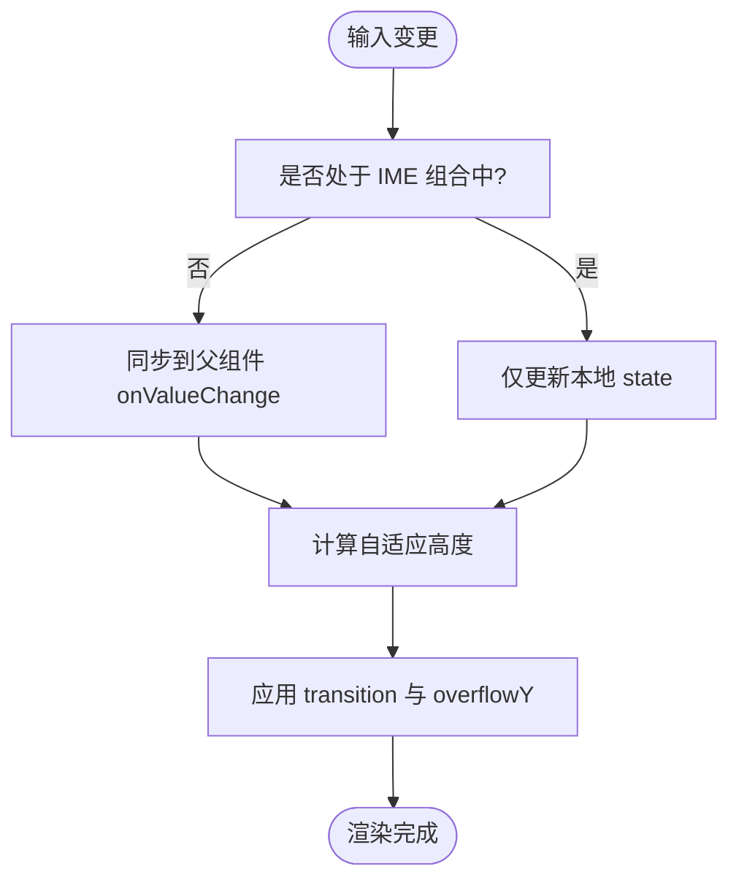
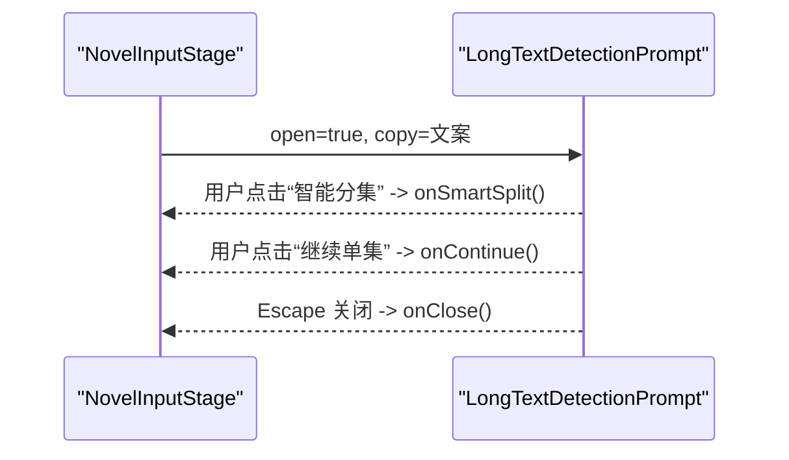
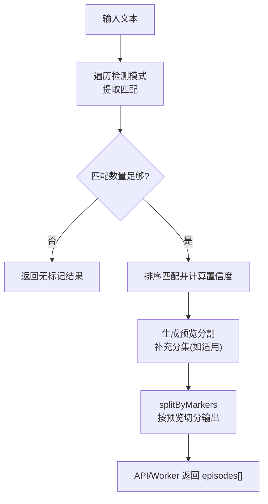
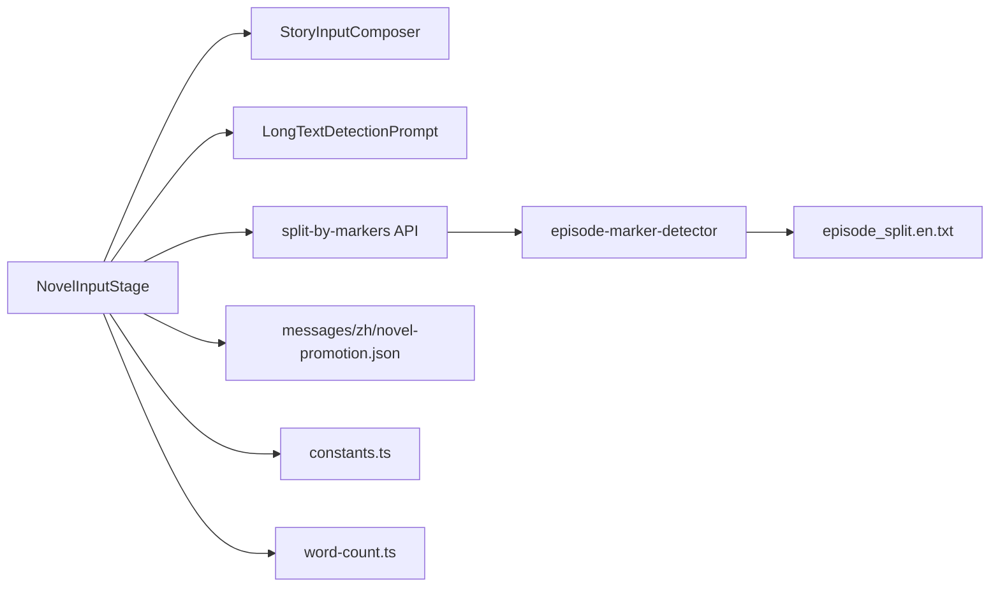

# 故事输入组件

<cite>
**本文档引用的文件**
- [src/app/[locale]/workspace/[projectId]/modes/novel-promotion/components/NovelInputStage.tsx](file://src/app/[locale]/workspace/[projectId]/modes/novel-promotion/components/NovelInputStage.tsx)
- [src/components/story-input/StoryInputComposer.tsx](file://src/components/story-input/StoryInputComposer.tsx)
- [src/components/story-input/LongTextDetectionPrompt.tsx](file://src/components/story-input/LongTextDetectionPrompt.tsx)
- [src/lib/episode-marker-detector.ts](file://src/lib/episode-marker-detector.ts)
- [lib/prompts/novel-promotion/episode_split.en.txt](file://lib/prompts/novel-promotion/episode_split.en.txt)
- [src/app/api/novel-promotion/[projectId]/episodes/split-by-markers/route.ts](file://src/app/api/novel-promotion/[projectId]/episodes/split-by-markers/route.ts)
- [src/lib/workers/handlers/episode-split.ts](file://src/lib/workers/handlers/episode-split.ts)
- [src/lib/constants.ts](file://src/lib/constants.ts)
- [messages/zh/novel-promotion.json](file://messages/zh/novel-promotion.json)
- [src/lib/word-count.ts](file://src/lib/word-count.ts)
- [tests/unit/novel-promotion/novel-input-stage.test.ts](file://tests/unit/novel-promotion/novel-input-stage.test.ts)
- [tests/unit/components/long-text-detection-prompt.test.ts](file://tests/unit/components/long-text-detection-prompt.test.ts)
- [tests/unit/components/story-input-composer.test.ts](file://tests/unit/components/story-input-composer.test.ts)
</cite>

## 目录
1. [引言](#引言)
2. [项目结构](#项目结构)
3. [核心组件](#核心组件)
4. [架构总览](#架构总览)
5. [详细组件分析](#详细组件分析)
6. [依赖关系分析](#依赖关系分析)
7. [性能考量](#性能考量)
8. [故障排查指南](#故障排查指南)
9. [结论](#结论)
10. [附录](#附录)

## 引言
本文件面向Waoowaoo项目中的“故事输入组件”，聚焦于NovelInputStage的小说输入界面设计与交互流程，涵盖以下关键能力：
- StoryInputComposer富文本编辑器的自适应高度、风格与比例控制、IME组合输入防抖处理
- LongTextDetectionPrompt长文本检测与智能分集建议弹窗
- 多集数管理与章节标记检测、自动分割算法
- 格式化处理、智能提示与输入验证规则
- 性能优化策略、大文本处理技术与用户体验改进
- 自定义配置选项与扩展开发指南

## 项目结构
故事输入组件位于novel-promotion工作流中，围绕输入阶段（StoryInputStage）组织，配合共享的StoryInputComposer与LongTextDetectionPrompt，以及后端的章节标记检测与智能分集处理。

**图表来源**
- [src/app/[locale]/workspace/[projectId]/modes/novel-promotion/components/NovelInputStage.tsx](file://src/app/[locale]/workspace/[projectId]/modes/novel-promotion/components/NovelInputStage.tsx#L1-L315)
- [src/components/story-input/StoryInputComposer.tsx:1-173](file://src/components/story-input/StoryInputComposer.tsx#L1-L173)
- [src/components/story-input/LongTextDetectionPrompt.tsx:1-125](file://src/components/story-input/LongTextDetectionPrompt.tsx#L1-L125)
- [src/lib/episode-marker-detector.ts:1-343](file://src/lib/episode-marker-detector.ts#L1-L343)
- [lib/prompts/novel-promotion/episode_split.en.txt:1-41](file://lib/prompts/novel-promotion/episode_split.en.txt#L1-L41)
- [src/app/api/novel-promotion/[projectId]/episodes/split-by-markers/route.ts](file://src/app/api/novel-promotion/[projectId]/episodes/split-by-markers/route.ts#L45-L83)
- [src/lib/workers/handlers/episode-split.ts:118-220](file://src/lib/workers/handlers/episode-split.ts#L118-L220)
- [src/lib/constants.ts:1-275](file://src/lib/constants.ts#L1-L275)
- [messages/zh/novel-promotion.json:92-147](file://messages/zh/novel-promotion.json#L92-L147)
- [src/lib/word-count.ts:1-55](file://src/lib/word-count.ts#L1-L55)

**章节来源**
- [src/app/[locale]/workspace/[projectId]/modes/novel-promotion/components/NovelInputStage.tsx](file://src/app/[locale]/workspace/[projectId]/modes/novel-promotion/components/NovelInputStage.tsx#L1-L315)
- [src/components/story-input/StoryInputComposer.tsx:1-173](file://src/components/story-input/StoryInputComposer.tsx#L1-L173)
- [src/components/story-input/LongTextDetectionPrompt.tsx:1-125](file://src/components/story-input/LongTextDetectionPrompt.tsx#L1-L125)
- [src/lib/episode-marker-detector.ts:1-343](file://src/lib/episode-marker-detector.ts#L1-L343)
- [lib/prompts/novel-promotion/episode_split.en.txt:1-41](file://lib/prompts/novel-promotion/episode_split.en.txt#L1-L41)
- [src/app/api/novel-promotion/[projectId]/episodes/split-by-markers/route.ts](file://src/app/api/novel-promotion/[projectId]/episodes/split-by-markers/route.ts#L45-L83)
- [src/lib/workers/handlers/episode-split.ts:118-220](file://src/lib/workers/handlers/episode-split.ts#L118-L220)
- [src/lib/constants.ts:1-275](file://src/lib/constants.ts#L1-L275)
- [messages/zh/novel-promotion.json:92-147](file://messages/zh/novel-promotion.json#L92-L147)
- [src/lib/word-count.ts:1-55](file://src/lib/word-count.ts#L1-L55)

## 核心组件
- NovelInputStage：小说输入阶段容器，负责状态管理、长文本检测、智能分集触发、风格与比例配置、AI写作集成。
- StoryInputComposer：共享富文本编辑器，提供自适应高度、比例/风格选择器、主次操作区、IME组合输入保护。
- LongTextDetectionPrompt：长文本检测提示弹窗，提供“智能分集”和“继续单集”的决策入口。
- 章节标记检测与智能分集：基于episode-marker-detector的标记检测、预览分割与后端/Worker的智能分集处理。

**章节来源**
- [src/app/[locale]/workspace/[projectId]/modes/novel-promotion/components/NovelInputStage.tsx](file://src/app/[locale]/workspace/[projectId]/modes/novel-promotion/components/NovelInputStage.tsx#L28-L65)
- [src/components/story-input/StoryInputComposer.tsx:19-43](file://src/components/story-input/StoryInputComposer.tsx#L19-L43)
- [src/components/story-input/LongTextDetectionPrompt.tsx:17-23](file://src/components/story-input/LongTextDetectionPrompt.tsx#L17-L23)
- [src/lib/episode-marker-detector.ts:188-342](file://src/lib/episode-marker-detector.ts#L188-L342)

## 架构总览
故事输入的端到端流程如下：

**图表来源**
- [src/app/[locale]/workspace/[projectId]/modes/novel-promotion/components/NovelInputStage.tsx](file://src/app/[locale]/workspace/[projectId]/modes/novel-promotion/components/NovelInputStage.tsx#L97-L108)
- [src/components/story-input/LongTextDetectionPrompt.tsx:25-31](file://src/components/story-input/LongTextDetectionPrompt.tsx#L25-L31)
- [src/app/api/novel-promotion/[projectId]/episodes/split-by-markers/route.ts](file://src/app/api/novel-promotion/[projectId]/episodes/split-by-markers/route.ts#L45-L83)
- [src/lib/episode-marker-detector.ts:188-315](file://src/lib/episode-marker-detector.ts#L188-L315)
- [src/lib/workers/handlers/episode-split.ts:118-220](file://src/lib/workers/handlers/episode-split.ts#L118-L220)

## 详细组件分析

### StoryInputComposer 富文本编辑器
- 设计目标：提供简洁、可扩展的输入容器，支持自适应高度、比例/风格选择器、主次操作区与IME组合输入保护。
- 关键特性
  - 自适应高度：通过计算scrollHeight与最小/最大高度，动态设置textarea高度，并使用requestAnimationFrame平滑过渡。
  - 组合输入保护：通过isComposingRef在IME组合期间仅更新本地状态，组合结束再同步到父组件，避免服务端返回覆盖输入。
  - 控制器：RatioSelector、StyleSelector、StylePresetSelector，支持比例使用说明、风格预设描述。
  - 无障碍与交互：支持placeholder、禁用态、自定义样式类名、事件回调（composition start/end）。
- 参数与行为
  - value/onValueChange：受控输入与变更回调
  - minRows/maxHeightViewportRatio：基础行数与最大高度限制
  - videoRatio/artStyle/stylePreset：比例/风格/风格预设的双向绑定
  - ratioOptions/styleOptions/stylePresetOptions：下拉选项与描述
  - textareaClassName：自定义样式
  - primaryAction/secondaryActions/topRight/footer：布局扩展点

**图表来源**
- [src/components/story-input/StoryInputComposer.tsx:73-104](file://src/components/story-input/StoryInputComposer.tsx#L73-L104)
- [src/app/[locale]/workspace/[projectId]/modes/novel-promotion/components/NovelInputStage.tsx](file://src/app/[locale]/workspace/[projectId]/modes/novel-promotion/components/NovelInputStage.tsx#L74-L95)

**章节来源**
- [src/components/story-input/StoryInputComposer.tsx:19-104](file://src/components/story-input/StoryInputComposer.tsx#L19-L104)
- [src/app/[locale]/workspace/[projectId]/modes/novel-promotion/components/NovelInputStage.tsx](file://src/app/[locale]/workspace/[projectId]/modes/novel-promotion/components/NovelInputStage.tsx#L74-L95)

### LongTextDetectionPrompt 长文本检测提示
- 设计目标：在检测到长文本时，以模态弹窗形式给出“智能分集”和“继续单集”的明确选择，避免单集模式导致生成质量下降。
- 关键特性
  - Portal挂载：通过createPortal渲染到document.body，层级z-[120]，保证覆盖层叠。
  - 键盘交互：支持Escape键关闭。
  - 文案与徽标：标题、描述、强推荐语、智能分集标签与继续标签。
- 与NovelInputStage联动：当文本长度超过阈值（默认1000字），弹出提示；用户选择后回调onSmartSplit或onNext。

**图表来源**
- [src/components/story-input/LongTextDetectionPrompt.tsx:25-43](file://src/components/story-input/LongTextDetectionPrompt.tsx#L25-L43)
- [src/app/[locale]/workspace/[projectId]/modes/novel-promotion/components/NovelInputStage.tsx](file://src/app/[locale]/workspace/[projectId]/modes/novel-promotion/components/NovelInputStage.tsx#L289-L311)

**章节来源**
- [src/components/story-input/LongTextDetectionPrompt.tsx:17-43](file://src/components/story-input/LongTextDetectionPrompt.tsx#L17-L43)
- [src/app/[locale]/workspace/[projectId]/modes/novel-promotion/components/NovelInputStage.tsx](file://src/app/[locale]/workspace/[projectId]/modes/novel-promotion/components/NovelInputStage.tsx#L289-L311)

### 章节标记检测与自动分段
- 章节标记检测（episode-marker-detector）
  - 支持多种标记模式：中文“第X集/第X章/第X幕”、英文“Episode/Chapter”、Markdown加粗数字、纯数字行、数字+中文、场景编号X-Y等。
  - 置信度评估：基于匹配数量与平均间距，给出high/medium/low置信度。
  - 预览分割：生成预览切分，包含集号、标题、字数、索引与前20字预览。
  - 特殊处理：若首个标记非第1集，自动补充第1集内容。
- 智能分集（后端API与Worker）
  - API路由：接收内容，调用detectEpisodeMarkers，返回episodes。
  - Worker处理器：执行AI分集步骤，解析响应，匹配源文本边界，校验索引偏差与区间有效性，输出标准化剧集数组。
  - 提示词：episode_split.en.txt定义了分集规则、JSON输出格式与安全约束。

**图表来源**
- [src/lib/episode-marker-detector.ts:188-315](file://src/lib/episode-marker-detector.ts#L188-L315)
- [src/app/api/novel-promotion/[projectId]/episodes/split-by-markers/route.ts](file://src/app/api/novel-promotion/[projectId]/episodes/split-by-markers/route.ts#L51-L59)
- [src/lib/workers/handlers/episode-split.ts:167-220](file://src/lib/workers/handlers/episode-split.ts#L167-L220)
- [lib/prompts/novel-promotion/episode_split.en.txt:1-41](file://lib/prompts/novel-promotion/episode_split.en.txt#L1-L41)

**章节来源**
- [src/lib/episode-marker-detector.ts:84-342](file://src/lib/episode-marker-detector.ts#L84-L342)
- [src/app/api/novel-promotion/[projectId]/episodes/split-by-markers/route.ts](file://src/app/api/novel-promotion/[projectId]/episodes/split-by-markers/route.ts#L45-L83)
- [src/lib/workers/handlers/episode-split.ts:118-220](file://src/lib/workers/handlers/episode-split.ts#L118-L220)
- [lib/prompts/novel-promotion/episode_split.en.txt:1-41](file://lib/prompts/novel-promotion/episode_split.en.txt#L1-L41)

### 格式化处理、智能提示与输入验证
- 格式化处理
  - 字数统计：countWords遵循Word式规则（中文按字、英文按词），用于长文本提示与UI展示。
  - 文案与提示：messages/zh/novel-promotion.json提供长文本检测文案、比例使用说明、风格提示等。
- 智能提示
  - 比例使用说明：通过getRatioUsageTag映射比例到简短用途标签。
  - 风格提示：ART_STYLES提供风格prompt，便于生成时统一风格。
- 输入验证
  - 长文本阈值：LONG_TEXT_THRESHOLD=1000字，超过阈值触发长文本检测。
  - API参数校验：split-by-markers要求至少2个标记，否则返回INVALID_PARAMS。

**章节来源**
- [src/lib/word-count.ts:16-33](file://src/lib/word-count.ts#L16-L33)
- [messages/zh/novel-promotion.json:138-146](file://messages/zh/novel-promotion.json#L138-L146)
- [src/lib/constants.ts:137-189](file://src/lib/constants.ts#L137-L189)
- [src/app/api/novel-promotion/[projectId]/episodes/split-by-markers/route.ts](file://src/app/api/novel-promotion/[projectId]/episodes/split-by-markers/route.ts#L54-L56)

### 多集数管理与章节标记检测
- 多集数管理
  - NovelInputStage维护localText与父组件novelText的同步，组合输入期间仅本地更新，避免竞态。
  - onSmartSplit回调用于触发智能分集流程，onNext用于继续单集流程。
- 章节标记检测
  - detectEpisodeMarkers对多种模式进行匹配，选择最佳模式并生成预览分割。
  - splitByMarkers根据预览分割切分内容，输出标准剧集对象数组。

**章节来源**
- [src/app/[locale]/workspace/[projectId]/modes/novel-promotion/components/NovelInputStage.tsx](file://src/app/[locale]/workspace/[projectId]/modes/novel-promotion/components/NovelInputStage.tsx#L74-L95)
- [src/lib/episode-marker-detector.ts:188-342](file://src/lib/episode-marker-detector.ts#L188-L342)

## 依赖关系分析
- 组件耦合
  - NovelInputStage依赖StoryInputComposer与LongTextDetectionPrompt，形成输入与提示的协作。
  - StoryInputComposer依赖比例/风格选择器与UI样式，保持高内聚低耦合。
- 外部依赖
  - API路由与Worker处理器依赖episode-marker-detector与提示词模板。
  - 国际化文案来自messages/zh/novel-promotion.json。
  - 常量来自src/lib/constants.ts（比例、风格、模型等）。

**图表来源**
- [src/app/[locale]/workspace/[projectId]/modes/novel-promotion/components/NovelInputStage.tsx](file://src/app/[locale]/workspace/[projectId]/modes/novel-promotion/components/NovelInputStage.tsx#L1-L315)
- [src/components/story-input/StoryInputComposer.tsx:1-173](file://src/components/story-input/StoryInputComposer.tsx#L1-L173)
- [src/components/story-input/LongTextDetectionPrompt.tsx:1-125](file://src/components/story-input/LongTextDetectionPrompt.tsx#L1-L125)
- [src/lib/episode-marker-detector.ts:1-343](file://src/lib/episode-marker-detector.ts#L1-L343)
- [lib/prompts/novel-promotion/episode_split.en.txt:1-41](file://lib/prompts/novel-promotion/episode_split.en.txt#L1-L41)
- [messages/zh/novel-promotion.json:92-147](file://messages/zh/novel-promotion.json#L92-L147)
- [src/lib/constants.ts:1-275](file://src/lib/constants.ts#L1-L275)
- [src/lib/word-count.ts:1-55](file://src/lib/word-count.ts#L1-L55)

**章节来源**
- [src/app/[locale]/workspace/[projectId]/modes/novel-promotion/components/NovelInputStage.tsx](file://src/app/[locale]/workspace/[projectId]/modes/novel-promotion/components/NovelInputStage.tsx#L1-L315)
- [src/components/story-input/StoryInputComposer.tsx:1-173](file://src/components/story-input/StoryInputComposer.tsx#L1-L173)
- [src/components/story-input/LongTextDetectionPrompt.tsx:1-125](file://src/components/story-input/LongTextDetectionPrompt.tsx#L1-L125)
- [src/lib/episode-marker-detector.ts:1-343](file://src/lib/episode-marker-detector.ts#L1-L343)
- [lib/prompts/novel-promotion/episode_split.en.txt:1-41](file://lib/prompts/novel-promotion/episode_split.en.txt#L1-L41)
- [messages/zh/novel-promotion.json:92-147](file://messages/zh/novel-promotion.json#L92-L147)
- [src/lib/constants.ts:1-275](file://src/lib/constants.ts#L1-L275)
- [src/lib/word-count.ts:1-55](file://src/lib/word-count.ts#L1-L55)

## 性能考量
- 自适应高度渲染
  - 使用requestAnimationFrame平滑过渡，避免频繁重排；仅在必要时设置transition与overflowY。
- IME组合输入保护
  - 组合期间不触发父组件同步，减少不必要的API调用与状态更新。
- 长文本检测阈值
  - 通过LONG_TEXT_THRESHOLD（1000字）避免对短文本弹窗打扰，提高交互效率。
- 字数统计
  - countWords按Word规则计算，兼顾中文与英文，避免误判。
- 后端分集
  - Worker分集采用高置信reasoning与多步校验，减少错误边界匹配导致的重试成本。

[本节为通用性能讨论，无需特定文件引用]

## 故障排查指南
- 长文本未触发提示
  - 检查LONG_TEXT_THRESHOLD与实际字数；确认文案键值存在且翻译正确。
- “智能分集”不可用
  - 确认API返回至少2个标记；检查split-by-markers路由的参数校验。
- 分集结果边界不准确
  - 检查Worker处理器的索引校验与偏差阈值；确认提示词模板的JSON安全约束。
- IME输入异常
  - 确认isComposingRef在组合期间为true，组合结束才同步到父组件。

**章节来源**
- [src/app/[locale]/workspace/[projectId]/modes/novel-promotion/components/NovelInputStage.tsx](file://src/app/[locale]/workspace/[projectId]/modes/novel-promotion/components/NovelInputStage.tsx#L97-L108)
- [src/app/api/novel-promotion/[projectId]/episodes/split-by-markers/route.ts](file://src/app/api/novel-promotion/[projectId]/episodes/split-by-markers/route.ts#L54-L56)
- [src/lib/workers/handlers/episode-split.ts:193-220](file://src/lib/workers/handlers/episode-split.ts#L193-L220)

## 结论
故事输入组件通过NovelInputStage、StoryInputComposer与LongTextDetectionPrompt实现了简洁高效的输入体验，并结合章节标记检测与智能分集算法，为长文本创作提供了可靠的多集数管理能力。组件设计强调可扩展性与可维护性，配合完善的国际化文案与常量配置，能够满足多样化的创作需求。

[本节为总结性内容，无需特定文件引用]

## 附录

### 自定义配置选项
- StoryInputComposer
  - minRows：基础行数
  - maxHeightViewportRatio：最大高度占视口比例
  - textareaClassName：自定义样式类
  - ratioOptions/styleOptions/stylePresetOptions：下拉选项与描述
  - getRatioUsage：比例使用说明映射
- NovelInputStage
  - videoRatio/artStyle：初始比例与风格
  - onVideoRatioChange/onArtStyleChange：比例与风格变更回调
  - onSmartSplit：触发智能分集
  - enableNarration/onEnableNarrationChange：旁白开关

**章节来源**
- [src/components/story-input/StoryInputComposer.tsx:19-69](file://src/components/story-input/StoryInputComposer.tsx#L19-L69)
- [src/app/[locale]/workspace/[projectId]/modes/novel-promotion/components/NovelInputStage.tsx](file://src/app/[locale]/workspace/[projectId]/modes/novel-promotion/components/NovelInputStage.tsx#L28-L65)

### 扩展开发指南
- 新增比例/风格
  - 在constants.ts中扩展VIDEO_RATIOS与ART_STYLES，StoryInputComposer会自动消费。
- 新增检测模式
  - 在episode-marker-detector的DETECTION_PATTERNS中添加正则与提取逻辑。
- 新增提示文案
  - 在messages/zh/novel-promotion.json中新增键值，NovelInputStage/LTDP中引用。
- 新增API分集规则
  - 修改episode_split.en.txt提示词，确保JSON安全与边界标记复制。

**章节来源**
- [src/lib/constants.ts:23-189](file://src/lib/constants.ts#L23-L189)
- [src/lib/episode-marker-detector.ts:84-183](file://src/lib/episode-marker-detector.ts#L84-L183)
- [messages/zh/novel-promotion.json:138-146](file://messages/zh/novel-promotion.json#L138-L146)
- [lib/prompts/novel-promotion/episode_split.en.txt:1-41](file://lib/prompts/novel-promotion/episode_split.en.txt#L1-L41)

### 单元测试要点
- NovelInputStage
  - 验证StoryInputComposer的minRows、maxHeightViewportRatio、textareaClassName传入
  - 验证长文本提示文案与按钮渲染
- StoryInputComposer
  - 验证比例/风格选择器渲染与footer/topRight/secondaryActions/primaryAction传入
- LongTextDetectionPrompt
  - 验证Portal挂载与z-index、边框样式

**章节来源**
- [tests/unit/novel-promotion/novel-input-stage.test.ts:69-91](file://tests/unit/novel-promotion/novel-input-stage.test.ts#L69-L91)
- [tests/unit/components/story-input-composer.test.ts:16-79](file://tests/unit/components/story-input-composer.test.ts#L16-L79)
- [tests/unit/components/long-text-detection-prompt.test.ts:30-73](file://tests/unit/components/long-text-detection-prompt.test.ts#L30-L73)