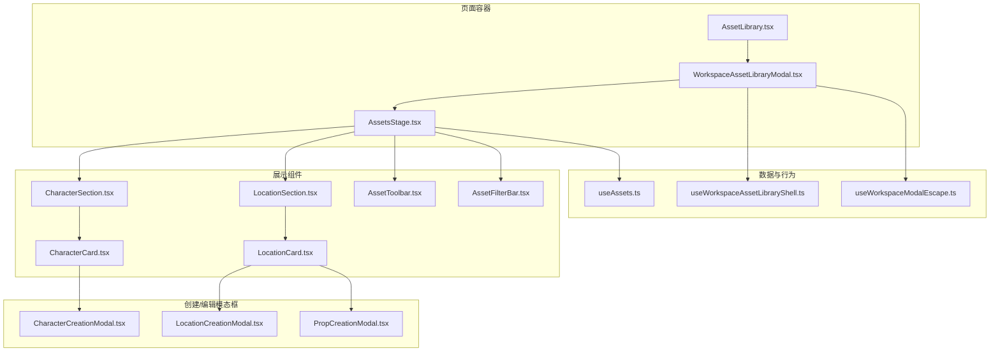
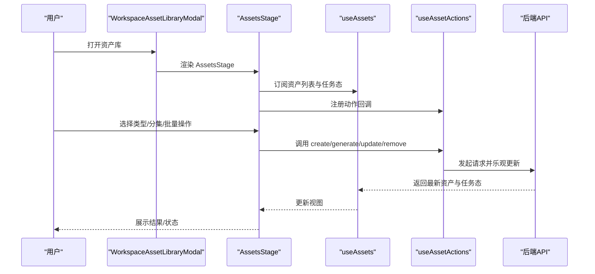
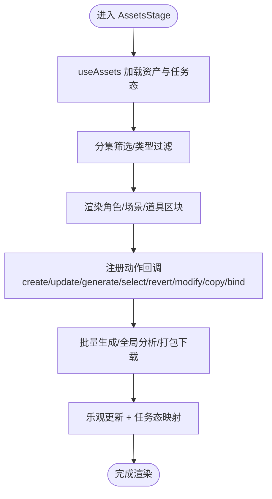
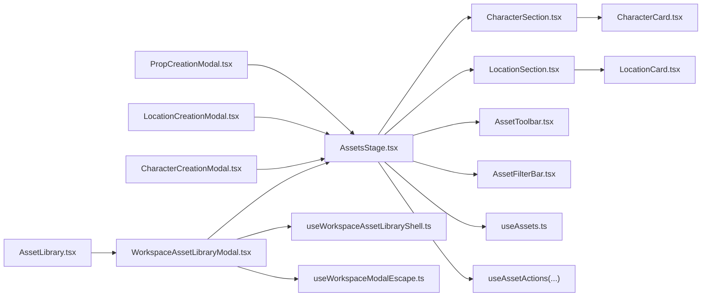

# 资产管理组件

<cite>
**本文档引用的文件**
- [AssetsStage.tsx](file://src/app/[locale]/workspace/[projectId]/modes/novel-promotion/components/AssetsStage.tsx)
- [WorkspaceAssetLibraryModal.tsx](file://src/app/[locale]/workspace/[projectId]/modes/novel-promotion/components/WorkspaceAssetLibraryModal.tsx)
- [AssetLibrary.tsx](file://src/app/[locale]/workspace/[projectId]/modes/novel-promotion/components/AssetLibrary.tsx)
- [AssetToolbar.tsx](file://src/app/[locale]/workspace/[projectId]/modes/novel-promotion/components/assets/AssetToolbar.tsx)
- [AssetFilterBar.tsx](file://src/app/[locale]/workspace/[projectId]/modes/novel-promotion/components/assets/AssetFilterBar.tsx)
- [CharacterSection.tsx](file://src/app/[locale]/workspace/[projectId]/modes/novel-promotion/components/assets/CharacterSection.tsx)
- [LocationSection.tsx](file://src/app/[locale]/workspace/[projectId]/modes/novel-promotion/components/assets/LocationSection.tsx)
- [CharacterCard.tsx](file://src/app/[locale]/workspace/[projectId]/modes/novel-promotion/components/assets/CharacterCard.tsx)
- [LocationCard.tsx](file://src/app/[locale]/workspace/[projectId]/modes/novel-promotion/components/assets/LocationCard.tsx)
- [CharacterCreationModal.tsx](file://src/components/shared/assets/CharacterCreationModal.tsx)
- [LocationCreationModal.tsx](file://src/components/shared/assets/LocationCreationModal.tsx)
- [PropCreationModal.tsx](file://src/components/shared/assets/PropCreationModal.tsx)
- [useAssets.ts](file://src/lib/query/hooks/useAssets.ts)
- [useWorkspaceAssetLibraryShell.ts](file://src/app/[locale]/workspace/[projectId]/modes/novel-promotion/hooks/useWorkspaceAssetLibraryShell.ts)
- [useWorkspaceModalEscape.ts](file://src/app/[locale]/workspace/[projectId]/modes/novel-promotion/hooks/useWorkspaceModalEscape.ts)
- [WorkspaceTopActions.tsx](file://src/app/[locale]/workspace/[projectId]/modes/novel-promotion/components/WorkspaceTopActions.tsx)
- [route.ts](file://src/app/api/asset-hub/upload-image/route.ts)
- [asset-hub-modify-task-handler.ts](file://src/lib/workers/handlers/asset-hub-modify-task-handler.ts)
- [useGlobalAssets.ts](file://src/lib/query/hooks/useGlobalAssets.ts)
</cite>

## 目录
1. [简介](#简介)
2. [项目结构](#项目结构)
3. [核心组件](#核心组件)
4. [架构总览](#架构总览)
5. [详细组件分析](#详细组件分析)
6. [依赖关系分析](#依赖关系分析)
7. [性能考虑](#性能考虑)
8. [故障排查指南](#故障排查指南)
9. [结论](#结论)
10. [附录](#附录)

## 简介
本技术文档围绕 Waoowaoo 的资产管理组件进行系统化梳理，重点覆盖以下方面：
- 资产库组织架构：AssetsStage 资产展示面板、AssetLibrary 全局浮动入口、WorkspaceAssetLibraryModal 弹窗组件
- 角色资产（CharacterCard）、场景资产（LocationCard）与道具资产（PropCreationModal）的设计与交互
- 资产的增删改查、批量处理、图片上传与重新生成、全局分析与复制等能力
- 搜索过滤、分集筛选、标签管理与版本控制的实现思路
- 资产导入导出、全局共享与权限控制的技术细节
- 资产组件的可扩展性与自定义方法

## 项目结构
资产管理模块采用“页面级容器 + 组合式子组件 + Hook 抽象”的分层设计：
- 页面容器：AssetsStage 负责聚合角色/场景/道具三大板块、工具栏、过滤器与弹窗调度
- 展示组件：CharacterSection/LocationSection 负责分块渲染与交互；CharacterCard/LocationCard 负责单条资产卡片
- 创建/编辑模态框：CharacterCreationModal、LocationCreationModal、PropCreationModal
- 工具栏与过滤：AssetToolbar、AssetFilterBar
- 弹窗壳层：WorkspaceAssetLibraryModal、AssetLibrary
- 数据与行为：useAssets、useAssetActions、useWorkspaceAssetLibraryShell 等

图表来源
- [AssetsStage.tsx:64-537](file://src/app/[locale]/workspace/[projectId]/modes/novel-promotion/components/AssetsStage.tsx#L64-L537)
- [WorkspaceAssetLibraryModal.tsx:23-78](file://src/app/[locale]/workspace/[projectId]/modes/novel-promotion/components/WorkspaceAssetLibraryModal.tsx#L23-L78)
- [AssetLibrary.tsx:24-36](file://src/app/[locale]/workspace/[projectId]/modes/novel-promotion/components/AssetLibrary.tsx#L24-L36)
- [CharacterSection.tsx:69-386](file://src/app/[locale]/workspace/[projectId]/modes/novel-promotion/components/assets/CharacterSection.tsx#L69-L386)
- [LocationSection.tsx:43-158](file://src/app/[locale]/workspace/[projectId]/modes/novel-promotion/components/assets/LocationSection.tsx#L43-L158)
- [CharacterCard.tsx:53-523](file://src/app/[locale]/workspace/[projectId]/modes/novel-promotion/components/assets/CharacterCard.tsx#L53-L523)
- [LocationCard.tsx:45-440](file://src/app/[locale]/workspace/[projectId]/modes/novel-promotion/components/assets/LocationCard.tsx#L45-L440)
- [AssetToolbar.tsx:155-298](file://src/app/[locale]/workspace/[projectId]/modes/novel-promotion/components/assets/AssetToolbar.tsx#L155-L298)
- [AssetFilterBar.tsx:25-51](file://src/app/[locale]/workspace/[projectId]/modes/novel-promotion/components/assets/AssetFilterBar.tsx#L25-L51)
- [CharacterCreationModal.tsx:25-278](file://src/components/shared/assets/CharacterCreationModal.tsx#L25-L278)
- [LocationCreationModal.tsx:43-413](file://src/components/shared/assets/LocationCreationModal.tsx#L43-L413)
- [PropCreationModal.tsx:21-179](file://src/components/shared/assets/PropCreationModal.tsx#L21-L179)
- [useAssets.ts:139-495](file://src/lib/query/hooks/useAssets.ts#L139-L495)
- [useWorkspaceAssetLibraryShell.ts:23-96](file://src/app/[locale]/workspace/[projectId]/modes/novel-promotion/hooks/useWorkspaceAssetLibraryShell.ts#L23-L96)
- [useWorkspaceModalEscape.ts:14-39](file://src/app/[locale]/workspace/[projectId]/modes/novel-promotion/hooks/useWorkspaceModalEscape.ts#L14-L39)

章节来源
- [AssetsStage.tsx:64-537](file://src/app/[locale]/workspace/[projectId]/modes/novel-promotion/components/AssetsStage.tsx#L64-L537)
- [WorkspaceAssetLibraryModal.tsx:23-78](file://src/app/[locale]/workspace/[projectId]/modes/novel-promotion/components/WorkspaceAssetLibraryModal.tsx#L23-L78)
- [AssetLibrary.tsx:24-36](file://src/app/[locale]/workspace/[projectId]/modes/novel-promotion/components/AssetLibrary.tsx#L24-L36)

## 核心组件
- AssetsStage：小说推文模式专用的资产确认阶段，整合角色/场景/道具的展示、筛选、批量生成、全局分析、图片编辑与复制等功能
- WorkspaceAssetLibraryModal：工作区内的资产库弹窗壳层，承载 AssetsStage 并提供加载态与遮罩交互
- AssetLibrary：全局浮动入口，复用 AssetsStage，支持一键打开与下载全量资源
- AssetToolbar：顶部工具栏，提供剧集筛选、全局分析、打包下载等操作
- AssetFilterBar：资产类型过滤器，支持按角色/场景/道具切换
- CharacterSection/LocationSection：资产分块渲染，负责分集筛选、任务态展示与回调分发
- CharacterCard/LocationCard：单资产卡片，支持多图选择、上传替换、重新生成、撤销、AI 编辑等
- 创建/编辑模态框：CharacterCreationModal、LocationCreationModal、PropCreationModal，分别负责资产创建与参数配置

章节来源
- [AssetsStage.tsx:64-537](file://src/app/[locale]/workspace/[projectId]/modes/novel-promotion/components/AssetsStage.tsx#L64-L537)
- [WorkspaceAssetLibraryModal.tsx:23-78](file://src/app/[locale]/workspace/[projectId]/modes/novel-promotion/components/WorkspaceAssetLibraryModal.tsx#L23-L78)
- [AssetToolbar.tsx:155-298](file://src/app/[locale]/workspace/[projectId]/modes/novel-promotion/components/assets/AssetToolbar.tsx#L155-L298)
- [AssetFilterBar.tsx:25-51](file://src/app/[locale]/workspace/[projectId]/modes/novel-promotion/components/assets/AssetFilterBar.tsx#L25-L51)
- [CharacterSection.tsx:69-386](file://src/app/[locale]/workspace/[projectId]/modes/novel-promotion/components/assets/CharacterSection.tsx#L69-L386)
- [LocationSection.tsx:43-158](file://src/app/[locale]/workspace/[projectId]/modes/novel-promotion/components/assets/LocationSection.tsx#L43-L158)
- [CharacterCard.tsx:53-523](file://src/app/[locale]/workspace/[projectId]/modes/novel-promotion/components/assets/CharacterCard.tsx#L53-L523)
- [LocationCard.tsx:45-440](file://src/app/[locale]/workspace/[projectId]/modes/novel-promotion/components/assets/LocationCard.tsx#L45-L440)
- [CharacterCreationModal.tsx:25-278](file://src/components/shared/assets/CharacterCreationModal.tsx#L25-L278)
- [LocationCreationModal.tsx:43-413](file://src/components/shared/assets/LocationCreationModal.tsx#L43-L413)
- [PropCreationModal.tsx:21-179](file://src/components/shared/assets/PropCreationModal.tsx#L21-L179)

## 架构总览
资产管理采用“查询驱动 + 乐观更新 + 任务态映射”的架构：
- 查询层：useAssets 提供资产列表与任务态映射，自动合并实体态与任务态
- 动作层：useAssetActions 提供 create/update/generate/select/revert/modify/copy/bind 等动作
- UI 层：各 Section/Card 组件基于任务键集合 activeTaskKeys 控制按钮禁用与状态展示
- 弹窗层：WorkspaceAssetLibraryModal 作为壳层，结合 useWorkspaceAssetLibraryShell 管理打开/关闭与焦点字符

图表来源
- [WorkspaceAssetLibraryModal.tsx:23-78](file://src/app/[locale]/workspace/[projectId]/modes/novel-promotion/components/WorkspaceAssetLibraryModal.tsx#L23-L78)
- [AssetsStage.tsx:64-537](file://src/app/[locale]/workspace/[projectId]/modes/novel-promotion/components/AssetsStage.tsx#L64-L537)
- [useAssets.ts:139-175](file://src/lib/query/hooks/useAssets.ts#L139-L175)
- [useAssets.ts:262-495](file://src/lib/query/hooks/useAssets.ts#L262-L495)

## 详细组件分析

### AssetsStage：资产展示与控制中枢
- 职责：聚合角色/场景/道具三块区域，提供工具栏、过滤器、弹窗与全局分析
- 关键点：
  - 使用 useAssets 获取资产与任务态，自动合并实体态与任务态
  - 通过 useAssetActions 提供 create/update/generate/select/revert/modify/copy/bind 等动作
  - 支持分集筛选：根据剧集 clips 名称模糊匹配角色/场景/道具，形成 episodeAssetIds
  - 任务态：activeTaskKeys 用于标识当前运行的任务键，控制按钮禁用与状态展示
  - 全局分析：触发 onGlobalAnalyze，完成后回调 onGlobalAnalyzeComplete
  - 图片生成：handleGenerateImage 统一封装角色/场景/道具的生成调用

图表来源
- [AssetsStage.tsx:64-537](file://src/app/[locale]/workspace/[projectId]/modes/novel-promotion/components/AssetsStage.tsx#L64-L537)
- [useAssets.ts:139-175](file://src/lib/query/hooks/useAssets.ts#L139-L175)

章节来源
- [AssetsStage.tsx:64-537](file://src/app/[locale]/workspace/[projectId]/modes/novel-promotion/components/AssetsStage.tsx#L64-L537)
- [useAssets.ts:139-175](file://src/lib/query/hooks/useAssets.ts#L139-L175)

### WorkspaceAssetLibraryModal：弹窗壳层
- 职责：包裹 AssetsStage，提供遮罩层、加载态、Esc 关闭与焦点字符定位
- 关键点：
  - isOpen 控制显示/隐藏
  - assetsLoading 与 assetsLoadingState 控制加载态
  - focusCharacterId/focusCharacterRequestId 用于首次打开时滚动聚焦
  - triggerGlobalAnalyze/onGlobalAnalyzeComplete 用于触发全局分析并回调

章节来源
- [WorkspaceAssetLibraryModal.tsx:23-78](file://src/app/[locale]/workspace/[projectId]/modes/novel-promotion/components/WorkspaceAssetLibraryModal.tsx#L23-L78)

### AssetLibrary：全局浮动入口
- 职责：提供全局浮动按钮，打开后复用 AssetsStage
- 关键点：
  - 通过 useAssets 获取项目资产，支持下载全量资源
  - 下载逻辑：遍历角色/场景/道具的图片，打包为 zip

章节来源
- [AssetLibrary.tsx:24-36](file://src/app/[locale]/workspace/[projectId]/modes/novel-promotion/components/AssetLibrary.tsx#L24-L36)
- [AssetToolbar.tsx:175-247](file://src/app/[locale]/workspace/[projectId]/modes/novel-promotion/components/assets/AssetToolbar.tsx#L175-L247)

### AssetToolbar：工具栏与剧集筛选
- 职责：顶部操作区，提供剧集筛选、全局分析、打包下载
- 关键点：
  - 剧集筛选：EpisodeChip 下拉菜单，支持清空与定位
  - 全局分析：onGlobalAnalyze 触发
  - 打包下载：收集角色/场景/道具的选中图片，生成 zip

章节来源
- [AssetToolbar.tsx:155-298](file://src/app/[locale]/workspace/[projectId]/modes/novel-promotion/components/assets/AssetToolbar.tsx#L155-L298)

### AssetFilterBar：类型过滤
- 职责：按角色/场景/道具切换展示
- 关键点：显示各类别计数，联动 AssetsStage 的 kindFilter

章节来源
- [AssetFilterBar.tsx:25-51](file://src/app/[locale]/workspace/[projectId]/modes/novel-promotion/components/assets/AssetFilterBar.tsx#L25-L51)

### CharacterSection/LocationSection：分块渲染与交互
- 职责：按角色/场景/道具分块渲染，支持分集筛选与任务态展示
- 关键点：
  - CharacterSection：支持待确认角色档案内嵌展示、批量确认、音色绑定与从资产中心复制
  - LocationSection：支持 location/prop 二合一渲染，统一生成类型解析

章节来源
- [CharacterSection.tsx:69-386](file://src/app/[locale]/workspace/[projectId]/modes/novel-promotion/components/assets/CharacterSection.tsx#L69-L386)
- [LocationSection.tsx:43-158](file://src/app/[locale]/workspace/[projectId]/modes/novel-promotion/components/assets/LocationSection.tsx#L43-L158)

### CharacterCard/LocationCard：单资产卡片
- 职责：单资产卡片，支持多图选择、上传替换、重新生成、撤销、AI 编辑
- 关键点：
  - 选择模式：多图时显示选择与确认流程
  - 单图模式：覆盖层按钮，支持上传、编辑、重新生成、撤销
  - 任务态：基于 activeTaskKeys 与任务态映射，统一展示生成/重新生成状态
  - 版本控制：支持 previousImageUrl/previousImageUrls 撤销

章节来源
- [CharacterCard.tsx:53-523](file://src/app/[locale]/workspace/[projectId]/modes/novel-promotion/components/assets/CharacterCard.tsx#L53-L523)
- [LocationCard.tsx:45-440](file://src/app/[locale]/workspace/[projectId]/modes/novel-promotion/components/assets/LocationCard.tsx#L45-L440)

### 创建/编辑模态框：资产创建与参数配置
- 角色资产创建：CharacterCreationModal，支持参考图/描述两种创建方式，AI 设计与批量生成
- 场景资产创建：LocationCreationModal，支持 AI 设计场景描述与可用槽位
- 道具资产创建：PropCreationModal，支持名称/摘要/描述与批量生成

章节来源
- [CharacterCreationModal.tsx:25-278](file://src/components/shared/assets/CharacterCreationModal.tsx#L25-L278)
- [LocationCreationModal.tsx:43-413](file://src/components/shared/assets/LocationCreationModal.tsx#L43-L413)
- [PropCreationModal.tsx:21-179](file://src/components/shared/assets/PropCreationModal.tsx#L21-L179)

### 数据与行为：useAssets 与 useAssetActions
- useAssets：统一查询资产与任务态，自动合并实体态与任务态，支持刷新与失效策略
- useAssetActions：封装 create/update/generate/select/revert/modify/copy/bind 等动作，统一乐观更新与错误处理

章节来源
- [useAssets.ts:139-175](file://src/lib/query/hooks/useAssets.ts#L139-L175)
- [useAssets.ts:262-495](file://src/lib/query/hooks/useAssets.ts#L262-L495)

### 弹窗与快捷键：useWorkspaceAssetLibraryShell 与 useWorkspaceModalEscape
- useWorkspaceAssetLibraryShell：管理资产库打开/关闭、焦点字符、全局分析触发与路由参数同步
- useWorkspaceModalEscape：Esc 关闭资产库/设置/世界上下文弹窗

章节来源
- [useWorkspaceAssetLibraryShell.ts:23-96](file://src/app/[locale]/workspace/[projectId]/modes/novel-promotion/hooks/useWorkspaceAssetLibraryShell.ts#L23-L96)
- [useWorkspaceModalEscape.ts:14-39](file://src/app/[locale]/workspace/[projectId]/modes/novel-promotion/hooks/useWorkspaceModalEscape.ts#L14-L39)

## 依赖关系分析
资产管理组件的依赖关系如下：

图表来源
- [AssetsStage.tsx:64-537](file://src/app/[locale]/workspace/[projectId]/modes/novel-promotion/components/AssetsStage.tsx#L64-L537)
- [WorkspaceAssetLibraryModal.tsx:23-78](file://src/app/[locale]/workspace/[projectId]/modes/novel-promotion/components/WorkspaceAssetLibraryModal.tsx#L23-L78)
- [AssetLibrary.tsx:24-36](file://src/app/[locale]/workspace/[projectId]/modes/novel-promotion/components/AssetLibrary.tsx#L24-L36)
- [CharacterSection.tsx:69-386](file://src/app/[locale]/workspace/[projectId]/modes/novel-promotion/components/assets/CharacterSection.tsx#L69-L386)
- [LocationSection.tsx:43-158](file://src/app/[locale]/workspace/[projectId]/modes/novel-promotion/components/assets/LocationSection.tsx#L43-L158)
- [CharacterCard.tsx:53-523](file://src/app/[locale]/workspace/[projectId]/modes/novel-promotion/components/assets/CharacterCard.tsx#L53-L523)
- [LocationCard.tsx:45-440](file://src/app/[locale]/workspace/[projectId]/modes/novel-promotion/components/assets/LocationCard.tsx#L45-L440)
- [AssetToolbar.tsx:155-298](file://src/app/[locale]/workspace/[projectId]/modes/novel-promotion/components/assets/AssetToolbar.tsx#L155-L298)
- [AssetFilterBar.tsx:25-51](file://src/app/[locale]/workspace/[projectId]/modes/novel-promotion/components/assets/AssetFilterBar.tsx#L25-L51)
- [useAssets.ts:139-175](file://src/lib/query/hooks/useAssets.ts#L139-L175)
- [useWorkspaceAssetLibraryShell.ts:23-96](file://src/app/[locale]/workspace/[projectId]/modes/novel-promotion/hooks/useWorkspaceAssetLibraryShell.ts#L23-L96)
- [useWorkspaceModalEscape.ts:14-39](file://src/app/[locale]/workspace/[projectId]/modes/novel-promotion/hooks/useWorkspaceModalEscape.ts#L14-L39)

章节来源
- [AssetsStage.tsx:64-537](file://src/app/[locale]/workspace/[projectId]/modes/novel-promotion/components/AssetsStage.tsx#L64-L537)
- [WorkspaceAssetLibraryModal.tsx:23-78](file://src/app/[locale]/workspace/[projectId]/modes/novel-promotion/components/WorkspaceAssetLibraryModal.tsx#L23-L78)
- [AssetLibrary.tsx:24-36](file://src/app/[locale]/workspace/[projectId]/modes/novel-promotion/components/AssetLibrary.tsx#L24-L36)
- [useAssets.ts:139-175](file://src/lib/query/hooks/useAssets.ts#L139-L175)

## 性能考虑
- 查询缓存与失效：useAssets 设置 staleTime，配合 queryKeys 与 invalidateScopeQueries 控制刷新范围
- 任务态映射：通过 flattenTaskRefs 与 byKey 映射，避免重复计算，提升渲染性能
- 乐观更新：useAssetActions 在调用后立即更新缓存，减少等待时间
- 批量生成：activeTaskKeys 与任务键命名规范，避免重复提交与竞态
- 图片下载：JSZip 并行下载，失败单图不影响整体

## 故障排查指南
- 图片上传失败：检查 fileInputRef 与 mutate 回调，查看 shouldShowError 与 alert 提示
- 生成卡住：查看 isTaskRunning/isAnyTaskRunning 与 displayTaskPresentation，确认任务键是否正确注册/清理
- 全局分析不可用：检查 isGlobalAnalyzing/isBatchSubmitting/isAnalyzingAssets 的禁用条件
- 从资产中心复制失败：确认 scope 为 project 且 projectId 存在，检查 copyFromGlobal 返回值
- 打包下载为空：确认 assets 中存在选中图片，否则提示 downloadEmpty

章节来源
- [CharacterCard.tsx:110-135](file://src/app/[locale]/workspace/[projectId]/modes/novel-promotion/components/assets/CharacterCard.tsx#L110-L135)
- [LocationCard.tsx:83-107](file://src/app/[locale]/workspace/[projectId]/modes/novel-promotion/components/assets/LocationCard.tsx#L83-L107)
- [AssetToolbar.tsx:269-279](file://src/app/[locale]/workspace/[projectId]/modes/novel-promotion/components/assets/AssetToolbar.tsx#L269-L279)
- [useAssets.ts:407-425](file://src/lib/query/hooks/useAssets.ts#L407-425)
- [AssetToolbar.tsx:175-247](file://src/app/[locale]/workspace/[projectId]/modes/novel-promotion/components/assets/AssetToolbar.tsx#L175-L247)

## 结论
本资产管理组件以 AssetsStage 为核心，通过模块化的 Section/Card 与统一的数据/Hook 抽象，实现了角色/场景/道具的全生命周期管理。借助任务态映射与乐观更新，系统在交互流畅性与一致性方面表现良好。全局分析、批量生成、打包下载与资产复制等能力进一步提升了创作效率。后续可在标签管理、版本控制与权限体系上继续完善。

## 附录

### 资产增删改查与批量处理
- 增删改查：通过 useAssetActions 的 create/update/remove/updateVariant/updateLabel 等方法实现
- 批量处理：activeTaskKeys 与任务键命名规范，支持整组重新生成与批量确认
- 图片操作：selectRender/revertRender/modifyRender，支持上传替换与 AI 编辑

章节来源
- [useAssets.ts:262-495](file://src/lib/query/hooks/useAssets.ts#L262-L495)

### 搜索过滤与分集筛选
- 类型过滤：AssetFilterBar 切换角色/场景/道具
- 分集筛选：AssetToolbar 的 EpisodeChip，结合 AssetsStage 的 episodeAssetIds 实现精准筛选

章节来源
- [AssetFilterBar.tsx:25-51](file://src/app/[locale]/workspace/[projectId]/modes/novel-promotion/components/assets/AssetFilterBar.tsx#L25-L51)
- [AssetToolbar.tsx:155-298](file://src/app/[locale]/workspace/[projectId]/modes/novel-promotion/components/assets/AssetToolbar.tsx#L155-L298)
- [AssetsStage.tsx:145-183](file://src/app/[locale]/workspace/[projectId]/modes/novel-promotion/components/AssetsStage.tsx#L145-L183)

### 标签管理与版本控制
- 标签管理：updateLabel 支持修改资产标签名
- 版本控制：revertRender 支持回滚到上一版本；previousImageUrl/previousImageUrls 记录历史版本

章节来源
- [useAssets.ts:446-462](file://src/lib/query/hooks/useAssets.ts#L446-L462)
- [useAssets.ts:370-386](file://src/lib/query/hooks/useAssets.ts#L370-L386)

### 资产导入导出与全局共享
- 导入：copyFromGlobal 支持从资产中心复制到项目
- 导出：AssetToolbar 打包下载全量资源
- 全局共享：useGlobalAssets 提供资产中心场景列表，支持全局资产浏览

章节来源
- [useAssets.ts:407-425](file://src/lib/query/hooks/useAssets.ts#L407-L425)
- [AssetToolbar.tsx:175-247](file://src/app/[locale]/workspace/[projectId]/modes/novel-promotion/components/assets/AssetToolbar.tsx#L175-L247)
- [useGlobalAssets.ts:142-173](file://src/lib/query/hooks/useGlobalAssets.ts#L142-L173)

### 权限控制与安全
- 身份认证：API 层 requireUserAuth 与 isErrorResponse 统一鉴权与错误处理
- 资产上传：route.ts 对全局资产外观/场景图片进行数据库更新与存储编码
- 资产修改：asset-hub-modify-task-handler 读取用户模型与修改指令，执行资产修改任务

章节来源
- [route.ts:1-40](file://src/app/api/asset-hub/upload-image/route.ts#L1-L40)
- [asset-hub-modify-task-handler.ts:87-93](file://src/lib/workers/handlers/asset-hub-modify-task-handler.ts#L87-L93)

### 自定义扩展方法
- 新增资产类型：在 AssetsStage 中新增 Section 与 Card，并接入 useAssetActions
- 新增筛选维度：扩展 AssetFilterBar 与 AssetsStage 的过滤逻辑
- 新增动作：在 useAssetActions 中添加新动作并在 UI 中调用
- 新增模态框：参照现有模态框结构，接入表单与提交逻辑

章节来源
- [AssetsStage.tsx:64-537](file://src/app/[locale]/workspace/[projectId]/modes/novel-promotion/components/AssetsStage.tsx#L64-L537)
- [useAssets.ts:262-495](file://src/lib/query/hooks/useAssets.ts#L262-L495)