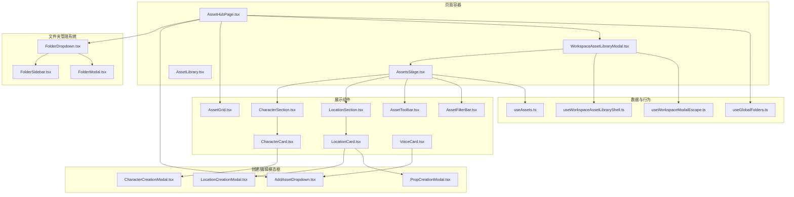
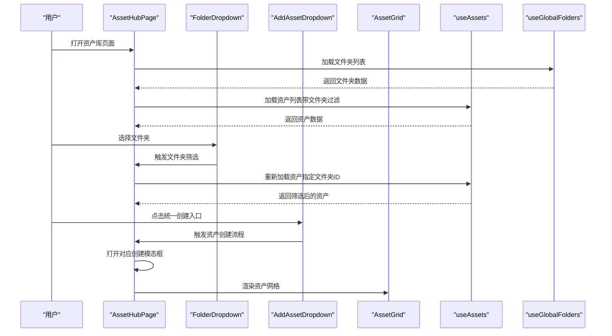
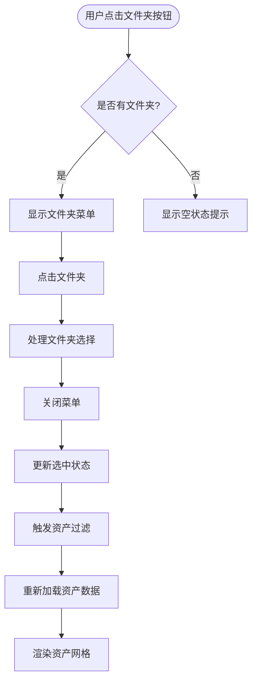
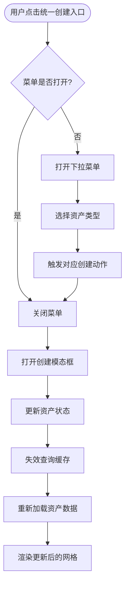
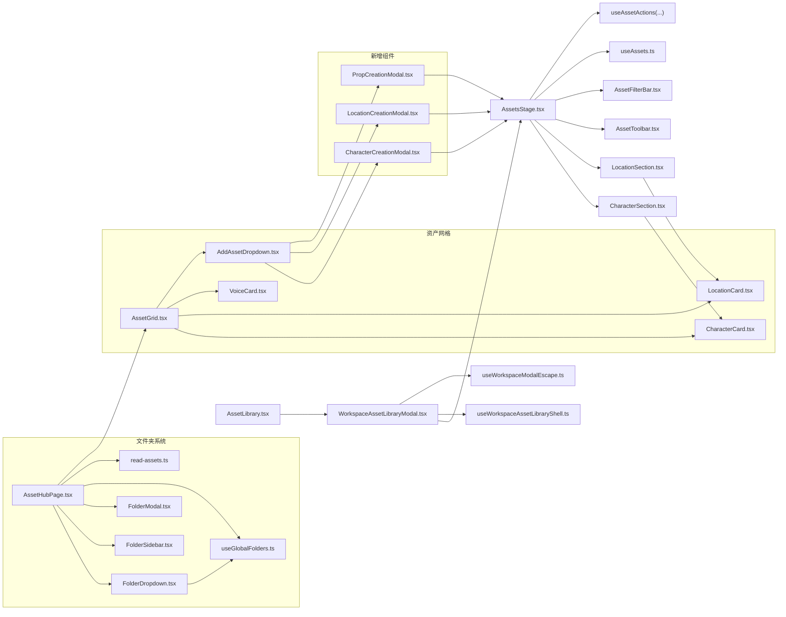

# 资产管理组件

<cite>
**本文档引用的文件**
- [AssetsStage.tsx](file://src/app/[locale]/workspace/[projectId]/modes/novel-promotion/components/AssetsStage.tsx)
- [WorkspaceAssetLibraryModal.tsx](file://src/app/[locale]/workspace/[projectId]/modes/novel-promotion/components/WorkspaceAssetLibraryModal.tsx)
- [AssetLibrary.tsx](file://src/app/[locale]/workspace/[projectId]/modes/novel-promotion/components/AssetLibrary.tsx)
- [AssetToolbar.tsx](file://src/app/[locale]/workspace/[projectId]/modes/novel-promotion/components/assets/AssetToolbar.tsx)
- [AssetFilterBar.tsx](file://src/app/[locale]/workspace/[projectId]/modes/novel-promotion/components/assets/AssetFilterBar.tsx)
- [CharacterSection.tsx](file://src/app/[locale]/workspace/[projectId]/modes/novel-promotion/components/assets/CharacterSection.tsx)
- [LocationSection.tsx](file://src/app/[locale]/workspace/[projectId]/modes/novel-promotion/components/assets/LocationSection.tsx)
- [CharacterCard.tsx](file://src/app/[locale]/workspace/asset-hub/components/CharacterCard.tsx)
- [LocationCard.tsx](file://src/app/[locale]/workspace/asset-hub/components/LocationCard.tsx)
- [VoiceCard.tsx](file://src/app/[locale]/workspace/asset-hub/components/VoiceCard.tsx)
- [CharacterCreationModal.tsx](file://src/components/shared/assets/CharacterCreationModal.tsx)
- [LocationCreationModal.tsx](file://src/components/shared/assets/LocationCreationModal.tsx)
- [PropCreationModal.tsx](file://src/components/shared/assets/PropCreationModal.tsx)
- [useAssets.ts](file://src/lib/query/hooks/useAssets.ts)
- [useWorkspaceAssetLibraryShell.ts](file://src/app/[locale]/workspace/[projectId]/modes/novel-promotion/hooks/useWorkspaceAssetLibraryShell.ts)
- [useWorkspaceModalEscape.ts](file://src/app/[locale]/workspace/[projectId]/modes/novel-promotion/hooks/useWorkspaceModalEscape.ts)
- [WorkspaceTopActions.tsx](file://src/app/[locale]/workspace/[projectId]/modes/novel-promotion/components/WorkspaceTopActions.tsx)
- [route.ts](file://src/app/api/asset-hub/upload-image/route.ts)
- [asset-hub-modify-task-handler.ts](file://src/lib/workers/handlers/asset-hub-modify-task-handler.ts)
- [useGlobalAssets.ts](file://src/lib/query/hooks/useGlobalAssets.ts)
- [FolderDropdown.tsx](file://src/app/[locale]/workspace/asset-hub/components/FolderDropdown.tsx)
- [FolderSidebar.tsx](file://src/app/[locale]/workspace/asset-hub/components/FolderSidebar.tsx)
- [AssetGrid.tsx](file://src/app/[locale]/workspace/asset-hub/components/AssetGrid.tsx)
- [FolderModal.tsx](file://src/app/[locale]/workspace/asset-hub/components/FolderModal.tsx)
- [page.tsx](file://src/app/[locale]/workspace/asset-hub/page.tsx)
- [AddAssetDropdown.tsx](file://src/app/[locale]/workspace/asset-hub/components/AddAssetDropdown.tsx)
- [route.ts](file://src/app/api/asset-hub/folders/route.ts)
- [route.ts](file://src/app/api/asset-hub/folders/[folderId]/route.ts)
- [read-assets.ts](file://src/lib/assets/services/read-assets.ts)
</cite>

## 更新摘要
**变更内容**
- 资产库模态框最大宽度从约束改为1400像素，提升大屏显示效果
- 资产网格布局调整为更宽的卡片设计，列数从5-8列减少到3-5列以优化显示效果
- 所有资产类别列数从5-8列减少到3-5列，提升可读性和视觉层次
- 资产中心页面采用固定头部布局，增强界面稳定性与专业感
- 新增 AddAssetDropdown 组件作为统一资产创建入口，提供角色/场景/道具/音色的一键创建功能
- AssetGrid 组件重构：移除内部文件夹管理功能，专注于资产网格展示和分页
- FolderDropdown 组件改进：优化空状态处理，提供更友好的用户体验

## 目录
1. [简介](#简介)
2. [项目结构](#项目结构)
3. [核心组件](#核心组件)
4. [架构总览](#架构总览)
5. [详细组件分析](#详细组件分析)
6. [文件夹管理系统](#文件夹管理系统)
7. [新增资产创建入口](#新增资产创建入口)
8. [界面布局改进](#界面布局改进)
9. [依赖关系分析](#依赖关系分析)
10. [性能考虑](#性能考虑)
11. [故障排查指南](#故障排查指南)
12. [结论](#结论)
13. [附录](#附录)

## 简介
本技术文档围绕 Waoowaoo 的资产管理组件进行系统化梳理，重点覆盖以下方面：
- 资产库组织架构：AssetsStage 资产展示面板、AssetLibrary 全局浮动入口、WorkspaceAssetLibraryModal 弹窗组件
- 角色资产（CharacterCard）、场景资产（LocationCard）、道具资产（PropCreationModal）与音色资产（VoiceCard）的设计与交互
- 资产的增删改查、批量处理、图片上传与重新生成、全局分析与复制等能力
- 搜索过滤、分集筛选、标签管理与版本控制的实现思路
- **新增**：统一资产创建入口 AddAssetDropdown，提供一体化的资产创建体验
- **重构**：AssetGrid 组件专注网格展示，移除文件夹管理职责
- **改进**：FolderDropdown 空状态处理优化，提升用户体验
- **界面布局升级**：资产库模态框最大宽度1400像素，资产网格列数优化至3-5列
- 资产导入导出、全局共享与权限控制的技术细节
- 资产组件的可扩展性与自定义方法

## 项目结构
资产管理模块采用"页面级容器 + 组合式子组件 + Hook 抽象"的分层设计：
- 页面容器：AssetsStage 负责聚合角色/场景/道具三大板块、工具栏、过滤器与弹窗调度
- 展示组件：CharacterSection/LocationSection 负责分块渲染与交互；CharacterCard/LocationCard/VoiceCard 负责单条资产卡片
- 创建/编辑模态框：CharacterCreationModal、LocationCreationModal、PropCreationModal
- 工具栏与过滤：AssetToolbar、AssetFilterBar
- 弹窗壳层：WorkspaceAssetLibraryModal、AssetLibrary
- **新增**：统一资产创建入口：AddAssetDropdown
- **重构**：资产网格：AssetGrid 专注展示，移除文件夹管理
- 文件夹管理系统：FolderDropdown、FolderSidebar、FolderModal
- 数据与行为：useAssets、useAssetActions、useWorkspaceAssetLibraryShell 等

**图表来源**
- [AssetsStage.tsx:64-537](file://src/app/[locale]/workspace/[projectId]/modes/novel-promotion/components/AssetsStage.tsx#L64-L537)
- [WorkspaceAssetLibraryModal.tsx:23-78](file://src/app/[locale]/workspace/[projectId]/modes/novel-promotion/components/WorkspaceAssetLibraryModal.tsx#L23-L78)
- [AssetLibrary.tsx:24-36](file://src/app/[locale]/workspace/[projectId]/modes/novel-promotion/components/AssetLibrary.tsx#L24-L36)
- [AssetHubPage.tsx:33-709](file://src/app/[locale]/workspace/asset-hub/page.tsx#L33-L709)
- [FolderDropdown.tsx:1-180](file://src/app/[locale]/workspace/asset-hub/components/FolderDropdown.tsx#L1-L180)
- [FolderSidebar.tsx:1-127](file://src/app/[locale]/workspace/asset-hub/components/FolderSidebar.tsx#L1-L127)
- [AssetGrid.tsx:1-306](file://src/app/[locale]/workspace/asset-hub/components/AssetGrid.tsx#L1-L306)
- [AddAssetDropdown.tsx:1-98](file://src/app/[locale]/workspace/asset-hub/components/AddAssetDropdown.tsx#L1-L98)

## 核心组件
- AssetsStage：小说推文模式专用的资产确认阶段，整合角色/场景/道具的展示、筛选、批量生成、全局分析、图片编辑与复制等功能
- WorkspaceAssetLibraryModal：工作区内的资产库弹窗壳层，承载 AssetsStage 并提供加载态与遮罩交互
- AssetLibrary：全局浮动入口，复用 AssetsStage，支持一键打开与下载全量资源
- AssetToolbar：顶部工具栏，提供剧集筛选、全局分析、打包下载等操作
- AssetFilterBar：资产类型过滤器，支持按角色/场景/道具/音色切换
- **新增**：AddAssetDropdown：统一资产创建入口，提供角色/场景/道具/音色的一键创建功能
- **重构**：AssetGrid：专注资产网格展示，移除文件夹管理职责，支持分页和空状态处理
- **改进**：FolderDropdown：优化空状态处理，提供更友好的用户体验
- AssetCard：单资产卡片组件，支持角色、场景、道具和音色的不同展示样式
- 创建/编辑模态框：CharacterCreationModal、LocationCreationModal、PropCreationModal，分别负责资产创建与参数配置

**章节来源**
- [AssetsStage.tsx:64-537](file://src/app/[locale]/workspace/[projectId]/modes/novel-promotion/components/AssetsStage.tsx#L64-L537)
- [WorkspaceAssetLibraryModal.tsx:23-78](file://src/app/[locale]/workspace/[projectId]/modes/novel-promotion/components/WorkspaceAssetLibraryModal.tsx#L23-L78)
- [AssetToolbar.tsx:155-298](file://src/app/[locale]/workspace/[projectId]/modes/novel-promotion/components/assets/AssetToolbar.tsx#L155-L298)
- [AssetFilterBar.tsx:25-51](file://src/app/[locale]/workspace/[projectId]/modes/novel-promotion/components/assets/AssetFilterBar.tsx#L25-L51)
- [AddAssetDropdown.tsx:15-98](file://src/app/[locale]/workspace/asset-hub/components/AddAssetDropdown.tsx#L15-L98)
- [AssetGrid.tsx:31-306](file://src/app/[locale]/workspace/asset-hub/components/AssetGrid.tsx#L31-L306)
- [FolderDropdown.tsx:22-180](file://src/app/[locale]/workspace/asset-hub/components/FolderDropdown.tsx#L22-L180)

## 架构总览
资产管理采用"查询驱动 + 乐观更新 + 任务态映射 + 文件夹过滤"的架构：
- 查询层：useAssets 提供资产列表与任务态映射，自动合并实体态与任务态
- **增强**：useGlobalFolders 提供文件夹列表查询，支持文件夹级别的资产过滤
- 动作层：useAssetActions 提供 create/update/generate/select/revert/modify/copy/bind 等动作
- UI 层：各 Section/Card 组件基于任务键集合 activeTaskKeys 控制按钮禁用与状态展示
- **新增**：AddAssetDropdown 作为统一入口，简化资产创建流程
- **重构**：AssetGrid 专注展示，通过 props 接收文件夹过滤状态
- **改进**：FolderDropdown 优化空状态处理，提升用户体验
- 弹窗层：WorkspaceAssetLibraryModal 作为壳层，结合 useWorkspaceAssetLibraryShell 管理打开/关闭与焦点字符

**图表来源**
- [AssetHubPage.tsx:33-709](file://src/app/[locale]/workspace/asset-hub/page.tsx#L33-L709)
- [FolderDropdown.tsx:22-180](file://src/app/[locale]/workspace/asset-hub/components/FolderDropdown.tsx#L22-L180)
- [AddAssetDropdown.tsx:15-98](file://src/app/[locale]/workspace/asset-hub/components/AddAssetDropdown.tsx#L15-L98)
- [AssetGrid.tsx:31-306](file://src/app/[locale]/workspace/asset-hub/components/AssetGrid.tsx#L31-L306)
- [useGlobalAssets.ts:238-248](file://src/lib/query/hooks/useGlobalAssets.ts#L238-L248)

## 详细组件分析

### AssetsStage：资产展示与控制中枢
- 职责：聚合角色/场景/道具三块区域，提供工具栏、过滤器、弹窗与全局分析
- 关键点：
  - 使用 useAssets 获取资产与任务态，自动合并实体态与任务态
  - 通过 useAssetActions 提供 create/update/generate/select/revert/modify/copy/bind 等动作
  - 支持分集筛选：根据剧集 clips 名称模糊匹配角色/场景/道具，形成 episodeAssetIds
  - 任务态：activeTaskKeys 用于标识当前运行的任务键，控制按钮禁用与状态展示
  - 全局分析：触发 onGlobalAnalyze，完成后回调 onGlobalAnalyzeComplete
  - 图片生成：handleGenerateImage 统一封装角色/场景/道具的生成调用

**章节来源**
- [AssetsStage.tsx:64-537](file://src/app/[locale]/workspace/[projectId]/modes/novel-promotion/components/AssetsStage.tsx#L64-L537)

### WorkspaceAssetLibraryModal：弹窗壳层
- 职责：包裹 AssetsStage，提供遮罩层、加载态、Esc 关闭与焦点字符定位
- 关键点：
  - isOpen 控制显示/隐藏
  - assetsLoading 与 assetsLoadingState 控制加载态
  - focusCharacterId/focusCharacterRequestId 用于首次打开时滚动聚焦
  - **更新**：最大宽度从约束改为1400像素，提供更好的大屏显示效果
  - triggerGlobalAnalyze/onGlobalAnalyzeComplete 用于触发全局分析并回调

**章节来源**
- [WorkspaceAssetLibraryModal.tsx:23-78](file://src/app/[locale]/workspace/[projectId]/modes/novel-promotion/components/WorkspaceAssetLibraryModal.tsx#L23-L78)

### AssetLibrary：全局浮动入口
- 职责：提供全局浮动按钮，打开后复用 AssetsStage
- 关键点：
  - 通过 useAssets 获取项目资产，支持下载全量资源
  - 下载逻辑：遍历角色/场景/道具的图片，打包为 zip

**章节来源**
- [AssetLibrary.tsx:24-36](file://src/app/[locale]/workspace/[projectId]/modes/novel-promotion/components/AssetLibrary.tsx#L24-L36)

### AssetToolbar：工具栏与剧集筛选
- 职责：顶部操作区，提供剧集筛选、全局分析、打包下载
- 关键点：
  - 剧集筛选：EpisodeChip 下拉菜单，支持清空与定位
  - 全局分析：onGlobalAnalyze 触发
  - 打包下载：收集角色/场景/道具的选中图片，生成 zip

**章节来源**
- [AssetToolbar.tsx:155-298](file://src/app/[locale]/workspace/[projectId]/modes/novel-promotion/components/assets/AssetToolbar.tsx#L155-L298)

### AssetFilterBar：类型过滤
- 职责：按角色/场景/道具/音色切换展示
- 关键点：显示各类别计数，联动 AssetsStage 的 kindFilter

**章节来源**
- [AssetFilterBar.tsx:25-51](file://src/app/[locale]/workspace/[projectId]/modes/novel-promotion/components/assets/AssetFilterBar.tsx#L25-L51)

### CharacterSection/LocationSection：分块渲染与交互
- 职责：按角色/场景/道具分块渲染，支持分集筛选与任务态展示
- 关键点：
  - CharacterSection：支持待确认角色档案内嵌展示、批量确认、音色绑定与从资产中心复制
  - LocationSection：支持 location/prop 二合一渲染，统一生成类型解析

**章节来源**
- [CharacterSection.tsx:69-386](file://src/app/[locale]/workspace/[projectId]/modes/novel-promotion/components/assets/CharacterSection.tsx#L69-L386)
- [LocationSection.tsx:43-158](file://src/app/[locale]/workspace/[projectId]/modes/novel-promotion/components/assets/LocationSection.tsx#L43-L158)

### CharacterCard/LocationCard/VoiceCard：单资产卡片
- 职责：单资产卡片，支持多图选择、上传替换、重新生成、撤销、AI 编辑
- 关键点：
  - 选择模式：多图时显示选择与确认流程
  - 单图模式：覆盖层按钮，支持上传、编辑、重新生成、撤销
  - 任务态：基于 activeTaskKeys 与任务态映射，统一展示生成/重新生成状态
  - 版本控制：支持 previousImageUrl/previousImageUrls 撤销
  - **新增**：VoiceCard 专门处理音色资产，支持播放预览和删除操作

**章节来源**
- [CharacterCard.tsx:53-523](file://src/app/[locale]/workspace/asset-hub/components/CharacterCard.tsx#L53-L523)
- [LocationCard.tsx:45-440](file://src/app/[locale]/workspace/asset-hub/components/LocationCard.tsx#L45-L440)
- [VoiceCard.tsx:28-143](file://src/app/[locale]/workspace/asset-hub/components/VoiceCard.tsx#L28-L143)

### 创建/编辑模态框：资产创建与参数配置
- 角色资产创建：CharacterCreationModal，支持参考图/描述两种创建方式，AI 设计与批量生成
- 场景资产创建：LocationCreationModal，支持 AI 设计场景描述与可用槽位
- 道具资产创建：PropCreationModal，支持名称/摘要/描述与批量生成

**章节来源**
- [CharacterCreationModal.tsx:25-278](file://src/components/shared/assets/CharacterCreationModal.tsx#L25-L278)
- [LocationCreationModal.tsx:43-413](file://src/components/shared/assets/LocationCreationModal.tsx#L43-L413)
- [PropCreationModal.tsx:21-179](file://src/components/shared/assets/PropCreationModal.tsx#L21-L179)

### 数据与行为：useAssets 与 useAssetActions
- useAssets：统一查询资产与任务态，自动合并实体态与任务态，支持刷新与失效策略
- useAssetActions：封装 create/update/generate/select/revert/modify/copy/bind 等动作，统一乐观更新与错误处理

**章节来源**
- [useAssets.ts:139-175](file://src/lib/query/hooks/useAssets.ts#L139-L175)
- [useAssets.ts:262-495](file://src/lib/query/hooks/useAssets.ts#L262-L495)

### 弹窗与快捷键：useWorkspaceAssetLibraryShell 与 useWorkspaceModalEscape
- useWorkspaceAssetLibraryShell：管理资产库打开/关闭、焦点字符、全局分析触发与路由参数同步
- useWorkspaceModalEscape：Esc 关闭资产库/设置/世界上下文弹窗

**章节来源**
- [useWorkspaceAssetLibraryShell.ts:23-96](file://src/app/[locale]/workspace/[projectId]/modes/novel-promotion/hooks/useWorkspaceAssetLibraryShell.ts#L23-L96)
- [useWorkspaceModalEscape.ts:14-39](file://src/app/[locale]/workspace/[projectId]/modes/novel-promotion/hooks/useWorkspaceModalEscape.ts#L14-L39)

## 文件夹管理系统

### FolderDropdown：下拉式文件夹选择器
- 职责：提供文件夹选择的下拉菜单界面，支持文件夹创建、编辑、删除操作
- 关键特性：
  - 动态定位：使用 createPortal 将菜单渲染到 body，自动计算位置
  - 交互反馈：悬停显示编辑/删除按钮，选中状态高亮显示
  - 事件处理：点击外部区域自动关闭，键盘导航支持
  - 响应式设计：支持移动端触摸操作
  - **改进**：优化空状态处理，当没有文件夹时显示友好提示信息

**图表来源**
- [FolderDropdown.tsx:22-180](file://src/app/[locale]/workspace/asset-hub/components/FolderDropdown.tsx#L22-L180)

**章节来源**
- [FolderDropdown.tsx:22-180](file://src/app/[locale]/workspace/asset-hub/components/FolderDropdown.tsx#L22-L180)

### FolderSidebar：侧边栏文件夹导航
- 职责：提供侧边栏文件夹导航界面，支持更直观的文件夹管理
- 关键特性：
  - 固定宽度：200px 宽度，适合作为侧边栏使用
  - 悬停效果：文件夹项悬停显示编辑/删除按钮
  - 选中状态：当前选中文件夹高亮显示
  - 无文件夹提示：当没有文件夹时显示友好提示

**章节来源**
- [FolderSidebar.tsx:37-126](file://src/app/[locale]/workspace/asset-hub/components/FolderSidebar.tsx#L37-L126)

### FolderModal：文件夹创建/编辑弹窗
- 职责：提供文件夹创建和编辑的弹窗界面
- 关键特性：
  - 表单验证：确保文件夹名称非空
  - 错误处理：处理创建/更新失败的情况
  - 状态管理：区分新建和编辑两种模式
  - 用户体验：自动聚焦输入框，支持回车提交

**章节来源**
- [FolderModal.tsx:23-88](file://src/app/[locale]/workspace/asset-hub/components/FolderModal.tsx#L23-L88)

### AssetGrid：重构后的资产网格
- 职责：重构后的资产网格展示组件，专注资产展示与分页功能
- 关键特性：
  - **重构**：移除内部文件夹管理功能，专注于资产网格展示
  - 分页功能：每页40个资产，支持多类型分页
  - 空状态处理：当没有资产或筛选结果为空时显示相应提示
  - **新增**：集成 AddAssetDropdown 作为统一创建入口
  - 响应式布局：支持多种屏幕尺寸的网格布局
  - **更新**：列数从5-8列减少到3-5列，提升显示效果和可读性

**章节来源**
- [AssetGrid.tsx:31-306](file://src/app/[locale]/workspace/asset-hub/components/AssetGrid.tsx#L31-L306)

### AssetHubPage：重构后的资产中心页面
- 职责：重构后的资产库页面，采用固定头部布局
- 关键功能：
  - **布局重构**：采用固定头部 + 可滚动内容区域的布局
  - 文件夹状态管理：维护 selectedFolderId 状态
  - 文件夹 CRUD 操作：创建、更新、删除文件夹
  - 资产过滤：根据文件夹ID过滤资产
  - 弹窗管理：管理各种操作弹窗的状态
  - **新增**：集成 AddAssetDropdown 作为统一创建入口

**章节来源**
- [AssetHubPage.tsx:33-709](file://src/app/[locale]/workspace/asset-hub/page.tsx#L33-L709)

### API 端点：文件夹管理服务
- GET /api/asset-hub/folders：获取用户的所有文件夹
- POST /api/asset-hub/folders：创建新文件夹
- PATCH /api/asset-hub/folders/[folderId]：更新文件夹名称
- DELETE /api/asset-hub/folders/[folderId]：删除文件夹（同时迁移资产）

**章节来源**
- [route.ts:6-43](file://src/app/api/asset-hub/folders/route.ts#L6-L43)
- [route.ts:42-81](file://src/app/api/asset-hub/folders/[folderId]/route.ts#L42-L81)

### 数据服务：文件夹数据读取
- readGlobalAssets：支持按文件夹ID过滤资产读取
- useGlobalFolders：React Query 钩子，提供文件夹列表查询
- 文件夹过滤：在资产查询中加入 folderId 过滤条件

**章节来源**
- [read-assets.ts:59-96](file://src/lib/assets/services/read-assets.ts#L59-L96)
- [useGlobalAssets.ts:238-248](file://src/lib/query/hooks/useGlobalAssets.ts#L238-L248)

## 新增资产创建入口

### AddAssetDropdown：统一资产创建入口
- 职责：提供统一的资产创建入口，支持角色/场景/道具/音色的一键创建
- 关键特性：
  - **新增**：专门的资产创建入口组件
  - 下拉菜单：提供四种资产类型的创建选项
  - 动态定位：使用 createPortal 将菜单渲染到 body
  - 事件处理：点击外部区域自动关闭，键盘导航支持
  - 响应式设计：支持移动端触摸操作
  - **集成**：与 AssetGrid 和 AssetHubPage 深度集成

**图表来源**
- [AddAssetDropdown.tsx:15-98](file://src/app/[locale]/workspace/asset-hub/components/AddAssetDropdown.tsx#L15-L98)

**章节来源**
- [AddAssetDropdown.tsx:15-98](file://src/app/[locale]/workspace/asset-hub/components/AddAssetDropdown.tsx#L15-L98)

## 界面布局改进

### 资产库模态框宽度优化
- **更新**：WorkspaceAssetLibraryModal 的最大宽度从约束改为1400像素
- 目的：提供更好的大屏显示效果，优化资产库在桌面端的使用体验
- 影响：用户可以更清晰地查看和管理大量资产，提升工作效率

**章节来源**
- [WorkspaceAssetLibraryModal.tsx:46](file://src/app/[locale]/workspace/[projectId]/modes/novel-promotion/components/WorkspaceAssetLibraryModal.tsx#L46)

### 资产网格列数优化
- **更新**：所有资产类别列数从5-8列减少到3-5列
- 设计理念：更宽的卡片设计配合更少的列数，提升资产卡片的可读性和视觉层次
- 响应式设计：支持从小屏到大屏的自适应布局
- 用户体验：优化了资产卡片的显示密度，减少了视觉拥挤感

**章节来源**
- [AssetGrid.tsx:242](file://src/app/[locale]/workspace/asset-hub/components/AssetGrid.tsx#L242)
- [AssetGrid.tsx:264](file://src/app/[locale]/workspace/asset-hub/components/AssetGrid.tsx#L264)
- [AssetGrid.tsx:283](file://src/app/[locale]/workspace/asset-hub/components/AssetGrid.tsx#L283)
- [AssetGrid.tsx:304](file://src/app/[locale]/workspace/asset-hub/components/AssetGrid.tsx#L304)

### 资产中心页面布局升级
- **更新**：采用固定头部 + 可滚动内容区域的布局
- 专业感：固定头部提供稳定的导航和操作区域
- 稳定性：提升界面在滚动过程中的稳定性
- 一致性：与现代网页设计趋势保持一致

**章节来源**
- [AssetHubPage.tsx:654](file://src/app/[locale]/workspace/asset-hub/page.tsx#L654)
- [AssetHubPage.tsx:729](file://src/app/[locale]/workspace/asset-hub/page.tsx#L729)

## 依赖关系分析
资产管理组件的依赖关系如下：

**图表来源**
- [AssetsStage.tsx:64-537](file://src/app/[locale]/workspace/[projectId]/modes/novel-promotion/components/AssetsStage.tsx#L64-L537)
- [AssetHubPage.tsx:33-709](file://src/app/[locale]/workspace/asset-hub/page.tsx#L33-L709)
- [FolderDropdown.tsx:22-180](file://src/app/[locale]/workspace/asset-hub/components/FolderDropdown.tsx#L22-L180)
- [AssetGrid.tsx:31-306](file://src/app/[locale]/workspace/asset-hub/components/AssetGrid.tsx#L31-L306)
- [AddAssetDropdown.tsx:15-98](file://src/app/[locale]/workspace/asset-hub/components/AddAssetDropdown.tsx#L15-L98)

## 性能考虑
- 查询缓存与失效：useAssets 设置 staleTime，配合 queryKeys 与 invalidateScopeQueries 控制刷新范围
- **增强**：文件夹查询使用独立的 queryKey，支持精确的缓存失效
- 任务态映射：通过 flattenTaskRefs 与 byKey 映射，避免重复计算，提升渲染性能
- 乐观更新：useAssetActions 在调用后立即更新缓存，减少等待时间
- 批量生成：activeTaskKeys 与任务键命名规范，避免重复提交与竞态
- 图片下载：JSZip 并行下载，失败单图不影响整体
- **新增**：AddAssetDropdown 使用 Portal 渲染，避免 DOM 树过深影响性能
- **重构**：AssetGrid 移除文件夹管理职责，减少组件复杂度
- **改进**：FolderDropdown 优化空状态处理，减少不必要的渲染
- **界面优化**：1400像素最大宽度和列数优化减少重绘和布局计算

## 故障排查指南
- 图片上传失败：检查 fileInputRef 与 mutate 回调，查看 shouldShowError 与 alert 提示
- 生成卡住：查看 isTaskRunning/isAnyTaskRunning 与 displayTaskPresentation，确认任务键是否正确注册/清理
- 全局分析不可用：检查 isGlobalAnalyzing/isBatchSubmitting/isAnalyzingAssets 的禁用条件
- 从资产中心复制失败：确认 scope 为 project 且 projectId 存在，检查 copyFromGlobal 返回值
- 打包下载为空：确认 assets 中存在选中图片，否则提示 downloadEmpty
- **新增**：统一创建入口失效：检查 AddAssetDropdown 的回调函数绑定和状态管理
- **重构**：资产网格显示异常：确认 AssetGrid 的 props 传递和状态管理
- **改进**：文件夹操作失败：检查用户认证状态、文件夹所有权验证、API 端点响应
- **布局问题**：资产库模态框宽度异常：检查 max-w-[1400px] 类的正确应用
- **布局问题**：资产网格列数显示错误：确认 grid-cols-1 md:grid-cols-2 lg:grid-cols-3 xl:grid-cols-4 2xl:grid-cols-5 3xl:grid-cols-6 类的正确应用

**章节来源**
- [CharacterCard.tsx:110-135](file://src/app/[locale]/workspace/asset-hub/components/CharacterCard.tsx#L110-L135)
- [LocationCard.tsx:83-107](file://src/app/[locale]/workspace/asset-hub/components/LocationCard.tsx#L83-L107)
- [AssetToolbar.tsx:269-279](file://src/app/[locale]/workspace/[projectId]/modes/novel-promotion/components/assets/AssetToolbar.tsx#L269-L279)
- [useAssets.ts:407-425](file://src/lib/query/hooks/useAssets.ts#L407-425)
- [AssetHubPage.tsx:129-164](file://src/app/[locale]/workspace/asset-hub/page.tsx#L129-L164)
- [AddAssetDropdown.tsx:15-98](file://src/app/[locale]/workspace/asset-hub/components/AddAssetDropdown.tsx#L15-L98)
- [WorkspaceAssetLibraryModal.tsx:46](file://src/app/[locale]/workspace/[projectId]/modes/novel-promotion/components/WorkspaceAssetLibraryModal.tsx#L46)
- [AssetGrid.tsx:242](file://src/app/[locale]/workspace/asset-hub/components/AssetGrid.tsx#L242)

## 结论
本资产管理组件以 AssetsStage 为核心，通过模块化的 Section/Card 与统一的数据/Hook 抽象，实现了角色/场景/道具/音色的全生命周期管理。借助任务态映射与乐观更新，系统在交互流畅性与一致性方面表现良好。全局分析、批量生成、打包下载与资产复制等能力进一步提升了创作效率。

**重大更新**：本次更新引入了多项重要改进：
- **新增**：AddAssetDropdown 统一资产创建入口，提供一体化的资产创建体验
- **重构**：AssetGrid 专注网格展示，移除文件夹管理职责，提升组件专注度
- **改进**：FolderDropdown 空状态处理优化，显著提升用户体验
- **界面布局升级**：资产库模态框最大宽度1400像素，资产网格列数优化至3-5列
- **布局优化**：资产中心页面采用固定头部布局，增强界面稳定性与专业感

这些改进使得资产管理组件更加现代化、易用且高性能，为用户提供了更好的创作体验。

## 附录

### 资产增删改查与批量处理
- 增删改查：通过 useAssetActions 的 create/update/remove/updateVariant/updateLabel 等方法实现
- 批量处理：activeTaskKeys 与任务键命名规范，支持整组重新生成与批量确认
- 图片操作：selectRender/revertRender/modifyRender，支持上传替换与 AI 编辑

**章节来源**
- [useAssets.ts:262-495](file://src/lib/query/hooks/useAssets.ts#L262-L495)

### 搜索过滤与分集筛选
- 类型过滤：AssetFilterBar 切换角色/场景/道具/音色
- 分集筛选：AssetToolbar 的 EpisodeChip，结合 AssetsStage 的 episodeAssetIds 实现精准筛选
- **新增**：文件夹过滤：FolderDropdown 和 FolderSidebar 提供文件夹级别的资产筛选
- **重构**：AssetGrid 专注展示，通过 props 接收文件夹过滤状态

**章节来源**
- [AssetFilterBar.tsx:25-51](file://src/app/[locale]/workspace/[projectId]/modes/novel-promotion/components/assets/AssetFilterBar.tsx#L25-L51)
- [AssetToolbar.tsx:155-298](file://src/app/[locale]/workspace/[projectId]/modes/novel-promotion/components/assets/AssetToolbar.tsx#L155-L298)
- [AssetsStage.tsx:145-183](file://src/app/[locale]/workspace/[projectId]/modes/novel-promotion/components/AssetsStage.tsx#L145-L183)
- [FolderDropdown.tsx:63-66](file://src/app/[locale]/workspace/asset-hub/components/FolderDropdown.tsx#L63-L66)

### 标签管理与版本控制
- 标签管理：updateLabel 支持修改资产标签名
- 版本控制：revertRender 支持回滚到上一版本；previousImageUrl/previousImageUrls 记录历史版本

**章节来源**
- [useAssets.ts:446-462](file://src/lib/query/hooks/useAssets.ts#L446-L462)
- [useAssets.ts:370-386](file://src/lib/query/hooks/useAssets.ts#L370-L386)

### 资产导入导出与全局共享
- 导入：copyFromGlobal 支持从资产中心复制到项目
- 导出：AssetToolbar 打包下载全量资源
- 全局共享：useGlobalAssets 提供资产中心场景列表，支持全局资产浏览

**章节来源**
- [useAssets.ts:407-425](file://src/lib/query/hooks/useAssets.ts#L407-L425)
- [AssetToolbar.tsx:175-247](file://src/app/[locale]/workspace/[projectId]/modes/novel-promotion/components/assets/AssetToolbar.tsx#L175-L247)
- [useGlobalAssets.ts:142-173](file://src/lib/query/hooks/useGlobalAssets.ts#L142-L173)

### 权限控制与安全
- 身份认证：API 层 requireUserAuth 与 isErrorResponse 统一鉴权与错误处理
- 资产上传：route.ts 对全局资产外观/场景图片进行数据库更新与存储编码
- 资产修改：asset-hub-modify-task-handler 读取用户模型与修改指令，执行资产修改任务
- **新增**：文件夹权限：每个文件夹都绑定到特定用户，确保文件夹操作的权限控制
- **新增**：AddAssetDropdown 权限控制：根据用户权限动态显示创建选项

**章节来源**
- [route.ts:1-40](file://src/app/api/asset-hub/upload-image/route.ts#L1-L40)
- [asset-hub-modify-task-handler.ts:87-93](file://src/lib/workers/handlers/asset-hub-modify-task-handler.ts#L87-L93)
- [route.ts:22-43](file://src/app/api/asset-hub/folders/route.ts#L22-L43)

### 自定义扩展方法
- 新增资产类型：在 AssetsStage 中新增 Section 与 Card，并接入 useAssetActions
- 新增筛选维度：扩展 AssetFilterBar 与 AssetsStage 的过滤逻辑
- 新增动作：在 useAssetActions 中添加新动作并在 UI 中调用
- 新增模态框：参照现有模态框结构，接入表单与提交逻辑
- **新增**：文件夹系统扩展：可以在 FolderDropdown 和 FolderSidebar 中添加新的文件夹操作功能
- **新增**：统一创建入口扩展：可以在 AddAssetDropdown 中添加新的资产创建类型

**章节来源**
- [AssetsStage.tsx:64-537](file://src/app/[locale]/workspace/[projectId]/modes/novel-promotion/components/AssetsStage.tsx#L64-L537)
- [useAssets.ts:262-495](file://src/lib/query/hooks/useAssets.ts#L262-L495)
- [FolderDropdown.tsx:22-180](file://src/app/[locale]/workspace/asset-hub/components/FolderDropdown.tsx#L22-L180)
- [AddAssetDropdown.tsx:15-98](file://src/app/[locale]/workspace/asset-hub/components/AddAssetDropdown.tsx#L15-L98)

### 文件夹系统 API 接口
- GET /api/asset-hub/folders：获取用户的所有文件夹
- POST /api/asset-hub/folders：创建新文件夹
- PATCH /api/asset-hub/folders/[folderId]：更新文件夹名称
- DELETE /api/asset-hub/folders/[folderId]：删除文件夹并迁移资产

**章节来源**
- [route.ts:6-43](file://src/app/api/asset-hub/folders/route.ts#L6-L43)
- [route.ts:42-81](file://src/app/api/asset-hub/folders/[folderId]/route.ts#L42-L81)

### AddAssetDropdown API 接口
- **新增**：统一资产创建入口，支持角色/场景/道具/音色的创建
- 回调函数：onAddCharacter、onAddLocation、onAddProp、onAddVoice
- 状态管理：open 状态控制菜单显示/隐藏
- 事件处理：点击外部区域自动关闭，键盘导航支持

**章节来源**
- [AddAssetDropdown.tsx:8-20](file://src/app/[locale]/workspace/asset-hub/components/AddAssetDropdown.tsx#L8-L20)
- [AddAssetDropdown.tsx:55-60](file://src/app/[locale]/workspace/asset-hub/components/AddAssetDropdown.tsx#L55-L60)

### 界面布局优化接口
- **新增**：WorkspaceAssetLibraryModal 最大宽度1400像素
- **更新**：AssetGrid 资产网格列数优化至3-5列
- **新增**：AssetHubPage 固定头部布局
- 响应式设计：支持从小屏到大屏的自适应布局

**章节来源**
- [WorkspaceAssetLibraryModal.tsx:46](file://src/app/[locale]/workspace/[projectId]/modes/novel-promotion/components/WorkspaceAssetLibraryModal.tsx#L46)
- [AssetGrid.tsx:242](file://src/app/[locale]/workspace/asset-hub/components/AssetGrid.tsx#L242)
- [AssetHubPage.tsx:654](file://src/app/[locale]/workspace/asset-hub/page.tsx#L654)