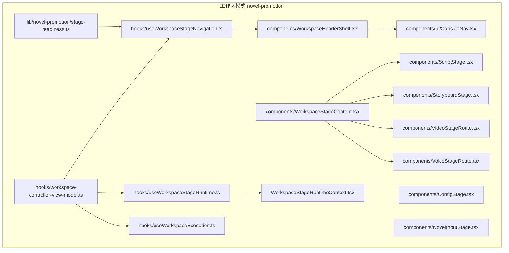
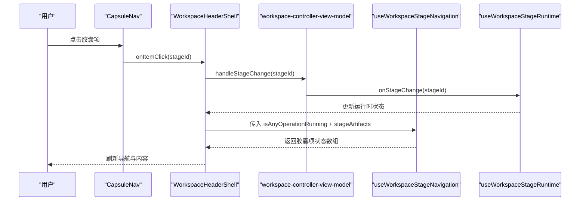
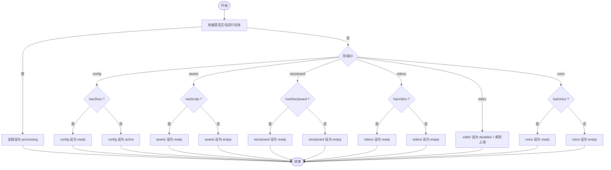
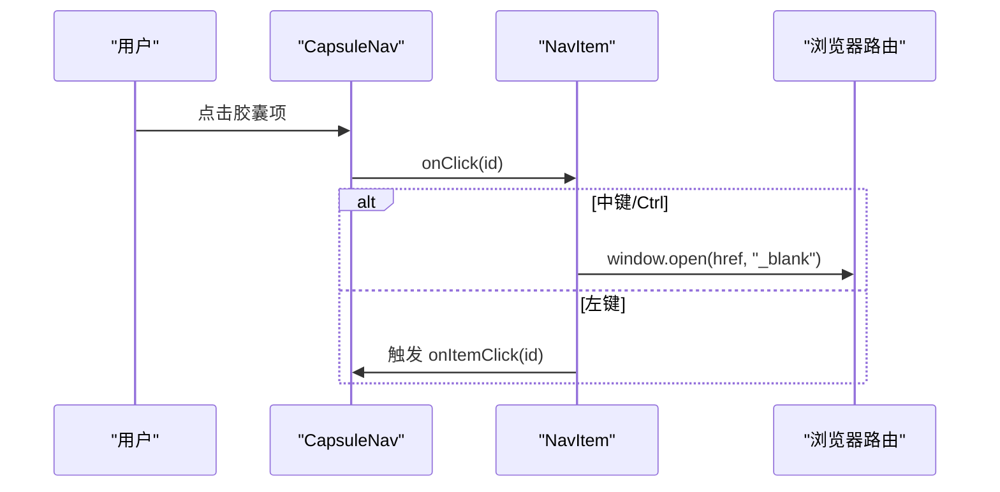
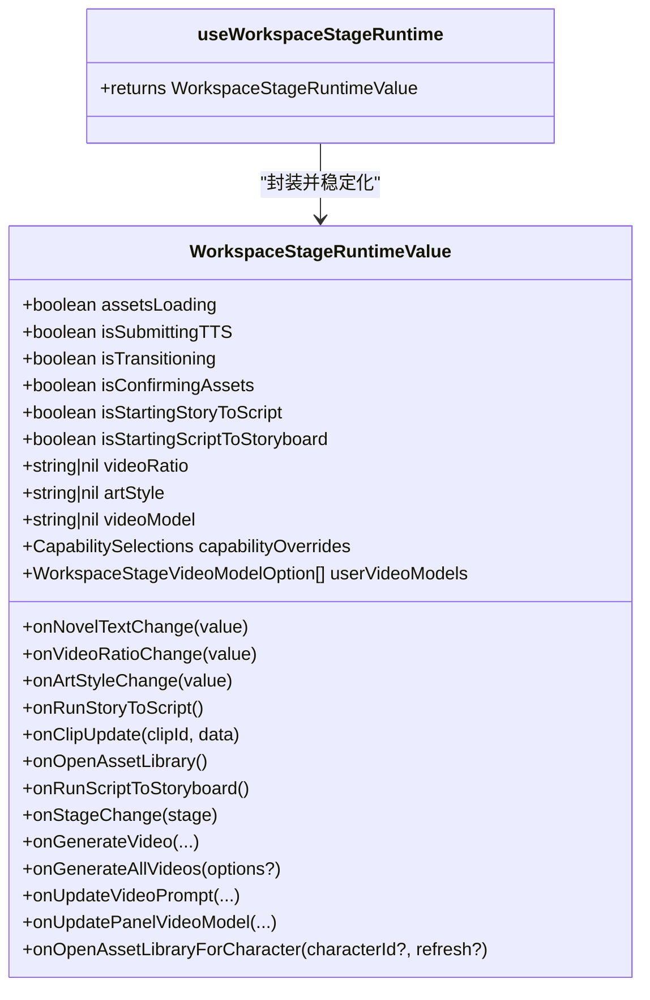
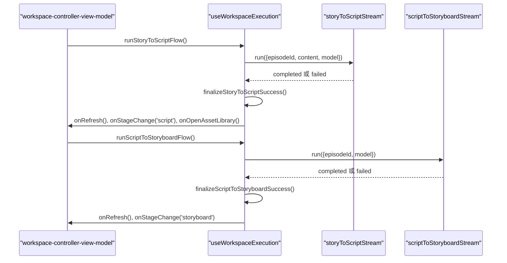
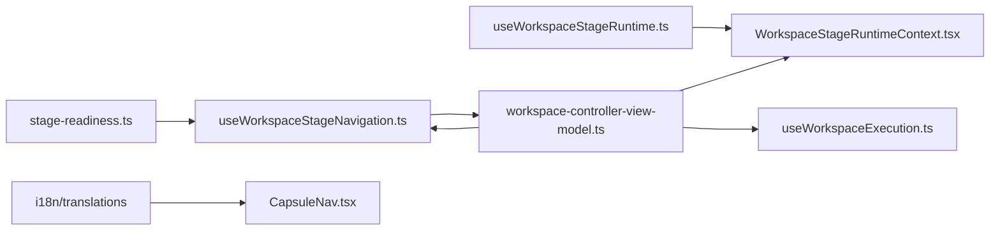

# 阶段导航系统

<cite>
**本文档引用的文件**
- [src/app/[locale]/workspace/[projectId]/modes/novel-promotion/hooks/useWorkspaceStageNavigation.ts](file://src/app/[locale]/workspace/[projectId]/modes/novel-promotion/hooks/useWorkspaceStageNavigation.ts)
- [src/app/[locale]/workspace/[projectId]/modes/novel-promotion/hooks/workspace-controller-view-model.ts](file://src/app/[locale]/workspace/[projectId]/modes/novel-promotion/hooks/workspace-controller-view-model.ts)
- [src/app/[locale]/workspace/[projectId]/modes/novel-promotion/WorkspaceStageRuntimeContext.tsx](file://src/app/[locale]/workspace/[projectId]/modes/novel-promotion/WorkspaceStageRuntimeContext.tsx)
- [src/app/[locale]/workspace/[projectId]/modes/novel-promotion/hooks/useWorkspaceStageRuntime.ts](file://src/app/[locale]/workspace/[projectId]/modes/novel-promotion/hooks/useWorkspaceStageRuntime.ts)
- [src/app/[locale]/workspace/[projectId]/modes/novel-promotion/components/WorkspaceHeaderShell.tsx](file://src/app/[locale]/workspace/[projectId]/modes/novel-promotion/components/WorkspaceHeaderShell.tsx)
- [src/app/[locale]/workspace/[projectId]/modes/novel-promotion/components/WorkspaceStageContent.tsx](file://src/app/[locale]/workspace/[projectId]/modes/novel-promotion/components/WorkspaceStageContent.tsx)
- [src/app/[locale]/workspace/[projectId]/modes/novel-promotion/components/ConfigStage.tsx](file://src/app/[locale]/workspace/[projectId]/modes/novel-promotion/components/ConfigStage.tsx)
- [src/app/[locale]/workspace/[projectId]/modes/novel-promotion/components/NovelInputStage.tsx](file://src/app/[locale]/workspace/[projectId]/modes/novel-promotion/components/NovelInputStage.tsx)
- [src/app/[locale]/workspace/[projectId]/modes/novel-promotion/components/ScriptStage.tsx](file://src/app/[locale]/workspace/[projectId]/modes/novel-promotion/components/ScriptStage.tsx)
- [src/app/[locale]/workspace/[projectId]/modes/novel-promotion/components/StoryboardStage.tsx](file://src/app/[locale]/workspace/[projectId]/modes/novel-promotion/components/StoryboardStage.tsx)
- [src/app/[locale]/workspace/[projectId]/modes/novel-promotion/components/VideoStageRoute.tsx](file://src/app/[locale]/workspace/[projectId]/modes/novel-promotion/components/VideoStageRoute.tsx)
- [src/app/[locale]/workspace/[projectId]/modes/novel-promotion/components/VoiceStageRoute.tsx](file://src/app/[locale]/workspace/[projectId]/modes/novel-promotion/components/VoiceStageRoute.tsx)
- [src/app/[locale]/workspace/[projectId]/modes/novel-promotion/hooks/useWorkspaceExecution.ts](file://src/app/[locale]/workspace/[projectId]/modes/novel-promotion/hooks/useWorkspaceExecution.ts)
- [src/lib/novel-promotion/stage-readiness.ts](file://src/lib/novel-promotion/stage-readiness.ts)
- [src/components/ui/CapsuleNav.tsx](file://src/components/ui/CapsuleNav.tsx)
</cite>

## 目录
1. [简介](#简介)
2. [项目结构](#项目结构)
3. [核心组件](#核心组件)
4. [架构总览](#架构总览)
5. [详细组件分析](#详细组件分析)
6. [依赖关系分析](#依赖关系分析)
7. [性能考虑](#性能考虑)
8. [故障排除指南](#故障排除指南)
9. [结论](#结论)
10. [附录](#附录)

## 简介
本文件面向小说推广工作流的“阶段导航系统”，系统性梳理从故事输入（NovelInputStage）、脚本（ScriptStage）、分镜（StoryboardStage）、视频（VideoStage）、配音（VoiceStage）等阶段的导航机制与运行时控制。重点包括：
- CapsuleNav 胶囊导航的实现与交互
- useWorkspaceStageNavigation 的状态计算与导航项生成
- useWorkspaceStageRuntime 的运行时上下文与动作封装
- workspace-controller-view-model 的视图模型聚合
- 阶段间转换逻辑、状态持久化与错误处理策略
- 扩展新阶段的集成方法与最佳实践

## 项目结构
小说推广工作流位于工作区模式 novel-promotion 下，采用按功能模块划分的组织方式：
- hooks：导航与运行时控制的核心逻辑
- components：各阶段视图组件与路由包装器
- WorkspaceStageRuntimeContext：运行时上下文提供者
- lib/novel-promotion：领域工具与状态判定

**图表来源**
- [src/app/[locale]/workspace/[projectId]/modes/novel-promotion/hooks/useWorkspaceStageNavigation.ts](file://src/app/[locale]/workspace/[projectId]/modes/novel-promotion/hooks/useWorkspaceStageNavigation.ts#L1-L60)
- [src/app/[locale]/workspace/[projectId]/modes/novel-promotion/WorkspaceStageRuntimeContext.tsx](file://src/app/[locale]/workspace/[projectId]/modes/novel-promotion/WorkspaceStageRuntimeContext.tsx#L1-L83)
- [src/app/[locale]/workspace/[projectId]/modes/novel-promotion/hooks/workspace-controller-view-model.ts](file://src/app/[locale]/workspace/[projectId]/modes/novel-promotion/hooks/workspace-controller-view-model.ts#L1-L162)
- [src/app/[locale]/workspace/[projectId]/modes/novel-promotion/components/WorkspaceHeaderShell.tsx](file://src/app/[locale]/workspace/[projectId]/modes/novel-promotion/components/WorkspaceHeaderShell.tsx#L196-L214)
- [src/app/[locale]/workspace/[projectId]/modes/novel-promotion/components/WorkspaceStageContent.tsx](file://src/app/[locale]/workspace/[projectId]/modes/novel-promotion/components/WorkspaceStageContent.tsx#L1-L29)
- [src/app/[locale]/workspace/[projectId]/modes/novel-promotion/components/ConfigStage.tsx](file://src/app/[locale]/workspace/[projectId]/modes/novel-promotion/components/ConfigStage.tsx#L1-L69)
- [src/app/[locale]/workspace/[projectId]/modes/novel-promotion/components/ScriptStage.tsx](file://src/app/[locale]/workspace/[projectId]/modes/novel-promotion/components/ScriptStage.tsx#L1-L26)
- [src/app/[locale]/workspace/[projectId]/modes/novel-promotion/components/StoryboardStage.tsx](file://src/app/[locale]/workspace/[projectId]/modes/novel-promotion/components/StoryboardStage.tsx#L1-L27)
- [src/app/[locale]/workspace/[projectId]/modes/novel-promotion/components/VideoStageRoute.tsx](file://src/app/[locale]/workspace/[projectId]/modes/novel-promotion/components/VideoStageRoute.tsx#L1-L45)
- [src/app/[locale]/workspace/[projectId]/modes/novel-promotion/components/VoiceStageRoute.tsx](file://src/app/[locale]/workspace/[projectId]/modes/novel-promotion/components/VoiceStageRoute.tsx#L1-L26)
- [src/app/[locale]/workspace/[projectId]/modes/novel-promotion/hooks/useWorkspaceExecution.ts](file://src/app/[locale]/workspace/[projectId]/modes/novel-promotion/hooks/useWorkspaceExecution.ts#L1-L358)
- [src/lib/novel-promotion/stage-readiness.ts:1-75](file://src/lib/novel-promotion/stage-readiness.ts#L1-L75)
- [src/components/ui/CapsuleNav.tsx:1-388](file://src/components/ui/CapsuleNav.tsx#L1-L388)

**章节来源**
- [src/app/[locale]/workspace/[projectId]/modes/novel-promotion/hooks/useWorkspaceStageNavigation.ts](file://src/app/[locale]/workspace/[projectId]/modes/novel-promotion/hooks/useWorkspaceStageNavigation.ts#L1-L60)
- [src/app/[locale]/workspace/[projectId]/modes/novel-promotion/components/WorkspaceStageContent.tsx](file://src/app/[locale]/workspace/[projectId]/modes/novel-promotion/components/WorkspaceStageContent.tsx#L1-L29)

## 核心组件
- CapsuleNav 导航组件：提供胶囊式悬浮导航，支持点击切换与新标签页打开，状态指示（空/激活/处理中/就绪），以及禁用提示。
- useWorkspaceStageNavigation：根据阶段产物就绪状态与运行中标志，计算各阶段胶囊项的状态。
- WorkspaceStageRuntimeContext：运行时上下文，承载视频比例、风格、模型、生成动作等共享状态与回调。
- useWorkspaceStageRuntime：将高层动作与运行时状态封装为稳定的对象，供各阶段组件消费。
- workspace-controller-view-model：聚合 i18n、项目快照、UI、导航、重建确认、执行流、视频操作、运行时与动作，作为顶层视图模型。

**章节来源**
- [src/components/ui/CapsuleNav.tsx:1-388](file://src/components/ui/CapsuleNav.tsx#L1-L388)
- [src/app/[locale]/workspace/[projectId]/modes/novel-promotion/hooks/useWorkspaceStageNavigation.ts](file://src/app/[locale]/workspace/[projectId]/modes/novel-promotion/hooks/useWorkspaceStageNavigation.ts#L1-L60)
- [src/app/[locale]/workspace/[projectId]/modes/novel-promotion/WorkspaceStageRuntimeContext.tsx](file://src/app/[locale]/workspace/[projectId]/modes/novel-promotion/WorkspaceStageRuntimeContext.tsx#L1-L83)
- [src/app/[locale]/workspace/[projectId]/modes/novel-promotion/hooks/useWorkspaceStageRuntime.ts](file://src/app/[locale]/workspace/[projectId]/modes/novel-promotion/hooks/useWorkspaceStageRuntime.ts#L1-L145)
- [src/app/[locale]/workspace/[projectId]/modes/novel-promotion/hooks/workspace-controller-view-model.ts](file://src/app/[locale]/workspace/[projectId]/modes/novel-promotion/hooks/workspace-controller-view-model.ts#L1-L162)

## 架构总览
阶段导航系统围绕“导航状态计算 + 运行时上下文 + 视图模型”三层协作展开：
- 导航层：useWorkspaceStageNavigation 基于阶段产物就绪度与全局运行标志，输出胶囊导航项。
- 运行时层：useWorkspaceStageRuntime 将高层动作与状态稳定化，注入 WorkspaceStageRuntimeContext。
- 视图层：workspace-controller-view-model 聚合导航、运行时与执行流，驱动 WorkspaceHeaderShell 与 WorkspaceStageContent 渲染。

**图表来源**
- [src/app/[locale]/workspace/[projectId]/modes/novel-promotion/components/WorkspaceHeaderShell.tsx](file://src/app/[locale]/workspace/[projectId]/modes/novel-promotion/components/WorkspaceHeaderShell.tsx#L196-L214)
- [src/app/[locale]/workspace/[projectId]/modes/novel-promotion/hooks/workspace-controller-view-model.ts](file://src/app/[locale]/workspace/[projectId]/modes/novel-promotion/hooks/workspace-controller-view-model.ts#L137-L161)
- [src/app/[locale]/workspace/[projectId]/modes/novel-promotion/hooks/useWorkspaceStageNavigation.ts](file://src/app/[locale]/workspace/[projectId]/modes/novel-promotion/hooks/useWorkspaceStageNavigation.ts#L20-L59)
- [src/app/[locale]/workspace/[projectId]/modes/novel-promotion/hooks/useWorkspaceStageRuntime.ts](file://src/app/[locale]/workspace/[projectId]/modes/novel-promotion/hooks/useWorkspaceStageRuntime.ts#L89-L144)

## 详细组件分析

### 导航状态计算：useWorkspaceStageNavigation
- 输入：全局运行标志 isAnyOperationRunning、阶段产物就绪度 stageArtifacts、翻译函数 t
- 输出：胶囊导航项数组，包含 id、icon、label、status、disabled/disabledLabel
- 状态规则：
  - 若存在任何运行任务，则全部项标记为 processing
  - 否则按阶段依赖链判断：config 依赖 hasStory；assets 依赖 hasScript；storyboard 依赖 hasStoryboard；videos/editor 依赖 hasVideo；voice 依赖 hasVoice
  - editor 当前禁用并标注“即将上线”

**图表来源**
- [src/app/[locale]/workspace/[projectId]/modes/novel-promotion/hooks/useWorkspaceStageNavigation.ts](file://src/app/[locale]/workspace/[projectId]/modes/novel-promotion/hooks/useWorkspaceStageNavigation.ts#L25-L43)

**章节来源**
- [src/app/[locale]/workspace/[projectId]/modes/novel-promotion/hooks/useWorkspaceStageNavigation.ts](file://src/app/[locale]/workspace/[projectId]/modes/novel-promotion/hooks/useWorkspaceStageNavigation.ts#L1-L60)
- [src/lib/novel-promotion/stage-readiness.ts:66-74](file://src/lib/novel-promotion/stage-readiness.ts#L66-L74)

### 胶囊导航组件：CapsuleNav
- 功能特性：
  - 左键点击切换阶段；中键/Ctrl+点击在新标签页打开
  - 状态指示：空/激活/处理中/就绪；处理中带脉冲动画
  - 禁用项显示提示气泡
  - 根据项目与剧集参数动态生成导航链接
- 交互细节：
  - NavItem 内部处理点击与中键事件，支持在新窗口打开
  - CapsuleNav 根据项目 ID 与查询参数生成路由路径

**图表来源**
- [src/components/ui/CapsuleNav.tsx:48-115](file://src/components/ui/CapsuleNav.tsx#L48-L115)
- [src/components/ui/CapsuleNav.tsx:123-162](file://src/components/ui/CapsuleNav.tsx#L123-L162)

**章节来源**
- [src/components/ui/CapsuleNav.tsx:1-388](file://src/components/ui/CapsuleNav.tsx#L1-L388)

### 运行时上下文：WorkspaceStageRuntimeContext 与 useWorkspaceStageRuntime
- WorkspaceStageRuntimeValue 定义了运行时状态与动作：
  - 加载与过渡状态：assetsLoading、isTransitioning、isConfirmingAssets、isStartingStoryToScript、isStartingScriptToStoryboard
  - 配置项：videoRatio、artStyle、videoModel、capabilityOverrides、userVideoModels
  - 动作：onNovelTextChange、onVideoRatioChange、onArtStyleChange、onRunStoryToScript、onClipUpdate、onOpenAssetLibrary、onRunScriptToStoryboard、onStageChange、视频生成系列、更新视频提示词/模型、打开资产库（按角色）
- useWorkspaceStageRuntime 将外部传入的动作与状态稳定化为不可变对象，避免渲染抖动

**图表来源**
- [src/app/[locale]/workspace/[projectId]/modes/novel-promotion/WorkspaceStageRuntimeContext.tsx](file://src/app/[locale]/workspace/[projectId]/modes/novel-promotion/WorkspaceStageRuntimeContext.tsx#L17-L59)
- [src/app/[locale]/workspace/[projectId]/modes/novel-promotion/hooks/useWorkspaceStageRuntime.ts](file://src/app/[locale]/workspace/[projectId]/modes/novel-promotion/hooks/useWorkspaceStageRuntime.ts#L89-L144)

**章节来源**
- [src/app/[locale]/workspace/[projectId]/modes/novel-promotion/WorkspaceStageRuntimeContext.tsx](file://src/app/[locale]/workspace/[projectId]/modes/novel-promotion/WorkspaceStageRuntimeContext.tsx#L1-L83)
- [src/app/[locale]/workspace/[projectId]/modes/novel-promotion/hooks/useWorkspaceStageRuntime.ts](file://src/app/[locale]/workspace/[projectId]/modes/novel-promotion/hooks/useWorkspaceStageRuntime.ts#L1-L145)

### 视图模型：workspace-controller-view-model
- 聚合维度：
  - i18n：t/tc/te
  - project：项目快照（含模型、比例、风格等）
  - ui：刷新、资产加载、弹窗开关、资产库聚焦
  - stageNav：currentStage、capsuleNavItems、handleStageChange
  - rebuild：重建确认、pendingActionType、runWithRebuildConfirm
  - execution：执行流状态、控制台最小化、runStoryToScriptFlow/runScriptToStoryboardFlow
  - video：视频生成、批量生成、更新提示词/模型、剪辑更新
  - runtime：stageRuntime
  - actions：更新配置/剧集
- 作用：将导航、运行时与执行流整合为单一 ViewModel，供 WorkspaceHeaderShell 与 WorkspaceStageContent 使用

**章节来源**
- [src/app/[locale]/workspace/[projectId]/modes/novel-promotion/hooks/workspace-controller-view-model.ts](file://src/app/[locale]/workspace/[projectId]/modes/novel-promotion/hooks/workspace-controller-view-model.ts#L1-L162)

### 阶段内容渲染：WorkspaceStageContent
- 根据 currentStage 渲染对应阶段组件：
  - config/script/assets -> ScriptStage
  - storyboard -> StoryboardStage
  - videos -> VideoStageRoute
  - voice -> VoiceStageRoute
- 通过 key={currentStage} 实现切换动画与隔离

**章节来源**
- [src/app/[locale]/workspace/[projectId]/modes/novel-promotion/components/WorkspaceStageContent.tsx](file://src/app/[locale]/workspace/[projectId]/modes/novel-promotion/components/WorkspaceStageContent.tsx#L1-L29)

### 具体阶段组件

#### 故事输入阶段：ConfigStage + NovelInputStage
- ConfigStage：整合 NovelInputStage 与智能分集向导；当文本较长时弹出长文本提示，支持“智能分集”或“继续”
- NovelInputStage：负责输入、AI 写作、风格/比例选择、长文本检测与智能分集建议
- 与运行时联动：onNext 调用 onRunStoryToScript，支持切换阶段时的过渡状态展示

**章节来源**
- [src/app/[locale]/workspace/[projectId]/modes/novel-promotion/components/ConfigStage.tsx](file://src/app/[locale]/workspace/[projectId]/modes/novel-promotion/components/ConfigStage.tsx#L1-L69)
- [src/app/[locale]/workspace/[projectId]/modes/novel-promotion/components/NovelInputStage.tsx](file://src/app/[locale]/workspace/[projectId]/modes/novel-promotion/components/NovelInputStage.tsx#L1-L315)

#### 脚本阶段：ScriptStage
- 通过 useWorkspaceStageRuntime 获取 clips、storyboards，并将运行时动作透传给 ScriptView
- 支持打开资产库、生成分镜、处理资产确认与启动脚本到分镜流程

**章节来源**
- [src/app/[locale]/workspace/[projectId]/modes/novel-promotion/components/ScriptStage.tsx](file://src/app/[locale]/workspace/[projectId]/modes/novel-promotion/components/ScriptStage.tsx#L1-L26)

#### 分镜阶段：StoryboardStage
- 读取运行时 videoRatio、capabilityOverrides 等，提供“上一阶段/下一阶段”按钮
- 与运行时 onStageChange 协作完成阶段切换

**章节来源**
- [src/app/[locale]/workspace/[projectId]/modes/novel-promotion/components/StoryboardStage.tsx](file://src/app/[locale]/workspace/[projectId]/modes/novel-promotion/components/StoryboardStage.tsx#L1-L27)

#### 视频阶段：VideoStageRoute
- 将运行时的视频模型、能力覆盖、默认模型等透传给 VideoStage
- 提供批量生成、逐个生成、更新提示词/模型、打开资产库等动作

**章节来源**
- [src/app/[locale]/workspace/[projectId]/modes/novel-promotion/components/VideoStageRoute.tsx](file://src/app/[locale]/workspace/[projectId]/modes/novel-promotion/components/VideoStageRoute.tsx#L1-L45)

#### 配音阶段：VoiceStageRoute
- 透传运行时动作，提供返回上一阶段与打开资产库的能力

**章节来源**
- [src/app/[locale]/workspace/[projectId]/modes/novel-promotion/components/VoiceStageRoute.tsx](file://src/app/[locale]/workspace/[projectId]/modes/novel-promotion/components/VoiceStageRoute.tsx#L1-L26)

### 执行与状态持久化：useWorkspaceExecution
- 负责两类流水线：
  - 故事到脚本（storyToScript）
  - 脚本到分镜（scriptToStoryboard）
- 关键行为：
  - 运行前设置过渡状态与控制台最小化
  - 监听 run stream 完成事件，自动刷新、切换阶段、打开资产库
  - 失败时弹出友好错误消息，支持超时检测
  - 使用 sessionStorage 记录控制台最小化状态
- 错误处理：
  - 中断请求（AbortError/Fetch 失败）静默处理
  - 任务流超时提示优化
  - 通用错误消息弹窗

**图表来源**
- [src/app/[locale]/workspace/[projectId]/modes/novel-promotion/hooks/useWorkspaceExecution.ts](file://src/app/[locale]/workspace/[projectId]/modes/novel-promotion/hooks/useWorkspaceExecution.ts#L179-L255)
- [src/app/[locale]/workspace/[projectId]/modes/novel-promotion/hooks/useWorkspaceExecution.ts](file://src/app/[locale]/workspace/[projectId]/modes/novel-promotion/hooks/useWorkspaceExecution.ts#L96-L135)

**章节来源**
- [src/app/[locale]/workspace/[projectId]/modes/novel-promotion/hooks/useWorkspaceExecution.ts](file://src/app/[locale]/workspace/[projectId]/modes/novel-promotion/hooks/useWorkspaceExecution.ts#L1-L358)

## 依赖关系分析
- useWorkspaceStageNavigation 依赖 stage-readiness 的就绪度类型与解析函数
- CapsuleNav 依赖 i18n 与路由参数生成
- workspace-controller-view-model 聚合 useWorkspaceStageNavigation、useWorkspaceStageRuntime、useWorkspaceExecution 的输出
- 各阶段组件通过 useWorkspaceStageRuntime 消费统一运行时上下文

**图表来源**
- [src/lib/novel-promotion/stage-readiness.ts:1-75](file://src/lib/novel-promotion/stage-readiness.ts#L1-L75)
- [src/app/[locale]/workspace/[projectId]/modes/novel-promotion/hooks/useWorkspaceStageNavigation.ts](file://src/app/[locale]/workspace/[projectId]/modes/novel-promotion/hooks/useWorkspaceStageNavigation.ts#L1-L60)
- [src/components/ui/CapsuleNav.tsx:1-388](file://src/components/ui/CapsuleNav.tsx#L1-L388)
- [src/app/[locale]/workspace/[projectId]/modes/novel-promotion/hooks/workspace-controller-view-model.ts](file://src/app/[locale]/workspace/[projectId]/modes/novel-promotion/hooks/workspace-controller-view-model.ts#L1-L162)
- [src/app/[locale]/workspace/[projectId]/modes/novel-promotion/WorkspaceStageRuntimeContext.tsx](file://src/app/[locale]/workspace/[projectId]/modes/novel-promotion/WorkspaceStageRuntimeContext.tsx#L1-L83)
- [src/app/[locale]/workspace/[projectId]/modes/novel-promotion/hooks/useWorkspaceStageRuntime.ts](file://src/app/[locale]/workspace/[projectId]/modes/novel-promotion/hooks/useWorkspaceStageRuntime.ts#L1-L145)
- [src/app/[locale]/workspace/[projectId]/modes/novel-promotion/hooks/useWorkspaceExecution.ts](file://src/app/[locale]/workspace/[projectId]/modes/novel-promotion/hooks/useWorkspaceExecution.ts#L1-L358)

**章节来源**
- [src/lib/novel-promotion/stage-readiness.ts:1-75](file://src/lib/novel-promotion/stage-readiness.ts#L1-L75)
- [src/app/[locale]/workspace/[projectId]/modes/novel-promotion/hooks/workspace-controller-view-model.ts](file://src/app/[locale]/workspace/[projectId]/modes/novel-promotion/hooks/workspace-controller-view-model.ts#L1-L162)

## 性能考虑
- 稳定化运行时对象：useWorkspaceStageRuntime 使用 useMemo 避免频繁重渲染
- 导航状态缓存：useWorkspaceStageNavigation 通过纯函数计算状态，减少依赖变更
- 控制台最小化持久化：使用 sessionStorage 记录用户偏好，避免每次刷新重置
- 流水线完成监听：通过 run stream 完成事件自动刷新，减少轮询与重复请求

[本节为通用指导，无需特定文件来源]

## 故障排除指南
- 导航项不更新：
  - 检查 isAnyOperationRunning 与 stageArtifacts 是否正确传递
  - 确认 stage-readiness 的解析逻辑与数据结构一致
- 阶段切换无效：
  - 确认 onStageChange 是否被正确注入到运行时上下文
  - 检查 CapsuleNav 的 onItemClick 与 WorkspaceHeaderShell 的处理链路
- 执行流失败：
  - 查看 useWorkspaceExecution 的错误消息弹窗与超时提示
  - 确认 run stream 的状态机与完成事件监听
- 资产分析卡住：
  - 检查 isAssetAnalysisRunning 与中断请求处理
  - 确认 onRefresh 的调用时机与作用域

**章节来源**
- [src/app/[locale]/workspace/[projectId]/modes/novel-promotion/hooks/useWorkspaceStageNavigation.ts](file://src/app/[locale]/workspace/[projectId]/modes/novel-promotion/hooks/useWorkspaceStageNavigation.ts#L25-L43)
- [src/app/[locale]/workspace/[projectId]/modes/novel-promotion/hooks/useWorkspaceExecution.ts](file://src/app/[locale]/workspace/[projectId]/modes/novel-promotion/hooks/useWorkspaceExecution.ts#L24-L36)
- [src/app/[locale]/workspace/[projectId]/modes/novel-promotion/hooks/useWorkspaceExecution.ts](file://src/app/[locale]/workspace/[projectId]/modes/novel-promotion/hooks/useWorkspaceExecution.ts#L157-L177)

## 结论
该阶段导航系统通过清晰的职责分离与稳定的运行时上下文，实现了小说推广工作流中多阶段的平滑流转与可视化反馈。胶囊导航提供直观的用户入口，运行时上下文确保动作与状态的一致性，视图模型将复杂状态聚合为可维护的接口。结合完善的错误处理与持久化策略，系统在可用性与可扩展性方面表现良好。

[本节为总结，无需特定文件来源]

## 附录

### 阶段导航的自定义扩展方法
- 新增阶段步骤：
  - 在 useWorkspaceStageNavigation 中添加新阶段的就绪度判断与状态映射
  - 在 WorkspaceStageContent 中增加新阶段的渲染分支
  - 在 CapsuleNav 中新增导航项（id/icon/label），必要时设置 disabled/disabledLabel
  - 在 ConfigStage/ScriptStage 等入口处补充阶段间跳转逻辑
- 运行时动作扩展：
  - 在 WorkspaceStageRuntimeContext 中扩展 WorkspaceStageRuntimeValue 的动作签名
  - 在 useWorkspaceStageRuntime 中封装新动作并稳定化
  - 在 workspace-controller-view-model 中聚合新动作
- 数据就绪度扩展：
  - 在 stage-readiness 中新增产物判定函数，并在 resolveEpisodeStageArtifacts 中纳入新字段
- 导航配置示例（概念性说明）：
  - 在 useWorkspaceStageNavigation 返回数组中追加新项，如：{ id: 'newStage', icon: 'N', label: t('stages.newStage'), status: getStageStatus('newStage') }
  - 在 WorkspaceStageContent 中增加渲染分支：{ currentStage === 'newStage' && <NewStage /> }

[本节为概念性说明，无需特定文件来源]