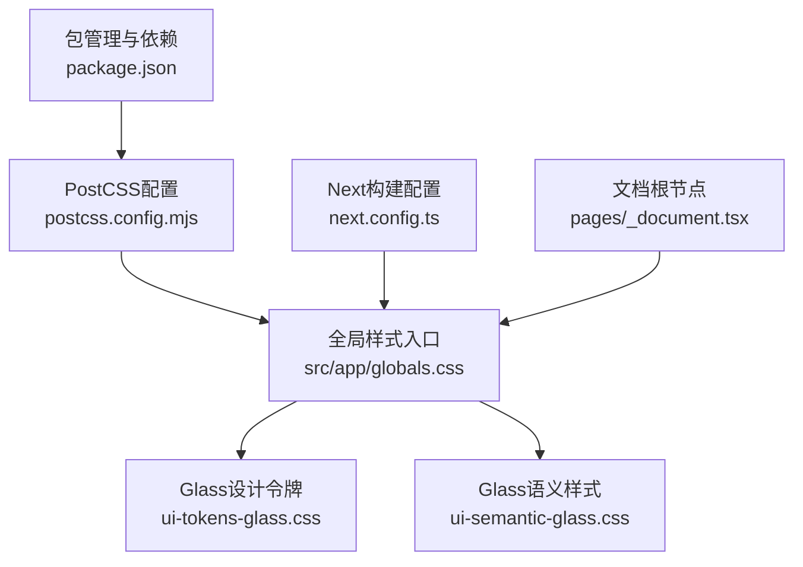
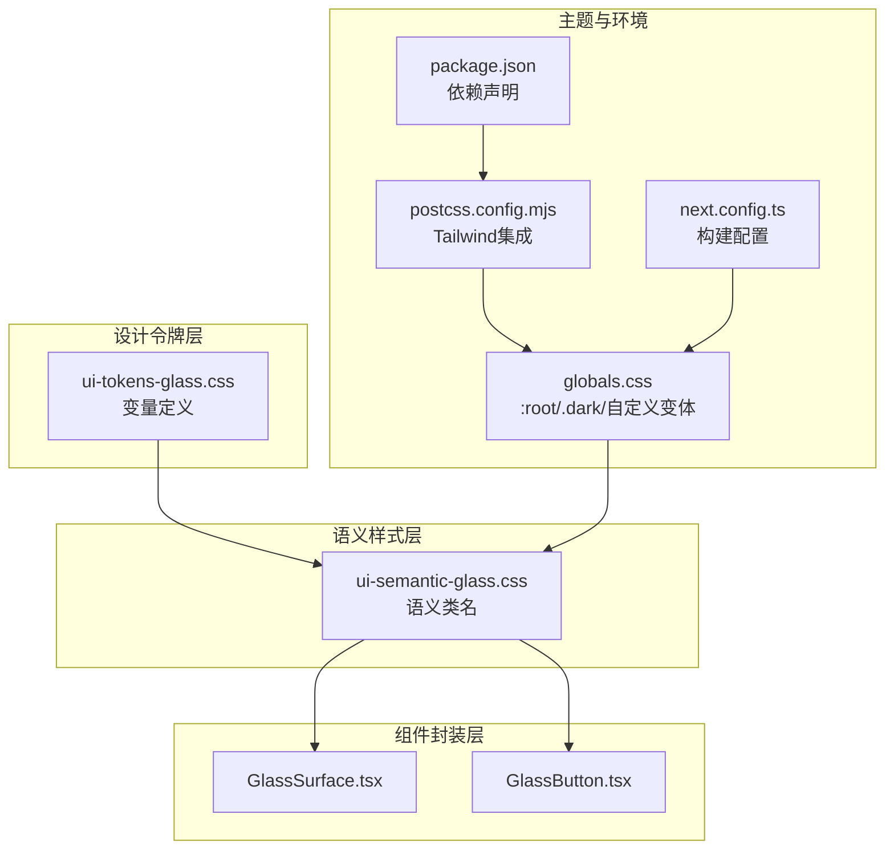
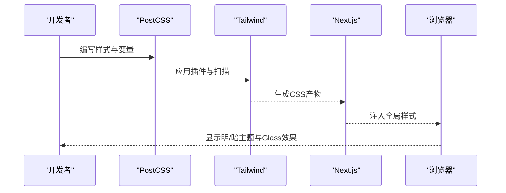
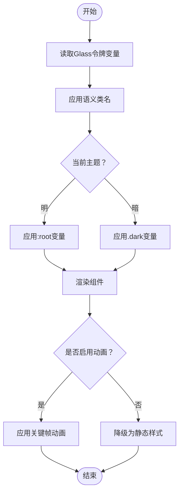
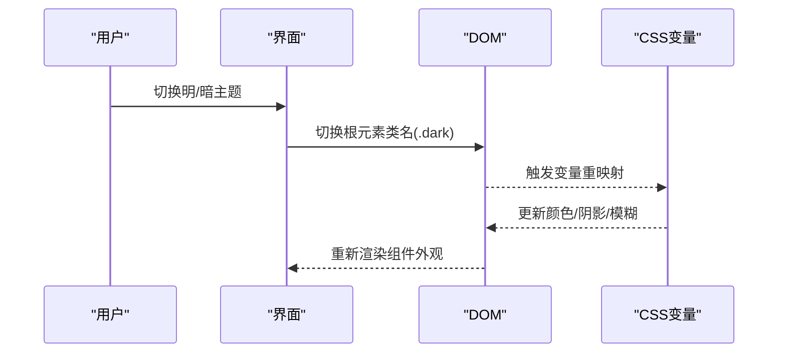
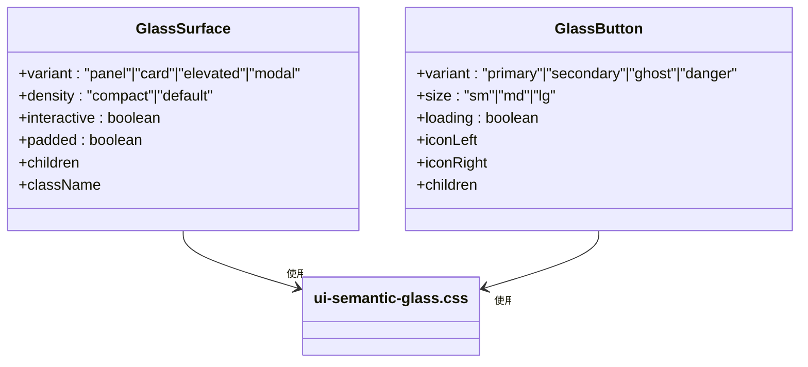
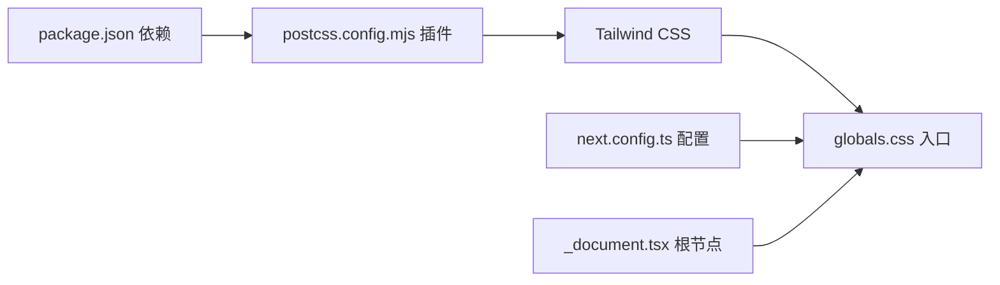

# 样式与主题

<cite>
**本文引用的文件**
- [src/app/globals.css](file://src/app/globals.css)
- [src/styles/ui-tokens-glass.css](file://src/styles/ui-tokens-glass.css)
- [src/styles/ui-semantic-glass.css](file://src/styles/ui-semantic-glass.css)
- [postcss.config.mjs](file://postcss.config.mjs)
- [package.json](file://package.json)
- [next.config.ts](file://next.config.ts)
- [src/pages/_document.tsx](file://src/pages/_document.tsx)
- [src/components/ui/primitives/GlassSurface.tsx](file://src/components/ui/primitives/GlassSurface.tsx)
- [src/components/ui/primitives/GlassButton.tsx](file://src/components/ui/primitives/GlassButton.tsx)
- [src/components/LanguageSwitcher.tsx](file://src/components/LanguageSwitcher.tsx)
- [src/lib/style-presets.ts](file://src/lib/style-presets.ts)
</cite>

## 目录
1. [简介](#简介)
2. [项目结构](#项目结构)
3. [核心组件](#核心组件)
4. [架构总览](#架构总览)
5. [详细组件分析](#详细组件分析)
6. [依赖关系分析](#依赖关系分析)
7. [性能考量](#性能考量)
8. [故障排查指南](#故障排查指南)
9. [结论](#结论)
10. [附录](#附录)

## 简介
本文件面向Waoowaoo的样式与主题系统，系统化梳理Tailwind CSS在本项目的配置与自定义方式，完整呈现Glass UI设计体系的实现（透明度、阴影、渐变、圆角、密度等），并深入解析主题切换机制、暗色模式支持与品牌色彩应用。文档同时覆盖组件样式封装策略、CSS变量体系、响应式设计与动画实现，并给出性能优化、打包策略与浏览器兼容性建议，以及可直接落地的设计系统最佳实践。

## 项目结构
样式与主题相关的核心文件分布如下：
- 全局样式入口：src/app/globals.css
- Glass设计令牌：src/styles/ui-tokens-glass.css
- Glass语义样式：src/styles/ui-semantic-glass.css
- PostCSS集成：postcss.config.mjs
- 构建与运行配置：next.config.ts、package.json
- 文档根节点：src/pages/_document.tsx

**图表来源**
- [src/app/globals.css:1-523](file://src/app/globals.css#L1-L523)
- [src/styles/ui-tokens-glass.css:1-96](file://src/styles/ui-tokens-glass.css#L1-L96)
- [src/styles/ui-semantic-glass.css:1-465](file://src/styles/ui-semantic-glass.css#L1-L465)
- [postcss.config.mjs:1-6](file://postcss.config.mjs#L1-L6)
- [next.config.ts:1-24](file://next.config.ts#L1-L24)
- [package.json:112-186](file://package.json#L112-L186)
- [src/pages/_document.tsx:1-14](file://src/pages/_document.tsx#L1-L14)

**章节来源**
- [src/app/globals.css:1-523](file://src/app/globals.css#L1-L523)
- [src/styles/ui-tokens-glass.css:1-96](file://src/styles/ui-tokens-glass.css#L1-L96)
- [src/styles/ui-semantic-glass.css:1-465](file://src/styles/ui-semantic-glass.css#L1-L465)
- [postcss.config.mjs:1-6](file://postcss.config.mjs#L1-L6)
- [next.config.ts:1-24](file://next.config.ts#L1-L24)
- [package.json:112-186](file://package.json#L112-L186)
- [src/pages/_document.tsx:1-14](file://src/pages/_document.tsx#L1-L14)

## 核心组件
- Tailwind CSS集成：通过PostCSS插件加载Tailwind，结合Next.js构建管线进行样式生成与打包。
- Glass设计系统：以CSS变量为核心，定义表面、文本、边框、阴影、模糊、圆角、密度与色调系统；通过语义类名抽象组件外观。
- 主题与暗色模式：基于CSS自定义变体与:root/.dark规则，实现明暗两套OKLCH色彩空间下的变量映射。
- 组件封装：以函数式组件包裹语义类名，形成可复用的GlassSurface、GlassButton等基础UI构件。
- 动画与过渡：内置多组关键帧动画，用于流式反馈、悬浮交互与加载状态。

**章节来源**
- [src/app/globals.css:1-523](file://src/app/globals.css#L1-L523)
- [src/styles/ui-tokens-glass.css:1-96](file://src/styles/ui-tokens-glass.css#L1-L96)
- [src/styles/ui-semantic-glass.css:1-465](file://src/styles/ui-semantic-glass.css#L1-L465)
- [postcss.config.mjs:1-6](file://postcss.config.mjs#L1-L6)
- [src/components/ui/primitives/GlassSurface.tsx:1-47](file://src/components/ui/primitives/GlassSurface.tsx#L1-L47)
- [src/components/ui/primitives/GlassButton.tsx:1-67](file://src/components/ui/primitives/GlassButton.tsx#L1-L67)

## 架构总览
整体架构围绕“变量令牌—语义样式—组件封装—主题切换”的层次展开，确保设计一致性与可维护性。

**图表来源**
- [src/styles/ui-tokens-glass.css:1-96](file://src/styles/ui-tokens-glass.css#L1-L96)
- [src/styles/ui-semantic-glass.css:1-465](file://src/styles/ui-semantic-glass.css#L1-L465)
- [src/components/ui/primitives/GlassSurface.tsx:1-47](file://src/components/ui/primitives/GlassSurface.tsx#L1-L47)
- [src/components/ui/primitives/GlassButton.tsx:1-67](file://src/components/ui/primitives/GlassButton.tsx#L1-L67)
- [src/app/globals.css:1-523](file://src/app/globals.css#L1-L523)
- [postcss.config.mjs:1-6](file://postcss.config.mjs#L1-L6)
- [next.config.ts:1-24](file://next.config.ts#L1-L24)
- [package.json:112-186](file://package.json#L112-L186)

## 详细组件分析

### Tailwind CSS配置与自定义
- PostCSS插件：通过[@tailwindcss/postcss](file://postcss.config.mjs#L2)接入Tailwind，确保在Next.js构建链路中自动扫描与生成所需样式。
- 全局样式入口：在[globals.css:1-3](file://src/app/globals.css#L1-L3)中引入Tailwind原语、Glass令牌与语义样式，并定义暗色模式自定义变体。
- 主题与字体：在[globals.css:63-105](file://src/app/globals.css#L63-L105)中通过@theme inline将CSS变量映射到Next.js主题系统，统一字体与颜色命名。
- 构建配置：在[next.config.ts:1-24](file://next.config.ts#L1-L24)中启用国际化插件与图片源配置，保障样式与资源路径一致。

**图表来源**
- [postcss.config.mjs:1-6](file://postcss.config.mjs#L1-L6)
- [src/app/globals.css:1-523](file://src/app/globals.css#L1-L523)
- [next.config.ts:1-24](file://next.config.ts#L1-L24)

**章节来源**
- [postcss.config.mjs:1-6](file://postcss.config.mjs#L1-L6)
- [src/app/globals.css:1-523](file://src/app/globals.css#L1-L523)
- [next.config.ts:1-24](file://next.config.ts#L1-L24)

### Glass UI设计系统
- 令牌层（ui-tokens-glass.css）：集中定义表面背景、文本、边框、阴影、模糊、圆角、密度与色调系统变量，提供默认与低开销预设。
- 语义层（ui-semantic-glass.css）：以语义类名抽象组件外观，如glass-surface、glass-input-base、glass-btn-*、glass-chip-*等，降低对具体变量的耦合。
- 动画与过渡：在[globals.css:137-254](file://src/app/globals.css#L137-L254)中内置多组关键帧动画，用于浮动、渐变、滑入、进度等场景，并尊重用户“减少动态”偏好。

**图表来源**
- [src/styles/ui-tokens-glass.css:1-96](file://src/styles/ui-tokens-glass.css#L1-L96)
- [src/styles/ui-semantic-glass.css:1-465](file://src/styles/ui-semantic-glass.css#L1-L465)
- [src/app/globals.css:137-254](file://src/app/globals.css#L137-L254)

**章节来源**
- [src/styles/ui-tokens-glass.css:1-96](file://src/styles/ui-tokens-glass.css#L1-L96)
- [src/styles/ui-semantic-glass.css:1-465](file://src/styles/ui-semantic-glass.css#L1-L465)
- [src/app/globals.css:137-254](file://src/app/globals.css#L137-L254)

### 主题切换机制与暗色模式
- 自定义变体：在[globals.css](file://src/app/globals.css#L5)中定义dark自定义变体，使选择器能按容器类名生效。
- 明/暗变量映射：在[:root:7-61](file://src/app/globals.css#L7-L61)与[.dark:481-513](file://src/app/globals.css#L481-L513)中分别映射OKLCH色彩空间的颜色与语义变量，保证视觉一致性。
- 组件内使用：组件通过语义类名间接引用变量，无需感知主题差异，例如按钮、输入框、分段控件等均依赖CSS变量。

**图表来源**
- [src/app/globals.css:5-61](file://src/app/globals.css#L5-L61)
- [src/app/globals.css:481-513](file://src/app/globals.css#L481-L513)

**章节来源**
- [src/app/globals.css:5-61](file://src/app/globals.css#L5-L61)
- [src/app/globals.css:481-513](file://src/app/globals.css#L481-L513)

### 组件样式封装策略
- GlassSurface：通过属性控制变体（panel/card/elevated/modal）、密度（compact/default）、交互态与内边距，最终拼接语义类名渲染。
- GlassButton：根据变体（primary/secondary/ghost/danger）与尺寸（sm/md/lg）选择对应语义类，支持左右图标与加载态。
- 通用原则：组件不直接写死颜色或阴影，仅依赖语义类名，便于主题切换与品牌定制。

**图表来源**
- [src/components/ui/primitives/GlassSurface.tsx:1-47](file://src/components/ui/primitives/GlassSurface.tsx#L1-L47)
- [src/components/ui/primitives/GlassButton.tsx:1-67](file://src/components/ui/primitives/GlassButton.tsx#L1-L67)
- [src/styles/ui-semantic-glass.css:1-465](file://src/styles/ui-semantic-glass.css#L1-L465)

**章节来源**
- [src/components/ui/primitives/GlassSurface.tsx:1-47](file://src/components/ui/primitives/GlassSurface.tsx#L1-L47)
- [src/components/ui/primitives/GlassButton.tsx:1-67](file://src/components/ui/primitives/GlassButton.tsx#L1-L67)
- [src/styles/ui-semantic-glass.css:1-465](file://src/styles/ui-semantic-glass.css#L1-L465)

### 品牌色彩与风格预设
- 品牌色：在Glass令牌中定义主色梯度与强调阴影，组件通过语义类名自动获得品牌一致性。
- 风格预设：通过[style-presets.ts:1-25](file://src/lib/style-presets.ts#L1-L25)集中管理风格选项，便于后续扩展不同视觉风格（如恐怖悬疑）。

**章节来源**
- [src/lib/style-presets.ts:1-25](file://src/lib/style-presets.ts#L1-L25)
- [src/styles/ui-tokens-glass.css:69-78](file://src/styles/ui-tokens-glass.css#L69-L78)

### 响应式设计与无障碍
- 响应式：组件与语义类广泛使用Tailwind工具类，配合CSS变量实现跨设备一致体验。
- 无障碍：按钮与输入框遵循焦点可见性与禁用态，滚动条样式在暗色模式下保持高对比度。

**章节来源**
- [src/styles/ui-semantic-glass.css:399-465](file://src/styles/ui-semantic-glass.css#L399-L465)
- [src/components/ui/primitives/GlassButton.tsx:1-67](file://src/components/ui/primitives/GlassButton.tsx#L1-L67)

## 依赖关系分析
- 构建链路：package.json声明tailwind与@tailwindcss/postcss，postcss.config.mjs启用插件，Next.js在构建时注入全局样式。
- 国际化：next.config.ts通过插件增强路由与页面国际化能力，避免样式与文案错位。
- 文档根节点：pages/_document.tsx负责挂载Next脚本与主体，确保样式在SSR/CSR阶段正确渲染。

**图表来源**
- [package.json:164-186](file://package.json#L164-L186)
- [postcss.config.mjs:1-6](file://postcss.config.mjs#L1-L6)
- [src/app/globals.css:1-523](file://src/app/globals.css#L1-L523)
- [next.config.ts:1-24](file://next.config.ts#L1-L24)
- [src/pages/_document.tsx:1-14](file://src/pages/_document.tsx#L1-L14)

**章节来源**
- [package.json:164-186](file://package.json#L164-L186)
- [postcss.config.mjs:1-6](file://postcss.config.mjs#L1-L6)
- [src/app/globals.css:1-523](file://src/app/globals.css#L1-L523)
- [next.config.ts:1-24](file://next.config.ts#L1-L24)
- [src/pages/_document.tsx:1-14](file://src/pages/_document.tsx#L1-L14)

## 性能考量
- 变量驱动的低耦合：通过CSS变量与语义类名解耦设计与实现，减少重复样式与构建体积。
- 低开销预设：Glass令牌提供subtle预设，适合性能敏感场景，降低模糊与阴影成本。
- 关键帧优化：动画采用关键帧与过渡，避免复杂滤镜；在“减少动态”偏好下自动降级。
- 打包策略：Tailwind按需生成，结合Next.js的Tree Shaking与CSS压缩，减少未使用样式。
- 浏览器兼容：优先使用现代CSS特性（如OKLCH、backdrop-filter），在必要处提供回退方案；通过PostCSS与Tailwind确保兼容性。

[本节为通用指导，无需列出具体文件来源]

## 故障排查指南
- 样式未生效
  - 检查globals.css是否被正确导入与编译。
  - 确认postcss.config.mjs已启用@tailwindcss/postcss。
  - 核对next.config.ts的国际化与图片配置是否影响资源路径。
- 暗色模式异常
  - 确保根元素存在.dark类或具备暗色模式触发逻辑。
  - 检查:root与.dark中的变量映射是否完整。
- 动画无效
  - 在系统偏好“减少动态”时，动画会被降级为静态样式，属预期行为。
- 组件外观不一致
  - 确认组件是否使用了正确的语义类名，避免混用自定义样式覆盖变量。

**章节来源**
- [src/app/globals.css:1-523](file://src/app/globals.css#L1-L523)
- [postcss.config.mjs:1-6](file://postcss.config.mjs#L1-L6)
- [next.config.ts:1-24](file://next.config.ts#L1-L24)

## 结论
Waoowaoo的样式与主题系统以Tailwind为核心，结合Glass设计令牌与语义类名，实现了高内聚、低耦合的组件样式体系。通过CSS变量与暗色模式映射，确保在不同主题下的一致体验；借助语义类名与组件封装，简化了品牌色彩与风格预设的落地。配合合理的性能策略与兼容性处理，该体系既满足设计一致性，又兼顾工程效率与可维护性。

[本节为总结性内容，无需列出具体文件来源]

## 附录
- 实际使用示例（路径）
  - 按钮组件：[src/components/ui/primitives/GlassButton.tsx:1-67](file://src/components/ui/primitives/GlassButton.tsx#L1-L67)
  - 表面容器：[src/components/ui/primitives/GlassSurface.tsx:1-47](file://src/components/ui/primitives/GlassSurface.tsx#L1-L47)
  - 语言切换器（含语义类名）：[src/components/LanguageSwitcher.tsx:91-126](file://src/components/LanguageSwitcher.tsx#L91-126)
  - 风格预设选项：[src/lib/style-presets.ts:1-25](file://src/lib/style-presets.ts#L1-L25)
- 设计令牌与语义样式
  - 令牌：[src/styles/ui-tokens-glass.css:1-96](file://src/styles/ui-tokens-glass.css#L1-L96)
  - 语义：[src/styles/ui-semantic-glass.css:1-465](file://src/styles/ui-semantic-glass.css#L1-L465)
- 构建与配置
  - PostCSS：[postcss.config.mjs:1-6](file://postcss.config.mjs#L1-L6)
  - Next配置：[next.config.ts:1-24](file://next.config.ts#L1-L24)
  - 包依赖：[package.json:112-186](file://package.json#L112-L186)
  - 文档根节点：[src/pages/_document.tsx:1-14](file://src/pages/_document.tsx#L1-14)