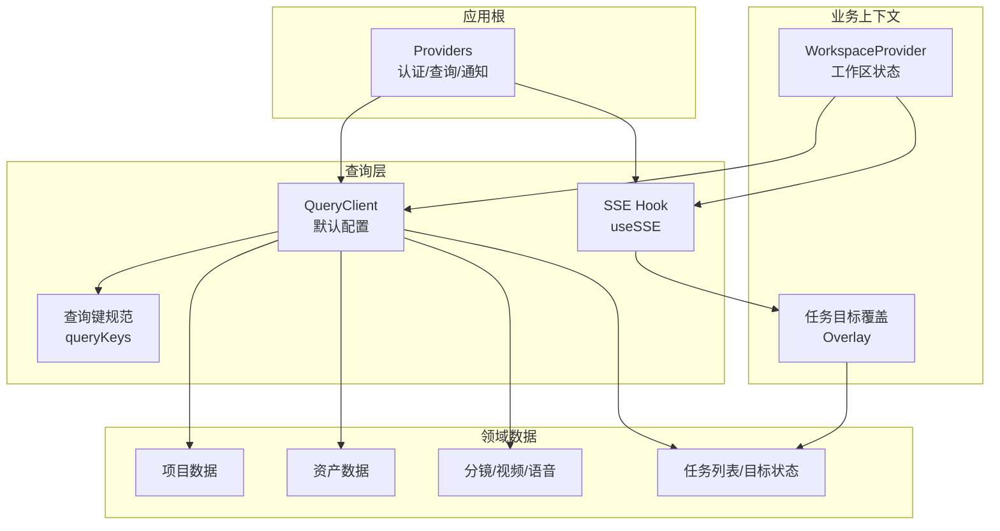
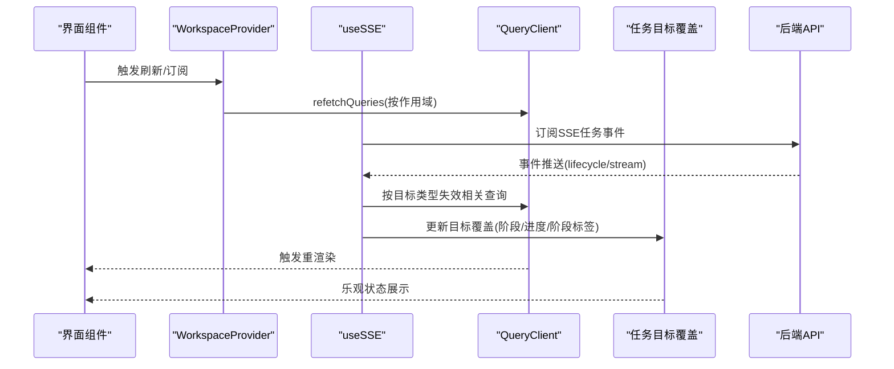
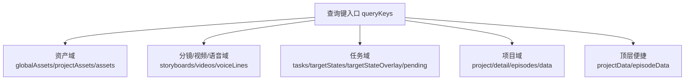
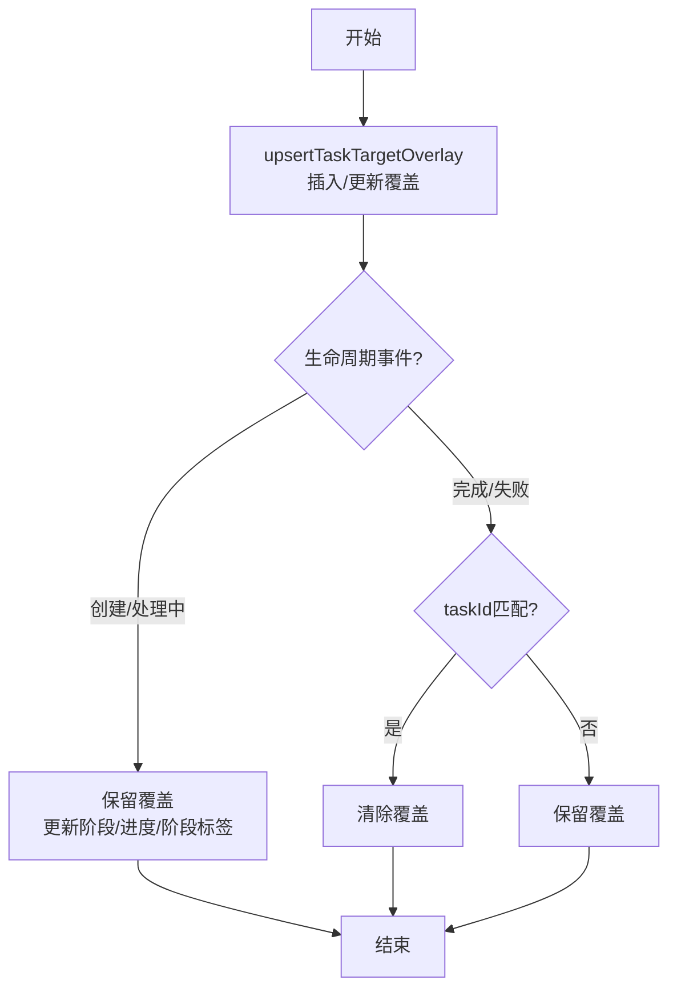
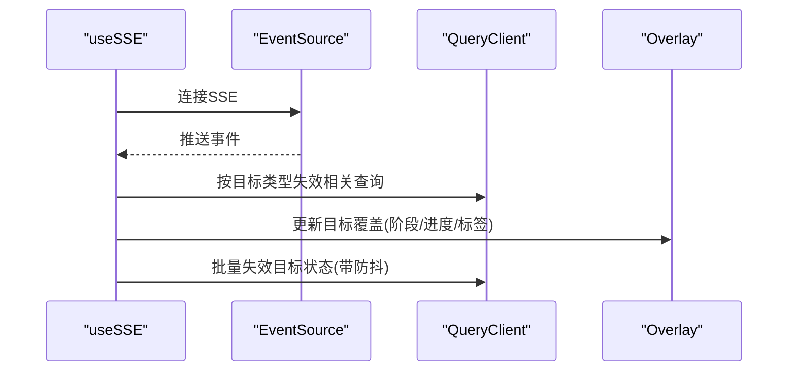
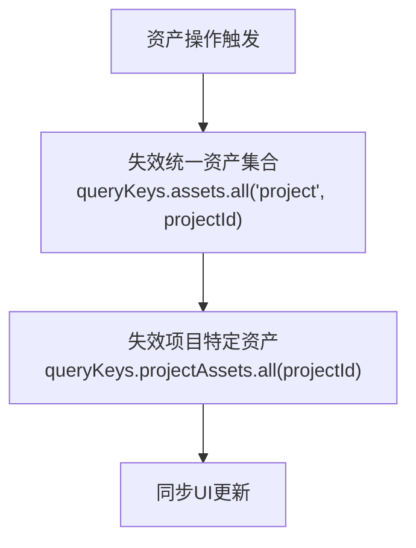
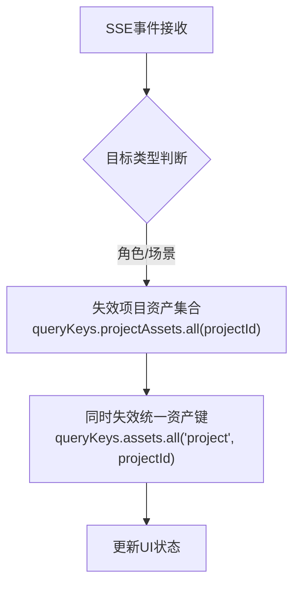
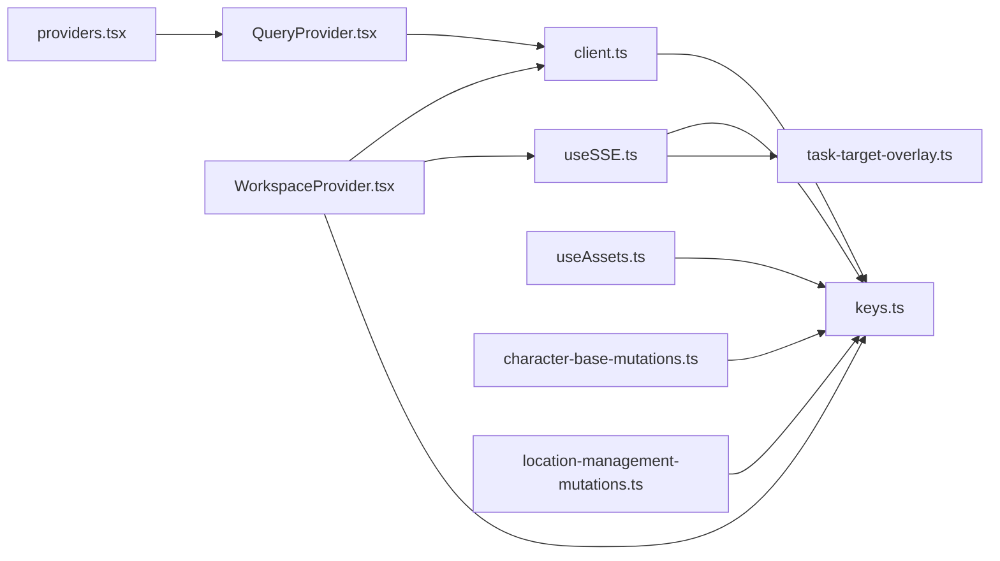
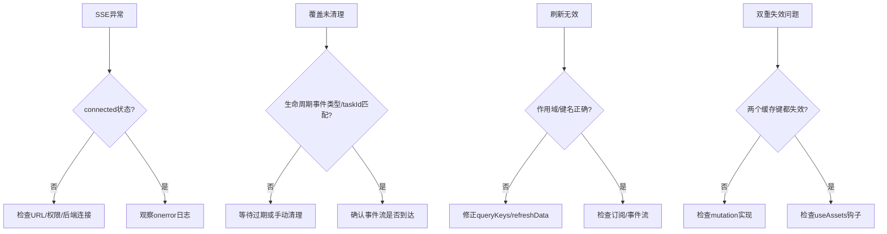

# 状态管理

<cite>
**本文引用的文件**
- [src/app/[locale]/providers.tsx](file://src/app/[locale]/providers.tsx)
- [src/components/providers/QueryProvider.tsx](file://src/components/providers/QueryProvider.tsx)
- [src/lib/query/client.ts](file://src/lib/query/client.ts)
- [src/lib/query/keys.ts](file://src/lib/query/keys.ts)
- [src/lib/query/task-target-overlay.ts](file://src/lib/query/task-target-overlay.ts)
- [src/lib/query/hooks/useSSE.ts](file://src/lib/query/hooks/useSSE.ts)
- [src/app/[locale]/workspace/[projectId]/modes/novel-promotion/WorkspaceProvider.tsx](file://src/app/[locale]/workspace/[projectId]/modes/novel-promotion/WorkspaceProvider.tsx)
- [src/contexts/ToastContext.tsx](file://src/contexts/ToastContext.tsx)
- [src/app/api/user-preference/route.ts](file://src/app/api/user-preference/route.ts)
- [src/lib/config-service.ts](file://src/lib/config-service.ts)
- [src/lib/task/state-service.ts](file://src/lib/task/state-service.ts)
- [src/lib/task/ui-payload.ts](file://src/lib/task/ui-payload.ts)
- [src/lib/query/hooks/useAssets.ts](file://src/lib/query/hooks/useAssets.ts)
- [src/lib/query/hooks/useProjectAssets.ts](file://src/lib/query/hooks/useProjectAssets.ts)
- [src/lib/query/mutations/character-base-mutations.ts](file://src/lib/query/mutations/character-base-mutations.ts)
- [src/lib/query/mutations/character-image-ops-mutations.ts](file://src/lib/query/mutations/character-image-ops-mutations.ts)
- [src/lib/query/mutations/character-profile-mutations.ts](file://src/lib/query/mutations/character-profile-mutations.ts)
- [src/lib/query/mutations/location-management-mutations.ts](file://src/lib/query/mutations/location-management-mutations.ts)
- [src/lib/query/mutations/asset-hub-character-mutations.ts](file://src/lib/query/mutations/asset-hub-character-mutations.ts)
- [src/lib/query/mutations/asset-hub-location-mutations.ts](file://src/lib/query/mutations/asset-hub-location-mutations.ts)
- [tests/helpers/mock-query-client.ts](file://tests/helpers/mock-query-client.ts)
- [tests/unit/optimistic/task-target-overlay.test.ts](file://tests/unit/optimistic/task-target-overlay.test.ts)
- [tests/unit/optimistic/asset-actions-generate.test.ts](file://tests/unit/optimistic/asset-actions-generate.test.ts)
- [tests/unit/helpers/task-state-service.test.ts](file://tests/unit/helpers/task-state-service.test.ts)
</cite>

## 更新摘要
**所做更改**
- 新增双重缓存失效策略章节，详细说明项目特定资产和父资产集合的双重失效机制
- 更新资产操作章节，增加useAssets钩子的双重失效实现
- 新增角色和场景管理的双重缓存失效示例
- 更新SSE事件处理章节，说明双重失效在实时事件中的应用
- 完善缓存一致性保障机制说明

## 目录
1. [引言](#引言)
2. [项目结构](#项目结构)
3. [核心组件](#核心组件)
4. [架构总览](#架构总览)
5. [组件详解](#组件详解)
6. [双重缓存失效策略](#双重缓存失效策略)
7. [依赖关系分析](#依赖关系分析)
8. [性能考量](#性能考量)
9. [故障排查指南](#故障排查指南)
10. [结论](#结论)
11. [附录](#附录)

## 引言
本文件面向Waoowaoo的状态管理系统，系统性梳理基于React与React Query的前端状态架构，涵盖Context API、自定义Hook与React Query的协同使用；明确全局状态的组织方式、状态更新机制与数据同步策略；阐述工作区状态、任务状态、用户偏好等关键状态域的设计；并提供持久化、缓存策略与性能优化建议，以及调试工具、错误边界与回滚机制的最佳实践。

## 项目结构
Waoowaoo采用"应用级Provider组合 + 查询层（React Query）+ 业务上下文"的分层结构：
- 应用根Provider负责注入认证、全局查询客户端与通知系统
- React Query作为统一缓存与失效中心，配合查询键规范管理各领域数据
- 业务上下文（如工作区）封装领域状态与事件订阅，驱动查询失效与UI更新
- 任务生命周期通过Server-Sent Events实时同步，结合乐观覆盖提升交互体验

**图表来源**
- [src/app/[locale]/providers.tsx:7-20](file://src/app/[locale]/providers.tsx#L7-L20)
- [src/lib/query/client.ts:7-28](file://src/lib/query/client.ts#L7-L28)
- [src/lib/query/keys.ts:14-113](file://src/lib/query/keys.ts#L14-L113)
- [src/lib/query/hooks/useSSE.ts:18-232](file://src/lib/query/hooks/useSSE.ts#L18-L232)
- [src/app/[locale]/workspace/[projectId]/modes/novel-promotion/WorkspaceProvider.tsx:36-93](file://src/app/[locale]/workspace/[projectId]/modes/novel-promotion/WorkspaceProvider.tsx#L36-L93)
- [src/lib/query/task-target-overlay.ts:52-196](file://src/lib/query/task-target-overlay.ts#L52-L196)

**章节来源**
- [src/app/[locale]/providers.tsx:7-20](file://src/app/[locale]/providers.tsx#L7-L20)
- [src/lib/query/client.ts:7-28](file://src/lib/query/client.ts#L7-L28)
- [src/lib/query/keys.ts:14-113](file://src/lib/query/keys.ts#L14-L113)

## 核心组件
- 应用Provider组合：在应用根部注入SessionProvider、QueryProvider与ToastProvider，形成统一的认证、缓存与通知环境。
- QueryClient：集中配置staleTime、gcTime、refetchOnWindowFocus、retry等默认行为，确保缓存新鲜度与网络恢复后的自动刷新。
- 查询键规范：将所有缓存键集中定义，避免分散散落导致的不一致与维护成本。
- 任务目标覆盖（Overlay）：在React Query之上构建"乐观覆盖"状态，用于即时反馈任务执行阶段、进度、阶段标签等，提升交互体验。
- SSE Hook：订阅任务生命周期事件，按目标类型与剧集维度触发精确失效，同时更新Overlay。
- 工作区Provider：聚合项目/剧集/资产/分镜/语音等数据的刷新策略，并订阅任务事件，协调多源数据一致性。

**章节来源**
- [src/app/[locale]/providers.tsx:7-20](file://src/app/[locale]/providers.tsx#L7-L20)
- [src/components/providers/QueryProvider.tsx:10-16](file://src/components/providers/QueryProvider.tsx#L10-L16)
- [src/lib/query/client.ts:7-28](file://src/lib/query/client.ts#L7-L28)
- [src/lib/query/keys.ts:14-113](file://src/lib/query/keys.ts#L14-L113)
- [src/lib/query/task-target-overlay.ts:52-196](file://src/lib/query/task-target-overlay.ts#L52-L196)
- [src/lib/query/hooks/useSSE.ts:18-232](file://src/lib/query/hooks/useSSE.ts#L18-L232)
- [src/app/[locale]/workspace/[projectId]/modes/novel-promotion/WorkspaceProvider.tsx:36-93](file://src/app/[locale]/workspace/[projectId]/modes/novel-promotion/WorkspaceProvider.tsx#L36-L93)

## 架构总览
整体架构围绕"查询键规范 + QueryClient + SSE事件流 + 业务上下文"的闭环展开：
- 查询键规范统一了缓存键空间，保证不同模块对同一资源的读写使用一致的键
- QueryClient负责缓存新鲜度、失效与重试策略，SSE事件驱动定向失效
- Overlay在UI层对任务状态进行乐观展示，减少等待感
- 工作区Provider协调刷新范围与事件监听，确保复杂场景下的状态一致性

**图表来源**
- [src/app/[locale]/workspace/[projectId]/modes/novel-promotion/WorkspaceProvider.tsx:40-58](file://src/app/[locale]/workspace/[projectId]/modes/novel-promotion/WorkspaceProvider.tsx#L40-L58)
- [src/lib/query/hooks/useSSE.ts:94-196](file://src/lib/query/hooks/useSSE.ts#L94-L196)
- [src/lib/query/task-target-overlay.ts:121-196](file://src/lib/query/task-target-overlay.ts#L121-L196)

## 组件详解

### 应用Provider与全局状态注入
- Providers组合SessionProvider、QueryProvider与ToastProvider，确保认证、查询与通知三者在根部统一生效
- QueryProvider包裹应用，使任意子树可使用useQueryClient与查询键

**章节来源**
- [src/app/[locale]/providers.tsx:7-20](file://src/app/[locale]/providers.tsx#L7-L20)
- [src/components/providers/QueryProvider.tsx:10-16](file://src/components/providers/QueryProvider.tsx#L10-L16)

### React Query客户端与默认配置
- 默认查询策略：staleTime=5秒、gcTime=10分钟、窗口聚焦与网络恢复自动刷新、失败重试1次
- 默认变更策略：mutation不重试
- 通过getQueryClient可在非组件环境中获取实例

**章节来源**
- [src/lib/query/client.ts:7-28](file://src/lib/query/client.ts#L7-L28)
- [src/lib/query/client.ts:34-36](file://src/lib/query/client.ts#L34-L36)

### 查询键规范与命名空间
- 资产域：全局资产、项目资产、统一资产键
- 分镜/视频/语音域：按剧集维度划分
- 任务域：任务列表、目标状态、目标状态覆盖、待处理任务等
- 项目域：项目详情、剧集列表、项目基础数据
- 顶层便捷函数：项目数据、剧集数据

**图表来源**
- [src/lib/query/keys.ts:14-113](file://src/lib/query/keys.ts#L14-L113)

**章节来源**
- [src/lib/query/keys.ts:14-113](file://src/lib/query/keys.ts#L14-L113)

### 任务目标覆盖（Overlay）与乐观状态
- Overlay用于在任务生命周期内展示"排队/处理中"等阶段信息，支持过期清理
- 支持插入/更新/清除操作，结合SSE事件流动态更新
- 当任务完成/失败时，若taskId匹配则移除覆盖，否则保留以防并发任务竞争

**图表来源**
- [src/lib/query/task-target-overlay.ts:52-196](file://src/lib/query/task-target-overlay.ts#L52-L196)

**章节来源**
- [src/lib/query/task-target-overlay.ts:52-196](file://src/lib/query/task-target-overlay.ts#L52-L196)

### SSE事件订阅与查询失效
- useSSE根据projectId/episodeId构造URL，订阅任务生命周期与流式事件
- 按目标类型与剧集维度进行精确失效，避免全量刷新
- 对任务目标状态集合采用防抖式批量失效，降低抖动
- 将事件映射到Overlay，同时根据生命周期类型决定是否清理覆盖

**图表来源**
- [src/lib/query/hooks/useSSE.ts:18-232](file://src/lib/query/hooks/useSSE.ts#L18-L232)
- [src/lib/query/task-target-overlay.ts:121-196](file://src/lib/query/task-target-overlay.ts#L121-L196)

**章节来源**
- [src/lib/query/hooks/useSSE.ts:18-232](file://src/lib/query/hooks/useSSE.ts#L18-L232)

### 工作区Provider与刷新策略
- WorkspaceProvider聚合项目/剧集/资产/分镜/语音等刷新逻辑
- 支持按作用域（all/assets/project）选择性刷新
- 订阅任务事件，转发给注册的监听器
- 与SSE联动，确保数据一致性与实时性

**章节来源**
- [src/app/[locale]/workspace/[projectId]/modes/novel-promotion/WorkspaceProvider.tsx:36-93](file://src/app/[locale]/workspace/[projectId]/modes/novel-promotion/WorkspaceProvider.tsx#L36-L93)

### Toast通知系统
- 提供成功/错误/警告/信息四类消息
- 错误消息支持错误码自动翻译与参数插值
- 支持自动消失与手动关闭
- 通过useToast在任意组件中调用

**章节来源**
- [src/contexts/ToastContext.tsx:56-138](file://src/contexts/ToastContext.tsx#L56-L138)

### 用户偏好与模型配置
- 用户偏好API支持有限字段的PATCH更新，含artStyle校验
- 配置服务提供用户/项目模型配置结构，用于工作流并发与模型选择

**章节来源**
- [src/app/api/user-preference/route.ts:44-93](file://src/app/api/user-preference/route.ts#L44-L93)
- [src/lib/config-service.ts:100-142](file://src/lib/config-service.ts#L100-L142)

### 任务状态解析与UI负载
- 任务状态服务提供空闲态构建、目标态解析与进度归一化
- UI负载工具函数支持在任务payload中安全合并ui字段

**章节来源**
- [src/lib/task/state-service.ts:89-134](file://src/lib/task/state-service.ts#L89-L134)
- [src/lib/task/ui-payload.ts:6-19](file://src/lib/task/ui-payload.ts#L6-L19)

## 双重缓存失效策略

### 策略概述
为确保资产中心页面在角色或场景创建/更新/删除时能够正确刷新，系统采用了双重缓存失效策略。该策略通过同时失效两个层级的缓存键来保证数据一致性：

1. **项目特定资产缓存**：`queryKeys.projectAssets.all(projectId)` - 针对特定项目的资产数据
2. **父资产集合缓存**：`queryKeys.assets.all('project', projectId)` - 针对项目资产集合的统一视图

### 实现机制

#### 资产操作钩子的双重失效
useAssets钩子实现了智能的双重失效逻辑：

**图表来源**
- [src/lib/query/hooks/useAssets.ts:235-245](file://src/lib/query/hooks/useAssets.ts#L235-L245)

#### 角色管理的双重失效
角色相关的mutation操作均实现了双重失效：

- **生成角色图片**：`useGenerateProjectCharacterImage`
- **上传角色图片**：`useUploadProjectCharacterImage`  
- **选择角色图片**：`useSelectProjectCharacterImage`
- **删除角色形象**：`useDeleteProjectAppearance`
- **更新角色名称**：`useUpdateProjectCharacterName`

每个操作都通过`invalidateQueryTemplates`函数同时失效两个缓存键。

**章节来源**
- [src/lib/query/hooks/useAssets.ts:235-245](file://src/lib/query/hooks/useAssets.ts#L235-L245)
- [src/lib/query/mutations/character-base-mutations.ts:147](file://src/lib/query/mutations/character-base-mutations.ts#L147)
- [src/lib/query/mutations/character-base-mutations.ts:197](file://src/lib/query/mutations/character-base-mutations.ts#L197)
- [src/lib/query/mutations/character-base-mutations.ts:234](file://src/lib/query/mutations/character-base-mutations.ts#L234)
- [src/lib/query/mutations/character-base-mutations.ts:410-413](file://src/lib/query/mutations/character-base-mutations.ts#L410-L413)

#### 场景管理的双重失效
场景管理同样采用了双重失效策略：

- **更新场景描述**：`useUpdateProjectLocationDescription`
- **AI修改场景描述**：`useAiModifyProjectLocationDescription`
- **创建场景**：`useCreateProjectLocation`
- **确认场景选择**：`useConfirmProjectLocationSelection`

**章节来源**
- [src/lib/query/mutations/location-management-mutations.ts:171-172](file://src/lib/query/mutations/location-management-mutations.ts#L171-L172)
- [src/lib/query/mutations/location-management-mutations.ts:296](file://src/lib/query/mutations/location-management-mutations.ts#L296)

#### 全局资产的双重失效
全局资产操作也实现了双重失效以确保资产库的一致性：

- **角色资产**：`useDeleteCharacter`、`useUploadCharacterImage`
- **场景资产**：`useDeleteLocation`、`useUploadLocationImage`

**章节来源**
- [src/lib/query/mutations/asset-hub-character-mutations.ts:323-344](file://src/lib/query/mutations/asset-hub-character-mutations.ts#L323-L344)
- [src/lib/query/mutations/asset-hub-location-mutations.ts:288-318](file://src/lib/query/mutations/asset-hub-location-mutations.ts#L288-L318)

### SSE事件中的双重失效
SSE事件处理也考虑了双重失效策略：

**图表来源**
- [src/lib/query/hooks/useSSE.ts:63-71](file://src/lib/query/hooks/useSSE.ts#L63-L71)

**章节来源**
- [src/lib/query/hooks/useSSE.ts:63-71](file://src/lib/query/hooks/useSSE.ts#L63-L71)

## 依赖关系分析
- Provider链路：providers.tsx -> QueryProvider -> QueryClient
- 查询键：queryKeys被useSSE、WorkspaceProvider、Overlay广泛使用
- 事件流：useSSE依赖SSE事件类型与任务意图解析，更新Overlay并触发查询失效
- 工作区：WorkspaceProvider依赖QueryClient与SSE，协调刷新与事件订阅
- 资产操作：多重mutation文件依赖双重失效策略确保缓存一致性

**图表来源**
- [src/app/[locale]/providers.tsx:7-20](file://src/app/[locale]/providers.tsx#L7-L20)
- [src/components/providers/QueryProvider.tsx:10-16](file://src/components/providers/QueryProvider.tsx#L10-L16)
- [src/lib/query/client.ts:7-28](file://src/lib/query/client.ts#L7-L28)
- [src/lib/query/keys.ts:14-113](file://src/lib/query/keys.ts#L14-L113)
- [src/lib/query/hooks/useSSE.ts:18-232](file://src/lib/query/hooks/useSSE.ts#L18-L232)
- [src/lib/query/task-target-overlay.ts:52-196](file://src/lib/query/task-target-overlay.ts#L52-L196)
- [src/app/[locale]/workspace/[projectId]/modes/novel-promotion/WorkspaceProvider.tsx:36-93](file://src/app/[locale]/workspace/[projectId]/modes/novel-promotion/WorkspaceProvider.tsx#L36-L93)
- [src/lib/query/hooks/useAssets.ts:235-245](file://src/lib/query/hooks/useAssets.ts#L235-L245)
- [src/lib/query/mutations/character-base-mutations.ts:147](file://src/lib/query/mutations/character-base-mutations.ts#L147)
- [src/lib/query/mutations/location-management-mutations.ts:171](file://src/lib/query/mutations/location-management-mutations.ts#L171)

**章节来源**
- [src/app/[locale]/providers.tsx:7-20](file://src/app/[locale]/providers.tsx#L7-L20)
- [src/lib/query/keys.ts:14-113](file://src/lib/query/keys.ts#L14-L113)
- [src/lib/query/hooks/useSSE.ts:18-232](file://src/lib/query/hooks/useSSE.ts#L18-L232)
- [src/lib/query/task-target-overlay.ts:52-196](file://src/lib/query/task-target-overlay.ts#L52-L196)
- [src/app/[locale]/workspace/[projectId]/modes/novel-promotion/WorkspaceProvider.tsx:36-93](file://src/app/[locale]/workspace/[projectId]/modes/novel-promotion/WorkspaceProvider.tsx#L36-L93)
- [src/lib/query/hooks/useAssets.ts:235-245](file://src/lib/query/hooks/useAssets.ts#L235-L245)
- [src/lib/query/mutations/character-base-mutations.ts:147](file://src/lib/query/mutations/character-base-mutations.ts#L147)
- [src/lib/query/mutations/location-management-mutations.ts:171](file://src/lib/query/mutations/location-management-mutations.ts#L171)

## 性能考量
- 缓存新鲜度与GC：staleTime=5秒、gcTime=10分钟，平衡内存占用与响应速度
- 自动刷新：窗口聚焦与网络恢复自动刷新，减少用户等待
- 失效粒度：按目标类型与剧集维度精确失效，避免全量刷新
- 批量失效防抖：目标状态集合失效采用定时器去抖，降低抖动
- 乐观覆盖：Overlay在UI层即时反馈，减少等待感
- 重试策略：查询失败重试1次，变更不重试，避免重复副作用
- **双重失效优化**：通过同时失效两个层级的缓存键，减少刷新延迟，提高用户体验

**章节来源**
- [src/lib/query/client.ts:7-28](file://src/lib/query/client.ts#L7-L28)
- [src/lib/query/hooks/useSSE.ts:145-151](file://src/lib/query/hooks/useSSE.ts#L145-L151)

## 故障排查指南
- SSE连接问题：检查useSSE返回的connected状态，关注onerror回调中的永久关闭日志
- 任务覆盖未清理：确认生命周期事件类型与taskId匹配，避免并发任务导致的覆盖残留
- 刷新无效：核对WorkspaceProvider的refreshData作用域与queryKeys是否正确
- 错误消息翻译：Toast.showError支持错误码自动翻译，检查错误码与翻译键是否存在
- 测试辅助：使用MockQueryClient进行单元测试，模拟setQueryData/getQueryData/setQueriesData
- **双重失效问题**：检查mutation操作是否正确调用了双重失效，确认两个缓存键都已失效
- **缓存不一致**：验证useAssets钩子的双重失效逻辑，确保项目特定资产和统一资产集合同时刷新

**图表来源**
- [src/lib/query/hooks/useSSE.ts:209-214](file://src/lib/query/hooks/useSSE.ts#L209-L214)
- [src/lib/query/task-target-overlay.ts:175-195](file://src/lib/query/task-target-overlay.ts#L175-L195)
- [src/app/[locale]/workspace/[projectId]/modes/novel-promotion/WorkspaceProvider.tsx:40-58](file://src/app/[locale]/workspace/[projectId]/modes/novel-promotion/WorkspaceProvider.tsx#L40-L58)

**章节来源**
- [src/lib/query/hooks/useSSE.ts:209-214](file://src/lib/query/hooks/useSSE.ts#L209-L214)
- [src/lib/query/task-target-overlay.ts:175-195](file://src/lib/query/task-target-overlay.ts#L175-L195)
- [src/app/[locale]/workspace/[projectId]/modes/novel-promotion/WorkspaceProvider.tsx:40-58](file://src/app/[locale]/workspace/[projectId]/modes/novel-promotion/WorkspaceProvider.tsx#L40-L58)
- [src/contexts/ToastContext.tsx:83-105](file://src/contexts/ToastContext.tsx#L83-L105)

## 结论
Waoowaoo的状态管理以React Query为核心，结合查询键规范、SSE事件流与业务上下文，实现了高可用、低耦合且可扩展的状态体系。通过Overlay提供乐观反馈、精确失效与批量防抖，有效提升了复杂场景下的用户体验与系统性能。

**双重缓存失效策略**的引入进一步增强了系统的数据一致性保障，通过同时失效项目特定资产和统一资产集合两个层级的缓存键，确保了资产中心页面在各种操作场景下的正确刷新。这一策略在角色管理、场景管理和全局资产管理中得到了全面应用，为用户提供了一致可靠的资产操作体验。

建议在后续迭代中持续完善错误边界与回滚机制，强化跨模块状态一致性保障，同时可以考虑进一步优化双重失效的触发时机和粒度控制。

## 附录
- 状态持久化与缓存策略
  - 利用QueryClient默认配置与查询键规范，确保缓存命中与失效可控
  - 对于用户偏好与模型配置，通过API接口进行持久化存储
  - **双重缓存失效**确保关键业务场景的数据一致性
- 性能优化建议
  - 合理设置staleTime/gcTime，避免过度刷新与内存占用
  - 使用精确失效与批量防抖，减少不必要的重渲染
  - Overlay仅用于UI层乐观反馈，不替代后端真实状态
  - **双重失效策略**在保证一致性的同时优化刷新性能
- 调试与测试
  - 使用MockQueryClient进行单元测试，模拟查询数据与更新
  - 通过测试用例验证Overlay在任务生命周期中的行为
  - **双重失效测试**验证项目特定资产和统一资产集合的同步失效
- 最佳实践
  - 在所有涉及资产操作的mutation中实施双重失效策略
  - 确保SSE事件处理与双重失效策略协调一致
  - 通过useAssets钩子统一管理双重失效逻辑
  - 定期审查和优化双重失效的触发条件和范围