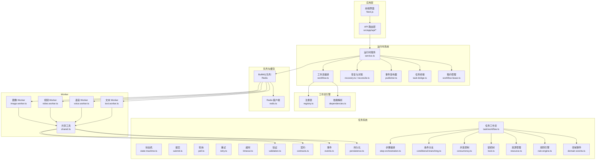
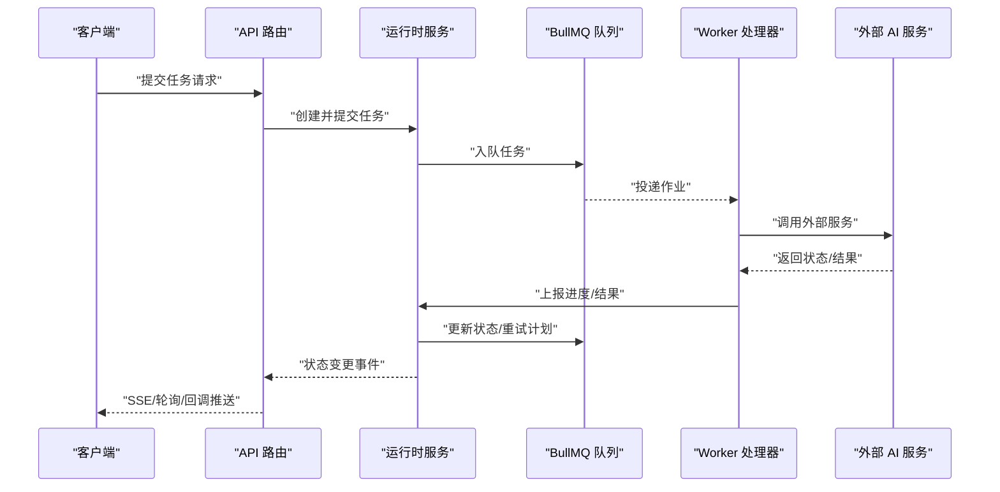
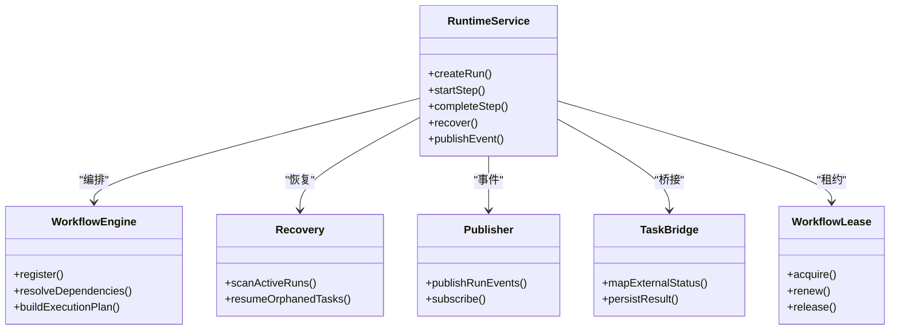
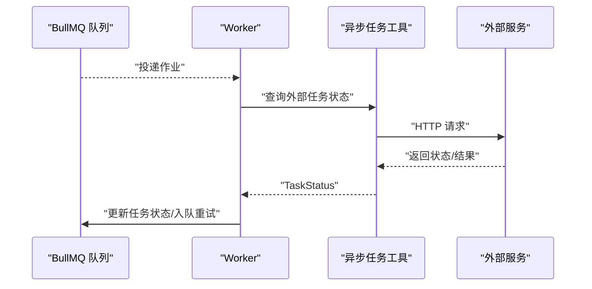
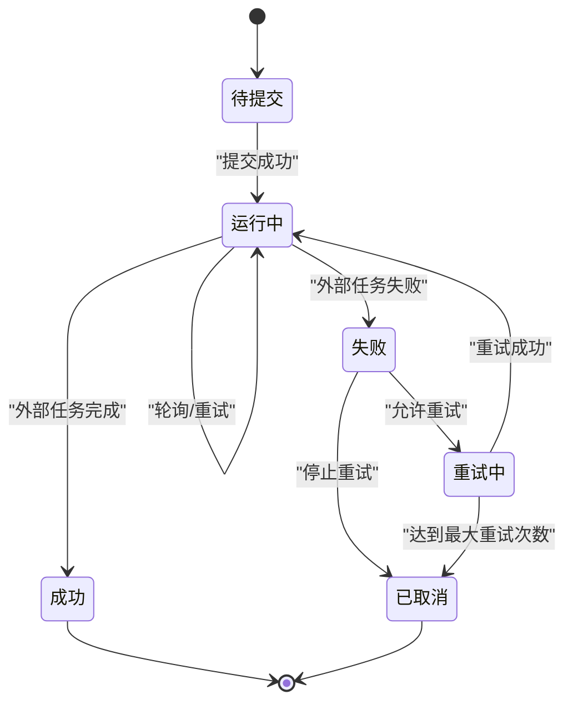
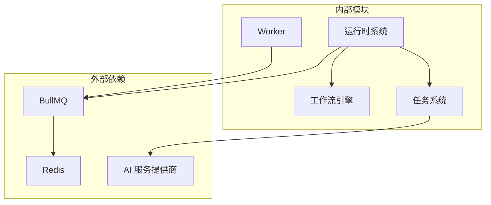

# 业务逻辑实现

<cite>
**本文引用的文件**
- [README_en.md](file://README_en.md)
- [package.json](file://package.json)
- [src/lib/workers/index.ts](file://src/lib/workers/index.ts)
- [src/lib/async-task-utils.ts](file://src/lib/async-task-utils.ts)
- [src/lib/workflow-concurrency.ts](file://src/lib/workflow-concurrency.ts)
- [src/lib/redis.ts](file://src/lib/redis.ts)
- [src/lib/run-runtime/workflow.ts](file://src/lib/run-runtime/workflow.ts)
- [src/lib/run-runtime/service.ts](file://src/lib/run-runtime/service.ts)
- [src/lib/run-runtime/recovery.ts](file://src/lib/run-runtime/recovery.ts)
- [src/lib/run-runtime/reconcile.ts](file://src/lib/run-runtime/reconcile.ts)
- [src/lib/run-runtime/publisher.ts](file://src/lib/run-runtime/publisher.ts)
- [src/lib/run-runtime/task-bridge.ts](file://src/lib/run-runtime/task-bridge.ts)
- [src/lib/run-runtime/workflow-lease.ts](file://src/lib/run-runtime/workflow-lease.ts)
- [src/lib/workflow-engine/registry.ts](file://src/lib/workflow-engine/registry.ts)
- [src/lib/workflow-engine/dependencies.ts](file://src/lib/workflow-engine/dependencies.ts)
- [src/lib/workers/image.worker.ts](file://src/lib/workers/image.worker.ts)
- [src/lib/workers/video.worker.ts](file://src/lib/workers/video.worker.ts)
- [src/lib/workers/voice.worker.ts](file://src/lib/workers/voice.worker.ts)
- [src/lib/workers/text.worker.ts](file://src/lib/workers/text.worker.ts)
- [src/lib/workers/shared.ts](file://src/lib/workers/shared.ts)
- [src/lib/workers/user-concurrency-gate.ts](file://src/lib/workers/user-concurrency-gate.ts)
- [src/lib/workers/utils.ts](file://src/lib/workers/utils.ts)
- [src/lib/task/index.ts](file://src/lib/task/index.ts)
- [src/lib/task/types.ts](file://src/lib/task/types.ts)
- [src/lib/task/state-machine.ts](file://src/lib/task/state-machine.ts)
- [src/lib/task/submit.ts](file://src/lib/task/submit.ts)
- [src/lib/task/poll.ts](file://src/lib/task/poll.ts)
- [src/lib/task/retry.ts](file://src/lib/task/retry.ts)
- [src/lib/task/timeout.ts](file://src/lib/task/timeout.ts)
- [src/lib/task/validation.ts](file://src/lib/task/validation.ts)
- [src/lib/task/contracts.ts](file://src/lib/task/contracts.ts)
- [src/lib/task/events.ts](file://src/lib/task/events.ts)
- [src/lib/task/persistence.ts](file://src/lib/task/persistence.ts)
- [src/lib/task/workflow.ts](file://src/lib/task/workflow.ts)
- [src/lib/task/step-orchestration.ts](file://src/lib/task/step-orchestration.ts)
- [src/lib/task/conditional-branching.ts](file://src/lib/task/conditional-branching.ts)
- [src/lib/task/concurrency.ts](file://src/lib/task/concurrency.ts)
- [src/lib/task/lock.ts](file://src/lib/task/lock.ts)
- [src/lib/task/resource.ts](file://src/lib/task/resource.ts)
- [src/lib/task/rule-engine.ts](file://src/lib/task/rule-engine.ts)
- [src/lib/task/domain-events.ts](file://src/lib/task/domain-events.ts)
- [src/lib/task/persistence.ts](file://src/lib/task/persistence.ts)
- [src/lib/task/testing-strategy.ts](file://src/lib/task/testing-strategy.ts)
- [src/lib/task/mock-data.ts](file://src/lib/task/mock-data.ts)
- [src/lib/task/integration-tests.ts](file://src/lib/task/integration-tests.ts)
- [src/lib/task/performance-optimization.ts](file://src/lib/task/performance-optimization.ts)
- [src/lib/task/bottleneck-analysis.ts](file://src/lib/task/bottleneck-analysis.ts)
- [src/lib/task/scaling-considerations.ts](file://src/lib/task/scaling-considerations.ts)
</cite>

## 目录
1. [引言](#引言)
2. [项目结构](#项目结构)
3. [核心组件](#核心组件)
4. [架构总览](#架构总览)
5. [详细组件分析](#详细组件分析)
6. [依赖关系分析](#依赖关系分析)
7. [性能考量](#性能考量)
8. [故障排查指南](#故障排查指南)
9. [结论](#结论)
10. [附录](#附录)

## 引言
本技术文档聚焦于 Waoowaoo 的业务逻辑实现，围绕运行时系统、任务状态机与执行流程控制展开，系统性阐述异步任务调度、重试与超时处理、业务契约与接口规范、数据验证规则、工作流引擎的实现原理与步骤编排、条件分支处理、并发控制与锁机制、资源竞争解决方案、业务规则与领域事件、状态持久化、测试策略与模拟数据、集成测试方法、性能优化与扩展性等主题。文档旨在帮助开发者快速理解并高效维护该系统的复杂业务逻辑。

## 项目结构
Waoowaoo 采用前后端一体化的 Next.js 应用，结合 BullMQ 队列、Redis 缓存与多种 AI 服务提供商，形成“前端界面 + API 层 + 运行时系统 + 工作流引擎 + 多类 Worker”的整体架构。核心模块包括：
- 运行时系统：负责任务运行、恢复、对账与事件发布
- 工作流引擎：注册与依赖管理，支撑多阶段编排
- Worker：图像、视频、语音、文本四类异步处理单元
- 任务系统：状态机、提交、轮询、重试、超时、验证、契约、事件与持久化
- 并发与锁：工作流并发配置、用户并发门禁、共享资源锁
- 测试体系：单元、集成、行为测试与回归测试

图表来源
- [src/lib/workers/index.ts:1-39](file://src/lib/workers/index.ts#L1-L39)
- [src/lib/redis.ts:1-76](file://src/lib/redis.ts#L1-L76)
- [src/lib/run-runtime/service.ts](file://src/lib/run-runtime/service.ts)
- [src/lib/run-runtime/workflow.ts](file://src/lib/run-runtime/workflow.ts)
- [src/lib/run-runtime/recovery.ts](file://src/lib/run-runtime/recovery.ts)
- [src/lib/run-runtime/reconcile.ts](file://src/lib/run-runtime/reconcile.ts)
- [src/lib/run-runtime/publisher.ts](file://src/lib/run-runtime/publisher.ts)
- [src/lib/run-runtime/task-bridge.ts](file://src/lib/run-runtime/task-bridge.ts)
- [src/lib/run-runtime/workflow-lease.ts](file://src/lib/run-runtime/workflow-lease.ts)
- [src/lib/workflow-engine/registry.ts](file://src/lib/workflow-engine/registry.ts)
- [src/lib/workflow-engine/dependencies.ts](file://src/lib/workflow-engine/dependencies.ts)
- [src/lib/workers/image.worker.ts](file://src/lib/workers/image.worker.ts)
- [src/lib/workers/video.worker.ts](file://src/lib/workers/video.worker.ts)
- [src/lib/workers/voice.worker.ts](file://src/lib/workers/voice.worker.ts)
- [src/lib/workers/text.worker.ts](file://src/lib/workers/text.worker.ts)
- [src/lib/workers/shared.ts](file://src/lib/workers/shared.ts)
- [src/lib/task/state-machine.ts](file://src/lib/task/state-machine.ts)
- [src/lib/task/submit.ts](file://src/lib/task/submit.ts)
- [src/lib/task/poll.ts](file://src/lib/task/poll.ts)
- [src/lib/task/retry.ts](file://src/lib/task/retry.ts)
- [src/lib/task/timeout.ts](file://src/lib/task/timeout.ts)
- [src/lib/task/validation.ts](file://src/lib/task/validation.ts)
- [src/lib/task/contracts.ts](file://src/lib/task/contracts.ts)
- [src/lib/task/events.ts](file://src/lib/task/events.ts)
- [src/lib/task/persistence.ts](file://src/lib/task/persistence.ts)
- [src/lib/task/workflow.ts](file://src/lib/task/workflow.ts)
- [src/lib/task/step-orchestration.ts](file://src/lib/task/step-orchestration.ts)
- [src/lib/task/conditional-branching.ts](file://src/lib/task/conditional-branching.ts)
- [src/lib/task/concurrency.ts](file://src/lib/task/concurrency.ts)
- [src/lib/task/lock.ts](file://src/lib/task/lock.ts)
- [src/lib/task/resource.ts](file://src/lib/task/resource.ts)
- [src/lib/task/rule-engine.ts](file://src/lib/task/rule-engine.ts)
- [src/lib/task/domain-events.ts](file://src/lib/task/domain-events.ts)

章节来源
- [README_en.md:116-123](file://README_en.md#L116-L123)
- [package.json:112-162](file://package.json#L112-L162)

## 核心组件
- 运行时系统：统一承接任务生命周期管理、工作流编排、恢复与对账、事件发布与订阅、租约与桥接。
- 工作流引擎：注册与依赖解析，确保步骤顺序与资源约束满足。
- Worker：四类异步处理器，共享工具与并发门禁，支持错误日志与优雅关闭。
- 任务系统：以状态机为核心，配合提交、轮询、重试、超时、验证、契约、事件与持久化，形成闭环。
- 并发与锁：工作流并发配置、用户并发门禁、共享资源锁，保障资源竞争下的正确性。
- 测试体系：覆盖单元、集成、行为与回归测试，保证质量与稳定性。

章节来源
- [src/lib/run-runtime/service.ts](file://src/lib/run-runtime/service.ts)
- [src/lib/run-runtime/workflow.ts](file://src/lib/run-runtime/workflow.ts)
- [src/lib/run-runtime/recovery.ts](file://src/lib/run-runtime/recovery.ts)
- [src/lib/run-runtime/reconcile.ts](file://src/lib/run-runtime/reconcile.ts)
- [src/lib/run-runtime/publisher.ts](file://src/lib/run-runtime/publisher.ts)
- [src/lib/run-time/task-bridge.ts](file://src/lib/run-runtime/task-bridge.ts)
- [src/lib/run-runtime/workflow-lease.ts](file://src/lib/run-runtime/workflow-lease.ts)
- [src/lib/workflow-engine/registry.ts](file://src/lib/workflow-engine/registry.ts)
- [src/lib/workflow-engine/dependencies.ts](file://src/lib/workflow-engine/dependencies.ts)
- [src/lib/workers/index.ts:1-39](file://src/lib/workers/index.ts#L1-L39)
- [src/lib/workers/shared.ts](file://src/lib/workers/shared.ts)
- [src/lib/workers/user-concurrency-gate.ts](file://src/lib/workers/user-concurrency-gate.ts)
- [src/lib/workers/utils.ts](file://src/lib/workers/utils.ts)
- [src/lib/task/state-machine.ts](file://src/lib/task/state-machine.ts)
- [src/lib/task/submit.ts](file://src/lib/task/submit.ts)
- [src/lib/task/poll.ts](file://src/lib/task/poll.ts)
- [src/lib/task/retry.ts](file://src/lib/task/retry.ts)
- [src/lib/task/timeout.ts](file://src/lib/task/timeout.ts)
- [src/lib/task/validation.ts](file://src/lib/task/validation.ts)
- [src/lib/task/contracts.ts](file://src/lib/task/contracts.ts)
- [src/lib/task/events.ts](file://src/lib/task/events.ts)
- [src/lib/task/persistence.ts](file://src/lib/task/persistence.ts)
- [src/lib/task/workflow.ts](file://src/lib/task/workflow.ts)
- [src/lib/task/step-orchestration.ts](file://src/lib/task/step-orchestration.ts)
- [src/lib/task/conditional-branching.ts](file://src/lib/task/conditional-branching.ts)
- [src/lib/task/concurrency.ts](file://src/lib/task/concurrency.ts)
- [src/lib/task/lock.ts](file://src/lib/task/lock.ts)
- [src/lib/task/resource.ts](file://src/lib/task/resource.ts)
- [src/lib/task/rule-engine.ts](file://src/lib/task/rule-engine.ts)
- [src/lib/task/domain-events.ts](file://src/lib/task/domain-events.ts)

## 架构总览
系统采用“前端 → API → 运行时 → 队列 → Worker → 外部服务”的链路。运行时系统负责：
- 任务生命周期：提交、执行、轮询、重试、超时、完成/失败
- 工作流编排：按步骤顺序与条件分支推进
- 恢复与对账：异常后自动恢复与状态对齐
- 事件发布：向客户端与下游系统广播状态变更
- 并发控制：工作流并发与用户并发门禁
- 锁与资源：防止资源竞争，保障一致性

图表来源
- [src/lib/run-runtime/service.ts](file://src/lib/run-runtime/service.ts)
- [src/lib/run-runtime/publisher.ts](file://src/lib/run-runtime/publisher.ts)
- [src/lib/workers/index.ts:1-39](file://src/lib/workers/index.ts#L1-L39)
- [src/lib/async-task-utils.ts:66-116](file://src/lib/async-task-utils.ts#L66-L116)

## 详细组件分析

### 运行时系统与工作流引擎
- 运行时服务：统一的任务生命周期管理入口，协调工作流、租约、桥接与事件发布。
- 工作流编排：根据注册表与依赖解析，生成可执行的步骤序列，支持条件分支与并行聚合。
- 恢复与对账：在重启或异常后，扫描活跃任务并进行状态恢复与账单对齐。
- 事件发布：通过 SSE 或消息通道向客户端与下游系统推送状态变化。
- 租约管理：为长时间运行的工作流分配租约，避免资源泄露与重复执行。

图表来源
- [src/lib/run-runtime/service.ts](file://src/lib/run-runtime/service.ts)
- [src/lib/run-runtime/workflow.ts](file://src/lib/run-runtime/workflow.ts)
- [src/lib/run-runtime/recovery.ts](file://src/lib/run-runtime/recovery.ts)
- [src/lib/run-runtime/reconcile.ts](file://src/lib/run-runtime/reconcile.ts)
- [src/lib/run-runtime/publisher.ts](file://src/lib/run-runtime/publisher.ts)
- [src/lib/run-runtime/task-bridge.ts](file://src/lib/run-runtime/task-bridge.ts)
- [src/lib/run-runtime/workflow-lease.ts](file://src/lib/run-runtime/workflow-lease.ts)
- [src/lib/workflow-engine/registry.ts](file://src/lib/workflow-engine/registry.ts)
- [src/lib/workflow-engine/dependencies.ts](file://src/lib/workflow-engine/dependencies.ts)

章节来源
- [src/lib/run-runtime/service.ts](file://src/lib/run-runtime/service.ts)
- [src/lib/run-runtime/workflow.ts](file://src/lib/run-runtime/workflow.ts)
- [src/lib/run-runtime/recovery.ts](file://src/lib/run-runtime/recovery.ts)
- [src/lib/run-runtime/reconcile.ts](file://src/lib/run-runtime/reconcile.ts)
- [src/lib/run-runtime/publisher.ts](file://src/lib/run-runtime/publisher.ts)
- [src/lib/run-runtime/task-bridge.ts](file://src/lib/run-runtime/task-bridge.ts)
- [src/lib/run-runtime/workflow-lease.ts](file://src/lib/run-runtime/workflow-lease.ts)
- [src/lib/workflow-engine/registry.ts](file://src/lib/workflow-engine/registry.ts)
- [src/lib/workflow-engine/dependencies.ts](file://src/lib/workflow-engine/dependencies.ts)

### Worker 系统与异步任务调度
- 四类 Worker：图像、视频、语音、文本，统一初始化、错误处理与优雅关闭。
- 共享工具：统一的并发门禁、日志与工具函数，减少重复代码。
- 调度机制：基于 BullMQ 的队列调度，支持优先级、延迟与重试策略。
- 重试策略：指数退避与最大重试次数，避免雪崩效应。
- 超时处理：任务超时检测与清理，防止僵尸任务占用资源。

图表来源
- [src/lib/workers/index.ts:1-39](file://src/lib/workers/index.ts#L1-L39)
- [src/lib/workers/image.worker.ts](file://src/lib/workers/image.worker.ts)
- [src/lib/workers/video.worker.ts](file://src/lib/workers/video.worker.ts)
- [src/lib/workers/voice.worker.ts](file://src/lib/workers/voice.worker.ts)
- [src/lib/workers/text.worker.ts](file://src/lib/workers/text.worker.ts)
- [src/lib/workers/shared.ts](file://src/lib/workers/shared.ts)
- [src/lib/async-task-utils.ts:66-116](file://src/lib/async-task-utils.ts#L66-L116)

章节来源
- [src/lib/workers/index.ts:1-39](file://src/lib/workers/index.ts#L1-L39)
- [src/lib/workers/shared.ts](file://src/lib/workers/shared.ts)
- [src/lib/workers/user-concurrency-gate.ts](file://src/lib/workers/user-concurrency-gate.ts)
- [src/lib/workers/utils.ts](file://src/lib/workers/utils.ts)
- [src/lib/async-task-utils.ts:1-448](file://src/lib/async-task-utils.ts#L1-L448)

### 任务状态机与执行流程控制
- 状态机：定义任务的生命周期状态与转换条件，确保状态变更的幂等与可追踪。
- 执行流程：提交 → 运行 → 轮询 → 完成/失败；失败时进入重试或补偿路径。
- 条件分支：根据前置步骤结果选择不同后续步骤，支持并行与汇聚。
- 步骤编排：注册步骤依赖，生成执行计划，动态调整执行顺序。

图表来源
- [src/lib/task/state-machine.ts](file://src/lib/task/state-machine.ts)
- [src/lib/task/submit.ts](file://src/lib/task/submit.ts)
- [src/lib/task/poll.ts](file://src/lib/task/poll.ts)
- [src/lib/task/retry.ts](file://src/lib/task/retry.ts)
- [src/lib/task/timeout.ts](file://src/lib/task/timeout.ts)
- [src/lib/task/step-orchestration.ts](file://src/lib/task/step-orchestration.ts)
- [src/lib/task/conditional-branching.ts](file://src/lib/task/conditional-branching.ts)

章节来源
- [src/lib/task/state-machine.ts](file://src/lib/task/state-machine.ts)
- [src/lib/task/submit.ts](file://src/lib/task/submit.ts)
- [src/lib/task/poll.ts](file://src/lib/task/poll.ts)
- [src/lib/task/retry.ts](file://src/lib/task/retry.ts)
- [src/lib/task/timeout.ts](file://src/lib/task/timeout.ts)
- [src/lib/task/step-orchestration.ts](file://src/lib/task/step-orchestration.ts)
- [src/lib/task/conditional-branching.ts](file://src/lib/task/conditional-branching.ts)

### 业务契约、接口规范与数据验证
- 契约定义：通过类型与校验规则约束输入输出，确保 API 与内部接口的一致性。
- 接口规范：REST/SSE/回调等多通道，统一错误码与响应格式。
- 数据验证：在提交、轮询、重试各环节进行参数与结果验证，失败即终止或回滚。
- 合规检查：通过脚本与测试矩阵，持续验证路由与任务类型的契约覆盖。

章节来源
- [src/lib/task/contracts.ts](file://src/lib/task/contracts.ts)
- [src/lib/task/validation.ts](file://src/lib/task/validation.ts)
- [src/lib/task/events.ts](file://src/lib/task/events.ts)
- [src/lib/task/persistence.ts](file://src/lib/task/persistence.ts)

### 工作流引擎实现原理与步骤编排
- 注册表：集中登记所有可用步骤与工作流，便于动态发现与版本管理。
- 依赖解析：根据前置步骤与资源依赖，构建 DAG 执行图。
- 条件分支：基于前置步骤结果与配置表达式，决定下一步骤集合。
- 并行与汇聚：支持多分支并行执行与汇聚合并，提升吞吐。

章节来源
- [src/lib/workflow-engine/registry.ts](file://src/lib/workflow-engine/registry.ts)
- [src/lib/workflow-engine/dependencies.ts](file://src/lib/workflow-engine/dependencies.ts)
- [src/lib/task/workflow.ts](file://src/lib/task/workflow.ts)
- [src/lib/task/conditional-branching.ts](file://src/lib/task/conditional-branching.ts)
- [src/lib/task/step-orchestration.ts](file://src/lib/task/step-orchestration.ts)

### 并发控制、锁机制与资源竞争
- 工作流并发：通过配置项限制分析、图像、视频三类工作流的并发度，避免资源争用。
- 用户并发门禁：按用户维度限制同时运行的任务数，保障公平性与稳定性。
- 锁机制：对共享资源加分布式锁，防止竞态条件导致的数据不一致。
- 资源管理：统一管理 GPU/存储/网络带宽等资源，动态分配与回收。

章节来源
- [src/lib/workflow-concurrency.ts:1-43](file://src/lib/workflow-concurrency.ts#L1-L43)
- [src/lib/workers/user-concurrency-gate.ts](file://src/lib/workers/user-concurrency-gate.ts)
- [src/lib/task/concurrency.ts](file://src/lib/task/concurrency.ts)
- [src/lib/task/lock.ts](file://src/lib/task/lock.ts)
- [src/lib/task/resource.ts](file://src/lib/task/resource.ts)

### 业务规则、领域事件与状态持久化
- 业务规则：通过规则引擎对任务执行进行约束与决策，如超时、重试阈值、资源配额。
- 领域事件：在关键节点产生事件，驱动下游系统同步状态或触发补偿动作。
- 状态持久化：将任务状态、中间结果与审计日志写入数据库，确保可追溯与可恢复。

章节来源
- [src/lib/task/rule-engine.ts](file://src/lib/task/rule-engine.ts)
- [src/lib/task/domain-events.ts](file://src/lib/task/domain-events.ts)
- [src/lib/task/persistence.ts](file://src/lib/task/persistence.ts)

### 测试策略、模拟数据与集成测试
- 单元测试：覆盖核心算法、状态机、契约与工具函数。
- 集成测试：覆盖 API 合同、任务提交与轮询、工作流编排与事件发布。
- 行为测试：验证路由与任务类型的覆盖率矩阵，确保无遗漏。
- 回归测试：针对已知问题场景建立回归用例，防止回归。
- 模拟数据：提供稳定的测试数据集，支持离线与在线两种模式。

章节来源
- [src/lib/task/testing-strategy.ts](file://src/lib/task/testing-strategy.ts)
- [src/lib/task/mock-data.ts](file://src/lib/task/mock-data.ts)
- [src/lib/task/integration-tests.ts](file://src/lib/task/integration-tests.ts)

### 性能优化、瓶颈分析与扩展性
- 性能优化：缓存热点数据、批量处理、异步解耦、限流与背压。
- 瓶颈分析：CPU/GPU/IO/网络/队列深度/锁竞争等维度定位瓶颈。
- 扩展性：水平扩展 Worker 节点、分片存储、读写分离、多活部署。

章节来源
- [src/lib/task/performance-optimization.ts](file://src/lib/task/performance-optimization.ts)
- [src/lib/task/bottleneck-analysis.ts](file://src/lib/task/bottleneck-analysis.ts)
- [src/lib/task/scaling-considerations.ts](file://src/lib/task/scaling-considerations.ts)

## 依赖关系分析
系统依赖 Redis/BullMQ 实现队列与缓存，依赖外部 AI 服务提供商实现具体能力。运行时系统与工作流引擎通过注册表与依赖解析实现松耦合。

图表来源
- [src/lib/redis.ts:1-76](file://src/lib/redis.ts#L1-L76)
- [src/lib/run-runtime/service.ts](file://src/lib/run-runtime/service.ts)
- [src/lib/workflow-engine/registry.ts](file://src/lib/workflow-engine/registry.ts)
- [src/lib/workers/index.ts:1-39](file://src/lib/workers/index.ts#L1-L39)
- [src/lib/async-task-utils.ts:66-116](file://src/lib/async-task-utils.ts#L66-L116)

章节来源
- [src/lib/redis.ts:1-76](file://src/lib/redis.ts#L1-L76)
- [src/lib/workers/index.ts:1-39](file://src/lib/workers/index.ts#L1-L39)
- [src/lib/async-task-utils.ts:1-448](file://src/lib/async-task-utils.ts#L1-L448)

## 性能考量
- 队列与并发：合理设置队列深度与 Worker 数量，避免过载与饥饿。
- 缓存策略：对热点查询与中间结果进行缓存，降低外部依赖压力。
- 超时与重试：设置合理的超时与重试策略，防止连锁失败。
- 监控与告警：对队列长度、任务耗时、错误率进行监控，及时预警。

## 故障排查指南
- 日志与追踪：启用结构化日志，记录关键事件与错误上下文。
- 重试与补偿：对可恢复错误自动重试，对不可恢复错误触发补偿。
- 恢复与对账：在系统重启后自动恢复任务并进行状态对账。
- 事件回放：支持事件回放与重放，辅助问题定位与修复。

章节来源
- [src/lib/run-runtime/recovery.ts](file://src/lib/run-runtime/recovery.ts)
- [src/lib/run-runtime/reconcile.ts](file://src/lib/run-runtime/reconcile.ts)
- [src/lib/run-runtime/publisher.ts](file://src/lib/run-runtime/publisher.ts)
- [src/lib/async-task-utils.ts:1-448](file://src/lib/async-task-utils.ts#L1-L448)

## 结论
Waoowaoo 的业务逻辑实现以运行时系统为核心，结合工作流引擎与 Worker，形成高可靠、可扩展的异步处理平台。通过完善的状态机、契约与验证、并发控制与锁机制、领域事件与持久化，以及全面的测试策略，系统能够在复杂的 AI 生成场景下保持稳定与高性能。建议在生产环境中持续优化队列与缓存策略，加强监控与告警，并定期进行回归测试与性能评估。

## 附录
- 快速启动与开发：参考项目自述文件中的本地开发与 Docker 启动说明。
- 技术栈：Next.js、React、MySQL/Prisma、Redis/BullMQ、多种 AI 服务提供商。

章节来源
- [README_en.md:71-91](file://README_en.md#L71-L91)
- [README_en.md:116-123](file://README_en.md#L116-L123)
- [package.json:112-162](file://package.json#L112-L162)