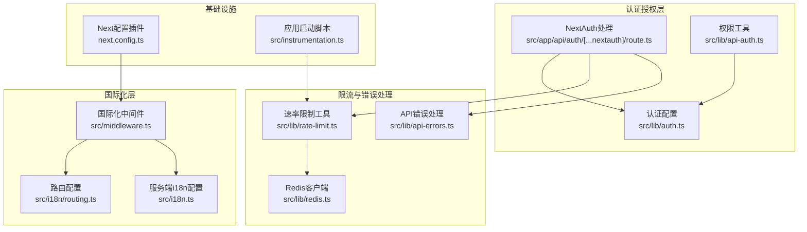
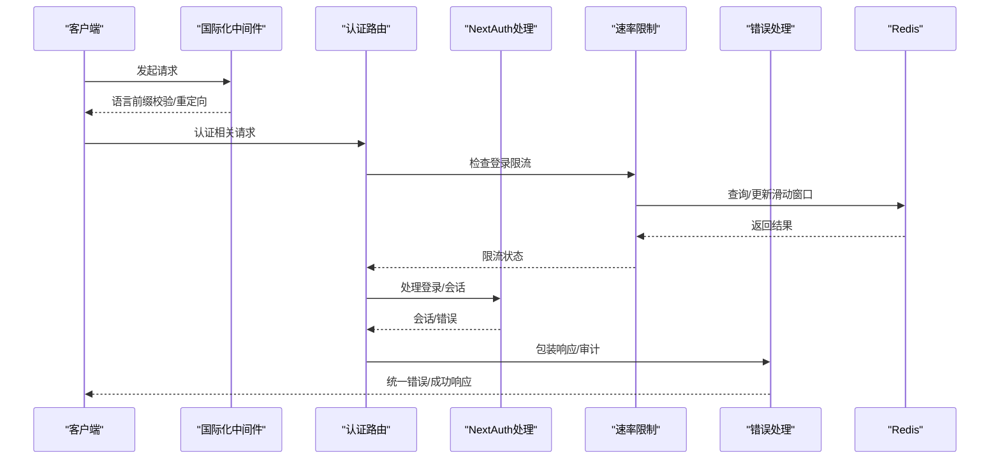
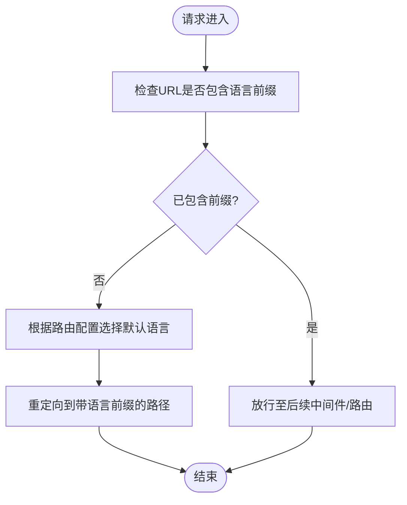
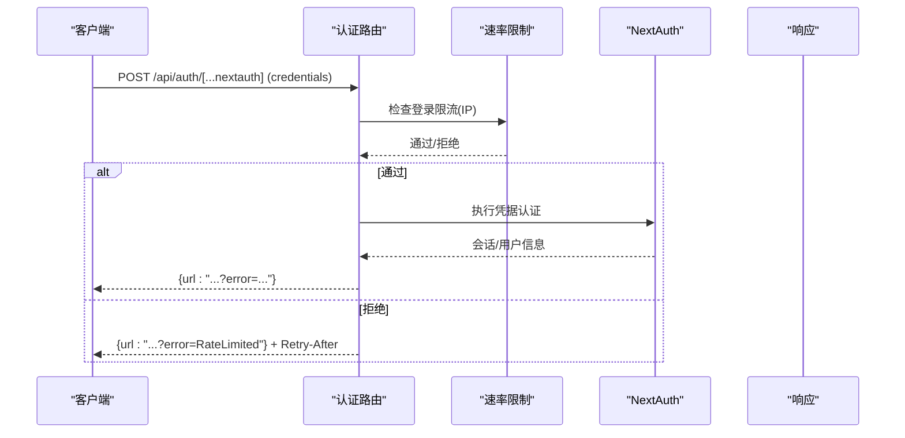
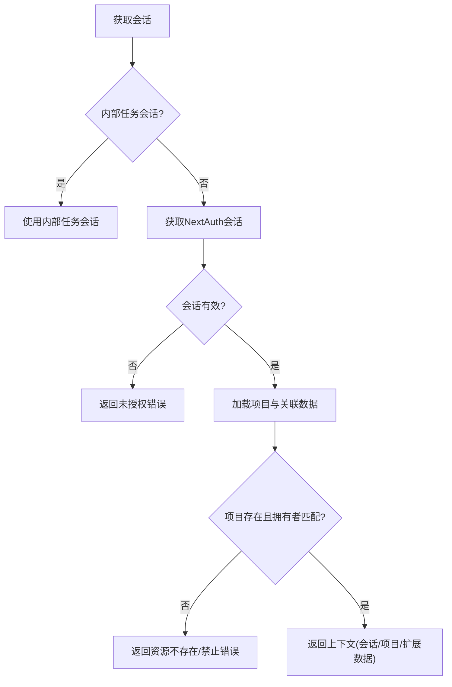
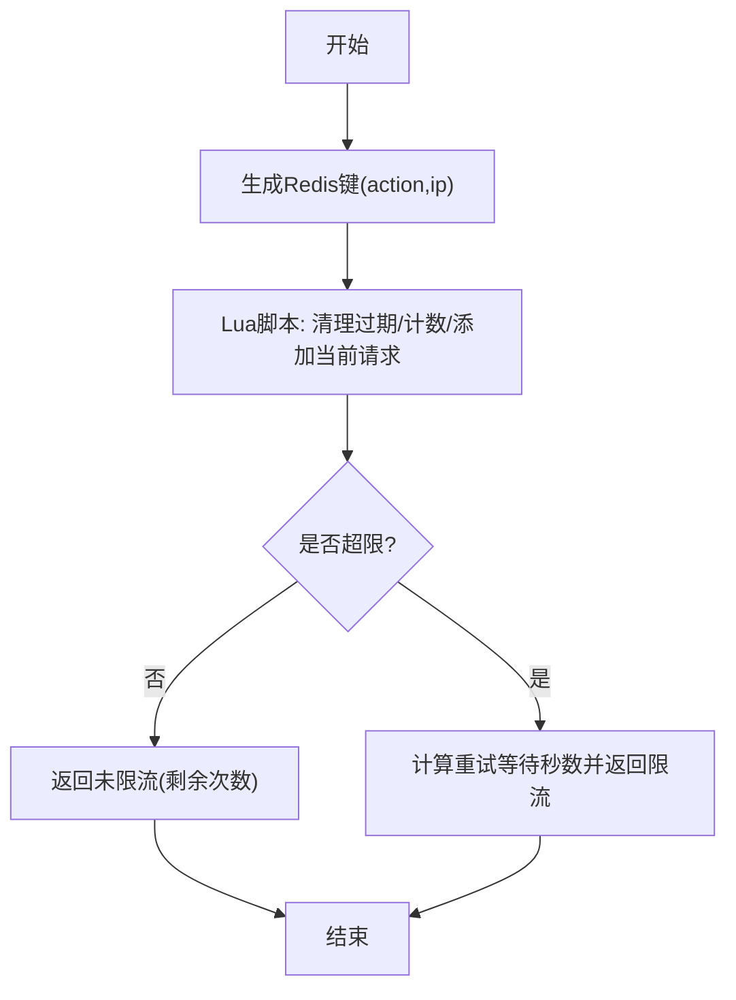
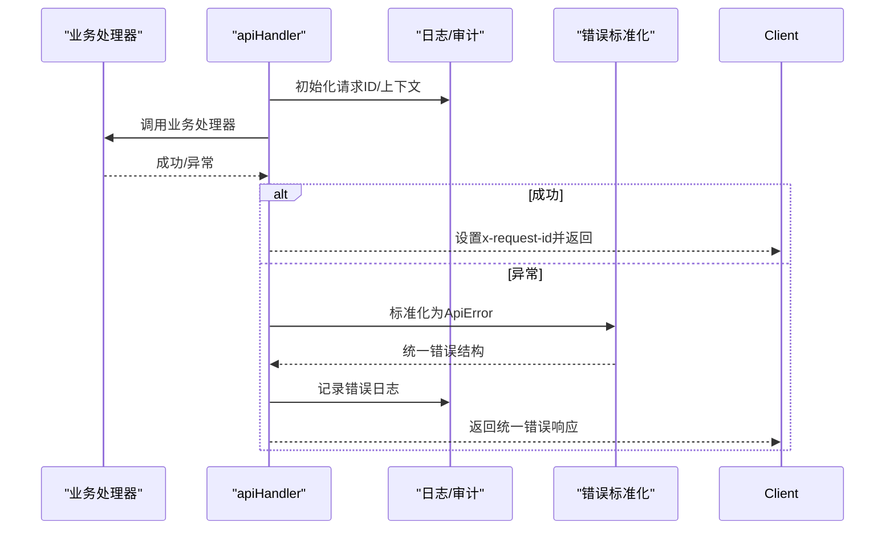
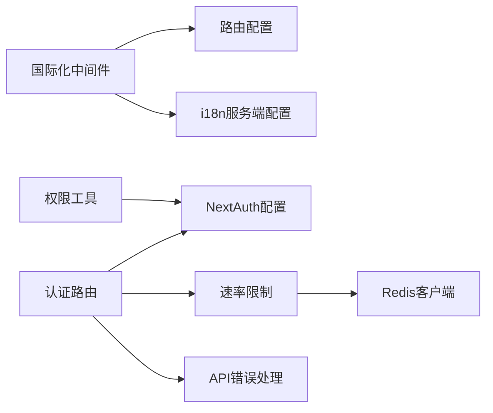

# 中间件系统

<cite>
**本文引用的文件**
- [middleware.ts](file://src/middleware.ts)
- [next.config.ts](file://next.config.ts)
- [routing.ts](file://src/i18n/routing.ts)
- [i18n.ts](file://src/i18n.ts)
- [rate-limit.ts](file://src/lib/rate-limit.ts)
- [api-auth.ts](file://src/lib/api-auth.ts)
- [auth.ts](file://src/lib/auth.ts)
- [api-errors.ts](file://src/lib/api-errors.ts)
- [redis.ts](file://src/lib/redis.ts)
- [instrumentation.ts](file://src/instrumentation.ts)
- [internal-task.ts](file://src/lib/llm-observe/internal-task.ts)
- [route.ts](file://src/app/api/auth/[...nextauth]/route.ts)
- [route.ts](file://src/app/api/cos/image/route.ts)
</cite>

## 目录
1. [引言](#引言)
2. [项目结构](#项目结构)
3. [核心组件](#核心组件)
4. [架构总览](#架构总览)
5. [详细组件分析](#详细组件分析)
6. [依赖关系分析](#依赖关系分析)
7. [性能考量](#性能考量)
8. [故障排查指南](#故障排查指南)
9. [结论](#结论)
10. [附录](#附录)

## 引言
本文件面向Waoowaoo的中间件系统，聚焦Next.js中间件在国际化、认证授权、速率限制与错误处理方面的实现与集成。文档覆盖以下主题：
- 中间件的执行顺序与匹配规则
- 认证中间件、授权中间件、CORS处理中间件与速率限制中间件的实现原理
- 中间件链的构建方式、错误传播机制与异常处理策略
- 自定义中间件的开发指南、注册机制与生命周期管理
- 与路由系统的集成方式、条件执行与动态配置
- 性能优化、缓存策略与监控指标
- 安全中间件的实现细节与防护措施

## 项目结构
Waoowaoo的中间件体系主要由三部分构成：
- 国际化中间件：负责语言前缀校验与重定向
- 认证/授权中间件：基于NextAuth与自定义权限工具
- 速率限制中间件：基于Redis滑动窗口的IP级限流
- 错误处理中间件：统一的API错误包装与审计

**图表来源**
- [middleware.ts:1-28](file://src/middleware.ts#L1-L28)
- [routing.ts:1-18](file://src/i18n/routing.ts#L1-L18)
- [i18n.ts:1-16](file://src/i18n.ts#L1-L16)
- [route.ts:1-50](file://src/app/api/auth/[...nextauth]/route.ts#L1-L50)
- [auth.ts:1-79](file://src/lib/auth.ts#L1-L79)
- [api-auth.ts:1-355](file://src/lib/api-auth.ts#L1-L355)
- [rate-limit.ts:1-146](file://src/lib/rate-limit.ts#L1-L146)
- [api-errors.ts:1-571](file://src/lib/api-errors.ts#L1-L571)
- [redis.ts:1-76](file://src/lib/redis.ts#L1-L76)
- [next.config.ts:1-24](file://next.config.ts#L1-L24)
- [instrumentation.ts:1-214](file://src/instrumentation.ts#L1-L214)

**章节来源**
- [middleware.ts:1-28](file://src/middleware.ts#L1-L28)
- [routing.ts:1-18](file://src/i18n/routing.ts#L1-L18)
- [i18n.ts:1-16](file://src/i18n.ts#L1-L16)
- [next.config.ts:1-24](file://next.config.ts#L1-L24)

## 核心组件
- 国际化中间件：通过next-intl中间件实现语言前缀强制与禁用自动语言检测，确保URL始终携带语言前缀，避免语言漂移。
- 认证中间件：NextAuth凭据认证，结合自定义权限工具进行会话获取、项目权限与资源权限校验。
- 速率限制中间件：基于Redis的滑动窗口算法，针对登录等敏感接口进行IP级限流，失败时返回兼容NextAuth的响应格式。
- 错误处理中间件：统一的API错误包装、请求ID注入、审计日志与内部任务流回调。

**章节来源**
- [middleware.ts:1-28](file://src/middleware.ts#L1-L28)
- [auth.ts:1-79](file://src/lib/auth.ts#L1-L79)
- [api-auth.ts:1-355](file://src/lib/api-auth.ts#L1-L355)
- [rate-limit.ts:1-146](file://src/lib/rate-limit.ts#L1-L146)
- [api-errors.ts:1-571](file://src/lib/api-errors.ts#L1-L571)

## 架构总览
下图展示从请求进入至响应返回的关键路径，包括国际化、认证授权、限流与错误处理的协作关系。

**图表来源**
- [middleware.ts:1-28](file://src/middleware.ts#L1-L28)
- [route.ts:1-50](file://src/app/api/auth/[...nextauth]/route.ts#L1-L50)
- [rate-limit.ts:58-118](file://src/lib/rate-limit.ts#L58-L118)
- [api-errors.ts:440-562](file://src/lib/api-errors.ts#L440-L562)
- [redis.ts:1-76](file://src/lib/redis.ts#L1-L76)

## 详细组件分析

### 国际化中间件
- 功能要点
  - 支持的语言列表与默认语言来自路由配置
  - URL策略为“始终显示语言前缀”，禁用自动语言检测以避免无前缀跳转导致的语言漂移
  - 匹配规则覆盖根路径、带语言前缀路径与非静态资源路径，确保所有业务路由均受语言前缀约束
- 执行顺序
  - 作为应用级中间件，最先拦截请求，完成语言前缀校验与必要重定向
- 配置方式
  - 通过next.config.ts启用国际化插件，并将i18n路由配置传递给中间件

**图表来源**
- [middleware.ts:18-27](file://src/middleware.ts#L18-L27)
- [routing.ts:8-17](file://src/i18n/routing.ts#L8-L17)

**章节来源**
- [middleware.ts:1-28](file://src/middleware.ts#L1-L28)
- [routing.ts:1-18](file://src/i18n/routing.ts#L1-L18)
- [i18n.ts:1-16](file://src/i18n.ts#L1-L16)
- [next.config.ts:1-24](file://next.config.ts#L1-L24)

### 认证中间件（NextAuth）
- 实现原理
  - 使用凭据提供者进行用户名/密码认证，密码采用bcrypt比对
  - 会话策略为JWT，回调中将用户ID写入token与session
  - 登录接口在特定回调路径上进行速率限制，返回兼容NextAuth的响应格式
- 执行流程
  - 客户端发起登录请求
  - 路由层判断是否为凭据回调路径
  - 若是，则先进行IP级速率限制；通过后交由NextAuth处理
  - NextAuth完成后，返回包含URL字段的响应，供客户端解析错误参数

**图表来源**
- [route.ts:19-44](file://src/app/api/auth/[...nextauth]/route.ts#L19-L44)
- [rate-limit.ts:58-118](file://src/lib/rate-limit.ts#L58-L118)
- [auth.ts:16-54](file://src/lib/auth.ts#L16-L54)

**章节来源**
- [route.ts:1-50](file://src/app/api/auth/[...nextauth]/route.ts#L1-L50)
- [auth.ts:1-79](file://src/lib/auth.ts#L1-L79)
- [rate-limit.ts:1-146](file://src/lib/rate-limit.ts#L1-L146)

### 授权中间件（项目/用户级）
- 实现原理
  - 提供多种权限校验方法：requireAuth、requireUserAuth、requireProjectAuth、requireProjectAuthLight
  - requireProjectAuth支持按需加载关联数据（角色、地点、剧集），并统一模型键格式
  - 内部任务执行通过特定头部进行校验，允许在非生产环境放宽条件
- 执行流程
  - 优先尝试内部任务会话，若失败则走标准NextAuth会话
  - 校验项目存在性、所有权与必需的项目扩展数据
  - 返回统一的错误响应或上下文对象

**图表来源**
- [api-auth.ts:37-57](file://src/lib/api-auth.ts#L37-L57)
- [api-auth.ts:173-191](file://src/lib/api-auth.ts#L173-L191)
- [api-auth.ts:214-292](file://src/lib/api-auth.ts#L214-L292)
- [internal-task.ts:1-18](file://src/lib/llm-observe/internal-task.ts#L1-L18)

**章节来源**
- [api-auth.ts:1-355](file://src/lib/api-auth.ts#L1-L355)
- [internal-task.ts:1-18](file://src/lib/llm-observe/internal-task.ts#L1-L18)

### 速率限制中间件（Redis滑动窗口）
- 实现原理
  - 基于Redis ZSET维护每个(action, ip)维度的请求时间戳，Lua脚本原子清理过期项并计数
  - 窗口大小与最大请求数可配置，超限时计算重试等待秒数
  - Redis不可用时采取“宽松放行”策略，避免因限流后端故障导致登录阻塞
- 执行流程
  - 从请求头提取客户端IP（考虑代理链）
  - 生成Redis键，调用Lua脚本更新计数并返回结果
  - 根据结果决定放行或返回限流响应（包含Retry-After）

**图表来源**
- [rate-limit.ts:58-118](file://src/lib/rate-limit.ts#L58-L118)
- [rate-limit.ts:128-145](file://src/lib/rate-limit.ts#L128-L145)
- [redis.ts:1-76](file://src/lib/redis.ts#L1-L76)

**章节来源**
- [rate-limit.ts:1-146](file://src/lib/rate-limit.ts#L1-L146)
- [redis.ts:1-76](file://src/lib/redis.ts#L1-L76)

### 错误处理中间件（统一API错误包装）
- 实现原理
  - apiHandler包装路由处理器，注入请求ID、提取路由上下文、记录调试/审计日志
  - 捕获异常并标准化为统一的ApiError，返回结构化的错误响应
  - 支持内部任务流回调，将流式输出事件发布到任务系统
- 执行流程
  - 生成请求ID并建立日志上下文
  - 执行业务处理器，设置x-request-id响应头
  - 捕获异常，记录错误日志并返回统一错误结构

**图表来源**
- [api-errors.ts:440-562](file://src/lib/api-errors.ts#L440-L562)
- [api-errors.ts:422-438](file://src/lib/api-errors.ts#L422-L438)

**章节来源**
- [api-errors.ts:1-571](file://src/lib/api-errors.ts#L1-L571)

### CORS处理中间件
- 现状说明
  - 仓库中未发现显式的CORS中间件实现
  - 项目通过Next.js内置能力与路由层重定向处理静态资源访问
- 建议
  - 如需跨域支持，可在路由层通过NextResponse手动设置CORS头，或引入轻量CORS中间件
  - 注意与认证路由的配合，避免泄露敏感信息

[本节为概念性说明，不直接分析具体文件，故无“章节来源”]

### 中间件链构建与执行顺序
- 链路顺序
  1) 国际化中间件（语言前缀校验/重定向）
  2) 认证/授权中间件（NextAuth会话/项目权限）
  3) 速率限制中间件（登录等敏感接口）
  4) 错误处理中间件（统一包装/审计）
- 条件执行
  - 认证路由仅对凭据回调路径执行限流
  - 权限工具按需加载关联数据，减少不必要的数据库查询
- 生命周期管理
  - 应用启动时通过instrumentation进行任务队列恢复与对账，间接保障中间件链稳定

**章节来源**
- [middleware.ts:1-28](file://src/middleware.ts#L1-L28)
- [route.ts:19-44](file://src/app/api/auth/[...nextauth]/route.ts#L19-L44)
- [api-auth.ts:214-292](file://src/lib/api-auth.ts#L214-L292)
- [instrumentation.ts:1-214](file://src/instrumentation.ts#L1-L214)

### 自定义中间件开发指南
- 开发步骤
  - 定义中间件导出函数与config.matcher
  - 在中间件中读取请求上下文（headers、params等）
  - 通过NextResponse进行重定向/拒绝或放行
- 注册机制
  - Next.js中间件通过文件系统约定自动注册，无需额外配置
- 生命周期
  - 中间件在请求进入时执行，可结合instrumentation进行应用级初始化

**章节来源**
- [middleware.ts:18-27](file://src/middleware.ts#L18-L27)
- [instrumentation.ts:1-214](file://src/instrumentation.ts#L1-L214)

### 与路由系统的集成
- 国际化路由
  - 通过defineRouting定义语言列表、默认语言与前缀策略
  - 中间件matcher与路由配置保持一致，确保所有业务路由受语言前缀约束
- 认证路由
  - NextAuth路由位于/api/auth/[...nextauth]，在该路径上进行限流与会话处理
- 静态资源
  - 中间件matcher排除静态资源路径，避免对/_next/static、/_next/image、favicon.ico等产生影响

**章节来源**
- [routing.ts:1-18](file://src/i18n/routing.ts#L1-L18)
- [middleware.ts:18-27](file://src/middleware.ts#L18-L27)
- [route.ts:1-50](file://src/app/api/auth/[...nextauth]/route.ts#L1-L50)

### 动态配置与条件执行
- 动态配置
  - 语言前缀策略、默认语言与匹配规则在路由配置与中间件中集中管理
  - 限流阈值与窗口大小通过配置对象灵活调整
- 条件执行
  - 登录限流仅作用于凭据回调路径
  - 内部任务执行通过头部校验，允许在非生产环境放宽条件

**章节来源**
- [routing.ts:8-17](file://src/i18n/routing.ts#L8-L17)
- [rate-limit.ts:35-45](file://src/lib/rate-limit.ts#L35-L45)
- [route.ts:21-25](file://src/app/api/auth/[...nextauth]/route.ts#L21-L25)
- [internal-task.ts:1-18](file://src/lib/llm-observe/internal-task.ts#L1-L18)

## 依赖关系分析
- 组件耦合
  - 国际化中间件依赖路由配置；认证中间件依赖NextAuth配置与权限工具
  - 速率限制依赖Redis客户端；错误处理依赖日志与审计工具
- 外部依赖
  - Next.js中间件、NextAuth、ioredis、NextIntl插件
- 循环依赖
  - 未见明显循环依赖；各模块职责清晰

**图表来源**
- [middleware.ts:1-28](file://src/middleware.ts#L1-L28)
- [routing.ts:1-18](file://src/i18n/routing.ts#L1-L18)
- [i18n.ts:1-16](file://src/i18n.ts#L1-L16)
- [route.ts:1-50](file://src/app/api/auth/[...nextauth]/route.ts#L1-L50)
- [auth.ts:1-79](file://src/lib/auth.ts#L1-L79)
- [rate-limit.ts:1-146](file://src/lib/rate-limit.ts#L1-L146)
- [redis.ts:1-76](file://src/lib/redis.ts#L1-L76)
- [api-errors.ts:1-571](file://src/lib/api-errors.ts#L1-L571)
- [api-auth.ts:1-355](file://src/lib/api-auth.ts#L1-L355)

**章节来源**
- [middleware.ts:1-28](file://src/middleware.ts#L1-L28)
- [rate-limit.ts:1-146](file://src/lib/rate-limit.ts#L1-L146)
- [api-auth.ts:1-355](file://src/lib/api-auth.ts#L1-L355)
- [api-errors.ts:1-571](file://src/lib/api-errors.ts#L1-L571)
- [redis.ts:1-76](file://src/lib/redis.ts#L1-L76)

## 性能考量
- Redis连接与重试
  - 应用Redis与队列Redis分离，分别设置maxRetriesPerRequest，避免命令重试副作用
  - 指数退避重试策略，上限30秒，降低瞬时峰值对下游的影响
- 限流性能
  - Lua脚本原子操作，单次查询即可完成清理、计数与更新
  - Redis键TTL略大于窗口，减少边界竞争
- 日志与审计
  - 请求ID贯穿全链路，便于追踪与性能分析
  - 审计日志仅对变更类操作与生成类操作生效，降低开销

**章节来源**
- [redis.ts:20-58](file://src/lib/redis.ts#L20-L58)
- [rate-limit.ts:68-96](file://src/lib/rate-limit.ts#L68-L96)
- [api-errors.ts:440-501](file://src/lib/api-errors.ts#L440-L501)

## 故障排查指南
- 登录频繁失败
  - 检查Redis连通性与键空间；确认限流阈值与窗口配置
  - 查看响应头Retry-After，确认客户端是否正确处理
- 会话无效或跳转异常
  - 确认NextAuth配置中的trustHost与useSecureCookies
  - 检查Cookie是否被正确设置（HTTP/HTTPS协议一致性）
- 错误响应不一致
  - 确保所有路由均使用apiHandler包装，保证统一错误格式
  - 核对错误码映射与用户消息键
- 内部任务流回调缺失
  - 检查请求头x-internal-task-token与x-internal-user-id
  - 确认NODE_ENV与令牌配置的一致性

**章节来源**
- [rate-limit.ts:114-118](file://src/lib/rate-limit.ts#L114-L118)
- [auth.ts:10-14](file://src/lib/auth.ts#L10-L14)
- [api-errors.ts:534-557](file://src/lib/api-errors.ts#L534-L557)
- [internal-task.ts:1-18](file://src/lib/llm-observe/internal-task.ts#L1-L18)

## 结论
Waoowaoo的中间件系统以国际化中间件为入口，结合NextAuth认证、Redis限流与统一错误处理，形成了清晰、可扩展的安全与可靠性保障链路。通过集中配置与职责分离，系统在保证安全性的同时兼顾性能与可观测性。建议在后续迭代中补充CORS中间件与更细粒度的中间件注册控制，进一步提升灵活性与可维护性。

## 附录
- 配置示例与最佳实践
  - 国际化：固定语言前缀策略，禁用自动语言检测
  - 认证：凭据认证+JWT会话，回调路径限流
  - 限流：登录60秒5次，注册60秒3次，Redis原子脚本
  - 错误：统一ApiError，x-request-id，审计日志
- 监控指标建议
  - 请求量、错误率、限流命中率、Redis延迟、会话创建/销毁速率

[本节为概念性总结，不直接分析具体文件，故无“章节来源”]