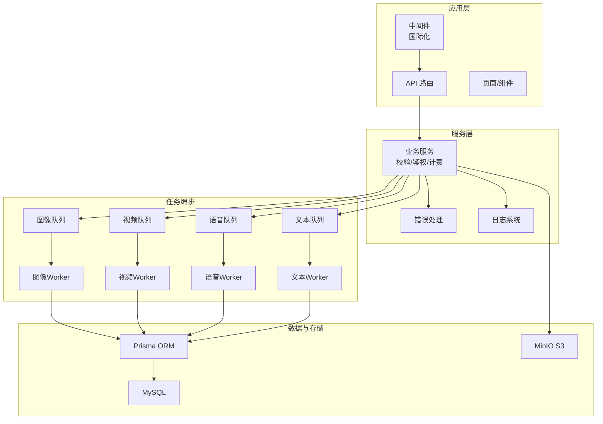
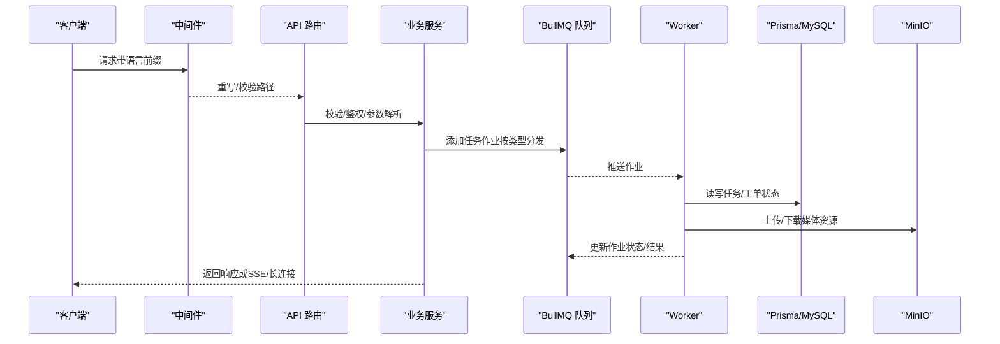
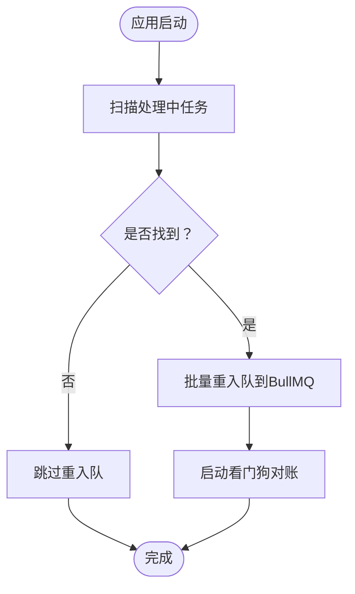
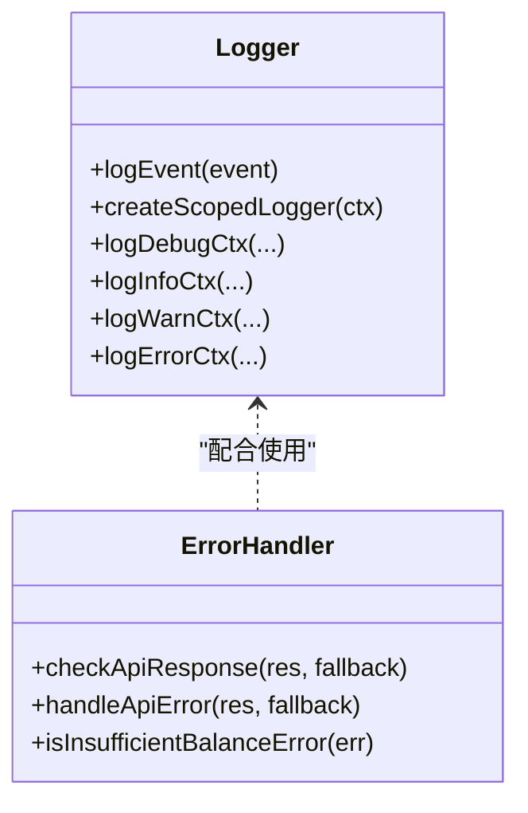
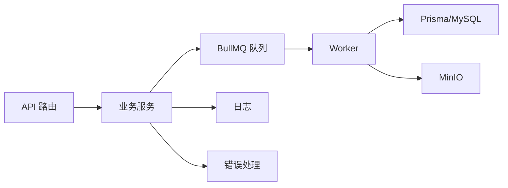

# 后端服务架构

<cite>
**本文引用的文件**
- [package.json](file://package.json)
- [middleware.ts](file://src/middleware.ts)
- [server-boot.ts](file://src/lib/server-boot.ts)
- [instrumentation.ts](file://src/instrumentation.ts)
- [schema.prisma](file://prisma/schema.prisma)
- [core.ts](file://src/lib/logging/core.ts)
- [error-handler.ts](file://src/lib/error-handler.ts)
- [env.ts](file://src/lib/env.ts)
- [queues.ts](file://src/lib/task/queues.ts)
- [workers/index.ts](file://src/lib/workers/index.ts)
- [storage/init.ts](file://src/lib/storage/init.ts)
- [Dockerfile](file://Dockerfile)
</cite>

## 目录
1. [引言](#引言)
2. [项目结构](#项目结构)
3. [核心组件](#核心组件)
4. [架构总览](#架构总览)
5. [详细组件分析](#详细组件分析)
6. [依赖分析](#依赖分析)
7. [性能考量](#性能考量)
8. [故障排查指南](#故障排查指南)
9. [结论](#结论)
10. [附录](#附录)

## 引言
本文件面向Waoowaoo后端服务，系统化梳理服务层设计、中间件体系、业务逻辑实现与任务编排架构，阐述请求处理流程、中间件链与错误处理机制；说明日志系统、监控指标与性能追踪的集成方案；介绍业务模块化组织、依赖注入与测试策略；覆盖安全中间件、CORS处理与请求验证；给出服务发现、负载均衡与故障转移的架构建议；详述数据库、存储与AI服务的集成方式；提供部署配置、环境管理与运维监控的实施方案，并解释扩展性设计与微服务化演进路径。

## 项目结构
Waoowaoo采用Next.js应用与独立Worker进程协同的混合架构：
- 应用层：Next.js App Router API路由与页面渲染
- 中间件层：国际化中间件统一语言前缀与路径策略
- 服务层：API路由处理请求、校验与转发至业务域
- 任务编排层：BullMQ队列 + 多类Worker（图像/视频/语音/文本）
- 数据持久层：Prisma + MySQL
- 存储层：MinIO S3兼容对象存储
- 日志与错误：统一日志与错误处理工具
- 运维：Docker多阶段构建、日志目录、信号优雅关闭

图表来源
- [middleware.ts:1-28](file://src/middleware.ts#L1-L28)
- [queues.ts:1-112](file://src/lib/task/queues.ts#L1-L112)
- [workers/index.ts:1-39](file://src/lib/workers/index.ts#L1-L39)
- [schema.prisma:1-120](file://prisma/schema.prisma#L1-L120)
- [core.ts:1-303](file://src/lib/logging/core.ts#L1-L303)
- [error-handler.ts:1-98](file://src/lib/error-handler.ts#L1-L98)

章节来源
- [package.json:1-186](file://package.json#L1-L186)
- [Dockerfile:1-61](file://Dockerfile#L1-L61)

## 核心组件
- 中间件与国际化：通过国际化中间件强制语言前缀，避免语言漂移，匹配规则覆盖根路径与静态资源。
- 任务队列与Worker：按任务类型分发到图像/视频/语音/文本队列，Worker按队列消费并驱动业务流程。
- 日志系统：统一日志格式、脱敏、项目级落盘与控制台输出，支持审计标记与上下文注入。
- 错误处理：统一错误归一化、HTTP状态映射与用户可读消息，支持幂等与重试策略提示。
- 数据与存储：Prisma管理MySQL；MinIO提供S3兼容对象存储；启动时初始化桶。
- 运行时保障：Instrumentation在应用启动时恢复任务状态、重入队列并启动对账看门狗。

章节来源
- [middleware.ts:1-28](file://src/middleware.ts#L1-L28)
- [queues.ts:1-112](file://src/lib/task/queues.ts#L1-L112)
- [workers/index.ts:1-39](file://src/lib/workers/index.ts#L1-L39)
- [core.ts:1-303](file://src/lib/logging/core.ts#L1-L303)
- [error-handler.ts:1-98](file://src/lib/error-handler.ts#L1-L98)
- [schema.prisma:1-120](file://prisma/schema.prisma#L1-L120)
- [storage/init.ts:1-25](file://src/lib/storage/init.ts#L1-L25)
- [instrumentation.ts:1-214](file://src/instrumentation.ts#L1-L214)

## 架构总览
下图展示从请求进入、中间件处理、API路由、业务服务、任务编排到数据/存储的全链路：

图表来源
- [middleware.ts:1-28](file://src/middleware.ts#L1-L28)
- [queues.ts:1-112](file://src/lib/task/queues.ts#L1-L112)
- [workers/index.ts:1-39](file://src/lib/workers/index.ts#L1-L39)
- [schema.prisma:587-628](file://prisma/schema.prisma#L587-L628)
- [storage/init.ts:1-25](file://src/lib/storage/init.ts#L1-L25)

## 详细组件分析

### 中间件系统
- 功能要点
  - 强制语言前缀，禁用自动语言检测，避免无前缀路径触发语言漂移
  - 显式匹配根路径、带语言前缀路径与非静态资源路径
- 与API路由的关系
  - 中间件先于API路由执行，确保后续路由处理始终带有明确语言上下文
- 安全与一致性
  - 通过固定前缀降低URL歧义，便于缓存与CDN分发

章节来源
- [middleware.ts:1-28](file://src/middleware.ts#L1-L28)

### 任务编排与Worker
- 队列与分发
  - 按任务类型映射到图像/视频/语音/文本队列，设置默认重试与指数退避
  - 特殊任务类型仅允许单次尝试，其余默认最多3次
- Worker生命周期
  - 启动时注册ready/error/failed事件，捕获失败并记录
  - 通过信号优雅关闭，确保未完成作业不被中断
- 任务状态恢复
  - 应用启动时扫描数据库中“处理中”任务，重置为“排队”，并批量重新入队，避免孤儿任务

图表来源
- [instrumentation.ts:1-214](file://src/instrumentation.ts#L1-L214)
- [queues.ts:1-112](file://src/lib/task/queues.ts#L1-L112)
- [workers/index.ts:1-39](file://src/lib/workers/index.ts#L1-L39)

章节来源
- [queues.ts:1-112](file://src/lib/task/queues.ts#L1-L112)
- [workers/index.ts:1-39](file://src/lib/workers/index.ts#L1-L39)
- [instrumentation.ts:1-214](file://src/instrumentation.ts#L1-L214)

### 日志系统与错误处理
- 日志系统
  - 统一日志事件结构，支持审计标记、模块/动作/请求ID/任务ID/项目ID/用户ID等语义上下文
  - 自动脱敏敏感字段，控制台输出并落盘到全局与项目级日志文件
  - 提供调试/信息/警告/错误级别与作用域化日志器
- 错误处理
  - 统一错误归一化，将HTTP状态映射到统一错误码
  - 支持用户可读消息键与重试提示，便于前端展示与重试策略
  - 提供检查响应与抛出错误的工具函数

图表来源
- [core.ts:1-303](file://src/lib/logging/core.ts#L1-L303)
- [error-handler.ts:1-98](file://src/lib/error-handler.ts#L1-L98)

章节来源
- [core.ts:1-303](file://src/lib/logging/core.ts#L1-L303)
- [error-handler.ts:1-98](file://src/lib/error-handler.ts#L1-L98)

### 数据模型与存储集成
- 数据模型
  - 使用Prisma管理MySQL，涵盖用户、项目、任务、图生视频/语音/口型同步、资产中心等核心实体
  - 任务表支持去重键、优先级、外部ID、计费信息、心跳与重试统计
- 存储集成
  - MinIO作为S3兼容对象存储，启动时初始化桶，API侧负责签名/上传/下载
  - 任务Worker读写媒体对象与历史版本，保证可回溯与一致性

章节来源
- [schema.prisma:587-628](file://prisma/schema.prisma#L587-L628)
- [storage/init.ts:1-25](file://src/lib/storage/init.ts#L1-L25)

### API路由与请求处理
- 路由组织
  - Next.js App Router API目录结构清晰，覆盖资产中心、小说推广、任务与运行、用户偏好等
- 处理流程
  - 参数校验与鉴权前置，业务服务封装领域逻辑，必要时异步入队任务
- 安全与CORS
  - 通过中间件与Next.js配置实现跨域策略；鉴权与权限在业务服务层集中处理

章节来源
- [middleware.ts:1-28](file://src/middleware.ts#L1-L28)
- [env.ts:1-38](file://src/lib/env.ts#L1-L38)

### 部署与运维
- Docker多阶段构建
  - 分阶段安装依赖、构建应用、生产镜像，暴露应用与Worker端口，使用tini处理信号
- 启动与初始化
  - 启动脚本同时启动Next、Worker、看门狗与队列面板；存储初始化脚本确保MinIO桶存在
- 运维监控
  - 日志落盘与审计开关；任务看门狗持续对账；错误处理提供统一错误码与用户提示

章节来源
- [Dockerfile:1-61](file://Dockerfile#L1-L61)
- [package.json:1-186](file://package.json#L1-L186)
- [server-boot.ts:1-7](file://src/lib/server-boot.ts#L1-L7)
- [instrumentation.ts:1-214](file://src/instrumentation.ts#L1-L214)

## 依赖分析
- 内部依赖
  - API路由依赖业务服务与任务队列；业务服务依赖Prisma/MySQL与MinIO；Worker依赖Redis队列与外部AI服务
- 外部依赖
  - Next.js、BullMQ、Prisma、MinIO SDK、AWS S3 SDK、OpenAI/Gemini等AI服务SDK
- 耦合与内聚
  - 任务队列与Worker解耦业务服务，提升可扩展性；日志与错误处理作为横切关注点被广泛复用

图表来源
- [queues.ts:1-112](file://src/lib/task/queues.ts#L1-L112)
- [workers/index.ts:1-39](file://src/lib/workers/index.ts#L1-L39)
- [schema.prisma:1-120](file://prisma/schema.prisma#L1-L120)
- [core.ts:1-303](file://src/lib/logging/core.ts#L1-L303)
- [error-handler.ts:1-98](file://src/lib/error-handler.ts#L1-L98)

章节来源
- [package.json:112-186](file://package.json#L112-L186)

## 性能考量
- 队列与并发
  - 不同任务类型分发到独立队列，避免热点阻塞；为高优先级任务预留优先级字段
- 重试与退避
  - 默认指数退避减少抖动；特殊任务单次尝试避免重复消耗
- IO与存储
  - MinIO直传/签名结合，减少应用层IO；媒体对象版本化与历史回溯
- 日志与可观测性
  - 结构化日志与审计开关，便于定位瓶颈与异常；Worker事件与任务状态对账

## 故障排查指南
- 任务丢失/孤儿
  - 应用重启后通过Instrumentation扫描“处理中”任务并重置为“排队”，随后批量重新入队
- Worker失败
  - Worker监听error/failed事件，记录作业ID、任务ID与错误；结合日志定位
- 错误码与用户提示
  - 使用统一错误处理工具，区分余额不足、网络错误与内部错误，前端据此提示与引导重试
- 存储初始化
  - 启动时自动创建/校验MinIO桶，若失败需检查环境变量与网络连通性

章节来源
- [instrumentation.ts:1-214](file://src/instrumentation.ts#L1-L214)
- [workers/index.ts:1-39](file://src/lib/workers/index.ts#L1-L39)
- [error-handler.ts:1-98](file://src/lib/error-handler.ts#L1-L98)
- [storage/init.ts:1-25](file://src/lib/storage/init.ts#L1-L25)

## 结论
Waoowaoo后端以Next.js为核心，结合BullMQ任务编排与独立Worker进程，形成高内聚、低耦合的服务架构。通过统一日志与错误处理、严格的任务恢复与对账机制、以及S3兼容存储与Prisma数据管理，系统具备良好的可维护性与可扩展性。建议在现有基础上完善服务发现与网关、引入限流与熔断、增强A/B测试与灰度发布能力，并逐步探索微服务化演进路径。

## 附录

### 安全中间件与CORS处理
- 中间件：强制语言前缀，禁用自动语言检测，避免路径劫持与语言漂移
- CORS：通过Next.js与中间件策略控制跨域访问，结合鉴权与权限控制
- 请求验证：API路由层进行参数校验与鉴权，业务服务层进行领域规则校验

章节来源
- [middleware.ts:1-28](file://src/middleware.ts#L1-L28)
- [env.ts:1-38](file://src/lib/env.ts#L1-L38)

### 业务逻辑模块化与依赖注入
- 模块化：按功能域拆分（资产中心、小说推广、任务与运行、用户偏好），API路由与业务服务边界清晰
- 依赖注入：通过构造函数/工厂注入Prisma、队列、存储与日志组件，便于测试与替换

章节来源
- [schema.prisma:1-120](file://prisma/schema.prisma#L1-L120)
- [queues.ts:1-112](file://src/lib/task/queues.ts#L1-L112)
- [core.ts:1-303](file://src/lib/logging/core.ts#L1-L303)

### 测试策略
- 单元测试：覆盖AI运行时、API配置、模型网关、任务与工作流等
- 集成测试：覆盖API契约、提供商协议、链路流程与系统级场景
- 行为测试：基于需求矩阵与覆盖率守卫，确保端到端行为一致性
- 运行时保障：通过Instrumentation与看门狗，确保任务一致性与可用性

章节来源
- [package.json:70-98](file://package.json#L70-L98)

### 服务发现、负载均衡与故障转移
- 服务发现：建议在容器编排平台启用服务发现与健康检查
- 负载均衡：应用层与Worker层分别横向扩展，队列与存储作为共享后端
- 故障转移：Worker失败自动重试与日志告警；任务看门狗持续对账，避免数据不一致

章节来源
- [workers/index.ts:1-39](file://src/lib/workers/index.ts#L1-L39)
- [instrumentation.ts:1-214](file://src/instrumentation.ts#L1-L214)

### 与数据库、存储和AI服务的集成
- 数据库：Prisma管理MySQL，提供强类型查询与迁移；任务表支持去重、计费与重试
- 存储：MinIO S3兼容，支持签名直传与版本化；启动时自动初始化桶
- AI服务：通过OpenAI、Google GenAI、Fal等SDK对接，任务Worker负责调用与结果回写

章节来源
- [schema.prisma:587-628](file://prisma/schema.prisma#L587-L628)
- [storage/init.ts:1-25](file://src/lib/storage/init.ts#L1-L25)
- [package.json:112-186](file://package.json#L112-L186)

### 部署配置与环境管理
- Docker：多阶段构建，生产镜像包含应用与Worker源码，暴露端口并使用tini
- 启动脚本：并发启动Next、Worker、看门狗与队列面板；存储初始化脚本确保桶存在
- 环境变量：通过.env与容器编排注入，提供公共与内部基础URL、存储桶名等

章节来源
- [Dockerfile:1-61](file://Dockerfile#L1-L61)
- [package.json:1-186](file://package.json#L1-L186)
- [env.ts:1-38](file://src/lib/env.ts#L1-L38)