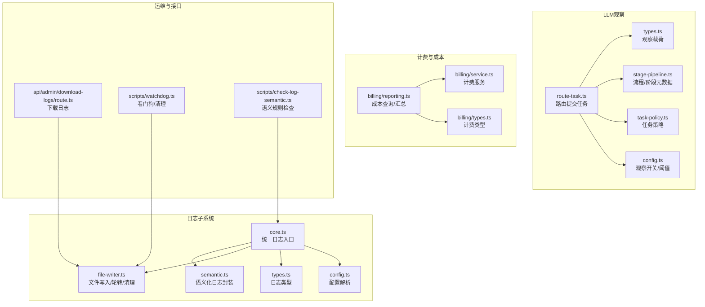
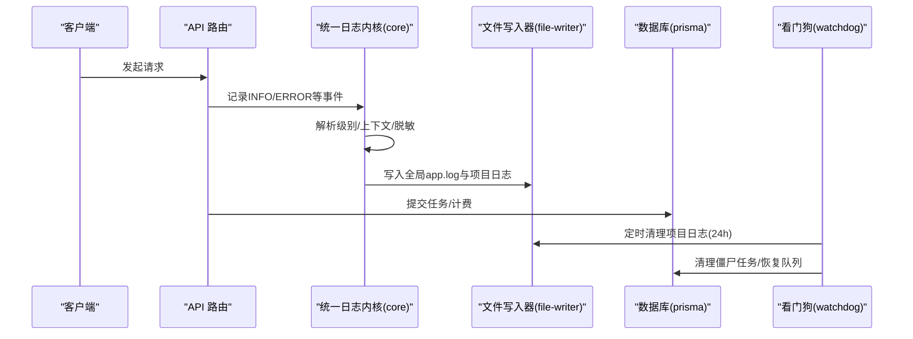
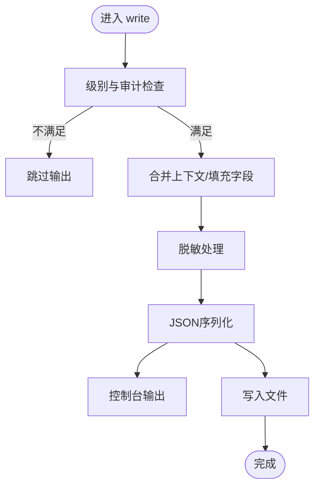
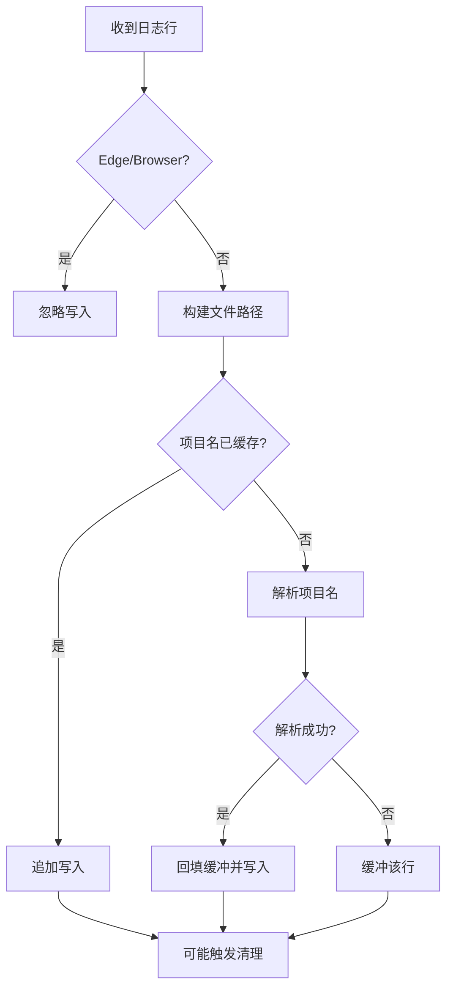
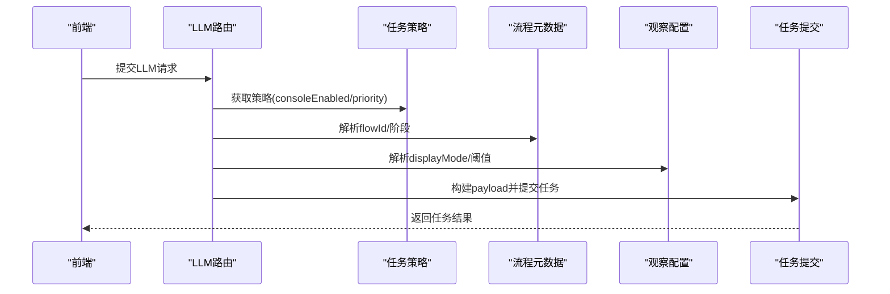
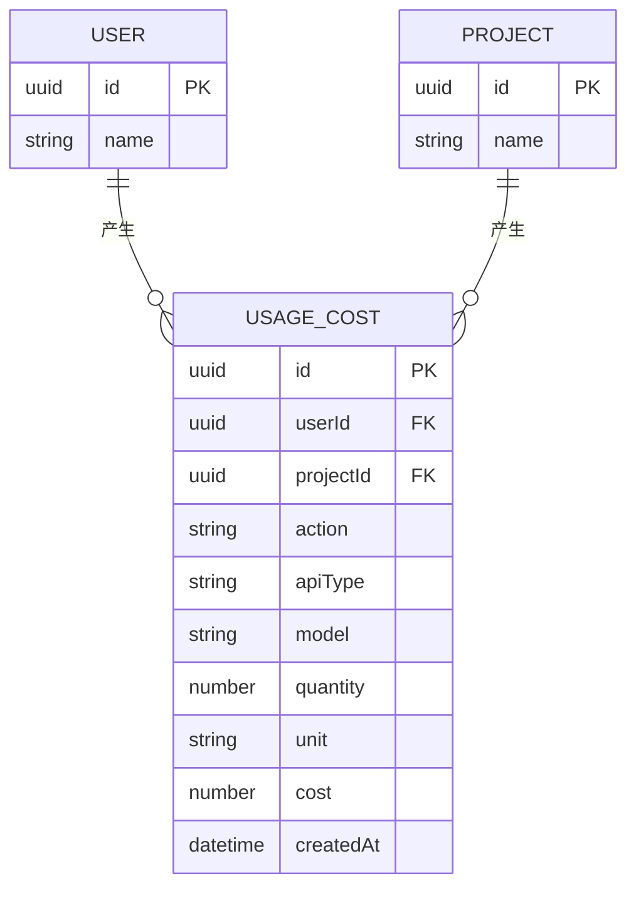
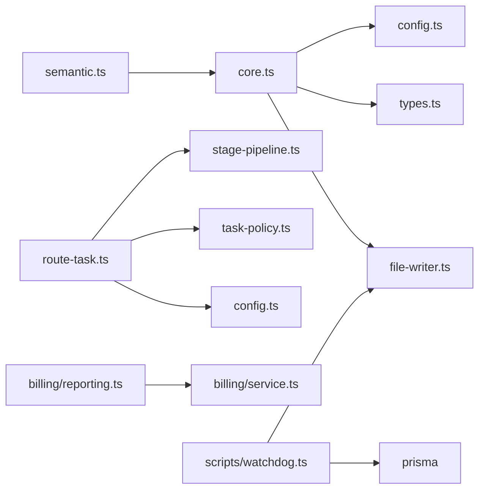

# 日志与监控

<cite>
**本文引用的文件**
- [src/lib/logging/core.ts](file://src/lib/logging/core.ts)
- [src/lib/logging/config.ts](file://src/lib/logging/config.ts)
- [src/lib/logging/types.ts](file://src/lib/logging/types.ts)
- [src/lib/logging/file-writer.ts](file://src/lib/logging/file-writer.ts)
- [src/lib/logging/semantic.ts](file://src/lib/logging/semantic.ts)
- [src/lib/llm-observe/types.ts](file://src/lib/llm-observe/types.ts)
- [src/lib/llm-observe/config.ts](file://src/lib/llm-observe/config.ts)
- [src/lib/llm-observe/route-task.ts](file://src/lib/llm-observe/route-task.ts)
- [src/lib/llm-observe/stage-pipeline.ts](file://src/lib/llm-observe/stage-pipeline.ts)
- [src/lib/llm-observe/task-policy.ts](file://src/lib/llm-observe/task-policy.ts)
- [src/lib/billing/reporting.ts](file://src/lib/billing/reporting.ts)
- [src/lib/billing/service.ts](file://src/lib/billing/service.ts)
- [src/lib/billing/types.ts](file://src/lib/billing/types.ts)
- [src/app/api/admin/download-logs/route.ts](file://src/app/api/admin/download-logs/route.ts)
- [scripts/check-log-semantic.ts](file://scripts/check-log-semantic.ts)
- [scripts/watchdog.ts](file://scripts/watchdog.ts)
- [src/pages/_document.tsx](file://src/pages/_document.tsx)
- [src/middleware.ts](file://src/middleware.ts)
</cite>

## 目录
1. [简介](#简介)
2. [项目结构](#项目结构)
3. [核心组件](#核心组件)
4. [架构总览](#架构总览)
5. [详细组件分析](#详细组件分析)
6. [依赖关系分析](#依赖关系分析)
7. [性能考量](#性能考量)
8. [故障排查指南](#故障排查指南)
9. [结论](#结论)
10. [附录](#附录)

## 简介
本文件面向Waoowaoo的日志与监控体系，系统性阐述日志架构、日志级别与输出格式、结构化日志与字段标准化、日志聚合策略；同时覆盖监控指标定义、KPI与业务指标采集、APM与分布式追踪、性能分析、日志轮转与存储、长期保留、LLM观察与分析（调用统计、延迟分析、成本监控）、故障排查与运维最佳实践。

## 项目结构
围绕日志与监控的关键目录与文件：
- 日志内核与文件落盘：core、config、types、file-writer、semantic
- LLM观察与任务编排：types、config、route-task、stage-pipeline、task-policy
- 计费与成本报告：billing/report、billing/service、billing/types
- 管理端下载接口：api/admin/download-logs
- 运维与规则校验：scripts/watchdog、scripts/check-log-semantic
- 应用入口与中间件：pages/_document.tsx、middleware.ts

图表来源
- [src/lib/logging/core.ts:1-303](file://src/lib/logging/core.ts#L1-L303)
- [src/lib/logging/config.ts:1-42](file://src/lib/logging/config.ts#L1-L42)
- [src/lib/logging/types.ts:1-46](file://src/lib/logging/types.ts#L1-L46)
- [src/lib/logging/file-writer.ts:1-394](file://src/lib/logging/file-writer.ts#L1-L394)
- [src/lib/logging/semantic.ts:1-237](file://src/lib/logging/semantic.ts#L1-L237)
- [src/lib/llm-observe/types.ts:1-35](file://src/lib/llm-observe/types.ts#L1-L35)
- [src/lib/llm-observe/config.ts:1-43](file://src/lib/llm-observe/config.ts#L1-L43)
- [src/lib/llm-observe/route-task.ts:1-157](file://src/lib/llm-observe/route-task.ts#L1-L157)
- [src/lib/llm-observe/stage-pipeline.ts:1-159](file://src/lib/llm-observe/stage-pipeline.ts#L1-L159)
- [src/lib/llm-observe/task-policy.ts:1-75](file://src/lib/llm-observe/task-policy.ts#L1-L75)
- [src/lib/billing/reporting.ts:135-257](file://src/lib/billing/reporting.ts#L135-L257)
- [src/lib/billing/service.ts:48-95](file://src/lib/billing/service.ts#L48-L95)
- [src/lib/billing/types.ts:1-32](file://src/lib/billing/types.ts#L1-L32)
- [src/app/api/admin/download-logs/route.ts](file://src/app/api/admin/download-logs/route.ts)
- [scripts/watchdog.ts:1-226](file://scripts/watchdog.ts#L1-L226)
- [scripts/check-log-semantic.ts:1-54](file://scripts/check-log-semantic.ts#L1-L54)

章节来源
- [src/lib/logging/core.ts:1-303](file://src/lib/logging/core.ts#L1-L303)
- [src/lib/logging/config.ts:1-42](file://src/lib/logging/config.ts#L1-L42)
- [src/lib/logging/types.ts:1-46](file://src/lib/logging/types.ts#L1-L46)
- [src/lib/logging/file-writer.ts:1-394](file://src/lib/logging/file-writer.ts#L1-L394)
- [src/lib/logging/semantic.ts:1-237](file://src/lib/logging/semantic.ts#L1-L237)
- [src/lib/llm-observe/types.ts:1-35](file://src/lib/llm-observe/types.ts#L1-L35)
- [src/lib/llm-observe/config.ts:1-43](file://src/lib/llm-observe/config.ts#L1-L43)
- [src/lib/llm-observe/route-task.ts:1-157](file://src/lib/llm-observe/route-task.ts#L1-L157)
- [src/lib/llm-observe/stage-pipeline.ts:1-159](file://src/lib/llm-observe/stage-pipeline.ts#L1-L159)
- [src/lib/llm-observe/task-policy.ts:1-75](file://src/lib/llm-observe/task-policy.ts#L1-L75)
- [src/lib/billing/reporting.ts:135-257](file://src/lib/billing/reporting.ts#L135-L257)
- [src/lib/billing/service.ts:48-95](file://src/lib/billing/service.ts#L48-L95)
- [src/lib/billing/types.ts:1-32](file://src/lib/billing/types.ts#L1-L32)
- [src/app/api/admin/download-logs/route.ts](file://src/app/api/admin/download-logs/route.ts)
- [scripts/watchdog.ts:1-226](file://scripts/watchdog.ts#L1-L226)
- [scripts/check-log-semantic.ts:1-54](file://scripts/check-log-semantic.ts#L1-L54)

## 核心组件
- 统一日志内核：负责级别过滤、上下文合并、敏感信息脱敏、JSON序列化、控制台输出与文件落盘。
- 配置中心：解析环境变量，决定启用状态、级别阈值、调试开关、审计开关、输出格式与服务名、脱敏键集合。
- 类型系统：定义日志事件结构、错误字段、上下文与语义上下文。
- 文件写入器：按项目拆分日志文件，支持全局app.log轮转、项目日志清理与下载接口。
- 语义化日志：提供模块化、审计级日志封装，便于统一规范。
- LLM观察：定义观察载荷、策略、路由提交、流程元数据与显示模式。
- 计费与成本：提供成本汇总、明细查询、计费服务与类型定义。
- 运维脚本：看门狗定时清理、日志语义规则检查。

章节来源
- [src/lib/logging/core.ts:1-303](file://src/lib/logging/core.ts#L1-L303)
- [src/lib/logging/config.ts:1-42](file://src/lib/logging/config.ts#L1-L42)
- [src/lib/logging/types.ts:1-46](file://src/lib/logging/types.ts#L1-L46)
- [src/lib/logging/file-writer.ts:1-394](file://src/lib/logging/file-writer.ts#L1-L394)
- [src/lib/logging/semantic.ts:1-237](file://src/lib/logging/semantic.ts#L1-L237)
- [src/lib/llm-observe/types.ts:1-35](file://src/lib/llm-observe/types.ts#L1-L35)
- [src/lib/llm-observe/config.ts:1-43](file://src/lib/llm-observe/config.ts#L1-L43)
- [src/lib/llm-observe/route-task.ts:1-157](file://src/lib/llm-observe/route-task.ts#L1-L157)
- [src/lib/llm-observe/stage-pipeline.ts:1-159](file://src/lib/llm-observe/stage-pipeline.ts#L1-L159)
- [src/lib/llm-observe/task-policy.ts:1-75](file://src/lib/llm-observe/task-policy.ts#L1-L75)
- [src/lib/billing/reporting.ts:135-257](file://src/lib/billing/reporting.ts#L135-L257)
- [src/lib/billing/service.ts:48-95](file://src/lib/billing/service.ts#L48-L95)
- [src/lib/billing/types.ts:1-32](file://src/lib/billing/types.ts#L1-L32)
- [scripts/watchdog.ts:1-226](file://scripts/watchdog.ts#L1-L226)
- [scripts/check-log-semantic.ts:1-54](file://scripts/check-log-semantic.ts#L1-L54)

## 架构总览
日志与监控整体由“统一日志内核 + 文件落盘 + 语义化封装 + LLM观察 + 计费成本 + 运维脚本”构成，形成从请求到落盘、从任务到成本、从观察到清理的闭环。

图表来源
- [src/lib/logging/core.ts:97-132](file://src/lib/logging/core.ts#L97-L132)
- [src/lib/logging/file-writer.ts:281-307](file://src/lib/logging/file-writer.ts#L281-L307)
- [scripts/watchdog.ts:187-212](file://scripts/watchdog.ts#L187-L212)

## 详细组件分析

### 统一日志内核（core）
- 功能要点
  - 级别过滤：根据配置与DEBUG开关决定是否输出。
  - 上下文合并：自动注入模块、动作、请求ID、任务ID、项目ID、用户ID、提供商等。
  - 错误序列化：将Error对象或对象化错误转换为标准字段。
  - 脱敏处理：基于配置键集合对事件进行脱敏。
  - 控制台输出：ERROR级别输出至stderr，其余输出至stdout。
  - 文件落盘：同时写入全局app.log与项目日志文件。
- 关键路径
  - 写入流程：write -> 序列化事件 -> 脱敏 -> 控制台输出 -> 写文件。
  - 作用域日志：createScopedLogger + logScoped 支持模块化与继承上下文。
- 性能与可靠性
  - 异步落盘，失败不阻塞主流程。
  - 对浏览器/Edge运行时做安全保护，避免静态分析器误判。

图表来源
- [src/lib/logging/core.ts:97-132](file://src/lib/logging/core.ts#L97-L132)

章节来源
- [src/lib/logging/core.ts:1-303](file://src/lib/logging/core.ts#L1-L303)

### 配置中心（config）
- 环境变量解析
  - LOG_UNIFIED_ENABLED：是否启用统一日志。
  - LOG_LEVEL：日志级别阈值（DEBUG/INFO/WARN/ERROR）。
  - LOG_DEBUG_ENABLED：是否允许DEBUG级别输出。
  - LOG_AUDIT_ENABLED：是否允许审计事件输出。
  - LOG_FORMAT：输出格式（当前仅支持json）。
  - LOG_SERVICE：服务名。
  - LOG_REDACT_KEYS：脱敏键列表（逗号分隔）。
- 判定逻辑
  - shouldLogLevel：综合enabled、debugEnabled与级别权重决定是否输出。

章节来源
- [src/lib/logging/config.ts:1-42](file://src/lib/logging/config.ts#L1-L42)

### 类型系统（types）
- 日志事件结构：包含时间戳、级别、服务名、模块、动作、消息、请求/任务/项目/用户ID、错误码、可重试标记、耗时、提供商、详情与错误字段。
- 错误字段：name/message/stack/code/retryable。
- 上下文与语义上下文：扩展了错误码、可重试、耗时等语义字段。

章节来源
- [src/lib/logging/types.ts:1-46](file://src/lib/logging/types.ts#L1-L46)

### 文件写入器（file-writer）
- 文件命名与前缀
  - admin_{projectName}.log：API/用户操作。
  - Internal_{projectName}.log：worker/内部操作。
- 轮转与清理
  - 全局app.log：超过10MB时保留后半部分（滚动截断）。
  - 项目日志：超过2MB时清理24小时前内容（按ts字段过滤）。
- 下载接口
  - 列出日志文件清单与拼接全部日志内容。
- 缓冲与回填
  - 项目名未解析时缓冲事件，解析后批量回填。

图表来源
- [src/lib/logging/file-writer.ts:226-271](file://src/lib/logging/file-writer.ts#L226-L271)
- [src/lib/logging/file-writer.ts:281-307](file://src/lib/logging/file-writer.ts#L281-L307)
- [src/lib/logging/file-writer.ts:173-185](file://src/lib/logging/file-writer.ts#L173-L185)

章节来源
- [src/lib/logging/file-writer.ts:1-394](file://src/lib/logging/file-writer.ts#L1-L394)

### 语义化日志（semantic）
- 模块化封装：以模块为维度创建作用域日志器。
- 审计事件：提供logUserAction、logAIAnalysis、logProjectAction、logAuthAction等高阶封装，自动打上audit标志。
- 项目注册：在审计事件中注册项目名，以便后续落盘。

章节来源
- [src/lib/logging/semantic.ts:1-237](file://src/lib/logging/semantic.ts#L1-L237)

### LLM观察与任务编排
- 观察载荷（types）
  - 定义displayMode、message、stage、flow元数据、stream块、meta等。
- 观察配置（config）
  - 开关、默认展示模式、长任务阈值、推理可见性、内部任务令牌与基础URL。
- 路由提交（route-task）
  - 解析displayMode、flow元数据、优先级、语言、模型配置、计费信息，提交任务。
  - 只有开启观察且非同步任务才会走此流程。
- 流程与阶段（stage-pipeline）
  - 将任务类型映射到流程与阶段，提供flowId、stage索引与标题。
- 任务策略（task-policy）
  - 不同任务类型对应不同的consoleEnabled、展示模式、优先级、是否捕获reasoning。

图表来源
- [src/lib/llm-observe/route-task.ts:58-156](file://src/lib/llm-observe/route-task.ts#L58-L156)
- [src/lib/llm-observe/task-policy.ts:71-75](file://src/lib/llm-observe/task-policy.ts#L71-L75)
- [src/lib/llm-observe/stage-pipeline.ts:138-158](file://src/lib/llm-observe/stage-pipeline.ts#L138-L158)
- [src/lib/llm-observe/config.ts:22-43](file://src/lib/llm-observe/config.ts#L22-L43)

章节来源
- [src/lib/llm-observe/types.ts:1-35](file://src/lib/llm-observe/types.ts#L1-L35)
- [src/lib/llm-observe/config.ts:1-43](file://src/lib/llm-observe/config.ts#L1-L43)
- [src/lib/llm-observe/route-task.ts:1-157](file://src/lib/llm-observe/route-task.ts#L1-L157)
- [src/lib/llm-observe/stage-pipeline.ts:1-159](file://src/lib/llm-observe/stage-pipeline.ts#L1-L159)
- [src/lib/llm-observe/task-policy.ts:1-75](file://src/lib/llm-observe/task-policy.ts#L1-L75)

### 计费与成本（billing）
- 成本查询
  - 按项目/用户聚合统计、分组统计、最近记录查询。
- 计费服务
  - 金额归一化、最大成本/报价成本取值、实际用量提取。
- 类型定义
  - BillingMode、BillingStatus、BillingRecordParams、BillingQuote等。

图表来源
- [src/lib/billing/reporting.ts:135-257](file://src/lib/billing/reporting.ts#L135-L257)
- [src/lib/billing/service.ts:48-95](file://src/lib/billing/service.ts#L48-L95)
- [src/lib/billing/types.ts:1-32](file://src/lib/billing/types.ts#L1-L32)

章节来源
- [src/lib/billing/reporting.ts:135-257](file://src/lib/billing/reporting.ts#L135-L257)
- [src/lib/billing/service.ts:48-95](file://src/lib/billing/service.ts#L48-L95)
- [src/lib/billing/types.ts:1-32](file://src/lib/billing/types.ts#L1-L32)

### 运维与接口
- 看门狗（watchdog）
  - 定时恢复队列任务、清理僵尸任务、周期性清理项目日志（24h）。
- 日志下载接口
  - 列出日志文件与拼接全部日志，供管理员下载。
- 语义规则检查
  - 校验关键模块是否使用约定的动作/字段，确保日志一致性。

章节来源
- [scripts/watchdog.ts:1-226](file://scripts/watchdog.ts#L1-L226)
- [src/app/api/admin/download-logs/route.ts](file://src/app/api/admin/download-logs/route.ts)
- [scripts/check-log-semantic.ts:1-54](file://scripts/check-log-semantic.ts#L1-L54)

## 依赖关系分析
- 日志内核依赖配置与上下文，输出到文件写入器；语义化日志依赖统一内核。
- LLM观察依赖任务策略、流程元数据与配置；路由层负责参数解析与提交。
- 计费模块依赖数据库与任务类型，提供成本查询与汇总。
- 看门狗依赖prisma与文件写入器，保障任务健康与日志清理。

图表来源
- [src/lib/logging/core.ts:1-303](file://src/lib/logging/core.ts#L1-L303)
- [src/lib/logging/config.ts:1-42](file://src/lib/logging/config.ts#L1-L42)
- [src/lib/logging/types.ts:1-46](file://src/lib/logging/types.ts#L1-L46)
- [src/lib/logging/file-writer.ts:1-394](file://src/lib/logging/file-writer.ts#L1-L394)
- [src/lib/logging/semantic.ts:1-237](file://src/lib/logging/semantic.ts#L1-L237)
- [src/lib/llm-observe/route-task.ts:1-157](file://src/lib/llm-observe/route-task.ts#L1-L157)
- [src/lib/llm-observe/stage-pipeline.ts:1-159](file://src/lib/llm-observe/stage-pipeline.ts#L1-L159)
- [src/lib/llm-observe/task-policy.ts:1-75](file://src/lib/llm-observe/task-policy.ts#L1-L75)
- [src/lib/llm-observe/config.ts:1-43](file://src/lib/llm-observe/config.ts#L1-L43)
- [src/lib/billing/reporting.ts:135-257](file://src/lib/billing/reporting.ts#L135-L257)
- [src/lib/billing/service.ts:48-95](file://src/lib/billing/service.ts#L48-L95)
- [scripts/watchdog.ts:1-226](file://scripts/watchdog.ts#L1-L226)

## 性能考量
- 写入路径
  - 统一日志内核采用异步落盘，避免阻塞请求；ERROR级别单独输出至stderr，便于外部收集。
- 轮转与清理
  - 全局app.log滚动截断，项目日志按大小清理旧内容，减少磁盘占用。
- 级别与审计
  - 通过LOG_LEVEL与LOG_DEBUG_ENABLED控制输出规模；审计事件受LOG_AUDIT_ENABLED控制。
- LLM观察
  - 长流程任务提升优先级与展示模式，有助于前端及时反馈；合理设置阈值避免过度渲染。

[本节为通用指导，无需特定文件来源]

## 故障排查指南
- 日志无法下载
  - 检查管理端下载接口是否可用，确认logs目录存在且可读。
  - 参考：[src/app/api/admin/download-logs/route.ts](file://src/app/api/admin/download-logs/route.ts)
- 日志缺失或被抑制
  - 检查LOG_LEVEL与LOG_DEBUG_ENABLED；确认动作不在抑制列表中。
  - 参考：[src/lib/logging/core.ts:10-15](file://src/lib/logging/core.ts#L10-L15)
- 项目日志未生成
  - 确认项目名已注册；若项目名未解析，事件会被缓冲，待解析后回填。
  - 参考：[src/lib/logging/file-writer.ts:268-271](file://src/lib/logging/file-writer.ts#L268-L271)
- 任务长时间无响应
  - 查看看门狗日志，确认是否清理僵尸任务或重新入队。
  - 参考：[scripts/watchdog.ts:128-185](file://scripts/watchdog.ts#L128-L185)
- LLM观察未生效
  - 检查LLM_OBSERVE_ENABLED与任务策略consoleEnabled；确认非同步任务才会走观察流程。
  - 参考：[src/lib/llm-observe/route-task.ts:71-76](file://src/lib/llm-observe/route-task.ts#L71-L76)

章节来源
- [src/app/api/admin/download-logs/route.ts](file://src/app/api/admin/download-logs/route.ts)
- [src/lib/logging/core.ts:10-15](file://src/lib/logging/core.ts#L10-L15)
- [src/lib/logging/file-writer.ts:268-271](file://src/lib/logging/file-writer.ts#L268-L271)
- [scripts/watchdog.ts:128-185](file://scripts/watchdog.ts#L128-L185)
- [src/lib/llm-observe/route-task.ts:71-76](file://src/lib/llm-observe/route-task.ts#L71-L76)

## 结论
Waoowaoo的日志与监控体系以统一内核为核心，结合严格的字段标准化、项目化落盘与定期清理，实现了可观测性与可维护性的平衡。LLM观察与任务策略进一步提升了长流程任务的透明度与用户体验。配合计费成本模块与看门狗运维脚本，形成了从请求到落盘、从任务到成本、从观察到清理的完整闭环。

[本节为总结，无需特定文件来源]

## 附录

### 日志级别与输出格式规范
- 级别：DEBUG、INFO、WARN、ERROR
- 输出格式：JSON（当前仅支持json）
- 时间：北京时间字符串（UTC+8）
- 必备字段：ts、level、service、module、action、message
- 可选字段：requestId、taskId、projectId、userId、errorCode、retryable、durationMs、provider、details、error

章节来源
- [src/lib/logging/types.ts:27-45](file://src/lib/logging/types.ts#L27-L45)
- [src/lib/logging/core.ts:88-95](file://src/lib/logging/core.ts#L88-L95)

### 结构化日志与字段标准化
- 统一事件结构：LogEvent
- 错误字段：ErrorFields
- 上下文：LogContext/ SemanticContext
- 语义化封装：logUserAction/logAIAnalysis/logProjectAction/logAuthAction

章节来源
- [src/lib/logging/types.ts:1-46](file://src/lib/logging/types.ts#L1-L46)
- [src/lib/logging/semantic.ts:39-237](file://src/lib/logging/semantic.ts#L39-L237)

### 日志聚合策略
- 全局聚合：app.log
- 项目聚合：admin_{project}.log / Internal_{project}.log
- 下载聚合：管理端接口拼接全部日志

章节来源
- [src/lib/logging/file-writer.ts:281-307](file://src/lib/logging/file-writer.ts#L281-L307)
- [src/app/api/admin/download-logs/route.ts](file://src/app/api/admin/download-logs/route.ts)

### 监控指标与KPI
- KPI建议
  - 请求成功率、错误率、P95/P99延迟
  - 任务排队时延、处理时延、失败重试率
  - LLM调用次数、平均耗时、推理可见性命中率
  - 项目/用户成本、成本分布、Top资源消耗
- 采集方法
  - 日志字段：level、durationMs、errorCode、provider、details
  - 计费字段：apiType、model、quantity、unit、cost
  - LLM观察字段：flowId、flowStageIndex、progress、streamRunId

章节来源
- [src/lib/logging/types.ts:27-45](file://src/lib/logging/types.ts#L27-L45)
- [src/lib/billing/reporting.ts:135-257](file://src/lib/billing/reporting.ts#L135-L257)
- [src/lib/llm-observe/types.ts:19-34](file://src/lib/llm-observe/types.ts#L19-L34)

### APM与分布式追踪
- 追踪建议
  - 使用requestId贯穿请求链路，结合日志与任务事件进行关联。
  - 在API层注入requestId，在任务层透传至观察载荷meta。
- 实现参考
  - 日志上下文自动合并requestId；任务meta包含route/locale/flow元数据。

章节来源
- [src/lib/logging/core.ts:102-121](file://src/lib/logging/core.ts#L102-L121)
- [src/lib/llm-observe/route-task.ts:139-148](file://src/lib/llm-observe/route-task.ts#L139-L148)

### 性能分析与优化
- 日志写入
  - 异步落盘、滚动截断、按大小清理，降低IO压力。
- LLM观察
  - 合理设置displayMode与阈值，避免高频流式事件造成前端压力。
- 计费
  - 使用分组统计与最近记录，快速定位异常成本项。

章节来源
- [src/lib/logging/file-writer.ts:145-185](file://src/lib/logging/file-writer.ts#L145-L185)
- [src/lib/llm-observe/config.ts:30-37](file://src/lib/llm-observe/config.ts#L30-L37)
- [src/lib/billing/reporting.ts:151-197](file://src/lib/billing/reporting.ts#L151-L197)

### 日志轮转、存储与长期保留
- 全局app.log：超过10MB滚动截断
- 项目日志：超过2MB清理24小时前内容
- 长期保留：项目日志按24h窗口清理，全局日志按滚动截断

章节来源
- [src/lib/logging/file-writer.ts:145-185](file://src/lib/logging/file-writer.ts#L145-L185)
- [src/lib/logging/file-writer.ts:275-307](file://src/lib/logging/file-writer.ts#L275-L307)
- [scripts/watchdog.ts:193-196](file://scripts/watchdog.ts#L193-L196)

### LLM观察与分析（调用统计、延迟分析、成本监控）
- 调用统计
  - 通过任务类型与flow元数据统计各阶段调用次数。
- 延迟分析
  - 使用durationMs与progress字段评估阶段耗时。
- 成本监控
  - 结合计费模块按项目/用户/动作/API类型统计成本。

章节来源
- [src/lib/llm-observe/stage-pipeline.ts:138-158](file://src/lib/llm-observe/stage-pipeline.ts#L138-L158)
- [src/lib/billing/reporting.ts:135-257](file://src/lib/billing/reporting.ts#L135-L257)

### 故障排查工具与运维最佳实践
- 工具
  - 看门狗：恢复队列、清理僵尸任务、周期清理日志
  - 语义规则检查：确保关键模块遵循统一动作/字段
- 最佳实践
  - 明确日志级别与审计开关，避免生产环境噪声
  - 为长流程任务配置合适的观察策略与阈值
  - 定期审查日志文件大小与保留策略，确保磁盘空间可控

章节来源
- [scripts/watchdog.ts:1-226](file://scripts/watchdog.ts#L1-L226)
- [scripts/check-log-semantic.ts:1-54](file://scripts/check-log-semantic.ts#L1-L54)