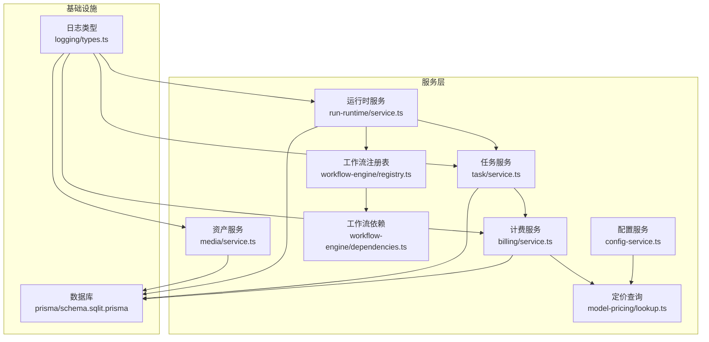
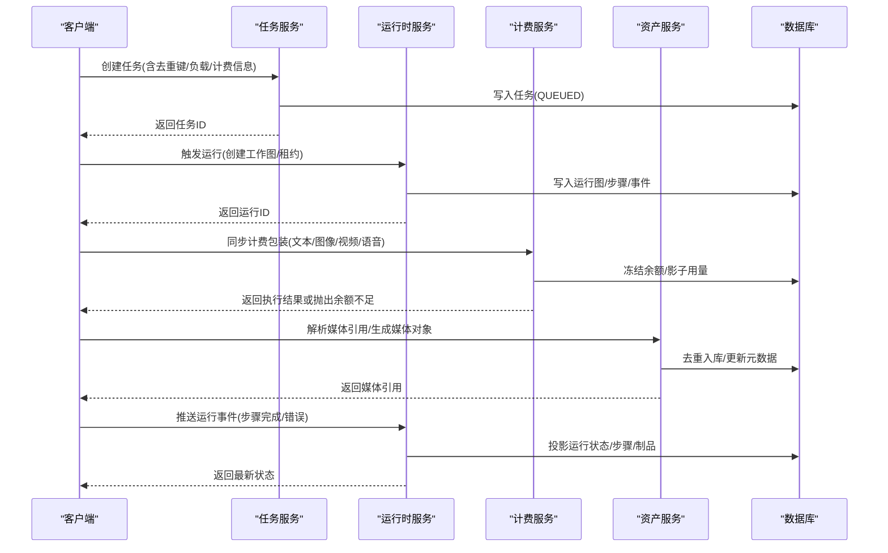
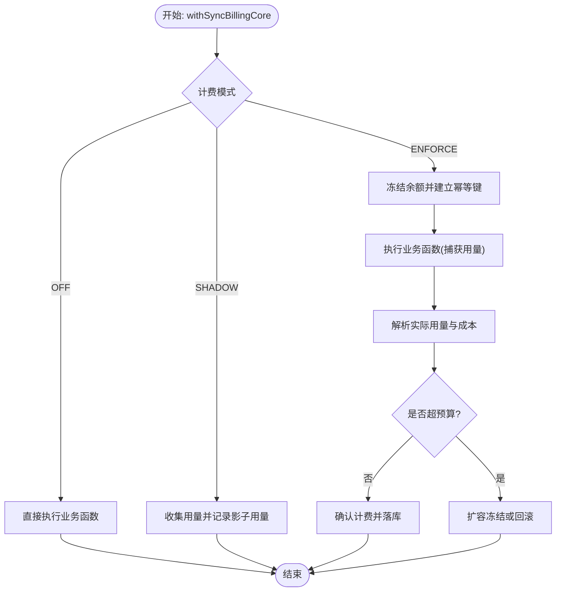
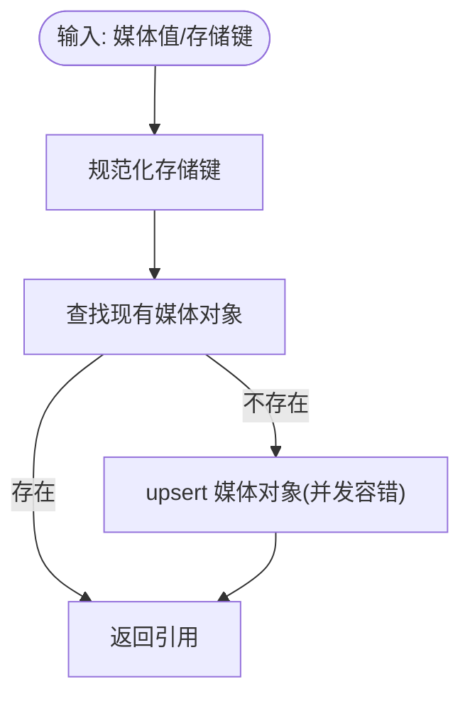
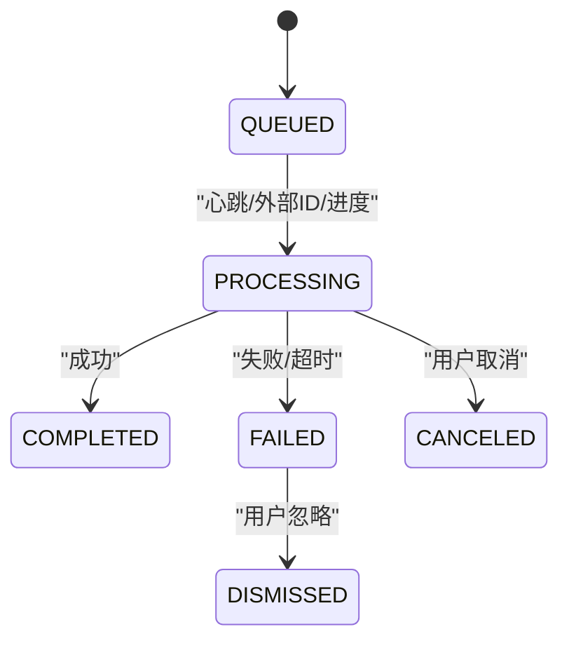
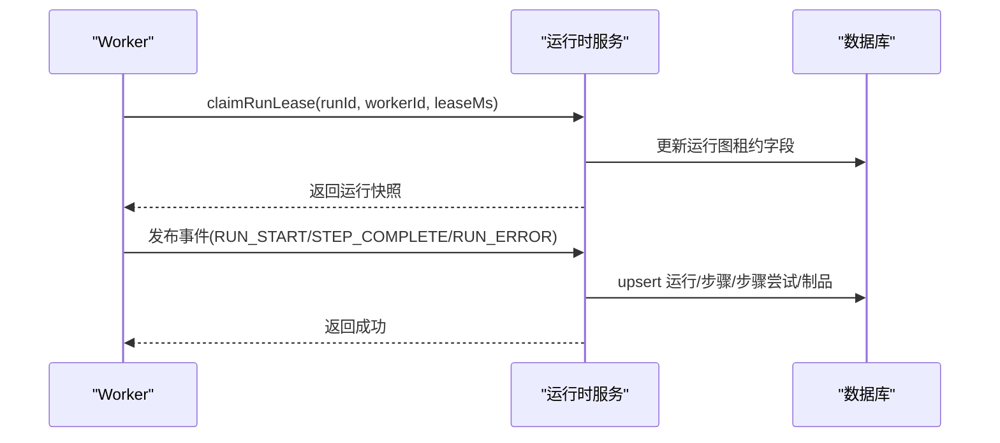
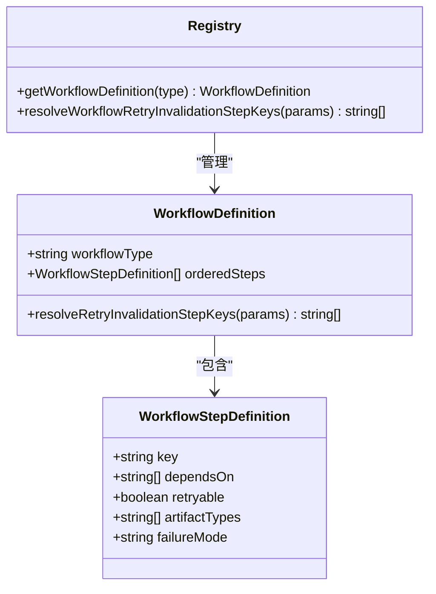
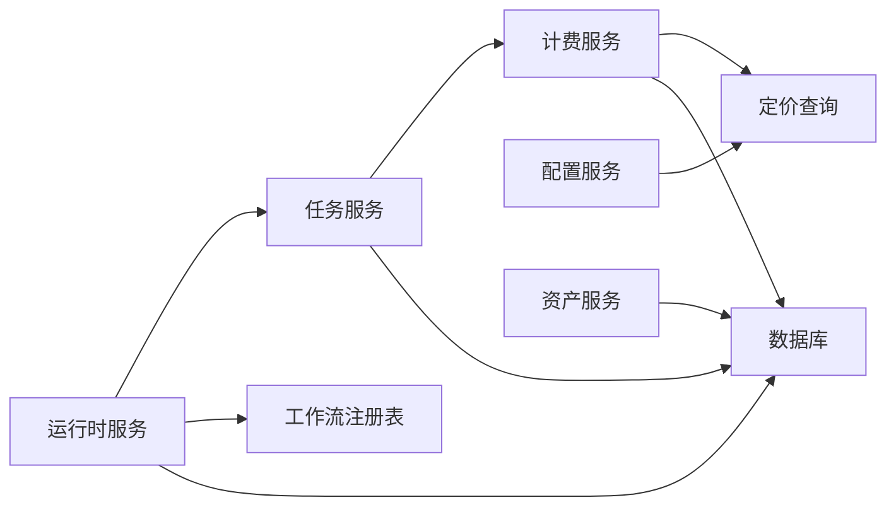

# 服务层设计

<cite>
**本文引用的文件**
- [src/lib/billing/service.ts](file://src/lib/billing/service.ts)
- [src/lib/media/service.ts](file://src/lib/media/service.ts)
- [src/lib/run-runtime/service.ts](file://src/lib/run-runtime/service.ts)
- [src/lib/task/service.ts](file://src/lib/task/service.ts)
- [src/lib/workflow-engine/registry.ts](file://src/lib/workflow-engine/registry.ts)
- [src/lib/workflow-engine/dependencies.ts](file://src/lib/workflow-engine/dependencies.ts)
- [src/lib/config-service.ts](file://src/lib/config-service.ts)
- [src/lib/model-pricing/lookup.ts](file://src/lib/model-pricing/lookup.ts)
- [src/lib/logging/types.ts](file://src/lib/logging/types.ts)
- [prisma/schema.sqlit.prisma](file://prisma/schema.sqlit.prisma)
- [src/lib/workflow-concurrency.ts](file://src/lib/workflow-concurrency.ts)
- [src/lib/prisma-retry.ts](file://src/lib/prisma-retry.ts)
- [src/lib/media/hash.ts](file://src/lib/media/hash.ts)
- [src/lib/media/types.ts](file://src/lib/media/types.ts)
- [src/lib/run-runtime/types.ts](file://src/lib/run-runtime/types.ts)
- [src/lib/task/types.ts](file://src/lib/task/types.ts)
- [src/lib/billing/types.ts](file://src/lib/billing/types.ts)
- [src/lib/billing/cost.ts](file://src/lib/billing/cost.ts)
- [src/lib/billing/ledger.ts](file://src/lib/billing/ledger.ts)
- [src/lib/billing/mode.ts](file://src/lib/billing/mode.ts)
- [src/lib/billing/errors.ts](file://src/lib/billing/errors.ts)
- [src/lib/billing/money.ts](file://src/lib/billing/money.ts)
- [src/lib/billing/runtime-usage.ts](file://src/lib/billing/runtime-usage.ts)
- [src/lib/billing/service.ts](file://src/lib/billing/service.ts)
- [src/lib/media/service.ts](file://src/lib/media/service.ts)
- [src/lib/run-runtime/service.ts](file://src/lib/run-runtime/service.ts)
- [src/lib/task/service.ts](file://src/lib/task/service.ts)
- [src/lib/workflow-engine/registry.ts](file://src/lib/workflow-engine/registry.ts)
- [src/lib/workflow-engine/dependencies.ts](file://src/lib/workflow-engine/dependencies.ts)
- [src/lib/config-service.ts](file://src/lib/config-service.ts)
- [src/lib/model-pricing/lookup.ts](file://src/lib/model-pricing/lookup.ts)
- [src/lib/logging/types.ts](file://src/lib/logging/types.ts)
- [prisma/schema.sqlit.prisma](file://prisma/schema.sqlit.prisma)
- [src/lib/workflow-concurrency.ts](file://src/lib/workflow-concurrency.ts)
- [src/lib/prisma-retry.ts](file://src/lib/prisma-retry.ts)
- [src/lib/media/hash.ts](file://src/lib/media/hash.ts)
- [src/lib/media/types.ts](file://src/lib/media/types.ts)
- [src/lib/run-runtime/types.ts](file://src/lib/run-runtime/types.ts)
- [src/lib/task/types.ts](file://src/lib/task/types.ts)
- [src/lib/billing/types.ts](file://src/lib/billing/types.ts)
- [src/lib/billing/cost.ts](file://src/lib/billing/cost.ts)
- [src/lib/billing/ledger.ts](file://src/lib/billing/ledger.ts)
- [src/lib/billing/mode.ts](file://src/lib/billing/mode.ts)
- [src/lib/billing/errors.ts](file://src/lib/billing/errors.ts)
- [src/lib/billing/money.ts](file://src/lib/billing/money.ts)
- [src/lib/billing/runtime-usage.ts](file://src/lib/billing/runtime-usage.ts)
</cite>

## 目录
1. [引言](#引言)
2. [项目结构](#项目结构)
3. [核心组件](#核心组件)
4. [架构总览](#架构总览)
5. [详细组件分析](#详细组件分析)
6. [依赖分析](#依赖分析)
7. [性能考虑](#性能考虑)
8. [故障排查指南](#故障排查指南)
9. [结论](#结论)
10. [附录](#附录)

## 引言
本文件面向 Waoowaoo 的服务层设计，系统化梳理小说推广服务、项目管理服务、资产管理服务与工作流引擎在服务层的模块化组织、接口契约、数据流转与业务规则封装。文档同时覆盖服务间依赖关系、生命周期管理、事务与并发控制、可测试性与扩展点，并提供序列图与类图帮助理解。

## 项目结构
服务层位于 src/lib 下，围绕“任务-运行时-计费-资产-工作流”五大域构建，采用按功能域分层的模块化组织：
- 计费域：src/lib/billing/* 提供统一计费、冻结/解冻、账单记录与错误处理
- 资产域：src/lib/media/* 提供媒体对象归一化、存储键解析与引用映射
- 任务域：src/lib/task/* 提供任务生命周期、去重、心跳、回滚补偿
- 运行时域：src/lib/run-runtime/* 提供运行图事件投影、步骤与制品管理
- 工作流域：src/lib/workflow-engine/* 提供工作流定义、步骤依赖与重试失效范围计算
- 配置与定价：src/lib/config-service.ts、src/lib/model-pricing/* 提供模型键解析、定价查询与并发配置
- 日志与类型：src/lib/logging/types.ts、各域 types.ts 定义接口契约

图表来源
- [src/lib/billing/service.ts](file://src/lib/billing/service.ts)
- [src/lib/task/service.ts](file://src/lib/task/service.ts)
- [src/lib/run-runtime/service.ts](file://src/lib/run-runtime/service.ts)
- [src/lib/media/service.ts](file://src/lib/media/service.ts)
- [src/lib/workflow-engine/registry.ts](file://src/lib/workflow-engine/registry.ts)
- [src/lib/workflow-engine/dependencies.ts](file://src/lib/workflow-engine/dependencies.ts)
- [src/lib/config-service.ts](file://src/lib/config-service.ts)
- [src/lib/model-pricing/lookup.ts](file://src/lib/model-pricing/lookup.ts)
- [src/lib/logging/types.ts](file://src/lib/logging/types.ts)
- [prisma/schema.sqlit.prisma](file://prisma/schema.sqlit.prisma)

章节来源
- [src/lib/billing/service.ts](file://src/lib/billing/service.ts)
- [src/lib/media/service.ts](file://src/lib/media/service.ts)
- [src/lib/run-runtime/service.ts](file://src/lib/run-runtime/service.ts)
- [src/lib/task/service.ts](file://src/lib/task/service.ts)
- [src/lib/workflow-engine/registry.ts](file://src/lib/workflow-engine/registry.ts)
- [src/lib/workflow-engine/dependencies.ts](file://src/lib/workflow-engine/dependencies.ts)
- [src/lib/config-service.ts](file://src/lib/config-service.ts)
- [src/lib/model-pricing/lookup.ts](file://src/lib/model-pricing/lookup.ts)
- [src/lib/logging/types.ts](file://src/lib/logging/types.ts)
- [prisma/schema.sqlit.prisma](file://prisma/schema.sqlit.prisma)

## 核心组件
- 计费服务：提供同步计费包装器、配额冻结/确认/回滚、影子计费、额度超支处理与错误响应转换
- 资产服务：提供媒体对象去重入库、存储键解析、引用映射与 URL 归一化
- 任务服务：提供任务创建去重、状态机迁移、心跳维护、孤儿任务回收、失败补偿与批量清理
- 运行时服务：提供运行图事件投影、步骤与制品管理、租约抢占与续租、恢复策略校验
- 工作流注册表：定义工作流步骤顺序、依赖、可重试性与重试失效范围计算
- 配置与定价：统一模型键解析、组合与抽取；内置定价目录解析与选择；工作流并发配置标准化

章节来源
- [src/lib/billing/service.ts](file://src/lib/billing/service.ts)
- [src/lib/media/service.ts](file://src/lib/media/service.ts)
- [src/lib/task/service.ts](file://src/lib/task/service.ts)
- [src/lib/run-runtime/service.ts](file://src/lib/run-runtime/service.ts)
- [src/lib/workflow-engine/registry.ts](file://src/lib/workflow-engine/registry.ts)
- [src/lib/config-service.ts](file://src/lib/config-service.ts)
- [src/lib/model-pricing/lookup.ts](file://src/lib/model-pricing/lookup.ts)

## 架构总览
服务层以“请求进入 -> 任务/运行时 -> 计费/资产 -> 数据持久化”的链路组织，关键特性：
- 请求级幂等与重复提交保护：计费冻结键、任务去重键
- 事务一致性：运行时投影与制品写入使用事务客户端
- 可观测性：日志上下文贯穿计费、任务、运行时与资产操作
- 并发与重试：工作流定义约束步骤依赖与失效范围；任务心跳与看门狗保障活性

图表来源
- [src/lib/task/service.ts](file://src/lib/task/service.ts)
- [src/lib/run-runtime/service.ts](file://src/lib/run-runtime/service.ts)
- [src/lib/billing/service.ts](file://src/lib/billing/service.ts)
- [src/lib/media/service.ts](file://src/lib/media/service.ts)
- [prisma/schema.sqlit.prisma](file://prisma/schema.sqlit.prisma)

## 详细组件分析

### 计费服务（billing/service.ts）
职责与边界
- 统一计费入口：支持文本、图像、视频、语音、语音设计、唇-sync 等 API 类型
- 同步计费包装：提供 withTextBilling/withImageBilling/withVideoBilling/withVoiceBilling 等高阶函数
- 冻结与确认：冻结余额、影子用量记录、额度超支处理、最终确认与回滚
- 错误处理：余额不足、重复请求、冻结状态异常等

关键流程与算法
- 成本计算：根据 API 类型与模型参数计算报价，支持自定义定价与最大限额
- 实际用量解析：文本任务聚合 token 使用，视频任务支持按 token 计价
- 幂等键：基于用户、项目、动作、API 类型、模型、数量、元数据指纹与请求 ID 生成
- 额度覆盖：若实际成本超过冻结上限，尝试扩容冻结或回滚并抛出余额不足

图表来源
- [src/lib/billing/service.ts](file://src/lib/billing/service.ts)

章节来源
- [src/lib/billing/service.ts](file://src/lib/billing/service.ts)
- [src/lib/billing/cost.ts](file://src/lib/billing/cost.ts)
- [src/lib/billing/ledger.ts](file://src/lib/billing/ledger.ts)
- [src/lib/billing/mode.ts](file://src/lib/billing/mode.ts)
- [src/lib/billing/errors.ts](file://src/lib/billing/errors.ts)
- [src/lib/billing/money.ts](file://src/lib/billing/money.ts)
- [src/lib/billing/runtime-usage.ts](file://src/lib/billing/runtime-usage.ts)

### 资产服务（media/service.ts）
职责与边界
- 媒体对象去重入库：根据存储键生成稳定 publicId，避免重复
- 存储键解析：支持 COS Key、签名 URL、/m/publicId、对象形态等多种输入
- 引用映射：将数据库行映射为对外 MediaRef，包含 URL、MIME、尺寸、时长等
- 并发容错：对唯一约束冲突进行回退重试

图表来源
- [src/lib/media/service.ts](file://src/lib/media/service.ts)
- [src/lib/media/hash.ts](file://src/lib/media/hash.ts)
- [src/lib/media/types.ts](file://src/lib/media/types.ts)

章节来源
- [src/lib/media/service.ts](file://src/lib/media/service.ts)
- [src/lib/media/hash.ts](file://src/lib/media/hash.ts)
- [src/lib/media/types.ts](file://src/lib/media/types.ts)

### 任务服务（task/service.ts）
职责与边界
- 任务生命周期：QUEUED -> PROCESSING -> COMPLETED/FAILED/CANCELED
- 去重与孤儿回收：基于 dedupeKey 与队列状态判定，必要时回滚计费并标记失败
- 心跳与看门狗：定期扫描长时间无心跳的任务并回滚计费后标记失败
- 补偿与回滚：失败/取消时按计费信息进行回滚并更新状态

图表来源
- [src/lib/task/service.ts](file://src/lib/task/service.ts)
- [src/lib/task/types.ts](file://src/lib/task/types.ts)

章节来源
- [src/lib/task/service.ts](file://src/lib/task/service.ts)
- [src/lib/task/types.ts](file://src/lib/task/types.ts)

### 运行时服务（run-runtime/service.ts）
职责与边界
- 运行图事件投影：将 RUN_START/STEP_* / RUN_* 事件投影到运行、步骤与制品表
- 租约管理：抢占式租约与续租，保障 Worker 并发安全
- 制品管理：严格唯一索引保证制品幂等写入
- 恢复策略：基于可恢复运行集选择恢复目标

图表来源
- [src/lib/run-runtime/service.ts](file://src/lib/run-runtime/service.ts)
- [src/lib/run-runtime/types.ts](file://src/lib/run-runtime/types.ts)

章节来源
- [src/lib/run-runtime/service.ts](file://src/lib/run-runtime/service.ts)
- [src/lib/run-runtime/types.ts](file://src/lib/run-runtime/types.ts)

### 工作流引擎（workflow-engine/registry.ts 与 dependencies.ts）
职责与边界
- 注册表：定义工作流类型、有序步骤、依赖、可重试性与失败模式
- 重试失效范围：根据步骤变更影响范围，决定需要失效/重跑的后续步骤集合
- 依赖工具：提供重试失效步骤键解析工具方法

图表来源
- [src/lib/workflow-engine/registry.ts](file://src/lib/workflow-engine/registry.ts)
- [src/lib/workflow-engine/dependencies.ts](file://src/lib/workflow-engine/dependencies.ts)

章节来源
- [src/lib/workflow-engine/registry.ts](file://src/lib/workflow-engine/registry.ts)
- [src/lib/workflow-engine/dependencies.ts](file://src/lib/workflow-engine/dependencies.ts)

### 配置与定价（config-service.ts 与 model-pricing/lookup.ts）
职责与边界
- 模型键解析与组合：提供严格解析与组合能力，支持 provider::modelId
- 用户自定义定价加载：从用户偏好中解析 LLM/媒体自定义定价
- 定价目录解析：内置定价目录按能力条件匹配层级定价
- 并发配置：标准化工作流并发配置

章节来源
- [src/lib/config-service.ts](file://src/lib/config-service.ts)
- [src/lib/model-pricing/lookup.ts](file://src/lib/model-pricing/lookup.ts)
- [src/lib/workflow-concurrency.ts](file://src/lib/workflow-concurrency.ts)

## 依赖分析
- 服务内聚与耦合
  - 计费服务与任务服务强耦合：任务失败/取消需回滚计费
  - 运行时服务与任务服务弱耦合：通过运行图与事件驱动，减少直接依赖
  - 资产服务与计费服务弱耦合：通过媒体引用与存储键解析间接交互
- 外部依赖
  - 数据库：Prisma 客户端与事务
  - 日志：统一日志上下文注入
  - 并发与重试：Prisma 重试包装、工作流并发配置

图表来源
- [src/lib/task/service.ts](file://src/lib/task/service.ts)
- [src/lib/billing/service.ts](file://src/lib/billing/service.ts)
- [src/lib/run-runtime/service.ts](file://src/lib/run-runtime/service.ts)
- [src/lib/workflow-engine/registry.ts](file://src/lib/workflow-engine/registry.ts)
- [src/lib/config-service.ts](file://src/lib/config-service.ts)
- [src/lib/model-pricing/lookup.ts](file://src/lib/model-pricing/lookup.ts)
- [prisma/schema.sqlit.prisma](file://prisma/schema.sqlit.prisma)

章节来源
- [src/lib/task/service.ts](file://src/lib/task/service.ts)
- [src/lib/billing/service.ts](file://src/lib/billing/service.ts)
- [src/lib/run-runtime/service.ts](file://src/lib/run-runtime/service.ts)
- [src/lib/workflow-engine/registry.ts](file://src/lib/workflow-engine/registry.ts)
- [src/lib/config-service.ts](file://src/lib/config-service.ts)
- [src/lib/model-pricing/lookup.ts](file://src/lib/model-pricing/lookup.ts)
- [prisma/schema.sqlit.prisma](file://prisma/schema.sqlit.prisma)

## 性能考虑
- 并发与锁
  - 任务去重与媒体 upsert 使用唯一约束，配合回退重试降低竞争
  - 运行时租约抢占与续租，避免热点运行图争用
- 事务与索引
  - 运行时投影使用事务客户端，确保事件投影一致性
  - 制品表强制唯一索引，避免重复写入带来的写放大
- 计费与用量
  - 文本用量聚合与按 token 计价，减少不必要的计算
  - 影子计费在禁用/影子模式下仅记录不扣费，降低开销
- 重试与看门狗
  - 任务看门狗扫描阈值可配置，平衡清理效率与数据库压力

[本节为通用性能建议，无需特定文件引用]

## 故障排查指南
常见问题与定位
- 余额不足
  - 现象：计费包装返回 402，消息包含所需与可用余额
  - 定位：检查计费模式、配额冻结、实际用量与最大限额
- 重复请求
  - 现象：幂等键已存在且状态非待确认/进行中
  - 定位：查看冻结记录状态与 billingKey
- 媒体对象重复
  - 现象：upsert 唯一约束冲突
  - 定位：回退重试路径与存储键规范化
- 运行图索引缺失
  - 现象：启动运行时服务时报缺少唯一索引
  - 定位：执行迁移，确保制品表唯一索引存在
- 任务孤儿与超时
  - 现象：队列作业丢失或心跳超时
  - 定位：验证队列状态、回滚计费并标记失败

章节来源
- [src/lib/billing/service.ts](file://src/lib/billing/service.ts)
- [src/lib/media/service.ts](file://src/lib/media/service.ts)
- [src/lib/run-runtime/service.ts](file://src/lib/run-runtime/service.ts)
- [src/lib/task/service.ts](file://src/lib/task/service.ts)

## 结论
Waoowaoo 服务层通过清晰的域边界与强一致的事务投影，实现了任务、运行时、计费与资产的协同。工作流注册表与依赖工具提供了可演进的步骤编排能力。整体设计在可扩展性、可观测性与可靠性方面具备良好基础，适合进一步引入插件化扩展点与动态配置。

## 附录

### 服务调用模式与最佳实践
- 计费包装
  - 在业务函数外层包裹 withTextBilling/withImageBilling 等，确保成本计算与冻结/确认闭环
  - 对于视频/语音等可变输出场景，提供 extractActualQuantity 回调以精确计费
- 任务创建
  - 使用 dedupeKey 避免重复提交；结合队列状态校验，必要时回滚计费
  - 设置合理 maxAttempts 与优先级，配合看门狗清理
- 运行时事件
  - 严格遵循 RUN_* 与 STEP_* 事件序列，确保投影一致性
  - 步骤失败时记录 errorCode/message，便于追踪
- 资产解析
  - 统一使用 resolveStorageKeyFromMediaValue，避免多源不一致
  - 对外部 URL 与本地路径进行区分处理

### 可测试性设计与 Mock 策略
- 单元测试
  - 计费：使用内存数据库与 Mock 定价目录，覆盖限额、影子计费、超支扩容与回滚
  - 任务：使用 Mock 队列状态与 Prisma 重试包装，覆盖去重、孤儿回收与看门狗
  - 运行时：使用事务客户端 Mock，覆盖事件投影与租约续期
  - 资产：Mock 存储键解析与媒体对象 upsert，覆盖并发冲突回退
- 集成测试
  - 串联任务/运行时/计费，验证端到端事件流与计费一致性
- 测试辅助
  - 使用 prisma-retry 包装提升测试稳定性
  - 使用日志上下文模拟请求 ID，便于测试中追踪

### 扩展点、插件机制与配置管理
- 工作流扩展
  - 新增工作流类型：在注册表中定义 orderedSteps 与失效范围解析
  - 步骤 Artifact 类型扩展：在步骤定义中声明 artifactTypes，运行时自动投影
- 计费扩展
  - 自定义定价：通过用户偏好与内置定价目录叠加，支持 per-million 与选项价格
  - 新 API 类型：在计费解析器中新增分支，提供 cost 计算与用量提取
- 配置管理
  - 模型键解析与组合：统一入口，支持别名回退与严格模式
  - 并发配置：标准化工作流并发策略，便于灰度与回滚

章节来源
- [src/lib/workflow-engine/registry.ts](file://src/lib/workflow-engine/registry.ts)
- [src/lib/workflow-engine/dependencies.ts](file://src/lib/workflow-engine/dependencies.ts)
- [src/lib/billing/service.ts](file://src/lib/billing/service.ts)
- [src/lib/config-service.ts](file://src/lib/config-service.ts)
- [src/lib/model-pricing/lookup.ts](file://src/lib/model-pricing/lookup.ts)
- [src/lib/prisma-retry.ts](file://src/lib/prisma-retry.ts)