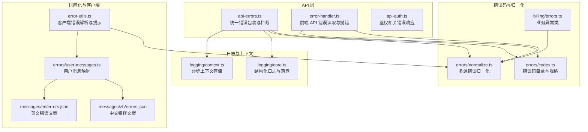
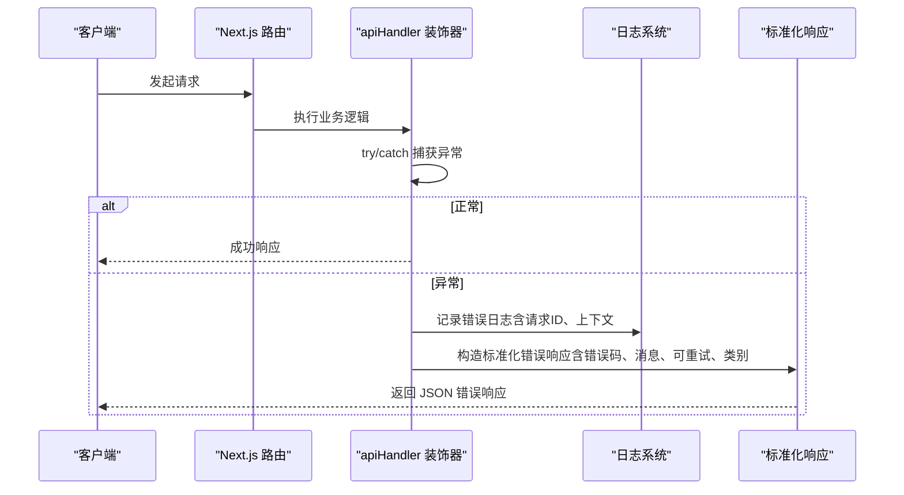
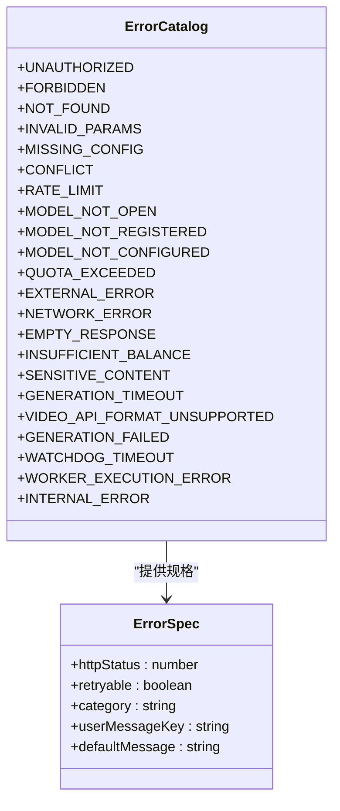
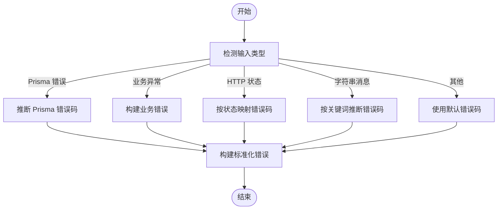
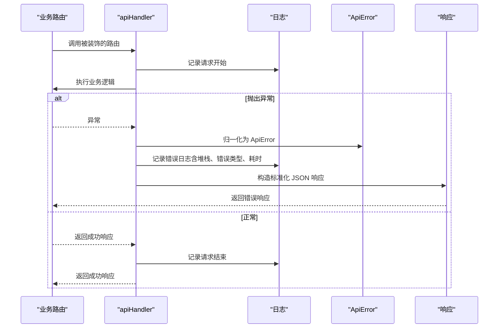
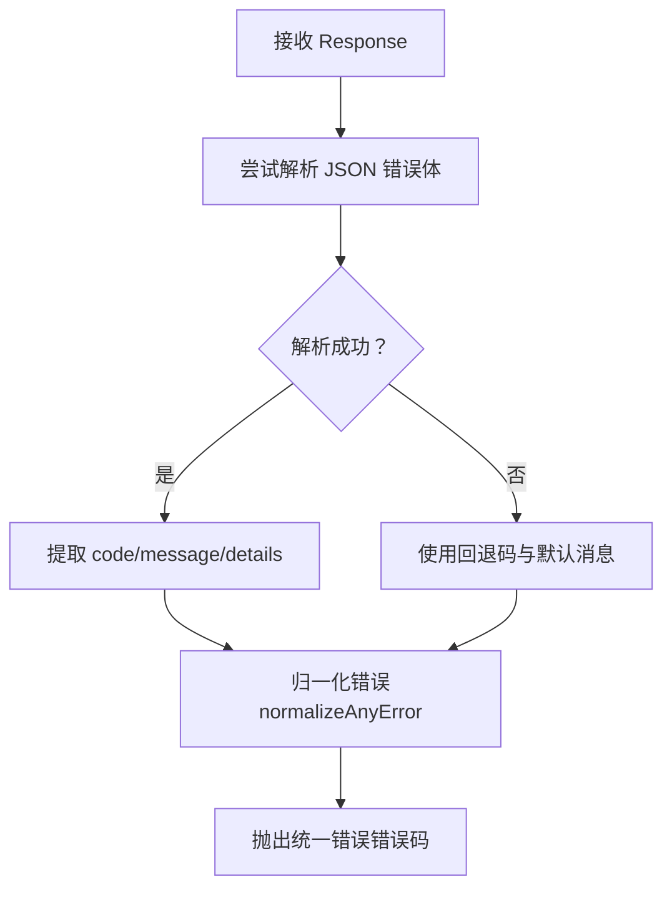
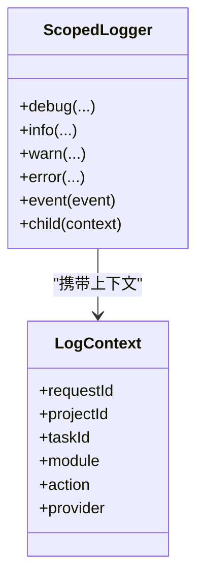
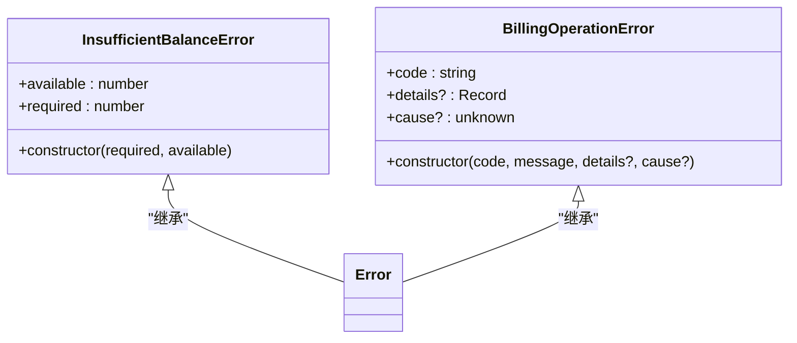
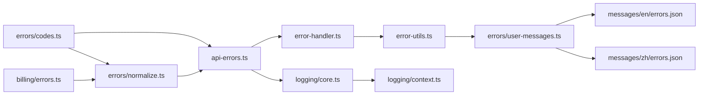

# 错误处理机制

<cite>
**本文引用的文件**
- [src/lib/api-errors.ts](file://src/lib/api-errors.ts)
- [src/lib/error-handler.ts](file://src/lib/error-handler.ts)
- [src/lib/error-utils.ts](file://src/lib/error-utils.ts)
- [src/lib/errors/codes.ts](file://src/lib/errors/codes.ts)
- [src/lib/errors/normalize.ts](file://src/lib/errors/normalize.ts)
- [src/lib/errors/user-messages.ts](file://src/lib/errors/user-messages.ts)
- [messages/en/errors.json](file://messages/en/errors.json)
- [messages/zh/errors.json](file://messages/zh/errors.json)
- [src/lib/logging/core.ts](file://src/lib/logging/core.ts)
- [src/lib/logging/context.ts](file://src/lib/logging/context.ts)
- [src/lib/billing/errors.ts](file://src/lib/billing/errors.ts)
- [src/lib/api-auth.ts](file://src/lib/api-auth.ts)
</cite>

## 目录
1. [引言](#引言)
2. [项目结构](#项目结构)
3. [核心组件](#核心组件)
4. [架构总览](#架构总览)
5. [详细组件分析](#详细组件分析)
6. [依赖关系分析](#依赖关系分析)
7. [性能考量](#性能考量)
8. [故障排查指南](#故障排查指南)
9. [结论](#结论)
10. [附录](#附录)

## 引言
本文件系统化梳理 Waoowaoo 的错误处理机制，覆盖全局错误处理器、统一错误码与分类、API 错误标准化格式、HTTP 状态码映射、错误消息国际化、业务异常封装与自定义错误类型、错误上下文与日志采集、堆栈追踪与调试信息、客户端错误响应与用户体验优化、错误监控与告警集成以及常见场景的处理模式与最佳实践。

## 项目结构
围绕错误处理的关键模块分布如下：
- 统一错误码与分类：定义错误码、HTTP 状态、可重试性、类别与默认用户消息键
- 错误归一化：从多种来源（错误对象、Prisma 错误、HTTP 状态、字符串消息）推断统一错误码
- API 层错误包装与拦截：统一捕获异常、构造标准响应、注入请求 ID、审计日志
- 客户端错误处理：识别网络中断、解析错误、安全提示、国际化用户消息
- 日志与上下文：结构化日志、请求上下文、脱敏、项目级落盘
- 国际化错误消息：中英文错误文案映射
- 业务异常：余额不足等业务错误类

**图表来源**
- [src/lib/api-errors.ts:1-571](file://src/lib/api-errors.ts#L1-L571)
- [src/lib/error-handler.ts:1-98](file://src/lib/error-handler.ts#L1-L98)
- [src/lib/errors/codes.ts:1-205](file://src/lib/errors/codes.ts#L1-L205)
- [src/lib/errors/normalize.ts:1-340](file://src/lib/errors/normalize.ts#L1-L340)
- [src/lib/errors/user-messages.ts:1-33](file://src/lib/errors/user-messages.ts#L1-L33)
- [messages/zh/errors.json:1-23](file://messages/zh/errors.json#L1-L23)
- [messages/en/errors.json:1-23](file://messages/en/errors.json#L1-L23)
- [src/lib/logging/core.ts:1-303](file://src/lib/logging/core.ts#L1-L303)
- [src/lib/logging/context.ts:1-73](file://src/lib/logging/context.ts#L1-L73)
- [src/lib/billing/errors.ts:1-49](file://src/lib/billing/errors.ts#L1-L49)
- [src/lib/api-auth.ts:119-163](file://src/lib/api-auth.ts#L119-L163)

**章节来源**
- [src/lib/api-errors.ts:1-571](file://src/lib/api-errors.ts#L1-L571)
- [src/lib/error-handler.ts:1-98](file://src/lib/error-handler.ts#L1-L98)
- [src/lib/errors/codes.ts:1-205](file://src/lib/errors/codes.ts#L1-L205)
- [src/lib/errors/normalize.ts:1-340](file://src/lib/errors/normalize.ts#L1-L340)
- [src/lib/errors/user-messages.ts:1-33](file://src/lib/errors/user-messages.ts#L1-L33)
- [messages/zh/errors.json:1-23](file://messages/zh/errors.json#L1-L23)
- [messages/en/errors.json:1-23](file://messages/en/errors.json#L1-L23)
- [src/lib/logging/core.ts:1-303](file://src/lib/logging/core.ts#L1-L303)
- [src/lib/logging/context.ts:1-73](file://src/lib/logging/context.ts#L1-L73)
- [src/lib/billing/errors.ts:1-49](file://src/lib/billing/errors.ts#L1-L49)
- [src/lib/api-auth.ts:119-163](file://src/lib/api-auth.ts#L119-L163)

## 核心组件
- 统一错误码与规格
  - 定义错误类别（认证、计费、内容、供应商、系统、校验）、HTTP 状态、是否可重试、默认消息键与消息
  - 提供错误码解析与别名映射，兼容历史错误码
- 错误归一化引擎
  - 支持来自错误对象、TypeError、Prisma 错误、HTTP 状态码、字符串消息的多源输入
  - 自动推断错误码并构建标准化错误结构（含 HTTP 状态、类别、可重试、用户消息键、详情）
- API 错误包装器
  - 将任意异常转换为统一的 ApiError，注入请求 ID、审计事件、结构化日志
  - 构造标准化 JSON 响应，包含扁平字段与嵌套 error 对象，便于前后端一致消费
- 客户端错误处理
  - 识别网络中断/刷新导致的请求中止，避免无意义提示
  - 解析错误、国际化用户消息、安全提示
- 日志与上下文
  - 结构化日志输出、脱敏、项目级落盘；异步上下文自动携带 requestId、projectId、taskId 等
- 国际化错误消息
  - 中英文错误文案映射，支持占位符（如重试等待时间）

**章节来源**
- [src/lib/errors/codes.ts:1-205](file://src/lib/errors/codes.ts#L1-L205)
- [src/lib/errors/normalize.ts:1-340](file://src/lib/errors/normalize.ts#L1-L340)
- [src/lib/api-errors.ts:372-571](file://src/lib/api-errors.ts#L372-L571)
- [src/lib/error-utils.ts:1-86](file://src/lib/error-utils.ts#L1-L86)
- [src/lib/logging/core.ts:1-303](file://src/lib/logging/core.ts#L1-L303)
- [src/lib/logging/context.ts:1-73](file://src/lib/logging/context.ts#L1-L73)
- [messages/zh/errors.json:1-23](file://messages/zh/errors.json#L1-L23)
- [messages/en/errors.json:1-23](file://messages/en/errors.json#L1-L23)

## 架构总览
整体流程：API 路由通过装饰器捕获异常，统一归一化为 ApiError，构造标准响应并记录日志；前端通过统一的错误读取与解析函数进行错误处理与提示；错误码与规格集中管理，确保一致性与可维护性。

**图表来源**
- [src/lib/api-errors.ts:440-562](file://src/lib/api-errors.ts#L440-L562)
- [src/lib/logging/core.ts:97-132](file://src/lib/logging/core.ts#L97-L132)

**章节来源**
- [src/lib/api-errors.ts:440-562](file://src/lib/api-errors.ts#L440-L562)
- [src/lib/logging/core.ts:97-132](file://src/lib/logging/core.ts#L97-L132)

## 详细组件分析

### 组件A：统一错误码与分类体系
- 错误类别：认证、计费、内容、供应商、系统、校验
- 错误码规格：包含 HTTP 状态、是否可重试、默认消息键、默认消息
- 错误码解析：支持大小写与空白规范化、历史别名映射
- 用途：作为错误归一化的输入与响应字段的基础

**图表来源**
- [src/lib/errors/codes.ts:12-181](file://src/lib/errors/codes.ts#L12-L181)

**章节来源**
- [src/lib/errors/codes.ts:1-205](file://src/lib/errors/codes.ts#L1-L205)

### 组件B：错误归一化引擎
- 输入来源：错误对象、TypeError、Prisma 错误、HTTP 状态、字符串消息、业务异常类
- 推断规则：优先匹配显式错误码，其次根据状态码与消息关键词推断，最后回退到默认错误码
- 输出结构：标准化错误对象（含 code、message、httpStatus、retryable、category、userMessageKey、details、provider）

**图表来源**
- [src/lib/errors/normalize.ts:195-291](file://src/lib/errors/normalize.ts#L195-L291)

**章节来源**
- [src/lib/errors/normalize.ts:1-340](file://src/lib/errors/normalize.ts#L1-L340)

### 组件C：API 错误包装与拦截
- 装饰器 apiHandler：生成请求 ID、提取路由上下文、记录请求开始/结束与错误日志、审计用户操作
- ApiError 类：继承 Error，注入 code、status、details、retryable、category、userMessageKey
- 标准化响应：包含 success、requestId、error（code、message、retryable、category、userMessageKey、details）以及扁平字段（code、message、...details）
- 鉴权错误响应：提供 unauthorized、forbidden、notFound、badRequest、serverError 工具函数

**图表来源**
- [src/lib/api-errors.ts:440-562](file://src/lib/api-errors.ts#L440-L562)
- [src/lib/api-auth.ts:119-163](file://src/lib/api-auth.ts#L119-L163)

**章节来源**
- [src/lib/api-errors.ts:372-571](file://src/lib/api-errors.ts#L372-L571)
- [src/lib/api-auth.ts:119-163](file://src/lib/api-auth.ts#L119-L163)

### 组件D：前端错误处理与国际化
- 读取与解析 API 错误：从 Response JSON 中解析错误体，兼容嵌套 error 字段与扁平字段
- 统一错误抛错：将响应转换为统一错误码并抛出，便于上层捕获
- 客户端错误解析：识别网络中断/刷新导致的请求中止，避免无意义提示
- 国际化用户消息：根据错误码获取对应语言的消息

**图表来源**
- [src/lib/error-handler.ts:52-97](file://src/lib/error-handler.ts#L52-L97)
- [src/lib/errors/normalize.ts:195-291](file://src/lib/errors/normalize.ts#L195-L291)

**章节来源**
- [src/lib/error-handler.ts:1-98](file://src/lib/error-handler.ts#L1-L98)
- [src/lib/error-utils.ts:1-86](file://src/lib/error-utils.ts#L1-L86)
- [messages/zh/errors.json:1-23](file://messages/zh/errors.json#L1-L23)
- [messages/en/errors.json:1-23](file://messages/en/errors.json#L1-L23)

### 组件E：日志与上下文
- 结构化日志：统一输出 JSON，包含时间戳、级别、服务名、模块、动作、请求 ID、任务 ID、项目 ID、错误码、重试标记、耗时、详情与错误字段
- 脱敏与抑制：对敏感键进行脱敏，抑制高频流式事件日志
- 上下文存储：基于 AsyncLocalStorage 或降级方案，自动携带 requestId、projectId、taskId 等
- 项目级落盘：服务端将日志同时写入全局日志与项目日志文件

**图表来源**
- [src/lib/logging/core.ts:267-302](file://src/lib/logging/core.ts#L267-L302)
- [src/lib/logging/context.ts:1-73](file://src/lib/logging/context.ts#L1-L73)

**章节来源**
- [src/lib/logging/core.ts:1-303](file://src/lib/logging/core.ts#L1-L303)
- [src/lib/logging/context.ts:1-73](file://src/lib/logging/context.ts#L1-L73)

### 组件F：业务异常封装
- 余额不足异常：携带所需金额与可用金额，归一化为 INSUFFICIENT_BALANCE
- 计费操作异常：携带具体业务错误码与详情，便于上层区分与处理

**图表来源**
- [src/lib/billing/errors.ts:1-49](file://src/lib/billing/errors.ts#L1-L49)

**章节来源**
- [src/lib/billing/errors.ts:1-49](file://src/lib/billing/errors.ts#L1-L49)
- [src/lib/errors/normalize.ts:235-241](file://src/lib/errors/normalize.ts#L235-L241)

## 依赖关系分析
- 统一错误码与规格被错误归一化与 API 包装器共同依赖
- API 包装器依赖日志系统与上下文，负责最终响应构造
- 前端错误处理依赖错误归一化与用户消息映射
- 业务异常类通过归一化引擎映射到统一错误码

**图表来源**
- [src/lib/errors/codes.ts:1-205](file://src/lib/errors/codes.ts#L1-L205)
- [src/lib/errors/normalize.ts:1-340](file://src/lib/errors/normalize.ts#L1-L340)
- [src/lib/api-errors.ts:1-571](file://src/lib/api-errors.ts#L1-L571)
- [src/lib/error-handler.ts:1-98](file://src/lib/error-handler.ts#L1-L98)
- [src/lib/error-utils.ts:1-86](file://src/lib/error-utils.ts#L1-L86)
- [src/lib/errors/user-messages.ts:1-33](file://src/lib/errors/user-messages.ts#L1-L33)
- [messages/en/errors.json:1-23](file://messages/en/errors.json#L1-L23)
- [messages/zh/errors.json:1-23](file://messages/zh/errors.json#L1-L23)
- [src/lib/logging/core.ts:1-303](file://src/lib/logging/core.ts#L1-L303)
- [src/lib/logging/context.ts:1-73](file://src/lib/logging/context.ts#L1-L73)
- [src/lib/billing/errors.ts:1-49](file://src/lib/billing/errors.ts#L1-L49)

**章节来源**
- 同“图表来源”所列文件

## 性能考量
- 错误归一化采用轻量字符串匹配与状态映射，复杂度低，适合高频调用
- 日志系统仅在错误级别输出，并进行脱敏与抑制，避免日志风暴
- API 装饰器在成功路径与异常路径均设置请求 ID，便于端到端追踪，且仅在异常时增加日志开销
- 前端错误解析仅在错误路径触发，避免对正常路径产生影响

## 故障排查指南
- 快速定位
  - 查看响应中的 requestId，结合服务端日志进行关联
  - 关注 error 字段中的 code、retryable、category、details
- 常见问题
  - 网络中断/刷新：前端会自动忽略 AbortError，避免误报
  - 余额不足：错误码为 INSUFFICIENT_BALANCE，前端可引导充值
  - 速率限制：错误码为 RATE_LIMIT，前端可提示重试等待时间
  - 外部服务异常：错误码为 EXTERNAL_ERROR，建议重试或稍后重试
- 调试步骤
  - 在 API 层开启审计日志，确认用户操作完成事件
  - 使用 withLogContext 注入上下文，确保日志包含项目与任务信息
  - 检查 Prisma 错误码映射，确认数据库层面的冲突或未找到

**章节来源**
- [src/lib/error-utils.ts:10-40](file://src/lib/error-utils.ts#L10-L40)
- [src/lib/api-errors.ts:487-501](file://src/lib/api-errors.ts#L487-L501)
- [src/lib/logging/core.ts:97-132](file://src/lib/logging/core.ts#L97-L132)

## 结论
Waoowaoo 的错误处理机制以统一错误码与归一化为核心，贯穿 API 层、前端与日志系统，形成闭环的错误标准化、国际化与可观测性方案。通过严格的分类与状态映射、完善的上下文与日志、以及友好的客户端提示策略，显著提升了系统的稳定性与可维护性。

## 附录

### API 错误标准化格式
- 响应字段
  - success: 布尔，固定为 false
  - requestId: 字符串，请求唯一标识
  - error: 对象，包含
    - code: 统一错误码
    - message: 本地化后的用户消息
    - retryable: 是否可重试
    - category: 错误类别
    - userMessageKey: 用户消息键
    - details: 附加详情（包含 requestId）
  - 扁平字段（向后兼容）：code、message、...details

**章节来源**
- [src/lib/api-errors.ts:534-557](file://src/lib/api-errors.ts#L534-L557)

### HTTP 状态码映射（节选）
- 400：INVALID_PARAMS、VIDEO_API_FORMAT_UNSUPPORTED
- 401：UNAUTHORIZED
- 402：INSUFFICIENT_BALANCE
- 403：FORBIDDEN、MODEL_NOT_OPEN、MODEL_NOT_REGISTERED、MODEL_NOT_CONFIGURED
- 404：NOT_FOUND、NO_RESULT
- 409：CONFLICT
- 422：SENSITIVE_CONTENT
- 429：RATE_LIMIT、QUOTA_EXCEEDED
- 500：INTERNAL_ERROR、WORKER_EXECUTION_ERROR、WATCHDOG_TIMEOUT、GENERATION_FAILED
- 502：EXTERNAL_ERROR、NETWORK_ERROR、EMPTY_RESPONSE
- 503：EXTERNAL_ERROR
- 504：GENERATION_TIMEOUT

**章节来源**
- [src/lib/errors/codes.ts:12-181](file://src/lib/errors/codes.ts#L12-L181)

### 错误消息国际化
- 中文与英文分别提供错误文案映射，支持占位符（如重试等待时间）
- 客户端通过错误码解析用户消息，确保跨语言一致性

**章节来源**
- [messages/zh/errors.json:1-23](file://messages/zh/errors.json#L1-L23)
- [messages/en/errors.json:1-23](file://messages/en/errors.json#L1-L23)
- [src/lib/errors/user-messages.ts:30-32](file://src/lib/errors/user-messages.ts#L30-L32)

### 客户端错误响应与用户体验优化
- 识别网络中断/刷新导致的请求中止，避免弹窗提示
- 安全提示：仅在非中止错误时弹窗，减少干扰
- 国际化消息：根据错误码获取本地化文案，提升可理解性

**章节来源**
- [src/lib/error-utils.ts:10-40](file://src/lib/error-utils.ts#L10-L40)
- [src/lib/error-utils.ts:63-77](file://src/lib/error-utils.ts#L63-L77)

### 错误监控、告警与故障诊断
- 结构化日志：包含错误码、重试标记、耗时、上下文，便于检索与聚合
- 审计事件：对特定用户操作（如生成类）进行审计记录
- 项目级落盘：便于离线分析与故障复盘

**章节来源**
- [src/lib/logging/core.ts:97-132](file://src/lib/logging/core.ts#L97-L132)
- [src/lib/api-errors.ts:487-501](file://src/lib/api-errors.ts#L487-L501)