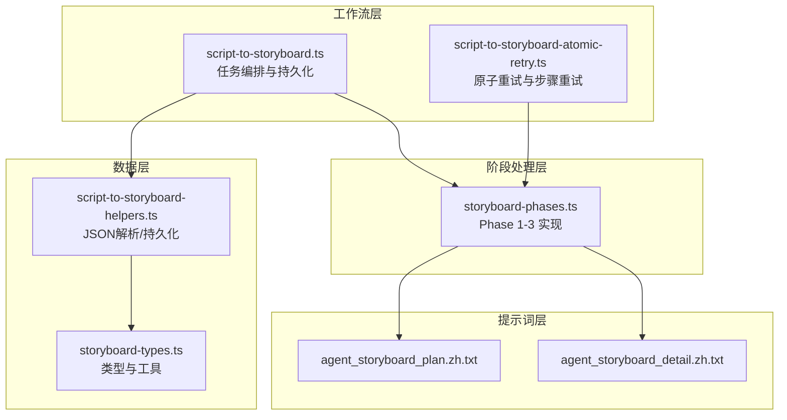
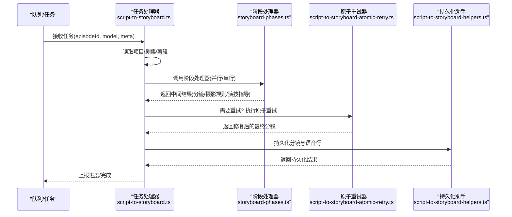
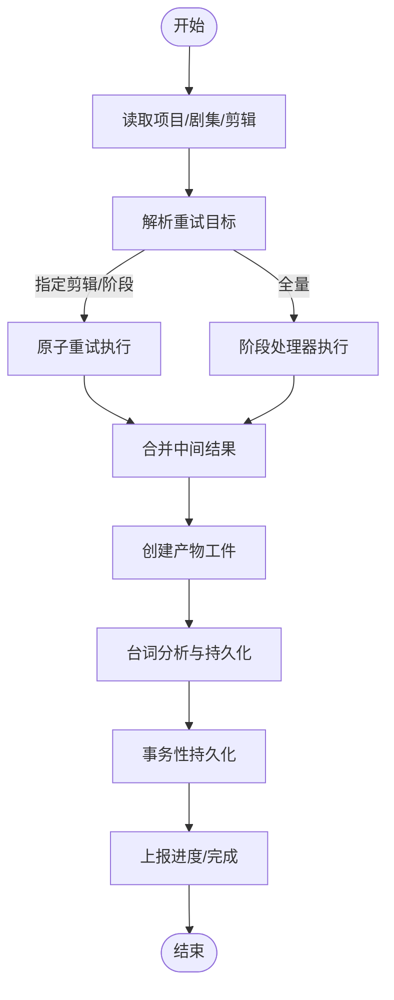
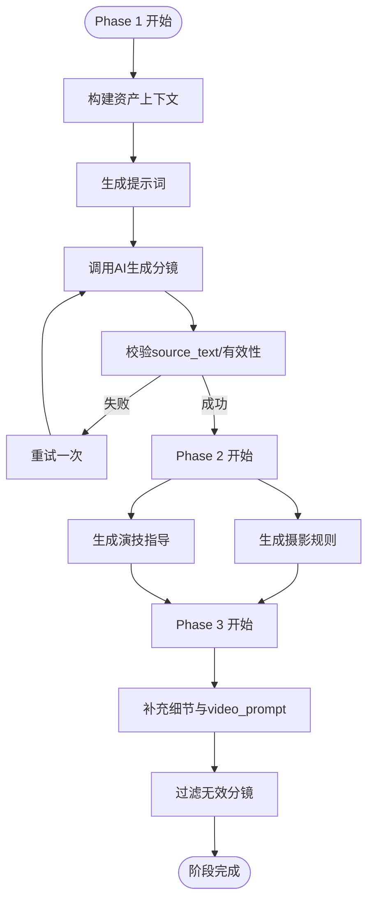
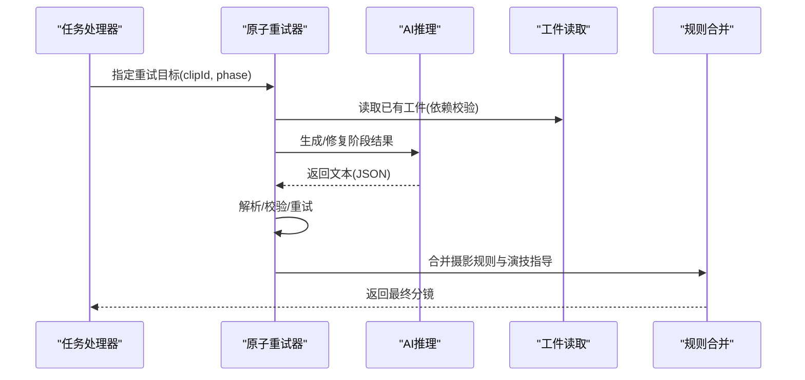
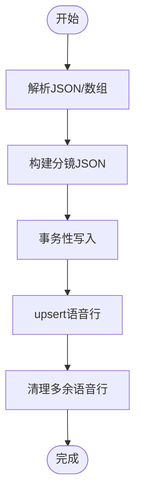
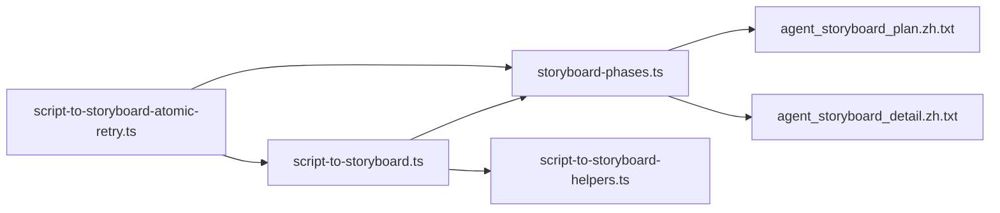

# 分镜生成模块

<cite>
**本文引用的文件**
- [script-to-storyboard.ts](file://src/lib/workers/handlers/script-to-storyboard.ts)
- [script-to-storyboard-helpers.ts](file://src/lib/workers/handlers/script-to-storyboard-helpers.ts)
- [script-to-storyboard-atomic-retry.ts](file://src/lib/workers/handlers/script-to-storyboard-atomic-retry.ts)
- [storyboard-phases.ts](file://src/lib/storyboard-phases.ts)
- [storyboard-types.ts](file://src/types/storyboard-types.ts)
- [agent_storyboard_plan.zh.txt](file://lib/prompts/novel-promotion/agent_storyboard_plan.zh.txt)
- [agent_storyboard_detail.zh.txt](file://lib/prompts/novel-promotion/agent_storyboard_detail.zh.txt)
- [messages_zh_storyboard.json](file://messages/zh/storyboard.json)
</cite>

## 目录
1. [简介](#简介)
2. [项目结构](#项目结构)
3. [核心组件](#核心组件)
4. [架构总览](#架构总览)
5. [详细组件分析](#详细组件分析)
6. [依赖分析](#依赖分析)
7. [性能考量](#性能考量)
8. [故障排除指南](#故障排除指南)
9. [结论](#结论)
10. [附录](#附录)

## 简介
本模块负责将小说推广工作流中的脚本片段自动转换为可用于视频/图像生成的分镜清单。系统采用三阶段分镜生成策略：基础分镜规划、摄影规则设计与演技指导、细节补充与视频提示词生成。模块支持多轮对话优化、创意约束与质量评估，并提供完善的分镜状态管理、进度跟踪与错误恢复机制。此外，模块与图像/视频生成模块紧密集成，通过提示词传递与结果同步保障端到端工作流的稳定性。

## 项目结构
分镜生成模块由以下层次构成：
- 工作流处理器：负责任务编排、进度上报、重试与持久化
- 分镜阶段处理器：按阶段执行AI推理，产出中间结果
- 提示词模板：为各阶段提供结构化提示词
- 数据持久化助手：将中间结果与最终面板写入数据库
- 类型定义：统一分镜、摄影规则、演技指导等数据结构

**图表来源**
- [script-to-storyboard.ts:1-565](file://src/lib/workers/handlers/script-to-storyboard.ts#L1-L565)
- [script-to-storyboard-atomic-retry.ts:1-539](file://src/lib/workers/handlers/script-to-storyboard-atomic-retry.ts#L1-L539)
- [storyboard-phases.ts:1-705](file://src/lib/storyboard-phases.ts#L1-L705)
- [script-to-storyboard-helpers.ts:1-442](file://src/lib/workers/handlers/script-to-storyboard-helpers.ts#L1-L442)
- [agent_storyboard_plan.zh.txt:1-330](file://lib/prompts/novel-promotion/agent_storyboard_plan.zh.txt#L1-L330)
- [agent_storyboard_detail.zh.txt:1-189](file://lib/prompts/novel-promotion/agent_storyboard_detail.zh.txt#L1-L189)
- [storyboard-types.ts:1-49](file://src/types/storyboard-types.ts#L1-L49)

**章节来源**
- [script-to-storyboard.ts:1-565](file://src/lib/workers/handlers/script-to-storyboard.ts#L1-L565)
- [storyboard-phases.ts:1-705](file://src/lib/storyboard-phases.ts#L1-L705)
- [script-to-storyboard-helpers.ts:1-442](file://src/lib/workers/handlers/script-to-storyboard-helpers.ts#L1-L442)
- [agent_storyboard_plan.zh.txt:1-330](file://lib/prompts/novel-promotion/agent_storyboard_plan.zh.txt#L1-L330)
- [agent_storyboard_detail.zh.txt:1-189](file://lib/prompts/novel-promotion/agent_storyboard_detail.zh.txt#L1-L189)
- [storyboard-types.ts:1-49](file://src/types/storyboard-types.ts#L1-L49)

## 核心组件
- 任务处理器：读取项目与剧集数据，构建提示词模板，执行AI推理，持久化中间与最终结果，上报进度与状态
- 阶段处理器：将分镜生成拆分为三个阶段，分别负责基础规划、摄影规则与演技指导、细节补充与视频提示词
- 原子重试器：针对单个阶段或单个剪辑进行重试，支持指数退避与依赖校验
- 数据持久化助手：安全解析JSON、构建分镜JSON、事务性写入数据库、语音行匹配与清理
- 类型与工具：统一分镜、摄影规则、演技指导的数据结构，提供类型守卫与候选图片解析

**章节来源**
- [script-to-storyboard.ts:60-565](file://src/lib/workers/handlers/script-to-storyboard.ts#L60-L565)
- [storyboard-phases.ts:244-705](file://src/lib/storyboard-phases.ts#L244-L705)
- [script-to-storyboard-atomic-retry.ts:333-539](file://src/lib/workers/handlers/script-to-storyboard-atomic-retry.ts#L333-L539)
- [script-to-storyboard-helpers.ts:64-442](file://src/lib/workers/handlers/script-to-storyboard-helpers.ts#L64-L442)
- [storyboard-types.ts:8-49](file://src/types/storyboard-types.ts#L8-L49)

## 架构总览
分镜生成采用“阶段化+并行化+重试化”的架构设计：
- 阶段化：Phase 1-3 分别承担规划、摄影规则与演技指导、细节补充
- 并行化：同一剧集内的剪辑并行处理，阶段内部步骤并行推进
- 重试化：支持任务级重试与原子步骤重试，具备指数退避与依赖校验

**图表来源**
- [script-to-storyboard.ts:265-565](file://src/lib/workers/handlers/script-to-storyboard.ts#L265-L565)
- [storyboard-phases.ts:244-705](file://src/lib/storyboard-phases.ts#L244-L705)
- [script-to-storyboard-atomic-retry.ts:333-539](file://src/lib/workers/handlers/script-to-storyboard-atomic-retry.ts#L333-L539)
- [script-to-storyboard-helpers.ts:225-442](file://src/lib/workers/handlers/script-to-storyboard-helpers.ts#L225-L442)

## 详细组件分析

### 任务处理器（script-to-storyboard.ts）
- 输入参数：episodeId、model、meta、runId、温度与推理努力度、重试目标
- 关键流程：
  - 读取项目与剧集数据，校验剪辑集合
  - 解析重试目标，若为特定剪辑/阶段则执行原子重试
  - 调用阶段处理器生成中间结果，创建产物工件
  - 台词分析（voice_analyze），解析JSON并持久化
  - 事务性写入分镜与语音行，上报进度
- 错误处理：捕获JSON解析异常并记录上下文；支持任务终止错误；最大重试次数限制

**图表来源**
- [script-to-storyboard.ts:60-565](file://src/lib/workers/handlers/script-to-storyboard.ts#L60-L565)

**章节来源**
- [script-to-storyboard.ts:60-565](file://src/lib/workers/handlers/script-to-storyboard.ts#L60-L565)

### 阶段处理器（storyboard-phases.ts）
- Phase 1：基础分镜规划
  - 使用提示词模板与资产上下文生成分镜列表
  - 校验source_text与有效性，失败重试一次
- Phase 2：摄影规则与演技指导
  - 基于分镜列表生成摄影规则（构图、灯光、色彩、氛围、技术备注）
  - 生成演技指导（角色动作与情绪提示）
- Phase 3：细节补充与视频提示词
  - 结合角色年龄性别、场景与道具描述，补充景别、镜头运动与video_prompt
  - 过滤无效分镜，保留有效结果

**图表来源**
- [storyboard-phases.ts:244-705](file://src/lib/storyboard-phases.ts#L244-L705)
- [agent_storyboard_plan.zh.txt:1-330](file://lib/prompts/novel-promotion/agent_storyboard_plan.zh.txt#L1-L330)
- [agent_storyboard_detail.zh.txt:1-189](file://lib/prompts/novel-promotion/agent_storyboard_detail.zh.txt#L1-L189)

**章节来源**
- [storyboard-phases.ts:244-705](file://src/lib/storyboard-phases.ts#L244-L705)

### 原子重试器（script-to-storyboard-atomic-retry.ts）
- 支持针对特定剪辑与阶段的重试（phase1/phase2_cinematography/phase2_acting/phase3_detail）
- 读取已有工件作为依赖，若缺失则抛错
- 步骤级重试：最多三次，指数退避+随机抖动
- 合并规则：将摄影规则与演技指导合并到最终分镜

**图表来源**
- [script-to-storyboard-atomic-retry.ts:333-539](file://src/lib/workers/handlers/script-to-storyboard-atomic-retry.ts#L333-L539)

**章节来源**
- [script-to-storyboard-atomic-retry.ts:333-539](file://src/lib/workers/handlers/script-to-storyboard-atomic-retry.ts#L333-L539)

### 数据持久化助手（script-to-storyboard-helpers.ts）
- JSON解析与修复：安全解析数组与对象，支持回退
- 分镜JSON构建：将分镜面板序列化为统一格式，便于后续处理
- 事务性持久化：分镜与语音行的upsert/delete，保证一致性
- 语音行匹配：基于storyboardId与panelIndex精确匹配，支持更新与清理

**图表来源**
- [script-to-storyboard-helpers.ts:64-442](file://src/lib/workers/handlers/script-to-storyboard-helpers.ts#L64-L442)

**章节来源**
- [script-to-storyboard-helpers.ts:64-442](file://src/lib/workers/handlers/script-to-storyboard-helpers.ts#L64-L442)

### 类型与工具（storyboard-types.ts）
- 类型守卫：判断storyboard是否包含已加载的panels
- 安全访问：提供安全获取panels与候选图片的方法
- JSON解析：对imageHistory进行健壮解析

**章节来源**
- [storyboard-types.ts:8-49](file://src/types/storyboard-types.ts#L8-L49)

## 依赖分析
- 模块耦合
  - 任务处理器依赖阶段处理器与持久化助手
  - 原子重试器依赖阶段处理器与工件服务
  - 阶段处理器依赖提示词模板与资产上下文
- 外部依赖
  - AI推理服务（executeAiTextStep）
  - 数据库事务（Prisma）
  - 提示词国际化（prompt-i18n）

**图表来源**
- [script-to-storyboard.ts:1-565](file://src/lib/workers/handlers/script-to-storyboard.ts#L1-L565)
- [storyboard-phases.ts:1-705](file://src/lib/storyboard-phases.ts#L1-L705)
- [script-to-storyboard-atomic-retry.ts:1-539](file://src/lib/workers/handlers/script-to-storyboard-atomic-retry.ts#L1-L539)
- [agent_storyboard_plan.zh.txt:1-330](file://lib/prompts/novel-promotion/agent_storyboard_plan.zh.txt#L1-L330)
- [agent_storyboard_detail.zh.txt:1-189](file://lib/prompts/novel-promotion/agent_storyboard_detail.zh.txt#L1-L189)

**章节来源**
- [script-to-storyboard.ts:1-565](file://src/lib/workers/handlers/script-to-storyboard.ts#L1-L565)
- [storyboard-phases.ts:1-705](file://src/lib/storyboard-phases.ts#L1-L705)
- [script-to-storyboard-atomic-retry.ts:1-539](file://src/lib/workers/handlers/script-to-storyboard-atomic-retry.ts#L1-L539)

## 性能考量
- 并行化策略
  - 同一剧集内剪辑并行处理，减少整体耗时
  - 阶段内步骤并行推进，充分利用AI能力
- 重试与退避
  - 步骤级重试采用指数退避与抖动，降低瞬时峰值
  - 任务级重试限制最大尝试次数，避免无限循环
- 数据库事务
  - 事务性写入保证一致性，同时设置超时上限，防止长时间阻塞
- 温度与推理努力度
  - 通过温度与推理努力度控制AI输出稳定性与创造性平衡

[本节为通用性能建议，无需特定文件引用]

## 故障排除指南
- JSON解析错误
  - 现象：提示“JSON解析失败”或“空结果”
  - 处理：检查AI输出是否包含合法JSON；启用重试；记录原始文本片段
- 依赖缺失
  - 现象：提示“缺少依赖工件”
  - 处理：确认前置阶段已完成；检查工件类型与refId
- 任务终止
  - 现象：任务被终止
  - 处理：检查运行租约与工作器状态；确认任务未被取消
- 语音行匹配失败
  - 现象：提示“匹配面板引用无效”
  - 处理：核对storyboardId与panelIndex；确保面板索引从1开始且连续

**章节来源**
- [script-to-storyboard.ts:347-360](file://src/lib/workers/handlers/script-to-storyboard.ts#L347-L360)
- [script-to-storyboard-atomic-retry.ts:311-316](file://src/lib/workers/handlers/script-to-storyboard-atomic-retry.ts#L311-L316)
- [script-to-storyboard-helpers.ts:337-350](file://src/lib/workers/handlers/script-to-storyboard-helpers.ts#L337-L350)

## 结论
分镜生成模块通过阶段化、并行化与重试化的架构设计，实现了从脚本到分镜的自动化转换。模块在质量控制、创意约束与错误恢复方面具备完善的机制，并与图像/视频生成模块形成闭环。借助提示词模板与资产上下文，系统能够稳定地产出高质量的分镜清单，满足小说推广工作流的多样化需求。

## 附录

### 提示词模板与用途
- 基础分镜规划模板：用于生成分镜列表，包含描述、角色、场景、场景类型与source_text
- 细节补充与视频提示词模板：用于生成景别、镜头运动与video_prompt，确保与scene_type匹配

**章节来源**
- [agent_storyboard_plan.zh.txt:1-330](file://lib/prompts/novel-promotion/agent_storyboard_plan.zh.txt#L1-L330)
- [agent_storyboard_detail.zh.txt:1-189](file://lib/prompts/novel-promotion/agent_storyboard_detail.zh.txt#L1-L189)

### 状态与进度跟踪
- 进度标签与阶段映射：包含准备、阶段执行、持久化等阶段
- 本地化消息：提供进度与步骤标题的本地化文案

**章节来源**
- [messages_zh_storyboard.json](file://messages/zh/storyboard.json)