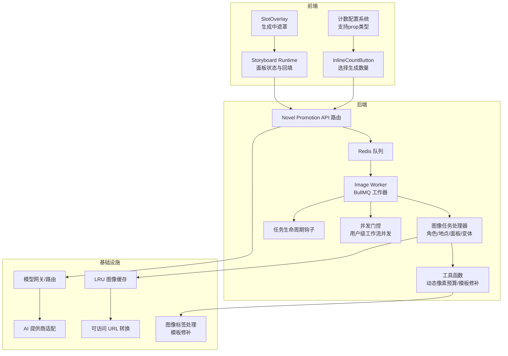
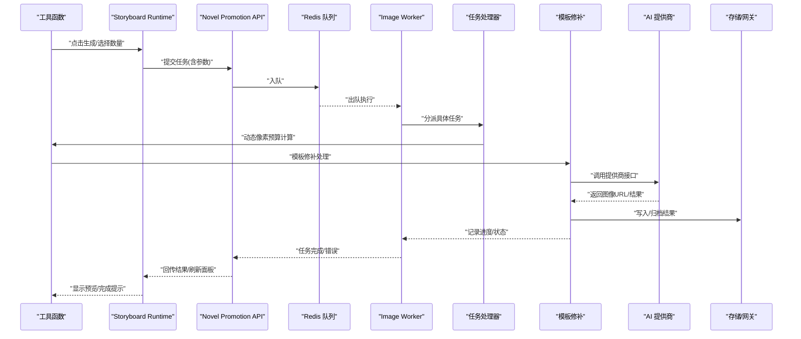
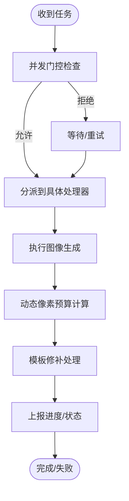
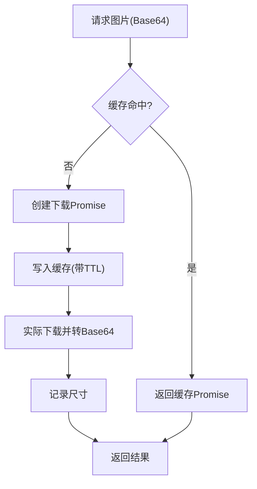
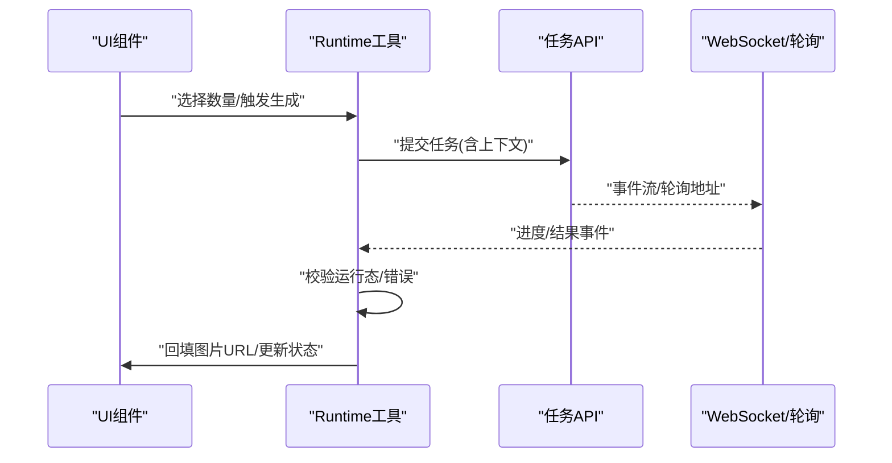
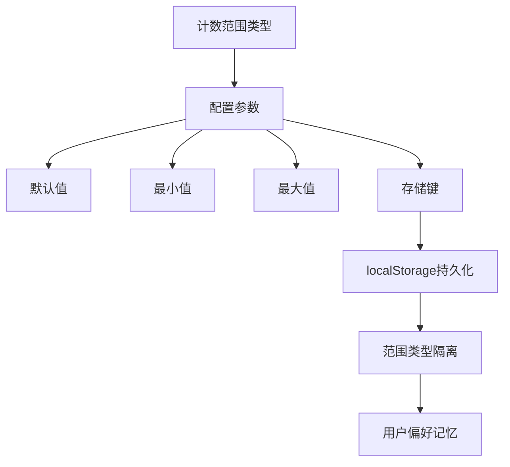
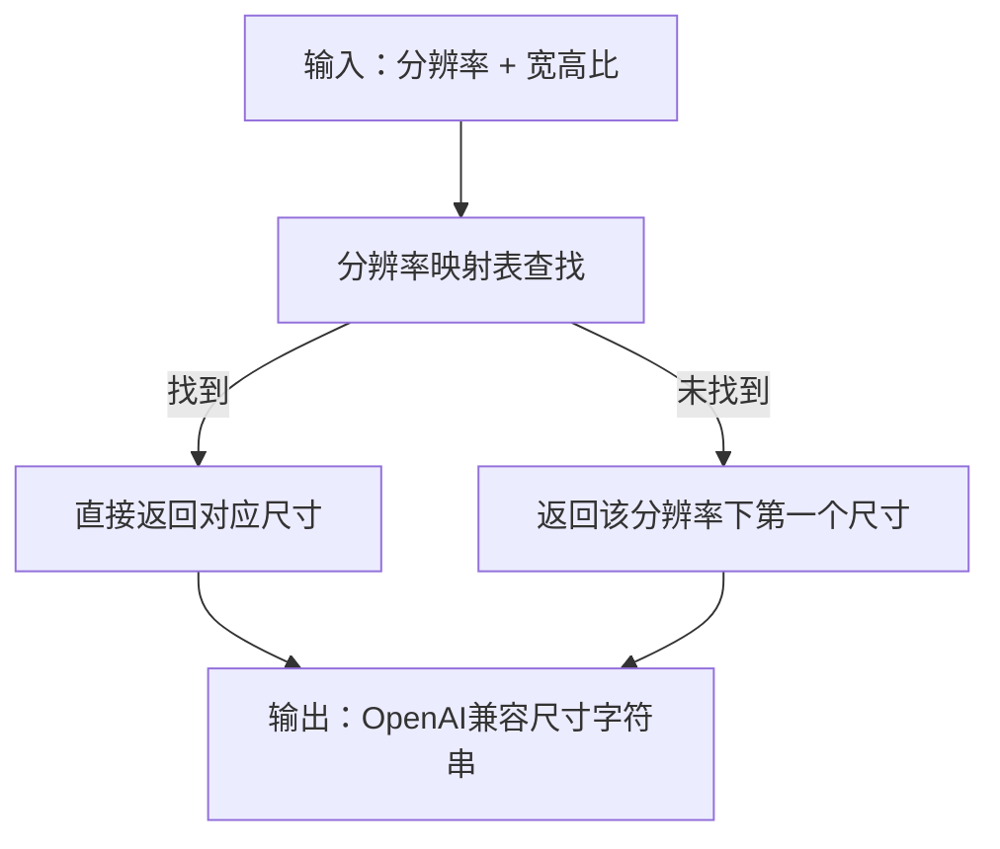
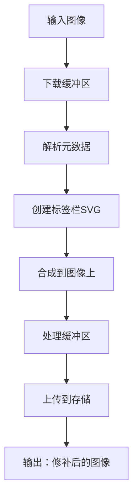
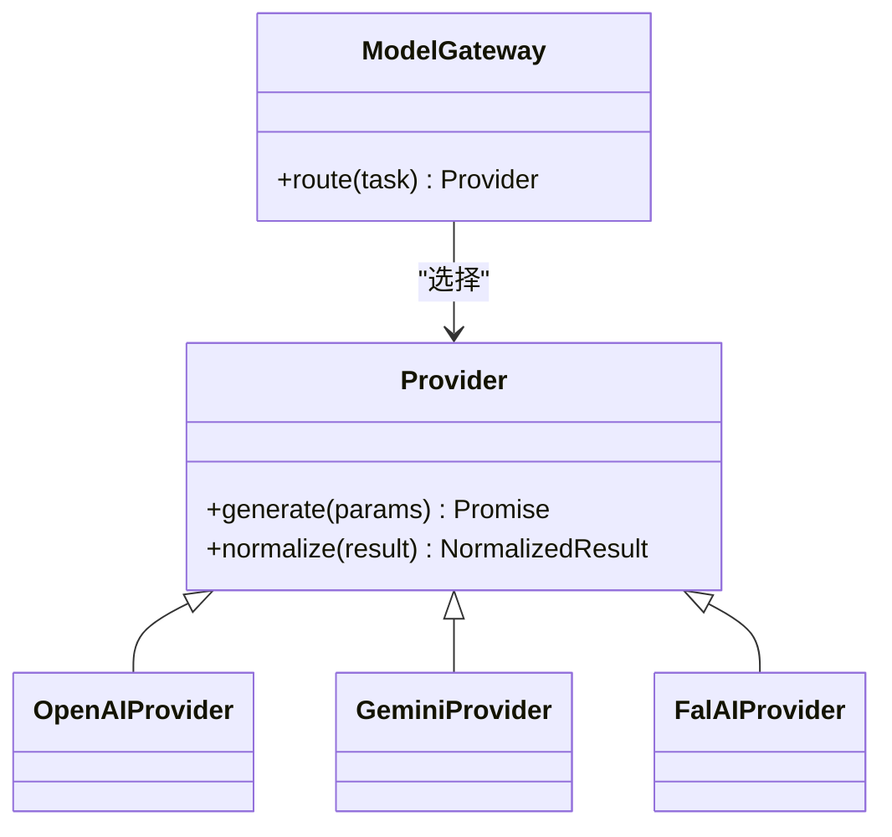
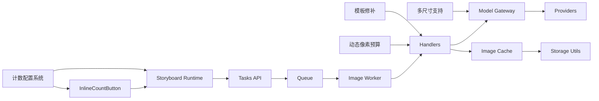

# 图像生成集成

<cite>
**本文引用的文件**
- [src/lib/workers/image.worker.ts](file://src/lib/workers/image.worker.ts)
- [src/lib/workers/shared.ts](file://src/lib/workers/shared.ts)
- [src/lib/workers/user-concurrency-gate.ts](file://src/lib/workers/user-concurrency-gate.ts)
- [src/lib/workers/utils.ts](file://src/lib/workers/utils.ts)
- [src/lib/workers/handlers/image-task-handlers-core.ts](file://src/lib/workers/handlers/image-task-handlers-core.ts)
- [src/lib/image-cache.ts](file://src/lib/image-cache.ts)
- [src/app/[locale]/workspace/[projectId]/modes/novel-promotion/components/storyboard/hooks/image-generation-runtime.ts](file://src/app/[locale]/workspace/[projectId]/modes/novel-promotion/components/storyboard/hooks/image-generation-runtime.ts)
- [src/lib/image-generation/use-image-generation-count.ts](file://src/lib/image-generation/use-image-generation-count.ts)
- [src/lib/image-generation/count.ts](file://src/lib/image-generation/count.ts)
- [src/lib/image-generation/count-preference.ts](file://src/lib/image-generation/count-preference.ts)
- [src/lib/image-generation/slot-state.ts](file://src/lib/image-generation/slot-state.ts)
- [src/lib/image-generation/location-slots.ts](file://src/lib/image-generation/location-slots.ts)
- [src/components/image-generation/ImageGenerationInlineCountButton.tsx](file://src/components/image-generation/ImageGenerationInlineCountButton.tsx)
- [src/components/image-generation/ImageGenerationSlotOverlay.tsx](file://src/components/image-generation/ImageGenerationSlotOverlay.tsx)
- [src/lib/workflow-concurrency.ts](file://src/lib/workflow-concurrency.ts)
- [src/lib/config-service.ts](file://src/lib/config-service.ts)
- [src/lib/storage/index.ts](file://src/lib/storage/index.ts)
- [src/lib/model-gateway/router.ts](file://src/lib/model-gateway/router.ts)
- [src/lib/model-gateway/openai-compat/image.ts](file://src/lib/model-gateway/openai-compat/image.ts)
- [src/lib/providers/index.ts](file://src/lib/providers/index.ts)
- [src/lib/llm-client.ts](file://src/lib/llm-client.ts)
- [src/lib/async-task-utils.ts](file://src/lib/async-task-utils.ts)
- [src/lib/task/types.ts](file://src/lib/task/types.ts)
- [src/lib/task/queues.ts](file://src/lib/task/queues.ts)
- [src/lib/async-poll.ts](file://src/lib/async-poll.ts)
- [src/lib/media-process.ts](file://src/lib/media-process.ts)
- [src/lib/error-handler.ts](file://src/lib/error-handler.ts)
- [src/lib/logging/core.ts](file://src/lib/logging/core.ts)
- [src/lib/image-label.ts](file://src/lib/image-label.ts)
- [src/app/api/novel-promotion/[projectId]/ai-modify-shot-prompt/route.ts](file://src/app/api/novel-promotion/[projectId]/ai-modify-shot-prompt/route.ts)
- [src/app/api/novel-promotion/[projectId]/analyze-shot-variants/route.ts](file://src/app/api/novel-promotion/[projectId]/analyze-shot-variants/route.ts)
- [src/app/api/novel-promotion/[projectId]/assets/route.ts](file://src/app/api/novel-promotion/[projectId]/assets/route.ts)
- [src/app/api/novel-promotion/[projectId]/character-profile/route.ts](file://src/app/api/novel-promotion/[projectId]/character-profile/route.ts)
- [src/app/api/novel-promotion/[projectId]/character/route.ts](file://src/app/api/novel-promotion/[projectId]/character/route.ts)
- [src/app/api/novel-promotion/[projectId]/location/route.ts](file://src/app/api/novel-promotion/[projectId]/location/route.ts)
- [src/app/api/novel-promotion/[projectId]/prop/route.ts](file://src/app/api/novel-promotion/[projectId]/prop/route.ts)
- [src/app/api/novel-promotion/[projectId]/storyboard/route.ts](file://src/app/api/novel-promotion/[projectId]/storyboard/route.ts)
- [src/app/api/novel-promotion/[projectId]/storyboard/insert/route.ts](file://src/app/api/novel-promotion/[projectId]/storyboard/insert/route.ts)
- [src/app/api/novel-promotion/[projectId]/storyboard/plan/route.ts](file://src/app/api/novel-promotion/[projectId]/storyboard/plan/route.ts)
- [src/app/api/novel-promotion/[projectId]/storyboard/variant/route.ts](file://src/app/api/novel-promotion/[projectId]/storyboard/variant/route.ts)
- [src/app/api/novel-promotion/[projectId]/tasks/route.ts](file://src/app/api/novel-promotion/[projectId]/tasks/route.ts)
- [src/app/api/novel-promotion/[projectId]/runs/route.ts](file://src/app/api/novel-promotion/[projectId]/runs/route.ts)
- [src/app/api/novel-promotion/[projectId]/analyze/route.ts](file://src/app/api/novel-promotion/[projectId]/analyze/route.ts)
- [src/app/api/novel-promotion/[projectId]/analyze-global/route.ts](file://src/app/api/novel-promotion/[projectId]/analyze-global/route.ts)
- [src/app/api/novel-promotion/[projectId]/runs/[runId]/events/route.ts](file://src/app/api/novel-promotion/[projectId]/runs/[runId]/events/route.ts)
- [src/app/api/novel-promotion/[projectId]/runs/[runId]/status/route.ts](file://src/app/api/novel-promotion/[projectId]/runs/[runId]/status/route.ts)
- [src/app/api/novel-promotion/[projectId]/tasks/[taskId]/status/route.ts](file://src/app/api/novel-promotion/[projectId]/tasks/[taskId]/status/route.ts)
- [src/app/api/novel-promotion/[projectId]/tasks/[taskId]/retry/route.ts](file://src/app/api/novel-promotion/[projectId]/tasks/[taskId]/retry/route.ts)
- [src/app/api/novel-promotion/[projectId]/tasks/[taskId]/cancel/route.ts](file://src/app/api/novel-promotion/[projectId]/tasks/[taskId]/cancel/route.ts)
- [src/app/api/novel-promotion/[projectId]/tasks/[taskId]/events/route.ts](file://src/app/api/novel-promotion/[projectId]/tasks/[taskId]/events/route.ts)
- [src/app/api/novel-promotion/[projectId]/tasks/[taskId]/results/route.ts](file://src/app/api/novel-promotion/[projectId]/tasks/[taskId]/results/route.ts)
- [src/app/api/novel-promotion/[projectId]/tasks/[taskId]/poll/route.ts](file://src/app/api/novel-promotion/[projectId]/tasks/[taskId]/poll/route.ts)
- [src/app/api/novel-promotion/[projectId]/tasks/[taskId]/stream/route.ts](file://src/app/api/novel-promotion/[projectId]/tasks/[taskId]/stream/route.ts)
- [src/app/api/novel-promotion/[projectId]/tasks/[taskId]/stream/events/route.ts](file://src/app/api/novel-promotion/[projectId]/tasks/[taskId]/stream/events/route.ts)
- [src/app/api/novel-promotion/[projectId]/tasks/[taskId]/stream/status/route.ts](file://src/app/api/novel-promotion/[projectId]/tasks/[taskId]/stream/status/route.ts)
- [src/app/api/novel-promotion/[projectId]/tasks/[taskId]/stream/results/route.ts](file://src/app/api/novel-promotion/[projectId]/tasks/[taskId]/stream/results/route.ts)
- [src/app/api/novel-promotion/[projectId]/tasks/[taskId]/stream/events/[eventId]/route.ts](file://src/app/api/novel-promotion/[projectId]/tasks/[taskId]/stream/events/[eventId]/route.ts)
- [src/app/api/novel-promotion/[projectId]/tasks/[taskId]/stream/events/[eventId]/status/route.ts](file://src/app/api/novel-promotion/[projectId]/tasks/[taskId]/stream/events/[eventId]/status/route.ts)
- [src/app/api/novel-promotion/[projectId]/tasks/[taskId]/stream/events/[eventId]/results/route.ts](file://src/app/api/novel-promotion/[projectId]/tasks/[taskId]/stream/events/[eventId]/results/route.ts)
- [src/app/api/novel-promotion/[projectId]/tasks/[taskId]/stream/events/[eventId]/poll/route.ts](file://src/app/api/novel-promotion/[projectId]/tasks/[taskId]/stream/events/[eventId]/poll/route.ts)
- [src/app/api/novel-promotion/[projectId]/tasks/[taskId]/stream/events/[eventId]/retry/route.ts](file://src/app/api/novel-promotion/[projectId]/tasks/[taskId]/stream/events/[eventId]/retry/route.ts)
- [src/app/api/novel-promotion/[projectId]/tasks/[taskId]/stream/events/[eventId]/cancel/route.ts](file://src/app/api/novel-promotion/[projectId]/tasks/[taskId]/stream/events/[eventId]/cancel/route.ts)
- [src/app/api/novel-promotion/[projectId]/tasks/[taskId]/stream/events/[eventId]/poll/route.ts](file://src/app/api/novel-promotion/[projectId]/tasks/[taskId]/stream/events/[eventId]/poll/route.ts)
- [src/app/api/novel-promotion/[projectId]/tasks/[taskId]/stream/events/[eventId]/retry/route.ts](file://src/app/api/novel-promotion/[projectId]/tasks/[taskId]/stream/events/[eventId]/retry/route.ts)
- [src/app/api/novel-promotion/[projectId]/tasks/[taskId]/stream/events/[eventId]/cancel/route.ts](file://src/app/api/novel-promotion/[projectId]/tasks/[taskId]/stream/events/[eventId]/cancel/route.ts)
- [src/app/api/novel-promotion/[projectId]/tasks/[taskId]/stream/events/[eventId]/poll/route.ts](file://src/app/api/novel-promotion/[projectId]/tasks/[taskId]/stream/events/[eventId]/poll/route.ts)
- [src/app/api/novel-promotion/[projectId]/tasks/[taskId]/stream/events/[eventId]/retry/route.ts](file://src/app/api/novel-promotion/[projectId]/tasks/[taskId]/stream/events/[eventId]/retry/route.ts)
- [src/app/api/novel-promotion/[projectId]/tasks/[taskId]/stream/events/[eventId]/cancel/route.ts](file://src/app/api/novel-promotion/[projectId]/tasks/[taskId]/stream/events/[eventId]/cancel/route.ts)
- [src/app/api/novel-promotion/[projectId]/tasks/[taskId]/stream/events/[eventId]/poll/route.ts](file://src/app/api/novel-promotion/[projectId]/tasks/[taskId]/stream/events/[eventId]/poll/route.ts)
- [src/app/api/novel-promotion/[projectId]/tasks/[taskId]/stream/events/[eventId]/retry/route.ts](file://src/app/api/novel-promotion/[projectId]/tasks/[taskId]/stream/events/[eventId]/retry/route.ts)
- [src/app/api/novel-promotion/[projectId]/tasks/[taskId]/stream/events/[eventId]/cancel/route.ts](file://src/app/api/novel-promotion/[projectId]/tasks/[taskId]/stream/events/[eventId]/cancel/route.ts)
- [src/app/api/novel-promotion/[projectId]/tasks/[taskId]/stream/events/[eventId]/poll/route.ts](file://src/app/api/novel-promotion/[projectId]/tasks/[taskId]/stream/events/[eventId]/poll/route.ts)
- [src/app/api/novel-promotion/[projectId]/tasks/[taskId]/stream/events/[eventId]/retry/route.ts](file://src/app/api/novel-promotion/[projectId]/tasks/[taskId]/stream/events/[eventId]/retry/route.ts)
- [src/app/api/novel-promotion/[projectId]/tasks/[taskId]/stream/events/[eventId]/cancel/route.ts](file://src/app/api/novel-promotion/[projectId]/tasks/[taskId]/stream/events/[eventId]/cancel/route.ts)
- [src/app/api/novel-promotion/[projectId]/tasks/[taskId]/stream/events/[eventId]/poll/route.ts](file://src/app/api/novel-promotion/[projectId]/tasks/[taskId]/stream/events/[eventId]/poll/route.ts)
- [src/app/api/novel-promotion/[projectId]/tasks/[taskId]/stream/events/[eventId]/retry/route.ts](file://src/app/api/novel-promotion/[projectId]/tasks/[taskId]/stream/events/[eventId]/retry/route.ts)
- [src/app/api/novel-promotion/[projectId]/tasks/[taskId]/stream/events/[eventId]/cancel/route.ts](file://src/app/api/novel-promotion/[projectId]/tasks/[taskId]/stream/events/[eventId]/cancel/route.ts)
- [src/app/api/novel-promotion/[projectId]/tasks/[taskId]/stream/events/[eventId]/poll/route.ts](file://src/app/api/novel-promotion/[projectId]/tasks/[taskId]/stream/events/[eventId]/poll/route.ts)
- [src/app/api/novel-promotion/[projectId]/tasks/[taskId]/stream/events/[eventId]/retry/route.ts](file://src/app/api/novel-prom......)
</cite>

## 更新摘要
**所做更改**
- 新增动态像素预算计算功能，支持基于分辨率和宽高比的智能尺寸推导
- 集成模板修补逻辑，自动处理图像标签栏和尺寸信息
- 实现多尺寸支持，包括OpenAI兼容的分辨率到尺寸映射
- 增强图像生成质量控制，支持多图批量生成和模板修复

## 目录
1. [引言](#引言)
2. [项目结构](#项目结构)
3. [核心组件](#核心组件)
4. [架构总览](#架构总览)
5. [详细组件分析](#详细组件分析)
6. [依赖关系分析](#依赖关系分析)
7. [性能考量](#性能考量)
8. [故障排查指南](#故障排查指南)
9. [结论](#结论)
10. [附录](#附录)

## 引言
本技术文档聚焦"小说推广工作流"的图像生成集成模块，系统性阐述分镜面板与图像生成系统的对接机制，涵盖以下方面：
- AI 数据同步、任务调度与结果回传
- 图像生成参数传递、质量控制与批量处理策略
- 与多家 AI 服务提供商（OpenAI、Gemini、Fal AI 等）的适配层实现
- 图像缓存机制、预览功能与用户交互流程
- 错误处理策略、性能监控与调试方法

**更新** 新增动态像素预算计算、模板修补逻辑和多尺寸支持功能，显著提升图像生成质量和效率。

## 项目结构
图像生成子系统由前端 UI 组件、任务队列与后端工作器、缓存与存储工具链构成，围绕"故事板"与"资产"两大场景展开。

**图示来源**
- [src/components/image-generation/ImageGenerationInlineCountButton.tsx:1-162](file://src/components/image-generation/ImageGenerationInlineCountButton.tsx#L1-L162)
- [src/components/image-generation/ImageGenerationSlotOverlay.tsx:1-17](file://src/components/image-generation/ImageGenerationSlotOverlay.tsx#L1-L17)
- [src/app/[locale]/workspace/[projectId]/modes/novel-promotion/components/storyboard/hooks/image-generation-runtime.ts](file://src/app/[locale]/workspace/[projectId]/modes/novel-promotion/components/storyboard/hooks/image-generation-runtime.ts#L1-L98)
- [src/lib/workers/image.worker.ts:1-68](file://src/lib/workers/image.worker.ts#L1-L68)
- [src/lib/workers/shared.ts](file://src/lib/workers/shared.ts)
- [src/lib/workers/user-concurrency-gate.ts](file://src/lib/workers/user-concurrency-gate.ts)
- [src/lib/workers/utils.ts:168-367](file://src/lib/workers/utils.ts#L168-L367)
- [src/lib/workers/handlers/image-task-handlers-core.ts:1-200](file://src/lib/workers/handlers/image-task-handlers-core.ts#L1-L200)
- [src/lib/image-cache.ts:1-254](file://src/lib/image-cache.ts#L1-L254)
- [src/lib/storage/index.ts](file://src/lib/storage/index.ts)
- [src/lib/model-gateway/router.ts](file://src/lib/model-gateway/router.ts)
- [src/lib/model-gateway/openai-compat/image.ts:114-147](file://src/lib/model-gateway/openai-compat/image.ts#L114-L147)
- [src/lib/providers/index.ts](file://src/lib/providers/index.ts)
- [src/lib/image-generation/count.ts:1-91](file://src/lib/image-generation/count.ts#L1-L91)
- [src/lib/image-generation/count-preference.ts:1-35](file://src/lib/image-generation/count-preference.ts#L1-L35)
- [src/lib/image-label.ts:1-78](file://src/lib/image-label.ts#L1-L78)

**章节来源**
- [src/lib/workers/image.worker.ts:1-68](file://src/lib/workers/image.worker.ts#L1-L68)
- [src/lib/workers/shared.ts](file://src/lib/workers/shared.ts)
- [src/lib/workers/user-concurrency-gate.ts](file://src/lib/workers/user-concurrency-gate.ts)
- [src/lib/workers/utils.ts:168-367](file://src/lib/workers/utils.ts#L168-L367)
- [src/lib/workers/handlers/image-task-handlers-core.ts:1-200](file://src/lib/workers/handlers/image-task-handlers-core.ts#L1-L200)
- [src/lib/image-cache.ts:1-254](file://src/lib/image-cache.ts#L1-L254)
- [src/app/[locale]/workspace/[projectId]/modes/novel-promotion/components/storyboard/hooks/image-generation-runtime.ts](file://src/app/[locale]/workspace/[projectId]/modes/novel-promotion/components/storyboard/hooks/image-generation-runtime.ts#L1-L98)
- [src/lib/image-generation/use-image-generation-count.ts:1-24](file://src/lib/image-generation/use-image-generation-count.ts#L1-L24)
- [src/lib/image-generation/count.ts:1-91](file://src/lib/image-generation/count.ts#L1-L91)
- [src/lib/image-generation/count-preference.ts:1-35](file://src/lib/image-generation/count-preference.ts#L1-L35)
- [src/components/image-generation/ImageGenerationInlineCountButton.tsx:1-162](file://src/components/image-generation/ImageGenerationInlineCountButton.tsx#L1-L162)
- [src/components/image-generation/ImageGenerationSlotOverlay.tsx:1-17](file://src/components/image-generation/ImageGenerationSlotOverlay.tsx#L1-L17)
- [src/lib/image-label.ts:1-78](file://src/lib/image-label.ts#L1-L78)

## 核心组件
- 任务工作器与调度
  - BullMQ 工作器负责接收与执行各类图像生成任务，按用户维度进行并发门控，确保资源可控。
  - 支持的任务类型覆盖角色、地点、面板、面板变体、资产库生成与修改等。
- 图像缓存与预加载
  - LRU 缓存共享同一 URL 的下载 Promise，避免重复下载；支持批量预加载与统计上报。
- 前端交互与状态管理
  - InlineCountButton 提供生成数量选择；SlotOverlay 展示生成中遮罩；Storyboard Runtime 负责面板状态与结果回填。
- 计数配置系统
  - **新增** 支持五种生成计数范围配置：character、location、prop、storyboard-candidates、reference-to-character
  - 每个范围都有独立的默认值、最小值、最大值和存储键
  - 通过localStorage实现用户偏好的持久化存储
- 动态像素预算计算
  - **新增** 基于分辨率和宽高比的智能尺寸推导，支持1K、2K、4K三档分辨率
  - 自动映射到OpenAI兼容的尺寸字符串格式
- 模板修补逻辑
  - **新增** 自动处理图像标签栏和尺寸信息，支持图像重新标注和模板修复
  - 集成Sharp库进行图像元数据处理和标签栏创建
- 多尺寸支持
  - **新增** 完整的多尺寸映射表，支持1:1、3:2、2:3、16:9、9:16等常见比例
  - 自动选择最优尺寸组合，确保生成质量与性能平衡
- API 与运行时
  - novel-promotion API 路由负责任务提交、轮询、事件流与结果回传；运行时工具处理面板 ID 对齐、任务运行态判定与错误回退。

**更新** 新增动态像素预算计算、模板修补逻辑和多尺寸支持功能，显著提升图像生成质量和效率。

**章节来源**
- [src/lib/workers/image.worker.ts:1-68](file://src/lib/workers/image.worker.ts#L1-L68)
- [src/lib/workers/utils.ts:168-367](file://src/lib/workers/utils.ts#L168-L367)
- [src/lib/workers/handlers/image-task-handlers-core.ts:1-200](file://src/lib/workers/handlers/image-task-handlers-core.ts#L1-L200)
- [src/lib/image-cache.ts:1-254](file://src/lib/image-cache.ts#L1-L254)
- [src/components/image-generation/ImageGenerationInlineCountButton.tsx:1-162](file://src/components/image-generation/ImageGenerationInlineCountButton.tsx#L1-L162)
- [src/components/image-generation/ImageGenerationSlotOverlay.tsx:1-17](file://src/components/image-generation/ImageGenerationSlotOverlay.tsx#L1-L17)
- [src/app/[locale]/workspace/[projectId]/modes/novel-promotion/components/storyboard/hooks/image-generation-runtime.ts](file://src/app/[locale]/workspace/[projectId]/modes/novel-promotion/components/storyboard/hooks/image-generation-runtime.ts#L1-L98)
- [src/lib/image-generation/count.ts:1-91](file://src/lib/image-generation/count.ts#L1-L91)
- [src/lib/image-generation/count-preference.ts:1-35](file://src/lib/image-generation/count-preference.ts#L1-L35)
- [src/lib/model-gateway/openai-compat/image.ts:114-147](file://src/lib/model-gateway/openai-compat/image.ts#L114-L147)
- [src/lib/image-label.ts:1-78](file://src/lib/image-label.ts#L1-L78)

## 架构总览
图像生成在小说推广工作流中的端到端路径如下：

**图示来源**
- [src/lib/workers/image.worker.ts:1-68](file://src/lib/workers/image.worker.ts#L1-L68)
- [src/lib/workers/shared.ts](file://src/lib/workers/shared.ts)
- [src/lib/workers/user-concurrency-gate.ts](file://src/lib/workers/user-concurrency-gate.ts)
- [src/lib/workers/utils.ts:168-367](file://src/lib/workers/utils.ts#L168-L367)
- [src/lib/workers/handlers/image-task-handlers-core.ts:1-200](file://src/lib/workers/handlers/image-task-handlers-core.ts#L1-L200)
- [src/lib/model-gateway/router.ts](file://src/lib/model-gateway/router.ts)
- [src/lib/model-gateway/openai-compat/image.ts:114-147](file://src/lib/model-gateway/openai-compat/image.ts#L114-L147)
- [src/lib/providers/index.ts](file://src/lib/providers/index.ts)
- [src/lib/storage/index.ts](file://src/lib/storage/index.ts)
- [src/lib/image-label.ts:1-78](file://src/lib/image-label.ts#L1-L78)
- [src/app/api/novel-promotion/[projectId]/tasks/[taskId]/poll/route.ts](file://src/app/api/novel-promotion/[projectId]/tasks/[taskId]/poll/route.ts)
- [src/app/api/novel-promotion/[projectId]/tasks/[taskId]/stream/results/route.ts](file://src/app/api/novel-promotion/[projectId]/tasks/[taskId]/stream/results/route.ts)

## 详细组件分析

### 任务工作器与调度
- 角色与职责
  - 工作器监听指定队列，按用户并发限制执行任务，统一上报进度与生命周期事件。
  - 支持多种任务类型：角色图像、地点图像、面板图像、面板变体、资产库图像与修改等。
- 并发控制
  - 用户级工作流并发通过配置服务动态获取，结合并发门控确保资源不被过度占用。
- 生命周期钩子
  - 统一的生命周期包装函数负责任务开始、中间阶段、完成与异常的上报与追踪。

**图示来源**
- [src/lib/workers/image.worker.ts:1-68](file://src/lib/workers/image.worker.ts#L1-L68)
- [src/lib/workers/shared.ts](file://src/lib/workers/shared.ts)
- [src/lib/workers/user-concurrency-gate.ts](file://src/lib/workers/user-concurrency-gate.ts)
- [src/lib/config-service.ts](file://src/lib/config-service.ts)
- [src/lib/workflow-concurrency.ts](file://src/lib/workflow-concurrency.ts)
- [src/lib/workers/utils.ts:168-367](file://src/lib/workers/utils.ts#L168-L367)
- [src/lib/image-label.ts:1-78](file://src/lib/image-label.ts#L1-L78)

**章节来源**
- [src/lib/workers/image.worker.ts:1-68](file://src/lib/workers/image.worker.ts#L1-L68)
- [src/lib/workers/shared.ts](file://src/lib/workers/shared.ts)
- [src/lib/workers/user-concurrency-gate.ts](file://src/lib/workers/user-concurrency-gate.ts)
- [src/lib/config-service.ts](file://src/lib/config-service.ts)
- [src/lib/workflow-concurrency.ts](file://src/lib/workflow-concurrency.ts)

### 图像缓存与预加载
- 设计目标
  - 在批量生成分镜时，避免对相同参考图重复下载，提升整体吞吐与稳定性。
- 关键特性
  - LRU 缓存 + Promise 共享：同一 URL 的并发请求共享下载 Promise，减少重复 IO。
  - TTL 与清理：定时清理过期条目，防止内存膨胀。
  - 批量预加载：去重后并行下载，按原顺序回填结果，支持统计与日志。
- 性能指标
  - 命中率、总下载耗时、缓存大小与有效条目数等，便于监控与优化。

**图示来源**
- [src/lib/image-cache.ts:1-254](file://src/lib/image-cache.ts#L1-L254)
- [src/lib/storage/index.ts](file://src/lib/storage/index.ts)

**章节来源**
- [src/lib/image-cache.ts:1-254](file://src/lib/image-cache.ts#L1-L254)
- [src/lib/storage/index.ts](file://src/lib/storage/index.ts)

### 前端交互与状态回填
- 生成数量选择
  - InlineCountButton 提供内联数量选择与操作按钮，支持禁用态与无障碍标签。
  - **更新** 现在支持所有五种计数范围类型，包括新增的prop类型。
- 生成中遮罩
  - SlotOverlay 在生成期间显示加载动画与提示文本，改善用户体验。
- 面板状态与回填
  - Runtime 工具负责：
    - 面板 ID 对齐与映射
    - 正在运行或存在错误的任务剔除
    - 修改任务的运行态判定与过滤
    - 将生成结果回填至对应面板

**图示来源**
- [src/components/image-generation/ImageGenerationInlineCountButton.tsx:1-162](file://src/components/image-generation/ImageGenerationInlineCountButton.tsx#L1-L162)
- [src/components/image-generation/ImageGenerationSlotOverlay.tsx:1-17](file://src/components/image-generation/ImageGenerationSlotOverlay.tsx#L1-L17)
- [src/app/[locale]/workspace/[projectId]/modes/novel-promotion/components/storyboard/hooks/image-generation-runtime.ts](file://src/app/[locale]/workspace/[projectId]/modes/novel-promotion/components/storyboard/hooks/image-generation-runtime.ts#L1-L98)
- [src/lib/async-poll.ts](file://src/lib/async-poll.ts)
- [src/lib/async-task-utils.ts](file://src/lib/async-task-utils.ts)

**章节来源**
- [src/components/image-generation/ImageGenerationInlineCountButton.tsx:1-162](file://src/components/image-generation/ImageGenerationInlineCountButton.tsx#L1-L162)
- [src/components/image-generation/ImageGenerationSlotOverlay.tsx:1-17](file://src/components/image-generation/ImageGenerationSlotOverlay.tsx#L1-L17)
- [src/app/[locale]/workspace/[projectId]/modes/novel-promotion/components/storyboard/hooks/image-generation-runtime.ts](file://src/app/[locale]/workspace/[projectId]/modes/novel-promotion/components/storyboard/hooks/image-generation-runtime.ts#L1-L98)

### 计数配置系统
- **新增** 计数范围类型
  - character：角色图像生成计数
  - location：地点图像生成计数  
  - prop：**新增** 道具图像生成计数
  - storyboard-candidates：分镜候选生成计数
  - reference-to-character：参考到角色生成计数
- 配置参数
  - 默认值：所有类型默认为3
  - 最小值：所有类型最小为1
  - 最大值：大多数类型最大为6，分镜候选为4
  - 存储键：每个类型有独立的localStorage存储键
- 存储机制
  - 通过localStorage实现用户偏好的持久化
  - 支持跨会话的记忆功能
  - 不同范围类型之间相互隔离

**图示来源**
- [src/lib/image-generation/count.ts:1-91](file://src/lib/image-generation/count.ts#L1-L91)
- [src/lib/image-generation/count-preference.ts:1-35](file://src/lib/image-generation/count-preference.ts#L1-L35)

**章节来源**
- [src/lib/image-generation/count.ts:1-91](file://src/lib/image-generation/count.ts#L1-L91)
- [src/lib/image-generation/count-preference.ts:1-35](file://src/lib/image-generation/count-preference.ts#L1-L35)
- [src/lib/image-generation/use-image-generation-count.ts:1-24](file://src/lib/image-generation/use-image-generation-count.ts#L1-L24)

### 动态像素预算计算
- **新增** 像素预算计算机制
  - 基于分辨率（1K、2K、4K）和宽高比的智能尺寸推导
  - 自动映射到OpenAI兼容的尺寸字符串格式
  - 支持1:1、3:2、2:3、16:9、9:16等常见比例
- 关键特性
  - 分辨率到尺寸的精确映射
  - 自动兜底机制：当指定比例不存在时返回该分辨率下的第一个可用尺寸
  - 与现有生成流程无缝集成
- 应用场景
  - OpenAI兼容接口的尺寸参数转换
  - 多分辨率支持的统一处理
  - 模板修补过程中的尺寸信息提取

**图示来源**
- [src/lib/model-gateway/openai-compat/image.ts:114-147](file://src/lib/model-gateway/openai-compat/image.ts#L114-L147)

**章节来源**
- [src/lib/model-gateway/openai-compat/image.ts:114-147](file://src/lib/model-gateway/openai-compat/image.ts#L114-L147)

### 模板修补逻辑
- **新增** 图像模板修补功能
  - 自动处理图像标签栏和尺寸信息
  - 支持图像重新标注和模板修复
  - 集成Sharp库进行图像元数据处理和标签栏创建
- 核心流程
  - 下载原始图像缓冲区
  - 解析图像元数据（宽度、高度、尺寸信息）
  - 创建标签栏SVG并应用到图像上
  - 支持新旧标签的替换和重新标注
- 技术实现
  - 基于Sharp的图像处理管道
  - 动态字体初始化和标签栏布局
  - JPEG质量优化和缓冲区管理
  - 支持生成新密钥或复用现有密钥

**图示来源**
- [src/lib/image-label.ts:1-78](file://src/lib/image-label.ts#L1-L78)

**章节来源**
- [src/lib/image-label.ts:1-78](file://src/lib/image-label.ts#L1-L78)

### 多尺寸支持
- **新增** 完整的多尺寸映射系统
  - 1K分辨率：1024x1024、1536x1024、1024x1536、1536x864、864x1536
  - 2K分辨率：2048x2048、2048x1360、1360x2048、2048x1152、1152x2048
  - 4K分辨率：2880x2880、3520x2336、2336x3520、3840x2160、2160x3840
- 自动化处理
  - 智能尺寸推导：根据分辨率和宽高比自动选择最优尺寸
  - 兼容性保证：确保生成的尺寸符合提供商要求
  - 性能优化：避免不必要的尺寸转换和重采样
- 集成点
  - 与resolveImageSourceFromGeneration函数无缝集成
  - 支持多图批量生成的尺寸一致性
  - 模板修补过程中的尺寸信息维护

**章节来源**
- [src/lib/model-gateway/openai-compat/image.ts:114-147](file://src/lib/model-gateway/openai-compat/image.ts#L114-L147)
- [src/lib/workers/utils.ts:168-367](file://src/lib/workers/utils.ts#L168-L367)

### 与 AI 服务提供商的适配层
- 模型网关与路由
  - 通过模型网关与路由模块，将任务需求路由到合适的提供商（如 OpenAI、Gemini、Fal AI 等），并统一封装输出格式。
- 提供商适配
  - 提供商适配层负责：
    - 参数标准化（尺寸、风格、质量等）
    - 输出 URL 或 Base64 的统一处理
    - 错误码与速率限制的透明化
- 事件与结果回传
  - 通过任务 API 的事件流与轮询接口，将生成结果回传至前端，驱动 UI 更新。

**图示来源**
- [src/lib/model-gateway/router.ts](file://src/lib/model-gateway/router.ts)
- [src/lib/providers/index.ts](file://src/lib/providers/index.ts)

**章节来源**
- [src/lib/model-gateway/router.ts](file://src/lib/model-gateway/router.ts)
- [src/lib/providers/index.ts](file://src/lib/providers/index.ts)

### 参数传递、质量控制与批量处理
- 参数传递
  - 前端通过 InlineCountButton 选择生成数量；Runtime 将上下文（如角色、地点、镜头描述）打包提交。
  - **更新** 现在支持prop类型的生成计数配置，用户可以在创建或编辑道具时选择生成数量。
- 质量控制
  - 通过网关与适配层统一质量参数（分辨率、风格、细节度等），并在失败时进行降级或重试。
  - **新增** 动态像素预算计算确保生成质量与性能的平衡
  - **新增** 模板修补逻辑保证图像格式和元数据的完整性
- 批量处理
  - 面板变体与资产批量生成采用并行策略，结合缓存与并发门控，最大化吞吐。
  - **新增** 多图批量生成支持，提高生成效率

**章节来源**
- [src/lib/image-generation/use-image-generation-count.ts:1-24](file://src/lib/image-generation/use-image-generation-count.ts#L1-L24)
- [src/lib/workers/image.worker.ts:1-68](file://src/lib/workers/image.worker.ts#L1-L68)
- [src/lib/workers/utils.ts:168-367](file://src/lib/workers/utils.ts#L168-L367)
- [src/lib/image-cache.ts:1-254](file://src/lib/image-cache.ts#L1-L254)

### 错误处理与回退策略
- 中断与网络错误识别
  - 运行时工具提供中断与网络错误识别逻辑，用于区分可恢复与不可恢复错误。
- 任务状态与回退
  - 对于正在运行或存在错误的任务，Runtime 会将其从待处理集合中剔除，避免重复提交。
- 日志与监控
  - 统一日志接口与缓存统计，便于定位瓶颈与异常。
- **新增** 模板修补错误处理
  - 图像标签处理失败时的回退机制
  - 尺寸映射错误的自动修复
  - 多图生成过程中的错误隔离

**章节来源**
- [src/app/[locale]/workspace/[projectId]/modes/novel-promotion/components/storyboard/hooks/image-generation-runtime.ts](file://src/app/[locale]/workspace/[projectId]/modes/novel-promotion/components/storyboard/hooks/image-generation-runtime.ts#L1-L98)
- [src/lib/logging/core.ts](file://src/lib/logging/core.ts)
- [src/lib/image-cache.ts:1-254](file://src/lib/image-cache.ts#L1-L254)
- [src/lib/image-label.ts:1-78](file://src/lib/image-label.ts#L1-L78)

## 依赖关系分析

**图示来源**
- [src/components/image-generation/ImageGenerationInlineCountButton.tsx:1-162](file://src/components/image-generation/ImageGenerationInlineCountButton.tsx#L1-L162)
- [src/app/[locale]/workspace/[projectId]/modes/novel-promotion/components/storyboard/hooks/image-generation-runtime.ts](file://src/app/[locale]/workspace/[projectId]/modes/novel-promotion/components/storyboard/hooks/image-generation-runtime.ts#L1-L98)
- [src/lib/workers/image.worker.ts:1-68](file://src/lib/workers/image.worker.ts#L1-L68)
- [src/lib/workers/utils.ts:168-367](file://src/lib/workers/utils.ts#L168-L367)
- [src/lib/workers/handlers/image-task-handlers-core.ts:1-200](file://src/lib/workers/handlers/image-task-handlers-core.ts#L1-L200)
- [src/lib/model-gateway/router.ts](file://src/lib/model-gateway/router.ts)
- [src/lib/model-gateway/openai-compat/image.ts:114-147](file://src/lib/model-gateway/openai-compat/image.ts#L114-L147)
- [src/lib/providers/index.ts](file://src/lib/providers/index.ts)
- [src/lib/image-cache.ts:1-254](file://src/lib/image-cache.ts#L1-L254)
- [src/lib/storage/index.ts](file://src/lib/storage/index.ts)
- [src/lib/image-generation/count.ts:1-91](file://src/lib/image-generation/count.ts#L1-L91)
- [src/lib/image-label.ts:1-78](file://src/lib/image-label.ts#L1-L78)

**章节来源**
- [src/lib/workers/image.worker.ts:1-68](file://src/lib/workers/image.worker.ts#L1-L68)
- [src/lib/workers/shared.ts](file://src/lib/workers/shared.ts)
- [src/lib/workers/user-concurrency-gate.ts](file://src/lib/workers/user-concurrency-gate.ts)
- [src/lib/workers/utils.ts:168-367](file://src/lib/workers/utils.ts#L168-L367)
- [src/lib/workers/handlers/image-task-handlers-core.ts:1-200](file://src/lib/workers/handlers/image-task-handlers-core.ts#L1-L200)
- [src/lib/image-cache.ts:1-254](file://src/lib/image-cache.ts#L1-L254)
- [src/lib/model-gateway/router.ts](file://src/lib/model-gateway/router.ts)
- [src/lib/model-gateway/openai-compat/image.ts:114-147](file://src/lib/model-gateway/openai-compat/image.ts#L114-L147)
- [src/lib/providers/index.ts](file://src/lib/providers/index.ts)
- [src/lib/image-generation/count.ts:1-91](file://src/lib/image-generation/count.ts#L1-L91)
- [src/lib/image-label.ts:1-78](file://src/lib/image-label.ts#L1-L78)

## 性能考量
- 并发与限流
  - 用户级工作流并发通过配置服务动态调整，避免单用户拖垮系统。
- 缓存与预加载
  - LRU 缓存与批量预加载显著降低重复下载与网络抖动带来的延迟。
- 任务批量化
  - 面板变体与资产生成采用并行策略，结合缓存与并发门控，提升吞吐。
- 监控与统计
  - 缓存命中率、下载耗时与条目数等指标可用于性能评估与容量规划。
- **新增** 计数配置优化
  - 通过localStorage持久化用户偏好，减少重复配置开销
  - 不同范围类型独立配置，避免全局影响
- **新增** 动态像素预算优化
  - 智能尺寸推导减少不必要的分辨率转换
  - 多图批量生成提升整体效率
- **新增** 模板修补性能
  - Sharp库的高效图像处理
  - 缓冲区复用减少内存分配
  - 智能标签栏布局优化渲染性能

**章节来源**
- [src/lib/workflow-concurrency.ts](file://src/lib/workflow-concurrency.ts)
- [src/lib/config-service.ts](file://src/lib/config-service.ts)
- [src/lib/image-cache.ts:1-254](file://src/lib/image-cache.ts#L1-L254)
- [src/lib/image-generation/count-preference.ts:1-35](file://src/lib/image-generation/count-preference.ts#L1-L35)
- [src/lib/model-gateway/openai-compat/image.ts:114-147](file://src/lib/model-gateway/openai-compat/image.ts#L114-L147)
- [src/lib/image-label.ts:1-78](file://src/lib/image-label.ts#L1-L78)

## 故障排查指南
- 常见问题定位
  - 任务长时间无响应：检查队列与工作器是否正常运行，查看生命周期钩子日志。
  - 生成失败：确认提供商可用性、参数合法性与配额限制；查看错误码与重试策略。
  - 预览空白：检查缓存命中情况与存储 URL 可达性；验证 Base64 转换与内容类型。
  - **新增** 计数配置问题：检查localStorage存储状态，确认计数范围类型是否正确。
  - **新增** 像素预算计算错误：检查分辨率和宽高比参数的有效性
  - **新增** 模板修补失败：验证图像元数据解析和标签栏创建过程
  - **新增** 多尺寸映射问题：确认分辨率映射表的完整性和兼容性
- 调试建议
  - 启用详细日志，关注缓存统计与下载耗时。
  - 使用轮询与事件流接口验证任务状态与结果回传。
  - 对面板 ID 对齐与任务运行态进行断点检查，确保回填逻辑正确。
  - **新增** 检查计数配置的localStorage键值对，确认用户偏好是否正确保存。
  - **新增** 验证像素预算计算的输入参数和输出结果
  - **新增** 检查模板修补过程中的图像缓冲区和元数据信息
  - **新增** 测试多尺寸映射的边界条件和错误处理

**章节来源**
- [src/lib/logging/core.ts](file://src/lib/logging/core.ts)
- [src/lib/async-poll.ts](file://src/lib/async-poll.ts)
- [src/lib/async-task-utils.ts](file://src/lib/async-task-utils.ts)
- [src/app/api/novel-promotion/[projectId]/tasks/[taskId]/poll/route.ts](file://src/app/api/novel-promotion/[projectId]/tasks/[taskId]/poll/route.ts)
- [src/app/api/novel-promotion/[projectId]/tasks/[taskId]/stream/results/route.ts](file://src/app/api/novel-promotion/[projectId]/tasks/[taskId]/stream/results/route.ts)
- [src/lib/image-generation/count-preference.ts:1-35](file://src/lib/image-generation/count-preference.ts#L1-L35)
- [src/lib/model-gateway/openai-compat/image.ts:114-147](file://src/lib/model-gateway/openai-compat/image.ts#L114-L147)
- [src/lib/image-label.ts:1-78](file://src/lib/image-label.ts#L1-L78)

## 结论
该图像生成集成模块以"任务驱动 + 缓存优化 + 并发门控"为核心设计，覆盖小说推广工作流中的角色、地点与分镜图像生成场景。通过统一的提供商适配层与任务生命周期管理，系统实现了高吞吐、可扩展且可观测的图像生成能力。

**更新** 新增的动态像素预算计算、模板修补逻辑和多尺寸支持功能显著提升了图像生成的质量和效率。这些增强功能包括智能尺寸推导、自动模板修复和完整的多分辨率支持，为用户提供更加稳定和高质量的图像生成体验。

建议在生产环境中持续监控缓存命中率与任务延迟，结合用户并发配置动态调优，同时关注新增功能的性能表现，以获得最佳体验与成本效益。

## 附录
- API 路由清单（部分）
  - 任务提交与查询：/api/novel-promotion/[projectId]/tasks
  - 运行与事件：/api/novel-promotion/[projectId]/runs
  - 事件轮询与流式结果：/api/novel-promotion/[projectId]/tasks/[taskId]/poll, /stream/results
  - 故事板与资产：/api/novel-promotion/[projectId]/storyboard, /assets
- **新增** 计数配置API
  - 获取计数配置：`getImageGenerationCountConfig(scope)`
  - 规范化计数：`normalizeImageGenerationCount(scope, value, fallback?)`
  - 获取选项：`getImageGenerationCountOptions(scope)`
  - 获取存储键：`getImageGenerationCountStorageKey(scope)`
- **新增** 动态像素预算API
  - 分辨率映射：`resolveSizeFromResolutionAndAspectRatio(resolution, aspectRatio?)`
  - 多图生成：`resolveImageSourcesFromGeneration(job, params)`
- **新增** 模板修补API
  - 图像标签更新：`updateImageLabel(imageUrl, newLabelText, options?)`
  - 尺寸信息提取：`extractImageMetadata(imageUrl)`
- **新增** 计数配置API
  - 获取计数配置：`getImageGenerationCountConfig(scope)`
  - 规范化计数：`normalizeImageGenerationCount(scope, value, fallback?)`
  - 获取选项：`getImageGenerationCountOptions(scope)`
  - 获取存储键：`getImageGenerationCountStorageKey(scope)`

**章节来源**
- [src/app/api/novel-promotion/[projectId]/tasks/route.ts](file://src/app/api/novel-promotion/[projectId]/tasks/route.ts)
- [src/app/api/novel-promotion/[projectId]/runs/route.ts](file://src/app/api/novel-promotion/[projectId]/runs/route.ts)
- [src/app/api/novel-promotion/[projectId]/tasks/[taskId]/poll/route.ts](file://src/app/api/novel-promotion/[projectId]/tasks/[taskId]/poll/route.ts)
- [src/app/api/novel-promotion/[projectId]/tasks/[taskId]/stream/results/route.ts](file://src/app/api/novel-promotion/[projectId]/tasks/[taskId]/stream/results/route.ts)
- [src/app/api/novel-promotion/[projectId]/storyboard/route.ts](file://src/app/api/novel-promotion/[projectId]/storyboard/route.ts)
- [src/app/api/novel-promotion/[projectId]/assets/route.ts](file://src/app/api/novel-promotion/[projectId]/assets/route.ts)
- [src/lib/image-generation/count.ts:1-91](file://src/lib/image-generation/count.ts#L1-L91)
- [src/lib/image-generation/count-preference.ts:1-35](file://src/lib/image-generation/count-preference.ts#L1-L35)
- [src/lib/model-gateway/openai-compat/image.ts:114-147](file://src/lib/model-gateway/openai-compat/image.ts#L114-L147)
- [src/lib/image-label.ts:1-78](file://src/lib/image-label.ts#L1-L78)
- [src/lib/workers/utils.ts:168-367](file://src/lib/workers/utils.ts#L168-L367)