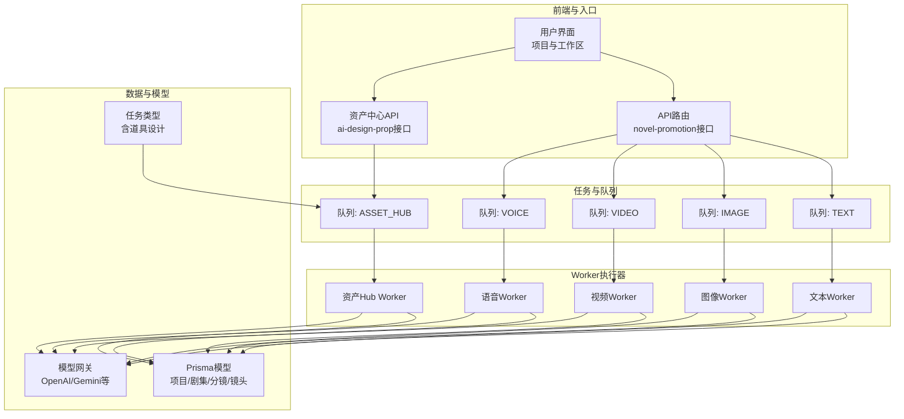
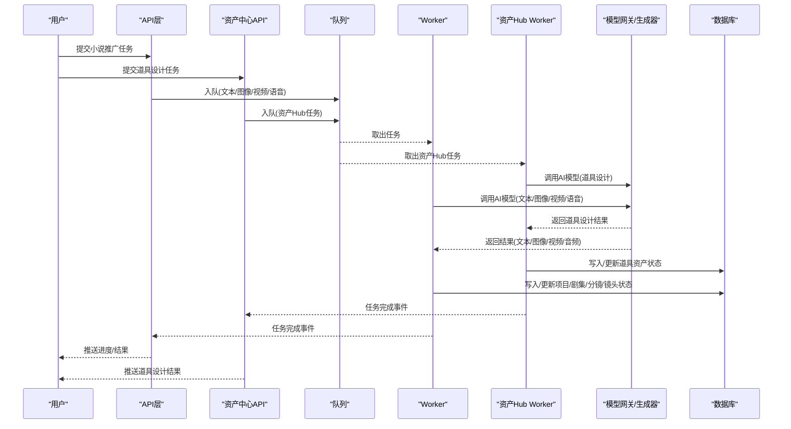
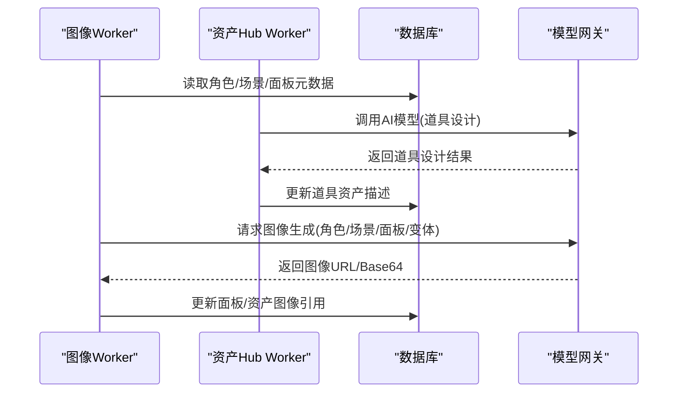
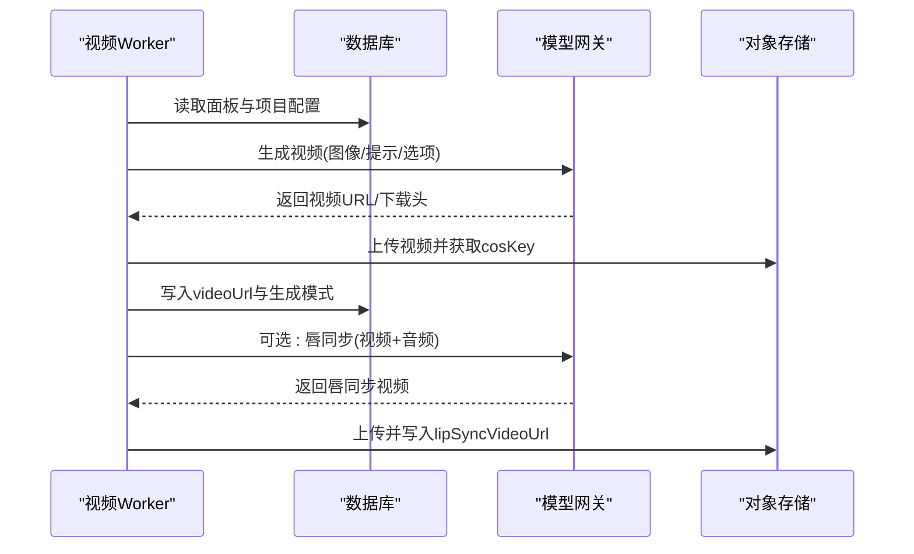
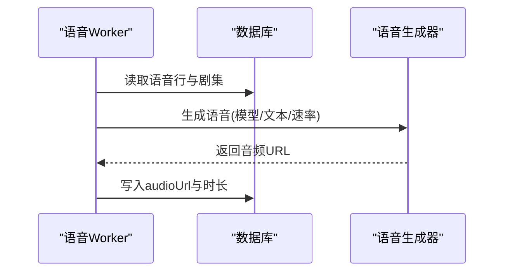
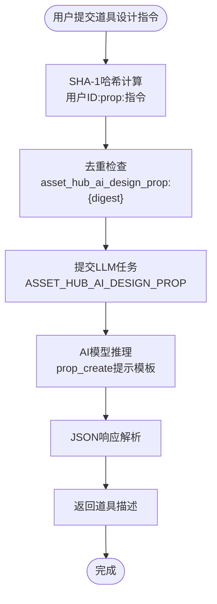
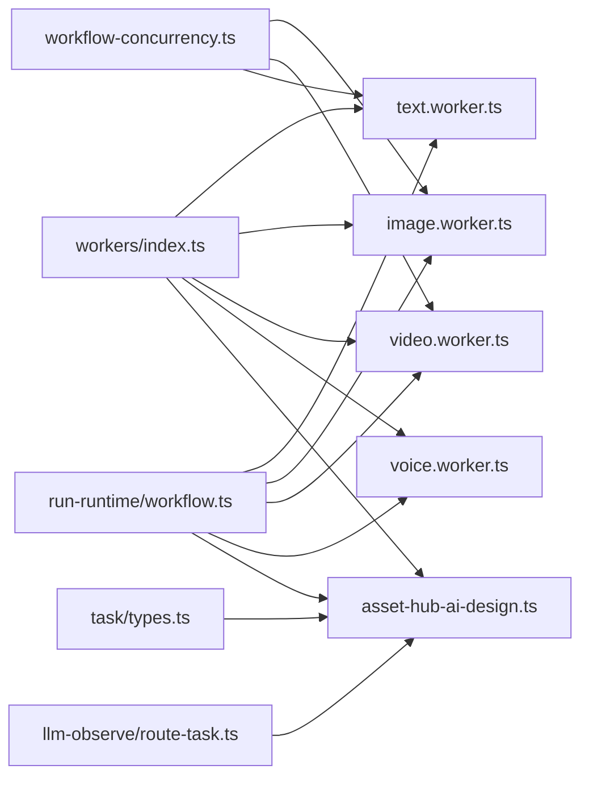

# 小说推广工作流

<cite>
**本文引用的文件**
- [src/lib/workers/index.ts](file://src/lib/workers/index.ts)
- [src/lib/workers/text.worker.ts](file://src/lib/workers/text.worker.ts)
- [src/lib/workers/image.worker.ts](file://src/lib/workers/image.worker.ts)
- [src/lib/workers/video.worker.ts](file://src/lib/workers/video.worker.ts)
- [src/lib/workers/voice.worker.ts](file://src/lib/workers/voice.worker.ts)
- [src/lib/workflow-concurrency.ts](file://src/lib/workflow-concurrency.ts)
- [src/lib/run-runtime/workflow.ts](file://src/lib/run-runtime/workflow.ts)
- [prisma/schema.prisma](file://prisma/schema.prisma)
- [prisma/schema.sqlit.prisma](file://prisma/schema.sqlit.prisma)
- [src/types/project.ts](file://src/types/project.ts)
- [lib/prompts/novel-promotion/agent_storyboard_plan.en.txt](file://lib/prompts/novel-promotion/agent_storyboard_plan.en.txt)
- [lib/prompts/novel-promotion/agent_storyboard_detail.en.txt](file://lib/prompts/novel-promotion/agent_storyboard_detail.en.txt)
- [lib/prompts/novel-promotion/ai_story_expand.en.txt](file://lib/prompts/novel-promotion/ai_story_expand.en.txt)
- [src/lib/model-gateway/index.ts](file://src/lib/model-gateway/index.ts)
- [src/lib/generators/vidu.ts](file://src/lib/generators/vidu.ts)
- [tests/unit/generator-api.test.ts](file://tests/unit/generator-api.test.ts)
- [src/lib/workers/handlers/script-to-storyboard.ts](file://src/lib/workers/handlers/script-to-storyboard.ts)
- [src/lib/workers/text.worker.ts](file://src/lib/workers/text.worker.ts)
- [src/lib/workers/image.worker.ts](file://src/lib/workers/image.worker.ts)
- [src/lib/workers/video.worker.ts](file://src/lib/workers/video.worker.ts)
- [src/lib/workers/voice.worker.ts](file://src/lib/workers/voice.worker.ts)
- [src/app/api/asset-hub/ai-design-prop/route.ts](file://src/app/api/asset-hub/ai-design-prop/route.ts)
- [src/lib/workers/handlers/asset-hub-ai-design.ts](file://src/lib/workers/handlers/asset-hub-ai-design.ts)
- [src/lib/asset-utils/ai-design.ts](file://src/lib/asset-utils/ai-design.ts)
- [src/lib/workers/handlers/modify-description-sync.ts](file://src/lib/workers/handlers/modify-description-sync.ts)
- [src/lib/workers/handlers/shot-ai-prompt-prop.ts](file://src/lib/workers/handlers/shot-ai-prompt-prop.ts)
- [lib/prompts/novel-promotion/prop_create.en.txt](file://lib/prompts/novel-promotion/prop_create.en.txt)
- [lib/prompts/novel-promotion/prop_create.zh.txt](file://lib/prompts/novel-promotion/prop_create.zh.txt)
- [src/components/shared/assets/prop-creation/hooks/usePropCreationSubmit.ts](file://src/components/shared/assets/prop-creation/hooks/usePropCreationSubmit.ts)
- [src/lib/task/types.ts](file://src/lib/task/types.ts)
- [src/lib/llm-observe/route-task.ts](file://src/lib/llm-observe/route-task.ts)
- [tests/unit/worker/asset-hub-ai-design.test.ts](file://tests/unit/worker/asset-hub-ai-design.test.ts)
</cite>

## 更新摘要
**所做更改**
- 新增AI设计道具功能章节，详细说明道具描述自动生成机制
- 更新任务类型定义，添加ASSET_HUB_AI_DESIGN_PROP任务类型
- 新增重复检测和SHA-1哈希机制说明
- 补充道具创建提示模板和相关工作流处理
- 更新资产修改和镜头道具提示处理流程

## 目录
1. [简介](#简介)
2. [项目结构](#项目结构)
3. [核心组件](#核心组件)
4. [架构总览](#架构总览)
5. [详细组件分析](#详细组件分析)
6. [AI设计道具功能](#ai设计道具功能)
7. [依赖关系分析](#依赖关系分析)
8. [性能考量](#性能考量)
9. [故障排查指南](#故障排查指南)
10. [结论](#结论)
11. [附录](#附录)

## 简介
本文件面向Waoowaoo的小说推广自动化工作流，系统性阐述从"文本输入"到"视频输出"的完整流水线，覆盖文本分析、分镜生成、图像生成、视频合成与音频处理五大阶段。文档同时解释AI模型选择与调用策略（OpenAI、Gemini等兼容通道）、参数配置与质量控制机制，并提供可操作的使用场景、错误处理与重试策略、性能优化建议及最佳实践。

**更新** 本次更新重点增加了AI设计道具功能的详细说明，包括通过LLM任务自动生成道具描述、重复检测机制和SHA-1哈希处理。

## 项目结构
该工作流以"任务驱动 + 多队列并行"的方式组织，分为文本、图像、视频、语音四类Worker，分别处理不同阶段的任务；项目数据库采用Prisma管理，配套任务类型与并发控制模块支撑整体运行。

**图表来源**
- [src/lib/workers/index.ts](file://src/lib/workers/index.ts)
- [src/lib/workers/text.worker.ts](file://src/lib/workers/text.worker.ts)
- [src/lib/workers/image.worker.ts](file://src/lib/workers/image.worker.ts)
- [src/lib/workers/video.worker.ts](file://src/lib/workers/video.worker.ts)
- [src/lib/workers/voice.worker.ts](file://src/lib/workers/voice.worker.ts)
- [src/lib/workers/handlers/asset-hub-ai-design.ts](file://src/lib/workers/handlers/asset-hub-ai-design.ts)
- [prisma/schema.prisma](file://prisma/schema.prisma)
- [src/lib/task/types.ts](file://src/lib/task/types.ts)

**章节来源**
- [src/lib/workers/index.ts](file://src/lib/workers/index.ts)
- [prisma/schema.prisma](file://prisma/schema.prisma)
- [src/lib/task/types.ts](file://src/lib/task/types.ts)

## 核心组件
- 任务与并发控制
  - 工作流并发配置：支持独立配置分析、图像、视频三类任务的并发上限，并对非法值进行归一化处理。
  - 任务类型判定：区分AI类任务与非AI任务，便于统一调度与计费。
  - **新增** 资产Hub任务类型：包含角色、场景、道具的AI设计和修改任务。
- 数据模型
  - 小说推广项目模型包含分析/图像/角色/场景/分镜/编辑/视频/语音等模型键，以及画幅、分辨率、TTS速率、工作流模式、风格提示等关键字段。
- Worker与队列
  - 文本Worker：负责故事扩展、剧本转换、分镜计划与细化、角色/场景/道具资产设计与修改、语音分析、剪辑片段构建等。
  - 图像Worker：负责角色/场景/面板图像生成与变体生成、资产修改与图库批量处理。
  - 视频Worker：负责单面板视频生成、首尾帧模式、唇同步、结果持久化与上传。
  - 语音Worker：负责配音生成与语音设计。
  - **新增** 资产Hub Worker：专门处理资产中心的AI设计任务，包括去重检测和进度报告。
- 模型网关与生成器
  - 统一OpenAI兼容通道，按模型键路由至官方或兼容提供方；部分视频生成器支持选项校验与默认值。

**章节来源**
- [src/lib/workflow-concurrency.ts](file://src/lib/workflow-concurrency.ts)
- [src/lib/run-runtime/workflow.ts](file://src/lib/run-runtime/workflow.ts)
- [prisma/schema.prisma](file://prisma/schema.prisma)
- [prisma/schema.sqlit.prisma](file://prisma/schema.sqlit.prisma)
- [src/lib/workers/text.worker.ts](file://src/lib/workers/text.worker.ts)
- [src/lib/workers/image.worker.ts](file://src/lib/workers/image.worker.ts)
- [src/lib/workers/video.worker.ts](file://src/lib/workers/video.worker.ts)
- [src/lib/workers/voice.worker.ts](file://src/lib/workers/voice.worker.ts)
- [src/lib/workers/handlers/asset-hub-ai-design.ts](file://src/lib/workers/handlers/asset-hub-ai-design.ts)
- [src/lib/model-gateway/index.ts](file://src/lib/model-gateway/index.ts)
- [src/lib/generators/vidu.ts](file://src/lib/generators/vidu.ts)

## 架构总览
下图展示从文本输入到视频输出的关键交互路径，包括任务提交、Worker执行、模型调用与数据持久化。

**图表来源**
- [src/lib/workers/text.worker.ts](file://src/lib/workers/text.worker.ts)
- [src/lib/workers/image.worker.ts](file://src/lib/workers/image.worker.ts)
- [src/lib/workers/video.worker.ts](file://src/lib/workers/video.worker.ts)
- [src/lib/workers/voice.worker.ts](file://src/lib/workers/voice.worker.ts)
- [src/lib/workers/handlers/asset-hub-ai-design.ts](file://src/lib/workers/handlers/asset-hub-ai-design.ts)
- [src/lib/model-gateway/index.ts](file://src/lib/model-gateway/index.ts)
- [prisma/schema.prisma](file://prisma/schema.prisma)

## 详细组件分析

### 文本分析与分镜生成
- 阶段划分
  - 阶段1：分镜计划（基于剪辑片段与角色/场景/道具库生成初始面板序列）。
  - 阶段2：摄影规则（镜头语言、灯光、色调、氛围等）。
  - 阶段3：表演指导（角色动作、走位、情绪表达）。
  - 细节细化：在保持语义一致的前提下，增强画面细节与动作提示。
- 关键提示模板
  - 分镜计划模板：要求严格的时间顺序、避免遗漏关键情节、使用具体可见动作、保留可用位置锚点等。
  - 细节细化模板：强调动作提示的"可运动化"，保留稳定位置锚点，必要时允许移除或自由放置。
  - 故事扩展模板：将关键词/大纲扩展为适合1-2分钟短剧的完整故事，限定字数范围与格式要求。
- 并发与流式回调
  - 文本Worker对各阶段采用并行执行与流式回调，实时上报进度与推理/输出片段。
- 任务编排
  - ScriptToStoryboard任务会读取选定剪辑片段与资产库，组装提示模板并触发多阶段推理。

**图表来源**
- [src/lib/workers/handlers/script-to-storyboard.ts](file://src/lib/workers/handlers/script-to-storyboard.ts)
- [lib/prompts/novel-promotion/agent_storyboard_plan.en.txt](file://lib/prompts/novel-promotion/agent_storyboard_plan.en.txt)
- [lib/prompts/novel-promotion/agent_storyboard_detail.en.txt](file://lib/prompts/novel-promotion/agent_storyboard_detail.en.txt)
- [lib/prompts/novel-promotion/ai_story_expand.en.txt](file://lib/prompts/novel-promotion/ai_story_expand.en.txt)
- [src/lib/workers/text.worker.ts](file://src/lib/workers/text.worker.ts)

**章节来源**
- [src/lib/workers/text.worker.ts](file://src/lib/workers/text.worker.ts)
- [src/lib/workers/handlers/script-to-storyboard.ts](file://src/lib/workers/handlers/script-to-storyboard.ts)
- [lib/prompts/novel-promotion/agent_storyboard_plan.en.txt](file://lib/prompts/novel-promotion/agent_storyboard_plan.en.txt)
- [lib/prompts/novel-promotion/agent_storyboard_detail.en.txt](file://lib/prompts/novel-promotion/agent_storyboard_detail.en.txt)
- [lib/prompts/novel-promotion/ai_story_expand.en.txt](file://lib/prompts/novel-promotion/ai_story_expand.en.txt)

### 图像生成与资产处理
- 资产类型
  - 角色：支持外观描述、多形象切换与选择索引。
  - 场景：支持多图与可用位置槽位，用于镜头布置锚点。
  - 道具：作为场景内可选元素参与分镜，支持AI设计和修改。
- Worker职责
  - 角色/场景/面板图像生成与面板变体生成。
  - 资产修改与图库批量处理。
  - **新增** 道具资产的AI设计和描述修改。
- 并发控制
  - 基于用户维度的并发门控，防止资源争用导致超卖或延迟放大。

**图表来源**
- [src/lib/workers/image.worker.ts](file://src/lib/workers/image.worker.ts)
- [src/lib/workers/handlers/asset-hub-ai-design.ts](file://src/lib/workers/handlers/asset-hub-ai-design.ts)
- [src/lib/model-gateway/index.ts](file://src/lib/model-gateway/index.ts)
- [prisma/schema.prisma](file://prisma/schema.prisma)

**章节来源**
- [src/lib/workers/image.worker.ts](file://src/lib/workers/image.worker.ts)
- [src/lib/workers/handlers/asset-hub-ai-design.ts](file://src/lib/workers/handlers/asset-hub-ai-design.ts)
- [prisma/schema.prisma](file://prisma/schema.prisma)

### 视频合成与音频处理
- 单面板视频生成
  - 输入：面板图像URL（支持签名直链）、视频模型键、生成选项（如画幅、是否生音轨、首尾帧等）。
  - 流程：解析生成选项、构造请求、调用模型网关、下载/上传、持久化cosKey与生成模式。
- 首尾帧模式
  - 通过首帧与指定尾帧生成过渡，需目标模型支持首尾帧能力。
- 唇同步
  - 以视频与对应语音片段为输入，生成带口型同步的视频并持久化。
- 模型路由与兼容
  - 对Gemini兼容视频与官方视频请求进行路由，确保正确调用提供方生成器。

**图表来源**
- [src/lib/workers/video.worker.ts](file://src/lib/workers/video.worker.ts)
- [src/lib/model-gateway/index.ts](file://src/lib/model-gateway/index.ts)
- [src/lib/generators/vidu.ts](file://src/lib/generators/vidu.ts)
- [tests/unit/generator-api.test.ts](file://tests/unit/generator-api.test.ts)

**章节来源**
- [src/lib/workers/video.worker.ts](file://src/lib/workers/video.worker.ts)
- [src/lib/generators/vidu.ts](file://src/lib/generators/vidu.ts)
- [tests/unit/generator-api.test.ts](file://tests/unit/generator-api.test.ts)

### 语音生成与设计
- 语音行生成
  - 根据剧集与语音行ID，调用语音生成器返回音频并持久化。
- 语音设计
  - 支持角色声音风格设计与批量生成。

**图表来源**
- [src/lib/workers/voice.worker.ts](file://src/lib/workers/voice.worker.ts)
- [prisma/schema.prisma](file://prisma/schema.prisma)

**章节来源**
- [src/lib/workers/voice.worker.ts](file://src/lib/workers/voice.worker.ts)
- [prisma/schema.prisma](file://prisma/schema.prisma)

## AI设计道具功能

### 功能概述
AI设计道具功能通过LLM任务自动生成道具的视觉描述，支持重复检测和SHA-1哈希机制，确保相同指令不会重复执行。

### 核心流程
1. **用户提交**：用户通过API提交道具设计指令
2. **去重检测**：使用SHA-1哈希生成去重密钥
3. **任务提交**：通过LLM观察系统提交异步任务
4. **模型调用**：AI模型生成道具描述
5. **结果返回**：返回JSON格式的道具描述

**图表来源**
- [src/app/api/asset-hub/ai-design-prop/route.ts](file://src/app/api/asset-hub/ai-design-prop/route.ts)
- [src/lib/workers/handlers/asset-hub-ai-design.ts](file://src/lib/workers/handlers/asset-hub-ai-design.ts)
- [src/lib/asset-utils/ai-design.ts](file://src/lib/asset-utils/ai-design.ts)

### 重复检测机制
- **哈希算法**：使用SHA-1算法对"用户ID:prop:指令"进行哈希
- **截断处理**：取哈希值的前16个字符作为去重密钥
- **存储格式**：`asset_hub_ai_design_prop:{dedupeDigest}`
- **去重效果**：相同用户对相同指令的重复请求会被识别为重复任务

### 任务处理流程
- **API层**：接收用户指令，生成去重密钥，提交LLM任务
- **Worker层**：处理资产Hub AI设计任务，调用AI模型
- **资产工具**：统一的AI设计接口，支持多种资产类型
- **提示模板**：专用的道具创建提示模板，确保输出格式

### 前端集成
- **表单组件**：支持AI设计和参考图描述提取
- **状态管理**：跟踪AI设计、描述提取和提交状态
- **错误处理**：统一的错误提示和重试机制
- **自动填充**：参考图模式下自动提取描述

**章节来源**
- [src/app/api/asset-hub/ai-design-prop/route.ts](file://src/app/api/asset-hub/ai-design-prop/route.ts)
- [src/lib/workers/handlers/asset-hub-ai-design.ts](file://src/lib/workers/handlers/asset-hub-ai-design.ts)
- [src/lib/asset-utils/ai-design.ts](file://src/lib/asset-utils/ai-design.ts)
- [src/components/shared/assets/prop-creation/hooks/usePropCreationSubmit.ts](file://src/components/shared/assets/prop-creation/hooks/usePropCreationSubmit.ts)
- [lib/prompts/novel-promotion/prop_create.en.txt](file://lib/prompts/novel-promotion/prop_create.en.txt)
- [lib/prompts/novel-promotion/prop_create.zh.txt](file://lib/prompts/novel-promotion/prop_create.zh.txt)

## 依赖关系分析
- Worker启动与生命周期
  - 启动四个Worker实例，监听各自队列，注册ready/error/failed事件，统一记录日志与关闭流程。
  - **新增** 资产Hub Worker专门处理AI设计任务。
- 任务类型与AI任务判定
  - 所有任务类型集合均视为AI任务，便于统一计费与资源统计。
  - **新增** ASSET_HUB_AI_DESIGN_PROP任务类型。
- 并发与限流
  - 用户级并发门控结合全局并发配置，避免过载与抖动。
- 数据模型耦合
  - 小说推广项目模型与剪辑、分镜、镜头、角色、场景、道具等实体强关联，形成闭环的数据流转。
- **新增** 资产Hub任务路由
  - 通过LLM观察系统统一处理资产Hub任务，支持去重和进度报告。

**图表来源**
- [src/lib/workers/index.ts](file://src/lib/workers/index.ts)
- [src/lib/run-runtime/workflow.ts](file://src/lib/run-runtime/workflow.ts)
- [src/lib/workflow-concurrency.ts](file://src/lib/workflow-concurrency.ts)
- [src/lib/task/types.ts](file://src/lib/task/types.ts)
- [src/lib/llm-observe/route-task.ts](file://src/lib/llm-observe/route-task.ts)

**章节来源**
- [src/lib/workers/index.ts](file://src/lib/workers/index.ts)
- [src/lib/run-runtime/workflow.ts](file://src/lib/run-runtime/workflow.ts)
- [src/lib/workflow-concurrency.ts](file://src/lib/workflow-concurrency.ts)
- [src/lib/task/types.ts](file://src/lib/task/types.ts)
- [src/lib/llm-observe/route-task.ts](file://src/lib/llm-observe/route-task.ts)

## 性能考量
- 并发配置
  - 分析/图像/视频三类任务可独立设置并发上限，建议根据模型吞吐与硬件资源动态调整。
  - 对非法值进行归一化处理，保证稳定性。
  - **新增** 资产Hub任务的独立并发控制。
- 流式回调与进度上报
  - 文本Worker对推理过程进行分片上报，降低端到端等待时间，提升可观测性。
  - **新增** 资产Hub任务的阶段化进度报告。
- 任务拆分与并行
  - 分镜生成阶段采用多阶段并行，缩短关键路径。
  - **新增** 道具设计任务的异步处理，避免阻塞主线程。
- 存储与网络
  - 视频/图像生成后统一上传对象存储，减少中间态体积与跨域风险。
  - **新增** 道具设计结果的缓存机制。
- 模型路由优化
  - 明确官方与兼容通道的路由策略，避免重复适配成本。
- **新增** 去重机制优化
  - SHA-1哈希计算开销较小，但能显著减少重复任务执行。
  - 去重密钥格式标准化，便于维护和调试。

**章节来源**
- [src/lib/workflow-concurrency.ts](file://src/lib/workflow-concurrency.ts)
- [src/lib/workers/text.worker.ts](file://src/lib/workers/text.worker.ts)
- [src/lib/workers/video.worker.ts](file://src/lib/workers/video.worker.ts)
- [src/lib/workers/handlers/asset-hub-ai-design.ts](file://src/lib/workers/handlers/asset-hub-ai-design.ts)

## 故障排查指南
- 常见错误与定位
  - 缺少必需模型键：如视频/语音/分析模型未配置，任务将直接报错。
  - 面板缺失图像/视频提示：生成视频前需确保面板存在有效图像与提示词。
  - 首尾帧模型不支持：若目标模型不支持首尾帧能力，将抛出不支持错误。
  - 语音行缺失：唇同步需要有效的语音行与音频URL。
  - **新增** 道具设计失败：检查用户指令格式、模型配置和去重机制。
- 日志与事件
  - Worker统一记录ready/error/failed事件，失败任务包含任务ID、类型、错误信息，便于快速定位。
  - **新增** 资产Hub任务的详细进度日志。
- 重试与补偿
  - 建议在上层API或任务运行时增加幂等与重试策略，结合任务状态机进行补偿。
  - **新增** 道具设计任务的去重处理，避免重复执行。
- 参数校验
  - 视频生成器对选项进行严格校验（如generateAudio类型、audioType取值），不符合将抛出明确错误。
  - **新增** 道具设计指令的格式验证和长度限制。

**章节来源**
- [src/lib/workers/text.worker.ts](file://src/lib/workers/text.worker.ts)
- [src/lib/workers/image.worker.ts](file://src/lib/workers/image.worker.ts)
- [src/lib/workers/video.worker.ts](file://src/lib/workers/video.worker.ts)
- [src/lib/workers/voice.worker.ts](file://src/lib/workers/voice.worker.ts)
- [src/lib/workers/handlers/asset-hub-ai-design.ts](file://src/lib/workers/handlers/asset-hub-ai-design.ts)
- [src/lib/generators/vidu.ts](file://src/lib/generators/vidu.ts)

## 结论
该工作流以任务队列为纽带，串联文本、图像、视频、语音四大阶段，配合严格的模型路由、参数校验与并发控制，实现了从小说到视频的自动化生产。通过提示模板与多阶段推理，确保画面细节与叙事节奏的一致性；通过流式回调与进度上报，显著提升用户体验与可观测性。

**更新** 新增的AI设计道具功能进一步增强了工作流的智能化水平，通过LLM任务自动生成道具描述，结合重复检测和SHA-1哈希机制，确保了系统的高效性和稳定性。建议在生产环境中结合业务负载动态调整并发配置，并完善重试与补偿策略以提升稳定性。

## 附录

### 关键数据模型与字段
- 小说推广项目模型（关键字段）
  - 分析/图像/视频/语音模型键
  - 画幅(videoRatio)/分辨率(videoResolution)/TTS速率(ttsRate)
  - 工作流模式(workflowMode)/艺术风格(artStyle)/风格提示(artStylePrompt)
  - 角色/场景/道具资产列表
  - 剧集/剪辑/分镜/镜头实体
- **新增** 资产Hub任务模型
  - 任务类型：ASSET_HUB_AI_DESIGN_PROP
  - 去重密钥格式：asset_hub_ai_design_prop:{16-char-digest}
  - 资产类型：prop
  - 项目ID：global-asset-hub

**章节来源**
- [prisma/schema.prisma](file://prisma/schema.prisma)
- [prisma/schema.sqlit.prisma](file://prisma/schema.sqlit.prisma)
- [src/types/project.ts](file://src/types/project.ts)
- [src/lib/task/types.ts](file://src/lib/task/types.ts)

### AI模型选择与调用策略
- OpenAI兼容通道
  - 通过模型网关统一路由，自动识别官方与兼容提供方，保障一致性。
- Gemini兼容视频
  - 单元测试验证了Gemini兼容视频与官方视频的路由差异，确保正确调用。
- 生成器选项校验
  - 视频生成器对选项进行严格校验与默认值处理，避免无效参数导致失败。
- **新增** 资产设计模型策略
  - 统一使用分析模型进行资产设计
  - 支持用户配置覆盖和任务负载
  - 跳过计费处理，提高响应速度

**章节来源**
- [src/lib/model-gateway/index.ts](file://src/lib/model-gateway/index.ts)
- [tests/unit/generator-api.test.ts](file://tests/unit/generator-api.test.ts)
- [src/lib/generators/vidu.ts](file://src/lib/generators/vidu.ts)
- [src/lib/asset-utils/ai-design.ts](file://src/lib/asset-utils/ai-design.ts)

### 道具设计提示模板
- **英文模板**：要求生成50-120词的道具视觉描述，排除人物、场景等元素
- **中文模板**：要求生成60-120字的道具视觉描述，适合白底居中出图
- **输出格式**：严格JSON格式，所有引号需转义为中文引号
- **材质要求**：必须具体化材质描述，如"深棕色做旧皮革"

**章节来源**
- [lib/prompts/novel-promotion/prop_create.en.txt](file://lib/prompts/novel-promotion/prop_create.en.txt)
- [lib/prompts/novel-promotion/prop_create.zh.txt](file://lib/prompts/novel-promotion/prop_create.zh.txt)

### 任务类型对照表
- 文本任务：ANALYZE_NOVEL, STORY_TO_SCRIPT_RUN, SCRIPT_TO_STORYBOARD_RUN
- 图像任务：IMAGE_CHARACTER, IMAGE_LOCATION, IMAGE_PANEL
- 视频任务：VIDEO_PANEL, LIP_SYNC
- 语音任务：VOICE_LINE, VOICE_DESIGN
- **新增** 资产Hub任务：
  - ASSET_HUB_AI_DESIGN_CHARACTER
  - ASSET_HUB_AI_DESIGN_LOCATION  
  - ASSET_HUB_AI_DESIGN_PROP
  - ASSET_HUB_AI_MODIFY_CHARACTER
  - ASSET_HUB_AI_MODIFY_LOCATION
  - ASSET_HUB_AI_MODIFY_PROP

**章节来源**
- [src/lib/task/types.ts](file://src/lib/task/types.ts)
- [tests/unit/worker/asset-hub-ai-design.test.ts](file://tests/unit/worker/asset-hub-ai-design.test.ts)