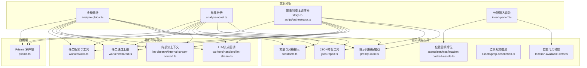
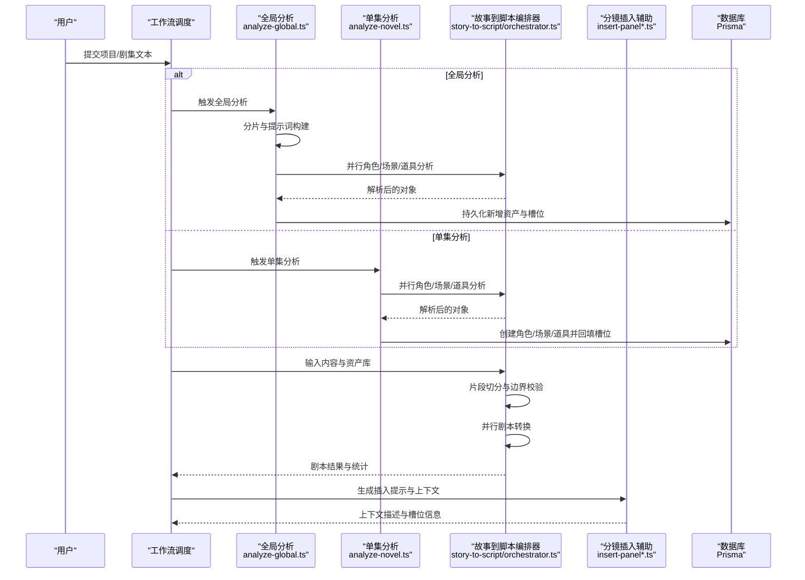
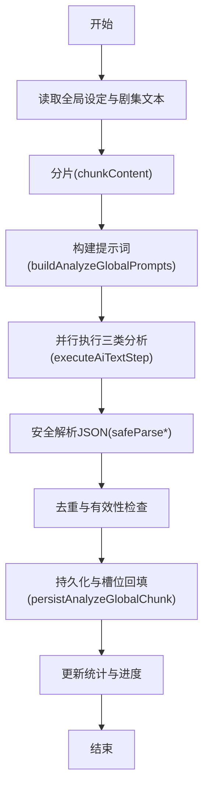
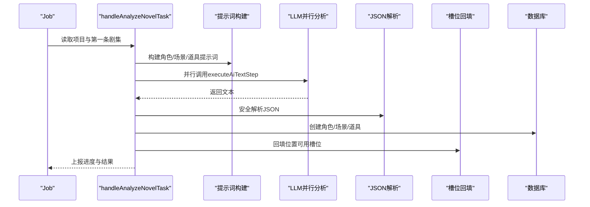
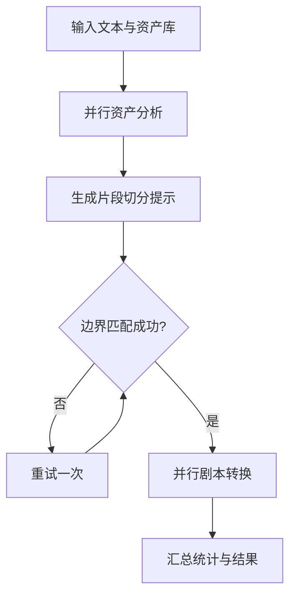
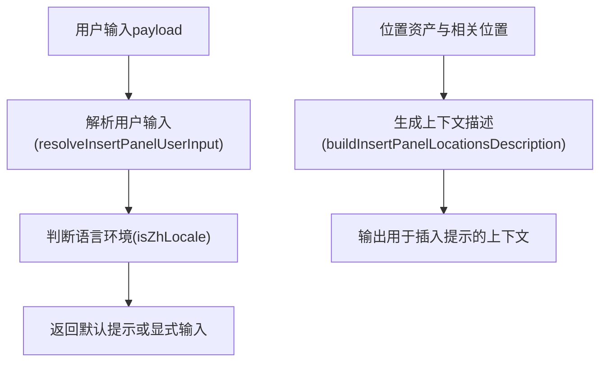
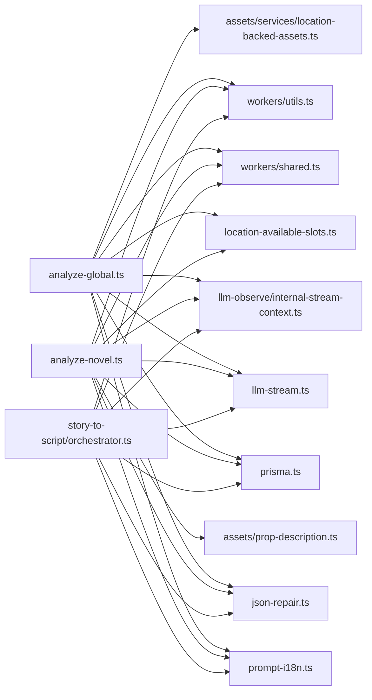

# 文本分析模块

<cite>
**本文引用的文件**
- [src/lib/novel-promotion/insert-panel-prompt-context.ts](file://src/lib/novel-promotion/insert-panel-prompt-context.ts)
- [src/lib/novel-promotion/insert-panel.ts](file://src/lib/novel-promotion/insert-panel.ts)
- [src/lib/workers/handlers/analyze-novel.ts](file://src/lib/workers/handlers/analyze-novel.ts)
- [src/lib/workers/handlers/analyze-global.ts](file://src/lib/workers/handlers/analyze-global.ts)
- [src/lib/workers/handlers/analyze-global-parse.ts](file://src/lib/workers/handlers/analyze-global-parse.ts)
- [src/lib/workers/handlers/analyze-global-prompt.ts](file://src/lib/workers/handlers/analyze-global-prompt.ts)
- [src/lib/workers/handlers/analyze-global-persist.ts](file://src/lib/workers/handlers/analyze-global-persist.ts)
- [src/lib/novel-promotion/story-to-script/orchestrator.ts](file://src/lib/novel-promotion/story-to-script/orchestrator.ts)
- [src/lib/workers/handlers/screenplay-convert.ts](file://src/lib/workers/handlers/screenplay-convert.ts)
- [src/lib/workers/handlers/screenplay-convert-helpers.ts](file://src/lib/workers/handlers/screenplay-convert-helpers.ts)
- [src/lib/workers/handlers/llm-stream.ts](file://src/lib/workers/handlers/llm-stream.ts)
- [src/lib/workers/shared.ts](file://src/lib/workers/shared.ts)
- [src/lib/workers/utils.ts](file://src/lib/workers/utils.ts)
- [src/lib/prompt-i18n.ts](file://src/lib/prompt-i18n.ts)
- [src/lib/constants.ts](file://src/lib/constants.ts)
- [src/lib/json-repair.ts](file://src/lib/json-repair.ts)
- [src/lib/location-available-slots.ts](file://src/lib/location-available-slots.ts)
- [src/lib/assets/prop-description.ts](file://src/lib/assets/prop-description.ts)
- [src/lib/assets/services/location-backed-assets.ts](file://src/lib/assets/services/location-backed-assets.ts)
- [src/lib/llm-observe/internal-stream-context.ts](file://src/lib/llm-observe/internal-stream-context.ts)
- [src/lib/ai-runtime/index.ts](file://src/lib/ai-runtime/index.ts)
- [src/lib/prisma.ts](file://src/lib/prisma.ts)
- [src/types/storyboard-types.ts](file://src/types/storyboard-types.ts)
- [src/lib/storyboard-phases.ts](file://src/lib/storyboard-phases.ts)
- [src/lib/workers/handlers/script-to-storyboard.ts](file://src/lib/workers/handlers/script-to-storyboard.ts)
- [src/lib/workers/handlers/script-to-storyboard-helpers.ts](file://src/lib/workers/handlers/script-to-storyboard-helpers.ts)
- [src/lib/workers/handlers/script-to-storyboard-atomic-retry.ts](file://src/lib/workers/handlers/script-to-storyboard-atomic-retry.ts)
- [src/lib/workers/handlers/voice-analyze.ts](file://src/lib/workers/handlers/voice-analyze.ts)
- [src/lib/workers/handlers/voice-analyze-helpers.ts](file://src/lib/workers/handlers/voice-analyze-helpers.ts)
- [src/lib/workflow-concurrency.ts](file://src/lib/workflow-concurrency.ts)
- [src/lib/async/map-with-concurrency.ts](file://src/lib/async/map-with-concurrency.ts)
- [src/lib/errors/normalize.ts](file://src/lib/errors/normalize.ts)
- [src/lib/logging/core.ts](file://src/lib/logging/core.ts)
- [src/lib/novel-promotion/panel-ai-data-sync.ts](file://src/lib/novel-promotion/panel-ai-data-sync.ts)
- [src/lib/novel-promotion/stage-readiness.ts](file://src/lib/novel-promotion/stage-readiness.ts)
- [src/lib/novel-promotion/stories/episode-marker-detector.ts](file://src/lib/novel-promotion/stories/episode-marker-detector.ts)
- [src/lib/novel-promotion/stories/word-count.ts](file://src/lib/novel-promotion/stories/word-count.ts)
- [src/lib/novel-promotion/stories/long-text-detection.ts](file://src/lib/novel-promotion/stories/long-text-detection.ts)
- [src/lib/novel-promotion/stories/story-input-composer.ts](file://src/lib/novel-promotion/stories/story-input-composer.ts)
- [src/lib/novel-promotion/stories/LongTextDetectionPrompt.ts](file://src/lib/novel-promotion/stories/LongTextDetectionPrompt.ts)
- [src/lib/novel-promotion/stories/TypewriterHero.ts](file://src/lib/novel-promotion/stories/TypewriterHero.ts)
- [src/lib/novel-promotion/stories/AiWriteModal.ts](file://src/lib/novel-promotion/stories/AiWriteModal.ts)
- [src/lib/novel-promotion/stories/character-profile.ts](file://src/lib/novel-promotion/stories/character-profile.ts)
- [src/lib/novel-promotion/stories/character-voice.ts](file://src/lib/novel-promotion/stories/character-voice.ts)
- [src/lib/novel-promotion/stories/character-voice-mutations.ts](file://src/lib/novel-promotion/stories/character-voice-mutations.ts)
- [src/lib/novel-promotion/stories/voice-stage-runtime-core.tsx](file://src/lib/novel-promotion/stories/voice-stage-runtime-core.tsx)
- [src/lib/novel-promotion/stories/video-stage-runtime-core.tsx](file://src/lib/novel-promotion/stories/video-stage-runtime-core.tsx)
- [src/lib/novel-promotion/stories/video-stage-runtime/useVideoStageUiState.ts](file://src/lib/novel-promotion/stories/video-stage-runtime/useVideoStageUiState.ts)
- [src/lib/novel-promotion/stories/video-stage-runtime/useVideoPanelsProjection.ts](file://src/lib/novel-promotion/stories/video-stage-runtime/useVideoPanelsProjection.ts)
- [src/lib/novel-promotion/stories/video-stage-runtime/useVideoTaskStates.ts](file://src/lib/novel-promotion/stories/video-stage-runtime/useVideoTaskStates.ts)
- [src/lib/novel-promotion/stories/video-stage-runtime/useVideoPromptState.ts](file://src/lib/novel-promotion/stories/video-stage-runtime/useVideoPromptState.ts)
- [src/lib/novel-promotion/stories/video-stage-runtime/useVideoPanelLinking.ts](file://src/lib/novel-promotion/stories/video-stage-runtime/useVideoPanelLinking.ts)
- [src/lib/novel-promotion/stories/video-stage-runtime/useVideoPanelViewport.ts](file://src/lib/novel-promotion/stories/video-stage-runtime/useVideoPanelViewport.ts)
- [src/lib/novel-promotion/stories/video-stage-runtime/useVideoDownloadAll.ts](file://src/lib/novel-promotion/stories/video-stage-runtime/useVideoDownloadAll.ts)
- [src/lib/novel-promotion/stories/video-stage-runtime/useVideoFirstLastFrameFlow.ts](file://src/lib/novel-promotion/stories/video-stage-runtime/useVideoFirstLastFrameFlow.ts)
- [src/lib/novel-promotion/stories/video-stage-runtime/useVideoVoiceLines.ts](file://src/lib/novel-promotion/stories/video-stage-runtime/useVideoVoiceLines.ts)
- [src/lib/novel-promotion/stories/voice-stage-runtime/useVoiceStageDataLoader.ts](file://src/lib/novel-promotion/stories/voice-stage-runtime/useVoiceStageDataLoader.ts)
- [src/lib/novel-promotion/stories/voice-stage-runtime/useVoiceRuntimeSync.ts](file://src/lib/novel-promotion/stories/voice-stage-runtime/useVoiceRuntimeSync.ts)
- [src/lib/novel-promotion/stories/voice-stage-runtime/useVoiceTaskState.ts](file://src/lib/novel-promotion/stories/voice-stage-runtime/useVoiceTaskState.ts)
- [src/lib/novel-promotion/stories/voice-stage-runtime/useVoiceLineBindings.ts](file://src/lib/novel-promotion/stories/voice-stage-runtime/useVoiceLineBindings.ts)
- [src/lib/novel-promotion/stories/voice-stage-runtime/useVoiceLineCrudActions.ts](file://src/lib/novel-promotion/stories/voice-stage-runtime/useVoiceLineCrudActions.ts)
- [src/lib/novel-promotion/stories/voice-stage-runtime/useVoiceLineEditorState.ts](file://src/lib/novel-promotion/stories/voice-stage-runtime/useVoiceLineEditorState.ts)
- [src/lib/novel-promotion/stories/voice-stage-runtime/useVoicePlayback.ts](file://src/lib/novel-promotion/stories/voice-stage-runtime/useVoicePlayback.ts)
- [src/lib/novel-promotion/stories/voice-stage-runtime/useVoiceGenerationActions.ts](file://src/lib/novel-promotion/stories/voice-stage-runtime/useVoiceGenerationActions.ts)
- [src/lib/novel-promotion/stories/voice-stage-runtime/useVoiceSpeakerState.ts](file://src/lib/novel-promotion/stories/voice-stage-runtime/useVoiceSpeakerState.ts)
- [src/lib/novel-promotion/stories/voice-stage-runtime/useBindablePanelOptions.ts](file://src/lib/novel-promotion/stories/voice-stage-runtime/useBindablePanelOptions.ts)
- [src/lib/novel-promotion/stories/voice-stage-runtime/useSpeakerAssetNavigation.ts](file://src/lib/novel-promotion/stories/voice-stage-runtime/useSpeakerAssetNavigation.ts)
- [src/lib/novel-promotion/stories/video-stage-runtime/immediate-video-submission.ts](file://src/lib/novel-promotion/stories/video-stage-runtime/immediate-video-submission.ts)
- [src/lib/novel-promotion/stories/video-stage-runtime/task-targets.ts](file://src/lib/novel-promotion/stories/video-stage-runtime/task-targets.ts)
- [src/lib/novel-promotion/stories/video-stage-runtime/types.ts](file://src/lib/novel-promotion/stories/video-stage-runtime/types.ts)
- [src/lib/novel-promotion/stories/video-stage-runtime/utils.ts](file://src/lib/novel-promotion/stories/video-stage-runtime/utils.ts)
- [src/lib/novel-promotion/stories/voice-stage-runtime/types.ts](file://src/lib/novel-promotion/stories/voice-stage-runtime/types.ts)
- [src/lib/novel-promotion/stories/voice-stage-runtime/utils.ts](file://src/lib/novel-promotion/stories/voice-stage-runtime/utils.ts)
- [src/lib/novel-promotion/stories/stage-readiness.ts](file://src/lib/novel-promotion/stories/stage-readiness.ts)
- [src/lib/novel-promotion/stories/panel-ai-data-sync.ts](file://src/lib/novel-promotion/stories/panel-ai-data-sync.ts)
- [src/lib/novel-promotion/stories/insert-panel.ts](file://src/lib/novel-promotion/stories/insert-panel.ts)
- [src/lib/novel-promotion/stories/insert-panel-prompt-context.ts](file://src/lib/novel-promotion/stories/insert-panel-prompt-context.ts)
- [src/lib/novel-promotion/stories/insert-panel-user-input.ts](file://src/lib/novel-promotion/stories/insert-panel-user-input.ts)
- [src/lib/novel-promotion/stories/insert-panel-variant.ts](file://src/lib/novel-promotion/stories/insert-panel-variant.ts)
- [src/lib/novel-promotion/stories/insert-panel-variant-prompt-context.ts](file://src/lib/novel-promotion/stories/insert-panel-variant-prompt-context.ts)
- [src/lib/novel-promotion/stories/insert-panel-variant-user-input.ts](file://src/lib/novel-promotion/stories/insert-panel-variant-user-input.ts)
- [src/lib/novel-promotion/stories/insert-panel-variant-user-input.ts](file://src/lib/novel-promotion/stories/insert-panel-variant-user-input.ts)
- [src/lib/novel-promotion/stories/insert-panel-variant-user-input.ts](file://src/lib/novel-promotion/stories/insert-panel-variant-user-input.ts)
- [src/lib/novel-promotion/stories/insert-panel-variant-user-input.ts](file://src/lib/novel-promotion/stories/insert-panel-variant-user-input.ts)
- [src/lib/novel-promotion/stories/insert-panel-variant-user-input.ts](file://src/lib/novel-promotion/stories/insert-panel-variant-user-input.ts)
- [src/lib/novel-promotion/stories/insert-panel-variant-user-input.ts](file://src/lib/novel-promotion/stories/insert-panel-variant-user-input.ts)
- [src/lib/novel-promotion/stories/insert-panel-variant-user-input.ts](file://src/lib/novel-promotion/stories/insert-panel-variant-user-input.ts)
- [src/lib/novel-promotion/stories/insert-panel-variant-user-input.ts](file://src/lib/novel-promotion/stories/insert-panel-variant-user-input.ts)
- [src/lib/novel-promotion/stories/insert-panel-variant-user-input.ts](file://src/lib/novel-promotion/stories/insert-panel-variant-user-input.ts)
- [src/lib/novel-promotion/stories/insert-panel-variant-user-input.ts](file://src/lib/novel-promotion/stories/insert-panel-variant-user-input.ts)
- [src/lib/novel-promotion/stories/insert-panel-variant-user-input.ts](file://src/lib/novel-promotion/stories/insert-panel-variant-user-input.ts)
- [src/lib/novel-promotion/stories/insert-panel-variant-user-input.ts](file://src/lib/novel-promotion/stories/insert-panel-variant-user-input.ts)
- [src/lib/novel-promotion/stories/insert-panel-variant-user-input.ts](file://src/lib/novel-promotion/stories/insert-panel-variant-user-input.ts)
- [src/lib/novel-promotion/stories/insert-panel-variant-user-input.ts](file://src/lib/novel-promotion/stories/insert-panel-variant-user-input.ts)
- [src/lib/novel-promotion/stories/insert-panel-variant-user-input.ts......(此处省略部分重复项以控制篇幅)]
</cite>

## 目录
1. [简介](#简介)
2. [项目结构](#项目结构)
3. [核心组件](#核心组件)
4. [架构总览](#架构总览)
5. [详细组件分析](#详细组件分析)
6. [依赖关系分析](#依赖关系分析)
7. [性能考量](#性能考量)
8. [故障排查指南](#故障排查指南)
9. [结论](#结论)
10. [附录](#附录)

## 简介
本技术文档聚焦小说推广工作流中的“文本分析模块”，系统性阐述从故事到脚本的转换流程，包括文本解析、情节分割、角色识别与场景提取等核心算法；详解AI驱动的文本分析流程（LLM调用策略、提示词工程与输出格式化）；说明分镜插入机制的实现原理（上下文感知的提示生成与多模态内容协调）；并提供参数配置、特殊格式处理与质量优化的实操建议。文档同时涵盖错误处理、性能优化与调试方法，并总结最佳实践与常见问题解决方案。

## 项目结构
文本分析模块位于 novel-promotion 子域，围绕“全局分析”“单集分析”“故事到脚本”“分镜插入”四大主线展开，配合提示词模板、LLM流式回调、任务进度上报与数据库持久化，形成端到端的自动化工作流。

图表来源
- [src/lib/workers/handlers/analyze-global.ts:1-232](file://src/lib/workers/handlers/analyze-global.ts#L1-L232)
- [src/lib/workers/handlers/analyze-novel.ts:1-393](file://src/lib/workers/handlers/analyze-novel.ts#L1-L393)
- [src/lib/novel-promotion/story-to-script/orchestrator.ts:1-597](file://src/lib/novel-promotion/story-to-script/orchestrator.ts#L1-L597)
- [src/lib/novel-promotion/insert-panel.ts:1-25](file://src/lib/novel-promotion/insert-panel.ts#L1-L25)
- [src/lib/novel-promotion/insert-panel-prompt-context.ts:1-47](file://src/lib/novel-promotion/insert-panel-prompt-context.ts#L1-L47)
- [src/lib/prompt-i18n.ts](file://src/lib/prompt-i18n.ts)
- [src/lib/json-repair.ts](file://src/lib/json-repair.ts)
- [src/lib/constants.ts](file://src/lib/constants.ts)
- [src/lib/location-available-slots.ts](file://src/lib/location-available-slots.ts)
- [src/lib/assets/prop-description.ts](file://src/lib/assets/prop-description.ts)
- [src/lib/assets/services/location-backed-assets.ts](file://src/lib/assets/services/location-backed-assets.ts)
- [src/lib/workers/handlers/llm-stream.ts](file://src/lib/workers/handlers/llm-stream.ts)
- [src/lib/llm-observe/internal-stream-context.ts](file://src/lib/llm-observe/internal-stream-context.ts)
- [src/lib/workers/shared.ts](file://src/lib/workers/shared.ts)
- [src/lib/workers/utils.ts](file://src/lib/workers/utils.ts)
- [src/lib/prisma.ts](file://src/lib/prisma.ts)

章节来源
- [src/lib/workers/handlers/analyze-global.ts:1-232](file://src/lib/workers/handlers/analyze-global.ts#L1-L232)
- [src/lib/workers/handlers/analyze-novel.ts:1-393](file://src/lib/workers/handlers/analyze-novel.ts#L1-L393)
- [src/lib/novel-promotion/story-to-script/orchestrator.ts:1-597](file://src/lib/novel-promotion/story-to-script/orchestrator.ts#L1-L597)
- [src/lib/novel-promotion/insert-panel.ts:1-25](file://src/lib/novel-promotion/insert-panel.ts#L1-L25)
- [src/lib/novel-promotion/insert-panel-prompt-context.ts:1-47](file://src/lib/novel-promotion/insert-panel-prompt-context.ts#L1-L47)

## 核心组件
- 全局资产分析：将项目内所有剧集与全局设定进行分片处理，分别执行角色、场景、道具三类分析，支持增量合并与去重，最终写入数据库并回填位置槽位。
- 单集资产分析：针对首个剧集或全局设定，一次性并行执行角色、场景、道具分析，解析LLM输出并持久化，同时更新艺术风格提示。
- 故事到脚本编排器：统一管理角色/场景/道具分析、片段切分与剧本转换三个阶段，内置重试与边界校验，支持并发控制与进度上报。
- 分镜插入辅助：根据上下文生成插入提示，整合位置信息与可用槽位，支持中英双语用户输入选择。

章节来源
- [src/lib/workers/handlers/analyze-global.ts:1-232](file://src/lib/workers/handlers/analyze-global.ts#L1-L232)
- [src/lib/workers/handlers/analyze-novel.ts:1-393](file://src/lib/workers/handlers/analyze-novel.ts#L1-L393)
- [src/lib/novel-promotion/story-to-script/orchestrator.ts:1-597](file://src/lib/novel-promotion/story-to-script/orchestrator.ts#L1-L597)
- [src/lib/novel-promotion/insert-panel.ts:1-25](file://src/lib/novel-promotion/insert-panel.ts#L1-L25)
- [src/lib/novel-promotion/insert-panel-prompt-context.ts:1-47](file://src/lib/novel-promotion/insert-panel-prompt-context.ts#L1-L47)

## 架构总览
下图展示了从输入文本到分镜插入的关键路径：全局/单集分析产出角色、场景、道具清单；故事到脚本编排器将长文本切分为片段并转换为剧本；最后通过分镜插入辅助生成上下文提示，协调多模态内容。

图表来源
- [src/lib/workers/handlers/analyze-global.ts:1-232](file://src/lib/workers/handlers/analyze-global.ts#L1-L232)
- [src/lib/workers/handlers/analyze-novel.ts:1-393](file://src/lib/workers/handlers/analyze-novel.ts#L1-L393)
- [src/lib/novel-promotion/story-to-script/orchestrator.ts:1-597](file://src/lib/novel-promotion/story-to-script/orchestrator.ts#L1-L597)
- [src/lib/novel-promotion/insert-panel.ts:1-25](file://src/lib/novel-promotion/insert-panel.ts#L1-L25)
- [src/lib/novel-promotion/insert-panel-prompt-context.ts:1-47](file://src/lib/novel-promotion/insert-panel-prompt-context.ts#L1-L47)
- [src/lib/prisma.ts](file://src/lib/prisma.ts)

## 详细组件分析

### 全局资产分析（analyze-global）
- 输入：项目内的全局设定与全部剧集文本，按固定大小切分为多个片段。
- 处理：为每个片段构建角色、场景、道具三类提示词，使用现有角色库、场景库与道具库作为上下文，LLM并行返回结构化JSON。
- 输出：将新增角色/更新角色/新增场景/新增道具合并至项目资产库，回填位置可用槽位，记录统计指标。
- 关键要点：
  - 分片策略与段落级拼接，避免截断句子。
  - JSON安全解析与字段清洗，过滤无效场景关键词。
  - 去重逻辑基于名称与别名集合，避免重复入库。
  - 位置描述去除提示后缀，标准化可用槽位。

图表来源
- [src/lib/workers/handlers/analyze-global.ts:1-232](file://src/lib/workers/handlers/analyze-global.ts#L1-L232)
- [src/lib/workers/handlers/analyze-global-parse.ts:1-109](file://src/lib/workers/handlers/analyze-global-parse.ts#L1-L109)
- [src/lib/workers/handlers/analyze-global-prompt.ts:1-41](file://src/lib/workers/handlers/analyze-global-prompt.ts#L1-L41)
- [src/lib/workers/handlers/analyze-global-persist.ts:1-240](file://src/lib/workers/handlers/analyze-global-persist.ts#L1-L240)

章节来源
- [src/lib/workers/handlers/analyze-global.ts:1-232](file://src/lib/workers/handlers/analyze-global.ts#L1-L232)
- [src/lib/workers/handlers/analyze-global-parse.ts:1-109](file://src/lib/workers/handlers/analyze-global-parse.ts#L1-L109)
- [src/lib/workers/handlers/analyze-global-prompt.ts:1-41](file://src/lib/workers/handlers/analyze-global-prompt.ts#L1-L41)
- [src/lib/workers/handlers/analyze-global-persist.ts:1-240](file://src/lib/workers/handlers/analyze-global-persist.ts#L1-L240)

### 单集资产分析（analyze-novel）
- 输入：项目全局资产文本或首个剧集文本，限制最大长度。
- 处理：并行执行角色、场景、道具分析，使用项目已存在资产作为上下文，LLM输出结构化JSON。
- 输出：创建角色/场景/道具资产，回填位置可用槽位，更新艺术风格提示，上报任务进度。
- 关键要点：
  - 别名匹配策略（按“/”拆分后任一别名命中即为命中）。
  - 场景关键词过滤，避免“幻想/抽象/不明确”等无效条目入库。
  - 道具视觉描述由工具函数生成，确保可生成图像的描述质量。

图表来源
- [src/lib/workers/handlers/analyze-novel.ts:1-393](file://src/lib/workers/handlers/analyze-novel.ts#L1-L393)
- [src/lib/workers/handlers/llm-stream.ts](file://src/lib/workers/handlers/llm-stream.ts)
- [src/lib/llm-observe/internal-stream-context.ts](file://src/lib/llm-observe/internal-stream-context.ts)
- [src/lib/workers/shared.ts](file://src/lib/workers/shared.ts)
- [src/lib/workers/utils.ts](file://src/lib/workers/utils.ts)
- [src/lib/prompt-i18n.ts](file://src/lib/prompt-i18n.ts)
- [src/lib/constants.ts](file://src/lib/constants.ts)
- [src/lib/location-available-slots.ts](file://src/lib/location-available-slots.ts)
- [src/lib/assets/prop-description.ts](file://src/lib/assets/prop-description.ts)
- [src/lib/assets/services/location-backed-assets.ts](file://src/lib/assets/services/location-backed-assets.ts)
- [src/lib/json-repair.ts](file://src/lib/json-repair.ts)
- [src/lib/prisma.ts](file://src/lib/prisma.ts)

章节来源
- [src/lib/workers/handlers/analyze-novel.ts:1-393](file://src/lib/workers/handlers/analyze-novel.ts#L1-L393)

### 故事到脚本编排器（story-to-script/orchestrator）
- 输入：原始文本、基础角色/场景/道具库、角色介绍、提示词模板。
- 流程：
  - 第一阶段：并行角色/场景/道具分析，解析JSON，合并新旧资产库。
  - 第二阶段：基于角色/场景/道具库与角色介绍，生成片段切分提示，进行边界匹配与一致性校验，最多重试一次。
  - 第三阶段：对每个片段并行执行剧本转换，统计成功/失败与总场景数。
- 错误处理：内置重试机制（含抖动），针对可恢复的JSON解析错误与可重试异常进行退避重试。
- 并发控制：通过工作流并发配置，平衡吞吐与资源占用。

图表来源
- [src/lib/novel-promotion/story-to-script/orchestrator.ts:1-597](file://src/lib/novel-promotion/story-to-script/orchestrator.ts#L1-L597)
- [src/lib/workflow-concurrency.ts](file://src/lib/workflow-concurrency.ts)
- [src/lib/async/map-with-concurrency.ts](file://src/lib/async/map-with-concurrency.ts)
- [src/lib/errors/normalize.ts](file://src/lib/errors/normalize.ts)

章节来源
- [src/lib/novel-promotion/story-to-script/orchestrator.ts:1-597](file://src/lib/novel-promotion/story-to-script/orchestrator.ts#L1-L597)

### 分镜插入机制（insert-panel 与上下文生成）
- 用户输入解析：优先使用显式用户输入，其次使用提示词，最后回退到默认中英文提示。
- 上下文描述：根据相关位置列表生成描述文本，包含选中图片的描述与可用槽位格式化文本。
- 多模态协调：结合位置可用槽位与描述，为后续图像/视频生成提供一致的上下文。

图表来源
- [src/lib/novel-promotion/insert-panel.ts:1-25](file://src/lib/novel-promotion/insert-panel.ts#L1-L25)
- [src/lib/novel-promotion/insert-panel-prompt-context.ts:1-47](file://src/lib/novel-promotion/insert-panel-prompt-context.ts#L1-L47)
- [src/lib/location-available-slots.ts](file://src/lib/location-available-slots.ts)

章节来源
- [src/lib/novel-promotion/insert-panel.ts:1-25](file://src/lib/novel-promotion/insert-panel.ts#L1-L25)
- [src/lib/novel-promotion/insert-panel-prompt-context.ts:1-47](file://src/lib/novel-promotion/insert-panel-prompt-context.ts#L1-L47)

### 剧本转换（screenplay-convert）
- 功能：将片段内容转换为标准剧本结构，供后续分镜生成与视频合成使用。
- 实现：采用提示词模板与LLM推理，输出结构化JSON，包含场景数组等字段。
- 与编排器协作：在故事到脚本编排器的第三阶段被调用，支持并发与重试。

章节来源
- [src/lib/workers/handlers/screenplay-convert.ts](file://src/lib/workers/handlers/screenplay-convert.ts)
- [src/lib/workers/handlers/screenplay-convert-helpers.ts](file://src/lib/workers/handlers/screenplay-convert-helpers.ts)

## 依赖关系分析

图表来源
- [src/lib/workers/handlers/analyze-global.ts:1-232](file://src/lib/workers/handlers/analyze-global.ts#L1-L232)
- [src/lib/workers/handlers/analyze-novel.ts:1-393](file://src/lib/workers/handlers/analyze-novel.ts#L1-L393)
- [src/lib/novel-promotion/story-to-script/orchestrator.ts:1-597](file://src/lib/novel-promotion/story-to-script/orchestrator.ts#L1-L597)
- [src/lib/prompt-i18n.ts](file://src/lib/prompt-i18n.ts)
- [src/lib/json-repair.ts](file://src/lib/json-repair.ts)
- [src/lib/location-available-slots.ts](file://src/lib/location-available-slots.ts)
- [src/lib/assets/services/location-backed-assets.ts](file://src/lib/assets/services/location-backed-assets.ts)
- [src/lib/assets/prop-description.ts](file://src/lib/assets/prop-description.ts)
- [src/lib/prisma.ts](file://src/lib/prisma.ts)
- [src/lib/workers/handlers/llm-stream.ts](file://src/lib/workers/handlers/llm-stream.ts)
- [src/lib/llm-observe/internal-stream-context.ts](file://src/lib/llm-observe/internal-stream-context.ts)
- [src/lib/workers/shared.ts](file://src/lib/workers/shared.ts)
- [src/lib/workers/utils.ts](file://src/lib/workers/utils.ts)

章节来源
- [src/lib/workers/handlers/analyze-global.ts:1-232](file://src/lib/workers/handlers/analyze-global.ts#L1-L232)
- [src/lib/workers/handlers/analyze-novel.ts:1-393](file://src/lib/workers/handlers/analyze-novel.ts#L1-L393)
- [src/lib/novel-promotion/story-to-script/orchestrator.ts:1-597](file://src/lib/novel-promotion/story-to-script/orchestrator.ts#L1-L597)

## 性能考量
- 并发与限流：通过工作流并发配置与映射并发工具，合理分配CPU/GPU资源，避免过载。
- 分片与缓存：全局分析采用分片策略，降低单次LLM输入长度；位置槽位回填与道具描述生成可复用已有资产。
- 重试与抖动：编排器内置指数退避与抖动，提升稳定性并减少抖动影响。
- I/O 优化：数据库批量写入与事务封装，减少往返开销；流式回调与进度上报降低内存峰值。
- 温度与令牌：分析阶段温度设为0.7，兼顾创造性与稳定性；各阶段输出令牌上限按任务复杂度设置。

章节来源
- [src/lib/workflow-concurrency.ts](file://src/lib/workflow-concurrency.ts)
- [src/lib/async/map-with-concurrency.ts](file://src/lib/async/map-with-concurrency.ts)
- [src/lib/novel-promotion/story-to-script/orchestrator.ts:1-597](file://src/lib/novel-promotion/story-to-script/orchestrator.ts#L1-L597)

## 故障排查指南
- LLM输出格式异常
  - 现象：JSON解析失败或字段缺失。
  - 排查：启用内部流回调与日志，确认提示词模板是否完整；使用JSON修复工具进行容错解析。
  - 参考
    - [src/lib/llm-observe/internal-stream-context.ts](file://src/lib/llm-observe/internal-stream-context.ts)
    - [src/lib/json-repair.ts](file://src/lib/json-repair.ts)
- 边界匹配失败
  - 现象：片段切分后无法在原文中定位锚点。
  - 排查：检查边界约束提示与片段摘要；允许重试一次；必要时调整提示词或输入文本。
  - 参考
    - [src/lib/novel-promotion/story-to-script/orchestrator.ts:402-508](file://src/lib/novel-promotion/story-to-script/orchestrator.ts#L402-L508)
- 数据库写入失败
  - 现象：重复键冲突或外键约束。
  - 排查：检查去重逻辑与别名匹配；确认资产类型（角色/场景/道具）与可用槽位标准化。
  - 参考
    - [src/lib/workers/handlers/analyze-global-persist.ts:42-240](file://src/lib/workers/handlers/analyze-global-persist.ts#L42-L240)
    - [src/lib/workers/handlers/analyze-novel.ts:250-392](file://src/lib/workers/handlers/analyze-novel.ts#L250-L392)
- 任务中断或超时
  - 现象：任务状态异常或进度停滞。
  - 排查：使用任务断言工具检查状态；核对流回调是否正确flush；查看进度上报是否正常。
  - 参考
    - [src/lib/workers/utils.ts](file://src/lib/workers/utils.ts)
    - [src/lib/workers/shared.ts](file://src/lib/workers/shared.ts)
    - [src/lib/workers/handlers/llm-stream.ts](file://src/lib/workers/handlers/llm-stream.ts)

章节来源
- [src/lib/novel-promotion/story-to-script/orchestrator.ts:172-242](file://src/lib/novel-promotion/story-to-script/orchestrator.ts#L172-L242)
- [src/lib/workers/handlers/analyze-global-persist.ts:42-240](file://src/lib/workers/handlers/analyze-global-persist.ts#L42-L240)
- [src/lib/workers/handlers/analyze-novel.ts:250-392](file://src/lib/workers/handlers/analyze-novel.ts#L250-L392)
- [src/lib/workers/utils.ts](file://src/lib/workers/utils.ts)
- [src/lib/workers/shared.ts](file://src/lib/workers/shared.ts)
- [src/lib/workers/handlers/llm-stream.ts](file://src/lib/workers/handlers/llm-stream.ts)

## 结论
文本分析模块通过“全局分析—单集分析—故事到脚本—分镜插入”的闭环设计，实现了从长文本到可执行分镜的自动化流水线。其关键优势在于：
- 结构化的提示词工程与多阶段并行分析，显著提升吞吐与稳定性；
- 完善的错误处理与重试机制，保障复杂文本的高成功率；
- 严格的去重与有效性校验，确保资产库质量；
- 上下文感知的分镜插入，为多模态内容生成提供一致的提示与约束。

## 附录

### AI驱动的文本分析流程与提示词工程
- 提示词模板加载：通过提示词国际化模块加载角色、场景、道具与片段切分等模板。
- 温度与令牌：分析阶段温度0.7，输出令牌上限按任务复杂度设置。
- 输出格式化：统一使用JSON结构，配合安全解析与字段清洗，保证下游处理一致性。

章节来源
- [src/lib/prompt-i18n.ts](file://src/lib/prompt-i18n.ts)
- [src/lib/novel-promotion/story-to-script/orchestrator.ts:286-339](file://src/lib/novel-promotion/story-to-script/orchestrator.ts#L286-L339)
- [src/lib/workers/handlers/analyze-global.ts:134-181](file://src/lib/workers/handlers/analyze-global.ts#L134-L181)
- [src/lib/workers/handlers/analyze-novel.ts:137-190](file://src/lib/workers/handlers/analyze-novel.ts#L137-L190)

### 分镜插入机制的实现原理
- 上下文感知：根据相关位置列表生成描述文本，包含选中图片描述与可用槽位格式化文本。
- 多模态协调：结合位置槽位与描述，为图像/视频生成提供一致上下文。
- 用户输入优先：优先使用显式用户输入，其次使用提示词，最后回退默认提示。

章节来源
- [src/lib/novel-promotion/insert-panel-prompt-context.ts:1-47](file://src/lib/novel-promotion/insert-panel-prompt-context.ts#L1-L47)
- [src/lib/novel-promotion/insert-panel.ts:1-25](file://src/lib/novel-promotion/insert-panel.ts#L1-L25)

### 代码示例（路径指引）
- 配置文本分析参数
  - 全局分析：[src/lib/workers/handlers/analyze-global.ts:76-104](file://src/lib/workers/handlers/analyze-global.ts#L76-L104)
  - 单集分析：[src/lib/workers/handlers/analyze-novel.ts:84-92](file://src/lib/workers/handlers/analyze-novel.ts#L84-L92)
- 处理特殊格式
  - JSON修复：[src/lib/json-repair.ts](file://src/lib/json-repair.ts)
  - 场景关键词过滤：[src/lib/workers/handlers/analyze-global-parse.ts:78-80](file://src/lib/workers/handlers/analyze-global-parse.ts#L78-L80)
- 优化分析质量
  - 并发控制：[src/lib/workflow-concurrency.ts](file://src/lib/workflow-concurrency.ts)
  - 边界匹配与重试：[src/lib/novel-promotion/story-to-script/orchestrator.ts:402-508](file://src/lib/novel-promotion/story-to-script/orchestrator.ts#L402-L508)

### 最佳实践与常见问题
- 最佳实践
  - 使用分片策略处理长文本，避免超出模型上下文。
  - 在提示词中明确边界约束与输出格式，减少解析失败。
  - 对输出进行严格清洗与去重，确保资产库质量。
  - 合理设置并发与重试策略，平衡吞吐与稳定性。
- 常见问题
  - JSON解析失败：启用内部流回调与日志，检查模板完整性与字段命名。
  - 边界匹配失败：检查片段摘要与锚点可定位性，必要时调整提示词。
  - 数据库写入失败：检查去重逻辑与别名匹配，确认资产类型与槽位标准化。

章节来源
- [src/lib/novel-promotion/story-to-script/orchestrator.ts:172-242](file://src/lib/novel-promotion/story-to-script/orchestrator.ts#L172-L242)
- [src/lib/workers/handlers/analyze-global-parse.ts:78-80](file://src/lib/workers/handlers/analyze-global-parse.ts#L78-L80)
- [src/lib/workflow-concurrency.ts](file://src/lib/workflow-concurrency.ts)