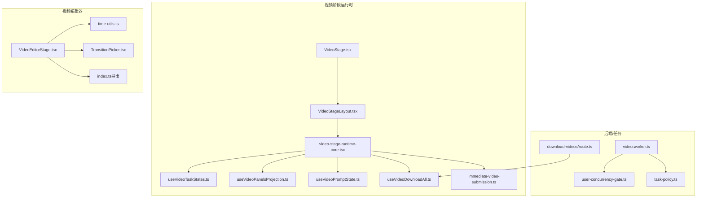
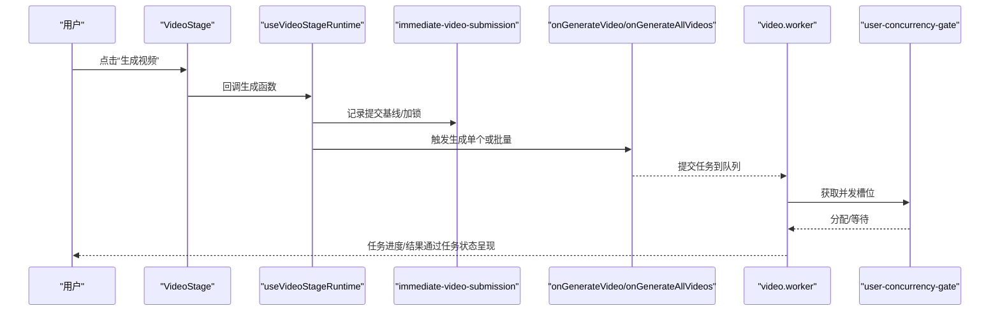
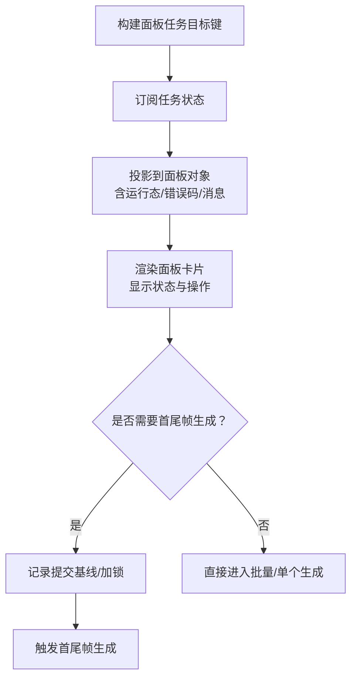
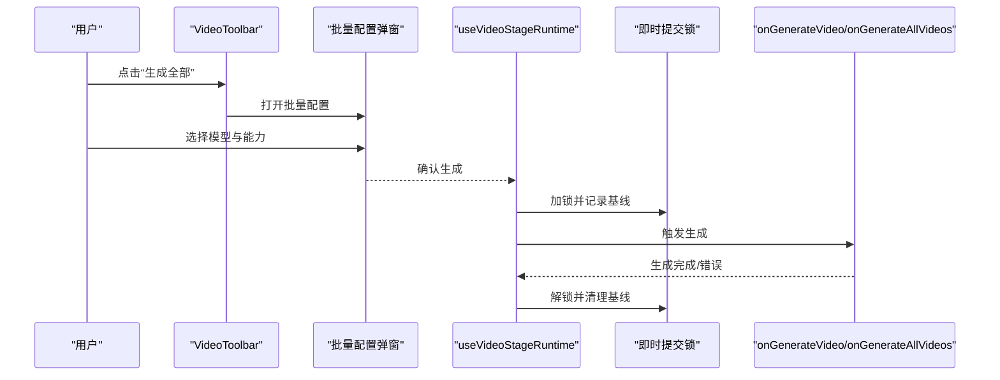
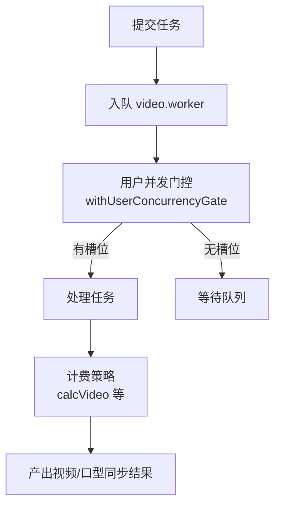
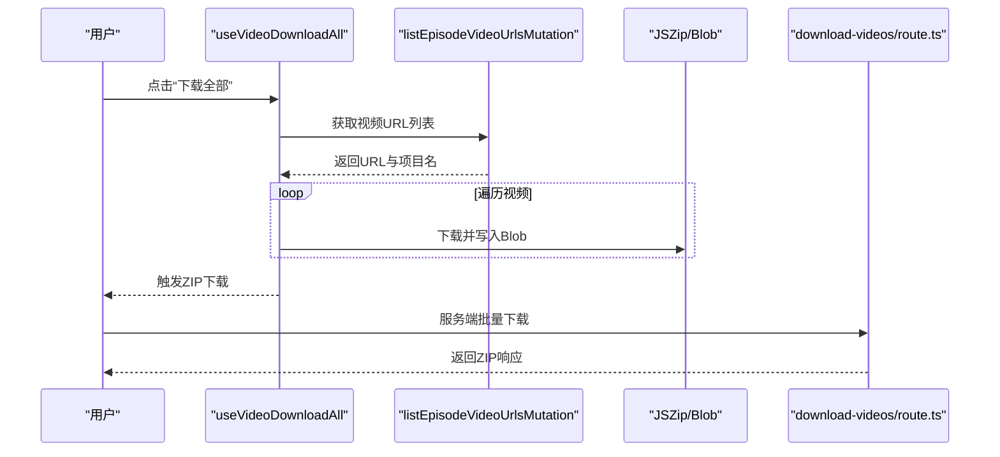
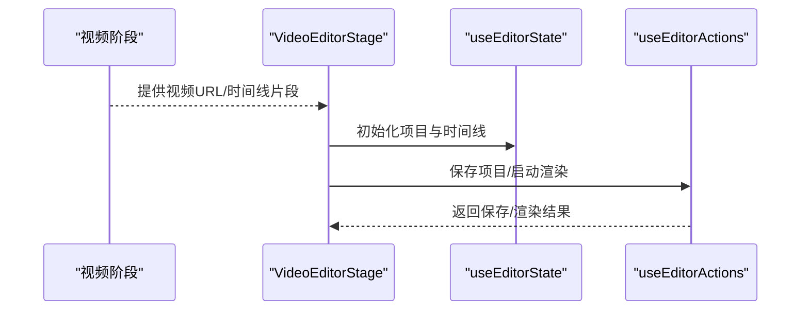
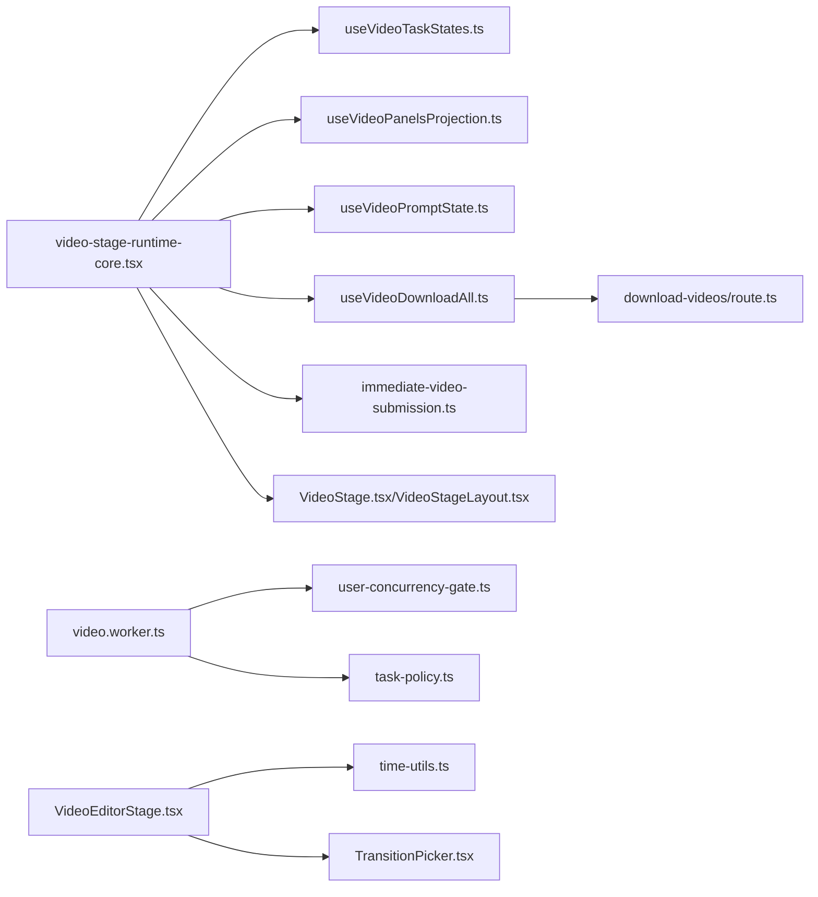

# 视频阶段运行时

<cite>
**本文引用的文件**   
- [video-stage-runtime-core.tsx](file://src/lib/novel-promotion/stages/video-stage-runtime-core.tsx)
- [VideoStage.tsx](file://src/app/[locale]/workspace/[projectId]/modes/novel-promotion/components/VideoStage.tsx)
- [VideoStageLayout.tsx](file://src/app/[locale]/workspace/[projectId]/modes/novel-promotion/components/video-stage/VideoStageLayout.tsx)
- [useVideoTaskStates.ts](file://src/lib/novel-promotion/stages/video-stage-runtime/useVideoTaskStates.ts)
- [useVideoPanelsProjection.ts](file://src/lib/novel-promotion/stages/video-stage-runtime/useVideoPanelsProjection.ts)
- [useVideoPromptState.ts](file://src/lib/novel-promotion/stages/video-stage-runtime/useVideoPromptState.ts)
- [useVideoDownloadAll.ts](file://src/lib/novel-promotion/stages/video-stage-runtime/useVideoDownloadAll.ts)
- [immediate-video-submission.ts](file://src/lib/novel-promotion/stages/video-stage-runtime/immediate-video-submission.ts)
- [user-concurrency-gate.ts](file://src/lib/workers/user-concurrency-gate.ts)
- [video.worker.ts](file://src/lib/workers/video.worker.ts)
- [task-policy.ts](file://src/lib/billing/task-policy.ts)
- [route.ts（下载视频）](file://src/app/api/novel-promotion/[projectId]/download-videos/route.ts)
- [VideoEditorStage.tsx](file://src/features/video-editor/components/VideoEditorStage.tsx)
- [time-utils.ts](file://src/features/video-editor/utils/time-utils.ts)
- [TransitionPicker.tsx](file://src/features/video-editor/components/TransitionPicker.tsx)
- [index.ts（视频编辑器公共导出）](file://src/features/video-editor/index.ts)
</cite>

## 目录
1. [简介](#简介)
2. [项目结构](#项目结构)
3. [核心组件](#核心组件)
4. [架构总览](#架构总览)
5. [详细组件分析](#详细组件分析)
6. [依赖关系分析](#依赖关系分析)
7. [性能考量](#性能考量)
8. [故障排查指南](#故障排查指南)
9. [结论](#结论)
10. [附录](#附录)

## 简介
本技术文档聚焦小说推广工作流中“视频阶段”的运行时模块，系统性阐述视频面板的生命周期管理、状态同步与用户交互机制；深入说明视频生成任务的调度策略、并发控制与资源管理；解释视频预览、下载与导出功能的实现原理；并给出配置视频生成参数、处理生成状态与优化用户体验的具体方法。同时，文档说明与视频编辑器的集成方式（时间线同步与效果应用），以及性能优化、错误处理与调试方法。

## 项目结构
视频阶段运行时位于小说推广模式的前端运行时层，围绕“视频面板”构建状态机与交互流程，并通过查询钩子与后端任务系统协同。视频编辑器作为独立模块提供时间线与渲染能力，二者通过项目级数据与事件进行衔接。

图示来源
- [VideoStage.tsx:1-10](file://src/app/[locale]/workspace/[projectId]/modes/novel-promotion/components/VideoStage.tsx#L1-L10)
- [VideoStageLayout.tsx:1-9](file://src/app/[locale]/workspace/[projectId]/modes/novel-promotion/components/video-stage/VideoStageLayout.tsx#L1-L9)
- [video-stage-runtime-core.tsx:1-642](file://src/lib/novel-promotion/stages/video-stage-runtime-core.tsx#L1-L642)
- [useVideoTaskStates.ts:1-32](file://src/lib/novel-promotion/stages/video-stage-runtime/useVideoTaskStates.ts#L1-L32)
- [useVideoPanelsProjection.ts:1-113](file://src/lib/novel-promotion/stages/video-stage-runtime/useVideoPanelsProjection.ts#L1-L113)
- [useVideoPromptState.ts:1-155](file://src/lib/novel-promotion/stages/video-stage-runtime/useVideoPromptState.ts#L1-L155)
- [useVideoDownloadAll.ts:43-79](file://src/lib/novel-promotion/stages/video-stage-runtime/useVideoDownloadAll.ts#L43-L79)
- [immediate-video-submission.ts](file://src/lib/novel-promotion/stages/video-stage-runtime/immediate-video-submission.ts)
- [VideoEditorStage.tsx:1-296](file://src/features/video-editor/components/VideoEditorStage.tsx#L1-L296)
- [time-utils.ts:1-47](file://src/features/video-editor/utils/time-utils.ts#L1-L47)
- [TransitionPicker.tsx:1-50](file://src/features/video-editor/components/TransitionPicker.tsx#L1-L50)
- [index.ts（视频编辑器公共导出）:1-42](file://src/features/video-editor/index.ts#L1-L42)
- [video.worker.ts:306-323](file://src/lib/workers/video.worker.ts#L306-L323)
- [user-concurrency-gate.ts:1-69](file://src/lib/workers/user-concurrency-gate.ts#L1-L69)
- [task-policy.ts:152-181](file://src/lib/billing/task-policy.ts#L152-L181)
- [route.ts（下载视频）:144-249](file://src/app/api/novel-promotion/[projectId]/download-videos/route.ts#L144-L249)

章节来源
- [VideoStage.tsx:1-10](file://src/app/[locale]/workspace/[projectId]/modes/novel-promotion/components/VideoStage.tsx#L1-L10)
- [VideoStageLayout.tsx:1-9](file://src/app/[locale]/workspace/[projectId]/modes/novel-promotion/components/video-stage/VideoStageLayout.tsx#L1-L9)
- [video-stage-runtime-core.tsx:1-642](file://src/lib/novel-promotion/stages/video-stage-runtime-core.tsx#L1-L642)

## 核心组件
- 运行时入口与壳层：VideoStage.tsx 与 VideoStageLayout.tsx 将壳层属性传递给运行时核心 useVideoStageRuntime，后者组织状态、交互与渲染。
- 任务状态聚合：useVideoTaskStates 以目标键聚合面板视频与口型同步任务的状态，供投影层使用。
- 面板投影：useVideoPanelsProjection 将故事板与剪辑顺序映射为面板序列，注入任务状态、错误码与口型同步状态。
- 提示词状态：useVideoPromptState 维护本地提示词缓存、脏标记与保存队列，避免与外部状态不同步。
- 批量提交与即时锁：immediate-video-submission 提供“即时提交锁”与基线记录，防止重复提交与竞态。
- 并发门控：user-concurrency-gate 为用户维度的视频并发提供门控，video.worker 结合该门控与队列并发执行任务。
- 下载与导出：useVideoDownloadAll 与 download-videos/route.ts 实现批量下载与打包导出。

章节来源
- [video-stage-runtime-core.tsx:66-641](file://src/lib/novel-promotion/stages/video-stage-runtime-core.tsx#L66-L641)
- [useVideoTaskStates.ts:13-31](file://src/lib/novel-promotion/stages/video-stage-runtime/useVideoTaskStates.ts#L13-L31)
- [useVideoPanelsProjection.ts:26-112](file://src/lib/novel-promotion/stages/video-stage-runtime/useVideoPanelsProjection.ts#L26-L112)
- [useVideoPromptState.ts:23-154](file://src/lib/novel-promotion/stages/video-stage-runtime/useVideoPromptState.ts#L23-L154)
- [immediate-video-submission.ts](file://src/lib/novel-promotion/stages/video-stage-runtime/immediate-video-submission.ts)
- [user-concurrency-gate.ts:1-69](file://src/lib/workers/user-concurrency-gate.ts#L1-L69)
- [video.worker.ts:306-323](file://src/lib/workers/video.worker.ts#L306-L323)
- [useVideoDownloadAll.ts:43-79](file://src/lib/novel-promotion/stages/video-stage-runtime/useVideoDownloadAll.ts#L43-L79)
- [route.ts（下载视频）:144-249](file://src/app/api/novel-promotion/[projectId]/download-videos/route.ts#L144-L249)

## 架构总览
视频阶段运行时采用“状态聚合 + 投影渲染 + 交互编排”的分层设计：
- 上层：VideoStageLayout 与 VideoStage 负责路由与壳层装配。
- 中层：useVideoStageRuntime 聚合任务状态、面板投影、提示词、下载、UI 状态与首尾帧流程。
- 下层：immediate-video-submission 提供提交锁与基线；worker 层负责并发与计费策略；编辑器模块提供时间线与渲染。

图示来源
- [VideoStage.tsx:1-10](file://src/app/[locale]/workspace/[projectId]/modes/novel-promotion/components/VideoStage.tsx#L1-L10)
- [video-stage-runtime-core.tsx:329-384](file://src/lib/novel-promotion/stages/video-stage-runtime-core.tsx#L329-L384)
- [immediate-video-submission.ts](file://src/lib/novel-promotion/stages/video-stage-runtime/immediate-video-submission.ts)
- [video.worker.ts:306-323](file://src/lib/workers/video.worker.ts#L306-L323)
- [user-concurrency-gate.ts:56-69](file://src/lib/workers/user-concurrency-gate.ts#L56-L69)

## 详细组件分析

### 视频面板生命周期与状态同步
- 生命周期关键点
  - 初始化：useVideoTaskStates 基于故事板构建面板任务目标键，订阅任务状态。
  - 投影：useVideoPanelsProjection 将任务状态映射到面板对象，包含视频/口型同步的运行态、错误码与消息。
  - 渲染：VideoRenderPanel 基于投影后的 allPanels 渲染面板卡片，显示任务状态、错误与操作入口。
- 状态同步机制
  - 任务状态通过 useVideoTaskPresentation 返回的 getTaskState(key) 获取，统一映射到面板字段，确保 UI 与后端任务一致。
  - 首尾帧流程 useVideoFirstLastFrameFlow 与“即时提交锁”配合，保证链式生成的原子性与幂等性。

图示来源
- [useVideoTaskStates.ts:13-31](file://src/lib/novel-promotion/stages/video-stage-runtime/useVideoTaskStates.ts#L13-L31)
- [useVideoPanelsProjection.ts:26-112](file://src/lib/novel-promotion/stages/video-stage-runtime/useVideoPanelsProjection.ts#L26-L112)
- [video-stage-runtime-core.tsx:401-407](file://src/lib/novel-promotion/stages/video-stage-runtime-core.tsx#L401-L407)

章节来源
- [useVideoTaskStates.ts:13-31](file://src/lib/novel-promotion/stages/video-stage-runtime/useVideoTaskStates.ts#L13-L31)
- [useVideoPanelsProjection.ts:26-112](file://src/lib/novel-promotion/stages/video-stage-runtime/useVideoPanelsProjection.ts#L26-L112)
- [video-stage-runtime-core.tsx:401-407](file://src/lib/novel-promotion/stages/video-stage-runtime-core.tsx#L401-L407)

### 用户交互机制与面板操作
- 交互入口
  - 生成单个/批量：通过 VideoToolbar 触发；批量生成弹窗由 ModelCapabilityDropdown 驱动。
  - 首尾帧生成：useVideoFirstLastFrameFlow 提供模型、能力字段与自定义提示词。
  - 口型同步：handleLipSync 触发口型同步任务。
  - 预览与链接：支持预览图片、面板链接切换与定位。
- 即时提交锁
  - handleGenerateVideoWithImmediateLock 对面板键加锁，避免重复提交；结合 shouldResolveVideoSubmissionLock 在超时或状态变化后自动解锁。

图示来源
- [video-stage-runtime-core.tsx:480-508](file://src/lib/novel-promotion/stages/video-stage-runtime-core.tsx#L480-L508)
- [video-stage-runtime-core.tsx:329-384](file://src/lib/novel-promotion/stages/video-stage-runtime-core.tsx#L329-L384)
- [immediate-video-submission.ts](file://src/lib/novel-promotion/stages/video-stage-runtime/immediate-video-submission.ts)

章节来源
- [video-stage-runtime-core.tsx:510-641](file://src/lib/novel-promotion/stages/video-stage-runtime-core.tsx#L510-L641)
- [video-stage-runtime-core.tsx:329-384](file://src/lib/novel-promotion/stages/video-stage-runtime-core.tsx#L329-L384)

### 视频生成任务调度、并发控制与资源管理
- 调度策略
  - 任务提交：onGenerateVideo/onGenerateAllVideos 由运行时触发，底层由 video.worker 接收并处理。
  - 即时锁：在 UI 层对单面板提交进行短时锁，避免重复提交与竞态。
- 并发控制
  - 用户级并发门控：withUserConcurrencyGate 以 scope='video' 与 userId 为键，限制同一用户的视频并发。
  - Worker 并发：video.worker.concurrency 控制队列并发数量。
- 资源管理
  - 计费策略：task-policy 根据模型、分辨率、时长、横纵比、音轨开关等计算冻结费用，支持 firstlastframe 模式识别。

图示来源
- [video.worker.ts:306-323](file://src/lib/workers/video.worker.ts#L306-L323)
- [user-concurrency-gate.ts:56-69](file://src/lib/workers/user-concurrency-gate.ts#L56-L69)
- [task-policy.ts:152-181](file://src/lib/billing/task-policy.ts#L152-L181)

章节来源
- [video.worker.ts:306-323](file://src/lib/workers/video.worker.ts#L306-L323)
- [user-concurrency-gate.ts:1-69](file://src/lib/workers/user-concurrency-gate.ts#L1-L69)
- [task-policy.ts:152-181](file://src/lib/billing/task-policy.ts#L152-L181)

### 视频预览、下载与导出
- 预览
  - useVideoDownloadAll 通过 listEpisodeVideoUrlsMutation 获取面板视频 URL 列表，支持按偏好筛选。
  - 预览图片通过 useVideoStageUiState 管理，支持关闭与切换。
- 下载
  - useVideoDownloadAll 逐个下载远程 Blob 并写入 JSZip，完成后触发浏览器下载。
  - download-videos/route.ts 支持服务端批量下载与 ZIP 打包，按剪辑与面板索引排序输出。
- 导出
  - 与视频编辑器集成：VideoEditorStage 提供保存与导出动作，调用 useEditorActions.startRender 发起渲染。
  - 时间线与转场：time-utils 计算总时长与片段位置；TransitionPicker 提供转场类型与时长配置。

图示来源
- [useVideoDownloadAll.ts:43-79](file://src/lib/novel-promotion/stages/video-stage-runtime/useVideoDownloadAll.ts#L43-L79)
- [route.ts（下载视频）:144-249](file://src/app/api/novel-promotion/[projectId]/download-videos/route.ts#L144-L249)

章节来源
- [useVideoDownloadAll.ts:43-79](file://src/lib/novel-promotion/stages/video-stage-runtime/useVideoDownloadAll.ts#L43-L79)
- [route.ts（下载视频）:144-249](file://src/app/api/novel-promotion/[projectId]/download-videos/route.ts#L144-L249)
- [VideoEditorStage.tsx:65-84](file://src/features/video-editor/components/VideoEditorStage.tsx#L65-L84)
- [time-utils.ts:1-47](file://src/features/video-editor/utils/time-utils.ts#L1-L47)
- [TransitionPicker.tsx:1-50](file://src/features/video-editor/components/TransitionPicker.tsx#L1-L50)

### 与视频编辑器的集成（时间线同步与效果应用）
- 集成点
  - VideoEditorStage 作为编辑器主界面，提供保存与导出动作；通过 useEditorActions 与后端交互。
  - time-utils 提供时间轴总时长与片段位置计算，支持转场重叠逻辑。
  - TransitionPicker 提供转场类型与时长配置，更新选中片段的过渡属性。
- 数据与事件
  - 编辑器内部通过 useEditorState 管理项目与时间线状态；通过 useEditorActions 保存与渲染。
  - 与视频阶段的数据衔接在于：视频阶段生成的面板视频 URL 可作为编辑器素材库来源，时间线片段可由面板顺序与时长推导。

图示来源
- [VideoEditorStage.tsx:1-296](file://src/features/video-editor/components/VideoEditorStage.tsx#L1-L296)
- [time-utils.ts:1-47](file://src/features/video-editor/utils/time-utils.ts#L1-L47)
- [TransitionPicker.tsx:1-50](file://src/features/video-editor/components/TransitionPicker.tsx#L1-L50)
- [index.ts（视频编辑器公共导出）:1-42](file://src/features/video-editor/index.ts#L1-L42)

章节来源
- [VideoEditorStage.tsx:1-296](file://src/features/video-editor/components/VideoEditorStage.tsx#L1-L296)
- [time-utils.ts:1-47](file://src/features/video-editor/utils/time-utils.ts#L1-L47)
- [TransitionPicker.tsx:1-50](file://src/features/video-editor/components/TransitionPicker.tsx#L1-L50)
- [index.ts（视频编辑器公共导出）:1-42](file://src/features/video-editor/index.ts#L1-L42)

## 依赖关系分析
- 组件耦合
  - video-stage-runtime-core.tsx 作为中枢，依赖各子 Hook（任务状态、投影、提示词、下载、首尾帧、UI 状态）与即时提交锁。
  - VideoStage.tsx/VideoStageLayout.tsx 仅承担壳层职责，降低与业务逻辑耦合。
- 外部依赖
  - 任务状态来自 useVideoTaskPresentation；计费策略来自 task-policy；并发门控来自 user-concurrency-gate；下载由 useVideoDownloadAll 与 download-videos/route.ts 共同实现。
  - 编辑器模块独立，通过公共导出接口与运行时解耦。

图示来源
- [video-stage-runtime-core.tsx:1-642](file://src/lib/novel-promotion/stages/video-stage-runtime-core.tsx#L1-L642)
- [useVideoTaskStates.ts:1-32](file://src/lib/novel-promotion/stages/video-stage-runtime/useVideoTaskStates.ts#L1-L32)
- [useVideoPanelsProjection.ts:1-113](file://src/lib/novel-promotion/stages/video-stage-runtime/useVideoPanelsProjection.ts#L1-L113)
- [useVideoPromptState.ts:1-155](file://src/lib/novel-promotion/stages/video-stage-runtime/useVideoPromptState.ts#L1-L155)
- [useVideoDownloadAll.ts:43-79](file://src/lib/novel-promotion/stages/video-stage-runtime/useVideoDownloadAll.ts#L43-L79)
- [immediate-video-submission.ts](file://src/lib/novel-promotion/stages/video-stage-runtime/immediate-video-submission.ts)
- [VideoStage.tsx:1-10](file://src/app/[locale]/workspace/[projectId]/modes/novel-promotion/components/VideoStage.tsx#L1-L10)
- [VideoStageLayout.tsx:1-9](file://src/app/[locale]/workspace/[projectId]/modes/novel-promotion/components/video-stage/VideoStageLayout.tsx#L1-L9)
- [route.ts（下载视频）:144-249](file://src/app/api/novel-promotion/[projectId]/download-videos/route.ts#L144-L249)
- [video.worker.ts:306-323](file://src/lib/workers/video.worker.ts#L306-L323)
- [user-concurrency-gate.ts:1-69](file://src/lib/workers/user-concurrency-gate.ts#L1-L69)
- [task-policy.ts:152-181](file://src/lib/billing/task-policy.ts#L152-L181)
- [VideoEditorStage.tsx:1-296](file://src/features/video-editor/components/VideoEditorStage.tsx#L1-L296)
- [time-utils.ts:1-47](file://src/features/video-editor/utils/time-utils.ts#L1-L47)
- [TransitionPicker.tsx:1-50](file://src/features/video-editor/components/TransitionPicker.tsx#L1-L50)

章节来源
- [video-stage-runtime-core.tsx:1-642](file://src/lib/novel-promotion/stages/video-stage-runtime-core.tsx#L1-L642)

## 性能考量
- 并发与节流
  - 使用用户级并发门控限制视频生成并发，避免资源争用与超卖。
  - 即时提交锁在 UI 层减少重复提交，降低后端压力。
- 渲染与状态更新
  - useVideoPanelsProjection 与 useVideoTaskStates 通过 useMemo 优化重渲染路径。
  - 批量配置弹窗仅在必要时打开，减少不必要的 DOM 与状态更新。
- 下载与打包
  - useVideoDownloadAll 逐个下载并写入内存，建议在大体量场景下考虑分批或服务端打包（download-videos/route.ts）。
- 计费与预算
  - task-policy 根据分辨率、时长、横纵比与音轨开关计算成本，建议在 UI 提前估算，避免超支。

## 故障排查指南
- 常见问题
  - 生成卡住/重复提交：检查即时提交锁是否正确释放；确认 shouldResolveVideoSubmissionLock 是否生效。
  - 并发不足：检查用户并发配置与 QUEUE_CONCURRENCY_VIDEO；确认 user-concurrency-gate 是否阻塞。
  - 下载失败：useVideoDownloadAll 会记录错误日志；服务端下载需检查存储密钥解析与网络可达性。
  - 口型同步失败：查看面板 lipSync 任务状态与错误码，确认语音行匹配与模型可用性。
- 调试建议
  - 启用任务状态日志与错误上报（logError）。
  - 在 VideoEditorStage 中验证时间线计算与转场配置是否符合预期。
  - 使用浏览器开发者工具观察网络请求与下载响应头。

章节来源
- [video-stage-runtime-core.tsx:409-451](file://src/lib/novel-promotion/stages/video-stage-runtime-core.tsx#L409-L451)
- [user-concurrency-gate.ts:1-69](file://src/lib/workers/user-concurrency-gate.ts#L1-L69)
- [useVideoDownloadAll.ts:73-79](file://src/lib/novel-promotion/stages/video-stage-runtime/useVideoDownloadAll.ts#L73-L79)
- [route.ts（下载视频）:193-249](file://src/app/api/novel-promotion/[projectId]/download-videos/route.ts#L193-L249)
- [VideoEditorStage.tsx:65-84](file://src/features/video-editor/components/VideoEditorStage.tsx#L65-L84)

## 结论
视频阶段运行时通过“状态聚合 + 投影渲染 + 交互编排”的架构，实现了从面板到任务、从 UI 到后端的高效协同。配合即时提交锁、用户级并发门控与计费策略，既保障了用户体验，也确保了资源与成本的可控。与视频编辑器的集成进一步完善了从生成到导出的完整链路。建议在实际部署中关注并发配置、下载策略与错误监控，持续优化生成体验与稳定性。

## 附录
- 配置视频生成参数
  - 通过批量配置弹窗选择模型与能力字段，运行时会根据定价与能力定义进行规范化与禁用选项过滤。
  - 参考路径：[video-stage-runtime-core.tsx:595-608](file://src/lib/novel-promotion/stages/video-stage-runtime-core.tsx#L595-L608)
- 处理生成状态
  - 使用 useVideoTaskStates 与 useVideoPanelsProjection 获取面板任务状态与错误信息，驱动 UI 呈现。
  - 参考路径：[useVideoTaskStates.ts:13-31](file://src/lib/novel-promotion/stages/video-stage-runtime/useVideoTaskStates.ts#L13-L31)、[useVideoPanelsProjection.ts:26-112](file://src/lib/novel-promotion/stages/video-stage-runtime/useVideoPanelsProjection.ts#L26-L112)
- 优化用户体验
  - 使用即时提交锁避免重复提交；在批量生成时提供确认与进度反馈。
  - 参考路径：[video-stage-runtime-core.tsx:329-384](file://src/lib/novel-promotion/stages/video-stage-runtime-core.tsx#L329-L384)、[video-stage-runtime-core.tsx:453-462](file://src/lib/novel-promotion/stages/video-stage-runtime-core.tsx#L453-L462)