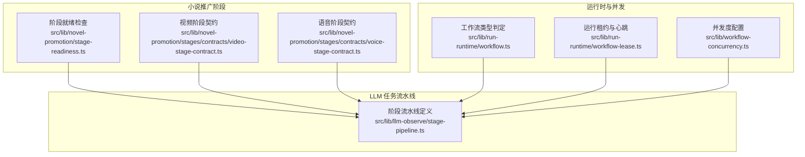
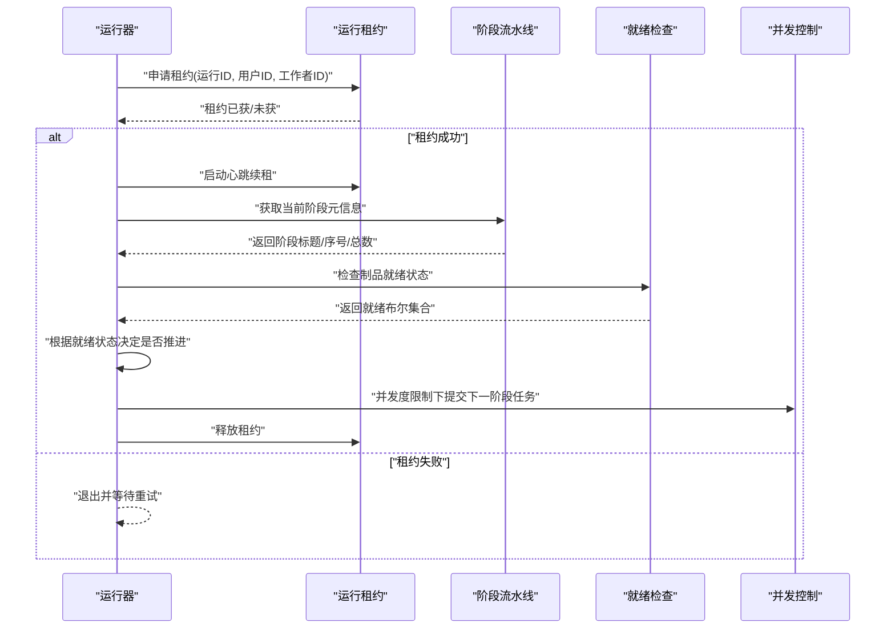
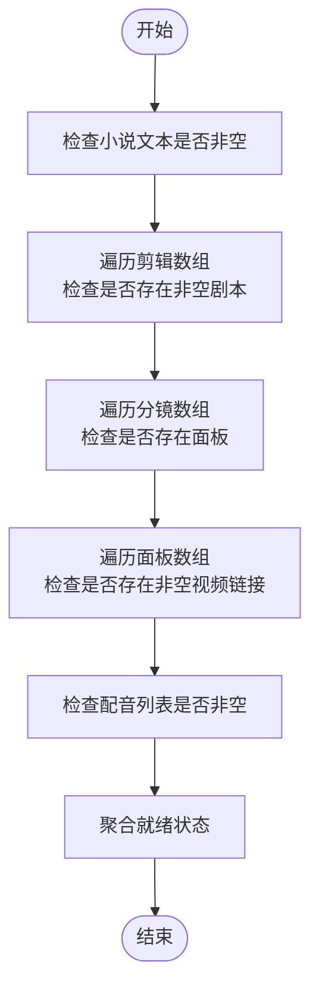
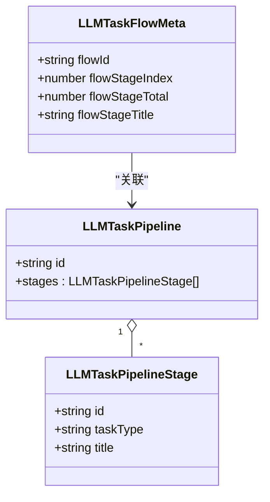
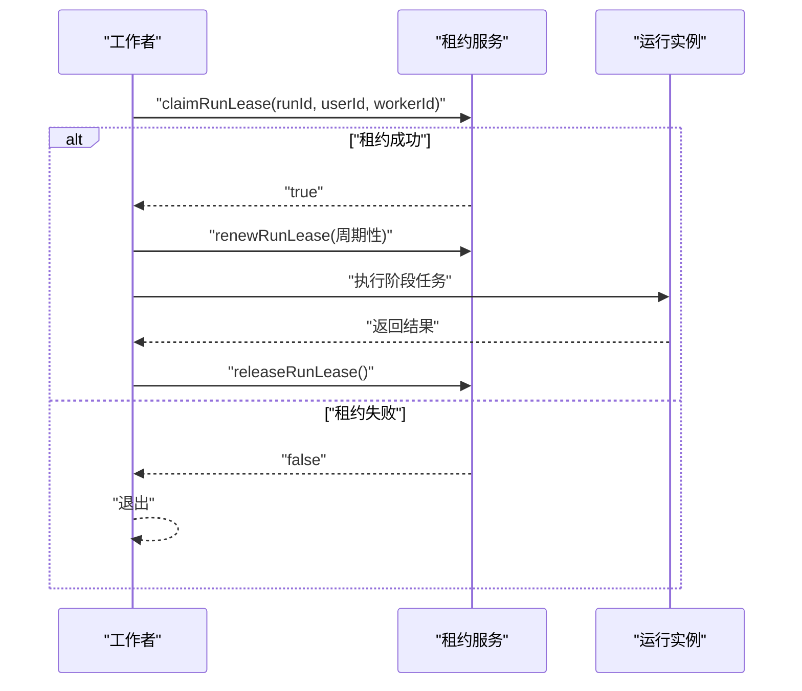
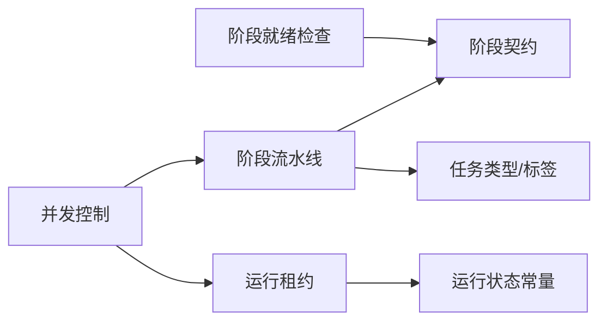

# 阶段编排系统

<cite>
**本文引用的文件**
- [src/lib/novel-promotion/stage-readiness.ts](file://src/lib/novel-promotion/stage-readiness.ts)
- [src/lib/llm-observe/stage-pipeline.ts](file://src/lib/llm-observe/stage-pipeline.ts)
- [src/lib/run-runtime/workflow.ts](file://src/lib/run-runtime/workflow.ts)
- [src/lib/run-runtime/workflow-lease.ts](file://src/lib/run-runtime/workflow-lease.ts)
- [src/lib/workflow-concurrency.ts](file://src/lib/workflow-concurrency.ts)
- [src/lib/novel-promotion/stages/contracts/video-stage-contract.ts](file://src/lib/novel-promotion/stages/contracts/video-stage-contract.ts)
- [src/lib/novel-promotion/stages/contracts/voice-stage-contract.ts](file://src/lib/novel-promotion/stages/contracts/voice-stage-contract.ts)
- [tests/unit/novel-promotion/stage-readiness.test.ts](file://tests/unit/novel-promotion/stage-readiness.test.ts)
- [tests/unit/novel-promotion/voice-stage-data-loader.test.ts](file://tests/unit/novel-promotion/voice-stage-data-loader.test.ts)
- [tests/unit/novel-promotion/novel-input-stage.test.ts](file://tests/unit/novel-promotion/novel-input-stage.test.ts)
</cite>

## 目录
1. [引言](#引言)
2. [项目结构](#项目结构)
3. [核心组件](#核心组件)
4. [架构总览](#架构总览)
5. [详细组件分析](#详细组件分析)
6. [依赖分析](#依赖分析)
7. [性能考虑](#性能考虑)
8. [故障排查指南](#故障排查指南)
9. [结论](#结论)
10. [附录](#附录)

## 引言
本技术文档围绕“小说推广工作流的阶段编排系统”展开，目标是系统性地解释多阶段工作流的协调机制，包括阶段依赖关系、状态转换与进度控制；深入说明阶段就绪检查、条件判断与自动推进逻辑；阐述运行流的实现原理（事件驱动架构、状态持久化与异常恢复）；并提供配置阶段参数、处理分支逻辑与优化执行效率的方法。文档同时覆盖与任务队列系统的集成（异步处理与结果回调）、编排策略、调试工具与性能监控方法。

## 项目结构
该系统主要由以下模块构成：
- 小说推广阶段就绪检查：用于判定故事、脚本、分镜、视频、配音等制品是否具备推进下一阶段的条件。
- LLM 任务流水线与阶段定义：以“流水线+阶段”的方式描述不同工作流的顺序与标题。
- 运行时工作流与租约：保障运行实例在执行期间的独占性与心跳续租，支持异常恢复与终止。
- 并发控制：对分析、图像、视频三类工作流的并发度进行标准化配置与归一化。
- 视频/语音阶段契约：作为阶段外壳属性的类型约束，确保阶段参数与数据结构一致。

图表来源
- [src/lib/novel-promotion/stage-readiness.ts:1-75](file://src/lib/novel-promotion/stage-readiness.ts#L1-L75)
- [src/lib/llm-observe/stage-pipeline.ts:1-159](file://src/lib/llm-observe/stage-pipeline.ts#L1-L159)
- [src/lib/run-runtime/workflow.ts:1-13](file://src/lib/run-runtime/workflow.ts#L1-L13)
- [src/lib/run-runtime/workflow-lease.ts:1-73](file://src/lib/run-runtime/workflow-lease.ts#L1-L73)
- [src/lib/workflow-concurrency.ts:1-43](file://src/lib/workflow-concurrency.ts#L1-L43)
- [src/lib/novel-promotion/stages/contracts/video-stage-contract.ts:1-4](file://src/lib/novel-promotion/stages/contracts/video-stage-contract.ts#L1-L4)
- [src/lib/novel-promotion/stages/contracts/voice-stage-contract.ts:1-4](file://src/lib/novel-promotion/stages/contracts/voice-stage-contract.ts#L1-L4)

章节来源
- [src/lib/novel-promotion/stage-readiness.ts:1-75](file://src/lib/novel-promotion/stage-readiness.ts#L1-L75)
- [src/lib/llm-observe/stage-pipeline.ts:1-159](file://src/lib/llm-observe/stage-pipeline.ts#L1-L159)
- [src/lib/run-runtime/workflow.ts:1-13](file://src/lib/run-runtime/workflow.ts#L1-L13)
- [src/lib/run-runtime/workflow-lease.ts:1-73](file://src/lib/run-runtime/workflow-lease.ts#L1-L73)
- [src/lib/workflow-concurrency.ts:1-43](file://src/lib/workflow-concurrency.ts#L1-L43)
- [src/lib/novel-promotion/stages/contracts/video-stage-contract.ts:1-4](file://src/lib/novel-promotion/stages/contracts/video-stage-contract.ts#L1-L4)
- [src/lib/novel-promotion/stages/contracts/voice-stage-contract.ts:1-4](file://src/lib/novel-promotion/stages/contracts/voice-stage-contract.ts#L1-L4)

## 核心组件
- 阶段就绪检查：通过解析剧集对象中的故事文本、剪辑脚本、分镜面板与视频链接等字段，计算当前阶段制品的就绪状态，作为自动推进的依据。
- 阶段流水线与元信息：以固定流程 ID 与阶段数组定义不同工作流的顺序；同时提供按任务类型查询的元信息，用于进度条与标题展示。
- 工作流类型与租约：判定任务类型是否属于 AI 类型；运行时通过租约机制保证同一时间只有一个工作者持有运行实例，并周期性续租。
- 并发度配置：对分析、图像、视频三类工作流提供可归一化的并发度配置，避免非法值影响系统稳定性。
- 视频/语音阶段契约：以类型别名约束阶段外壳属性，确保阶段参数结构一致且可追踪。

章节来源
- [src/lib/novel-promotion/stage-readiness.ts:66-74](file://src/lib/novel-promotion/stage-readiness.ts#L66-L74)
- [src/lib/llm-observe/stage-pipeline.ts:138-158](file://src/lib/llm-observe/stage-pipeline.ts#L138-L158)
- [src/lib/run-runtime/workflow.ts:5-11](file://src/lib/run-runtime/workflow.ts#L5-L11)
- [src/lib/run-runtime/workflow-lease.ts:33-72](file://src/lib/run-runtime/workflow-lease.ts#L33-L72)
- [src/lib/workflow-concurrency.ts:19-42](file://src/lib/workflow-concurrency.ts#L19-L42)
- [src/lib/novel-promotion/stages/contracts/video-stage-contract.ts:1-4](file://src/lib/novel-promotion/stages/contracts/video-stage-contract.ts#L1-L4)
- [src/lib/novel-promotion/stages/contracts/voice-stage-contract.ts:1-4](file://src/lib/novel-promotion/stages/contracts/voice-stage-contract.ts#L1-L4)

## 架构总览
整体采用“阶段就绪检查 + 流水线定义 + 租约与并发控制”的三层协作模式：
- 阶段就绪检查负责条件判断与自动推进决策；
- 流水线定义负责阶段顺序与标题元信息；
- 租约与并发控制负责运行时的独占性、续租与资源配额；
- 契约层确保阶段外壳参数结构稳定，便于扩展与维护。

图表来源
- [src/lib/run-runtime/workflow-lease.ts:33-72](file://src/lib/run-runtime/workflow-lease.ts#L33-L72)
- [src/lib/llm-observe/stage-pipeline.ts:138-158](file://src/lib/llm-observe/stage-pipeline.ts#L138-L158)
- [src/lib/novel-promotion/stage-readiness.ts:66-74](file://src/lib/novel-promotion/stage-readiness.ts#L66-L74)
- [src/lib/workflow-concurrency.ts:25-42](file://src/lib/workflow-concurrency.ts#L25-L42)

## 详细组件分析

### 组件A：阶段就绪检查
- 功能概述：基于剧集对象的多个字段（如小说文本、剪辑脚本、分镜面板、视频链接、配音列表）判断当前阶段制品是否满足推进条件。
- 关键点：
  - 文本非空校验：使用统一的非空字符串判定函数，避免空白字符导致误判。
  - 结构校验：对剪辑、分镜、面板等对象进行类型断言，确保数组与关键字段存在。
  - 就绪聚合：将故事、脚本、分镜、视频、配音五类制品的就绪状态聚合为一个对象，供上层流程使用。
- 复杂度：对每个制品类别进行一次线性扫描，整体复杂度 O(n)，n 为制品数量。
- 错误处理：当输入为空或结构不合法时，直接返回 false 或空集合，避免异常传播。

图表来源
- [src/lib/novel-promotion/stage-readiness.ts:31-74](file://src/lib/novel-promotion/stage-readiness.ts#L31-L74)

章节来源
- [src/lib/novel-promotion/stage-readiness.ts:1-75](file://src/lib/novel-promotion/stage-readiness.ts#L1-L75)
- [tests/unit/novel-promotion/stage-readiness.test.ts](file://tests/unit/novel-promotion/stage-readiness.test.ts)

### 组件B：阶段流水线与元信息
- 功能概述：以固定流程 ID 定义阶段序列，并为每个阶段提供标题、索引与总数等元信息；支持按任务类型动态回退到单阶段流水线。
- 关键点：
  - 固定流程：预置若干工作流（如“小说推广生成”、“AI 创建角色/地点”、“资产库 AI 设计角色/地点”），每条流程包含若干阶段。
  - 元信息映射：按任务类型构建阶段元信息映射表，便于进度条与标题展示。
  - 单阶段回退：当任务类型不在预置流程中时，自动回退到单阶段流水线，保证兼容性。
- 复杂度：初始化阶段元信息映射的时间复杂度为 O(F×S)，F 为流程数，S 为平均阶段数；查询为 O(1)。

图表来源
- [src/lib/llm-observe/stage-pipeline.ts:4-25](file://src/lib/llm-observe/stage-pipeline.ts#L4-L25)
- [src/lib/llm-observe/stage-pipeline.ts:138-158](file://src/lib/llm-observe/stage-pipeline.ts#L138-L158)

章节来源
- [src/lib/llm-observe/stage-pipeline.ts:1-159](file://src/lib/llm-observe/stage-pipeline.ts#L1-L159)

### 组件C：运行时工作流与租约
- 功能概述：判定任务类型是否属于 AI 类型；通过租约机制保障运行实例在执行期间的独占性，并周期性续租；在异常情况下主动终止并释放租约。
- 关键点：
  - 租约申请：以运行 ID、用户 ID、工作者 ID 申请租约；若失败则立即返回。
  - 心跳续租：在租约有效期内定时续租，避免被其他工作者抢占。
  - 状态校验：在执行前与执行中持续校验运行状态，若处于取消、完成或失败状态则抛出终止错误。
  - 资源回收：无论成功与否，在 finally 中释放租约，防止资源泄露。
- 复杂度：租约操作为常数时间；心跳定时器为 O(1) 次调度。

图表来源
- [src/lib/run-runtime/workflow-lease.ts:33-72](file://src/lib/run-runtime/workflow-lease.ts#L33-L72)

章节来源
- [src/lib/run-runtime/workflow.ts:1-13](file://src/lib/run-runtime/workflow.ts#L1-L13)
- [src/lib/run-runtime/workflow-lease.ts:1-73](file://src/lib/run-runtime/workflow-lease.ts#L1-L73)

### 组件D：并发度配置
- 功能概述：对分析、图像、视频三类工作流提供可归一化的并发度配置，确保并发值为正整数，否则使用默认值。
- 关键点：
  - 归一化：将传入值转换为正整数，非法值（非数字、负数、非有限数）统一回退到默认值。
  - 配置合并：支持部分字段的并发配置，缺失字段使用默认值。
- 复杂度：归一化与合并均为 O(1)。

章节来源
- [src/lib/workflow-concurrency.ts:1-43](file://src/lib/workflow-concurrency.ts#L1-L43)

### 组件E：视频/语音阶段契约
- 功能概述：以类型别名约束视频与语音阶段外壳属性，确保阶段参数结构一致，便于跨阶段传递与校验。
- 关键点：
  - 类型一致性：契约与阶段外壳属性保持一致，减少运行期类型错误。
  - 扩展友好：新增阶段时只需遵循契约即可无缝接入流水线与就绪检查。

章节来源
- [src/lib/novel-promotion/stages/contracts/video-stage-contract.ts:1-4](file://src/lib/novel-promotion/stages/contracts/video-stage-contract.ts#L1-L4)
- [src/lib/novel-promotion/stages/contracts/voice-stage-contract.ts:1-4](file://src/lib/novel-promotion/stages/contracts/voice-stage-contract.ts#L1-L4)

## 依赖分析
- 阶段就绪检查依赖于剧集对象的数据结构，需与上游数据加载模块保持一致。
- 阶段流水线依赖于任务类型枚举与进度消息标签，确保阶段标题与索引正确。
- 运行租约依赖于运行状态常量与服务接口，确保租约生命周期管理正确。
- 并发控制独立于具体阶段，但会影响阶段任务的提交速率与资源占用。
- 契约层与阶段外壳紧密耦合，变更契约需要同步更新阶段实现。

图表来源
- [src/lib/novel-promotion/stage-readiness.ts:1-75](file://src/lib/novel-promotion/stage-readiness.ts#L1-L75)
- [src/lib/llm-observe/stage-pipeline.ts:1-159](file://src/lib/llm-observe/stage-pipeline.ts#L1-L159)
- [src/lib/run-runtime/workflow-lease.ts:1-73](file://src/lib/run-runtime/workflow-lease.ts#L1-L73)
- [src/lib/workflow-concurrency.ts:1-43](file://src/lib/workflow-concurrency.ts#L1-L43)
- [src/lib/novel-promotion/stages/contracts/video-stage-contract.ts:1-4](file://src/lib/novel-promotion/stages/contracts/video-stage-contract.ts#L1-L4)
- [src/lib/novel-promotion/stages/contracts/voice-stage-contract.ts:1-4](file://src/lib/novel-promotion/stages/contracts/voice-stage-contract.ts#L1-L4)

## 性能考虑
- 就绪检查：采用线性扫描与短路判断，复杂度 O(n)；建议在上游缓存制品列表，避免重复计算。
- 流水线元信息：初始化后查询为 O(1)，建议在应用启动时预热映射表。
- 租约续租：心跳频率与租约时长成比例，建议根据阶段耗时调整租约时长，避免频繁续租带来的开销。
- 并发控制：合理设置分析/图像/视频并发度，避免资源争用导致的抖动；对长耗时阶段适当降低并发度。
- 数据结构：对制品数组进行类型断言与长度检查，避免无效遍历；在 UI 层对制品进行懒加载与虚拟化渲染。

## 故障排查指南
- 租约丢失或运行终止：
  - 现象：阶段执行过程中抛出终止错误。
  - 排查：确认运行实例是否存在、租约是否被其他工作者抢占、运行状态是否为取消/完成/失败。
  - 处理：在 finally 中释放租约，确保资源回收；必要时增加重试与补偿逻辑。
- 就绪检查不生效：
  - 现象：制品已生成但未触发自动推进。
  - 排查：检查制品字段是否符合预期结构（如视频链接非空、面板存在等）；确认上游数据加载是否成功。
  - 处理：在测试中补充边界用例（空字符串、null、undefined），确保断言逻辑覆盖所有场景。
- 并发超限：
  - 现象：阶段任务堆积或资源争用。
  - 排查：核对并发配置与实际运行情况；观察队列积压与工作者负载。
  - 处理：调低并发度或拆分阶段，避免单阶段过长阻塞后续阶段。

章节来源
- [src/lib/run-runtime/workflow-lease.ts:11-31](file://src/lib/run-runtime/workflow-lease.ts#L11-L31)
- [tests/unit/novel-promotion/stage-readiness.test.ts](file://tests/unit/novel-promotion/stage-readiness.test.ts)
- [tests/unit/novel-promotion/voice-stage-data-loader.test.ts](file://tests/unit/novel-promotion/voice-stage-data-loader.test.ts)
- [tests/unit/novel-promotion/novel-input-stage.test.ts](file://tests/unit/novel-promotion/novel-input-stage.test.ts)

## 结论
该阶段编排系统通过“就绪检查 + 流水线定义 + 租约与并发控制 + 契约约束”的协同，实现了小说推广工作流的自动化推进与稳健运行。就绪检查确保阶段推进的准确性；流水线定义提供清晰的进度与标题；租约与并发控制保障运行时的独占性与资源配额；契约层提升阶段参数的一致性与可维护性。结合测试用例与故障排查建议，可在生产环境中获得稳定、可观测且可扩展的工作流体验。

## 附录
- 配置阶段参数：通过阶段契约约束外壳属性，确保参数结构一致；在流水线中为每个阶段配置标题与索引，便于 UI 展示。
- 分支逻辑处理：在就绪检查中根据制品状态选择不同推进路径；在并发控制中为不同类型工作流设置差异化并发度。
- 异步处理与回调：利用租约机制与心跳续租保障阶段任务的独占执行；在任务完成后通过回调或事件通知推进下一阶段。
- 调试与监控：在关键节点输出阶段元信息与就绪状态；对租约失败与运行终止进行日志记录与告警；对并发度与队列积压进行指标采集。