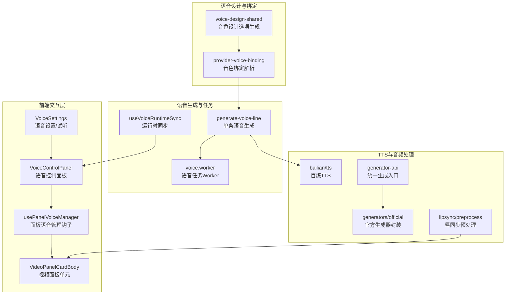
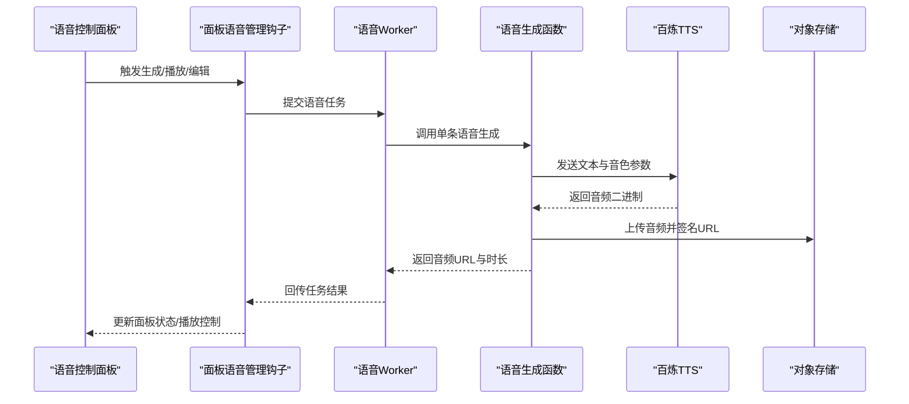
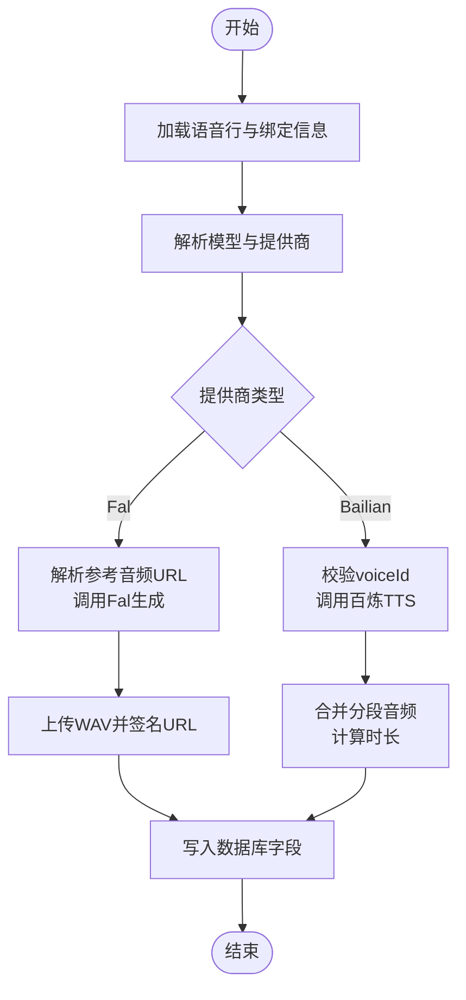
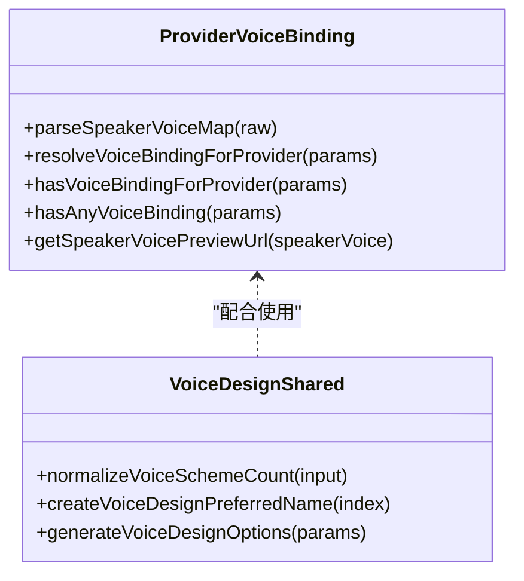
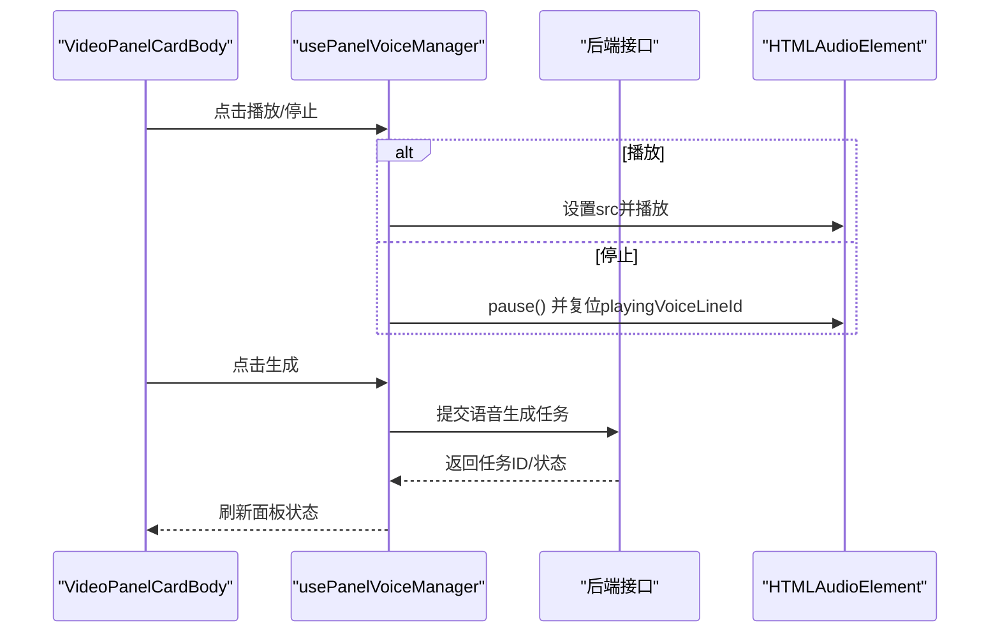
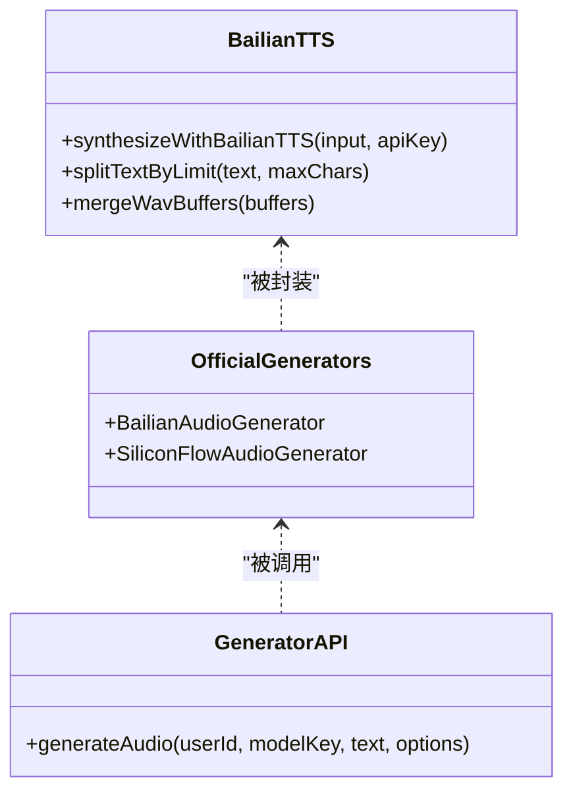
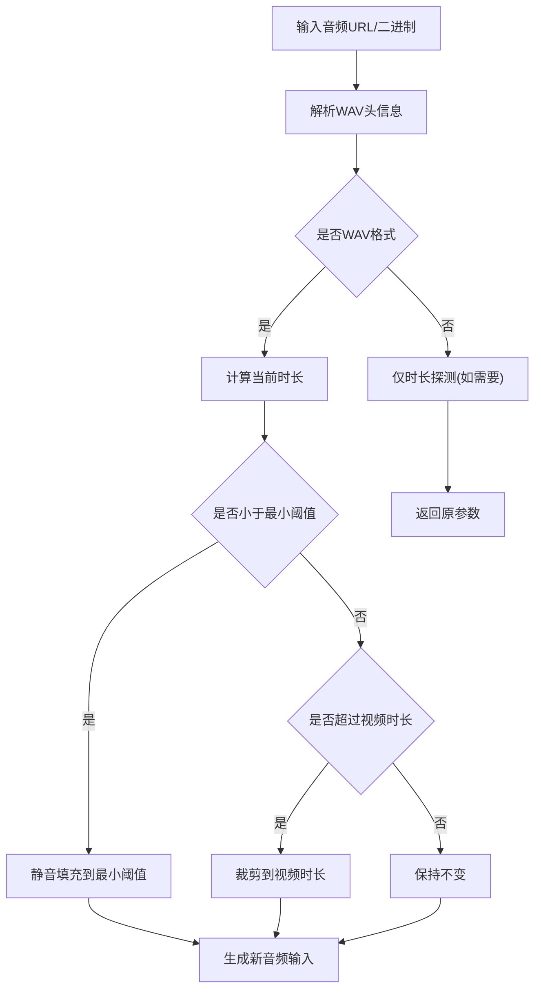
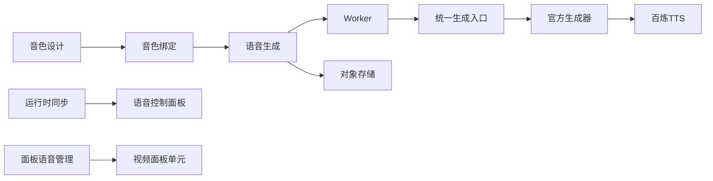

# 音频阶段运行时

<cite>
**本文引用的文件**
- [src/lib/voice/generate-voice-line.ts](file://src/lib/voice/generate-voice-line.ts)
- [src/lib/providers/bailian/tts.ts](file://src/lib/providers/bailian/tts.ts)
- [src/lib/generators/official.ts](file://src/lib/generators/official.ts)
- [src/lib/generator-api.ts](file://src/lib/generator-api.ts)
- [src/lib/voice/provider-voice-binding.ts](file://src/lib/voice/provider-voice-binding.ts)
- [src/lib/lipsync/preprocess.ts](file://src/lib/lipsync/preprocess.ts)
- [src/lib/workers/voice.worker.ts](file://src/lib/workers/voice.worker.ts)
- [src/lib/novel-promotion/stages/voice-stage-runtime/useVoiceRuntimeSync.ts](file://src/lib/novel-promotion/stages/voice-stage-runtime/useVoiceRuntimeSync.ts)
- [src/app/[locale]/workspace/[projectId]/modes/novel-promotion/components/voice-stage/VoiceControlPanel.tsx](file://src/app/[locale]/workspace/[projectId]/modes/novel-promotion/components/voice-stage/VoiceControlPanel.tsx)
- [src/app/[locale]/workspace/[projectId]/modes/novel-promotion/components/video/panel-card/runtime/hooks/usePanelVoiceManager.ts](file://src/app/[locale]/workspace/[projectId]/modes/novel-promotion/components/video/panel-card/runtime/hooks/usePanelVoiceManager.ts)
- [src/app/[locale]/workspace/[projectId]/modes/novel-promotion/components/video/panel-card/VideoPanelCardBody.tsx](file://src/app/[locale]/workspace/[projectId]/modes/novel-promotion/components/video/panel-card/VideoPanelCardBody.tsx)
- [src/app/[locale]/workspace/[projectId]/modes/novel-promotion/components/assets/VoiceSettings.tsx](file://src/app/[locale]/workspace/[projectId]/modes/novel-promotion/components/assets/VoiceSettings.tsx)
- [src/components/voice/voice-design-shared.ts](file://src/components/voice/voice-design-shared.ts)
- [tests/unit/lipsync-preprocess.test.ts](file://tests/unit/lipsync-preprocess.test.ts)
- [tests/unit/voice/generate-voice-line.test.ts](file://tests/unit/voice/generate-voice-line.test.ts)
- [tests/unit/voice/provider-voice-binding.test.ts](file://tests/unit/voice/provider-voice-binding.test.ts)
</cite>

## 目录
1. [简介](#简介)
2. [项目结构](#项目结构)
3. [核心组件](#核心组件)
4. [架构总览](#架构总览)
5. [详细组件分析](#详细组件分析)
6. [依赖关系分析](#依赖关系分析)
7. [性能考量](#性能考量)
8. [故障排查指南](#故障排查指南)
9. [结论](#结论)
10. [附录](#附录)

## 简介
本文件面向“小说推广工作流”的音频阶段运行时模块，系统性阐述从语音设计、音色绑定到音频合成的完整流程，以及与TTS服务的集成方式（支持百炼、Fal等）。文档还覆盖语音面板的状态管理、播放控制与编辑功能，语音与视频的同步与唇同步技术、字幕对齐策略，以及音频处理技巧、错误恢复与性能优化建议。

## 项目结构
音频阶段运行时由以下层次构成：
- 语音生成与任务执行层：负责具体语音生成、任务队列与状态同步
- 语音设计与音色绑定层：负责音色方案生成、音色与角色/发言人的绑定
- 前端交互层：负责语音面板状态、播放控制、编辑与下载
- 同步与对齐层：负责音频与视频时长对齐、唇同步预处理

图表来源
- [src/app/[locale]/workspace/[projectId]/modes/novel-promotion/components/voice-stage/VoiceControlPanel.tsx](file://src/app/[locale]/workspace/[projectId]/modes/novel-promotion/components/voice-stage/VoiceControlPanel.tsx#L55-L231)
- [src/app/[locale]/workspace/[projectId]/modes/novel-promotion/components/video/panel-card/runtime/hooks/usePanelVoiceManager.ts](file://src/app/[locale]/workspace/[projectId]/modes/novel-promotion/components/video/panel-card/runtime/hooks/usePanelVoiceManager.ts#L19-L41)
- [src/app/[locale]/workspace/[projectId]/modes/novel-promotion/components/video/panel-card/VideoPanelCardBody.tsx](file://src/app/[locale]/workspace/[projectId]/modes/novel-promotion/components/video/panel-card/VideoPanelCardBody.tsx#L242-L261)
- [src/components/voice/voice-design-shared.ts:44-83](file://src/components/voice/voice-design-shared.ts#L44-L83)
- [src/lib/voice/provider-voice-binding.ts:178-208](file://src/lib/voice/provider-voice-binding.ts#L178-L208)
- [src/lib/voice/generate-voice-line.ts:160-288](file://src/lib/voice/generate-voice-line.ts#L160-L288)
- [src/lib/workers/voice.worker.ts:11-38](file://src/lib/workers/voice.worker.ts#L11-L38)
- [src/lib/novel-promotion/stages/voice-stage-runtime/useVoiceRuntimeSync.ts:87-201](file://src/lib/novel-promotion/stages/voice-stage-runtime/useVoiceRuntimeSync.ts#L87-L201)
- [src/lib/providers/bailian/tts.ts:307-370](file://src/lib/providers/bailian/tts.ts#L307-L370)
- [src/lib/generators/official.ts:89-127](file://src/lib/generators/official.ts#L89-L127)
- [src/lib/generator-api.ts:321-371](file://src/lib/generator-api.ts#L321-L371)
- [src/lib/lipsync/preprocess.ts:327-420](file://src/lib/lipsync/preprocess.ts#L327-L420)

章节来源
- [src/lib/voice/generate-voice-line.ts:160-288](file://src/lib/voice/generate-voice-line.ts#L160-L288)
- [src/lib/providers/bailian/tts.ts:307-370](file://src/lib/providers/bailian/tts.ts#L307-L370)
- [src/lib/generators/official.ts:89-127](file://src/lib/generators/official.ts#L89-L127)
- [src/lib/generator-api.ts:321-371](file://src/lib/generator-api.ts#L321-L371)
- [src/lib/voice/provider-voice-binding.ts:178-208](file://src/lib/voice/provider-voice-binding.ts#L178-L208)
- [src/lib/lipsync/preprocess.ts:327-420](file://src/lib/lipsync/preprocess.ts#L327-L420)
- [src/lib/workers/voice.worker.ts:11-38](file://src/lib/workers/voice.worker.ts#L11-L38)
- [src/lib/novel-promotion/stages/voice-stage-runtime/useVoiceRuntimeSync.ts:87-201](file://src/lib/novel-promotion/stages/voice-stage-runtime/useVoiceRuntimeSync.ts#L87-L201)
- [src/app/[locale]/workspace/[projectId]/modes/novel-promotion/components/voice-stage/VoiceControlPanel.tsx](file://src/app/[locale]/workspace/[projectId]/modes/novel-promotion/components/voice-stage/VoiceControlPanel.tsx#L55-L231)
- [src/app/[locale]/workspace/[projectId]/modes/novel-promotion/components/video/panel-card/runtime/hooks/usePanelVoiceManager.ts](file://src/app/[locale]/workspace/[projectId]/modes/novel-promotion/components/video/panel-card/runtime/hooks/usePanelVoiceManager.ts#L19-L41)
- [src/app/[locale]/workspace/[projectId]/modes/novel-promotion/components/video/panel-card/VideoPanelCardBody.tsx](file://src/app/[locale]/workspace/[projectId]/modes/novel-promotion/components/video/panel-card/VideoPanelCardBody.tsx#L242-L261)
- [src/app/[locale]/workspace/[projectId]/modes/novel-promotion/components/assets/VoiceSettings.tsx](file://src/app/[locale]/workspace/[projectId]/modes/novel-promotion/components/assets/VoiceSettings.tsx#L201-L225)
- [src/components/voice/voice-design-shared.ts:44-83](file://src/components/voice/voice-design-shared.ts#L44-L83)

## 核心组件
- 语音生成管线
  - 单条语音生成：根据项目/剧集配置、角色与发言人音色，选择TTS提供商，调用对应生成器，上传并持久化音频，返回可播放URL与时长
  - 统一生成入口：按用户选择与模型配置路由至百炼或SiliconFlow等生成器
  - 官方生成器封装：抽象音频生成接口，屏蔽具体提供商差异
- 语音设计与音色绑定
  - 音色设计：批量生成候选音色方案，返回可试听的音频数据与音色ID
  - 音色绑定：基于角色自定义音色或发言人音色映射，解析优先级，决定Fal参考音频或百炼voiceId
- 运行时同步与任务管理
  - 任务轮询：对挂起的任务状态进行周期性轮询，失败/取消事件上报
  - 面板播放控制：管理当前播放行、提交中状态、播放器实例与UI交互
- 视频与音频同步
  - 唇同步预处理：对WAV音频进行静音填充与裁剪，确保与视频时长对齐，必要时转换为可提交格式

章节来源
- [src/lib/voice/generate-voice-line.ts:160-288](file://src/lib/voice/generate-voice-line.ts#L160-L288)
- [src/lib/generators/official.ts:89-127](file://src/lib/generators/official.ts#L89-L127)
- [src/lib/generator-api.ts:321-371](file://src/lib/generator-api.ts#L321-L371)
- [src/components/voice/voice-design-shared.ts:44-83](file://src/components/voice/voice-design-shared.ts#L44-L83)
- [src/lib/voice/provider-voice-binding.ts:178-208](file://src/lib/voice/provider-voice-binding.ts#L178-L208)
- [src/lib/workers/voice.worker.ts:11-38](file://src/lib/workers/voice.worker.ts#L11-L38)
- [src/lib/novel-promotion/stages/voice-stage-runtime/useVoiceRuntimeSync.ts:87-201](file://src/lib/novel-promotion/stages/voice-stage-runtime/useVoiceRuntimeSync.ts#L87-L201)
- [src/lib/lipsync/preprocess.ts:327-420](file://src/lib/lipsync/preprocess.ts#L327-L420)

## 架构总览
下图展示了从UI到任务执行、再到TTS服务与存储的完整链路。

图表来源
- [src/app/[locale]/workspace/[projectId]/modes/novel-promotion/components/voice-stage/VoiceControlPanel.tsx](file://src/app/[locale]/workspace/[projectId]/modes/novel-promotion/components/voice-stage/VoiceControlPanel.tsx#L55-L231)
- [src/app/[locale]/workspace/[projectId]/modes/novel-promotion/components/video/panel-card/runtime/hooks/usePanelVoiceManager.ts](file://src/app/[locale]/workspace/[projectId]/modes/novel-promotion/components/video/panel-card/runtime/hooks/usePanelVoiceManager.ts#L19-L41)
- [src/lib/workers/voice.worker.ts:11-38](file://src/lib/workers/voice.worker.ts#L11-L38)
- [src/lib/voice/generate-voice-line.ts:160-288](file://src/lib/voice/generate-voice-line.ts#L160-L288)
- [src/lib/providers/bailian/tts.ts:307-370](file://src/lib/providers/bailian/tts.ts#L307-L370)

## 详细组件分析

### 语音生成与任务执行
- 单条语音生成
  - 输入：项目ID、剧集ID、语音行ID、用户ID、可选音频模型键
  - 解析：从数据库加载行内容、情感提示与强度；查询项目与剧集的音色绑定映射；解析用户选择的模型与提供商
  - 生成：根据提供商类型走Fal参考音频或百炼voiceId路径；调用对应TTS服务；合并分段音频；计算时长
  - 存储：上传WAV至对象存储，生成带时效的可访问URL；更新数据库字段
  - 输出：返回行ID、音频URL、存储Key与时长
- 任务执行
  - Worker接收任务，报告进度；调用语音生成函数；持久化结果
- 运行时同步
  - 对挂起任务进行轮询，失败/取消事件去重上报；完成态清理挂起集合；周期刷新数据

图表来源
- [src/lib/voice/generate-voice-line.ts:160-288](file://src/lib/voice/generate-voice-line.ts#L160-L288)
- [src/lib/workers/voice.worker.ts:11-38](file://src/lib/workers/voice.worker.ts#L11-L38)
- [src/lib/novel-promotion/stages/voice-stage-runtime/useVoiceRuntimeSync.ts:87-201](file://src/lib/novel-promotion/stages/voice-stage-runtime/useVoiceRuntimeSync.ts#L87-L201)

章节来源
- [src/lib/voice/generate-voice-line.ts:160-288](file://src/lib/voice/generate-voice-line.ts#L160-L288)
- [src/lib/workers/voice.worker.ts:11-38](file://src/lib/workers/voice.worker.ts#L11-L38)
- [src/lib/novel-promotion/stages/voice-stage-runtime/useVoiceRuntimeSync.ts:87-201](file://src/lib/novel-promotion/stages/voice-stage-runtime/useVoiceRuntimeSync.ts#L87-L201)

### 语音设计与音色绑定
- 音色设计
  - 批量生成候选音色方案，返回包含音色ID与音频Base64的数据结构
- 音色绑定
  - 支持Fal参考音频与百炼voiceId两种绑定；按角色自定义音色优先于发言人音色；解析JSON映射并校验必填项

图表来源
- [src/lib/voice/provider-voice-binding.ts:128-232](file://src/lib/voice/provider-voice-binding.ts#L128-L232)
- [src/components/voice/voice-design-shared.ts:44-83](file://src/components/voice/voice-design-shared.ts#L44-L83)

章节来源
- [src/lib/voice/provider-voice-binding.ts:128-232](file://src/lib/voice/provider-voice-binding.ts#L128-L232)
- [src/components/voice/voice-design-shared.ts:44-83](file://src/components/voice/voice-design-shared.ts#L44-L83)

### 前端交互与播放控制
- 语音控制面板
  - 展示分析/生成/下载状态，统计各发言人音色绑定情况，提供行编辑弹窗
- 面板语音管理钩子
  - 管理提交中音频ID、播放中的行ID、播放器实例；聚合运行中任务ID；触发生成与播放
- 视频面板单元
  - 当存在音频时显示播放按钮；点击触发播放/停止；当不存在音频时显示生成按钮
- 语音设置/试听
  - 有音频时提供试听/暂停按钮，切换UI状态

图表来源
- [src/app/[locale]/workspace/[projectId]/modes/novel-promotion/components/video/panel-card/VideoPanelCardBody.tsx](file://src/app/[locale]/workspace/[projectId]/modes/novel-promotion/components/video/panel-card/VideoPanelCardBody.tsx#L242-L261)
- [src/app/[locale]/workspace/[projectId]/modes/novel-promotion/components/video/panel-card/runtime/hooks/usePanelVoiceManager.ts](file://src/app/[locale]/workspace/[projectId]/modes/novel-promotion/components/video/panel-card/runtime/hooks/usePanelVoiceManager.ts#L19-L41)
- [src/app/[locale]/workspace/[projectId]/modes/novel-promotion/components/assets/VoiceSettings.tsx](file://src/app/[locale]/workspace/[projectId]/modes/novel-promotion/components/assets/VoiceSettings.tsx#L201-L225)

章节来源
- [src/app/[locale]/workspace/[projectId]/modes/novel-promotion/components/voice-stage/VoiceControlPanel.tsx](file://src/app/[locale]/workspace/[projectId]/modes/novel-promotion/components/voice-stage/VoiceControlPanel.tsx#L55-L231)
- [src/app/[locale]/workspace/[projectId]/modes/novel-promotion/components/video/panel-card/runtime/hooks/usePanelVoiceManager.ts](file://src/app/[locale]/workspace/[projectId]/modes/novel-promotion/components/video/panel-card/runtime/hooks/usePanelVoiceManager.ts#L19-L41)
- [src/app/[locale]/workspace/[projectId]/modes/novel-promotion/components/video/panel-card/VideoPanelCardBody.tsx](file://src/app/[locale]/workspace/[projectId]/modes/novel-promotion/components/video/panel-card/VideoPanelCardBody.tsx#L242-L261)
- [src/app/[locale]/workspace/[projectId]/modes/novel-promotion/components/assets/VoiceSettings.tsx](file://src/app/[locale]/workspace/[projectId]/modes/novel-promotion/components/assets/VoiceSettings.tsx#L201-L225)

### 与TTS服务的集成
- 百炼TTS
  - 文本分段（按字符上限），逐段调用服务，合并WAV并计算时长
  - 错误码与异常规范化，支持请求ID回传
- SiliconFlow音频生成
  - 通过统一生成器封装，按模型键与提供商参数路由
- 统一生成入口
  - 根据用户选择与模型配置，动态路由到百炼或SiliconFlow

图表来源
- [src/lib/providers/bailian/tts.ts:307-370](file://src/lib/providers/bailian/tts.ts#L307-L370)
- [src/lib/generators/official.ts:89-127](file://src/lib/generators/official.ts#L89-L127)
- [src/lib/generator-api.ts:321-371](file://src/lib/generator-api.ts#L321-L371)

章节来源
- [src/lib/providers/bailian/tts.ts:307-370](file://src/lib/providers/bailian/tts.ts#L307-L370)
- [src/lib/generators/official.ts:89-127](file://src/lib/generators/official.ts#L89-L127)
- [src/lib/generator-api.ts:321-371](file://src/lib/generator-api.ts#L321-L371)

### 语音与视频同步、唇同步与字幕对齐
- 唇同步预处理
  - 探测音频/WAV时长，不足最小阈值则静音填充；超过视频时长则裁剪；必要时转换为可提交的音频输入
  - 支持多种提供商的音频输入格式转换
- 字幕对齐
  - 建议在视频合成阶段以音频时长为基准进行字幕时间轴对齐

图表来源
- [src/lib/lipsync/preprocess.ts:327-420](file://src/lib/lipsync/preprocess.ts#L327-L420)

章节来源
- [src/lib/lipsync/preprocess.ts:327-420](file://src/lib/lipsync/preprocess.ts#L327-L420)
- [tests/unit/lipsync-preprocess.test.ts:29-55](file://tests/unit/lipsync-preprocess.test.ts#L29-L55)

## 依赖关系分析
- 组件耦合
  - 语音生成函数依赖音色绑定解析与存储上传；任务Worker依赖生成函数；前端管理钩子依赖Worker与UI状态
- 外部依赖
  - 百炼TTS服务、Fal推理服务、对象存储服务、任务队列（BullMQ）
- 可能的循环依赖
  - 未发现直接循环导入；模块职责清晰，通过函数/类边界解耦

图表来源
- [src/components/voice/voice-design-shared.ts:44-83](file://src/components/voice/voice-design-shared.ts#L44-L83)
- [src/lib/voice/provider-voice-binding.ts:178-208](file://src/lib/voice/provider-voice-binding.ts#L178-L208)
- [src/lib/voice/generate-voice-line.ts:160-288](file://src/lib/voice/generate-voice-line.ts#L160-L288)
- [src/lib/workers/voice.worker.ts:11-38](file://src/lib/workers/voice.worker.ts#L11-L38)
- [src/lib/generators/official.ts:89-127](file://src/lib/generators/official.ts#L89-L127)
- [src/lib/generator-api.ts:321-371](file://src/lib/generator-api.ts#L321-L371)
- [src/lib/providers/bailian/tts.ts:307-370](file://src/lib/providers/bailian/tts.ts#L307-L370)

章节来源
- [src/components/voice/voice-design-shared.ts:44-83](file://src/components/voice/voice-design-shared.ts#L44-L83)
- [src/lib/voice/provider-voice-binding.ts:178-208](file://src/lib/voice/provider-voice-binding.ts#L178-L208)
- [src/lib/voice/generate-voice-line.ts:160-288](file://src/lib/voice/generate-voice-line.ts#L160-L288)
- [src/lib/workers/voice.worker.ts:11-38](file://src/lib/workers/voice.worker.ts#L11-L38)
- [src/lib/generators/official.ts:89-127](file://src/lib/generators/official.ts#L89-L127)
- [src/lib/generator-api.ts:321-371](file://src/lib/generator-api.ts#L321-L371)
- [src/lib/providers/bailian/tts.ts:307-370](file://src/lib/providers/bailian/tts.ts#L307-L370)

## 性能考量
- 文本分段与并发
  - 百炼TTS按字符上限分段，避免单次请求过大；合并WAV时检查格式一致性，减少重复转换
- 任务并发与批处理
  - Worker并发度可通过环境变量配置；建议按CPU/网络资源合理设置
- 音频预处理
  - 仅对WAV进行pad/trim，非WAV需特殊处理；最小阈值避免过短音频导致的唇同步抖动
- 缓存与复用
  - 已生成音频URL带时效，前端可缓存短期播放；音色设计结果可复用以减少重复生成

## 故障排查指南
- 常见错误与定位
  - 百炼TTS：参数缺失、音频格式不合法、输出缺失、下载失败；错误消息包含HTTP状态与业务码
  - 语音生成：音色ID缺失、Fal参考音频缺失、提供商不支持、存储上传失败
  - 任务轮询：任务状态拉取失败、失败事件重复上报
- 恢复策略
  - 参数修正后重试；检查音色绑定有效性；确认对象存储签名URL可用；查看任务日志与错误码
- 单元测试参考
  - 唇同步预处理：构建WAV/MP4验证时长解析与裁剪逻辑
  - 语音生成：模拟生成函数返回与错误分支
  - 音色绑定：解析非法/缺失绑定场景

章节来源
- [src/lib/providers/bailian/tts.ts:218-370](file://src/lib/providers/bailian/tts.ts#L218-L370)
- [src/lib/voice/generate-voice-line.ts:19-32](file://src/lib/voice/generate-voice-line.ts#L19-L32)
- [src/lib/novel-promotion/stages/voice-stage-runtime/useVoiceRuntimeSync.ts:54-85](file://src/lib/novel-promotion/stages/voice-stage-runtime/useVoiceRuntimeSync.ts#L54-L85)
- [tests/unit/lipsync-preprocess.test.ts:29-55](file://tests/unit/lipsync-preprocess.test.ts#L29-L55)
- [tests/unit/voice/generate-voice-line.test.ts](file://tests/unit/voice/generate-voice-line.test.ts)
- [tests/unit/voice/provider-voice-binding.test.ts](file://tests/unit/voice/provider-voice-binding.test.ts)

## 结论
本模块通过清晰的分层设计与严格的错误处理，实现了从语音设计、音色绑定到音频合成与任务执行的全链路能力。结合唇同步预处理与播放控制，能够稳定支撑小说推广工作流的音频阶段需求。建议在生产环境中关注并发配置、音频格式一致性与任务可观测性，持续优化生成质量与用户体验。

## 附录
- 实现示例（路径指引）
  - 配置语音参数与生成：[src/lib/voice/generate-voice-line.ts:160-288](file://src/lib/voice/generate-voice-line.ts#L160-L288)
  - 处理生成结果与存储：[src/lib/voice/generate-voice-line.ts:268-287](file://src/lib/voice/generate-voice-line.ts#L268-L287)
  - 优化音频质量（分段与合并）：[src/lib/providers/bailian/tts.ts:337-353](file://src/lib/providers/bailian/tts.ts#L337-L353)
  - 语音与视频同步（预处理）：[src/lib/lipsync/preprocess.ts:327-420](file://src/lib/lipsync/preprocess.ts#L327-L420)
  - 任务轮询与失败上报：[src/lib/novel-promotion/stages/voice-stage-runtime/useVoiceRuntimeSync.ts:143-200](file://src/lib/novel-promotion/stages/voice-stage-runtime/useVoiceRuntimeSync.ts#L143-L200)
  - 面板播放控制与UI交互：[src/app/[locale]/workspace/[projectId]/modes/novel-promotion/components/video/panel-card/VideoPanelCardBody.tsx](file://src/app/[locale]/workspace/[projectId]/modes/novel-promotion/components/video/panel-card/VideoPanelCardBody.tsx#L242-L261)