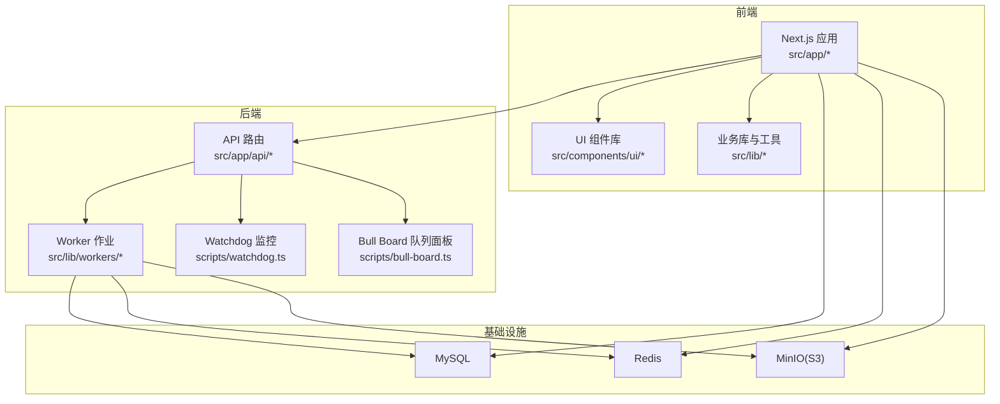
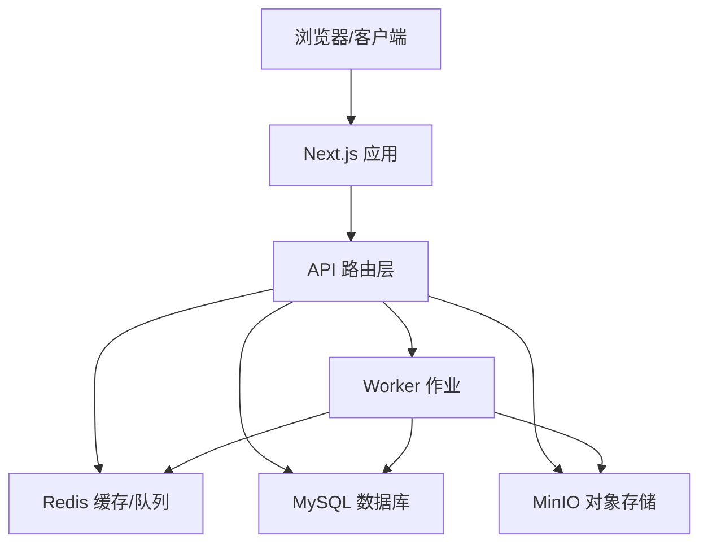
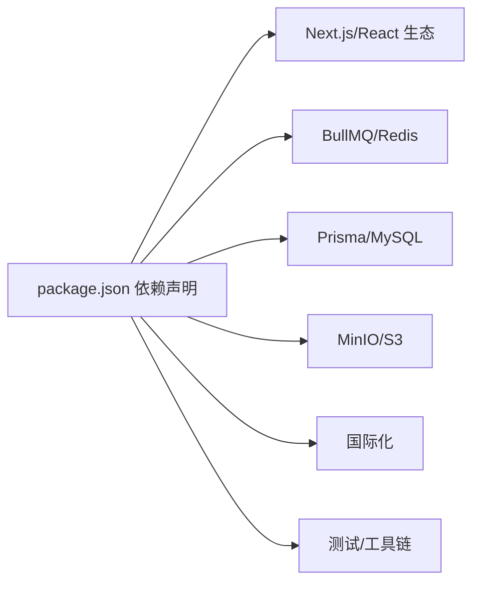
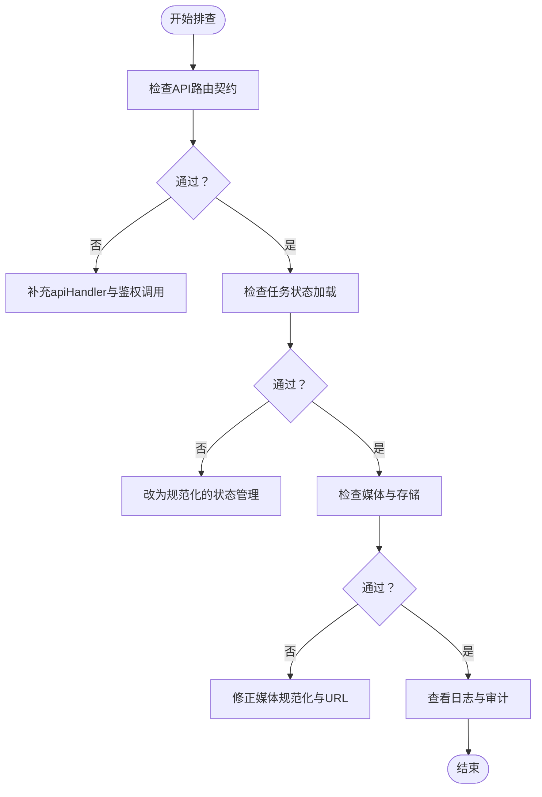

# 开发指南

<cite>
**本文引用的文件**
- [package.json](file://package.json)
- [eslint.config.mjs](file://eslint.config.mjs)
- [tsconfig.json](file://tsconfig.json)
- [vitest.config.ts](file://vitest.config.ts)
- [next.config.ts](file://next.config.ts)
- [.gitignore](file://.gitignore)
- [.dockerignore](file://.dockerignore)
- [Dockerfile](file://Dockerfile)
- [docker-compose.yml](file://docker-compose.yml)
- [docker-compose.test.yml](file://docker-compose.test.yml)
- [.github/workflows/docker-publish.yml](file://.github/workflows/docker-publish.yml)
- [scripts/guards/api-route-contract-guard.mjs](file://scripts/guards/api-route-contract-guard.mjs)
- [scripts/guards/task-loading-guard.mjs](file://scripts/guards/task-loading-guard.mjs)
</cite>

## 目录
1. [简介](#简介)
2. [项目结构](#项目结构)
3. [核心组件](#核心组件)
4. [架构总览](#架构总览)
5. [详细组件分析](#详细组件分析)
6. [依赖分析](#依赖分析)
7. [性能考虑](#性能考虑)
8. [故障排查指南](#故障排查指南)
9. [结论](#结论)
10. [附录](#附录)

## 简介
本开发指南面向Waoowaoo项目的开发者与维护者，系统性地定义了代码规范、提交规范、代码审查流程、TypeScript与ESLint配置、代码质量检查、Git工作流与分支策略、版本管理、开发环境配置与调试、性能分析、模块化与依赖管理、重构与技术债务治理、架构演进策略，以及团队协作、知识分享与贡献流程。目标是统一团队开发标准，降低沟通成本，提升交付质量与可维护性。

## 项目结构
Waoowaoo采用Next.js 15应用与多服务并行运行的工程组织方式：
- 前端应用位于src/app与src/components，使用React 19与Next 15框架
- 后端API路由集中于src/app/api，遵循Next.js App Router约定
- 任务队列与后台作业通过workers与BullMQ运行，配合Watchdog监控
- 国际化通过next-intl插件与独立配置文件实现
- Docker容器编排包含MySQL、Redis、MinIO与应用服务，支持一键本地部署与测试

图表来源
- [docker-compose.yml:1-153](file://docker-compose.yml#L1-L153)
- [package.json:12-25](file://package.json#L12-L25)

章节来源
- [package.json:12-25](file://package.json#L12-L25)
- [docker-compose.yml:63-147](file://docker-compose.yml#L63-L147)

## 核心组件
- 开发脚本与命令
  - 启动：dev、dev:next、dev:worker、dev:watchdog、dev:board；生产启动：start、start:next、start:worker、start:watchdog、start:board
  - 构建：build、build:turbo
  - 质量门禁：lint、typecheck、verify:commit、verify:push
  - 测试：test:guards、test:unit:all、test:integration:*、test:system、test:regression:cases、test:coverage:core-baseline
  - 迁移与运维：migrate:*、backup:*、billing:*、cleanup:*
- 质量检查脚本：check:* 与 guards/* 脚本，覆盖API路由契约、媒体规范化、任务状态加载、国际化提示等
- 配置中心：TypeScript、ESLint、Vitest、Next.js、Docker与Compose

章节来源
- [package.json:9-111](file://package.json#L9-L111)
- [eslint.config.mjs:12-50](file://eslint.config.mjs#L12-L50)
- [tsconfig.json:1-28](file://tsconfig.json#L1-L28)
- [vitest.config.ts:1-45](file://vitest.config.ts#L1-L45)
- [next.config.ts:1-24](file://next.config.ts#L1-L24)

## 架构总览
Waoowaoo采用“前端Next.js + 后端API + 任务队列/Worker + 外部存储”的分层架构。前端负责UI与交互，API层负责鉴权、路由与业务编排，Worker负责异步任务执行，外部存储（MySQL、Redis、MinIO）支撑数据与缓存、对象存储。

图表来源
- [docker-compose.yml:63-147](file://docker-compose.yml#L63-L147)
- [package.json:12-25](file://package.json#L12-L25)

## 详细组件分析

### 代码规范与质量门禁
- ESLint配置
  - 使用Flat Config与Next.js推荐规则扩展
  - 忽略目录：node_modules、.agent、.next、out、build、coverage、next-env.d.ts
  - 限制导入：禁止直接从lucide-react导入图标，必须通过统一图标模块
  - 限制语法：禁止在组件中直接使用原生<svg>标签，需使用AppIcon或图标模块组件
- TypeScript配置
  - 严格模式、不输出编译产物、模块解析bundler、路径别名@/*
  - JSX保留、增量编译、隔离模块
- Vitest配置
  - 别名@指向src，测试超时与钩子超时合理设置
  - 覆盖率仅对核心计费模块生效，阈值80%
- Git与Docker忽略
  - .gitignore与.dockerignore排除依赖、构建产物、日志、数据库文件、临时文件与敏感环境变量

章节来源
- [eslint.config.mjs:12-50](file://eslint.config.mjs#L12-L50)
- [tsconfig.json:1-28](file://tsconfig.json#L1-L28)
- [vitest.config.ts:15-42](file://vitest.config.ts#L15-L42)
- [.gitignore:1-90](file://.gitignore#L1-L90)
- [.dockerignore:1-54](file://.dockerignore#L1-L54)

### 提交规范与代码审查流程
- 提交前验证
  - 执行npm run verify:commit：ESLint全量检查、类型检查、全量测试
  - 执行npm run verify:push：在verify:commit基础上增加构建校验
- 代码审查建议
  - 优先通过质量门禁脚本（check:*、guards/*）提前发现问题
  - 关注API路由契约、任务状态加载、媒体规范化、国际化提示等专项检查
  - 评审覆盖率与测试矩阵，确保关键路径有单元/集成/系统测试覆盖

章节来源
- [package.json:94-96](file://package.json#L94-L96)
- [scripts/guards/api-route-contract-guard.mjs:1-117](file://scripts/guards/api-route-contract-guard.mjs#L1-L117)
- [scripts/guards/task-loading-guard.mjs:1-133](file://scripts/guards/task-loading-guard.mjs#L1-L133)

### Git工作流与分支策略
- 分支策略
  - 主分支：main用于发布稳定版本
  - 发布标签：以v*命名的tag触发镜像构建与发布
- 提交流程
  - 在本地执行verify:commit与verify:push，确保通过所有质量门禁
  - 推送至远程分支，发起PR进行代码审查
- GitHub Actions
  - docker-publish.yml在推送main或v*标签时自动构建并推送镜像到GHCR

章节来源
- [.github/workflows/docker-publish.yml:1-56](file://.github/workflows/docker-publish.yml#L1-L56)
- [package.json:94-96](file://package.json#L94-L96)

### 版本管理与发布
- 版本号：项目根目录package.json中定义
- 发布流程：打标签v*后由CI自动构建镜像并推送到GHCR
- 本地验证：可通过docker-compose快速拉起完整环境进行端到端验证

章节来源
- [package.json:2-4](file://package.json#L2-L4)
- [.github/workflows/docker-publish.yml:3-6](file://.github/workflows/docker-publish.yml#L3-L6)

### 开发环境配置与调试
- 本地开发
  - 使用npm run dev启动前端、Worker、Watchdog、Bull Board四路服务
  - 使用docker-compose快速搭建MySQL、Redis、MinIO与应用服务
- 环境变量
  - 通过.env注入，Compose中提供默认值，生产环境由部署平台注入
- 调试技巧
  - 使用Bull Board查看队列状态与错误
  - 使用日志开关与审计日志定位问题
  - 使用测试脚本与守卫脚本快速定位问题域

章节来源
- [package.json:12-25](file://package.json#L12-L25)
- [docker-compose.yml:63-147](file://docker-compose.yml#L63-L147)

### 性能分析与优化
- 构建性能
  - 支持--turbopack模式的开发与构建脚本，加速迭代
- 运行时性能
  - 使用Redis缓存热点数据，避免重复计算
  - 使用MinIO作为S3兼容对象存储，优化图片/视频等大文件访问
- 监控与可观测性
  - Watchdog监控任务心跳与异常
  - 日志格式化与脱敏，便于问题追踪

章节来源
- [package.json:17-19](file://package.json#L17-L19)
- [docker-compose.yml:63-147](file://docker-compose.yml#L63-L147)

### 模块化开发与依赖管理
- 路径别名与模块边界
  - TypeScript路径别名@/*映射到src，统一模块导入路径
  - ESLint限制图标与SVG使用，避免跨模块滥用
- 依赖分层
  - 前端：Next.js、React、UI库、国际化
  - 任务与存储：BullMQ、ioredis、Prisma、MinIO SDK
  - 工具与测试：Vitest、Concurrently、TSX、TailwindCSS
- 版本兼容性
  - Node引擎要求>=18.18.0，NPM>=9.0.0
  - Next.js 15，React 19，TypeScript 5

章节来源
- [tsconfig.json:21-23](file://tsconfig.json#L21-L23)
- [eslint.config.mjs:29-47](file://eslint.config.mjs#L29-L47)
- [package.json:5-8](file://package.json#L5-L8)
- [package.json:112-162](file://package.json#L112-L162)

### 代码重构与技术债务管理
- 专项守卫脚本
  - API路由契约守卫：强制使用apiHandler包装与鉴权调用
  - 任务加载守卫：限制组件级直接使用任务状态，统一通过规范化的状态管理
- 回归与稳定性
  - 提供canary与AB回归检查脚本，保障提示语义与行为稳定性
- 重构建议
  - 优先解决守卫脚本报错，再进行大范围重构
  - 保持模块边界清晰，避免跨域状态标签复用

章节来源
- [scripts/guards/api-route-contract-guard.mjs:11-78](file://scripts/guards/api-route-contract-guard.mjs#L11-L78)
- [scripts/guards/task-loading-guard.mjs:52-99](file://scripts/guards/task-loading-guard.mjs#L52-L99)

### 架构演进与最佳实践
- API路由演进
  - 强制鉴权与包装器，确保安全与一致性
- 任务系统演进
  - 统一任务状态管理，避免UI直接读取底层状态
- 国际化演进
  - 通过守卫脚本保证提示语义与模板一致性
- 部署演进
  - Docker多阶段构建，生产镜像精简，支持amd64/arm64

章节来源
- [scripts/guards/api-route-contract-guard.mjs:67-79](file://scripts/guards/api-route-contract-guard.mjs#L67-L79)
- [scripts/guards/task-loading-guard.mjs:61-76](file://scripts/guards/task-loading-guard.mjs#L61-L76)
- [Dockerfile:1-61](file://Dockerfile#L1-L61)

### 团队协作与学习路径
- 规范学习
  - 阅读ESLint与TypeScript配置，理解项目约束
  - 熟悉质量门禁脚本与守卫脚本，掌握常见问题定位方法
- 实践路径
  - 从最小改动开始，先通过verify:commit，再逐步引入新特性
  - 参与PR评审，关注质量门禁与测试覆盖率
- 知识分享
  - 将常用调试技巧、守卫脚本使用方法、Docker部署经验沉淀为内部文档

章节来源
- [package.json:94-96](file://package.json#L94-L96)
- [scripts/guards/api-route-contract-guard.mjs:1-117](file://scripts/guards/api-route-contract-guard.mjs#L1-L117)
- [scripts/guards/task-loading-guard.mjs:1-133](file://scripts/guards/task-loading-guard.mjs#L1-L133)

### 贡献流程与问题处理
- 贡献流程
  - Fork仓库 -> 新建分支 -> 本地开发与质量门禁 -> 提交PR -> 代码评审 -> 合并
- 问题报告
  - 提供最小复现步骤、环境信息、日志片段与相关守卫脚本输出
- 功能请求
  - 明确需求背景、影响范围与验收标准，必要时提供测试用例与守卫脚本

章节来源
- [package.json:94-96](file://package.json#L94-L96)
- [docker-compose.yml:63-147](file://docker-compose.yml#L63-L147)

## 依赖分析
- 前端与UI
  - Next.js 15、React 19、@tanstack/react-query、lucide-react、geist
- 任务与队列
  - BullMQ、ioredis、@bull-board/*、tsx
- 存储与数据库
  - @prisma/client、Prisma适配器、MySQL、MinIO SDK
- 国际化
  - next-intl、国际化消息与路由配置
- 工具链
  - Vitest、ESLint、TypeScript、TailwindCSS、Concurrently

图表来源
- [package.json:112-162](file://package.json#L112-L162)

章节来源
- [package.json:112-162](file://package.json#L112-L162)

## 性能考虑
- 构建与启动
  - Turbopack模式提升开发体验
  - 并行启动前端、Worker、Watchdog与Bull Board
- 运行时
  - Redis缓存与队列并发度可按环境调整
  - MinIO作为S3兼容存储，减少跨域与网络抖动
- 监控
  - Watchdog与Bull Board结合，及时发现慢任务与失败任务

章节来源
- [package.json:12-25](file://package.json#L12-L25)
- [docker-compose.yml:94-100](file://docker-compose.yml#L94-L100)

## 故障排查指南
- API路由问题
  - 使用API路由契约守卫脚本定位缺失鉴权或包装器的问题
- 任务状态加载异常
  - 使用任务加载守卫脚本定位UI中直接使用底层状态的违规用法
- 媒体与存储
  - 使用媒体规范化与URL合约检查脚本定位异常
- 日志与审计
  - 通过Compose中的日志目录与日志开关定位问题

图表来源
- [scripts/guards/api-route-contract-guard.mjs:81-90](file://scripts/guards/api-route-contract-guard.mjs#L81-L90)
- [scripts/guards/task-loading-guard.mjs:59-99](file://scripts/guards/task-loading-guard.mjs#L59-L99)

章节来源
- [scripts/guards/api-route-contract-guard.mjs:81-90](file://scripts/guards/api-route-contract-guard.mjs#L81-L90)
- [scripts/guards/task-loading-guard.mjs:59-99](file://scripts/guards/task-loading-guard.mjs#L59-L99)

## 结论
本开发指南基于现有配置与脚本，建立了从代码规范、质量门禁、Git工作流到部署与运维的完整标准。建议团队在日常开发中严格遵循verify:commit/verify:push流程，优先通过守卫脚本与测试用例暴露问题，持续完善测试矩阵与覆盖率，推动架构与流程的稳健演进。

## 附录
- Next.js配置要点
  - 国际化插件启用，允许的开发源与图片远端/本地模式
- Docker与Compose
  - 多阶段构建、生产镜像精简、Compose一键拉起完整环境
- 质量门禁清单
  - ESLint、TypeScript、测试、构建、守卫脚本与迁移脚本

章节来源
- [next.config.ts:1-24](file://next.config.ts#L1-L24)
- [Dockerfile:1-61](file://Dockerfile#L1-L61)
- [docker-compose.yml:63-147](file://docker-compose.yml#L63-L147)
- [package.json:27-111](file://package.json#L27-L111)