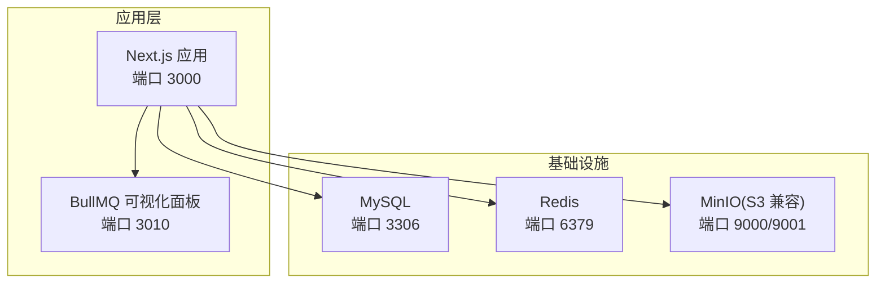
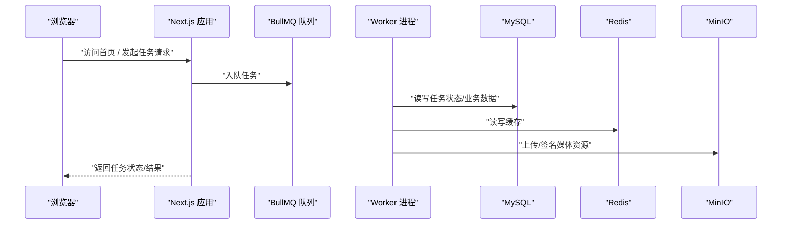
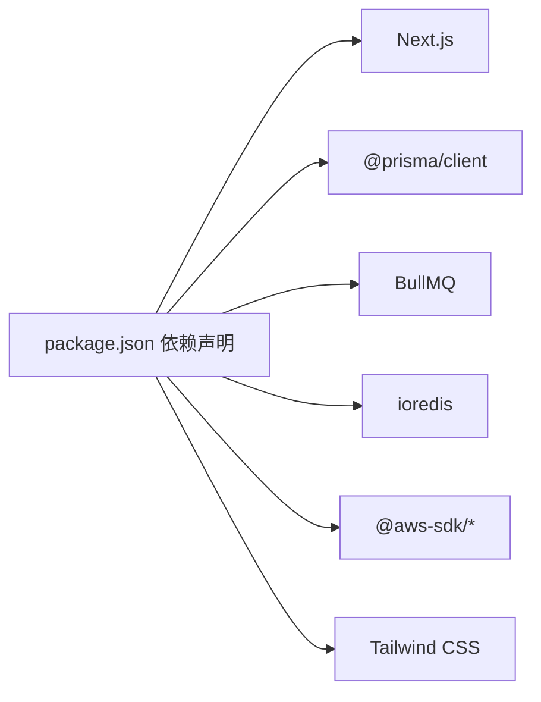

# 快速开始

<cite>
**本文引用的文件**
- [package.json](file://package.json)
- [Dockerfile](file://Dockerfile)
- [docker-compose.yml](file://docker-compose.yml)
- [README_en.md](file://README_en.md)
- [src/lib/env.ts](file://src/lib/env.ts)
- [prisma/schema.prisma](file://prisma/schema.prisma)
- [src/lib/storage/init.ts](file://src/lib/storage/init.ts)
- [src/lib/redis.ts](file://src/lib/redis.ts)
- [src/lib/prisma.ts](file://src/lib/prisma.ts)
- [scripts/watchdog.ts](file://scripts/watchdog.ts)
- [scripts/bull-board.ts](file://scripts/bull-board.ts)
- [tests/setup/global-setup.ts](file://tests/setup/global-setup.ts)
- [tests/system/generate-image.system.test.ts](file://tests/system/generate-image.system.test.ts)
</cite>

## 目录
1. [简介](#简介)
2. [项目结构](#项目结构)
3. [核心组件](#核心组件)
4. [架构总览](#架构总览)
5. [详细组件解析](#详细组件解析)
6. [依赖关系分析](#依赖关系分析)
7. [性能注意事项](#性能注意事项)
8. [故障排查指南](#故障排查指南)
9. [结论](#结论)
10. [附录](#附录)

## 简介
本指南面向初学者与有经验的开发者，帮助你在最短时间内完成 Waoowaoo 的安装与首次运行。内容涵盖：
- 环境要求与安装步骤（Node.js 版本、依赖安装、环境变量）
- Docker 一键部署与传统开发部署的差异与适用场景
- 数据库、Redis、存储服务的初始化与配置
- 首次运行验证方法与常见问题解决
- 简单示例与测试用例，帮助你快速确认安装成功

## 项目结构
Waoowaoo 是一个基于 Next.js 15 + React 19 的全栈应用，采用 MySQL + Prisma 作为持久层，Redis + BullMQ 作为队列与缓存，MinIO 提供对象存储，配合 Worker、Watchdog 与 BullMQ 可视化面板共同构成异步任务体系。

图表来源
- [docker-compose.yml:1-153](file://docker-compose.yml#L1-L153)
- [Dockerfile:1-61](file://Dockerfile#L1-L61)

章节来源
- [README_en.md:30-95](file://README_en.md#L30-L95)
- [docker-compose.yml:1-153](file://docker-compose.yml#L1-L153)

## 核心组件
- 应用服务（Next.js）：负责页面渲染、API 路由、认证与业务逻辑。
- 队列与工作进程：BullMQ + ioredis，承载图像/视频/语音/文本等异步任务。
- 存储服务：MinIO（S3 兼容），用于媒体资源上传与访问。
- 监控与运维：Watchdog（任务心跳与恢复）、BullMQ 可视化面板（队列管理）。
- 数据库：MySQL，ORM 使用 Prisma。

章节来源
- [package.json:112-162](file://package.json#L112-L162)
- [src/lib/redis.ts:1-76](file://src/lib/redis.ts#L1-L76)
- [src/lib/prisma.ts:1-9](file://src/lib/prisma.ts#L1-L9)
- [scripts/watchdog.ts:1-226](file://scripts/watchdog.ts#L1-L226)
- [scripts/bull-board.ts:1-106](file://scripts/bull-board.ts#L1-L106)

## 架构总览
下图展示了应用启动与任务流转的关键路径，以及各组件间的交互关系。

图表来源
- [docker-compose.yml:63-147](file://docker-compose.yml#L63-L147)
- [src/lib/redis.ts:1-76](file://src/lib/redis.ts#L1-L76)
- [src/lib/prisma.ts:1-9](file://src/lib/prisma.ts#L1-L9)
- [src/lib/storage/init.ts:1-25](file://src/lib/storage/init.ts#L1-L25)

## 详细组件解析

### 安装与环境准备
- Node.js 版本要求：>= 18.18.0（参见 engines 字段）
- 包管理器：建议使用 npm >= 9.0.0
- 依赖安装：执行 npm install
- 环境变量：首次运行会自动初始化存储桶；请在 .env 中配置 NEXTAUTH_URL、API 密钥等

章节来源
- [package.json:5-8](file://package.json#L5-L8)
- [README_en.md:71-91](file://README_en.md#L71-L91)

### 部署方式对比与适用场景
- Docker 一键部署（推荐新手）
  - 优点：零配置、一键启动、版本隔离
  - 适用：快速体验、演示、生产最小可用
  - 命令：下载 docker-compose.yml 后 docker compose up -d
- 本地开发部署（推荐开发者）
  - 优点：可调试、热更新、便于扩展
  - 适用：二次开发、联调第三方服务
  - 步骤：克隆仓库、复制 .env、启动 MySQL/Redis/MinIO、执行迁移、运行 npm run dev

章节来源
- [README_en.md:30-95](file://README_en.md#L30-L95)
- [docker-compose.yml:1-153](file://docker-compose.yml#L1-L153)

### 环境变量与配置要点
- 应用基础
  - NEXTAUTH_URL：外部访问地址（浏览器）
  - INTERNAL_APP_URL：容器内自调用地址（服务端内部 API）
- 数据库
  - DATABASE_URL：指向 MySQL
- 缓存
  - REDIS_HOST、REDIS_PORT、REDIS_USERNAME、REDIS_PASSWORD、REDIS_TLS
- 存储
  - STORAGE_TYPE=minio
  - MINIO_ENDPOINT、MINIO_REGION、MINIO_BUCKET、MINIO_ACCESS_KEY、MINIO_SECRET_KEY、MINIO_FORCE_PATH_STYLE
- 认证与安全
  - NEXTAUTH_SECRET、API_ENCRYPTION_KEY
- 运维
  - WATCHDOG_INTERVAL_MS、TASK_HEARTBEAT_TIMEOUT_MS
  - BULL_BOARD_HOST、BULL_BOARD_PORT、BULL_BOARD_BASE_PATH、BULL_BOARD_USER、BULL_BOARD_PASSWORD
- 日志
  - LOG_UNIFIED_ENABLED、LOG_LEVEL、LOG_FORMAT、LOG_DEBUG_ENABLED、LOG_AUDIT_ENABLED、LOG_SERVICE、LOG_REDACT_KEYS
- 计费
  - BILLING_MODE（示例：OFF）

章节来源
- [src/lib/env.ts:1-38](file://src/lib/env.ts#L1-L38)
- [docker-compose.yml:68-114](file://docker-compose.yml#L68-L114)

### 数据库初始化与校验
- 方式一：Docker Compose 启动后自动执行 npx prisma db push（跳过 generate）
- 方式二：本地开发先启动 MySQL/Redis/MinIO，再执行 npx prisma db push
- Prisma Schema 指向 MySQL，包含用户、项目、任务、计费等核心模型

章节来源
- [docker-compose.yml:132-146](file://docker-compose.yml#L132-L146)
- [prisma/schema.prisma:1-8](file://prisma/schema.prisma#L1-L8)
- [tests/setup/global-setup.ts:88-94](file://tests/setup/global-setup.ts#L88-L94)

### Redis 配置与连接
- 支持用户名/密码、TLS、延迟连接（测试环境）
- 应用连接与队列连接分离，队列客户端禁用请求重试以避免副作用
- 提供订阅客户端创建函数

章节来源
- [src/lib/redis.ts:13-76](file://src/lib/redis.ts#L13-L76)

### 存储服务初始化
- 启动时通过脚本确保 MinIO Bucket 存在，不存在则创建
- 日志输出“已创建”或“已验证”提示

章节来源
- [src/lib/storage/init.ts:1-25](file://src/lib/storage/init.ts#L1-L25)
- [docker-compose.yml:77-84](file://docker-compose.yml#L77-L84)

### 队列与任务监控
- Watchdog
  - 周期性扫描“排队但未入队”的任务并重新入队
  - 检测“处理中但无心跳”的僵尸任务并标记失败或重新入队
  - 每小时清理日志
- BullMQ 可视化面板
  - 支持基本鉴权
  - 暴露图像/视频/语音/文本队列管理界面

章节来源
- [scripts/watchdog.ts:1-226](file://scripts/watchdog.ts#L1-L226)
- [scripts/bull-board.ts:1-106](file://scripts/bull-board.ts#L1-L106)

### 首次运行验证步骤
- 访问地址
  - Docker 方式：http://localhost:13000
  - 本地开发：http://localhost:3000
- 登录与配置
  - 首次登录后进入设置页，配置你的 AI 服务 API Key
- 系统级验证
  - 执行系统测试：生成图像任务，观察任务从 queued 到 completed 的生命周期，并检查数据库中目标实体的 imageUrl 更新
  - 参考测试用例：tests/system/generate-image.system.test.ts

章节来源
- [README_en.md:95-104](file://README_en.md#L95-L104)
- [tests/system/generate-image.system.test.ts:58-99](file://tests/system/generate-image.system.test.ts#L58-L99)

### 示例项目与测试用例
- 系统测试：generate-image.system.test.ts
  - 行为：调用 /api/.../generate-image 接口 -> 入队 -> Worker 处理 -> 更新数据库 -> 事件上报
  - 断言：任务状态、事件类型、目标实体字段变更
- 单元测试：可参考错误归一化、错误码契约等测试文件，理解错误处理策略

章节来源
- [tests/system/generate-image.system.test.ts:1-143](file://tests/system/generate-image.system.test.ts#L1-L143)

## 依赖关系分析
- 应用层依赖 Next.js、React、Prisma、NextAuth、Tailwind 等
- 异步任务依赖 BullMQ、ioredis
- 存储依赖 AWS SDK（S3 兼容）、MinIO
- 开发工具链：Vitest、ESLint、TypeScript、Concurrently

图表来源
- [package.json:112-162](file://package.json#L112-L162)

章节来源
- [package.json:112-162](file://package.json#L112-L162)

## 性能注意事项
- HTTP 模式可能限制浏览器并发，建议在生产环境中启用 HTTPS（例如通过 Caddy）
- 合理设置队列并发（QUEUE_CONCURRENCY_*）与 Watchdog 心跳超时，避免僵尸任务堆积
- 使用 MinIO 时开启路径风格访问（MINIO_FORCE_PATH_STYLE=true）以提升兼容性

章节来源
- [README_en.md:99-104](file://README_en.md#L99-L104)
- [docker-compose.yml:94-100](file://docker-compose.yml#L94-L100)
- [scripts/watchdog.ts:10-11](file://scripts/watchdog.ts#L10-L11)

## 故障排查指南
- 数据库未就绪
  - 现象：应用启动时报数据库连接错误
  - 处理：等待 MySQL 健康检查通过后再启动应用；或在本地开发模式下先启动 MySQL/Redis/MinIO
- Redis 连接失败
  - 现象：应用日志出现 Redis 错误
  - 处理：核对 REDIS_HOST/PORT/USERNAME/PASSWORD/TLS；测试环境可启用 lazyConnect
- 存储桶不存在
  - 现象：启动时报错无法访问 MinIO Bucket
  - 处理：确认 MINIO_BUCKET 已创建；首次启动会自动创建，若失败需手动创建
- 任务长时间无响应
  - 现象：任务卡在 processing 或 queued
  - 处理：检查 Watchdog 是否正常运行；查看队列面板确认任务积压；适当提高并发或优化上游服务
- 错误码与重试策略
  - 现象：网络异常、模型未开通等错误
  - 处理：参考错误归一化与错误码契约测试，区分可重试与不可重试错误，按状态码策略处理

章节来源
- [tests/setup/global-setup.ts:19-68](file://tests/setup/global-setup.ts#L19-L68)
- [src/lib/redis.ts:20-34](file://src/lib/redis.ts#L20-L34)
- [src/lib/storage/init.ts:1-25](file://src/lib/storage/init.ts#L1-L25)
- [scripts/watchdog.ts:128-184](file://scripts/watchdog.ts#L128-L184)
- [tests/unit/task/normalize-error.test.ts:1-33](file://tests/unit/task/normalize-error.test.ts#L1-L33)
- [tests/unit/task/error-catalog.contract.test.ts:1-27](file://tests/unit/task/error-catalog.contract.test.ts#L1-L27)

## 结论
通过本指南，你可以：
- 在 Docker 或本地开发环境下快速完成安装与配置
- 明确数据库、Redis、存储服务的初始化流程
- 使用系统测试验证核心功能
- 面向生产环境优化性能与稳定性

## 附录

### 环境变量清单（摘要）
- 应用与认证
  - NEXTAUTH_URL、INTERNAL_APP_URL、NEXTAUTH_SECRET、API_ENCRYPTION_KEY
- 数据库
  - DATABASE_URL
- 缓存
  - REDIS_HOST、REDIS_PORT、REDIS_USERNAME、REDIS_PASSWORD、REDIS_TLS
- 存储
  - STORAGE_TYPE、MINIO_ENDPOINT、MINIO_REGION、MINIO_BUCKET、MINIO_ACCESS_KEY、MINIO_SECRET_KEY、MINIO_FORCE_PATH_STYLE
- 运维
  - WATCHDOG_INTERVAL_MS、TASK_HEARTBEAT_TIMEOUT_MS、BULL_BOARD_HOST、BULL_BOARD_PORT、BULL_BOARD_BASE_PATH、BULL_BOARD_USER、BULL_BOARD_PASSWORD
- 日志
  - LOG_UNIFIED_ENABLED、LOG_LEVEL、LOG_FORMAT、LOG_DEBUG_ENABLED、LOG_AUDIT_ENABLED、LOG_SERVICE、LOG_REDACT_KEYS
- 计费
  - BILLING_MODE

章节来源
- [src/lib/env.ts:1-38](file://src/lib/env.ts#L1-L38)
- [docker-compose.yml:68-114](file://docker-compose.yml#L68-L114)