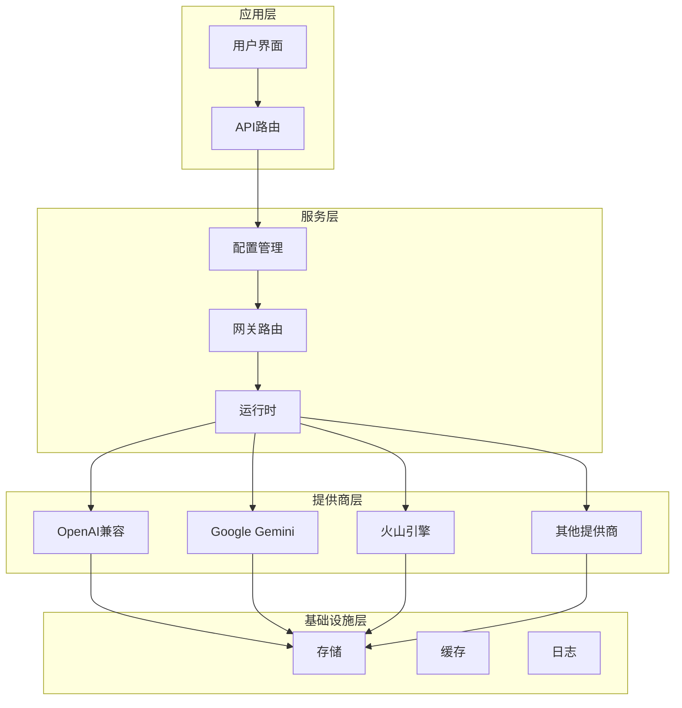
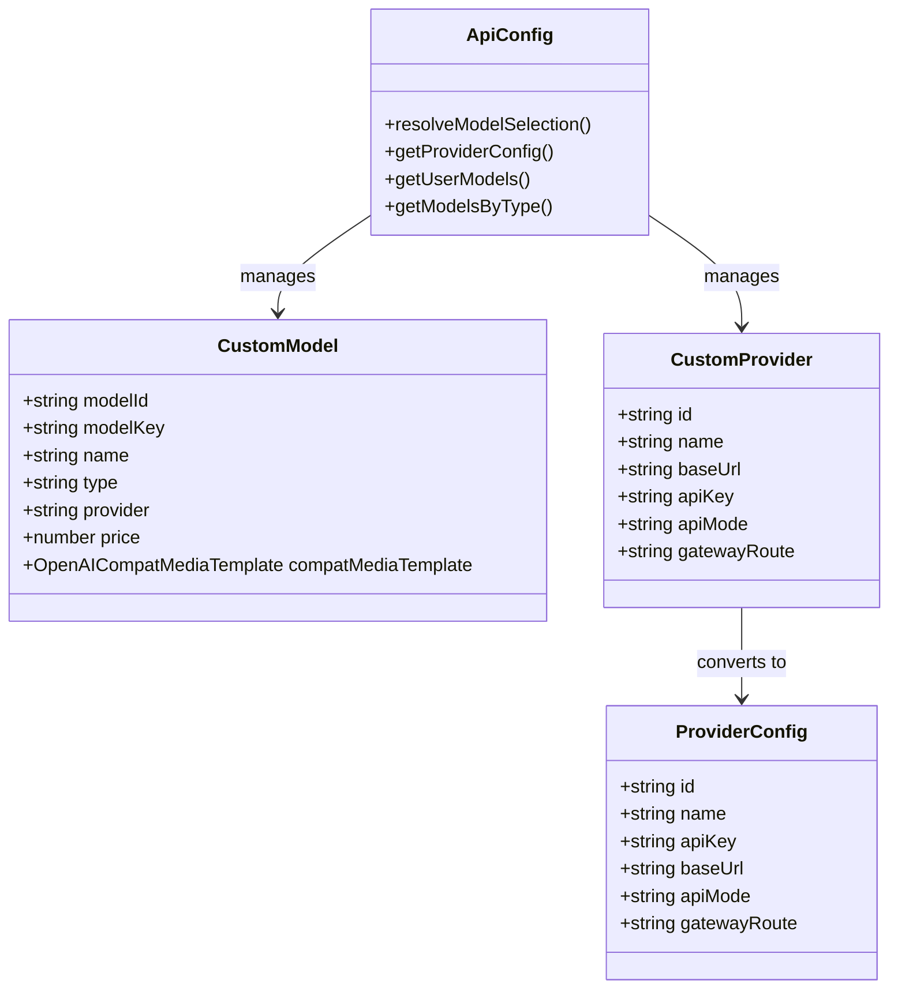
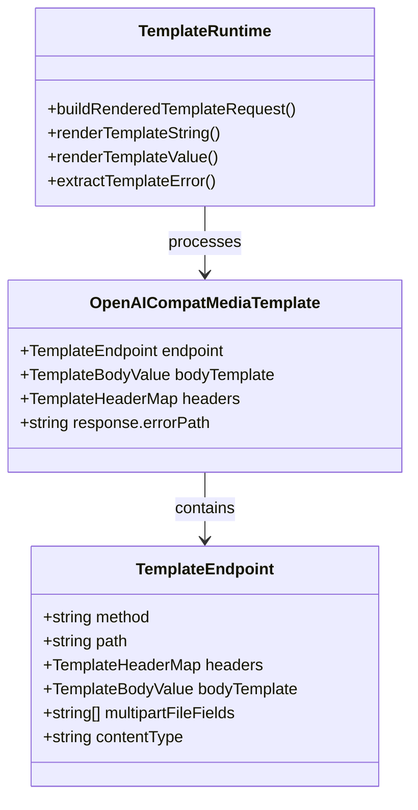
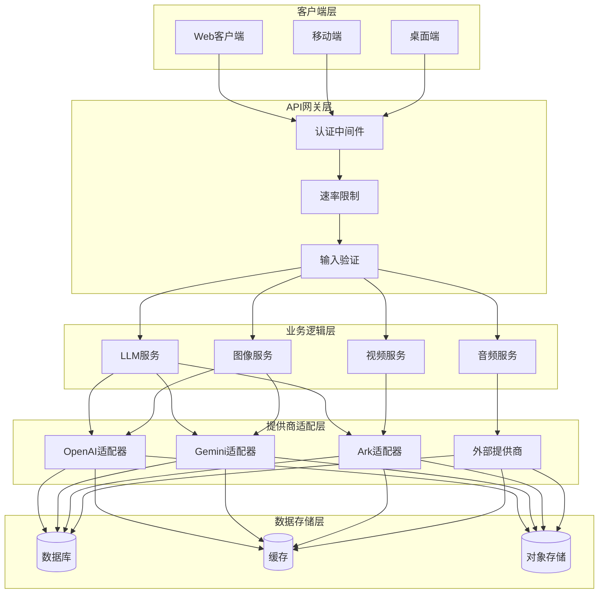
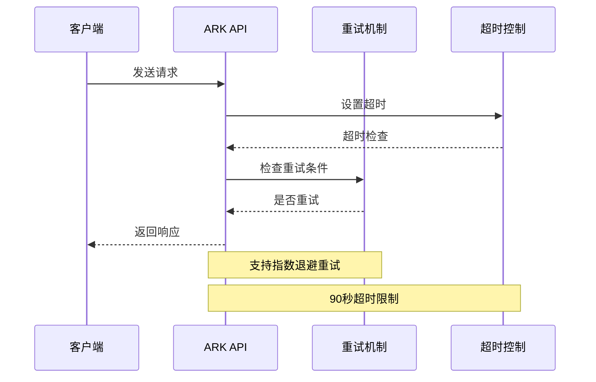
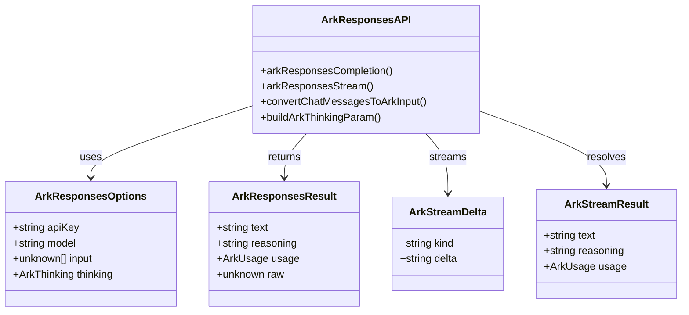
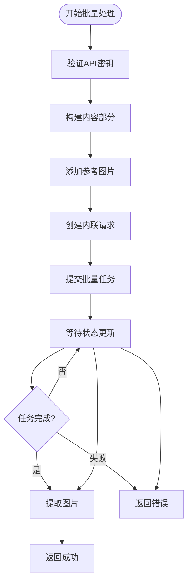
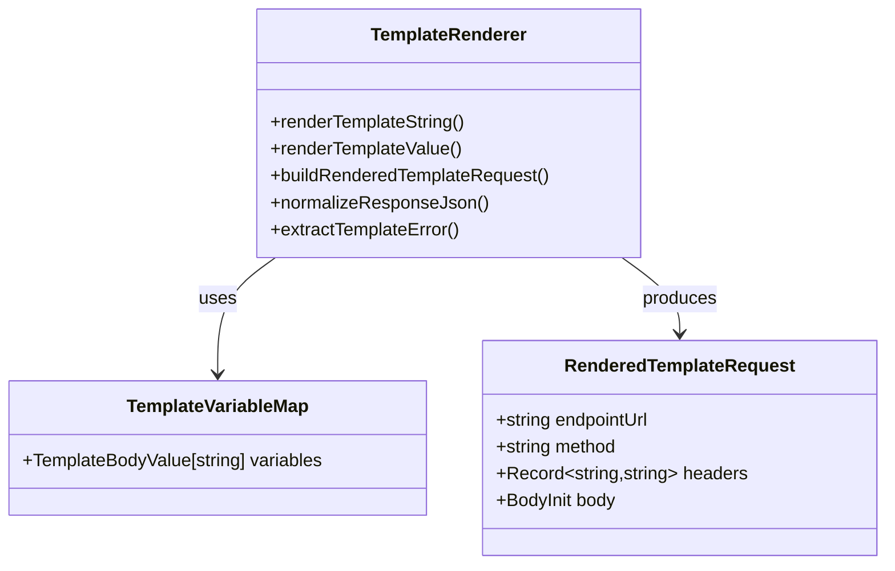
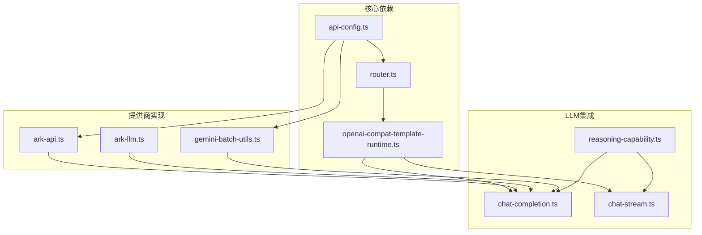
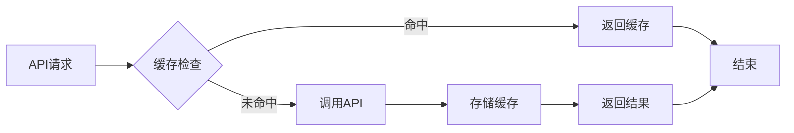

# AI服务提供商实现

<cite>
**本文档引用的文件**
- [ark-api.ts](file://src/lib/ark-api.ts)
- [gemini-batch-utils.ts](file://src/lib/gemini-batch-utils.ts)
- [openai-compat-template-runtime.ts](file://src/lib/openai-compat-template-runtime.ts)
- [api-config.ts](file://src/lib/api-config.ts)
- [ark-llm.ts](file://src/lib/ark-llm.ts)
- [router.ts](file://src/lib/model-gateway/router.ts)
- [catalog.example.json](file://standards/capabilities/catalog.example.json)
- [image-video.catalog.json](file://standards/capabilities/image-video.catalog.json)
- [image-video.pricing.json](file://standards/pricing/image-video.pricing.json)
- [chat-completion.ts](file://src/lib/llm/chat-completion.ts)
- [chat-stream.ts](file://src/lib/llm/chat-stream.ts)
- [reasoning-capability.ts](file://src/lib/llm/reasoning-capability.ts)
</cite>

## 目录
1. [简介](#简介)
2. [项目结构](#项目结构)
3. [核心组件](#核心组件)
4. [架构概览](#架构概览)
5. [详细组件分析](#详细组件分析)
6. [依赖关系分析](#依赖关系分析)
7. [性能考虑](#性能考虑)
8. [故障排除指南](#故障排除指南)
9. [结论](#结论)
10. [附录](#附录)

## 简介

Waoowaoo是一个AI服务提供商实现的综合平台，支持多种AI服务提供商的集成。本文档详细介绍了OpenAI兼容API、Google Gemini、Ark和其他AI服务的具体集成方案，包括认证机制、API适配器实现和错误处理策略。

该项目实现了统一的AI服务抽象层，支持图像生成、视频生成和语音合成等多种能力。通过标准化的配置管理和路由机制，实现了跨提供商的服务切换、负载均衡和故障转移功能。

## 项目结构

项目采用模块化架构设计，主要分为以下几个核心层次：



**图表来源**
- [api-config.ts:1-509](file://src/lib/api-config.ts#L1-L509)
- [router.ts:1-22](file://src/lib/model-gateway/router.ts#L1-L22)

**章节来源**
- [api-config.ts:1-509](file://src/lib/api-config.ts#L1-L509)
- [router.ts:1-22](file://src/lib/model-gateway/router.ts#L1-L22)

## 核心组件

### API配置管理

API配置管理系统提供了严格的配置中心模式，确保模型键的唯一性和提供商的正确性。



**图表来源**
- [api-config.ts:23-58](file://src/lib/api-config.ts#L23-L58)

### OpenAI兼容模板运行时

OpenAI兼容模板运行时提供了统一的API适配器，支持多种提供商的兼容性适配。



**图表来源**
- [openai-compat-template-runtime.ts:1-485](file://src/lib/openai-compat-template-runtime.ts#L1-L485)

**章节来源**
- [api-config.ts:1-509](file://src/lib/api-config.ts#L1-L509)
- [openai-compat-template-runtime.ts:1-485](file://src/lib/openai-compat-template-runtime.ts#L1-L485)

## 架构概览

系统采用分层架构设计，实现了高度的模块化和可扩展性：



**图表来源**
- [chat-completion.ts:173-364](file://src/lib/llm/chat-completion.ts#L173-L364)
- [chat-stream.ts:174-439](file://src/lib/llm/chat-stream.ts#L174-L439)

## 详细组件分析

### 火山引擎(ARK)集成

火山引擎提供了完整的LLM和媒体生成服务集成，包括响应式API和流式处理能力。

#### ARK API客户端



**图表来源**
- [ark-api.ts:314-411](file://src/lib/ark-api.ts#L314-L411)

#### ARK LLM响应式API



**图表来源**
- [ark-llm.ts:5-22](file://src/lib/ark-llm.ts#L5-L22)

**章节来源**
- [ark-api.ts:1-598](file://src/lib/ark-api.ts#L1-L598)
- [ark-llm.ts:1-340](file://src/lib/ark-llm.ts#L1-L340)

### Google Gemini集成

Google Gemini提供了强大的多模态AI服务能力，包括批量处理和流式响应。

#### Gemini批量处理工具



**图表来源**
- [gemini-batch-utils.ts:51-161](file://src/lib/gemini-batch-utils.ts#L51-L161)

**章节来源**
- [gemini-batch-utils.ts:1-263](file://src/lib/gemini-batch-utils.ts#L1-L263)

### OpenAI兼容适配器

OpenAI兼容适配器提供了统一的API接口，支持多种OpenAI兼容提供商。

#### 模板渲染系统



**图表来源**
- [openai-compat-template-runtime.ts:388-413](file://src/lib/openai-compat-template-runtime.ts#L388-L413)

**章节来源**
- [openai-compat-template-runtime.ts:1-485](file://src/lib/openai-compat-template-runtime.ts#L1-L485)

### 网关路由系统

网关路由系统实现了智能的提供商选择和路由决策机制。

```mermaid
stateDiagram-v2
[*] --> 检查提供商
检查提供商 --> 兼容提供商 : openai-compatible
检查提供商 --> 官方提供商 : bailian/siliconflow
检查提供商 --> 默认官方 : 其他提供商
兼容提供商 --> openai-compat
官方提供商 --> official
默认官方 --> official
openai-compat --> [*]
official --> [*]
```

**图表来源**
- [router.ts:17-22](file://src/lib/model-gateway/router.ts#L17-L22)

**章节来源**
- [router.ts:1-22](file://src/lib/model-gateway/router.ts#L1-L22)

## 依赖关系分析

系统中的关键依赖关系如下：



**图表来源**
- [api-config.ts:1-509](file://src/lib/api-config.ts#L1-L509)
- [router.ts:1-22](file://src/lib/model-gateway/router.ts#L1-L22)
- [openai-compat-template-runtime.ts:1-485](file://src/lib/openai-compat-template-runtime.ts#L1-L485)

**章节来源**
- [api-config.ts:1-509](file://src/lib/api-config.ts#L1-L509)
- [router.ts:1-22](file://src/lib/model-gateway/router.ts#L1-L22)

## 性能考虑

### 超时和重试机制

系统实现了智能的超时和重试机制，确保在各种网络条件下都能稳定运行：

- **超时设置**: 默认90秒超时，针对不同提供商可调整
- **指数退避重试**: 最多重试3次，延迟按2^n递增
- **智能错误分类**: 区分网络错误和业务错误，避免无效重试

### 缓存策略



### 并发控制

系统通过以下机制控制并发访问：

- **速率限制**: 基于用户和提供商的并发限制
- **队列管理**: 任务排队和优先级调度
- **资源监控**: 实时监控系统资源使用情况

## 故障排除指南

### 常见错误类型

| 错误类型 | 描述 | 解决方案 |
|---------|------|----------|
| PROVIDER_API_KEY_MISSING | 提供商API密钥缺失 | 检查用户配置中的API密钥 |
| MODEL_NOT_FOUND | 模型未找到 | 验证模型键格式和提供商配置 |
| PROVIDER_BASE_URL_MISSING | 提供商基础URL缺失 | 检查提供商配置的基础URL |
| OPENAI_COMPAT_TEMPLATE_VARIABLE_MISSING | 模板变量缺失 | 检查模板变量映射 |

### 调试建议

1. **启用详细日志**: 在开发环境中启用详细日志记录
2. **检查网络连接**: 验证提供商API的可达性
3. **验证认证信息**: 确认API密钥的有效性和权限
4. **监控超时**: 关注超时相关的错误信息

**章节来源**
- [ark-api.ts:21-49](file://src/lib/ark-api.ts#L21-L49)
- [api-config.ts:113-119](file://src/lib/api-config.ts#L113-L119)

## 结论

Waoowaoo的AI服务提供商实现展现了现代AI应用架构的最佳实践。通过统一的配置管理、灵活的适配器模式和智能的路由机制，系统实现了对多家AI提供商的无缝集成。

关键优势包括：
- **高度模块化**: 清晰的分层架构便于维护和扩展
- **统一接口**: 标准化的API接口简化了使用复杂度
- **智能路由**: 基于提供商特性的智能路由决策
- **健壮性**: 完善的错误处理和重试机制

该实现为AI服务的集成提供了坚实的基础，支持未来更多的提供商扩展和功能增强。

## 附录

### 配置示例

#### OpenAI兼容提供商配置
```json
{
  "id": "openai-compatible",
  "name": "OpenAI兼容提供商",
  "baseUrl": "https://api.openai.com/v1",
  "apiKey": "sk-xxxxxxxxxxxxxxxxxxxxxxxxxxxxxxxx",
  "apiMode": "openai-official",
  "gatewayRoute": "openai-compat"
}
```

#### 火山引擎提供商配置
```json
{
  "id": "ark",
  "name": "火山引擎",
  "baseUrl": "https://ark.cn-beijing.volces.com/api/v3",
  "apiKey": "your-ark-api-key",
  "gatewayRoute": "official"
}
```

### 能力声明格式

提供商能力声明遵循统一的JSON格式：

```json
{
  "modelType": "image",
  "provider": "example-provider",
  "modelId": "example-image-model",
  "capabilities": {
    "image": {
      "resolutionOptions": ["2K", "4K"],
      "fieldI18n": {
        "resolution": {
          "labelKey": "image.capability.resolution"
        }
      }
    }
  }
}
```

### 性价比对比

基于定价目录的对比分析显示：

- **Google Gemini**: 价格相对较高，但质量稳定
- **火山引擎**: 性价比最高，适合大规模使用
- **OpenAI兼容**: 价格适中，生态丰富