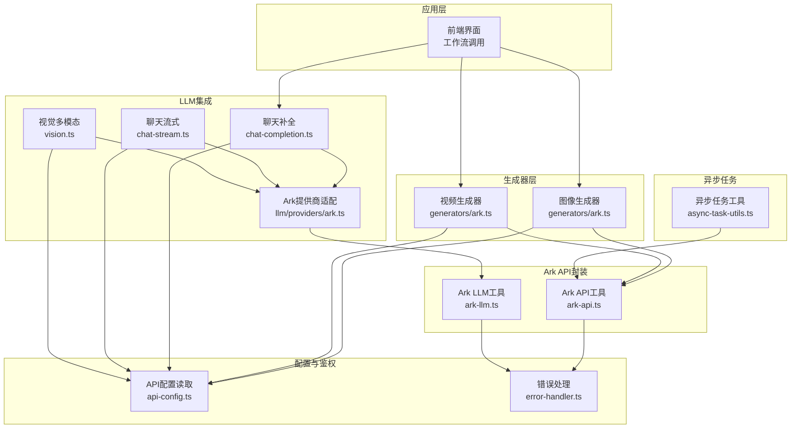
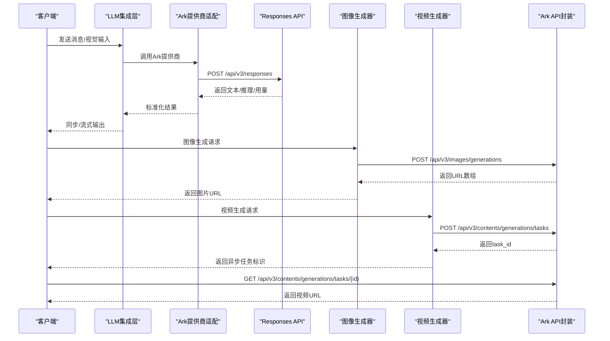
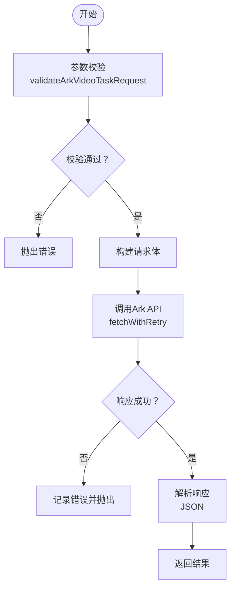
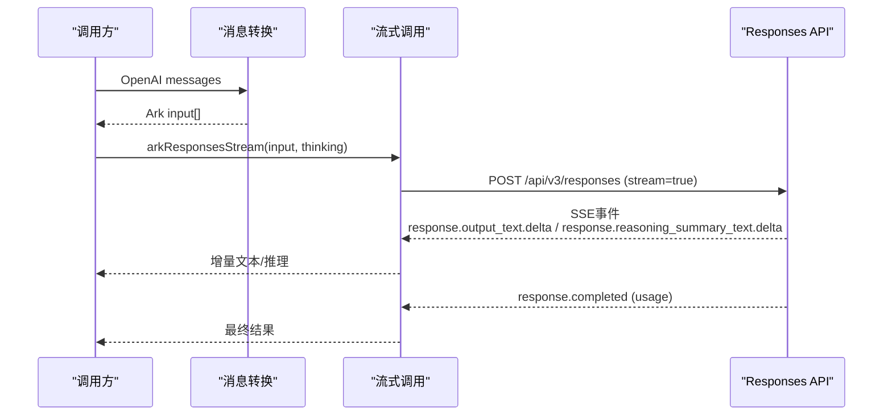
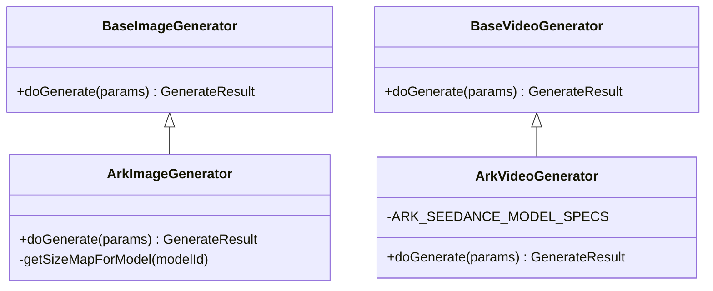
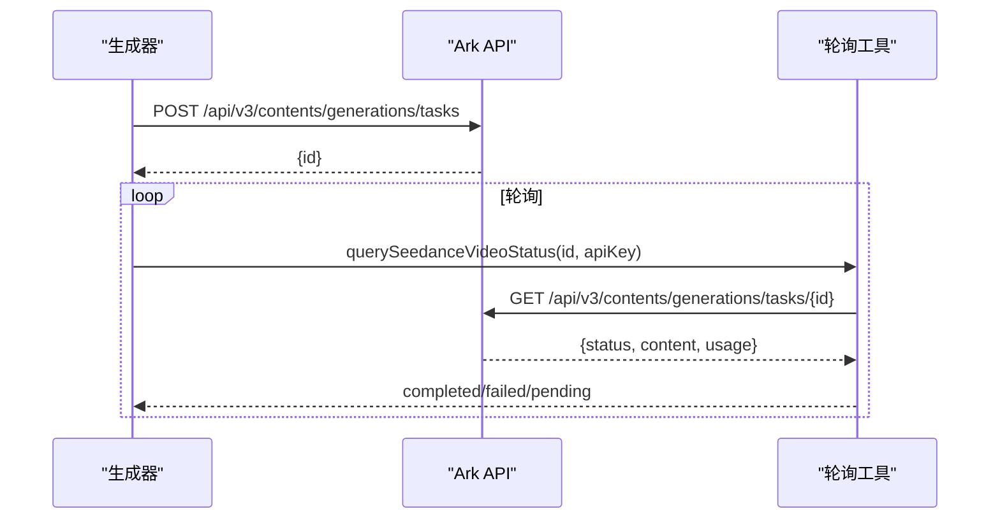
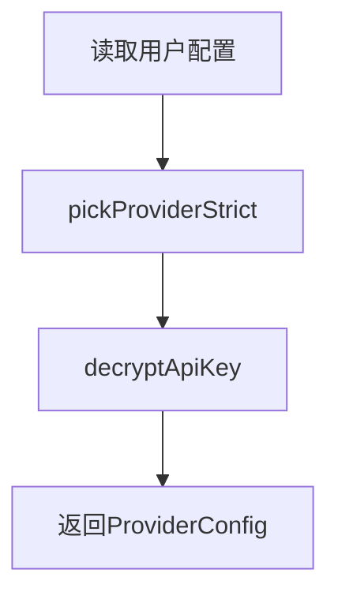
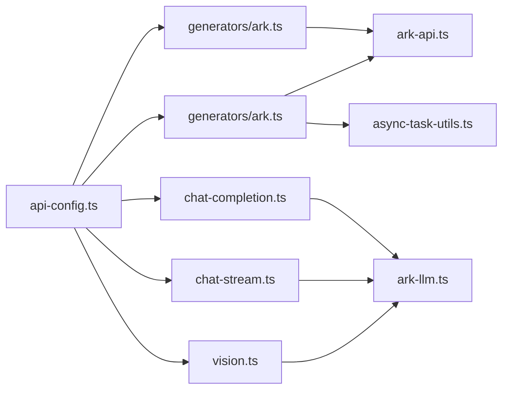

# Ark提供商

<cite>
**本文档引用的文件**
- [ark-api.ts](file://src/lib/ark-api.ts)
- [ark-llm.ts](file://src/lib/ark-llm.ts)
- [generators/ark.ts](file://src/lib/generators/ark.ts)
- [async-task-utils.ts](file://src/lib/async-task-utils.ts)
- [api-config.ts](file://src/lib/api-config.ts)
- [ark-provider.contract.test.ts](file://tests/integration/provider/ark-provider.contract.test.ts)
- [provider-test.ts](file://src/lib/user-api/provider-test.ts)
- [chat-completion.ts](file://src/lib/llm/chat-completion.ts)
- [chat-stream.ts](file://src/lib/llm/chat-stream.ts)
- [vision.ts](file://src/lib/llm/vision.ts)
- [ark.ts](file://src/lib/llm/providers/ark.ts)
- [error-handler.ts](file://src/lib/error-handler.ts)
</cite>

## 目录
1. [简介](#简介)
2. [项目结构](#项目结构)
3. [核心组件](#核心组件)
4. [架构总览](#架构总览)
5. [详细组件分析](#详细组件分析)
6. [依赖关系分析](#依赖关系分析)
7. [性能考虑](#性能考虑)
8. [故障排查指南](#故障排查指南)
9. [结论](#结论)
10. [附录](#附录)

## 简介
本文件面向Ark提供商（火山引擎 Ark）的技术集成文档，覆盖以下关键主题：
- API端点配置与请求参数映射
- 响应数据处理与错误处理
- Ark特有能力与功能特性（推理模式、多模态支持、视频任务流）
- 认证配置、API密钥管理与访问控制
- 超时重试与降级策略
- 性能基准与最佳实践

## 项目结构
Ark提供商的实现主要分布在以下模块：
- API封装层：Ark图像生成、视频任务创建与查询
- LLM封装层：Responses API的同步与流式调用、消息格式转换
- 生成器层：图像与视频生成器，负责参数校验、内容构造与外部调用
- 异步任务工具：视频任务状态轮询与结果解析
- 配置与鉴权：用户API配置读取、解密与校验
- 测试与验证：契约测试与连通性测试

图表来源
- [ark-api.ts:1-598](file://src/lib/ark-api.ts#L1-L598)
- [ark-llm.ts:1-340](file://src/lib/ark-llm.ts#L1-L340)
- [generators/ark.ts:1-565](file://src/lib/generators/ark.ts#L1-L565)
- [async-task-utils.ts:1-448](file://src/lib/async-task-utils.ts#L1-L448)
- [api-config.ts:1-509](file://src/lib/api-config.ts#L1-L509)
- [chat-completion.ts:322-364](file://src/lib/llm/chat-completion.ts#L322-L364)
- [chat-stream.ts:375-439](file://src/lib/llm/chat-stream.ts#L375-L439)
- [vision.ts:135-159](file://src/lib/llm/vision.ts#L135-L159)
- [ark.ts:1-1](file://src/lib/llm/providers/ark.ts#L1-L1)

章节来源
- [ark-api.ts:1-598](file://src/lib/ark-api.ts#L1-L598)
- [ark-llm.ts:1-340](file://src/lib/ark-llm.ts#L1-L340)
- [generators/ark.ts:1-565](file://src/lib/generators/ark.ts#L1-L565)
- [async-task-utils.ts:1-448](file://src/lib/async-task-utils.ts#L1-L448)
- [api-config.ts:1-509](file://src/lib/api-config.ts#L1-L509)

## 核心组件
- Ark API封装（ark-api.ts）
  - 图像生成：arkImageGeneration
  - 视频任务创建：arkCreateVideoTask
  - 视频任务查询：arkQueryVideoTask
  - 通用超时与重试：fetchWithTimeoutAndRetry
  - 参数校验：validateArkVideoTaskRequest
- Ark LLM封装（ark-llm.ts）
  - 同步Responses：arkResponsesCompletion
  - 流式Responses：arkResponsesStream
  - 消息格式转换：convertChatMessagesToArkInput
  - 推理模式参数：buildArkThinkingParam
- 生成器（generators/ark.ts）
  - 图像生成器：ArkImageGenerator.doGenerate
  - 视频生成器：ArkVideoGenerator.doGenerate
  - 模型规格与参数约束：ARK_SEEDANCE_MODEL_SPECS
- 异步任务工具（async-task-utils.ts）
  - 视频任务轮询：querySeedanceVideoStatus
  - 结果解析：readArkVideoUrl
- 配置与鉴权（api-config.ts）
  - 用户配置读取与解密：getProviderConfig
  - 模型选择解析：resolveModelSelection
- LLM集成（chat-completion.ts、chat-stream.ts、vision.ts）
  - Ark提供商接入：llm/providers/ark.ts
  - 推理模式与温度参数传递
- 错误处理（error-handler.ts）
  - 统一错误码与错误载荷解析
  - 失败抛错与降级策略入口

章节来源
- [ark-api.ts:416-593](file://src/lib/ark-api.ts#L416-L593)
- [ark-llm.ts:104-340](file://src/lib/ark-llm.ts#L104-L340)
- [generators/ark.ts:192-557](file://src/lib/generators/ark.ts#L192-L557)
- [async-task-utils.ts:395-447](file://src/lib/async-task-utils.ts#L395-L447)
- [api-config.ts:418-434](file://src/lib/api-config.ts#L418-L434)
- [chat-completion.ts:322-364](file://src/lib/llm/chat-completion.ts#L322-L364)
- [chat-stream.ts:375-439](file://src/lib/llm/chat-stream.ts#L375-L439)
- [vision.ts:135-159](file://src/lib/llm/vision.ts#L135-L159)
- [error-handler.ts:60-98](file://src/lib/error-handler.ts#L60-L98)

## 架构总览
Ark提供商的调用链路分为两大类：
- 文本/视觉多模态LLM调用：通过Responses API完成，支持推理模式与流式输出
- 图像/视频生成：通过Ark官方API完成，视频生成采用任务异步模式，需轮询查询结果

图表来源
- [ark-llm.ts:104-140](file://src/lib/ark-llm.ts#L104-L140)
- [generators/ark.ts:192-301](file://src/lib/generators/ark.ts#L192-L301)
- [generators/ark.ts:307-557](file://src/lib/generators/ark.ts#L307-L557)
- [ark-api.ts:416-571](file://src/lib/ark-api.ts#L416-L571)

## 详细组件分析

### Ark API封装（ark-api.ts）
- 超时与重试策略
  - 默认超时：90秒
  - 最大重试：3次
  - 指数退避：起始延迟2秒
  - 仅对非400/403类HTTP错误进行重试
- 请求参数映射
  - 图像生成：model、prompt、size、aspect_ratio、watermark、image[]、sequential_image_generation、stream
  - 视频任务：model、content（含text、image_url、video_url、audio_url、draft_task）、resolution、ratio、duration、frames、seed、camera_fixed、watermark、return_last_frame、service_tier、execution_expires_after、generate_audio、draft、tools
- 响应数据处理
  - 图像生成：解析data[].url
  - 视频任务：解析status、content（video_url、image_url、audio_url）、usage（total_tokens、completion_tokens）

图表来源
- [ark-api.ts:137-309](file://src/lib/ark-api.ts#L137-L309)
- [ark-api.ts:344-411](file://src/lib/ark-api.ts#L344-L411)
- [ark-api.ts:416-571](file://src/lib/ark-api.ts#L416-L571)

章节来源
- [ark-api.ts:1-598](file://src/lib/ark-api.ts#L1-L598)

### Ark LLM封装（ark-llm.ts）
- 推理模式（thinking）
  - 通过buildArkThinkingParam统一发送thinking.type
  - 支持enabled/disabled两种模式
- 消息格式转换
  - convertChatMessagesToArkInput将OpenAI messages转换为Responses input
  - system消息合并到首条user消息前
- 同步与流式调用
  - arkResponsesCompletion：一次性返回文本、推理与用量
  - arkResponsesStream：SSE事件流，分发reasoning与text增量

图表来源
- [ark-llm.ts:158-191](file://src/lib/ark-llm.ts#L158-L191)
- [ark-llm.ts:224-339](file://src/lib/ark-llm.ts#L224-L339)

章节来源
- [ark-llm.ts:1-340](file://src/lib/ark-llm.ts#L1-L340)

### 生成器（generators/ark.ts）
- 图像生成器（ArkImageGenerator）
  - 支持Seedream系列模型，自动映射宽高比到尺寸
  - 支持参考图片（Base64）传入
  - 输出首个有效URL
- 视频生成器（ArkVideoGenerator）
  - 支持Seedance系列模型与规格（时长、分辨率、帧数、首尾帧、音频、草稿模式等）
  - 批量模式（-batch）自动启用flex服务等级
  - 返回异步任务标识，后续轮询查询结果

图表来源
- [generators/ark.ts:192-301](file://src/lib/generators/ark.ts#L192-L301)
- [generators/ark.ts:307-557](file://src/lib/generators/ark.ts#L307-L557)

章节来源
- [generators/ark.ts:1-565](file://src/lib/generators/ark.ts#L1-L565)

### 异步任务工具（async-task-utils.ts）
- 视频任务轮询
  - querySeedanceVideoStatus：GET /api/v3/contents/generations/tasks/{id}
  - 成功时解析video_url，失败时返回错误信息
  - 支持usage.total_tokens回填

图表来源
- [async-task-utils.ts:395-447](file://src/lib/async-task-utils.ts#L395-L447)
- [ark-api.ts:530-571](file://src/lib/ark-api.ts#L530-L571)

章节来源
- [async-task-utils.ts:1-448](file://src/lib/async-task-utils.ts#L1-L448)

### 配置与鉴权（api-config.ts）
- 用户配置读取
  - getProviderConfig：解密并返回apiKey、baseUrl、apiMode、gatewayRoute
- 模型选择解析
  - resolveModelSelection：严格解析model_key，校验媒体类型与提供商
- Ark提供商接入
  - llm/providers/ark.ts：导出arkResponsesCompletion供LLM集成使用

图表来源
- [api-config.ts:418-434](file://src/lib/api-config.ts#L418-L434)

章节来源
- [api-config.ts:1-509](file://src/lib/api-config.ts#L1-L509)
- [ark.ts:1-1](file://src/lib/llm/providers/ark.ts#L1-L1)

### LLM集成（chat-completion.ts、chat-stream.ts、vision.ts）
- chat-completion.ts
  - Ark提供商：convertChatMessagesToArkInput + arkResponsesCompletion
  - 记录用量与日志
- chat-stream.ts
  - 流式：arkResponsesStream，分发reasoning与text增量
- vision.ts
  - 视觉多模态：Ark输入包含input_image与input_text，推理模式通过thinking参数控制

章节来源
- [chat-completion.ts:322-364](file://src/lib/llm/chat-completion.ts#L322-L364)
- [chat-stream.ts:375-439](file://src/lib/llm/chat-stream.ts#L375-L439)
- [vision.ts:135-159](file://src/lib/llm/vision.ts#L135-L159)

### 错误处理（error-handler.ts）
- 统一错误码映射与载荷解析
- handleApiError：根据HTTP状态与错误载荷抛出标准化错误
- isInsufficientBalanceError：余额不足专用判断

章节来源
- [error-handler.ts:1-98](file://src/lib/error-handler.ts#L1-L98)

## 依赖关系分析
- Ark提供商与各模块的耦合关系
  - 生成器依赖Ark API封装与配置模块
  - LLM集成依赖Ark LLM封装与配置模块
  - 异步任务工具独立于生成器，仅依赖Ark API封装
- 关键依赖链
  - 用户配置 → ProviderConfig（apiKey解密）
  - ProviderConfig → Ark API/LLM调用
  - 生成器 → Ark API封装（图像/视频）
  - 视频生成器 → 异步任务工具（轮询）

图表来源
- [api-config.ts:418-434](file://src/lib/api-config.ts#L418-L434)
- [generators/ark.ts:192-557](file://src/lib/generators/ark.ts#L192-L557)
- [ark-api.ts:416-571](file://src/lib/ark-api.ts#L416-L571)
- [ark-llm.ts:104-340](file://src/lib/ark-llm.ts#L104-L340)
- [async-task-utils.ts:395-447](file://src/lib/async-task-utils.ts#L395-L447)

章节来源
- [api-config.ts:1-509](file://src/lib/api-config.ts#L1-L509)
- [generators/ark.ts:1-565](file://src/lib/generators/ark.ts#L1-L565)
- [ark-api.ts:1-598](file://src/lib/ark-api.ts#L1-L598)
- [ark-llm.ts:1-340](file://src/lib/ark-llm.ts#L1-L340)
- [async-task-utils.ts:1-448](file://src/lib/async-task-utils.ts#L1-L448)

## 性能考虑
- 超时与重试
  - 默认超时90秒，最大重试3次，指数退避，减少跨境网络抖动影响
- 并发与批处理
  - 视频批量模式（-batch）自动启用flex服务等级，提升吞吐
- 参数优化
  - 合理设置resolution、duration、frames，避免超出模型规格导致失败重试
- 日志与可观测性
  - 统一的日志前缀与错误载荷，便于定位慢请求与失败原因

[本节为通用性能建议，无需特定文件引用]

## 故障排查指南
- 常见错误与定位
  - Ark Responses调用失败：检查apiKey、模型ID与输入格式
  - 视频任务状态pending：确认任务ID正确且未过期
  - 余额不足：isInsufficientBalanceError判断
- 重试与降级
  - 对非400/403类HTTP错误自动重试
  - 视频任务轮询期间若出现404，按pending处理以继续重试
- 单元/契约测试
  - Ark提供商契约测试：验证请求字段与响应解析
  - 连通性测试：provider-test.ts对Responses API进行最小化调用验证

章节来源
- [ark-provider.contract.test.ts:1-106](file://tests/integration/provider/ark-provider.contract.test.ts#L1-L106)
- [provider-test.ts:367-401](file://src/lib/user-api/provider-test.ts#L367-L401)
- [error-handler.ts:60-98](file://src/lib/error-handler.ts#L60-L98)
- [async-task-utils.ts:401-447](file://src/lib/async-task-utils.ts#L401-L447)

## 结论
Ark提供商在本项目中实现了：
- 全面的Ark API封装与参数校验
- LLM Responses API的同步与流式能力
- 图像与视频生成的完整工作流
- 完善的超时重试、错误处理与异步轮询
- 严格的配置读取与密钥解密流程

建议在生产环境中：
- 明确配置项与密钥管理策略
- 合理设置超时与重试参数
- 使用契约测试与连通性测试保障稳定性
- 借助日志与用量统计持续优化性能

[本节为总结性内容，无需特定文件引用]

## 附录

### Ark特有能力与功能特性
- 推理模式（reasoning）
  - 通过thinking参数启用/禁用
  - 流式输出中分别产生reasoning与text增量
- 多模态支持
  - LLM：input_text + input_image
  - 视频：text + image_url（首帧/尾帧）+ video_url + audio_url
- 视频任务特性
  - 支持首尾帧模式、音频生成、草稿模式、执行过期时间、服务等级等

章节来源
- [ark-llm.ts:197-204](file://src/lib/ark-llm.ts#L197-L204)
- [vision.ts:135-159](file://src/lib/llm/vision.ts#L135-L159)
- [generators/ark.ts:58-84](file://src/lib/generators/ark.ts#L58-L84)

### 认证配置、API密钥管理与访问控制
- 用户API配置
  - 支持多提供商配置，Ark提供商id为'ark'
  - 配置持久化与去重校验
- API密钥管理
  - getProviderConfig解密并返回apiKey
  - 支持隐藏标志与baseUrl规范化
- 访问控制
  - 严格模型选择解析，防止越权调用
  - 未配置密钥时抛出明确错误

章节来源
- [api-config.ts:121-191](file://src/lib/api-config.ts#L121-L191)
- [api-config.ts:418-434](file://src/lib/api-config.ts#L418-L434)
- [tests/integration/api/specific/user-api-config-put.test.ts:150-172](file://tests/integration/api/specific/user-api-config-put.test.ts#L150-L172)

### 错误处理、超时重试与降级策略
- 错误处理
  - 统一错误码与载荷解析
  - 余额不足专用处理
- 超时重试
  - 默认90秒超时、3次重试、指数退避
  - 仅对特定HTTP错误进行重试
- 降级策略
  - 视频任务轮询期间404按pending处理
  - 业务错误直接返回原始错误文本

章节来源
- [ark-api.ts:344-411](file://src/lib/ark-api.ts#L344-L411)
- [async-task-utils.ts:332-335](file://src/lib/async-task-utils.ts#L332-L335)
- [error-handler.ts:60-98](file://src/lib/error-handler.ts#L60-L98)

### 性能基准与最佳实践
- 基准测试
  - 建议使用契约测试与连通性测试作为基准
  - 通过日志观察请求耗时与重试次数
- 最佳实践
  - 合理设置分辨率与时长，避免超出模型规格
  - 使用批量模式提升视频生成吞吐
  - 监控usage与错误率，及时调整重试参数

[本节为通用建议，无需特定文件引用]