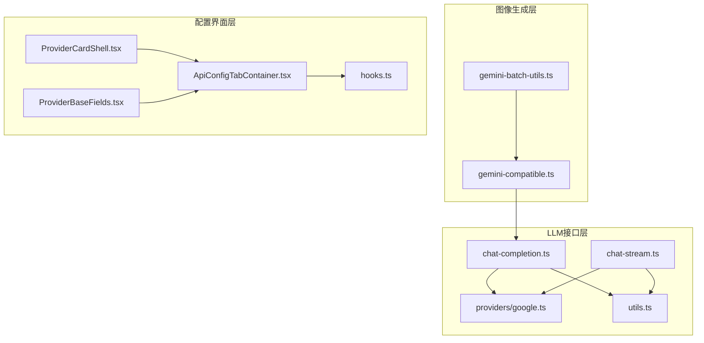
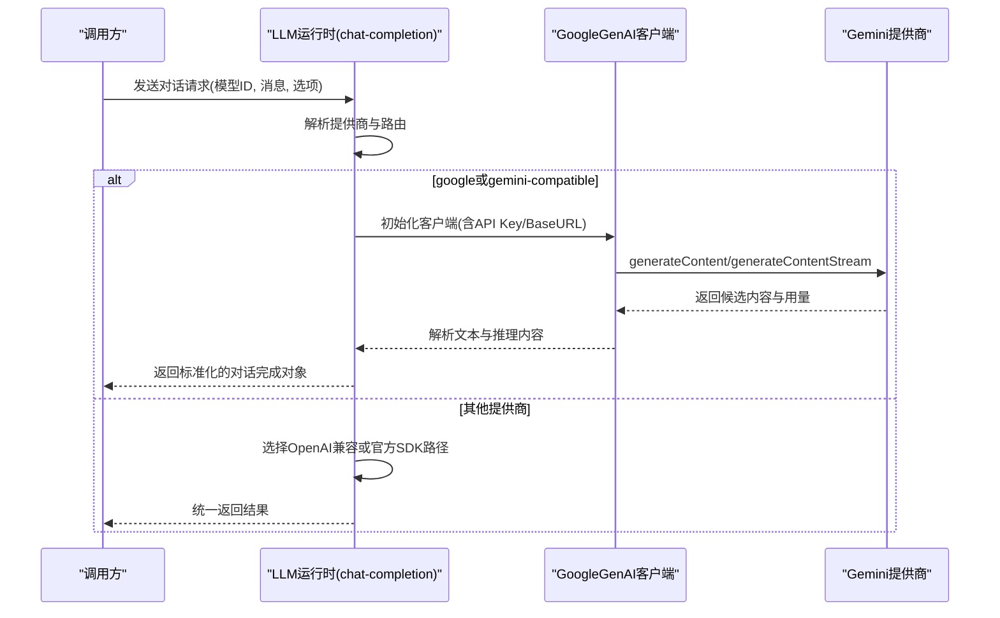
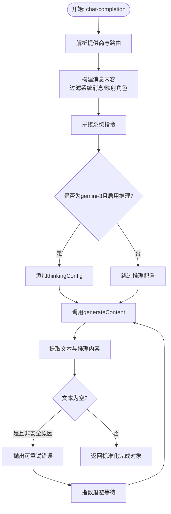
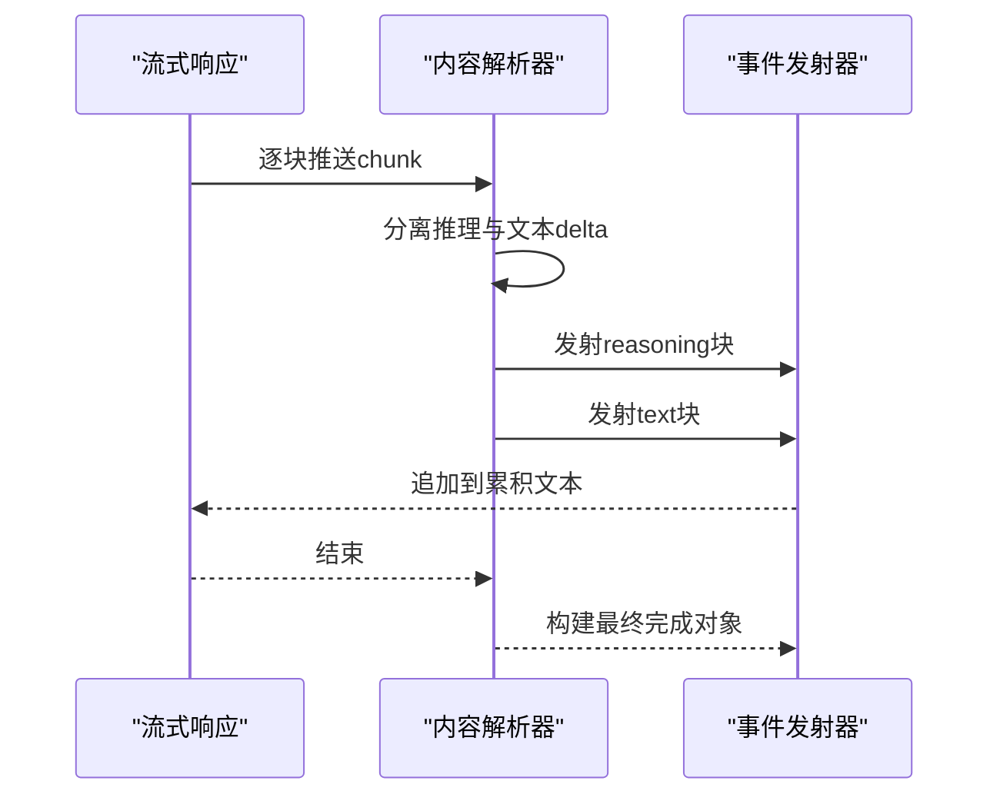
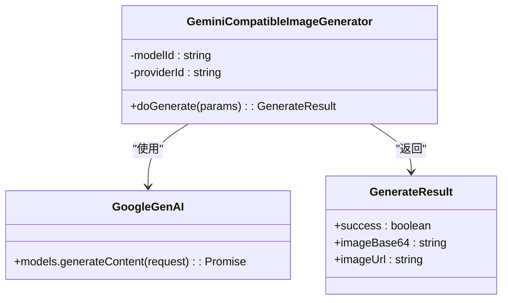
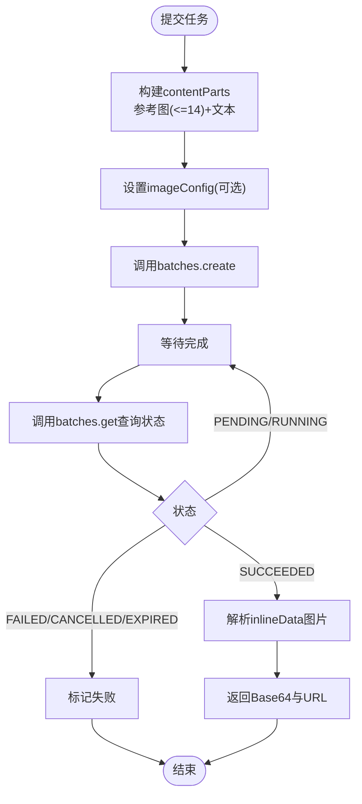
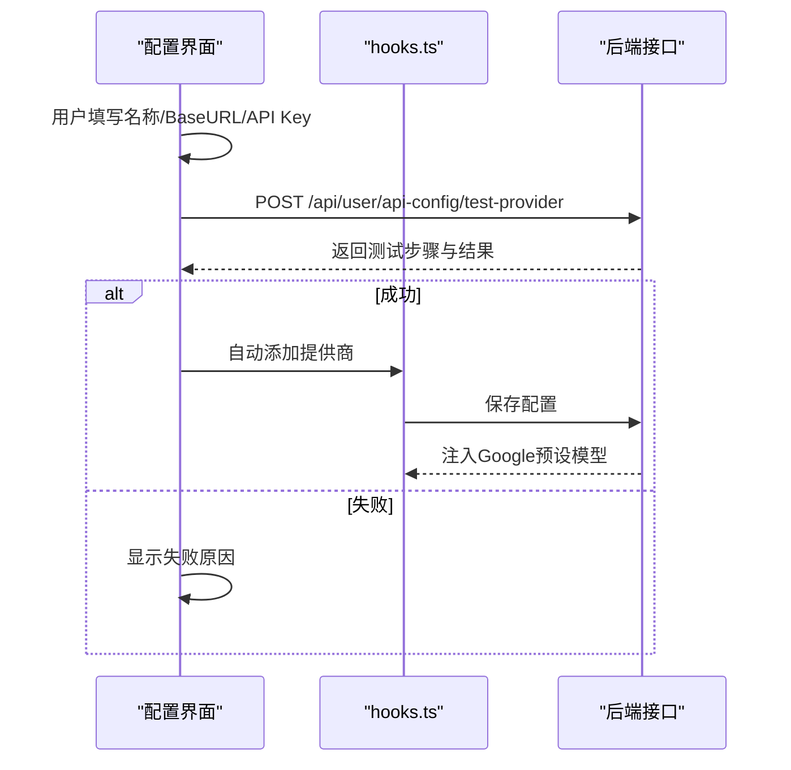
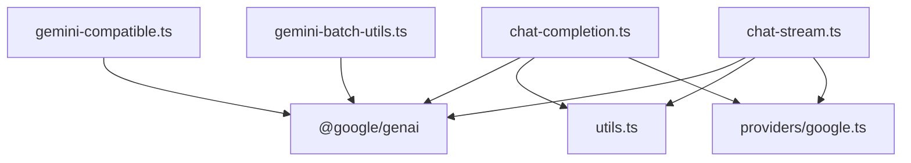

# Google Gemini提供商

<cite>
**本文档引用的文件**
- [src/lib/gemini-batch-utils.ts](file://src/lib/gemini-batch-utils.ts)
- [src/lib/generators/image/gemini-compatible.ts](file://src/lib/generators/image/gemini-compatible.ts)
- [src/lib/llm/chat-completion.ts](file://src/lib/llm/chat-completion.ts)
- [src/lib/llm/chat-stream.ts](file://src/lib/llm/chat-stream.ts)
- [src/lib/llm/providers/google.ts](file://src/lib/llm/providers/google.ts)
- [src/lib/llm/utils.ts](file://src/lib/llm/utils.ts)
- [src/app/[locale]/profile/components/api-config-tab/ApiConfigTabContainer.tsx](file://src/app/[locale]/profile/components/api-config-tab/ApiConfigTabContainer.tsx)
- [src/app/[locale]/profile/components/api-config/provider-card/ProviderCardShell.tsx](file://src/app/[locale]/profile/components/api-config/provider-card/ProviderCardShell.tsx)
- [src/app/[locale]/profile/components/api-config/provider-card/ProviderBaseFields.tsx](file://src/app/[locale]/profile/components/api-config/provider-card/ProviderBaseFields.tsx)
- [src/app/[locale]/profile/components/api-config/hooks.ts](file://src/app/[locale]/profile/components/api-config/hooks.ts)
- [tests/integration/api/specific/user-api-config-put.test.ts](file://tests/integration/api/specific/user-api-config-put.test.ts)
</cite>

## 目录
1. [简介](#简介)
2. [项目结构](#项目结构)
3. [核心组件](#核心组件)
4. [架构概览](#架构概览)
5. [详细组件分析](#详细组件分析)
6. [依赖关系分析](#依赖关系分析)
7. [性能考虑](#性能考虑)
8. [故障排除指南](#故障排除指南)
9. [结论](#结论)
10. [附录](#附录)

## 简介
本技术指南面向Google Gemini提供商的集成与使用，涵盖认证机制、请求构建、响应处理、批量处理工具、性能优化策略、Gemini特有能力（多模态处理、上下文管理）、配置示例、API密钥管理、速率限制处理以及错误处理策略与监控告警方案。文档基于实际代码库进行深入分析，确保技术准确性与实践指导价值。

## 项目结构
Gemini提供商相关代码主要分布在以下模块：
- LLM对话与流式接口：负责文本对话、推理思考、流式传输与错误处理
- 图像生成兼容层：支持多模态输入（文本+图片），适配Gemini图像生成能力
- 批量处理工具：提供Gemini Batch API的封装，支持异步任务提交与状态查询
- 配置界面与持久化：用户界面用于添加、测试与管理Gemini提供商配置

**图表来源**
- [src/lib/llm/chat-completion.ts:55-523](file://src/lib/llm/chat-completion.ts#L55-L523)
- [src/lib/llm/chat-stream.ts:64-875](file://src/lib/llm/chat-stream.ts#L64-L875)
- [src/lib/llm/providers/google.ts:1-110](file://src/lib/llm/providers/google.ts#L1-L110)
- [src/lib/llm/utils.ts:1-149](file://src/lib/llm/utils.ts#L1-L149)
- [src/lib/generators/image/gemini-compatible.ts:1-147](file://src/lib/generators/image/gemini-compatible.ts#L1-L147)
- [src/lib/gemini-batch-utils.ts:1-263](file://src/lib/gemini-batch-utils.ts#L1-L263)
- [src/app/[locale]/profile/components/api-config-tab/ApiConfigTabContainer.tsx](file://src/app/[locale]/profile/components/api-config-tab/ApiConfigTabContainer.tsx#L180-L379)
- [src/app/[locale]/profile/components/api-config/provider-card/ProviderCardShell.tsx](file://src/app/[locale]/profile/components/api-config/provider-card/ProviderCardShell.tsx#L28-L28)
- [src/app/[locale]/profile/components/api-config/provider-card/ProviderBaseFields.tsx](file://src/app/[locale]/profile/components/api-config/provider-card/ProviderBaseFields.tsx#L15-L15)
- [src/app/[locale]/profile/components/api-config/hooks.ts](file://src/app/[locale]/profile/components/api-config/hooks.ts#L582-L603)

**章节来源**
- [src/lib/llm/chat-completion.ts:55-523](file://src/lib/llm/chat-completion.ts#L55-L523)
- [src/lib/llm/chat-stream.ts:64-875](file://src/lib/llm/chat-stream.ts#L64-L875)
- [src/lib/generators/image/gemini-compatible.ts:1-147](file://src/lib/generators/image/gemini-compatible.ts#L1-L147)
- [src/lib/gemini-batch-utils.ts:1-263](file://src/lib/gemini-batch-utils.ts#L1-L263)
- [src/app/[locale]/profile/components/api-config-tab/ApiConfigTabContainer.tsx](file://src/app/[locale]/profile/components/api-config-tab/ApiConfigTabContainer.tsx#L180-L379)

## 核心组件
- 文本对话与推理：通过GoogleGenAI客户端构建消息内容，支持系统指令与Gemini-3系列的思维级别配置
- 流式对话：基于generateContentStream实现增量输出，支持推理内容分离与合并
- 图像生成兼容层：支持多模态输入（最多14张参考图+文本提示），自动转换为inlineData格式
- 批量处理工具：封装Gemini Batch API，支持异步任务提交与状态轮询，返回Base64图片数据
- 配置管理：前端界面支持测试连接、自动注入模型能力、保存提供商配置

**章节来源**
- [src/lib/llm/chat-completion.ts:173-243](file://src/lib/llm/chat-completion.ts#L173-L243)
- [src/lib/llm/chat-stream.ts:174-280](file://src/lib/llm/chat-stream.ts#L174-L280)
- [src/lib/generators/image/gemini-compatible.ts:76-146](file://src/lib/generators/image/gemini-compatible.ts#L76-L146)
- [src/lib/gemini-batch-utils.ts:51-161](file://src/lib/gemini-batch-utils.ts#L51-L161)
- [src/app/[locale]/profile/components/api-config-tab/ApiConfigTabContainer.tsx](file://src/app/[locale]/profile/components/api-config-tab/ApiConfigTabContainer.tsx#L180-L215)

## 架构概览
Gemini提供商采用统一的运行时路由选择机制，根据提供商键值与网关路由决定调用路径。对于google或gemini-compatible提供商，直接使用@google/genai客户端；对于其他提供商则通过OpenAI兼容层或官方SDK进行调用。

**图表来源**
- [src/lib/llm/chat-completion.ts:78-243](file://src/lib/llm/chat-completion.ts#L78-L243)
- [src/lib/llm/chat-stream.ts:174-280](file://src/lib/llm/chat-stream.ts#L174-L280)

**章节来源**
- [src/lib/llm/chat-completion.ts:78-243](file://src/lib/llm/chat-completion.ts#L78-L243)
- [src/lib/llm/chat-stream.ts:174-280](file://src/lib/llm/chat-stream.ts#L174-L280)

## 详细组件分析

### 文本对话与推理
- 认证与初始化：根据提供商配置动态设置API Key与BaseURL，支持自定义HTTP选项
- 消息构建：过滤系统消息，将用户/助手消息映射为Gemini的user/model角色
- 系统指令：将多个系统消息拼接为单个systemInstruction
- 思维级别：针对gemini-3系列模型启用thinkingConfig，支持includeThoughts与thinkingLevel
- 错误处理：对空响应抛出可重试的GoogleEmptyResponseError，结合指数退避重试

**图表来源**
- [src/lib/llm/chat-completion.ts:173-243](file://src/lib/llm/chat-completion.ts#L173-L243)
- [src/lib/llm/providers/google.ts:50-84](file://src/lib/llm/providers/google.ts#L50-L84)

**章节来源**
- [src/lib/llm/chat-completion.ts:173-243](file://src/lib/llm/chat-completion.ts#L173-L243)
- [src/lib/llm/providers/google.ts:38-84](file://src/lib/llm/providers/google.ts#L38-L84)

### 流式对话处理
- 流式接口：通过generateContentStream获取增量响应
- 内容分割：分离推理内容与主文本，支持标签包裹的<think>内容
- 合并策略：对重复片段进行去重合并，保证输出整洁
- 最终构建：将流式结果汇总为标准OpenAI格式的对话完成对象

**图表来源**
- [src/lib/llm/chat-stream.ts:219-252](file://src/lib/llm/chat-stream.ts#L219-L252)
- [src/lib/llm/utils.ts:3-26](file://src/lib/llm/utils.ts#L3-L26)

**章节来源**
- [src/lib/llm/chat-stream.ts:219-252](file://src/lib/llm/chat-stream.ts#L219-L252)
- [src/lib/llm/utils.ts:3-26](file://src/lib/llm/utils.ts#L3-L26)

### 图像生成兼容层
- 多模态输入：支持最多14张参考图片（data URL、HTTP URL、本地相对路径自动补全）
- 数据转换：将图片转换为inlineData格式，自动推断mimeType
- 输出控制：通过imageConfig控制输出比例与分辨率，启用TEXT+IMAGE响应模式
- 安全策略：禁用内容安全过滤阈值，提升生成灵活性

**图表来源**
- [src/lib/generators/image/gemini-compatible.ts:66-146](file://src/lib/generators/image/gemini-compatible.ts#L66-L146)

**章节来源**
- [src/lib/generators/image/gemini-compatible.ts:76-146](file://src/lib/generators/image/gemini-compatible.ts#L76-L146)

### 批量处理工具
- 任务提交：构建内联请求数组，设置响应模态为TEXT+IMAGE，并可选imageConfig
- 状态查询：轮询任务状态，提取首个候选的inlineData图片
- 错误处理：区分完成、失败、过期等状态，记录详细日志

**图表来源**
- [src/lib/gemini-batch-utils.ts:51-161](file://src/lib/gemini-batch-utils.ts#L51-L161)
- [src/lib/gemini-batch-utils.ts:171-262](file://src/lib/gemini-batch-utils.ts#L171-L262)

**章节来源**
- [src/lib/gemini-batch-utils.ts:51-161](file://src/lib/gemini-batch-utils.ts#L51-L161)
- [src/lib/gemini-batch-utils.ts:171-262](file://src/lib/gemini-batch-utils.ts#L171-L262)

### 配置管理与API密钥
- 前端界面：支持选择API类型（gemini-compatible或openai-compatible），填写名称、BaseURL与API Key
- 测试连接：调用后端接口验证提供商连通性与可用模型
- 自动注入：保存gemini-compatible提供商后，后端注入带完整能力的Google预设模型
- 默认路由：当apiMode为gemini-sdk时，默认走official路由

**图表来源**
- [src/app/[locale]/profile/components/api-config-tab/ApiConfigTabContainer.tsx](file://src/app/[locale]/profile/components/api-config-tab/ApiConfigTabContainer.tsx#L180-L215)
- [src/app/[locale]/profile/components/api-config/hooks.ts](file://src/app/[locale]/profile/components/api-config/hooks.ts#L582-L603)
- [tests/integration/api/specific/user-api-config-put.test.ts:668-696](file://tests/integration/api/specific/user-api-config-put.test.ts#L668-L696)

**章节来源**
- [src/app/[locale]/profile/components/api-config-tab/ApiConfigTabContainer.tsx](file://src/app/[locale]/profile/components/api-config-tab/ApiConfigTabContainer.tsx#L180-L379)
- [src/app/[locale]/profile/components/api-config/provider-card/ProviderCardShell.tsx](file://src/app/[locale]/profile/components/api-config/provider-card/ProviderCardShell.tsx#L28-L28)
- [src/app/[locale]/profile/components/api-config/provider-card/ProviderBaseFields.tsx](file://src/app/[locale]/profile/components/api-config/provider-card/ProviderBaseFields.tsx#L15-L15)
- [src/app/[locale]/profile/components/api-config/hooks.ts](file://src/app/[locale]/profile/components/api-config/hooks.ts#L582-L603)
- [tests/integration/api/specific/user-api-config-put.test.ts:668-696](file://tests/integration/api/specific/user-api-config-put.test.ts#L668-L696)

## 依赖关系分析
- 组件耦合：LLM运行时与Google提供商高度耦合，通过统一的GoogleGenAI客户端抽象
- 外部依赖：@google/genai、@ai-sdk/openai、OpenAI SDK等
- 路由策略：根据提供商键值与网关路由选择不同执行路径，确保兼容性与性能

**图表来源**
- [src/lib/llm/chat-completion.ts:1-523](file://src/lib/llm/chat-completion.ts#L1-L523)
- [src/lib/llm/chat-stream.ts:1-875](file://src/lib/llm/chat-stream.ts#L1-L875)
- [src/lib/generators/image/gemini-compatible.ts:1-147](file://src/lib/generators/image/gemini-compatible.ts#L1-L147)
- [src/lib/gemini-batch-utils.ts:1-263](file://src/lib/gemini-batch-utils.ts#L1-L263)
- [src/lib/llm/utils.ts:1-149](file://src/lib/llm/utils.ts#L1-L149)
- [src/lib/llm/providers/google.ts:1-110](file://src/lib/llm/providers/google.ts#L1-L110)

**章节来源**
- [src/lib/llm/chat-completion.ts:1-523](file://src/lib/llm/chat-completion.ts#L1-L523)
- [src/lib/llm/chat-stream.ts:1-875](file://src/lib/llm/chat-stream.ts#L1-L875)
- [src/lib/generators/image/gemini-compatible.ts:1-147](file://src/lib/generators/image/gemini-compatible.ts#L1-L147)
- [src/lib/gemini-batch-utils.ts:1-263](file://src/lib/gemini-batch-utils.ts#L1-L263)
- [src/lib/llm/utils.ts:1-149](file://src/lib/llm/utils.ts#L1-L149)
- [src/lib/llm/providers/google.ts:1-110](file://src/lib/llm/providers/google.ts#L1-L110)

## 性能考虑
- 批量处理：使用Gemini Batch API可获得约50%的成本优势，适合大规模图像生成任务
- 流式传输：优先使用generateContentStream实现低延迟交互体验
- 重试策略：对空响应采用指数退避重试，最大等待时间控制在合理范围内
- 图像配置：通过imageConfig精确控制输出比例与分辨率，减少无效重试

[本节为通用性能建议，无需特定文件来源]

## 故障排除指南
- 内容安全拒绝：当返回PROHIBITED_CONTENT或502时，直接抛出敏感内容错误，提示修改内容
- 空响应重试：GoogleEmptyResponseError表示可重试的空文本响应，结合最大重试次数与退避策略
- 日志与诊断：记录chunk类型统计、finishReason、providerMetadata与HTTP状态，辅助问题定位
- 速率限制：通过HTTP头中的限流信息（如x-ratelimit-remaining-requests）进行监控与降速

**章节来源**
- [src/lib/llm/chat-completion.ts:484-522](file://src/lib/llm/chat-completion.ts#L484-L522)
- [src/lib/llm/providers/google.ts:38-84](file://src/lib/llm/providers/google.ts#L38-L84)
- [src/lib/llm/chat-stream.ts:489-710](file://src/lib/llm/chat-stream.ts#L489-L710)

## 结论
该Gemini提供商实现通过统一的运行时路由与GoogleGenAI客户端，实现了对文本对话、流式传输、多模态图像生成与批量任务的完整支持。配合完善的错误处理、重试机制与配置管理，能够满足生产环境的稳定性与可维护性要求。建议在高并发场景下优先采用流式接口与批量处理，并结合监控告警体系持续优化性能与成本。

## 附录
- 配置示例：在配置界面中选择gemini-compatible，填写BaseURL与API Key，点击测试连接成功后自动保存
- API密钥管理：前端界面支持密码输入框，后端保存时进行必要校验与注入
- 速率限制：通过HTTP响应头与日志记录进行监控，必要时调整并发与重试策略

**章节来源**
- [src/app/[locale]/profile/components/api-config-tab/ApiConfigTabContainer.tsx](file://src/app/[locale]/profile/components/api-config-tab/ApiConfigTabContainer.tsx#L180-L379)
- [src/app/[locale]/profile/components/api-config/hooks.ts](file://src/app/[locale]/profile/components/api-config/hooks.ts#L582-L603)
- [tests/integration/api/specific/user-api-config-put.test.ts:668-696](file://tests/integration/api/specific/user-api-config-put.test.ts#L668-L696)