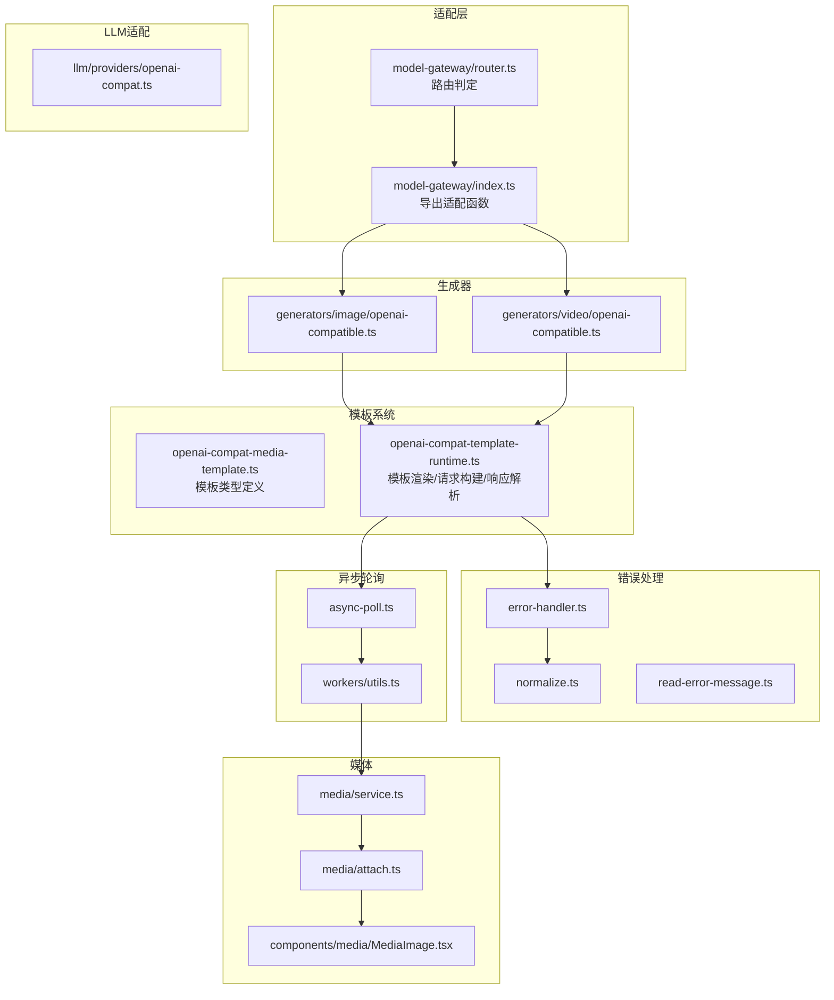
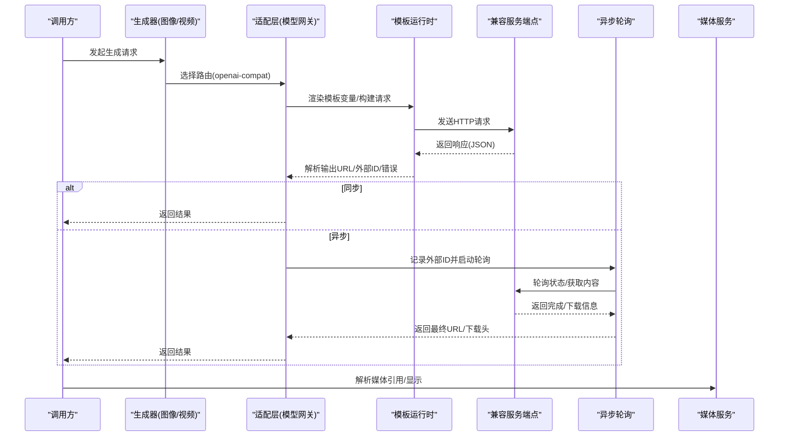
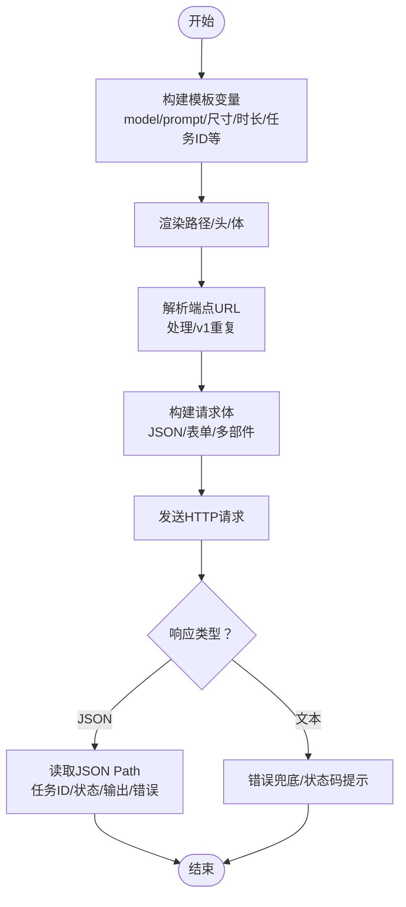
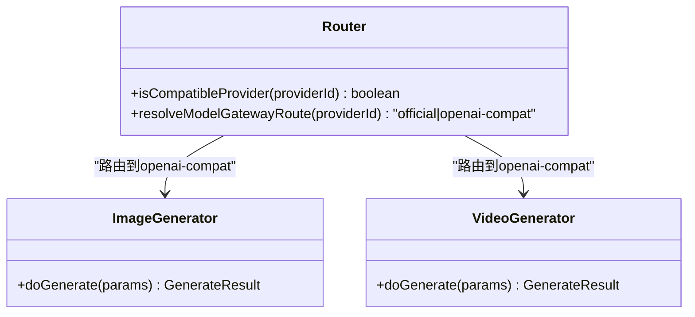
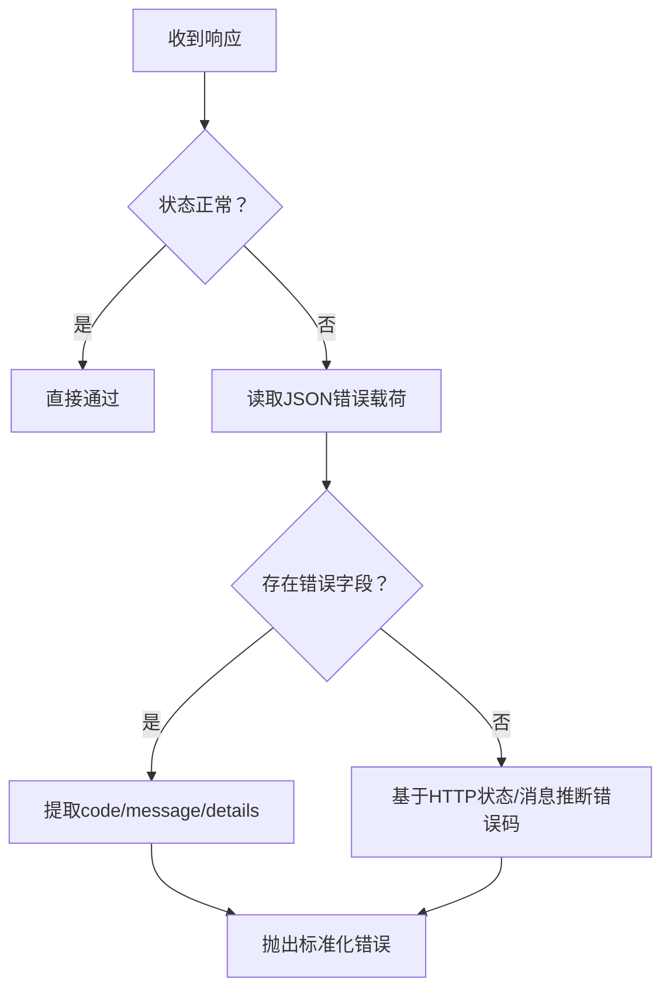
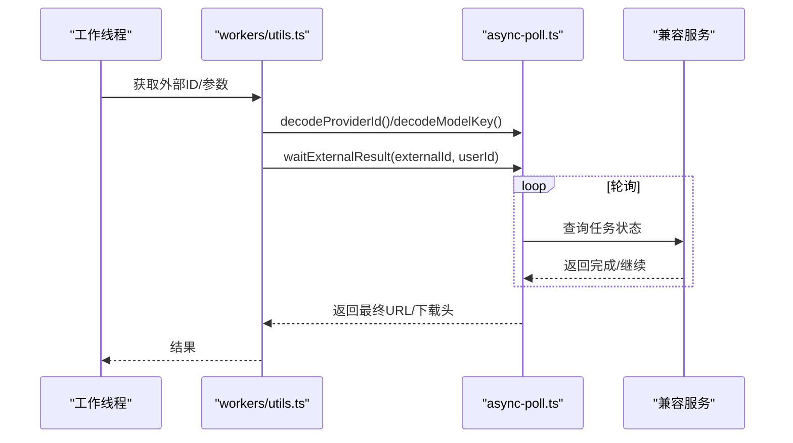
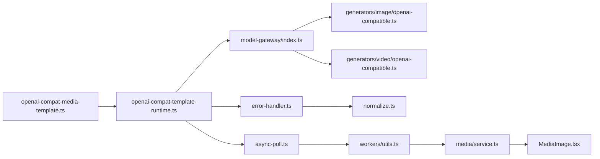

# OpenAI兼容提供商

<cite>
**本文引用的文件**
- [openai-compat-media-template.ts](file://src/lib/openai-compat-media-template.ts)
- [openai-compat-template-runtime.ts](file://src/lib/openai-compat-template-runtime.ts)
- [openai-compat.ts](file://src/lib/llm/providers/openai-compat.ts)
- [openai-compatible.ts（图像）](file://src/lib/generators/image/openai-compatible.ts)
- [openai-compatible.ts（视频）](file://src/lib/generators/video/openai-compatible.ts)
- [model-gateway/router.ts](file://src/lib/model-gateway/router.ts)
- [model-gateway/index.ts](file://src/lib/model-gateway/index.ts)
- [api-config.ts](file://src/lib/api-config.ts)
- [error-handler.ts](file://src/lib/error-handler.ts)
- [read-error-message.ts](file://src/lib/api/read-error-message.ts)
- [normalize.ts](file://src/lib/errors/normalize.ts)
- [async-poll.ts](file://src/lib/async-poll.ts)
- [workers/utils.ts](file://src/lib/workers/utils.ts)
- [media/service.ts](file://src/lib/media/service.ts)
- [media/attach.ts](file://src/lib/media/attach.ts)
- [MediaImage.tsx](file://src/components/media/MediaImage.tsx)
- [openai-compat-responses.test.ts](file://tests/unit/model-gateway/openai-compat-responses.test.ts)
- [openai-compat-template-image-output-urls.test.ts](file://tests/unit/model-gateway/openai-compat-template-image-output-urls.test.ts)
- [openai-compat-template-renderer.test.ts](file://tests/unit/model-gateway/openai-compat-template-renderer.test.ts)
- [openai-compat-template-video-external-id.test.ts](file://tests/unit/model-gateway/openai-compat-template-video-external-id.test.ts)
- [openai-compatible-image.test.ts](file://tests/unit/generators/openai-compatible-image.test.ts)
- [openai-compatible-video.test.ts](file://tests/unit/generators/openai-compatible-video.test.ts)
- [router.test.ts](file://tests/unit/model-gateway/router.test.ts)
- [normalize-error.test.ts](file://tests/unit/task/normalize-error.test.ts)
</cite>

## 目录
1. [简介](#简介)
2. [项目结构](#项目结构)
3. [核心组件](#核心组件)
4. [架构总览](#架构总览)
5. [详细组件分析](#详细组件分析)
6. [依赖关系分析](#依赖关系分析)
7. [性能考量](#性能考量)
8. [故障排查指南](#故障排查指南)
9. [结论](#结论)
10. [附录](#附录)

## 简介
本文件面向“OpenAI兼容提供商”的技术实现，系统化阐述以下主题：
- OpenAI兼容API的实现原理：请求格式转换、响应解析、错误处理与统一化。
- 媒体模板系统：图像输出URL处理、视频外部ID管理、模板渲染流程。
- 兼容性适配层设计：如何通过统一路由与模板机制屏蔽不同AI服务的接口差异。
- 配置示例、认证方法与使用限制。
- 性能优化建议与常见问题解决方案。

## 项目结构
围绕OpenAI兼容能力的关键目录与文件如下：
- 模板定义与运行时：openai-compat-media-template.ts、openai-compat-template-runtime.ts
- 适配层入口与路由：model-gateway/index.ts、model-gateway/router.ts
- 生成器封装：generators/image/openai-compatible.ts、generators/video/openai-compatible.ts
- LLM兼容适配：llm/providers/openai-compat.ts
- 错误处理与规范化：error-handler.ts、normalize.ts、read-error-message.ts
- 异步轮询与外部ID：async-poll.ts、workers/utils.ts
- 媒体解析与显示：media/service.ts、media/attach.ts、components/media/MediaImage.tsx
- 单元测试与契约验证：tests目录下多组测试用例

**图表来源**
- [model-gateway/router.ts:1-21](file://src/lib/model-gateway/router.ts#L1-L21)
- [model-gateway/index.ts:1-21](file://src/lib/model-gateway/index.ts#L1-L21)
- [openai-compat-media-template.ts:1-66](file://src/lib/openai-compat-media-template.ts#L1-L66)
- [openai-compat-template-runtime.ts:1-485](file://src/lib/openai-compat-template-runtime.ts#L1-L485)
- [openai-compatible.ts（图像）:1-27](file://src/lib/generators/image/openai-compatible.ts#L1-L27)
- [openai-compatible.ts（视频）:1-49](file://src/lib/generators/video/openai-compatible.ts#L1-L49)
- [error-handler.ts:1-97](file://src/lib/error-handler.ts#L1-L97)
- [normalize.ts:139-284](file://src/lib/errors/normalize.ts#L139-L284)
- [read-error-message.ts:1-22](file://src/lib/api/read-error-message.ts#L1-L22)
- [async-poll.ts:296-329](file://src/lib/async-poll.ts#L296-L329)
- [workers/utils.ts:74-534](file://src/lib/workers/utils.ts#L74-L534)
- [media/service.ts:1-223](file://src/lib/media/service.ts#L1-L223)
- [media/attach.ts:1-24](file://src/lib/media/attach.ts#L1-L24)
- [MediaImage.tsx:1-84](file://src/components/media/MediaImage.tsx#L1-L84)

**章节来源**
- [model-gateway/router.ts:1-21](file://src/lib/model-gateway/router.ts#L1-L21)
- [model-gateway/index.ts:1-21](file://src/lib/model-gateway/index.ts#L1-L21)

## 核心组件
- 模板定义与变量系统：定义HTTP端点、响应映射、轮询配置与占位符白名单，支持字符串与嵌套对象的模板渲染。
- 模板运行时：负责路径/头/体渲染、multipart/form-data与表单编码构建、JSON路径读取、错误提取与标准化。
- 适配层路由：根据提供商键识别是否走OpenAI兼容路由，确保官方与兼容提供商分流。
- 生成器封装：图像/视频生成器统一调用适配层，自动注入providerId与modelId，并处理同步/异步结果。
- 错误处理：统一错误码、网络终止映射、余额不足识别、错误消息提取与规范化。
- 异步轮询：解析外部ID、设置任务外部ID、定时轮询、进度区间控制与下载头透传。
- 媒体解析与展示：存储键解析、外部URL识别、媒体引用解析、图片组件对稳定路由与远程URL的兼容。

**章节来源**
- [openai-compat-media-template.ts:1-66](file://src/lib/openai-compat-media-template.ts#L1-L66)
- [openai-compat-template-runtime.ts:1-485](file://src/lib/openai-compat-template-runtime.ts#L1-L485)
- [model-gateway/router.ts:1-21](file://src/lib/model-gateway/router.ts#L1-L21)
- [openai-compatible.ts（图像）:1-27](file://src/lib/generators/image/openai-compatible.ts#L1-L27)
- [openai-compatible.ts（视频）:1-49](file://src/lib/generators/video/openai-compatible.ts#L1-L49)
- [error-handler.ts:1-97](file://src/lib/error-handler.ts#L1-L97)
- [normalize.ts:139-284](file://src/lib/errors/normalize.ts#L139-L284)
- [async-poll.ts:296-329](file://src/lib/async-poll.ts#L296-L329)
- [workers/utils.ts:74-534](file://src/lib/workers/utils.ts#L74-L534)
- [media/service.ts:1-223](file://src/lib/media/service.ts#L1-L223)
- [MediaImage.tsx:1-84](file://src/components/media/MediaImage.tsx#L1-L84)

## 架构总览
OpenAI兼容提供商通过“模板驱动 + 适配层路由”的方式，将不同厂商的API请求/响应映射到统一的OpenAI风格接口，从而在上层以一致的方式发起请求、解析结果与处理错误。

**图表来源**
- [openai-compat-template-runtime.ts:388-413](file://src/lib/openai-compat-template-runtime.ts#L388-L413)
- [openai-compatible.ts（图像）:14-25](file://src/lib/generators/image/openai-compatible.ts#L14-L25)
- [openai-compatible.ts（视频）:27-47](file://src/lib/generators/video/openai-compatible.ts#L27-L47)
- [async-poll.ts:296-329](file://src/lib/async-poll.ts#L296-L329)
- [workers/utils.ts:395-406](file://src/lib/workers/utils.ts#L395-L406)
- [media/service.ts:191-200](file://src/lib/media/service.ts#L191-L200)

## 详细组件分析

### 模板系统与渲染流程
- 模板类型定义：端点方法/路径/头/体模板、multipart文件字段、响应映射字段（任务ID、状态、输出URL/URL数组、错误）、轮询配置。
- 变量系统：支持snake_case键与原始键共存；占位符白名单限定安全变量；精确占位符匹配与字符串化策略。
- 请求构建：根据Content-Type自动选择JSON、multipart/form-data或application/x-www-form-urlencoded；multipart文件字段按路径递归展开；自动设置缺失的Content-Type。
- URL解析：支持绝对URL与相对路径；针对openai-compatible的baseUrl自动去重/v1段落，避免重复拼接。
- 响应解析：通过JSON Path读取字段；错误提取优先使用模板指定的errorPath，否则回退到常见字段；无法解析时提供状态码与片段兜底。
- 测试覆盖：包含响应失败场景、输出URL映射、模板渲染行为与视频外部ID格式化等。

**图表来源**
- [openai-compat-template-runtime.ts:425-450](file://src/lib/openai-compat-template-runtime.ts#L425-L450)
- [openai-compat-template-runtime.ts:310-333](file://src/lib/openai-compat-template-runtime.ts#L310-L333)
- [openai-compat-template-runtime.ts:255-276](file://src/lib/openai-compat-template-runtime.ts#L255-L276)
- [openai-compat-template-runtime.ts:364-379](file://src/lib/openai-compat-template-runtime.ts#L364-L379)
- [openai-compat-template-runtime.ts:452-484](file://src/lib/openai-compat-template-runtime.ts#L452-L484)

**章节来源**
- [openai-compat-media-template.ts:1-66](file://src/lib/openai-compat-media-template.ts#L1-L66)
- [openai-compat-template-runtime.ts:1-485](file://src/lib/openai-compat-template-runtime.ts#L1-L485)
- [openai-compat-template-image-output-urls.test.ts](file://tests/unit/model-gateway/openai-compat-template-image-output-urls.test.ts)
- [openai-compat-template-renderer.test.ts](file://tests/unit/model-gateway/openai-compat-template-renderer.test.ts)
- [openai-compat-template-video-external-id.test.ts](file://tests/unit/model-gateway/openai-compat-template-video-external-id.test.ts)

### 兼容性适配层设计
- 路由判定：仅将openai-compatible提供商标识为兼容路由；其他官方提供商保持official路由。
- 生成器封装：图像/视频生成器统一走generateImageViaOpenAICompat/generateVideoViaOpenAICompat；视频生成器对特定中转服务做分支处理。
- LLM适配：将任意内容统一包装为OpenAI Chat Completion格式，便于上层统一消费。

**图表来源**
- [model-gateway/router.ts:1-21](file://src/lib/model-gateway/router.ts#L1-L21)
- [openai-compatible.ts（图像）:1-27](file://src/lib/generators/image/openai-compatible.ts#L1-L27)
- [openai-compatible.ts（视频）:1-49](file://src/lib/generators/video/openai-compatible.ts#L1-L49)

**章节来源**
- [model-gateway/router.ts:1-21](file://src/lib/model-gateway/router.ts#L1-L21)
- [openai-compat.ts:1-33](file://src/lib/llm/providers/openai-compat.ts#L1-L33)
- [router.test.ts:1-27](file://tests/unit/model-gateway/router.test.ts#L1-L27)

### 错误处理与统一化
- 错误读取：优先从JSON payload读取error/message字段，回退到通用消息。
- 统一错误码：基于HTTP状态码与消息关键字推断统一错误码，例如UNAUTHORIZED、FORBIDDEN、RATE_LIMIT、EXTERNAL_ERROR、GENERATION_TIMEOUT等。
- 特殊映射：网络终止（terminated/socket hang up）映射为NETWORK_ERROR；403中若包含账户过期关键字映射为INSUFFICIENT_BALANCE。
- API错误处理：checkApiResponse与handleApiError统一抛出标准化错误码。

**图表来源**
- [error-handler.ts:52-93](file://src/lib/error-handler.ts#L52-L93)
- [normalize.ts:139-284](file://src/lib/errors/normalize.ts#L139-L284)
- [read-error-message.ts:6-22](file://src/lib/api/read-error-message.ts#L6-L22)
- [normalize-error.test.ts:1-33](file://tests/unit/task/normalize-error.test.ts#L1-L33)

**章节来源**
- [error-handler.ts:1-97](file://src/lib/error-handler.ts#L1-L97)
- [normalize.ts:139-284](file://src/lib/errors/normalize.ts#L139-L284)
- [read-error-message.ts:1-22](file://src/lib/api/read-error-message.ts#L1-L22)
- [normalize-error.test.ts:1-33](file://tests/unit/task/normalize-error.test.ts#L1-L33)

### 异步轮询与外部ID管理
- 外部ID解析：支持OPENAI前缀的视频/图片任务；对不合规格式抛出明确错误。
- providerId解码：支持UUID与base64url两种令牌格式，自动还原providerId。
- modelKey解码：base64url解码模型键，失败时抛错。
- 轮询流程：写入任务外部ID、按间隔与超时轮询、更新进度区间、返回最终URL与下载头。

**图表来源**
- [async-poll.ts:296-329](file://src/lib/async-poll.ts#L296-L329)
- [workers/utils.ts:86-406](file://src/lib/workers/utils.ts#L86-L406)

**章节来源**
- [async-poll.ts:296-329](file://src/lib/async-poll.ts#L296-L329)
- [workers/utils.ts:74-534](file://src/lib/workers/utils.ts#L74-L534)

### 媒体模板系统的实现要点
- 图像输出URL处理：模板可配置outputUrlPath或outputUrlsPath；运行时通过JSON Path读取；若为空则回退到fallback。
- 视频外部ID管理：模板可配置taskIdPath；生成器返回externalId，格式包含provider标识与任务ID；轮询完成后返回最终URL与可选下载头。
- 模板渲染流程：变量构建、路径/头/体渲染、请求体构建、响应解析与错误提取。

**章节来源**
- [openai-compat-media-template.ts:27-51](file://src/lib/openai-compat-media-template.ts#L27-L51)
- [openai-compat-template-runtime.ts:364-379](file://src/lib/openai-compat-template-runtime.ts#L364-L379)
- [openai-compat-template-runtime.ts:452-484](file://src/lib/openai-compat-template-runtime.ts#L452-L484)
- [openai-compat-template-video-external-id.test.ts](file://tests/unit/model-gateway/openai-compat-template-video-external-id.test.ts)

### 媒体解析与显示
- 存储键解析：从数据库或旧值中提取存储键，识别外部URL与COS对象路径。
- 媒体引用解析：支持从legacy值与mediaId解析MediaRef，统一输出URL。
- 图片组件：优先使用稳定媒体路由（/m/），否则回退到原生img标签以规避Next.js远程域名限制。

**章节来源**
- [media/service.ts:1-223](file://src/lib/media/service.ts#L1-L223)
- [media/attach.ts:1-24](file://src/lib/media/attach.ts#L1-L24)
- [MediaImage.tsx:1-84](file://src/components/media/MediaImage.tsx#L1-L84)

## 依赖关系分析
- 低耦合高内聚：模板定义与运行时分离，适配层仅依赖模板运行时；生成器仅依赖适配层导出。
- 明确边界：错误处理与规范化集中于error-handler与normalize；轮询与外部ID解析集中在async-poll与workers/utils。
- 路由清晰：router.ts仅承担“是否兼容”的判断，避免在适配层引入厂商特有逻辑。

**图表来源**
- [openai-compat-media-template.ts:1-66](file://src/lib/openai-compat-media-template.ts#L1-L66)
- [openai-compat-template-runtime.ts:1-485](file://src/lib/openai-compat-template-runtime.ts#L1-L485)
- [model-gateway/index.ts:1-21](file://src/lib/model-gateway/index.ts#L1-L21)
- [openai-compatible.ts（图像）:1-27](file://src/lib/generators/image/openai-compatible.ts#L1-L27)
- [openai-compatible.ts（视频）:1-49](file://src/lib/generators/video/openai-compatible.ts#L1-L49)
- [error-handler.ts:1-97](file://src/lib/error-handler.ts#L1-L97)
- [normalize.ts:139-284](file://src/lib/errors/normalize.ts#L139-L284)
- [async-poll.ts:296-329](file://src/lib/async-poll.ts#L296-L329)
- [workers/utils.ts:74-534](file://src/lib/workers/utils.ts#L74-L534)
- [media/service.ts:1-223](file://src/lib/media/service.ts#L1-L223)
- [MediaImage.tsx:1-84](file://src/components/media/MediaImage.tsx#L1-L84)

**章节来源**
- [model-gateway/index.ts:1-21](file://src/lib/model-gateway/index.ts#L1-L21)
- [openai-compat-template-runtime.ts:1-485](file://src/lib/openai-compat-template-runtime.ts#L1-L485)

## 性能考量
- 模板渲染与请求构建：尽量使用JSON而非multipart/form-data，减少文件上传开销；对大对象采用路径式读取，避免全量序列化。
- 轮询策略：合理设置轮询间隔与超时，避免频繁请求导致限流；在任务完成区间内逐步提升进度，改善用户体验。
- 媒体解析：优先使用稳定媒体路由，减少跨域与CDN跳转；对远程URL使用原生img标签，避免Next.js Image的额外处理成本。
- 错误快速失败：在网络终止或明显错误时尽早抛错，避免无意义的重试与资源消耗。

## 故障排查指南
- 响应失败：检查模板的response.errorPath与常见回退字段；确认服务端返回的错误载荷结构。
- 外部ID异常：核对providerId令牌格式（UUID/base64url）与externalId前缀；确保任务状态轮询端点可达。
- URL解析失败：确认输出URL路径正确且非空；检查媒体引用解析逻辑与存储键提取。
- 错误码不一致：查看normalize.ts中的状态码映射与消息关键字匹配；必要时调整上游服务端返回格式。
- 端到端验证：参考单元测试用例，逐项比对请求路径、头与体、响应字段与错误提取逻辑。

**章节来源**
- [openai-compat-responses.test.ts:43-67](file://tests/unit/model-gateway/openai-compat-responses.test.ts#L43-L67)
- [normalize-error.test.ts:1-33](file://tests/unit/task/normalize-error.test.ts#L1-L33)
- [openai-compat-template-renderer.test.ts](file://tests/unit/model-gateway/openai-compat-template-renderer.test.ts)

## 结论
通过模板驱动与适配层路由，OpenAI兼容提供商实现了对多家厂商API的统一抽象：请求格式转换、响应解析与错误处理均在模板运行时与错误处理模块中集中实现；生成器与轮询模块仅关注业务流程与外部ID管理。该设计既保证了扩展性，又降低了不同服务间的集成复杂度。

## 附录

### 配置示例与认证方法
- 提供商配置：需提供id/name/baseUrl/apiKey；对于openai-compatible，baseUrl将自动补全/v1路径；gatewayRoute不可设为official。
- 模型选择：通过modelKey（provider::modelId）选择具体模型；若模型具备compatMediaTemplate，则走openai-compat路由。
- 认证：默认Authorization头由defaultAuthHeader注入；若模板头已存在则不覆盖。

**章节来源**
- [api-config.ts:62-85](file://src/lib/api-config.ts#L62-L85)
- [api-config.ts:166-191](file://src/lib/api-config.ts#L166-L191)
- [openai-compat-template-runtime.ts:397-399](file://src/lib/openai-compat-template-runtime.ts#L397-L399)

### 使用限制说明
- 路由限制：仅openai-compatible提供商标识为兼容路由；其他官方提供商保持official路由。
- 模板要求：sync模式需返回直接URL；async模式需返回外部ID并在轮询后得到URL。
- 错误限制：网络终止与特定HTTP状态会被映射为可重试或不可重试错误；403中账户过期将被识别为余额不足。

**章节来源**
- [router.test.ts:1-27](file://tests/unit/model-gateway/router.test.ts#L1-L27)
- [normalize.ts:139-284](file://src/lib/errors/normalize.ts#L139-L284)