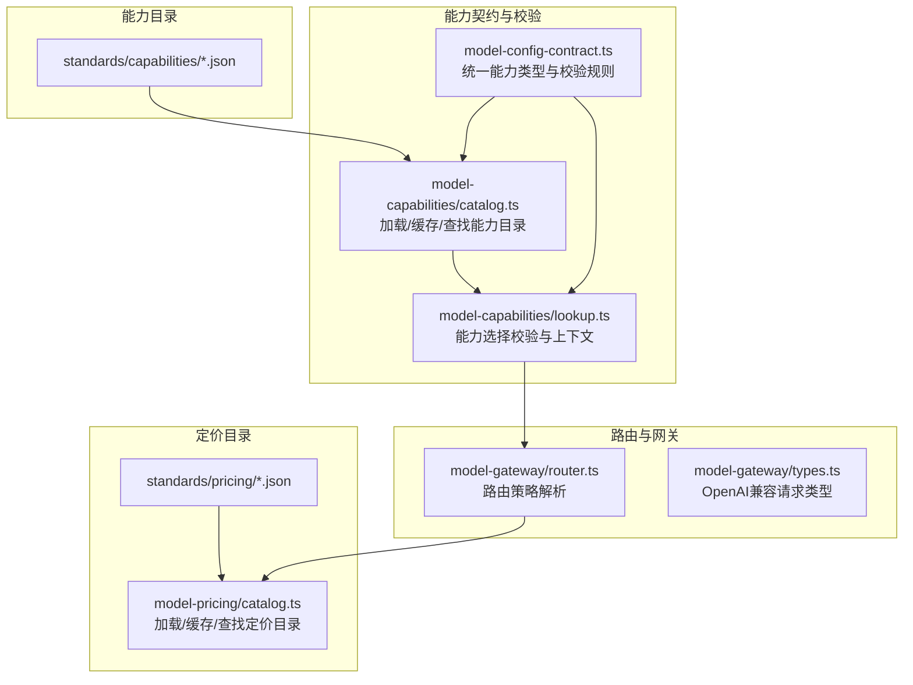
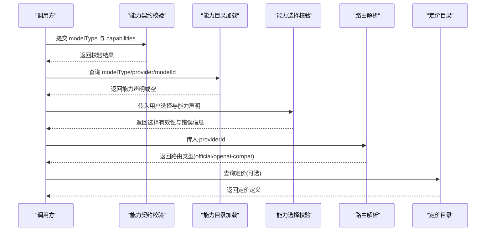
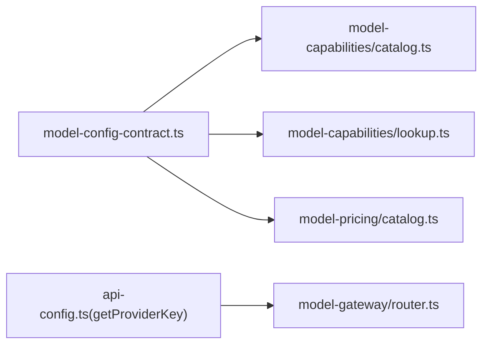
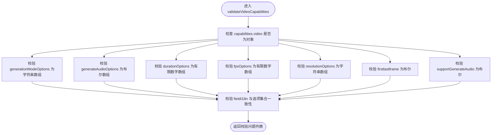

# 提供商能力声明

<cite>
**本文引用的文件**
- [catalog.example.json](file://standards/capabilities/catalog.example.json)
- [image-video.catalog.json](file://standards/capabilities/image-video.catalog.json)
- [model-config-contract.ts](file://src/lib/model-config-contract.ts)
- [catalog.ts](file://src/lib/model-capabilities/catalog.ts)
- [lookup.ts](file://src/lib/model-capabilities/lookup.ts)
- [router.ts](file://src/lib/model-gateway/router.ts)
- [types.ts](file://src/lib/model-gateway/types.ts)
- [image-video.pricing.json](file://standards/pricing/image-video.pricing.json)
- [catalog.ts](file://src/lib/model-pricing/catalog.ts)
</cite>

## 目录
1. [简介](#简介)
2. [项目结构](#项目结构)
3. [核心组件](#核心组件)
4. [架构总览](#架构总览)
5. [详细组件分析](#详细组件分析)
6. [依赖分析](#依赖分析)
7. [性能考虑](#性能考虑)
8. [故障排查指南](#故障排查指南)
9. [结论](#结论)
10. [附录](#附录)

## 简介
本技术文档围绕“AI提供商能力声明系统”展开，目标是帮助开发者与运营人员理解并正确使用能力声明标准、JSON 结构定义、不同能力类型的声明规范、能力目录的组织与分类、路由器基于能力声明的提供商选择与路由策略、以及能力声明的验证规则、更新机制与版本管理策略。文档同时提供可操作的配置示例与最佳实践建议。

## 项目结构
能力声明系统由三部分组成：
- 能力目录：以 JSON 文件形式描述各提供商模型的能力选项与国际化标签映射。
- 能力契约与校验：定义统一的能力数据结构、字段约束与校验规则。
- 路由器与定价目录：用于根据能力声明进行提供商选择、路由策略与计费匹配。

图表来源
- [catalog.ts:1-224](file://src/lib/model-capabilities/catalog.ts#L1-L224)
- [model-config-contract.ts:1-528](file://src/lib/model-config-contract.ts#L1-L528)
- [lookup.ts:1-46](file://src/lib/model-capabilities/lookup.ts#L1-L46)
- [router.ts:1-22](file://src/lib/model-gateway/router.ts#L1-L22)
- [types.ts:1-46](file://src/lib/model-gateway/types.ts#L1-L46)
- [catalog.ts:1-268](file://src/lib/model-pricing/catalog.ts#L1-L268)

章节来源
- [catalog.example.json:1-50](file://standards/capabilities/catalog.example.json#L1-L50)
- [image-video.catalog.json:1-120](file://standards/capabilities/image-video.catalog.json#L1-L120)
- [model-config-contract.ts:1-120](file://src/lib/model-config-contract.ts#L1-L120)
- [catalog.ts:1-120](file://src/lib/model-capabilities/catalog.ts#L1-L120)
- [lookup.ts:1-46](file://src/lib/model-capabilities/lookup.ts#L1-L46)
- [router.ts:1-22](file://src/lib/model-gateway/router.ts#L1-L22)
- [types.ts:1-46](file://src/lib/model-gateway/types.ts#L1-L46)
- [image-video.pricing.json:1-120](file://standards/pricing/image-video.pricing.json#L1-L120)
- [catalog.ts:1-120](file://src/lib/model-pricing/catalog.ts#L1-L120)

## 核心组件
- 统一能力类型与结构
  - 定义统一模型类型（llm、image、video、audio、lipsync），以及每类能力的字段集合与校验规则。
  - 支持字段级国际化配置（labelKey、unitKey、optionLabelKeys），便于 UI 展示与本地化。
- 能力目录加载与查找
  - 从 standards/capabilities 目录读取 JSON 文件，构建内存缓存，支持按 modelType::provider::modelId 精确匹配与按 provider key 回退匹配，并内置别名映射（如 gemini-compatible → google）。
- 能力选择校验
  - 基于已加载的能力声明，对用户选择的参数进行合法性校验，确保值在允许范围内且满足必填要求。
- 路由策略
  - 根据提供商标识解析路由类型（official 或 openai-compat），并提供兼容性判断逻辑。
- 定价目录
  - 从 standards/pricing 目录读取定价定义（flat 或 capability 模式），支持按 exact key 与 modelId 分组查询，并内置提供商别名映射。

章节来源
- [model-config-contract.ts:1-120](file://src/lib/model-config-contract.ts#L1-L120)
- [catalog.ts:1-120](file://src/lib/model-capabilities/catalog.ts#L1-L120)
- [lookup.ts:1-46](file://src/lib/model-capabilities/lookup.ts#L1-L46)
- [router.ts:1-22](file://src/lib/model-gateway/router.ts#L1-L22)
- [types.ts:1-46](file://src/lib/model-gateway/types.ts#L1-L46)
- [catalog.ts:1-120](file://src/lib/model-pricing/catalog.ts#L1-L120)

## 架构总览
能力声明驱动的提供商选择与路由流程如下：

图表来源
- [model-config-contract.ts:471-528](file://src/lib/model-config-contract.ts#L471-L528)
- [catalog.ts:169-224](file://src/lib/model-capabilities/catalog.ts#L169-L224)
- [lookup.ts:1-46](file://src/lib/model-capabilities/lookup.ts#L1-L46)
- [router.ts:17-22](file://src/lib/model-gateway/router.ts#L17-L22)
- [catalog.ts:226-268](file://src/lib/model-pricing/catalog.ts#L226-L268)

## 详细组件分析

### 能力声明标准与 JSON 结构
- 统一结构
  - modelType：统一模型类型（llm、image、video、audio、lipsync）
  - provider：提供商标识（支持带后缀复合键，如 gemini-compatible:uuid）
  - modelId：模型标识
  - capabilities：能力声明对象，按 modelType 对应命名空间
- 能力命名空间与字段
  - llm：reasoningEffortOptions（推理强度选项）、fieldI18n（字段国际化）
  - image：resolutionOptions（分辨率选项）、qualityOptions（质量选项）、fieldI18n
  - video：generationModeOptions（生成模式选项）、generateAudioOptions（是否可生成音频）、durationOptions（时长选项）、fpsOptions（帧率选项）、resolutionOptions（分辨率选项）、firstlastframe（首尾帧支持）、supportGenerateAudio（是否支持生成音频）、fieldI18n
  - audio：voiceOptions（声音选项）、rateOptions（速率选项）、fieldI18n
  - lipsync：modeOptions（同步模式选项）、fieldI18n
- 字段国际化
  - fieldI18n 的键必须属于对应命名空间的允许字段；optionLabelKeys 的键需在对应字段的选项列表中存在。

章节来源
- [model-config-contract.ts:27-113](file://src/lib/model-config-contract.ts#L27-L113)
- [model-config-contract.ts:148-229](file://src/lib/model-config-contract.ts#L148-L229)
- [catalog.example.json:1-50](file://standards/capabilities/catalog.example.json#L1-L50)

### 不同类型能力的声明规范与字段含义
- 图像生成（image）
  - 支持 resolutionOptions 与 qualityOptions；若未提供则表示默认或由实现决定
  - 示例参考：image-video.catalog.json 中多条 image 条目
- 视频生成（video）
  - 支持 generationModeOptions、generateAudioOptions、durationOptions、fpsOptions、resolutionOptions、firstlastframe、supportGenerateAudio
  - 示例参考：image-video.catalog.json 中多条 video 条目
- 语音合成（audio）
  - 支持 voiceOptions、rateOptions
  - 若无 capabilities 则表示不声明具体能力
- 语言模型（llm）
  - 支持 reasoningEffortOptions；示例参考 catalog.example.json 与 image-video.catalog.json
- 唇形同步（lipsync）
  - 支持 modeOptions

章节来源
- [model-config-contract.ts:27-58](file://src/lib/model-config-contract.ts#L27-L58)
- [image-video.catalog.json:1-120](file://standards/capabilities/image-video.catalog.json#L1-L120)
- [catalog.example.json:1-50](file://standards/capabilities/catalog.example.json#L1-L50)

### 能力目录的组织结构与分类体系
- 目录位置
  - standards/capabilities 下的 JSON 文件构成能力目录
- 加载与缓存
  - 读取所有 .json 文件，构建 entries、exact 映射与 byProviderKey 映射
  - 缓存签名基于文件 mtimeMs 与 size，避免重复加载
- 查找策略
  - 精确匹配：modelType::provider::modelId
  - 回退匹配：modelType::providerKey::modelId
  - 别名匹配：gemini-compatible → google
- 错误处理
  - 重复键、缺失 JSON 文件、非法数组、非法对象等均抛出明确错误码

章节来源
- [catalog.ts:112-152](file://src/lib/model-capabilities/catalog.ts#L112-L152)
- [catalog.ts:169-224](file://src/lib/model-capabilities/catalog.ts#L169-L224)

### 路由器如何根据能力声明进行提供商选择与负载均衡
- 路由类型
  - official：官方协议
  - openai-compat：OpenAI 兼容协议
- 识别规则
  - OFFICIAL_ONLY_PROVIDER_KEYS：仅走 official
  - COMPATIBLE_PROVIDER_KEYS：走 openai-compat
  - 其他：根据提供商键判断
- 负载均衡
  - 当前实现提供路由类型判定，未直接暴露负载均衡算法；可在上层服务扩展基于路由类型与健康状态的均衡策略

章节来源
- [router.ts:1-22](file://src/lib/model-gateway/router.ts#L1-L22)
- [types.ts:1-46](file://src/lib/model-gateway/types.ts#L1-L46)

### 能力声明的验证规则、更新机制与版本管理策略
- 验证规则
  - capabilities 必须为对象；命名空间必须合法且与 modelType 对应
  - 各命名空间允许字段严格限定；未知字段报错
  - 字段类型校验：字符串数组、数字数组、布尔数组等
  - fieldI18n 校验：labelKey/unitKey 必须非空字符串；optionLabelKeys 的键必须存在于对应选项集合
- 更新机制
  - 能力目录采用文件系统驱动，新增/修改 JSON 文件后，下次访问会重新加载并重建缓存
  - 提供重置缓存的测试接口 resetBuiltinCapabilityCatalogCacheForTest
- 版本管理策略
  - 通过文件 mtimeMs 与 size 构建签名，变更即刷新缓存
  - 建议在发布前集中更新 standards/capabilities 下的 JSON，避免运行时频繁抖动

章节来源
- [model-config-contract.ts:231-528](file://src/lib/model-config-contract.ts#L231-L528)
- [catalog.ts:120-152](file://src/lib/model-capabilities/catalog.ts#L120-L152)
- [catalog.ts:221-224](file://src/lib/model-capabilities/catalog.ts#L221-L224)

### 实际配置示例与最佳实践
- 示例文件
  - catalog.example.json：展示 llm、image、video 的基础声明结构
  - image-video.catalog.json：覆盖多个提供商（如 fal、ark、google、bailian）的 image/video 能力声明
- 最佳实践
  - 为每个能力字段提供 fieldI18n，确保 UI 友好展示
  - 保持 resolutionOptions/qualityOptions/durationOptions/fpsOptions 等选项的有序性与一致性
  - 使用 provider 复合键时，保留语义清晰的后缀，便于溯源
  - 在 standards/capabilities 与 standards/pricing 中保持 provider/modelId 的一致性，减少回退与别名带来的歧义

章节来源
- [catalog.example.json:1-50](file://standards/capabilities/catalog.example.json#L1-L50)
- [image-video.catalog.json:1-120](file://standards/capabilities/image-video.catalog.json#L1-L120)

## 依赖分析
- 组件耦合
  - model-capabilities/catalog.ts 依赖 model-config-contract.ts 的类型与校验函数
  - model-capabilities/lookup.ts 依赖 catalog.ts 与 model-config-contract.ts，负责能力选择校验
  - model-gateway/router.ts 依赖 api-config 的 providerKey 解析
  - model-pricing/catalog.ts 依赖 model-config-contract.ts 的 CapabilityValue 类型
- 外部依赖
  - 文件系统读写（standards/capabilities 与 standards/pricing）
  - JSON 解析与缓存

图表来源
- [model-config-contract.ts:1-120](file://src/lib/model-config-contract.ts#L1-L120)
- [catalog.ts:1-120](file://src/lib/model-capabilities/catalog.ts#L1-L120)
- [lookup.ts:1-46](file://src/lib/model-capabilities/lookup.ts#L1-L46)
- [router.ts:1-22](file://src/lib/model-gateway/router.ts#L1-L22)
- [catalog.ts:1-120](file://src/lib/model-pricing/catalog.ts#L1-L120)

章节来源
- [model-config-contract.ts:1-120](file://src/lib/model-config-contract.ts#L1-L120)
- [catalog.ts:1-120](file://src/lib/model-capabilities/catalog.ts#L1-L120)
- [lookup.ts:1-46](file://src/lib/model-capabilities/lookup.ts#L1-L46)
- [router.ts:1-22](file://src/lib/model-gateway/router.ts#L1-L22)
- [catalog.ts:1-120](file://src/lib/model-pricing/catalog.ts#L1-L120)

## 性能考虑
- 缓存策略
  - 能力目录与定价目录均采用内存缓存，基于文件签名避免重复解析
- I/O 优化
  - 批量读取 standards 目录下的 JSON 文件，一次性构建索引
- 访问路径
  - 精确匹配优先，回退匹配次之，别名匹配最后，降低查找成本
- 建议
  - 控制能力声明文件数量与大小，避免热更新导致的频繁重建
  - 在高并发场景下，尽量复用已解析的 modelKey 与能力上下文

## 故障排查指南
- 常见错误与定位
  - CAPABILITY_CATALOG_INVALID：JSON 结构不符合要求（数组/对象/字段缺失）
  - CAPABILITY_CATALOG_DUPLICATE：重复的 modelType::provider::modelId
  - CAPABILITY_CATALOG_MISSING：standards/capabilities 下缺少 JSON 文件
  - CAPABILITY_NAMESPACE_INVALID/CAPABILITY_FIELD_INVALID：命名空间或字段非法
  - CAPABILITY_VALUE_NOT_ALLOWED：选择值不在允许集合内
- 排查步骤
  - 检查 standards/capabilities 下 JSON 是否为数组与对象
  - 核对 modelType 与 capabilities 命名空间是否一致
  - 使用 validateOptionValueAgainstAllowed 校验用户选择
  - 通过 findBuiltinCapabilityCatalogEntry 精确定位条目
- 相关实现
  - 能力目录加载与校验：catalog.ts
  - 能力契约与校验：model-config-contract.ts
  - 能力选择校验：lookup.ts

章节来源
- [catalog.ts:129-152](file://src/lib/model-capabilities/catalog.ts#L129-L152)
- [model-config-contract.ts:471-528](file://src/lib/model-config-contract.ts#L471-L528)
- [lookup.ts:1-46](file://src/lib/model-capabilities/lookup.ts#L1-L46)

## 结论
该能力声明系统通过标准化的 JSON 结构与严格的校验规则，实现了对多类型 AI 能力的统一描述与管理；结合目录加载、别名与回退匹配机制，提供了灵活的查找与路由能力。配合定价目录与路由策略，可支撑从能力声明到路由与计费的完整链路。建议在团队内推广统一的声明模板与校验流程，确保能力声明的一致性与可维护性。

## 附录
- 字段校验流程图（以 video 为例）

图表来源
- [model-config-contract.ts:308-379](file://src/lib/model-config-contract.ts#L308-L379)