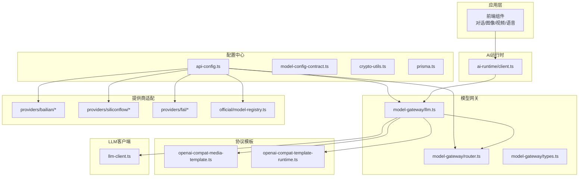
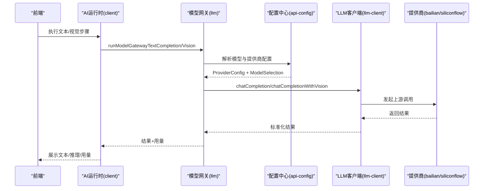
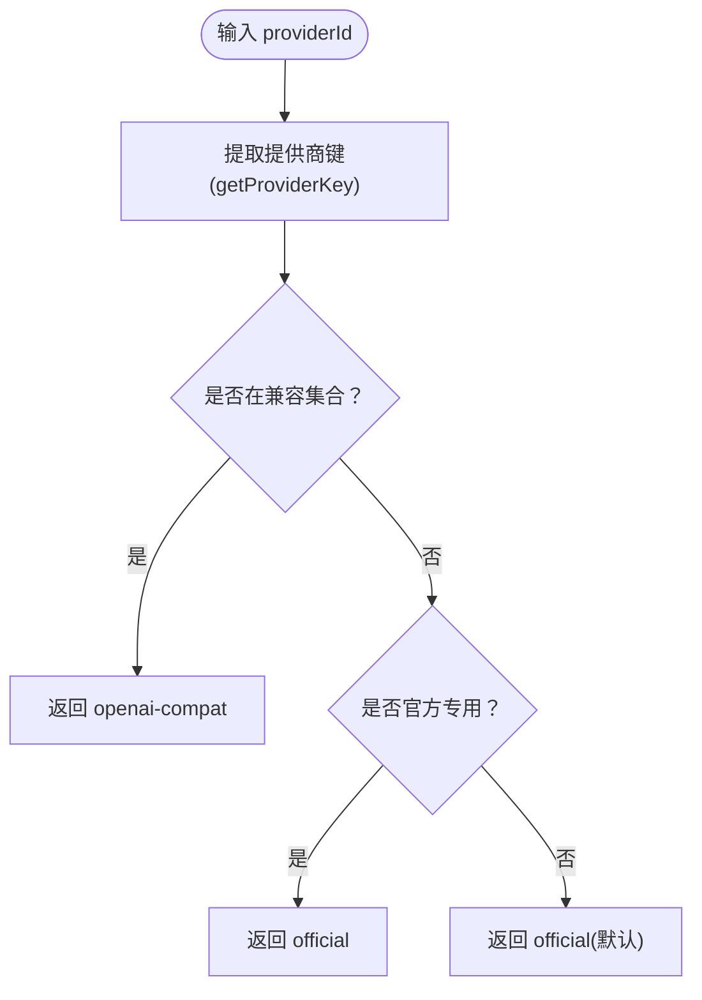
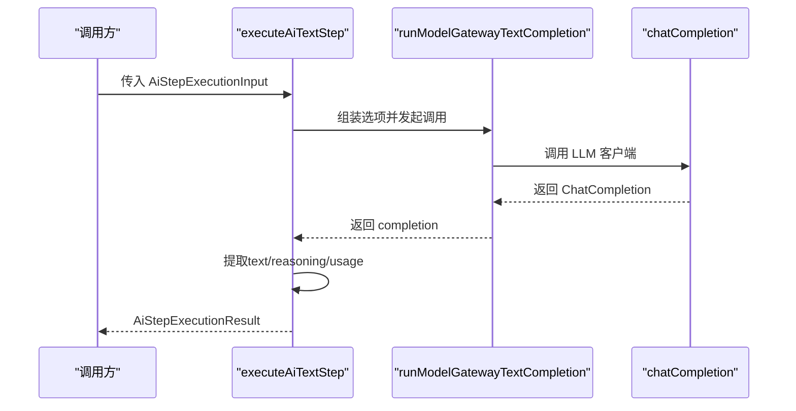
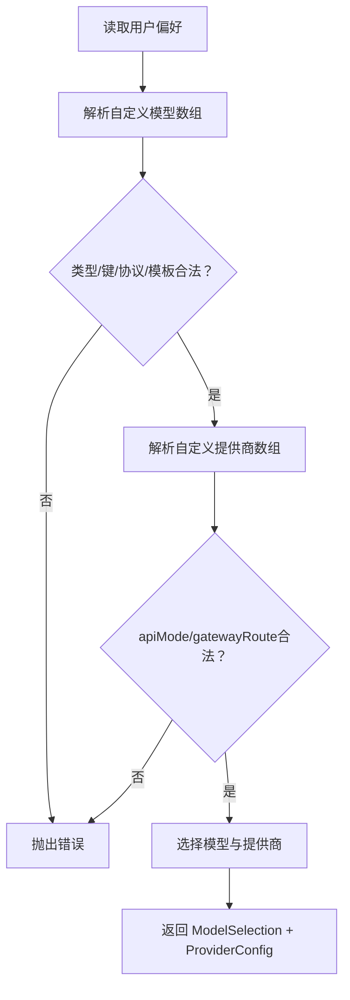
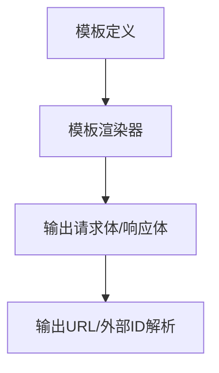
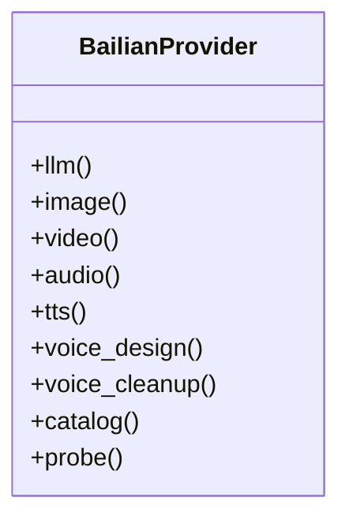
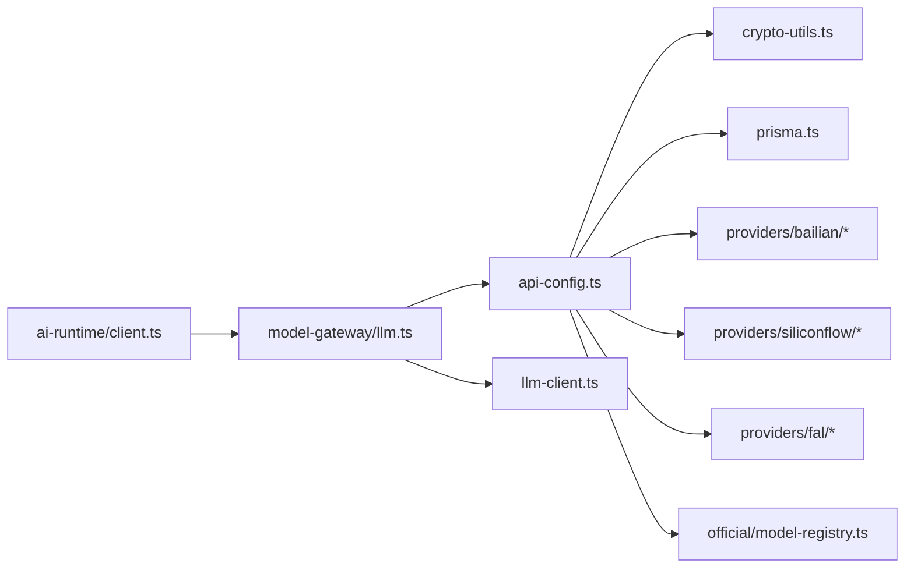

# AI模型集成

<cite>
**本文引用的文件**
- [src/lib/model-gateway/index.ts](file://src/lib/model-gateway/index.ts)
- [src/lib/model-gateway/router.ts](file://src/lib/model-gateway/router.ts)
- [src/lib/model-gateway/types.ts](file://src/lib/model-gateway/types.ts)
- [src/lib/model-gateway/llm.ts](file://src/lib/model-gateway/llm.ts)
- [src/lib/ai-runtime/index.ts](file://src/lib/ai-runtime/index.ts)
- [src/lib/ai-runtime/client.ts](file://src/lib/ai-runtime/client.ts)
- [src/lib/api-config.ts](file://src/lib/api-config.ts)
- [src/lib/providers/bailian/index.ts](file://src/lib/providers/bailian/index.ts)
- [src/lib/providers/bailian/types.ts](file://src/lib/providers/bailian/types.ts)
- [src/lib/providers/siliconflow/index.ts](file://src/lib/providers/siliconflow/index.ts)
- [src/lib/providers/siliconflow/types.ts](file://src/lib/providers/siliconflow/types.ts)
- [src/lib/providers/fal/base-url.ts](file://src/lib/providers/fal/base-url.ts)
- [src/lib/official/model-registry.ts](file://src/lib/official/model-registry.ts)
- [src/lib/openai-compat-media-template.ts](file://src/lib/openai-compat-media-template.ts)
- [src/lib/openai-compat-template-runtime.ts](file://src/lib/openai-compat-template-runtime.ts)
- [src/lib/llm-client.ts](file://src/lib/llm-client.ts)
- [src/lib/prisma.ts](file://src/lib/prisma.ts)
- [src/lib/crypto-utils.ts](file://src/lib/crypto-utils.ts)
- [src/lib/model-config-contract.ts](file://src/lib/model-config-contract.ts)
- [src/lib/providers/bailian/catalog.ts](file://src/lib/providers/bailian/catalog.ts)
- [src/lib/providers/bailian/probe.ts](file://src/lib/providers/bailian/probe.ts)
- [src/lib/providers/bailian/image.ts](file://src/lib/providers/bailian/image.ts)
- [src/lib/providers/bailian/video.ts](file://src/lib/providers/bailian/video.ts)
- [src/lib/providers/bailian/llm.ts](file://src/lib/providers/bailian/llm.ts)
- [src/lib/providers/bailian/tts.ts](file://src/lib/providers/bailian/tts.ts)
- [src/lib/providers/bailian/voice-design.ts](file://src/lib/providers/bailian/voice-design.ts)
- [src/lib/providers/bailian/voice-cleanup.ts](file://src/lib/providers/bailian/voice-cleanup.ts)
- [src/lib/providers/siliconflow/llm.ts](file://src/lib/providers/siliconflow/llm.ts)
- [src/lib/providers/siliconflow/image.ts](file://src/lib/providers/siliconflow/image.ts)
- [src/lib/providers/siliconflow/video.ts](file://src/lib/providers/siliconflow/video.ts)
- [src/lib/providers/siliconflow/audio.ts](file://src/lib/providers/siliconflow/audio.ts)
- [src/lib/providers/siliconflow/catalog.ts](file://src/lib/providers/siliconflow/catalog.ts)
- [src/lib/providers/siliconflow/probe.ts](file://src/lib/providers/siliconflow/probe.ts)
- [src/lib/providers/siliconflow/types.ts](file://src/lib/providers/siliconflow/types.ts)
- [src/lib/model-capabilities/image-video.catalog.json](file://standards/capabilities/image-video.catalog.json)
- [src/lib/model-pricing/image-video.pricing.json](file://standards/pricing/image-video.pricing.json)
- [src/lib/model-capabilities/bailian-video-capabilities.test.ts](file://tests/unit/model-capabilities/bailian-video-capabilities.test.ts)
- [src/lib/model-gateway/router.test.ts](file://tests/unit/model-gateway/router.test.ts)
- [src/lib/model-gateway/openai-compat-responses.test.ts](file://tests/unit/model-gateway/openai-compat-responses.test.ts)
- [src/lib/model-gateway/openai-compat-template-image-output-urls.test.ts](file://tests/unit/model-gateway/openai-compat-template-image-output-urls.test.ts)
- [src/lib/model-gateway/openai-compat-template-renderer.test.ts](file://tests/unit/model-gateway/openai-compat-template-renderer.test.ts)
- [src/lib/model-gateway/openai-compat-template-video-external-id.test.ts](file://tests/unit/model-gateway/openai-compat-template-video-external-id.test.ts)
- [src/lib/providers/bailian-llm.test.ts](file://tests/unit/providers/bailian-llm.test.ts)
- [src/lib/providers/bailian-tts.test.ts](file://tests/unit/providers/bailian-tts.test.ts)
- [src/lib/providers/bailian-video.test.ts](file://tests/unit/providers/bailian-video.test.ts)
- [src/lib/providers/bailian-voice-cleanup.test.ts](file://tests/unit/providers/bailian-voice-cleanup.test.ts)
- [src/lib/providers/bailian-voice-design.test.ts](file://tests/unit/providers/bailian-voice-design.test.ts)
- [src/lib/generators/audio/bailian.ts](file://src/lib/generators/audio/bailian.ts)
- [src/lib/lipsync/providers/bailian.ts](file://src/lib/lipsync/providers/bailian.ts)
- [src/lib/generators/fal.ts](file://src/lib/generators/fal.ts)
- [src/lib/lipsync/providers/fal.ts](file://src/lib/lipsync/providers/fal.ts)
</cite>

## 目录
1. [引言](#引言)
2. [项目结构](#项目结构)
3. [核心组件](#核心组件)
4. [架构总览](#架构总览)
5. [详细组件分析](#详细组件分析)
6. [依赖关系分析](#依赖关系分析)
7. [性能考虑](#性能考虑)
8. [故障排查指南](#故障排查指南)
9. [结论](#结论)
10. [附录](#附录)

## 引言
本技术指南面向在Waoowaoo中集成与运行AI模型的工程师与产品团队，系统性阐述AI模型抽象层的设计理念与实现方式，覆盖OpenAI、Gemini、Fal AI、百炼AI等主流AI服务的接入方案，以及模型配置管理、能力声明与协议适配的关键细节。文档同时深入解析“模型网关”的工作原理（请求路由、协议适配、错误处理），并提供自定义AI模型集成的开发指南（API适配器开发、认证机制、性能优化），以及模型能力验证、版本兼容性与故障转移的实现建议。

## 项目结构
围绕AI模型集成的核心目录与职责如下：
- 模型网关：统一路由与协议适配，屏蔽上游差异
  - 路由与类型：router.ts、types.ts
  - LLM入口：llm.ts
  - 导出聚合：index.ts
- AI运行时：对上层业务屏蔽底层调用细节
  - 客户端封装：client.ts
  - 类型与错误：index.ts
- 配置中心：严格模式的模型与提供商配置读取、校验与解析
  - 主配置：api-config.ts
  - 合同与键：model-config-contract.ts
  - 加解密：crypto-utils.ts
  - 数据库：prisma.ts
- 提供商适配：官方与兼容两类路径
  - 百炼AI：bailian/*
  - SiliconFlow：siliconflow/*
  - Fal AI：fal/*
  - 官方注册表：official/model-registry.ts
- 协议模板：OpenAI兼容媒体生成模板
  - 模板定义与渲染：openai-compat-media-template.ts、openai-compat-template-runtime.ts
- LLM客户端：统一聊天补全调用
  - llm-client.ts
- 能力与定价标准：能力目录与定价目录
  - 能力目录：standards/capabilities/image-video.catalog.json
  - 定价目录：standards/pricing/image-video.pricing.json

**图表来源**
- [src/lib/ai-runtime/client.ts:1-113](file://src/lib/ai-runtime/client.ts#L1-L113)
- [src/lib/model-gateway/llm.ts:1-40](file://src/lib/model-gateway/llm.ts#L1-L40)
- [src/lib/model-gateway/router.ts:1-22](file://src/lib/model-gateway/router.ts#L1-L22)
- [src/lib/api-config.ts:1-509](file://src/lib/api-config.ts#L1-L509)
- [src/lib/llm-client.ts](file://src/lib/llm-client.ts)
- [src/lib/providers/bailian/index.ts](file://src/lib/providers/bailian/index.ts)
- [src/lib/providers/siliconflow/index.ts](file://src/lib/providers/siliconflow/index.ts)
- [src/lib/providers/fal/base-url.ts](file://src/lib/providers/fal/base-url.ts)
- [src/lib/official/model-registry.ts](file://src/lib/official/model-registry.ts)
- [src/lib/openai-compat-media-template.ts](file://src/lib/openai-compat-media-template.ts)
- [src/lib/openai-compat-template-runtime.ts](file://src/lib/openai-compat-template-runtime.ts)

**章节来源**
- [src/lib/model-gateway/index.ts:1-21](file://src/lib/model-gateway/index.ts#L1-L21)
- [src/lib/ai-runtime/index.ts:1-11](file://src/lib/ai-runtime/index.ts#L1-L11)
- [src/lib/api-config.ts:1-509](file://src/lib/api-config.ts#L1-L509)

## 核心组件
- 模型网关
  - 路由判定：根据提供商键决定走官方或OpenAI兼容路径
  - LLM入口：统一封装文本与视觉补全调用
  - 类型定义：OpenAI兼容图片/视频/聊天请求的接口
- AI运行时
  - 文本/视觉步骤执行：封装调用、提取结果与用量、错误转换
- 配置中心
  - 严格模式解析：模型键、提供商、协议、模板与价格
  - 认证信息：解密API Key，规范化基础URL
- 提供商适配
  - 百炼AI：LLM、图像、视频、TTS、语音设计、清理等
  - SiliconFlow：LLM、图像、视频、音频、目录探测
  - Fal AI：基础URL配置
  - 官方注册表：官方模型清单
- 协议模板
  - OpenAI兼容媒体模板：渲染输出URL、外部ID、响应格式
- LLM客户端
  - 统一聊天补全调用入口

**章节来源**
- [src/lib/model-gateway/router.ts:1-22](file://src/lib/model-gateway/router.ts#L1-L22)
- [src/lib/model-gateway/llm.ts:1-40](file://src/lib/model-gateway/llm.ts#L1-L40)
- [src/lib/model-gateway/types.ts:1-46](file://src/lib/model-gateway/types.ts#L1-L46)
- [src/lib/ai-runtime/client.ts:1-113](file://src/lib/ai-runtime/client.ts#L1-L113)
- [src/lib/api-config.ts:1-509](file://src/lib/api-config.ts#L1-L509)

## 架构总览
模型网关作为统一入口，负责：
- 基于提供商键进行路由决策
- 在OpenAI兼容路径下，结合模板与协议参数完成媒体生成
- 在官方路径下，调用对应提供商的具体实现
- 将调用结果标准化返回给AI运行时

**图表来源**
- [src/lib/ai-runtime/client.ts:49-112](file://src/lib/ai-runtime/client.ts#L49-L112)
- [src/lib/model-gateway/llm.ts:8-39](file://src/lib/model-gateway/llm.ts#L8-L39)
- [src/lib/api-config.ts:323-398](file://src/lib/api-config.ts#L323-L398)
- [src/lib/llm-client.ts](file://src/lib/llm-client.ts)
- [src/lib/providers/bailian/index.ts](file://src/lib/providers/bailian/index.ts)
- [src/lib/providers/siliconflow/index.ts](file://src/lib/providers/siliconflow/index.ts)

## 详细组件分析

### 模型网关与路由
- 路由规则
  - 兼容型提供商：openai-compatible
  - 官方专用：bailian、siliconflow
  - 其他默认走官方路径
- 请求类型
  - OpenAI兼容图片/视频/聊天请求的结构化定义
- 关键流程
  - isCompatibleProvider：判断是否兼容
  - resolveModelGatewayRoute：计算路由

**图表来源**
- [src/lib/model-gateway/router.ts:4-21](file://src/lib/model-gateway/router.ts#L4-L21)

**章节来源**
- [src/lib/model-gateway/router.ts:1-22](file://src/lib/model-gateway/router.ts#L1-L22)
- [src/lib/model-gateway/types.ts:1-46](file://src/lib/model-gateway/types.ts#L1-L46)

### AI运行时：文本与视觉步骤
- 文本步骤
  - 输入：用户ID、模型键、消息、温度、推理开关与流式元数据
  - 输出：文本、推理、用量与原始补全
- 视觉步骤
  - 输入：图像URL列表、提示词等
  - 输出：文本、推理、用量与原始补全
- 错误转换
  - 将底层异常转换为统一的AI运行时错误

**图表来源**
- [src/lib/ai-runtime/client.ts:49-79](file://src/lib/ai-runtime/client.ts#L49-L79)
- [src/lib/model-gateway/llm.ts:8-21](file://src/lib/model-gateway/llm.ts#L8-L21)
- [src/lib/llm-client.ts](file://src/lib/llm-client.ts)

**章节来源**
- [src/lib/ai-runtime/client.ts:1-113](file://src/lib/ai-runtime/client.ts#L1-L113)
- [src/lib/model-gateway/llm.ts:1-40](file://src/lib/model-gateway/llm.ts#L1-L40)

### 配置中心：模型与提供商解析
- 严格模式
  - 模型键必须为 provider::modelId
  - 禁止猜测、静态映射与默认降级
  - 运行时仅从配置中心读取provider与密钥
- 解析流程
  - 用户偏好读取：prisma.userPreference
  - 自定义模型数组解析：类型校验、键一致性、协议与模板校验
  - 自定义提供商数组解析：id/name必填、apiMode/gatewayRoute合法性、去重
  - 选择器：resolveModelSelection / resolveModelSelectionOrSingle
- 认证与URL
  - getProviderConfig：解密API Key、规范化基础URL、返回ProviderConfig
  - normalizeProviderBaseUrl：对openai-compatible自动追加/v1路径

**图表来源**
- [src/lib/api-config.ts:291-352](file://src/lib/api-config.ts#L291-L352)
- [src/lib/api-config.ts:121-191](file://src/lib/api-config.ts#L121-L191)
- [src/lib/api-config.ts:193-279](file://src/lib/api-config.ts#L193-L279)
- [src/lib/api-config.ts:418-434](file://src/lib/api-config.ts#L418-L434)

**章节来源**
- [src/lib/api-config.ts:1-509](file://src/lib/api-config.ts#L1-L509)
- [src/lib/prisma.ts](file://src/lib/prisma.ts)
- [src/lib/crypto-utils.ts](file://src/lib/crypto-utils.ts)
- [src/lib/model-config-contract.ts](file://src/lib/model-config-contract.ts)

### OpenAI兼容媒体模板与渲染
- 模板定义
  - OpenAICompatMediaTemplate：描述如何渲染图片/视频生成请求与响应
- 渲染运行时
  - openai-compat-template-runtime：按模板将请求参数映射到具体字段
- 测试覆盖
  - 模板渲染、输出URL、外部ID等行为均有单元测试保障

**图表来源**
- [src/lib/openai-compat-media-template.ts](file://src/lib/openai-compat-media-template.ts)
- [src/lib/openai-compat-template-runtime.ts](file://src/lib/openai-compat-template-runtime.ts)
- [src/lib/model-gateway/openai-compat-template-renderer.test.ts](file://tests/unit/model-gateway/openai-compat-template-renderer.test.ts)
- [src/lib/model-gateway/openai-compat-template-image-output-urls.test.ts](file://tests/unit/model-gateway/openai-compat-template-image-output-urls.test.ts)
- [src/lib/model-gateway/openai-compat-template-video-external-id.test.ts](file://tests/unit/model-gateway/openai-compat-template-video-external-id.test.ts)

**章节来源**
- [src/lib/openai-compat-media-template.ts](file://src/lib/openai-compat-media-template.ts)
- [src/lib/openai-compat-template-runtime.ts](file://src/lib/openai-compat-template-runtime.ts)

### 百炼AI集成
- 能力目录与探测
  - catalog.ts：列出可用模型与能力
  - probe.ts：协议探测与连通性检查
- 生成能力
  - 图像/视频/音频/语音相关模块：image.ts、video.ts、audio.ts、tts.ts、voice-design.ts、voice-cleanup.ts
- LLM与注册表
  - llm.ts：聊天补全实现
  - index.ts：导出聚合
- 测试覆盖
  - bailian-llm.test.ts、bailian-video.test.ts、bailian-tts.test.ts、bailian-voice-design.test.ts、bailian-voice-cleanup.test.ts

**图表来源**
- [src/lib/providers/bailian/index.ts](file://src/lib/providers/bailian/index.ts)
- [src/lib/providers/bailian/llm.ts](file://src/lib/providers/bailian/llm.ts)
- [src/lib/providers/bailian/image.ts](file://src/lib/providers/bailian/image.ts)
- [src/lib/providers/bailian/video.ts](file://src/lib/providers/bailian/video.ts)
- [src/lib/providers/bailian/audio.ts](file://src/lib/providers/bailian/audio.ts)
- [src/lib/providers/bailian/tts.ts](file://src/lib/providers/bailian/tts.ts)
- [src/lib/providers/bailian/voice-design.ts](file://src/lib/providers/bailian/voice-design.ts)
- [src/lib/providers/bailian/voice-cleanup.ts](file://src/lib/providers/bailian/voice-cleanup.ts)
- [src/lib/providers/bailian/catalog.ts](file://src/lib/providers/bailian/catalog.ts)
- [src/lib/providers/bailian/probe.ts](file://src/lib/providers/bailian/probe.ts)

**章节来源**
- [src/lib/providers/bailian/index.ts](file://src/lib/providers/bailian/index.ts)
- [src/lib/providers/bailian/types.ts](file://src/lib/providers/bailian/types.ts)
- [src/lib/providers/bailian/llm.ts](file://src/lib/providers/bailian/llm.ts)
- [src/lib/providers/bailian/image.ts](file://src/lib/providers/bailian/image.ts)
- [src/lib/providers/bailian/video.ts](file://src/lib/providers/bailian/video.ts)
- [src/lib/providers/bailian/audio.ts](file://src/lib/providers/bailian/audio.ts)
- [src/lib/providers/bailian/tts.ts](file://src/lib/providers/bailian/tts.ts)
- [src/lib/providers/bailian/voice-design.ts](file://src/lib/providers/bailian/voice-design.ts)
- [src/lib/providers/bailian/voice-cleanup.ts](file://src/lib/providers/bailian/voice-cleanup.ts)
- [src/lib/providers/bailian/catalog.ts](file://src/lib/providers/bailian/catalog.ts)
- [src/lib/providers/bailian/probe.ts](file://src/lib/providers/bailian/probe.ts)

### SiliconFlow集成
- 能力目录与探测
  - catalog.ts、probe.ts
- 生成能力
  - image.ts、video.ts、audio.ts
- LLM与类型
  - llm.ts、types.ts
- index.ts：导出聚合

**章节来源**
- [src/lib/providers/siliconflow/index.ts](file://src/lib/providers/siliconflow/index.ts)
- [src/lib/providers/siliconflow/types.ts](file://src/lib/providers/siliconflow/types.ts)
- [src/lib/providers/siliconflow/llm.ts](file://src/lib/providers/siliconflow/llm.ts)
- [src/lib/providers/siliconflow/image.ts](file://src/lib/providers/siliconflow/image.ts)
- [src/lib/providers/siliconflow/video.ts](file://src/lib/providers/siliconflow/video.ts)
- [src/lib/providers/siliconflow/audio.ts](file://src/lib/providers/siliconflow/audio.ts)
- [src/lib/providers/siliconflow/catalog.ts](file://src/lib/providers/siliconflow/catalog.ts)
- [src/lib/providers/siliconflow/probe.ts](file://src/lib/providers/siliconflow/probe.ts)

### Fal AI集成
- 基础URL配置
  - base-url.ts：提供Fal AI的基础URL
- 生成器与语音
  - generators/fal.ts：Fal AI图像/视频生成器
  - lipsync/providers/fal.ts：Fal AI口型同步

**章节来源**
- [src/lib/providers/fal/base-url.ts](file://src/lib/providers/fal/base-url.ts)
- [src/lib/generators/fal.ts](file://src/lib/generators/fal.ts)
- [src/lib/lipsync/providers/fal.ts](file://src/lib/lipsync/providers/fal.ts)

### 官方模型注册表
- official/model-registry.ts：官方模型清单与注册逻辑

**章节来源**
- [src/lib/official/model-registry.ts](file://src/lib/official/model-registry.ts)

### 能力声明与定价标准
- 能力目录
  - standards/capabilities/image-video.catalog.json：图像/视频能力清单
- 定价目录
  - standards/pricing/image-video.pricing.json：图像/视频定价策略
- 测试验证
  - bailian-video-capabilities.test.ts：百炼视频能力验证

**章节来源**
- [src/lib/model-capabilities/image-video.catalog.json](file://standards/capabilities/image-video.catalog.json)
- [src/lib/model-pricing/image-video.pricing.json](file://standards/pricing/image-video.pricing.json)
- [src/lib/model-capabilities/bailian-video-capabilities.test.ts](file://tests/unit/model-capabilities/bailian-video-capabilities.test.ts)

## 依赖关系分析
- 组件耦合
  - AI运行时依赖模型网关；模型网关依赖配置中心与LLM客户端
  - 配置中心依赖加密工具与数据库；提供商适配独立但遵循统一键与类型
- 外部依赖
  - OpenAI SDK（类型与内容解析）
  - ai-sdk相关包（用于网关与提供商工具）
- 可能的循环依赖
  - 当前结构以“配置中心—网关—提供商”单向依赖为主，未见明显循环

**图表来源**
- [src/lib/ai-runtime/client.ts:1-113](file://src/lib/ai-runtime/client.ts#L1-L113)
- [src/lib/model-gateway/llm.ts:1-40](file://src/lib/model-gateway/llm.ts#L1-L40)
- [src/lib/api-config.ts:1-509](file://src/lib/api-config.ts#L1-L509)
- [src/lib/llm-client.ts](file://src/lib/llm-client.ts)
- [src/lib/crypto-utils.ts](file://src/lib/crypto-utils.ts)
- [src/lib/prisma.ts](file://src/lib/prisma.ts)
- [src/lib/providers/bailian/index.ts](file://src/lib/providers/bailian/index.ts)
- [src/lib/providers/siliconflow/index.ts](file://src/lib/providers/siliconflow/index.ts)
- [src/lib/providers/fal/base-url.ts](file://src/lib/providers/fal/base-url.ts)
- [src/lib/official/model-registry.ts](file://src/lib/official/model-registry.ts)

**章节来源**
- [src/lib/ai-runtime/index.ts:1-11](file://src/lib/ai-runtime/index.ts#L1-L11)
- [src/lib/model-gateway/index.ts:1-21](file://src/lib/model-gateway/index.ts#L1-L21)
- [src/lib/api-config.ts:1-509](file://src/lib/api-config.ts#L1-L509)

## 性能考虑
- 请求批量化与并发控制
  - 在网关层引入队列与限流，避免上游突发压力
- 缓存策略
  - 对稳定提示词与参考图的中间结果进行缓存，减少重复调用
- 模板渲染优化
  - 模板预编译与字段映射缓存，降低渲染开销
- 错误快速失败
  - 在配置解析阶段尽早发现非法键/协议/模板，避免无效调用
- 日志与可观测性
  - 统计每步用量、耗时与错误码，便于定位瓶颈

## 故障排查指南
- 常见错误与定位
  - MODEL_KEY_INVALID/MODEL_NOT_FOUND：检查模型键格式与启用状态
  - PROVIDER_NOT_FOUND/PROVIDER_API_KEY_MISSING：确认提供商配置与密钥
  - PROVIDER_GATEWAY_ROUTE_INVALID/PROVIDER_API_MODE_INVALID：核对路由与API模式
  - MODEL_COMPAT_MEDIA_TEMPLATE_INVALID：检查模板结构与字段
- 单元测试辅助
  - 路由测试：router.test.ts
  - 兼容响应测试：openai-compat-responses.test.ts
  - 模板渲染/输出URL/外部ID测试：对应template系列测试
  - 百炼LLM/视频/TTS/语音设计/清理测试：bailian系列测试
- 排障步骤
  1) 使用模型选择器与提供商探测接口验证配置
  2) 查看网关路由是否符合预期
  3) 核对模板渲染结果与上游响应字段映射
  4) 检查用量统计与错误码分类

**章节来源**
- [src/lib/api-config.ts:113-120](file://src/lib/api-config.ts#L113-L120)
- [src/lib/api-config.ts:121-191](file://src/lib/api-config.ts#L121-L191)
- [src/lib/api-config.ts:193-279](file://src/lib/api-config.ts#L193-L279)
- [src/lib/model-gateway/router.test.ts](file://tests/unit/model-gateway/router.test.ts)
- [src/lib/model-gateway/openai-compat-responses.test.ts](file://tests/unit/model-gateway/openai-compat-responses.test.ts)
- [src/lib/providers/bailian-llm.test.ts](file://tests/unit/providers/bailian-llm.test.ts)
- [src/lib/providers/bailian-video.test.ts](file://tests/unit/providers/bailian-video.test.ts)
- [src/lib/providers/bailian-tts.test.ts](file://tests/unit/providers/bailian-tts.test.ts)
- [src/lib/providers/bailian-voice-design.test.ts](file://tests/unit/providers/bailian-voice-design.test.ts)
- [src/lib/providers/bailian-voice-cleanup.test.ts](file://tests/unit/providers/bailian-voice-cleanup.test.ts)

## 结论
本指南系统梳理了Waoowaoo的AI模型抽象层与模型网关架构，明确了配置中心的严格模式与提供商适配策略，给出了OpenAI兼容与官方两条路径的实现要点，并提供了自定义集成的开发指引与故障排查方法。通过能力目录与定价目录的标准化，配合完善的单元测试与路由/模板测试，能够有效保障模型能力验证、版本兼容性与故障转移的稳定性。

## 附录
- 自定义AI模型集成开发指南
  - API适配器开发
    - 定义提供商键与基础URL，实现协议探测与连通性检查
    - 实现LLM/图像/视频/音频/TTS等能力模块
    - 提供能力目录与定价目录条目
  - 认证机制
    - 使用配置中心的加密存储与解密流程
    - 规范化基础URL与路由选择
  - 性能优化
    - 引入限流、缓存与批量化策略
    - 优化模板渲染与字段映射
  - 版本兼容性与故障转移
    - 通过能力目录与探测接口验证兼容性
    - 在路由层实现故障转移与降级策略