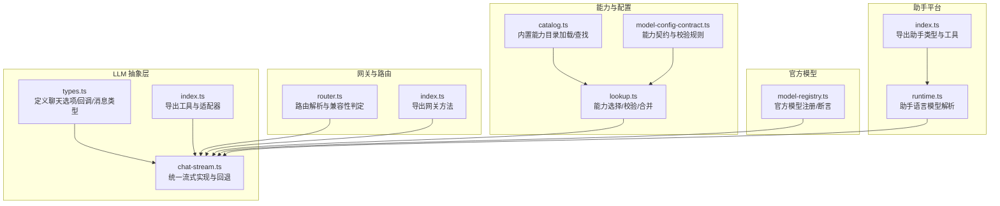
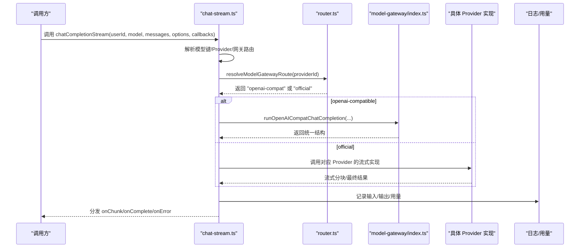
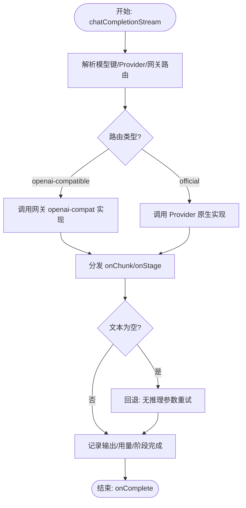
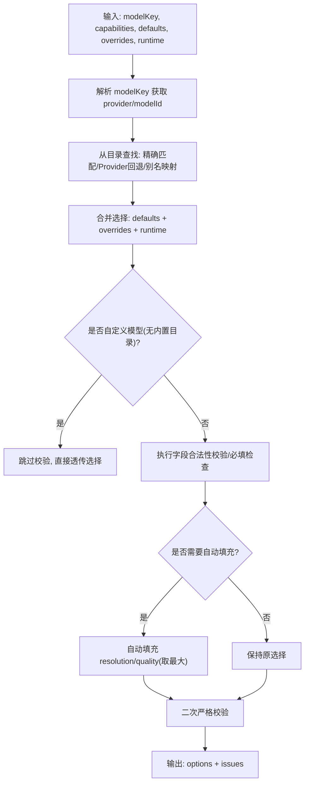
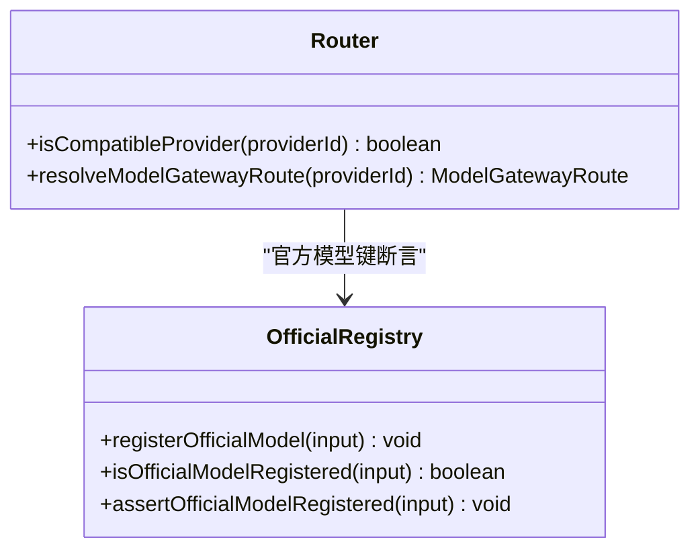
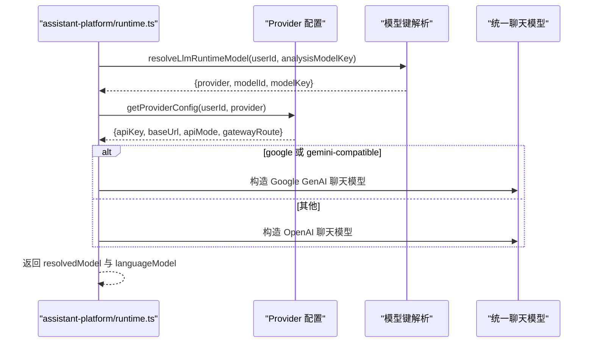
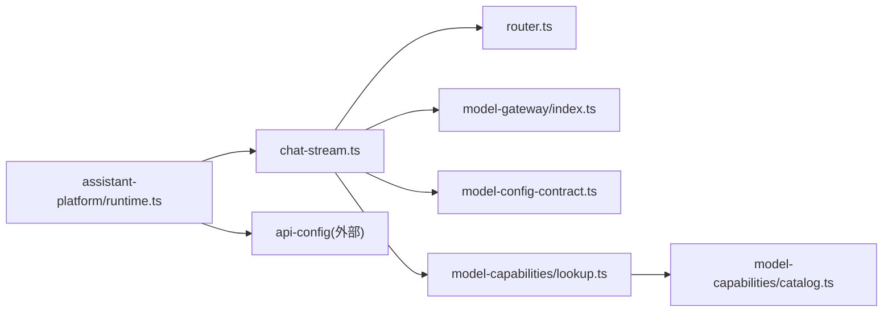

# 模型抽象层

<cite>
**本文引用的文件**
- [src/lib/llm/types.ts](file://src/lib/llm/types.ts)
- [src/lib/llm/chat-stream.ts](file://src/lib/llm/chat-stream.ts)
- [src/lib/llm/index.ts](file://src/lib/llm/index.ts)
- [src/lib/model-gateway/router.ts](file://src/lib/model-gateway/router.ts)
- [src/lib/model-gateway/index.ts](file://src/lib/model-gateway/index.ts)
- [src/lib/model-capabilities/lookup.ts](file://src/lib/model-capabilities/lookup.ts)
- [src/lib/model-capabilities/catalog.ts](file://src/lib/model-capabilities/catalog.ts)
- [src/lib/model-config-contract.ts](file://src/lib/model-config-contract.ts)
- [src/lib/providers/official/model-registry.ts](file://src/lib/providers/official/model-registry.ts)
- [src/lib/assistant-platform/runtime.ts](file://src/lib/assistant-platform/runtime.ts)
- [src/lib/assistant-platform/index.ts](file://src/lib/assistant-platform/index.ts)
- [src/app/[locale]/profile/components/api-config/provider-card/ModelTemplateAssistantModal.tsx](file://src/app/[locale]/profile/components/api-config/provider-card/ModelTemplateAssistantModal.tsx)
</cite>

## 目录
1. [引言](#引言)
2. [项目结构](#项目结构)
3. [核心组件](#核心组件)
4. [架构总览](#架构总览)
5. [详细组件分析](#详细组件分析)
6. [依赖关系分析](#依赖关系分析)
7. [性能考量](#性能考量)
8. [故障排查指南](#故障排查指南)
9. [结论](#结论)
10. [附录](#附录)

## 引言
本文件系统性梳理 Waoowaoo 的 AI 模型抽象层设计与实现，重点覆盖以下方面：
- 统一接口与能力声明：通过标准化的 LLM 聊天完成与流式响应接口，结合模型能力目录与配置契约，实现跨 Provider 的统一调用体验。
- 运行时管理：基于网关路由、Provider 解析与官方模型注册表，实现模型选择、协议适配与推理能力控制。
- 生命周期与配置：从模型键解析、能力选择合并到生成参数解析，贯穿配置管理与运行时决策。
- 能力验证与兼容性：内置能力目录与校验规则，保障自定义模型与内置模型的能力一致性；通过官方模型注册表约束官方 Provider 的可用模型集。
- 性能监控与可观测性：统一的日志记录、用量统计与流式阶段回调，便于性能分析与问题定位。

## 项目结构
围绕模型抽象层的关键模块如下：
- LLM 抽象与运行时：定义聊天完成与流式回调接口，封装多 Provider 的流式实现与回退策略。
- 模型网关与路由：根据 Provider 类型与协议特性，选择 openai-compatible 或 official 路由。
- 能力目录与配置契约：声明各模型的能力选项与校验规则，支持默认值自动填充与运行时选择合并。
- 官方模型注册表：限定官方 Provider 的可用模型集合，确保合规与安全。
- 助手平台运行时：在助手场景中解析语言模型，桥接 Provider 与统一接口。

**图表来源**
- [src/lib/llm/types.ts:1-40](file://src/lib/llm/types.ts#L1-L40)
- [src/lib/llm/chat-stream.ts:64-800](file://src/lib/llm/chat-stream.ts#L64-L800)
- [src/lib/llm/index.ts:1-24](file://src/lib/llm/index.ts#L1-L24)
- [src/lib/model-gateway/router.ts:1-22](file://src/lib/model-gateway/router.ts#L1-L22)
- [src/lib/model-gateway/index.ts:1-21](file://src/lib/model-gateway/index.ts#L1-L21)
- [src/lib/model-capabilities/lookup.ts:1-374](file://src/lib/model-capabilities/lookup.ts#L1-L374)
- [src/lib/model-capabilities/catalog.ts:1-224](file://src/lib/model-capabilities/catalog.ts#L1-L224)
- [src/lib/model-config-contract.ts:1-528](file://src/lib/model-config-contract.ts#L1-L528)
- [src/lib/providers/official/model-registry.ts:1-48](file://src/lib/providers/official/model-registry.ts#L1-L48)
- [src/lib/assistant-platform/runtime.ts:35-75](file://src/lib/assistant-platform/runtime.ts#L35-L75)
- [src/lib/assistant-platform/index.ts:1-11](file://src/lib/assistant-platform/index.ts#L1-L11)

**章节来源**
- [src/lib/llm/types.ts:1-40](file://src/lib/llm/types.ts#L1-L40)
- [src/lib/llm/chat-stream.ts:64-800](file://src/lib/llm/chat-stream.ts#L64-L800)
- [src/lib/llm/index.ts:1-24](file://src/lib/llm/index.ts#L1-L24)
- [src/lib/model-gateway/router.ts:1-22](file://src/lib/model-gateway/router.ts#L1-L22)
- [src/lib/model-gateway/index.ts:1-21](file://src/lib/model-gateway/index.ts#L1-L21)
- [src/lib/model-capabilities/lookup.ts:1-374](file://src/lib/model-capabilities/lookup.ts#L1-L374)
- [src/lib/model-capabilities/catalog.ts:1-224](file://src/lib/model-capabilities/catalog.ts#L1-L224)
- [src/lib/model-config-contract.ts:1-528](file://src/lib/model-config-contract.ts#L1-L528)
- [src/lib/providers/official/model-registry.ts:1-48](file://src/lib/providers/official/model-registry.ts#L1-L48)
- [src/lib/assistant-platform/runtime.ts:35-75](file://src/lib/assistant-platform/runtime.ts#L35-L75)
- [src/lib/assistant-platform/index.ts:1-11](file://src/lib/assistant-platform/index.ts#L1-L11)

## 核心组件
- 统一接口定义
  - 聊天完成选项与流式回调：定义温度、推理开关与努力级别、重试次数、项目计费上下文、流式步骤元信息等。
  - 消息类型：统一的用户/助手/系统消息结构。
- 能力声明机制
  - 能力契约：LLM、图像、视频、音频、唇同步等模型的能力字段与选项。
  - 能力目录：内置目录加载、缓存与别名映射，支持按模型键精确或按 Provider 键回退查找。
  - 能力选择：默认值合并、运行时选择、必填字段校验与自动填充。
- 运行时管理
  - 网关路由：根据 Provider 关键字决定 openai-compatible 或 official 路由。
  - Provider 解析：按用户维度解析 Provider 配置与模型键，支持官方模型注册表断言。
  - 流式实现：统一的流式回调分发、阶段切换、空响应回退与诊断日志。
- 助手平台集成
  - 助手语言模型解析：在助手场景中解析 Provider 并构造统一的聊天模型对象。

**章节来源**
- [src/lib/llm/types.ts:4-39](file://src/lib/llm/types.ts#L4-L39)
- [src/lib/model-config-contract.ts:27-66](file://src/lib/model-config-contract.ts#L27-L66)
- [src/lib/model-capabilities/catalog.ts:169-219](file://src/lib/model-capabilities/catalog.ts#L169-L219)
- [src/lib/model-capabilities/lookup.ts:249-353](file://src/lib/model-capabilities/lookup.ts#L249-L353)
- [src/lib/model-gateway/router.ts:17-21](file://src/lib/model-gateway/router.ts#L17-L21)
- [src/lib/providers/official/model-registry.ts:34-43](file://src/lib/providers/official/model-registry.ts#L34-L43)
- [src/lib/assistant-platform/runtime.ts:35-75](file://src/lib/assistant-platform/runtime.ts#L35-L75)

## 架构总览
模型抽象层以“统一接口 + 能力声明 + 运行时路由 + 官方模型约束”为核心，形成稳定、可扩展且可观测的 LLM 调用体系。

**图表来源**
- [src/lib/llm/chat-stream.ts:64-172](file://src/lib/llm/chat-stream.ts#L64-L172)
- [src/lib/model-gateway/router.ts:17-21](file://src/lib/model-gateway/router.ts#L17-L21)
- [src/lib/model-gateway/index.ts:12-20](file://src/lib/model-gateway/index.ts#L12-L20)

**章节来源**
- [src/lib/llm/chat-stream.ts:64-800](file://src/lib/llm/chat-stream.ts#L64-L800)
- [src/lib/model-gateway/router.ts:1-22](file://src/lib/model-gateway/router.ts#L1-L22)
- [src/lib/model-gateway/index.ts:1-21](file://src/lib/model-gateway/index.ts#L1-L21)

## 详细组件分析

### LLM 统一接口与流式实现
- 设计要点
  - 统一的 ChatCompletionOptions 与 ChatCompletionStreamCallbacks，屏蔽底层 Provider 的差异。
  - 支持推理能力开关与努力级别，针对不同 Provider 的推理参数进行条件传递。
  - 流式阶段回调 onStage/onChunk/onComplete/onError，便于前端与控制台展示。
- 关键流程
  - 模型解析：根据用户与模型键解析 Provider 配置与网关路由。
  - 协议适配：openai-compatible 与 official 两条路径，分别调用网关或 Provider 原生实现。
  - 空响应回退：在特定 Provider 下，若推理参数导致空文本，触发一次无推理参数的回退请求。
  - 诊断与日志：记录 chunk 类型分布、finishReason、HTTP 状态、providerMetadata 等，辅助问题定位。

**图表来源**
- [src/lib/llm/chat-stream.ts:64-743](file://src/lib/llm/chat-stream.ts#L64-L743)

**章节来源**
- [src/lib/llm/types.ts:4-39](file://src/lib/llm/types.ts#L4-L39)
- [src/lib/llm/chat-stream.ts:64-800](file://src/lib/llm/chat-stream.ts#L64-L800)

### 能力声明与验证
- 能力契约
  - LLM：推理努力级别选项与字段国际化配置。
  - 图像/视频/音频/唇同步：各自的能力字段与选项数组。
- 能力目录
  - 加载 standards/capabilities 下的 JSON 目录，构建精确匹配与 Provider 回退索引，并支持别名映射（如 gemini-compatible → google）。
- 能力选择
  - 默认值合并、运行时选择与覆盖合并；对 image/video 自动填充缺失的 resolution/quality（取最后一个可选项，确保最高质量）。
  - 必填字段校验与非法值检测，返回结构化问题列表。

**图表来源**
- [src/lib/model-capabilities/lookup.ts:249-353](file://src/lib/model-capabilities/lookup.ts#L249-L353)
- [src/lib/model-capabilities/catalog.ts:169-219](file://src/lib/model-capabilities/catalog.ts#L169-L219)
- [src/lib/model-config-contract.ts:471-527](file://src/lib/model-config-contract.ts#L471-L527)

**章节来源**
- [src/lib/model-capabilities/lookup.ts:1-374](file://src/lib/model-capabilities/lookup.ts#L1-L374)
- [src/lib/model-capabilities/catalog.ts:1-224](file://src/lib/model-capabilities/catalog.ts#L1-L224)
- [src/lib/model-config-contract.ts:1-528](file://src/lib/model-config-contract.ts#L1-L528)

### 官方模型注册与网关路由
- 官方模型注册
  - 注册/断言官方 Provider 的模型集合，确保只允许已登记的模型参与调用。
- 网关路由
  - 将特定 Provider（如 bailian、siliconflow）固定走 official 路由。
  - 将 openai-compatible 标记为兼容 Provider，其余默认走 official 路由或兼容路由。

**图表来源**
- [src/lib/model-gateway/router.ts:1-22](file://src/lib/model-gateway/router.ts#L1-L22)
- [src/lib/providers/official/model-registry.ts:1-48](file://src/lib/providers/official/model-registry.ts#L1-L48)

**章节来源**
- [src/lib/providers/official/model-registry.ts:1-48](file://src/lib/providers/official/model-registry.ts#L1-L48)
- [src/lib/model-gateway/router.ts:1-22](file://src/lib/model-gateway/router.ts#L1-L22)

### 助手平台语言模型解析
- 在助手场景中，根据用户与分析模型键解析 Provider 配置与模型 ID，并构造统一的聊天模型对象（如 Google GenAI 或 OpenAI）。
- 支持 google 与 gemini-compatible 的统一处理，其他 Provider 通过 OpenAI 兼容方式接入。

**图表来源**
- [src/lib/assistant-platform/runtime.ts:35-75](file://src/lib/assistant-platform/runtime.ts#L35-L75)

**章节来源**
- [src/lib/assistant-platform/runtime.ts:35-75](file://src/lib/assistant-platform/runtime.ts#L35-L75)
- [src/lib/assistant-platform/index.ts:1-11](file://src/lib/assistant-platform/index.ts#L1-L11)

### UI 集成与助手对话模态
- 助手模态组件接收助手聊天状态与事件，展示推理与文本流，并在完成后显示保存的模型标签。
- 通过 Provider 卡片与助手模态联动，实现模型模板的可视化配置与保存。

**章节来源**
- [src/app/[locale]/profile/components/api-config/provider-card/ModelTemplateAssistantModal.tsx](file://src/app/[locale]/profile/components/api-config/provider-card/ModelTemplateAssistantModal.tsx#L1-L47)

## 依赖关系分析
- 组件耦合
  - chat-stream.ts 依赖 router.ts 与 model-gateway/index.ts，以实现路由与网关调用。
  - lookup.ts 依赖 catalog.ts 与 model-config-contract.ts，以实现能力目录查找与契约校验。
  - assistant-platform/runtime.ts 依赖 api-config 与 Provider 工厂，以解析统一语言模型。
- 外部依赖
  - @ai-sdk/openai、GoogleGenAI、OpenAI 等第三方 SDK，分别用于通用流式与官方 Provider 的实现。
- 循环依赖
  - 当前模块间采用单向依赖，未见循环导入迹象。

**图表来源**
- [src/lib/llm/chat-stream.ts:1-800](file://src/lib/llm/chat-stream.ts#L1-L800)
- [src/lib/model-gateway/router.ts:1-22](file://src/lib/model-gateway/router.ts#L1-L22)
- [src/lib/model-gateway/index.ts:1-21](file://src/lib/model-gateway/index.ts#L1-L21)
- [src/lib/model-capabilities/lookup.ts:1-374](file://src/lib/model-capabilities/lookup.ts#L1-L374)
- [src/lib/model-capabilities/catalog.ts:1-224](file://src/lib/model-capabilities/catalog.ts#L1-L224)
- [src/lib/assistant-platform/runtime.ts:35-75](file://src/lib/assistant-platform/runtime.ts#L35-L75)

**章节来源**
- [src/lib/llm/chat-stream.ts:1-800](file://src/lib/llm/chat-stream.ts#L1-L800)
- [src/lib/model-capabilities/lookup.ts:1-374](file://src/lib/model-capabilities/lookup.ts#L1-L374)
- [src/lib/model-capabilities/catalog.ts:1-224](file://src/lib/model-capabilities/catalog.ts#L1-L224)
- [src/lib/assistant-platform/runtime.ts:35-75](file://src/lib/assistant-platform/runtime.ts#L35-L75)

## 性能考量
- 流式阶段与分块
  - 通过 onStage/onChunk/onComplete 回调，前端可渐进渲染，降低首帧延迟。
- 空响应回退
  - 在推理参数导致空文本时，自动回退至无推理参数请求，减少失败重试成本。
- 诊断日志
  - 记录 chunk 类型分布、finishReason、HTTP 状态、providerMetadata 等，便于定位异常与优化参数。
- 用量统计
  - 统一记录 promptTokens/completionTokens，便于计费与性能分析。

[本节为通用指导，无需列出具体文件来源]

## 故障排查指南
- 常见错误与定位
  - PROVIDER_BASE_URL_MISSING：未配置 Provider 基础地址。
  - MODEL_LLM_PROTOCOL_REQUIRED：openai-compatible 模型需指定 LLM 协议类型。
  - GOOGLE_STREAM_UNAVAILABLE：Google Provider 缺少流式接口。
  - LLM_EMPTY_RESPONSE：AI SDK 流式返回空内容，需检查 finishReason、HTTP 状态与未知 chunk。
  - MODEL_NOT_REGISTERED：官方模型未在注册表中登记。
- 建议排查步骤
  - 确认模型键格式与 Provider 配置正确。
  - 检查网关路由与协议类型是否匹配。
  - 查看流式阶段日志与诊断信息，确认 finishReason 与 HTTP 状态。
  - 若启用推理，尝试关闭推理参数以验证是否为推理参数导致的空响应。

**章节来源**
- [src/lib/llm/chat-stream.ts:109-118](file://src/lib/llm/chat-stream.ts#L109-L118)
- [src/lib/llm/chat-stream.ts:174-182](file://src/lib/llm/chat-stream.ts#L174-L182)
- [src/lib/llm/chat-stream.ts:254-258](file://src/lib/llm/chat-stream.ts#L254-L258)
- [src/lib/llm/chat-stream.ts:436-440](file://src/lib/llm/chat-stream.ts#L436-L440)
- [src/lib/llm/chat-stream.ts:667-710](file://src/lib/llm/chat-stream.ts#L667-L710)
- [src/lib/providers/official/model-registry.ts:40-43](file://src/lib/providers/official/model-registry.ts#L40-L43)

## 结论
Waoowaoo 的模型抽象层通过统一接口、能力声明与运行时路由，实现了对多 Provider 的一致化接入。借助能力目录与配置契约，系统在保证能力一致性的同时提升了用户体验；通过官方模型注册表与网关路由，强化了安全性与可控性。配合完善的日志与回退机制，整体具备良好的可观测性与稳定性。

[本节为总结性内容，无需列出具体文件来源]

## 附录
- 最佳实践
  - 在 UI 中优先使用能力目录提供的选项，避免硬编码能力值。
  - 对于 openai-compatible 模型，明确指定 LLM 协议类型，避免运行时错误。
  - 在启用推理时，关注 finishReason 与 HTTP 状态，必要时回退至无推理参数请求。
  - 使用统一的流式回调进行前端渲染，确保交互流畅。
- 版本兼容性建议
  - 能力字段变更时，优先在内置目录中更新，避免直接修改 UI 硬编码。
  - 官方模型新增时，及时在注册表中登记，防止调用失败。

[本节为通用指导，无需列出具体文件来源]