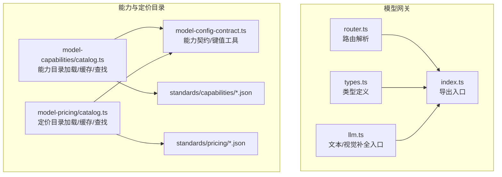
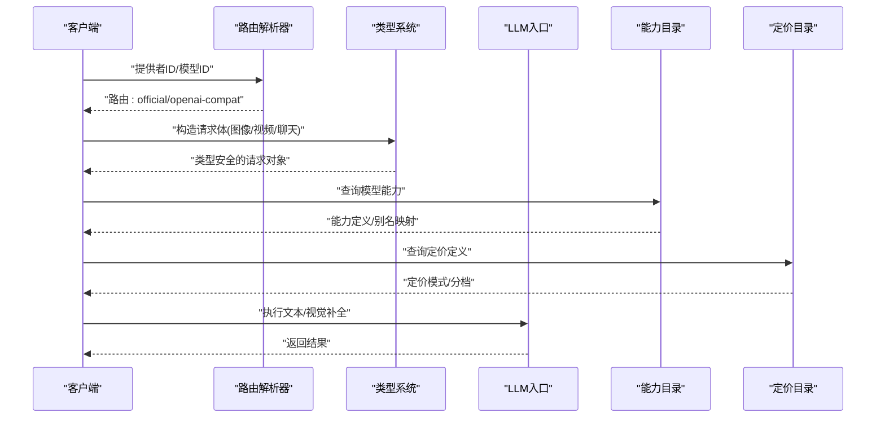
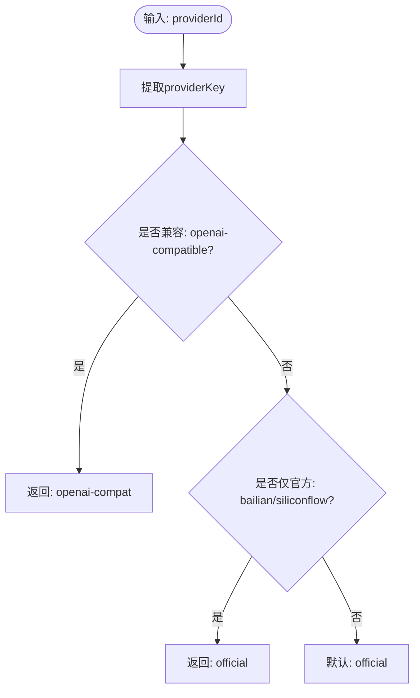
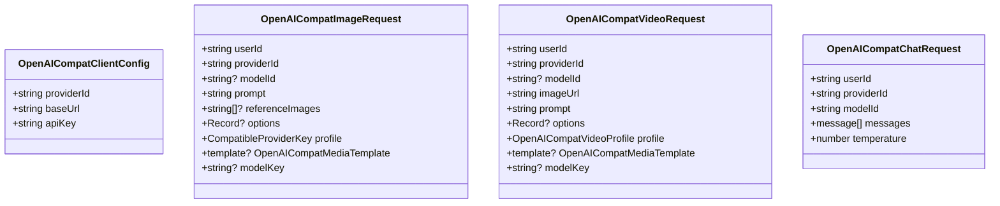
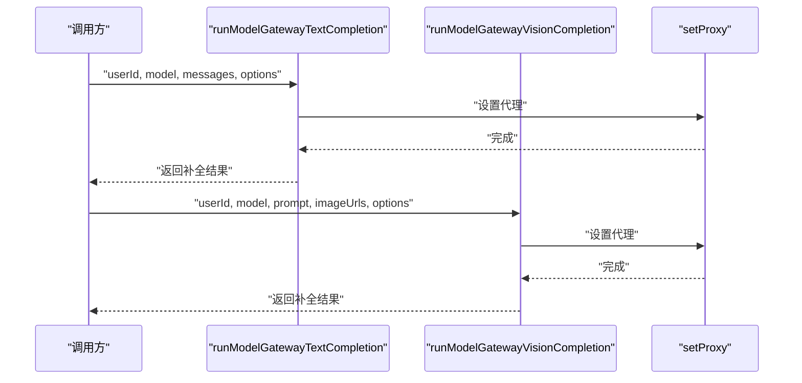
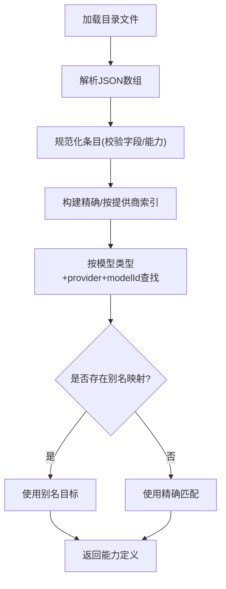
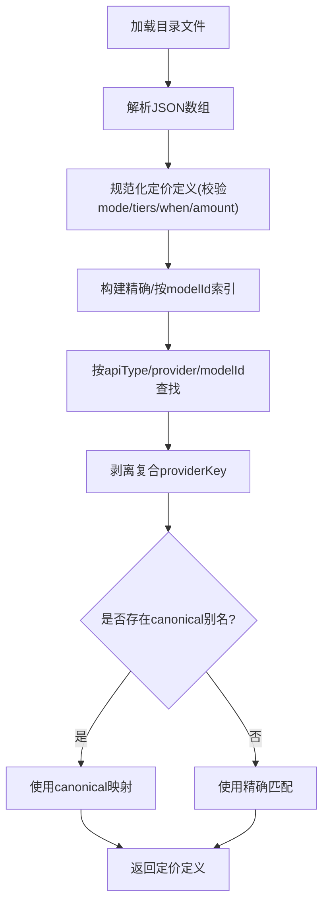
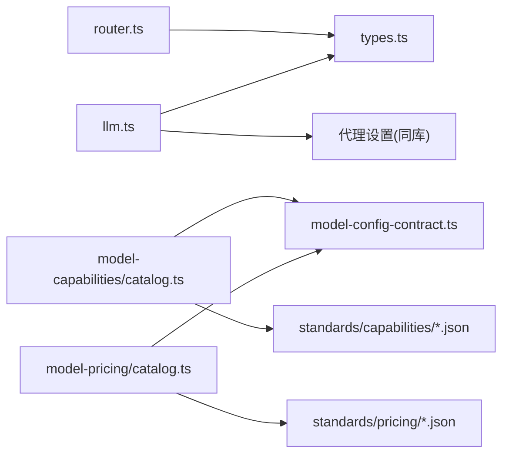

# 模型网关

<cite>
**本文引用的文件**
- [src/lib/model-gateway/router.ts](file://src/lib/model-gateway/router.ts)
- [src/lib/model-gateway/types.ts](file://src/lib/model-gateway/types.ts)
- [src/lib/model-gateway/index.ts](file://src/lib/model-gateway/index.ts)
- [src/lib/model-gateway/llm.ts](file://src/lib/model-gateway/llm.ts)
- [src/lib/model-capabilities/catalog.ts](file://src/lib/model-capabilities/catalog.ts)
- [src/lib/model-pricing/catalog.ts](file://src/lib/model-pricing/catalog.ts)
- [src/lib/model-config-contract.ts](file://src/lib/model-config-contract.ts)
- [standards/capabilities/image-video.catalog.json](file://standards/capabilities/image-video.catalog.json)
- [standards/pricing/image-video.pricing.json](file://standards/pricing/image-video.pricing.json)
</cite>

## 目录
1. [简介](#简介)
2. [项目结构](#项目结构)
3. [核心组件](#核心组件)
4. [架构总览](#架构总览)
5. [详细组件分析](#详细组件分析)
6. [依赖关系分析](#依赖关系分析)
7. [性能考量](#性能考量)
8. [故障排查指南](#故障排查指南)
9. [结论](#结论)
10. [附录](#附录)

## 简介
本技术文档面向Waoowaoo的“模型网关”系统，聚焦以下目标：
- 请求路由：根据提供商类型与兼容性，选择官方或OpenAI兼容路径
- 负载均衡与流量控制：通过统一路由与能力/定价目录实现能力匹配与费用估算
- 错误处理：基于标准化能力契约与目录校验，提前发现配置问题
- 高可用设计：通过能力与定价目录的别名映射与缓存，提升稳定性与可维护性
- 配置管理、监控指标与性能优化：以标准目录驱动的可观察性与可扩展性
- 扩展与自定义：支持新增提供商别名、能力与定价目录项
- 审计日志：建议在接入层记录路由决策与能力匹配结果（概念性指导）

## 项目结构
模型网关位于src/lib/model-gateway，围绕“路由解析、类型定义、LLM入口”展开；能力与定价目录分别位于standards目录，供catalog模块加载与缓存。

图表来源
- [src/lib/model-gateway/router.ts:1-22](file://src/lib/model-gateway/router.ts#L1-L22)
- [src/lib/model-gateway/types.ts:1-46](file://src/lib/model-gateway/types.ts#L1-L46)
- [src/lib/model-gateway/index.ts:1-21](file://src/lib/model-gateway/index.ts#L1-L21)
- [src/lib/model-gateway/llm.ts:1-40](file://src/lib/model-gateway/llm.ts#L1-L40)
- [src/lib/model-capabilities/catalog.ts:1-224](file://src/lib/model-capabilities/catalog.ts#L1-L224)
- [src/lib/model-pricing/catalog.ts:1-268](file://src/lib/model-pricing/catalog.ts#L1-L268)
- [src/lib/model-config-contract.ts:1-528](file://src/lib/model-config-contract.ts#L1-L528)

章节来源
- [src/lib/model-gateway/index.ts:1-21](file://src/lib/model-gateway/index.ts#L1-L21)
- [src/lib/model-capabilities/catalog.ts:1-224](file://src/lib/model-capabilities/catalog.ts#L1-L224)
- [src/lib/model-pricing/catalog.ts:1-268](file://src/lib/model-pricing/catalog.ts#L1-L268)

## 核心组件
- 路由解析器：根据提供商标识判断是否兼容OpenAI协议，决定走官方还是兼容路径
- 类型系统：定义OpenAI兼容图像/视频/聊天请求与客户端配置
- LLM入口：封装文本与视觉补全调用，统一代理设置
- 能力目录：加载、缓存、查找模型能力，并支持提供商别名映射
- 定价目录：加载、缓存、查找定价定义（平面/按能力分档），支持提供商别名映射
- 能力契约：统一模型类型、字段与校验规则，保障目录数据一致性

章节来源
- [src/lib/model-gateway/router.ts:1-22](file://src/lib/model-gateway/router.ts#L1-L22)
- [src/lib/model-gateway/types.ts:1-46](file://src/lib/model-gateway/types.ts#L1-L46)
- [src/lib/model-gateway/llm.ts:1-40](file://src/lib/model-gateway/llm.ts#L1-L40)
- [src/lib/model-capabilities/catalog.ts:1-224](file://src/lib/model-capabilities/catalog.ts#L1-L224)
- [src/lib/model-pricing/catalog.ts:1-268](file://src/lib/model-pricing/catalog.ts#L1-L268)
- [src/lib/model-config-contract.ts:1-528](file://src/lib/model-config-contract.ts#L1-L528)

## 架构总览
模型网关通过“路由解析 + 能力/定价目录 + 统一入口”的方式，完成从请求到执行的闭环。路由解析决定调用链路，能力目录用于能力匹配与参数约束，定价目录用于成本估算与策略落地，LLM入口提供统一的文本/视觉补全调用接口。

图表来源
- [src/lib/model-gateway/router.ts:17-21](file://src/lib/model-gateway/router.ts#L17-L21)
- [src/lib/model-gateway/types.ts:15-45](file://src/lib/model-gateway/types.ts#L15-L45)
- [src/lib/model-gateway/llm.ts:8-39](file://src/lib/model-gateway/llm.ts#L8-L39)
- [src/lib/model-capabilities/catalog.ts:169-211](file://src/lib/model-capabilities/catalog.ts#L169-L211)
- [src/lib/model-pricing/catalog.ts:226-254](file://src/lib/model-pricing/catalog.ts#L226-L254)

## 详细组件分析

### 路由解析器
职责
- 判断提供商是否为兼容OpenAI协议的类型
- 将提供商映射到官方或OpenAI兼容路由
- 提供兼容性判定函数与路由解析函数

图表来源
- [src/lib/model-gateway/router.ts:4-21](file://src/lib/model-gateway/router.ts#L4-L21)

章节来源
- [src/lib/model-gateway/router.ts:1-22](file://src/lib/model-gateway/router.ts#L1-L22)

### 类型系统
职责
- 定义OpenAI兼容图像/视频/聊天请求体
- 定义客户端配置与画像类型
- 作为跨模块的契约，确保请求体结构一致

图表来源
- [src/lib/model-gateway/types.ts:9-45](file://src/lib/model-gateway/types.ts#L9-L45)

章节来源
- [src/lib/model-gateway/types.ts:1-46](file://src/lib/model-gateway/types.ts#L1-L46)

### LLM入口
职责
- 文本补全与视觉补全的统一封装
- 在调用前设置代理，保证网络访问一致性

图表来源
- [src/lib/model-gateway/llm.ts:8-39](file://src/lib/model-gateway/llm.ts#L8-L39)

章节来源
- [src/lib/model-gateway/llm.ts:1-40](file://src/lib/model-gateway/llm.ts#L1-L40)

### 能力目录
职责
- 加载标准目录下的JSON文件，构建缓存
- 支持精确匹配与提供商别名映射
- 提供能力查询与克隆，避免外部修改影响缓存

图表来源
- [src/lib/model-capabilities/catalog.ts:129-151](file://src/lib/model-capabilities/catalog.ts#L129-L151)
- [src/lib/model-capabilities/catalog.ts:169-211](file://src/lib/model-capabilities/catalog.ts#L169-L211)

章节来源
- [src/lib/model-capabilities/catalog.ts:1-224](file://src/lib/model-capabilities/catalog.ts#L1-L224)
- [standards/capabilities/image-video.catalog.json](file://standards/capabilities/image-video.catalog.json)

### 定价目录
职责
- 加载标准目录下的JSON文件，构建缓存
- 支持平面计费与按能力分档两种模式
- 支持提供商别名映射与按modelId聚合

图表来源
- [src/lib/model-pricing/catalog.ts:184-211](file://src/lib/model-pricing/catalog.ts#L184-L211)
- [src/lib/model-pricing/catalog.ts:226-254](file://src/lib/model-pricing/catalog.ts#L226-L254)

章节来源
- [src/lib/model-pricing/catalog.ts:1-268](file://src/lib/model-pricing/catalog.ts#L1-L268)
- [standards/pricing/image-video.pricing.json](file://standards/pricing/image-video.pricing.json)

### 能力契约与键值工具
职责
- 统一模型类型与能力命名空间
- 校验能力字段合法性与取值范围
- 提供模型键值组合与解析工具

章节来源
- [src/lib/model-config-contract.ts:1-528](file://src/lib/model-config-contract.ts#L1-L528)

## 依赖关系分析
- 路由解析依赖提供商键提取逻辑
- 类型系统被路由与LLM入口共同使用
- LLM入口依赖统一的代理设置与LLM客户端
- 能力/定价目录依赖能力契约进行数据校验
- 目录模块依赖标准JSON文件，提供缓存与别名映射

图表来源
- [src/lib/model-gateway/router.ts:1-22](file://src/lib/model-gateway/router.ts#L1-L22)
- [src/lib/model-gateway/types.ts:1-46](file://src/lib/model-gateway/types.ts#L1-L46)
- [src/lib/model-gateway/llm.ts:1-40](file://src/lib/model-gateway/llm.ts#L1-L40)
- [src/lib/model-capabilities/catalog.ts:1-224](file://src/lib/model-capabilities/catalog.ts#L1-L224)
- [src/lib/model-pricing/catalog.ts:1-268](file://src/lib/model-pricing/catalog.ts#L1-L268)
- [src/lib/model-config-contract.ts:1-528](file://src/lib/model-config-contract.ts#L1-L528)

## 性能考量
- 目录加载与缓存
  - 能力与定价目录采用内存缓存，避免重复IO
  - 目录签名基于文件时间戳与大小，变更时重建缓存
- 查找效率
  - 精确键与按提供商键建立索引，查找复杂度近似O(1)
- 数据校验
  - 规范化阶段一次性校验，减少运行期开销
- 路由决策
  - 基于Set与常量映射，路由解析为O(1)

章节来源
- [src/lib/model-capabilities/catalog.ts:120-151](file://src/lib/model-capabilities/catalog.ts#L120-L151)
- [src/lib/model-pricing/catalog.ts:184-211](file://src/lib/model-pricing/catalog.ts#L184-L211)
- [src/lib/model-gateway/router.ts:4-21](file://src/lib/model-gateway/router.ts#L4-L21)

## 故障排查指南
- 能力目录缺失或格式错误
  - 现象：启动时报错提示目录为空或条目格式不合法
  - 排查：检查standards/capabilities目录下JSON文件格式与字段
  - 参考定位：目录加载与校验逻辑
- 定价目录缺失或格式错误
  - 现象：启动时报错提示目录为空或定价定义不合法
  - 排查：检查standards/pricing目录下JSON文件格式与字段
  - 参考定位：定价目录加载与校验逻辑
- 能力/定价查找失败
  - 现象：找不到对应模型的能力或定价
  - 排查：确认模型类型、provider、modelId是否正确；检查别名映射
  - 参考定位：查找与别名映射逻辑
- 路由解析异常
  - 现象：未命中兼容或官方路径
  - 排查：确认提供商键是否在白名单中
  - 参考定位：路由解析逻辑

章节来源
- [src/lib/model-capabilities/catalog.ts:130-151](file://src/lib/model-capabilities/catalog.ts#L130-L151)
- [src/lib/model-pricing/catalog.ts:184-211](file://src/lib/model-pricing/catalog.ts#L184-L211)
- [src/lib/model-capabilities/catalog.ts:169-211](file://src/lib/model-capabilities/catalog.ts#L169-L211)
- [src/lib/model-pricing/catalog.ts:226-254](file://src/lib/model-pricing/catalog.ts#L226-L254)
- [src/lib/model-gateway/router.ts:17-21](file://src/lib/model-gateway/router.ts#L17-L21)

## 结论
模型网关通过“路由解析 + 能力/定价目录 + 统一入口”的设计，在保持低耦合的同时实现了可扩展、可维护与可观察的模型调用体系。能力与定价目录的标准化与缓存机制，为高可用与性能提供了坚实基础；通过提供商别名映射，进一步增强了生态兼容性与业务弹性。

## 附录

### 配置管理与扩展指南
- 新增提供商别名
  - 在能力目录与定价目录中添加别名映射，确保所有调用点受益
  - 参考位置：能力目录与定价目录中的别名映射表
- 新增能力目录项
  - 在standards/capabilities目录新增JSON文件，遵循能力契约
  - 参考位置：能力目录加载与校验逻辑
- 新增定价目录项
  - 在standards/pricing目录新增JSON文件，支持平面或分档模式
  - 参考位置：定价目录加载与校验逻辑
- 自定义路由规则
  - 在路由解析器中扩展提供商白名单与路由策略
  - 参考位置：路由解析逻辑

章节来源
- [src/lib/model-capabilities/catalog.ts:165-167](file://src/lib/model-capabilities/catalog.ts#L165-L167)
- [src/lib/model-pricing/catalog.ts:222-224](file://src/lib/model-pricing/catalog.ts#L222-L224)
- [src/lib/model-capabilities/catalog.ts:1-224](file://src/lib/model-capabilities/catalog.ts#L1-L224)
- [src/lib/model-pricing/catalog.ts:1-268](file://src/lib/model-pricing/catalog.ts#L1-L268)
- [src/lib/model-gateway/router.ts:4-10](file://src/lib/model-gateway/router.ts#L4-L10)

### 模型能力匹配算法与价格计算机制
- 能力匹配
  - 使用composeModelKey生成精确键，优先精确匹配；否则按提供商键回退；最后尝试别名映射
  - 返回能力定义副本，避免污染缓存
- 价格计算
  - 平面计费：直接使用flatAmount
  - 能力分档：遍历tiers，按when条件匹配后取对应amount
  - 支持按providerKey与canonical别名回退

章节来源
- [src/lib/model-capabilities/catalog.ts:169-211](file://src/lib/model-capabilities/catalog.ts#L169-L211)
- [src/lib/model-pricing/catalog.ts:226-254](file://src/lib/model-pricing/catalog.ts#L226-L254)
- [src/lib/model-config-contract.ts:444-465](file://src/lib/model-config-contract.ts#L444-L465)

### 资源调度策略
- 基于路由解析的分流策略：将兼容OpenAI协议的提供商导向openai-compat路径，其他提供商导向official路径
- 基于能力目录的资源选择：优先满足能力约束的模型，结合别名映射扩大候选集
- 基于定价目录的成本控制：在分档模式下，依据when条件选择最优分档，实现成本可控

章节来源
- [src/lib/model-gateway/router.ts:17-21](file://src/lib/model-gateway/router.ts#L17-L21)
- [src/lib/model-capabilities/catalog.ts:169-211](file://src/lib/model-capabilities/catalog.ts#L169-L211)
- [src/lib/model-pricing/catalog.ts:226-254](file://src/lib/model-pricing/catalog.ts#L226-L254)

### 高可用性设计
- 故障检测
  - 通过目录加载与校验在启动期暴露配置问题
- 自动切换
  - 别名映射与回退键确保在主键缺失时仍可找到能力/定价定义
- 降级策略
  - 当某提供商不可用时，可通过路由解析切换至其他提供商或兼容路径

章节来源
- [src/lib/model-capabilities/catalog.ts:197-208](file://src/lib/model-capabilities/catalog.ts#L197-L208)
- [src/lib/model-pricing/catalog.ts:237-251](file://src/lib/model-pricing/catalog.ts#L237-L251)
- [src/lib/model-gateway/router.ts:17-21](file://src/lib/model-gateway/router.ts#L17-L21)

### 监控指标与性能优化
- 监控指标建议
  - 目录加载耗时、缓存命中率、查找耗时、路由命中分布
- 性能优化建议
  - 合理拆分目录文件，避免单文件过大
  - 在高频场景下复用已解析的模型键与能力定义

章节来源
- [src/lib/model-capabilities/catalog.ts:120-151](file://src/lib/model-capabilities/catalog.ts#L120-L151)
- [src/lib/model-pricing/catalog.ts:184-211](file://src/lib/model-pricing/catalog.ts#L184-L211)

### 审计日志实现指南（概念性）
- 记录内容
  - 路由决策、能力匹配结果、定价选择、异常与回退路径
- 实现要点
  - 在路由解析与目录查找处埋点
  - 保证日志结构化与可检索

[本节为概念性指导，无需代码来源]