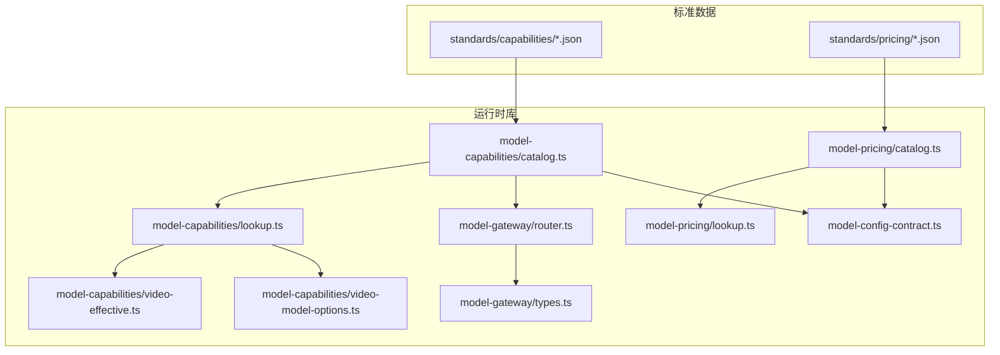
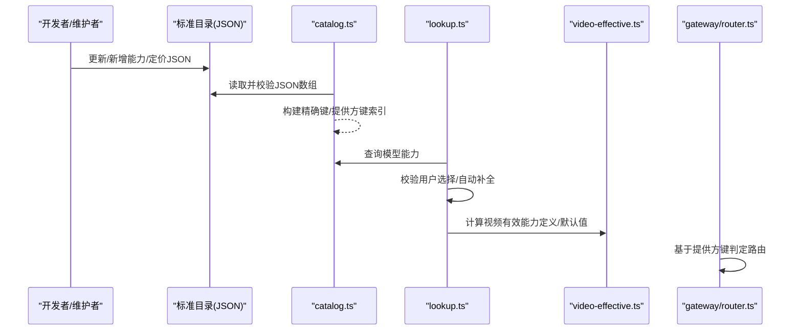
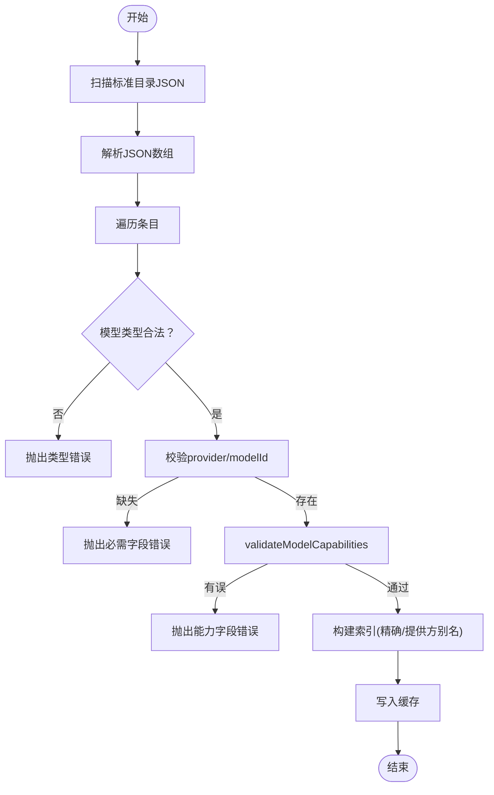
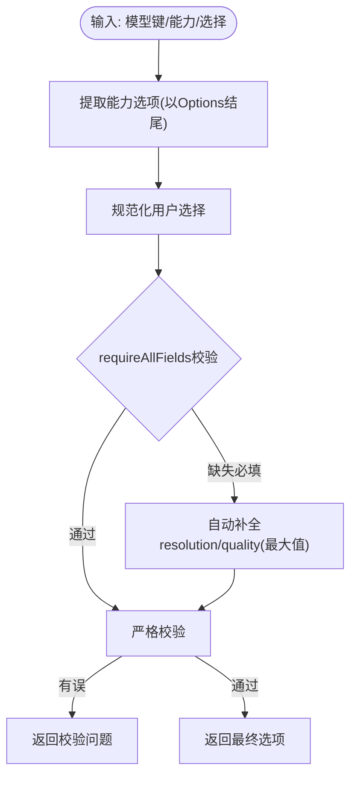
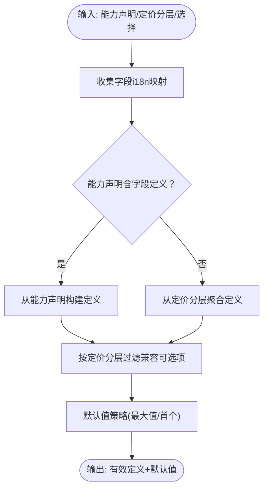
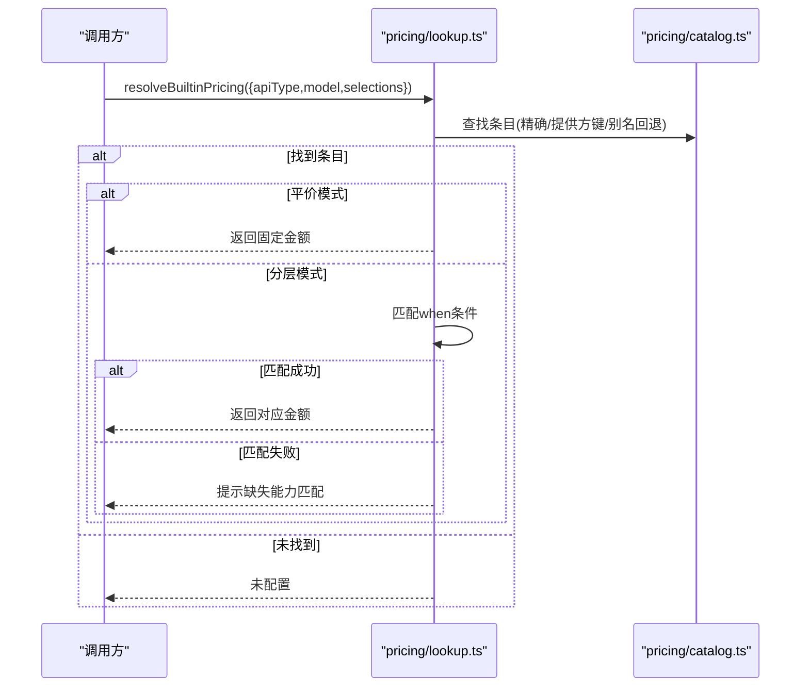
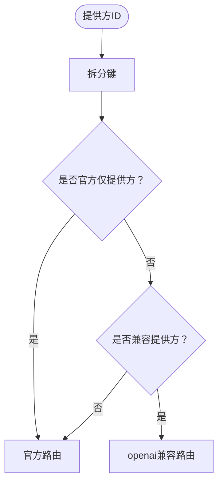
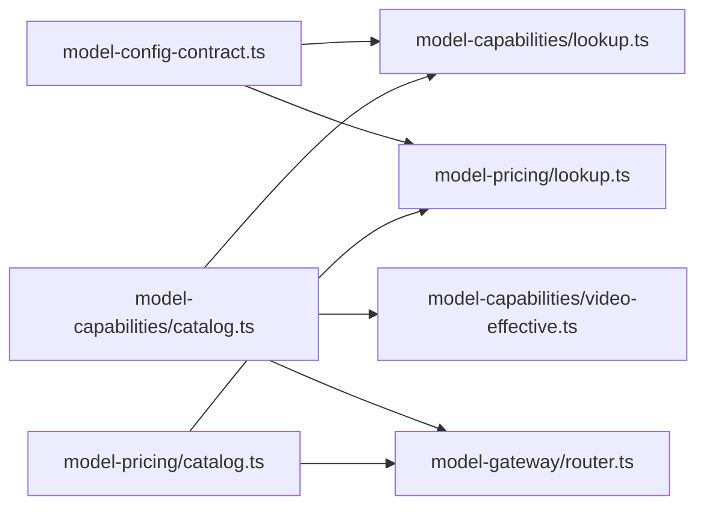

# 模型能力管理

<cite>
**本文引用的文件**
- [catalog.example.json](file://standards/capabilities/catalog.example.json)
- [image-video.catalog.json](file://standards/capabilities/image-video.catalog.json)
- [catalog.ts](file://src/lib/model-capabilities/catalog.ts)
- [lookup.ts](file://src/lib/model-capabilities/lookup.ts)
- [video-effective.ts](file://src/lib/model-capabilities/video-effective.ts)
- [video-model-options.ts](file://src/lib/model-capabilities/video-model-options.ts)
- [router.ts](file://src/lib/model-gateway/router.ts)
- [types.ts](file://src/lib/model-gateway/types.ts)
- [catalog.ts](file://src/lib/model-pricing/catalog.ts)
- [lookup.ts](file://src/lib/model-pricing/lookup.ts)
- [version.ts](file://src/lib/model-pricing/version.ts)
- [model-config-contract.ts](file://src/lib/model-config-contract.ts)
</cite>

## 目录
1. [简介](#简介)
2. [项目结构](#项目结构)
3. [核心组件](#核心组件)
4. [架构总览](#架构总览)
5. [详细组件分析](#详细组件分析)
6. [依赖关系分析](#依赖关系分析)
7. [性能考量](#性能考量)
8. [故障排查指南](#故障排查指南)
9. [结论](#结论)
10. [附录](#附录)

## 简介
本技术指南面向Waoowaoo的“模型能力管理”子系统，围绕以下目标展开：  
- 能力声明的标准格式与验证机制（图像生成、视频生成、语音合成、文本处理等）。  
- 能力目录的维护与更新流程（自动发现、手动配置、版本管理）。  
- 能力匹配算法（优先级排序、资源评估、负载分配）与UI侧有效能力推导。  
- 能力缓存策略、实时更新与一致性保障。  
- 能力扩展、自定义能力与兼容性处理的开发指南。

## 项目结构
本子系统由“能力目录”“定价目录”“能力解析与匹配”“网关路由”四部分协同组成，核心代码位于src/lib下，标准数据位于standards目录。

图示来源
- [catalog.ts:1-224](file://src/lib/model-capabilities/catalog.ts#L1-L224)
- [lookup.ts:1-374](file://src/lib/model-capabilities/lookup.ts#L1-L374)
- [video-effective.ts:1-265](file://src/lib/model-capabilities/video-effective.ts#L1-L265)
- [video-model-options.ts:1-26](file://src/lib/model-capabilities/video-model-options.ts#L1-L26)
- [catalog.ts:1-268](file://src/lib/model-pricing/catalog.ts#L1-L268)
- [lookup.ts:1-143](file://src/lib/model-pricing/lookup.ts#L1-L143)
- [router.ts:1-22](file://src/lib/model-gateway/router.ts#L1-L22)
- [types.ts:1-46](file://src/lib/model-gateway/types.ts#L1-L46)
- [model-config-contract.ts](file://src/lib/model-config-contract.ts)

章节来源
- [catalog.ts:1-224](file://src/lib/model-capabilities/catalog.ts#L1-L224)
- [catalog.ts:1-268](file://src/lib/model-pricing/catalog.ts#L1-L268)

## 核心组件
- 能力目录加载与缓存：从标准目录读取JSON，构建精确键与按提供方别名的索引，支持签名缓存与重复项检测。  
- 能力解析与校验：根据模型类型与能力选项集合，对用户选择进行合法性校验与自动补全。  
- 视频能力有效集推导：结合能力声明与定价分层，计算UI可用字段、可选项与默认值。  
- 定价目录与解析：支持平价与按能力分层两种模式，按能力选择匹配计费层级。  
- 网关路由：基于提供方键识别官方/兼容路由，支撑统一调用路径。

章节来源
- [catalog.ts:1-224](file://src/lib/model-capabilities/catalog.ts#L1-L224)
- [lookup.ts:1-374](file://src/lib/model-capabilities/lookup.ts#L1-L374)
- [video-effective.ts:1-265](file://src/lib/model-capabilities/video-effective.ts#L1-L265)
- [catalog.ts:1-268](file://src/lib/model-pricing/catalog.ts#L1-L268)
- [lookup.ts:1-143](file://src/lib/model-pricing/lookup.ts#L1-L143)
- [router.ts:1-22](file://src/lib/model-gateway/router.ts#L1-L22)

## 架构总览
下面以“能力声明与解析”的端到端流程为例，展示从标准目录到运行时使用的完整链路。

图示来源
- [catalog.ts:129-152](file://src/lib/model-capabilities/catalog.ts#L129-L152)
- [lookup.ts:106-164](file://src/lib/model-capabilities/lookup.ts#L106-L164)
- [video-effective.ts:163-181](file://src/lib/model-capabilities/video-effective.ts#L163-L181)
- [router.ts:17-21](file://src/lib/model-gateway/router.ts#L17-L21)

## 详细组件分析

### 能力目录与验证（model-capabilities）
- 标准格式要点
  - 每个条目包含模型类型、提供方标识、模型ID与可选的能力命名空间对象。  
  - 能力命名空间按模型类型划分（如image/video/llm等），字段以“Options”结尾表示可选枚举。  
  - 支持i18n元信息（标签键、单位键、选项标签键映射）。  
- 加载与缓存
  - 通过目录扫描与文件签名缓存避免重复解析。  
  - 构建“精确键”与“提供方键”索引，支持别名回退（如gemini-compatible → google）。  
- 重复与错误检测
  - 精确键冲突即报错；非数组或非对象结构报错；能力字段校验失败逐项抛出首个问题。  

图示来源
- [catalog.ts:53-86](file://src/lib/model-capabilities/catalog.ts#L53-L86)
- [catalog.ts:88-110](file://src/lib/model-capabilities/catalog.ts#L88-L110)
- [catalog.ts:129-152](file://src/lib/model-capabilities/catalog.ts#L129-L152)

章节来源
- [catalog.example.json:1-50](file://standards/capabilities/catalog.example.json#L1-L50)
- [image-video.catalog.json:1-120](file://standards/capabilities/image-video.catalog.json#L1-L120)
- [catalog.ts:1-224](file://src/lib/model-capabilities/catalog.ts#L1-L224)

### 能力选择解析与校验（model-capabilities/lookup）
- 能力选项提取
  - 从能力命名空间中识别以“Options”结尾的字段，作为可配置项。  
- 选择校验
  - 对每个模型键，解析其上下文（类型+能力），对用户输入进行字段存在性、值域合法性、必填项检查。  
- 自动补全策略（V7）
  - 当某模型具备对应Options但用户未显式设置时，自动填充默认值：  
    - 图像/视频resolution/quality：默认采用最大值（提升输出质量）。  
  - 补全后再次严格校验，确保最终结果合法。  

图示来源
- [lookup.ts:48-72](file://src/lib/model-capabilities/lookup.ts#L48-L72)
- [lookup.ts:106-164](file://src/lib/model-capabilities/lookup.ts#L106-L164)
- [lookup.ts:249-353](file://src/lib/model-capabilities/lookup.ts#L249-L353)

章节来源
- [lookup.ts:1-374](file://src/lib/model-capabilities/lookup.ts#L1-L374)

### 视频能力有效集与默认值（model-capabilities/video-effective）
- 能力定义来源
  - 优先从能力声明中提取字段与可选项；若无声明则回退到定价分层的when条件聚合。  
- i18n映射
  - 解析字段标签、单位与选项标签映射，供UI展示。  
- 默认值与兼容性筛选
  - 对每个字段，基于当前已选值与定价分层过滤出“兼容可选项”。  
  - 默认值策略：resolution/duration默认选最大值，其他字段默认选首个可选项。  
  - 支持固定字段优先（pin）顺序，便于UI布局优化。  

图示来源
- [video-effective.ts:55-97](file://src/lib/model-capabilities/video-effective.ts#L55-L97)
- [video-effective.ts:163-181](file://src/lib/model-capabilities/video-effective.ts#L163-L181)
- [video-effective.ts:183-236](file://src/lib/model-capabilities/video-effective.ts#L183-L236)

章节来源
- [video-effective.ts:1-265](file://src/lib/model-capabilities/video-effective.ts#L1-L265)

### 视频模型能力选项工具（model-capabilities/video-model-options）
- 生成模式选项读取与校验。  
- firstlastframe能力判断与“仅首尾帧模型”识别。  
- 过滤掉仅支持首尾帧的模型，便于UI/流程屏蔽不支持普通模式的模型。  

章节来源
- [video-model-options.ts:1-26](file://src/lib/model-capabilities/video-model-options.ts#L1-L26)

### 定价目录与解析（model-pricing）
- 标准格式要点
  - 条目包含API类型、提供方、模型ID与定价定义（平价或按能力分层）。  
  - 分层模式要求每层when为非空对象，amount为非负有限数。  
- 加载与缓存
  - 构建“精确键”与“按模型ID分组”的索引，支持提供方别名回退。  
- 解析流程
  - 平价模式直接返回固定金额。  
  - 分层模式按when条件匹配，返回对应金额；若无匹配则提示缺失能力匹配。  
  - 支持“模型ID歧义”场景（同一模型ID对应多条目）。  

图示来源
- [lookup.ts:67-97](file://src/lib/model-pricing/lookup.ts#L67-L97)
- [lookup.ts:99-142](file://src/lib/model-pricing/lookup.ts#L99-L142)
- [catalog.ts:226-254](file://src/lib/model-pricing/catalog.ts#L226-L254)

章节来源
- [catalog.ts:1-268](file://src/lib/model-pricing/catalog.ts#L1-L268)
- [lookup.ts:1-143](file://src/lib/model-pricing/lookup.ts#L1-L143)
- [version.ts:1-6](file://src/lib/model-pricing/version.ts#L1-L6)

### 网关路由与兼容性（model-gateway）
- 提供方键识别
  - 将复合提供方ID拆分为键（如“provider:uuid”→“provider”）。  
- 路由判定
  - 官方仅提供方（如bailian、siliconflow）走官方路由。  
  - 兼容提供方（如openai-compatible）走openai兼容路由。  
  - 其他默认官方路由。  

图示来源
- [router.ts:17-21](file://src/lib/model-gateway/router.ts#L17-L21)
- [types.ts:1-46](file://src/lib/model-gateway/types.ts#L1-L46)

章节来源
- [router.ts:1-22](file://src/lib/model-gateway/router.ts#L1-L22)
- [types.ts:1-46](file://src/lib/model-gateway/types.ts#L1-L46)

## 依赖关系分析
- 能力目录与定价目录相互独立，但共享“提供方别名回退”策略，确保跨提供方的一致行为。  
- lookup依赖contract中的能力契约与模型键解析，确保输入合法性与一致性。  
- video-effective同时依赖能力声明与定价分层，形成“能力定义+价格约束”的双重保障。  
- gateway/router依赖api-config提供的提供方键解析，决定下游调用路径。

图示来源
- [lookup.ts:1-374](file://src/lib/model-capabilities/lookup.ts#L1-L374)
- [catalog.ts:1-224](file://src/lib/model-capabilities/catalog.ts#L1-L224)
- [catalog.ts:1-268](file://src/lib/model-pricing/catalog.ts#L1-L268)
- [video-effective.ts:1-265](file://src/lib/model-capabilities/video-effective.ts#L1-L265)
- [router.ts:1-22](file://src/lib/model-gateway/router.ts#L1-L22)
- [model-config-contract.ts](file://src/lib/model-config-contract.ts)

章节来源
- [lookup.ts:1-374](file://src/lib/model-capabilities/lookup.ts#L1-L374)
- [catalog.ts:1-224](file://src/lib/model-capabilities/catalog.ts#L1-L224)
- [catalog.ts:1-268](file://src/lib/model-pricing/catalog.ts#L1-L268)
- [video-effective.ts:1-265](file://src/lib/model-capabilities/video-effective.ts#L1-L265)
- [router.ts:1-22](file://src/lib/model-gateway/router.ts#L1-L22)

## 性能考量
- 目录扫描与JSON解析仅在缓存失效时执行，缓存键基于文件mtime与size组合，避免频繁磁盘IO。  
- 索引构建为O(N)线性扫描，查询为哈希表查找O(1)，整体复杂度低。  
- 自动补全与二次校验仅在用户提交阶段触发，不影响初始化路径。  
- 定价分层匹配采用线性扫描，建议控制单模型分层数量，避免过多when条件导致匹配开销上升。  

## 故障排查指南
- 能力目录错误
  - 缺少JSON文件：抛出“目录缺失”错误。  
  - 非数组或条目非对象：抛出“格式无效”错误。  
  - 模型类型非法、provider/modelId缺失、能力字段校验失败：抛出具体字段与原因。  
  - 精确键重复：抛出“重复键”错误。  
- 能力选择错误
  - 字段不存在、值类型非法、值不在允许范围内、必填字段缺失：返回对应校验问题列表。  
  - 自动补全后仍不合法：返回补全+校验合并的问题。  
- 定价解析错误
  - 未配置：返回“未配置”。  
  - 模型ID歧义：返回候选列表。  
  - 分层模式匹配失败：返回“缺失能力匹配”，附带当前选择。  
- 网关路由错误
  - 提供方键未知：默认走官方路由，需确认提供方注册与别名配置。  

章节来源
- [catalog.ts:133-135](file://src/lib/model-capabilities/catalog.ts#L133-L135)
- [catalog.ts:142-144](file://src/lib/model-capabilities/catalog.ts#L142-L144)
- [catalog.ts:58-76](file://src/lib/model-capabilities/catalog.ts#L58-L76)
- [catalog.ts:97-99](file://src/lib/model-capabilities/catalog.ts#L97-L99)
- [lookup.ts:118-164](file://src/lib/model-capabilities/lookup.ts#L118-L164)
- [lookup.ts:264-267](file://src/lib/model-capabilities/lookup.ts#L264-L267)
- [lookup.ts:78-97](file://src/lib/model-pricing/lookup.ts#L78-L97)
- [lookup.ts:126-134](file://src/lib/model-pricing/lookup.ts#L126-L134)
- [router.ts:17-21](file://src/lib/model-gateway/router.ts#L17-L21)

## 结论
本能力管理体系通过“标准目录+运行时解析+网关路由”的分层设计，实现了能力声明、校验、匹配与调用的闭环。能力与定价双轨并行，既保证了灵活性，又提供了强一致的消费计费依据。配套的缓存与别名回退机制提升了可维护性与扩展性。

## 附录

### 能力声明标准格式速查
- 必填字段
  - modelType：统一模型类型（llm/image/video/audio/lipsync）。  
  - provider：提供方标识（支持“provider:uuid”复合形式）。  
  - modelId：模型ID。  
- 可选字段
  - capabilities：按模型类型划分的能力命名空间。  
  - 能力命名空间内字段以“Options”结尾表示可选枚举集合。  
  - 支持i18n元信息（labelKey、unitKey、optionLabelKeys）。  

章节来源
- [catalog.example.json:1-50](file://standards/capabilities/catalog.example.json#L1-L50)
- [image-video.catalog.json:1-120](file://standards/capabilities/image-video.catalog.json#L1-L120)

### 能力目录维护与更新流程
- 自动发现
  - 在标准目录下新增/修改JSON文件，系统通过目录扫描与签名缓存自动感知变更。  
- 手动配置
  - 通过编辑标准JSON，补充/调整能力选项与i18n元信息。  
- 版本管理
  - 定价目录版本号用于账单溯源，变更时应同步提升版本号。  

章节来源
- [catalog.ts:129-152](file://src/lib/model-capabilities/catalog.ts#L129-L152)
- [version.ts:1-6](file://src/lib/model-pricing/version.ts#L1-L6)

### 能力匹配算法与UI默认值
- 字段优先级与默认值
  - resolution/duration默认选最大值；其他字段默认选首个可选项。  
  - 支持固定字段优先（pin）顺序，便于UI布局优化。  
- 兼容性筛选
  - 基于定价分层when条件过滤可选项，确保所选组合在当前定价策略下可用。  

章节来源
- [video-effective.ts:226-231](file://src/lib/model-capabilities/video-effective.ts#L226-L231)
- [video-effective.ts:133-146](file://src/lib/model-capabilities/video-effective.ts#L133-L146)

### 能力扩展与兼容性处理
- 扩展新提供方
  - 在能力/定价目录中新增条目；必要时在网关路由中增加提供方键识别规则。  
- 别名回退
  - 通过提供方别名（如gemini-compatible → google）复用能力/定价定义。  
- 自定义能力
  - 对于未内置能力的模型，运行时直接透传用户选择，不做强制校验，但需自行保证下游兼容性。  

章节来源
- [catalog.ts:165-167](file://src/lib/model-capabilities/catalog.ts#L165-L167)
- [catalog.ts:197-208](file://src/lib/model-capabilities/catalog.ts#L197-L208)
- [catalog.ts:222-224](file://src/lib/model-pricing/catalog.ts#L222-L224)
- [lookup.ts:264-267](file://src/lib/model-capabilities/lookup.ts#L264-L267)
- [router.ts:4-10](file://src/lib/model-gateway/router.ts#L4-L10)