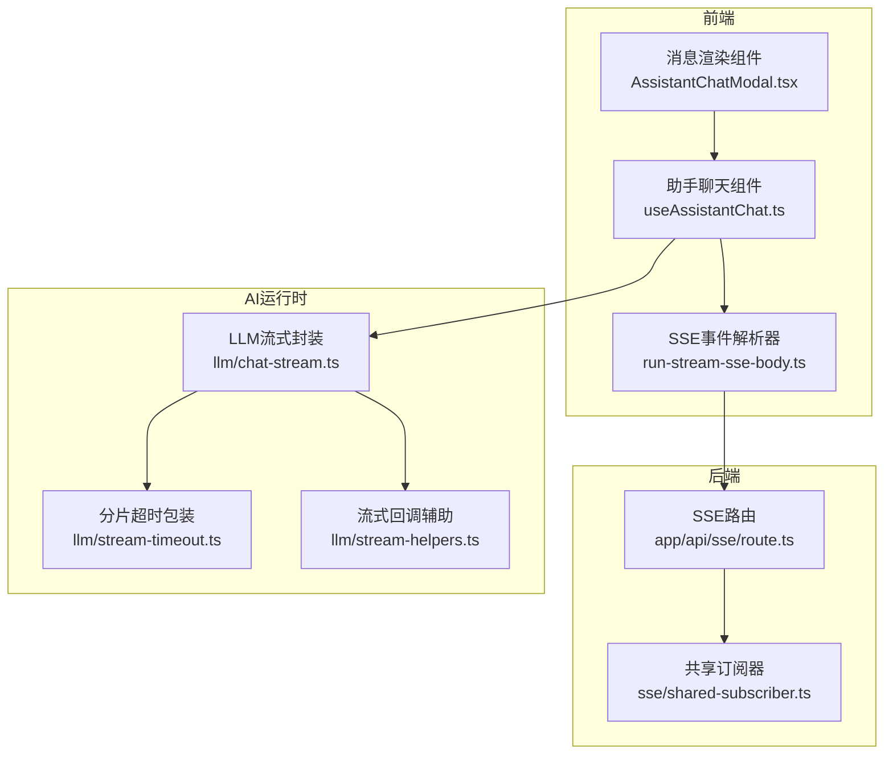
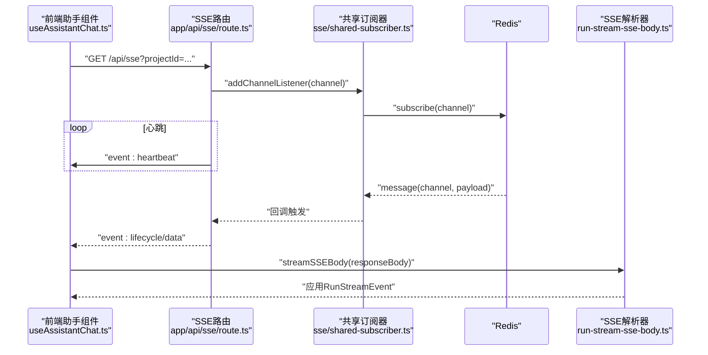
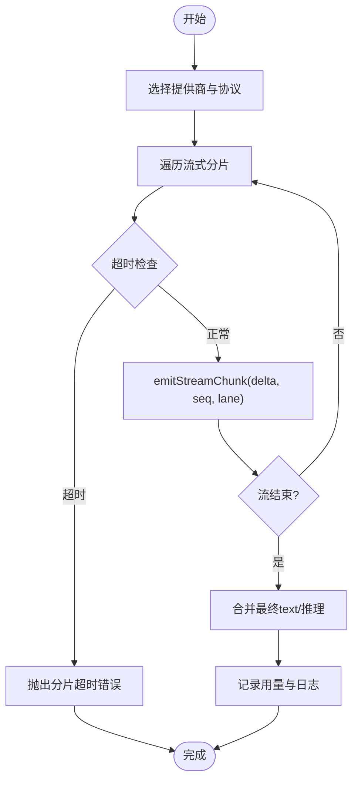
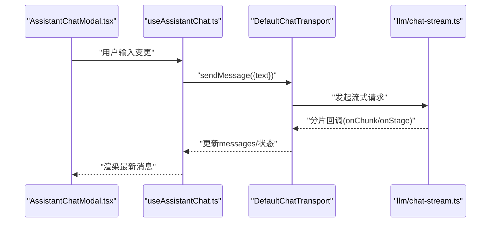
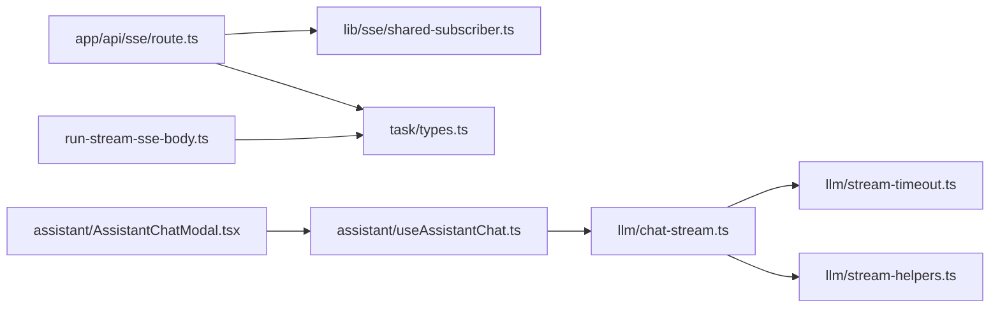

# 流式响应支持

<cite>
**本文引用的文件**
- [src/app/api/sse/route.ts](file://src/app/api/sse/route.ts)
- [src/lib/sse/shared-subscriber.ts](file://src/lib/sse/shared-subscriber.ts)
- [src/lib/query/hooks/run-stream/run-stream-sse-body.ts](file://src/lib/query/hooks/run-stream/run-stream-sse-body.ts)
- [src/lib/llm/chat-stream.ts](file://src/lib/llm/chat-stream.ts)
- [src/lib/llm/stream-timeout.ts](file://src/lib/llm/stream-timeout.ts)
- [src/lib/llm/stream-helpers.ts](file://src/lib/llm/stream-helpers.ts)
- [src/components/assistant/useAssistantChat.ts](file://src/components/assistant/useAssistantChat.ts)
- [src/components/assistant/AssistantChatModal.tsx](file://src/components/assistant/AssistantChatModal.tsx)
- [src/lib/workers/user-concurrency-gate.ts](file://src/lib/workers/user-concurrency-gate.ts)
- [tests/unit/worker/user-concurrency-gate.test.ts](file://tests/unit/worker/user-concurrency-gate.test.ts)
</cite>

## 目录
1. [引言](#引言)
2. [项目结构](#项目结构)
3. [核心组件](#核心组件)
4. [架构总览](#架构总览)
5. [详细组件分析](#详细组件分析)
6. [依赖关系分析](#依赖关系分析)
7. [性能考量](#性能考量)
8. [故障排查指南](#故障排查指南)
9. [结论](#结论)
10. [附录](#附录)

## 引言
本文件面向Waoowaoo的流式响应支持系统，系统性阐述流式AI响应的实现原理与工程化实践，覆盖以下主题：
- WebSocket/SSE连接管理、数据帧处理与缓冲机制
- 超时控制、重连策略与错误恢复
- 流式数据的解析、聚合与前端渲染
- 性能优化（背压控制、内存管理、并发限制）
- 调试工具、监控指标与故障排查
- 不同AI服务的流式协议差异与适配方案

## 项目结构
围绕流式响应的关键目录与文件如下：
- 服务端SSE通道与订阅器：src/app/api/sse/route.ts、src/lib/sse/shared-subscriber.ts
- 前端SSE事件解析与应用：src/lib/query/hooks/run-stream/run-stream-sse-body.ts
- LLM流式对话与分片超时：src/lib/llm/chat-stream.ts、src/lib/llm/stream-timeout.ts、src/lib/llm/stream-helpers.ts
- 助手聊天前端集成：src/components/assistant/useAssistantChat.ts、src/components/assistant/AssistantChatModal.tsx
- 并发门控与资源节流：src/lib/workers/user-concurrency-gate.ts、tests/unit/worker/user-concurrency-gate.test.ts

图表来源
- [src/app/api/sse/route.ts:92-206](file://src/app/api/sse/route.ts#L92-L206)
- [src/lib/sse/shared-subscriber.ts:7-82](file://src/lib/sse/shared-subscriber.ts#L7-L82)
- [src/lib/query/hooks/run-stream/run-stream-sse-body.ts:47-79](file://src/lib/query/hooks/run-stream/run-stream-sse-body.ts#L47-L79)
- [src/lib/llm/chat-stream.ts:64-800](file://src/lib/llm/chat-stream.ts#L64-L800)
- [src/lib/llm/stream-timeout.ts:21-44](file://src/lib/llm/stream-timeout.ts#L21-L44)
- [src/lib/llm/stream-helpers.ts:28-74](file://src/lib/llm/stream-helpers.ts#L28-L74)
- [src/components/assistant/useAssistantChat.ts:128-222](file://src/components/assistant/useAssistantChat.ts#L128-L222)
- [src/components/assistant/AssistantChatModal.tsx:436-446](file://src/components/assistant/AssistantChatModal.tsx#L436-L446)

章节来源
- [src/app/api/sse/route.ts:92-206](file://src/app/api/sse/route.ts#L92-L206)
- [src/lib/sse/shared-subscriber.ts:7-82](file://src/lib/sse/shared-subscriber.ts#L7-L82)
- [src/lib/query/hooks/run-stream/run-stream-sse-body.ts:47-79](file://src/lib/query/hooks/run-stream/run-stream-sse-body.ts#L47-L79)
- [src/lib/llm/chat-stream.ts:64-800](file://src/lib/llm/chat-stream.ts#L64-L800)
- [src/lib/llm/stream-timeout.ts:21-44](file://src/lib/llm/stream-timeout.ts#L21-L44)
- [src/lib/llm/stream-helpers.ts:28-74](file://src/lib/llm/stream-helpers.ts#L28-L74)
- [src/components/assistant/useAssistantChat.ts:128-222](file://src/components/assistant/useAssistantChat.ts#L128-L222)
- [src/components/assistant/AssistantChatModal.tsx:436-446](file://src/components/assistant/AssistantChatModal.tsx#L436-L446)

## 核心组件
- SSE服务端通道与心跳
  - SSE路由负责建立长连接、发送快照或重放事件、周期性心跳、以及通过共享订阅器推送实时事件。
- 共享订阅器
  - 基于Redis的订阅器，按频道维护监听者列表，自动订阅/取消订阅，异常与错误统一上报。
- SSE事件解析与应用
  - 将ReadableStream中的SSE块解析为结构化事件，转换为内部RunStreamEvent并应用到UI。
- LLM流式封装与分片超时
  - 统一接入多提供商（OpenAI兼容、Google、Ark、Bailian、SiliconFlow），对各协议进行流式分片解析，内置分片超时保护。
- 流式回调与分片聚合
  - 将reasoning/text等lane的增量delta分片，按序号seq聚合，支持完成阶段的最终文本/推理合并。
- 助手聊天前端集成
  - 使用@ai-sdk/react的DefaultChatTransport发起流式请求；使用requestAnimationFrame做渲染节流；收集保存模板事件。

章节来源
- [src/app/api/sse/route.ts:92-206](file://src/app/api/sse/route.ts#L92-L206)
- [src/lib/sse/shared-subscriber.ts:7-82](file://src/lib/sse/shared-subscriber.ts#L7-L82)
- [src/lib/query/hooks/run-stream/run-stream-sse-body.ts:47-79](file://src/lib/query/hooks/run-stream/run-stream-sse-body.ts#L47-L79)
- [src/lib/llm/chat-stream.ts:64-800](file://src/lib/llm/chat-stream.ts#L64-L800)
- [src/lib/llm/stream-timeout.ts:21-44](file://src/lib/llm/stream-timeout.ts#L21-L44)
- [src/lib/llm/stream-helpers.ts:28-74](file://src/lib/llm/stream-helpers.ts#L28-L74)
- [src/components/assistant/useAssistantChat.ts:128-222](file://src/components/assistant/useAssistantChat.ts#L128-L222)

## 架构总览
整体采用“前端SSE/LLM流式请求 → 后端SSE通道/共享订阅器 → Redis发布/订阅 → 前端事件解析与渲染”的闭环。

图表来源
- [src/app/api/sse/route.ts:92-206](file://src/app/api/sse/route.ts#L92-L206)
- [src/lib/sse/shared-subscriber.ts:33-67](file://src/lib/sse/shared-subscriber.ts#L33-L67)
- [src/lib/query/hooks/run-stream/run-stream-sse-body.ts:47-79](file://src/lib/query/hooks/run-stream/run-stream-sse-body.ts#L47-L79)

## 详细组件分析

### SSE服务端通道与心跳
- 连接建立与关闭
  - 记录连接/断开日志；AbortSignal监听；定时心跳（15秒）；断开时清理订阅与定时器。
- 事件重放与快照
  - 支持last-event-id重放；否则发送活动任务快照。
- 事件格式化
  - 自动为带数字id的事件添加id行；统一event/data格式。
- 订阅与解码
  - 通过共享订阅器订阅项目频道；收到消息后尝试解析为SSEEvent并编码入队。

章节来源
- [src/app/api/sse/route.ts:92-206](file://src/app/api/sse/route.ts#L92-L206)

### 共享订阅器（Redis订阅/取消订阅）
- 多监听者管理
  - 按频道维护监听者映射；首次监听时订阅，最后一位监听移除时取消订阅。
- 错误处理
  - 监听回调异常与订阅器错误统一上报，避免崩溃。
- 生命周期
  - 提供全局单例获取函数，确保进程内共享。

章节来源
- [src/lib/sse/shared-subscriber.ts:7-82](file://src/lib/sse/shared-subscriber.ts#L7-L82)

### SSE事件解析与应用
- 解析流程
  - 从ReadableStream读取字节，TextDecoder流式解码；以双换行符切分SSE块；解析event与data字段；JSON反序列化；转换为RunStreamEvent并调用回调。
- 数据完整性
  - 缓冲区累积，直到找到完整块再解析，避免半块丢失。

章节来源
- [src/lib/query/hooks/run-stream/run-stream-sse-body.ts:47-79](file://src/lib/query/hooks/run-stream/run-stream-sse-body.ts#L47-L79)

### LLM流式封装与分片超时
- 协议适配
  - OpenAI兼容、Google/Gemini、Ark、Bailian、SiliconFlow分别处理；统一输出text与reasoning增量分片。
- 分片超时
  - 对各提供商流迭代器包裹withStreamChunkTimeout，默认3分钟无分片则抛出超时错误，保证活跃流不会被误判。
- 完成阶段聚合
  - 在流结束后读取最终text/推理文本，补齐缺失增量；记录用量与日志；必要时进行推理参数回退重试。
- 回调与分片
  - 通过emitStreamChunk按序号seq与lane（reasoning/main）分发增量；支持chunked文本分块发送。

图表来源
- [src/lib/llm/chat-stream.ts:489-526](file://src/lib/llm/chat-stream.ts#L489-L526)
- [src/lib/llm/stream-timeout.ts:21-44](file://src/lib/llm/stream-timeout.ts#L21-L44)
- [src/lib/llm/stream-helpers.ts:37-51](file://src/lib/llm/stream-helpers.ts#L37-L51)

章节来源
- [src/lib/llm/chat-stream.ts:64-800](file://src/lib/llm/chat-stream.ts#L64-L800)
- [src/lib/llm/stream-timeout.ts:21-44](file://src/lib/llm/stream-timeout.ts#L21-L44)
- [src/lib/llm/stream-helpers.ts:28-74](file://src/lib/llm/stream-helpers.ts#L28-L74)

### 助手聊天前端集成
- 传输层
  - 使用DefaultChatTransport指向/api/user/assistant/chat，携带assistantId与上下文；useChat驱动状态机与错误。
- 渲染节流
  - pending状态下使用requestAnimationFrame批量更新messages，避免高频重绘。
- 事件去重
  - 收集保存模板事件，基于savedModelKey去重，防止重复触发。
- 发送与清空
  - send前校验启用状态与输入非空；clear时重置状态并取消动画帧。

图表来源
- [src/components/assistant/useAssistantChat.ts:128-222](file://src/components/assistant/useAssistantChat.ts#L128-L222)
- [src/lib/llm/chat-stream.ts:489-526](file://src/lib/llm/chat-stream.ts#L489-L526)
- [src/components/assistant/AssistantChatModal.tsx:436-446](file://src/components/assistant/AssistantChatModal.tsx#L436-L446)

章节来源
- [src/components/assistant/useAssistantChat.ts:128-222](file://src/components/assistant/useAssistantChat.ts#L128-L222)
- [src/components/assistant/AssistantChatModal.tsx:436-446](file://src/components/assistant/AssistantChatModal.tsx#L436-L446)

### 并发限制与背压控制
- 用户级并发门控
  - 以scope+userId为键，维护活跃计数与等待队列；超出限制的任务阻塞等待；释放时优先唤醒等待者。
- 适用场景
  - 图像/视频生成等高资源消耗任务，避免瞬时拥塞。
- 测试验证
  - 单元测试验证相同用户在同一scope下串行执行，限制为1时第二任务等待第一任务完成后执行。

章节来源
- [src/lib/workers/user-concurrency-gate.ts:26-69](file://src/lib/workers/user-concurrency-gate.ts#L26-L69)
- [tests/unit/worker/user-concurrency-gate.test.ts:12-50](file://tests/unit/worker/user-concurrency-gate.test.ts#L12-L50)

## 依赖关系分析
- 组件耦合
  - SSE路由依赖共享订阅器与项目频道；共享订阅器依赖Redis；前端SSE解析器依赖事件格式化；LLM流式封装依赖各提供商SDK与超时包装。
- 外部依赖
  - Redis（ioredis）、@ai-sdk/react、OpenAI客户端、Google GenAI等。
- 循环依赖
  - 未见直接循环；模块间通过接口与回调解耦。

图表来源
- [src/app/api/sse/route.ts:92-206](file://src/app/api/sse/route.ts#L92-L206)
- [src/lib/sse/shared-subscriber.ts:7-82](file://src/lib/sse/shared-subscriber.ts#L7-L82)
- [src/lib/query/hooks/run-stream/run-stream-sse-body.ts:47-79](file://src/lib/query/hooks/run-stream/run-stream-sse-body.ts#L47-L79)
- [src/lib/llm/chat-stream.ts:64-800](file://src/lib/llm/chat-stream.ts#L64-L800)
- [src/lib/llm/stream-timeout.ts:21-44](file://src/lib/llm/stream-timeout.ts#L21-L44)
- [src/lib/llm/stream-helpers.ts:28-74](file://src/lib/llm/stream-helpers.ts#L28-L74)
- [src/components/assistant/useAssistantChat.ts:128-222](file://src/components/assistant/useAssistantChat.ts#L128-L222)
- [src/components/assistant/AssistantChatModal.tsx:436-446](file://src/components/assistant/AssistantChatModal.tsx#L436-L446)

## 性能考量
- 背压控制
  - SSE端通过controller.enqueue与心跳维持稳定速率；前端使用requestAnimationFrame批量更新，降低渲染压力。
- 内存管理
  - SSE解析器采用缓冲区累积与按块处理，避免一次性加载大块数据；LLM分片超时避免长时间挂起导致的内存占用。
- 并发限制
  - 用户级并发门控确保资源可控，避免峰值拥塞；结合任务队列与限速策略进一步削峰。
- 日志与诊断
  - LLM流式封装记录分片类型统计、错误块、finishReason、HTTP状态与头信息，便于定位问题。

章节来源
- [src/lib/query/hooks/run-stream/run-stream-sse-body.ts:47-79](file://src/lib/query/hooks/run-stream/run-stream-sse-body.ts#L47-L79)
- [src/lib/llm/chat-stream.ts:489-710](file://src/lib/llm/chat-stream.ts#L489-L710)
- [src/lib/workers/user-concurrency-gate.ts:26-69](file://src/lib/workers/user-concurrency-gate.ts#L26-L69)

## 故障排查指南
- SSE连接问题
  - 检查last-event-id参数与重放逻辑；确认项目鉴权与频道订阅；观察心跳是否持续；查看断开清理是否执行。
- 流式超时
  - 若出现分片超时错误，检查网络与上游提供商稳定性；适当调整超时阈值；确认流式协议是否正确。
- 文本为空或推理缺失
  - 查看LLM日志中的finishReason、HTTP状态与未知分片样本；必要时进行推理参数回退重试。
- 并发阻塞
  - 使用并发门控接口，确认当前活跃数与等待队列；逐步降低限制以定位瓶颈。
- 前端渲染卡顿
  - 确认pending状态下的批量更新已启用；减少不必要的re-render；检查样式与布局抖动。

章节来源
- [src/app/api/sse/route.ts:113-198](file://src/app/api/sse/route.ts#L113-L198)
- [src/lib/llm/stream-timeout.ts:14-19](file://src/lib/llm/stream-timeout.ts#L14-L19)
- [src/lib/llm/chat-stream.ts:668-710](file://src/lib/llm/chat-stream.ts#L668-L710)
- [src/lib/workers/user-concurrency-gate.ts:26-69](file://src/lib/workers/user-concurrency-gate.ts#L26-L69)
- [src/components/assistant/useAssistantChat.ts:154-169](file://src/components/assistant/useAssistantChat.ts#L154-L169)

## 结论
Waoowaoo的流式响应体系通过SSE通道与共享订阅器实现低延迟事件推送，结合LLM流式封装与分片超时保护，确保在多提供商协议下的一致体验。前端采用事件解析与渲染节流，配合并发门控与详尽日志，形成从连接、传输、解析到渲染的完整闭环。建议在生产中持续关注心跳与超时策略、日志采样与告警、以及并发门控的动态调优。

## 附录
- 不同AI服务的流式协议差异与适配要点
  - OpenAI兼容：统一走openai-compat路径，区分chat-completions与responses两种模式；部分提供商需禁用推理参数以避免空响应。
  - Google/Gemini：使用generateContentStream，支持thinking level与includeThoughts；流式结束后提取usage并构建完成响应。
  - Ark：自定义流式接口，按reasoning/text两类delta推送；最终结果合并usage与文本。
  - Bailian/SiliconFlow：各自提供流式完成接口，统一抽取reasoning与text增量并上报。
  - 回退策略：当启用推理参数导致空文本时，自动回退至无推理参数请求并再次推送增量。

章节来源
- [src/lib/llm/chat-stream.ts:109-172](file://src/lib/llm/chat-stream.ts#L109-L172)
- [src/lib/llm/chat-stream.ts:174-280](file://src/lib/llm/chat-stream.ts#L174-L280)
- [src/lib/llm/chat-stream.ts:375-434](file://src/lib/llm/chat-stream.ts#L375-L434)
- [src/lib/llm/chat-stream.ts:282-326](file://src/lib/llm/chat-stream.ts#L282-L326)
- [src/lib/llm/chat-stream.ts:328-372](file://src/lib/llm/chat-stream.ts#L328-L372)
- [src/lib/llm/chat-stream.ts:600-665](file://src/lib/llm/chat-stream.ts#L600-L665)