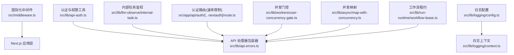
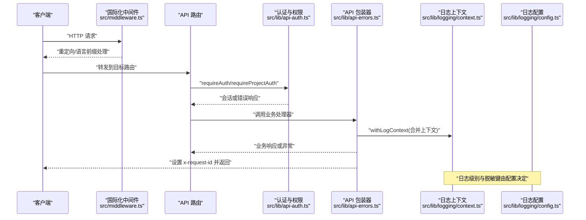
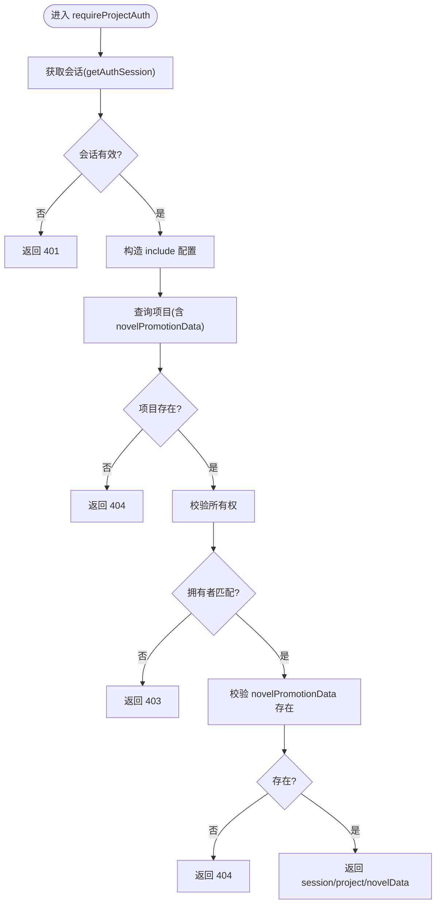
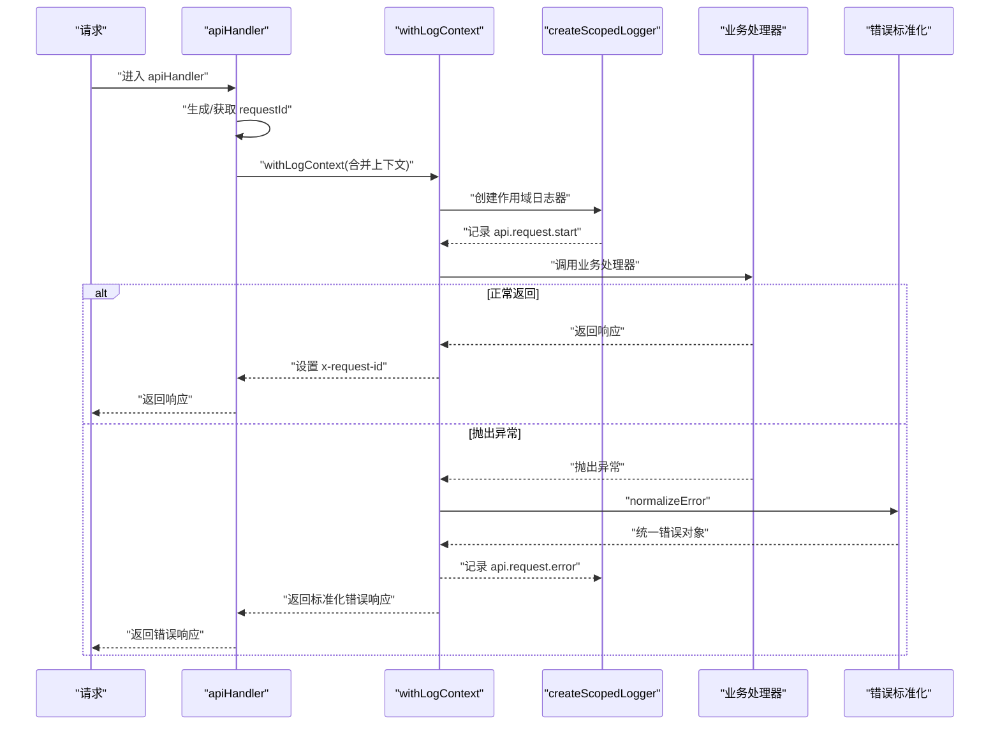
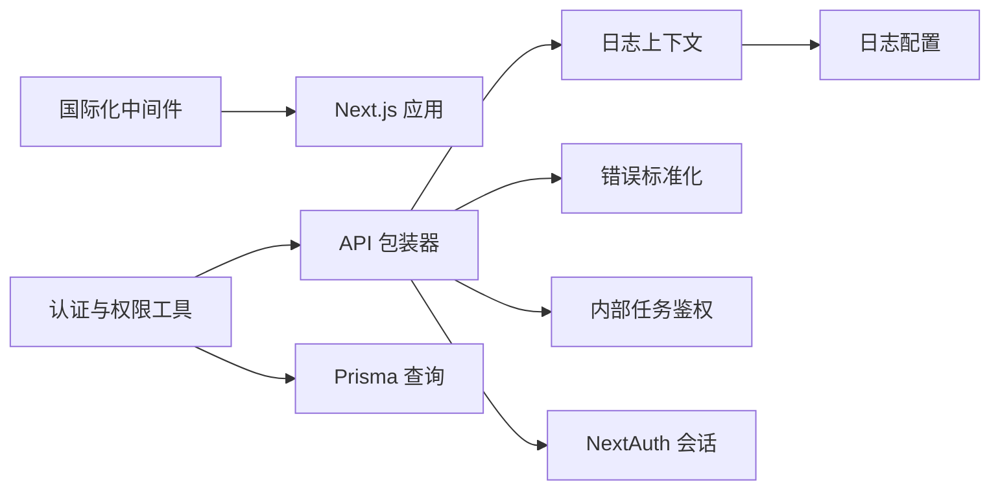

# 中间件系统扩展

<cite>
**本文引用的文件**   
- [src/middleware.ts](file://src/middleware.ts)
- [src/lib/api-auth.ts](file://src/lib/api-auth.ts)
- [src/lib/api-errors.ts](file://src/lib/api-errors.ts)
- [src/lib/logging/config.ts](file://src/lib/logging/config.ts)
- [src/lib/logging/context.ts](file://src/lib/logging/context.ts)
- [src/lib/logging/types.ts](file://src/lib/logging/types.ts)
- [src/lib/llm-observe/internal-task.ts](file://src/lib/llm-observe/internal-task.ts)
- [src/app/api/auth/[...nextauth]/route.ts](file://src/app/api/auth/[...nextauth]/route.ts)
- [tests/helpers/fakes/scenario-server.ts](file://tests/helpers/fakes/scenario-server.ts)
- [scripts/check-log-semantic.ts](file://scripts/check-log-semantic.ts)
- [src/lib/workers/user-concurrency-gate.ts](file://src/lib/workers/user-concurrency-gate.ts)
- [src/lib/async/map-with-concurrency.ts](file://src/lib/async/map-with-concurrency.ts)
- [src/lib/run-runtime/workflow-lease.ts](file://src/lib/run-runtime/workflow-lease.ts)
</cite>

## 目录
1. [引言](#引言)
2. [项目结构](#项目结构)
3. [核心组件](#核心组件)
4. [架构总览](#架构总览)
5. [详细组件分析](#详细组件分析)
6. [依赖分析](#依赖分析)
7. [性能考虑](#性能考虑)
8. [故障排查指南](#故障排查指南)
9. [结论](#结论)
10. [附录](#附录)

## 引言
本指南面向在 Waoowaoo 项目上扩展中间件系统的开发者，目标是提供一套完整的中间件设计与实现规范，涵盖请求拦截、响应处理、错误捕获、认证与权限控制、日志审计、配置管理、动态加载、性能优化、链式调用与条件执行、优先级管理、以及测试与监控策略。文档以现有代码为依据，结合可扩展性建议，帮助你在不破坏既有安全与可观测性的前提下，构建稳定、可维护且高性能的中间件体系。

## 项目结构
Waoowaoo 的中间件相关能力主要分布在以下位置：
- 国际化与基础路由中间件：src/middleware.ts
- 认证与权限工具：src/lib/api-auth.ts
- API 层统一错误包装与日志上下文：src/lib/api-errors.ts
- 日志配置与上下文：src/lib/logging/config.ts、src/lib/logging/context.ts、src/lib/logging/types.ts
- 内部任务鉴权与流式回调：src/lib/llm-observe/internal-task.ts
- 认证路由中的速率限制与日志：src/app/api/auth/[...nextauth]/route.ts
- 测试辅助场景服务器：tests/helpers/fakes/scenario-server.ts
- 日志语义校验脚本：scripts/check-log-semantic.ts
- 并发门控与并发映射：src/lib/workers/user-concurrency-gate.ts、src/lib/async/map-with-concurrency.ts
- 工作流租约与心跳：src/lib/run-runtime/workflow-lease.ts

**图表来源**
- [src/middleware.ts:1-28](file://src/middleware.ts#L1-L28)
- [src/lib/api-auth.ts:1-355](file://src/lib/api-auth.ts#L1-L355)
- [src/lib/api-errors.ts:1-200](file://src/lib/api-errors.ts#L1-L200)
- [src/lib/logging/config.ts:1-42](file://src/lib/logging/config.ts#L1-L42)
- [src/lib/logging/context.ts:1-73](file://src/lib/logging/context.ts#L1-L73)
- [src/lib/llm-observe/internal-task.ts:1-18](file://src/lib/llm-observe/internal-task.ts#L1-L18)
- [src/app/api/auth/[...nextauth]/route.ts:26-50](file://src/app/api/auth/[...nextauth]/route.ts#L26-L50)
- [src/lib/workers/user-concurrency-gate.ts:1-69](file://src/lib/workers/user-concurrency-gate.ts#L1-L69)
- [src/lib/async/map-with-concurrency.ts:1-26](file://src/lib/async/map-with-concurrency.ts#L1-L26)
- [src/lib/run-runtime/workflow-lease.ts:51-72](file://src/lib/run-runtime/workflow-lease.ts#L51-L72)

**章节来源**
- [src/middleware.ts:1-28](file://src/middleware.ts#L1-L28)

## 核心组件
- 国际化中间件：负责语言前缀强制、禁用自动语言检测、匹配规则覆盖静态资源与 favicon 等。
- 认证与权限工具：提供会话获取、内部任务会话、要求登录、项目权限校验、用户级权限、错误响应构建等。
- API 统一错误包装：生成请求 ID、注入日志上下文、记录请求开始/结束/错误事件、标准化错误响应、设置 x-request-id。
- 日志配置与上下文：统一日志级别、格式、脱敏键、审计开关；通过 AsyncLocalStorage 提供跨调用链的日志上下文。
- 内部任务鉴权：基于请求头校验内部任务令牌与用户 ID，支持开发环境宽松策略。
- 认证路由中的速率限制：对登录回调进行速率限制，返回兼容 NextAuth 的错误 URL。
- 并发门控与映射：串行化同一用户的同类型任务，批量映射支持并发度控制。
- 工作流租约：定时续租，确保长时间运行任务的心跳与释放。

**章节来源**
- [src/middleware.ts:1-28](file://src/middleware.ts#L1-L28)
- [src/lib/api-auth.ts:1-355](file://src/lib/api-auth.ts#L1-L355)
- [src/lib/api-errors.ts:1-200](file://src/lib/api-errors.ts#L1-L200)
- [src/lib/logging/config.ts:1-42](file://src/lib/logging/config.ts#L1-L42)
- [src/lib/logging/context.ts:1-73](file://src/lib/logging/context.ts#L1-L73)
- [src/lib/llm-observe/internal-task.ts:1-18](file://src/lib/llm-observe/internal-task.ts#L1-L18)
- [src/app/api/auth/[...nextauth]/route.ts:26-50](file://src/app/api/auth/[...nextauth]/route.ts#L26-L50)
- [src/lib/workers/user-concurrency-gate.ts:1-69](file://src/lib/workers/user-concurrency-gate.ts#L1-L69)
- [src/lib/async/map-with-concurrency.ts:1-26](file://src/lib/async/map-with-concurrency.ts#L1-L26)
- [src/lib/run-runtime/workflow-lease.ts:51-72](file://src/lib/run-runtime/workflow-lease.ts#L51-L72)

## 架构总览
下图展示了从请求进入应用到响应返回的关键路径，以及中间件与各核心组件的交互关系。

**图表来源**
- [src/middleware.ts:1-28](file://src/middleware.ts#L1-L28)
- [src/lib/api-auth.ts:173-313](file://src/lib/api-auth.ts#L173-L313)
- [src/lib/api-errors.ts:440-532](file://src/lib/api-errors.ts#L440-L532)
- [src/lib/logging/context.ts:36-73](file://src/lib/logging/context.ts#L36-L73)
- [src/lib/logging/config.ts:24-41](file://src/lib/logging/config.ts#L24-L41)

## 详细组件分析

### 国际化中间件（国际化与基础路由）
- 功能要点
  - 支持的语言列表与默认语言
  - 强制语言前缀策略
  - 关闭自动语言检测，避免无前缀跳转导致的语言漂移
  - 匹配规则覆盖根路径、带语言前缀路径与非静态资源路径
- 设计考量
  - 将语言前缀作为“显式路由”，有利于 SEO 与缓存一致性
  - 显式匹配器减少对静态资源与特殊路径的误伤
- 扩展建议
  - 如需多阶段匹配，可在 matcher 中增加更细粒度的正则
  - 若引入 A/B 语言分流，可在中间件内读取 Cookie/Header 决策

**章节来源**
- [src/middleware.ts:1-28](file://src/middleware.ts#L1-L28)

### 认证与权限中间件（会话、项目权限、内部任务）
- 会话获取
  - 优先尝试内部任务会话（基于请求头与环境变量）
  - 否则使用 NextAuth 服务端会话
- 权限检查
  - requireAuth：要求已登录并绑定日志上下文
  - requireProjectAuth：校验项目存在、所有权、novelPromotionData，并可按需加载关联数据
  - requireUserAuth：仅校验用户会话
  - requireProjectAuthLight：轻量版项目权限校验
- 错误响应
  - 统一构建错误响应体，包含错误码、HTTP 状态、可重试标记、用户消息键等
- 内部任务鉴权
  - 通过请求头校验 x-internal-user-id 与 x-internal-task-token
  - 生产环境必须携带令牌，否则拒绝

**图表来源**
- [src/lib/api-auth.ts:214-292](file://src/lib/api-auth.ts#L214-L292)

**章节来源**
- [src/lib/api-auth.ts:173-313](file://src/lib/api-auth.ts#L173-L313)
- [src/lib/api-auth.ts:37-57](file://src/lib/api-auth.ts#L37-L57)

### API 统一错误包装与日志上下文
- 请求 ID 生成与注入
  - 自动生成或复用请求 ID，注入到响应头 x-request-id
- 日志上下文
  - withLogContext 合并当前上下文与传入上下文，贯穿整个请求生命周期
  - 记录请求开始、结束、错误事件，包含方法、路径、耗时、错误详情等
- 错误标准化
  - 将异常归一化为统一错误对象，提取错误码、可重试、HTTP 状态等
- 内部 LLM 流式回调
  - 识别内部任务流式场景，聚合步骤元数据并发布进度事件

**图表来源**
- [src/lib/api-errors.ts:440-532](file://src/lib/api-errors.ts#L440-L532)
- [src/lib/logging/context.ts:36-73](file://src/lib/logging/context.ts#L36-L73)

**章节来源**
- [src/lib/api-errors.ts:440-532](file://src/lib/api-errors.ts#L440-L532)
- [src/lib/logging/context.ts:36-73](file://src/lib/logging/context.ts#L36-L73)

### 日志配置与上下文
- 配置项
  - 开关与级别、调试日志开关、审计开关、输出格式、服务名、脱敏键集合
- 上下文存储
  - 在 Node 环境使用 AsyncLocalStorage，在浏览器/边缘环境回退到内存存储
  - withLogContext 支持同步与异步函数，确保上下文在 Promise 链中延续
- 语义化日志
  - 通过脚本校验关键模块是否包含约定的动作标识，保证日志语义一致

**章节来源**
- [src/lib/logging/config.ts:1-42](file://src/lib/logging/config.ts#L1-L42)
- [src/lib/logging/context.ts:1-73](file://src/lib/logging/context.ts#L1-L73)
- [src/lib/logging/types.ts:1-46](file://src/lib/logging/types.ts#L1-L46)
- [scripts/check-log-semantic.ts:1-54](file://scripts/check-log-semantic.ts#L1-L54)

### 内部任务鉴权与流式回调
- 鉴权
  - 通过请求头 x-internal-user-id 与 x-internal-task-token 校验
  - 生产环境必须携带令牌，否则拒绝
- 流式回调
  - 识别内部任务流式场景，聚合步骤元数据并发布任务进度事件

**章节来源**
- [src/lib/llm-observe/internal-task.ts:1-18](file://src/lib/llm-observe/internal-task.ts#L1-L18)
- [src/lib/api-errors.ts:66-200](file://src/lib/api-errors.ts#L66-L200)

### 认证路由中的速率限制
- 登录回调阶段进行速率限制
- 当触发限制时，返回兼容 NextAuth 的错误 URL，并设置 Retry-After 头

**章节来源**
- [src/app/api/auth/[...nextauth]/route.ts:26-44](file://src/app/api/auth/[...nextauth]/route.ts#L26-L44)

### 并发门控与映射
- 用户并发门控
  - 以 scope:userId 为键，限制同一用户在同类型任务上的并发数
  - 空闲槽位释放后唤醒等待队列
- 并发映射
  - 控制批量处理的并发度，避免资源争用

**章节来源**
- [src/lib/workers/user-concurrency-gate.ts:1-69](file://src/lib/workers/user-concurrency-gate.ts#L1-L69)
- [src/lib/async/map-with-concurrency.ts:1-26](file://src/lib/async/map-with-concurrency.ts#L1-L26)

### 工作流租约与心跳
- 定期续租，确保长时间运行任务的心跳与最终释放
- 保证任务生命周期内的资源一致性

**章节来源**
- [src/lib/run-runtime/workflow-lease.ts:51-72](file://src/lib/run-runtime/workflow-lease.ts#L51-L72)

## 依赖分析
- 组件耦合
  - 国际化中间件与 Next.js 路由系统耦合，影响所有请求路径
  - 认证与权限工具被 API 包装器广泛依赖
  - API 包装器依赖日志上下文与错误标准化
  - 日志上下文依赖日志配置
  - 内部任务鉴权与 API 包装器存在条件依赖（仅在内部任务场景启用）
- 外部依赖
  - NextAuth 会话管理
  - Prisma 查询与重试机制
  - Node 异步钩子（AsyncLocalStorage）

**图表来源**
- [src/middleware.ts:1-28](file://src/middleware.ts#L1-L28)
- [src/lib/api-auth.ts:1-355](file://src/lib/api-auth.ts#L1-L355)
- [src/lib/api-errors.ts:1-200](file://src/lib/api-errors.ts#L1-L200)
- [src/lib/logging/context.ts:1-73](file://src/lib/logging/context.ts#L1-L73)
- [src/lib/logging/config.ts:1-42](file://src/lib/logging/config.ts#L1-L42)

**章节来源**
- [src/lib/api-auth.ts:1-355](file://src/lib/api-auth.ts#L1-L355)
- [src/lib/api-errors.ts:1-200](file://src/lib/api-errors.ts#L1-L200)
- [src/lib/logging/context.ts:1-73](file://src/lib/logging/context.ts#L1-L73)
- [src/lib/logging/config.ts:1-42](file://src/lib/logging/config.ts#L1-L42)

## 性能考虑
- 请求 ID 与日志上下文
  - 通过 withLogContext 合并上下文，避免重复计算，降低日志写入成本
- 错误快速路径
  - 在 requireAuth/requireProjectAuth 等早期阶段尽早返回错误响应，减少后续处理开销
- 并发控制
  - 使用用户并发门控与并发映射，平衡吞吐与资源占用
- 内部任务流式回调
  - 仅在内部任务场景启用，避免对外部请求产生额外负担
- 工作流租约
  - 合理设置续租周期，避免频繁 IO 与锁竞争

[本节为通用指导，无需列出具体文件来源]

## 故障排查指南
- 请求未携带语言前缀
  - 检查国际化中间件的匹配器与 localeDetection 设置
- 401/403/404 常见原因
  - 会话缺失或无效：requireAuth
  - 项目不存在或所有权不符：requireProjectAuth
  - novelPromotionData 缺失：requireProjectAuth
- 内部任务鉴权失败
  - 确认请求头 x-internal-user-id 与 x-internal-task-token 是否正确
  - 生产环境必须携带令牌
- 日志缺失或语义不一致
  - 使用脚本校验关键模块是否包含约定动作标识
  - 检查日志配置开关与级别
- 场景化测试
  - 使用场景服务器模拟成功、重试、致命错误、超时等场景，验证错误传播与重试策略

**章节来源**
- [src/middleware.ts:18-27](file://src/middleware.ts#L18-L27)
- [src/lib/api-auth.ts:184-292](file://src/lib/api-auth.ts#L184-L292)
- [src/lib/llm-observe/internal-task.ts:7-18](file://src/lib/llm-observe/internal-task.ts#L7-L18)
- [scripts/check-log-semantic.ts:1-54](file://scripts/check-log-semantic.ts#L1-L54)
- [tests/helpers/fakes/scenario-server.ts:1-193](file://tests/helpers/fakes/scenario-server.ts#L1-L193)

## 结论
通过对现有中间件与相关组件的深入分析，我们明确了 Waoowaoo 的中间件体系在国际化、认证授权、日志可观测性、错误处理与并发控制方面的设计与实现。在此基础上，扩展中间件系统应遵循：
- 明确职责边界与执行顺序
- 保持与现有日志与错误处理机制的一致性
- 严格的安全校验与最小暴露原则
- 可观测性与可测试性并重
- 性能与并发控制的平衡

[本节为总结，无需列出具体文件来源]

## 附录

### 中间件开发规范（认证、权限、日志）
- 认证中间件
  - 优先使用 requireAuth/requireProjectAuth 等封装，避免重复校验
  - 内部任务场景通过请求头鉴权，生产环境必须携带令牌
- 权限检查中间件
  - 仅在需要项目级权限时使用 requireProjectAuth
  - 对于用户级 API 使用 requireUserAuth
- 日志记录中间件
  - 使用 withLogContext 注入请求 ID、项目 ID、任务 ID 等上下文
  - 严格遵守日志级别与脱敏键配置

**章节来源**
- [src/lib/api-auth.ts:173-313](file://src/lib/api-auth.ts#L173-L313)
- [src/lib/llm-observe/internal-task.ts:1-18](file://src/lib/llm-observe/internal-task.ts#L1-L18)
- [src/lib/logging/context.ts:36-73](file://src/lib/logging/context.ts#L36-L73)
- [src/lib/logging/config.ts:24-41](file://src/lib/logging/config.ts#L24-L41)

### 配置管理、动态加载与性能优化
- 配置管理
  - 通过环境变量控制日志开关、级别、审计与脱敏键
  - 在中间件与 API 包装器中集中读取与应用配置
- 动态加载
  - 使用条件判断仅在内部任务场景启用特定中间件逻辑
- 性能优化
  - 合理设置并发门控与映射并发度
  - 早返回、短路路径、避免不必要的数据库查询

**章节来源**
- [src/lib/logging/config.ts:24-41](file://src/lib/logging/config.ts#L24-L41)
- [src/lib/workers/user-concurrency-gate.ts:1-69](file://src/lib/workers/user-concurrency-gate.ts#L1-L69)
- [src/lib/async/map-with-concurrency.ts:1-26](file://src/lib/async/map-with-concurrency.ts#L1-L26)

### 自定义中间件开发指南（上下文传递、异步处理、错误传播）
- 上下文传递
  - 使用 withLogContext 合并请求 ID、项目 ID、任务 ID 等
  - 在 Promise 链中保持上下文一致
- 异步处理
  - 对可能阻塞的 I/O 操作采用并发门控或映射并发
  - 对长任务采用租约与心跳机制
- 错误传播
  - 使用统一错误包装，标准化错误码与 HTTP 状态
  - 在内部任务场景启用流式回调，及时上报进度与错误

**章节来源**
- [src/lib/logging/context.ts:36-73](file://src/lib/logging/context.ts#L36-L73)
- [src/lib/api-errors.ts:440-532](file://src/lib/api-errors.ts#L440-L532)
- [src/lib/run-runtime/workflow-lease.ts:51-72](file://src/lib/run-runtime/workflow-lease.ts#L51-L72)

### 中间件链式调用、条件执行与优先级管理
- 链式调用
  - 国际化中间件在最外层，随后是认证与权限中间件，最后到达业务路由
- 条件执行
  - 内部任务相关逻辑仅在请求头满足条件时启用
- 优先级管理
  - 错误与日志处理优先于业务逻辑，确保可观测性与可恢复性

**章节来源**
- [src/middleware.ts:1-28](file://src/middleware.ts#L1-L28)
- [src/lib/llm-observe/internal-task.ts:1-18](file://src/lib/llm-observe/internal-task.ts#L1-L18)
- [src/lib/api-errors.ts:440-532](file://src/lib/api-errors.ts#L440-L532)

### 测试策略与监控方法
- 测试策略
  - 使用场景服务器模拟多种错误与重试场景
  - 单元测试覆盖并发门控、日志上下文、错误标准化等关键路径
- 监控方法
  - 通过脚本校验日志语义一致性
  - 在 API 包装器中记录请求开始/结束/错误事件，结合 x-request-id 进行端到端追踪

**章节来源**
- [tests/helpers/fakes/scenario-server.ts:1-193](file://tests/helpers/fakes/scenario-server.ts#L1-L193)
- [scripts/check-log-semantic.ts:1-54](file://scripts/check-log-semantic.ts#L1-L54)
- [src/lib/api-errors.ts:440-532](file://src/lib/api-errors.ts#L440-L532)