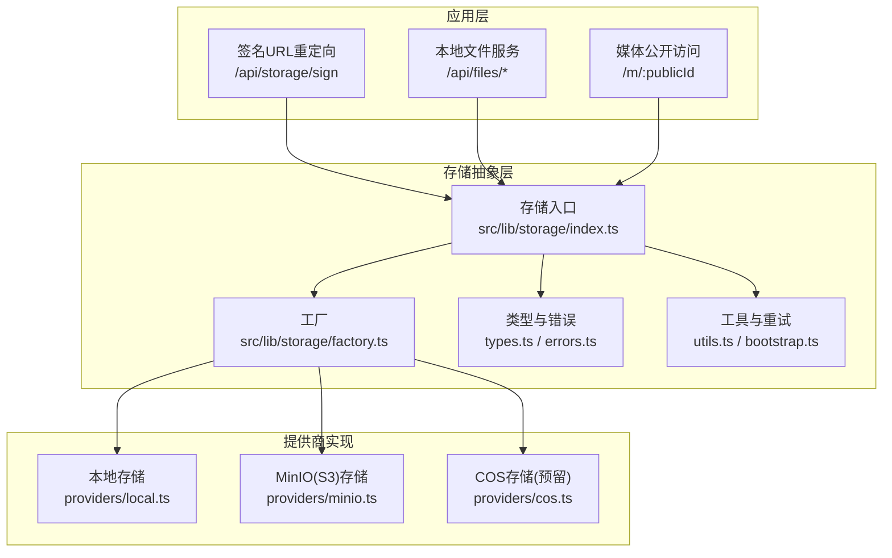
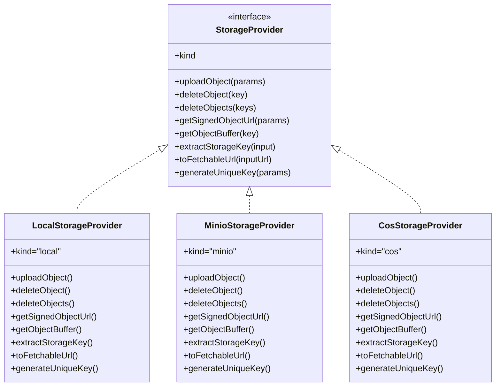
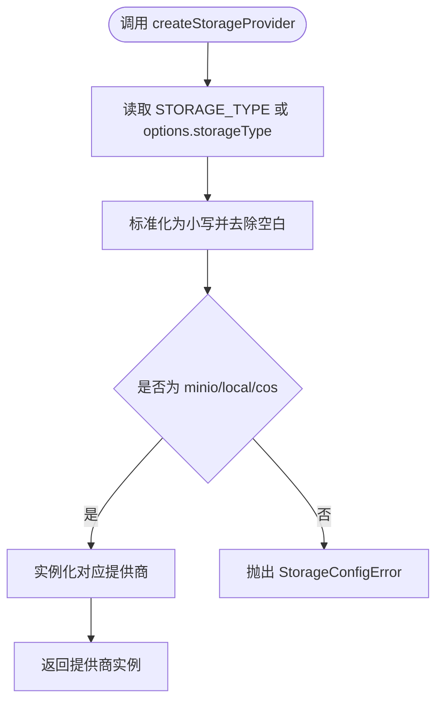
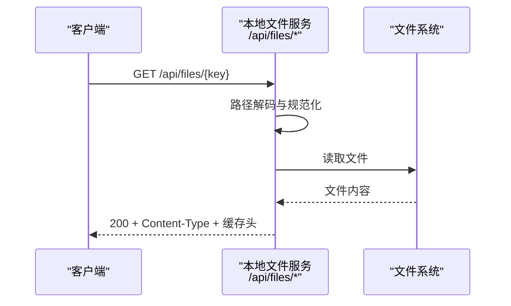
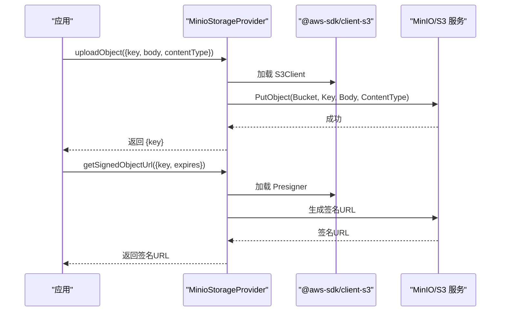
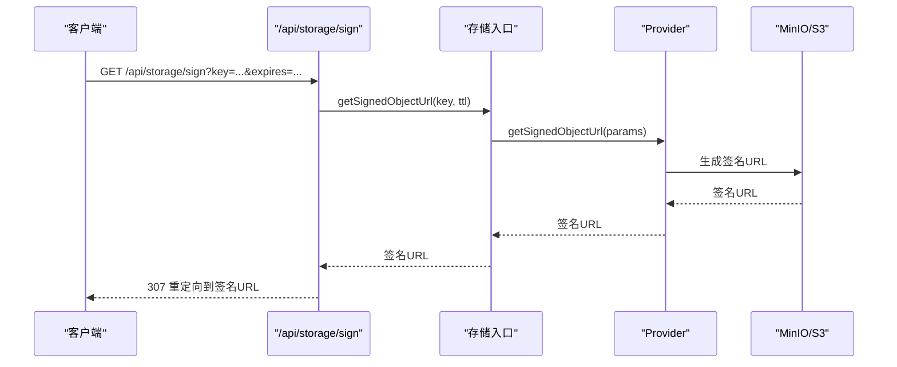
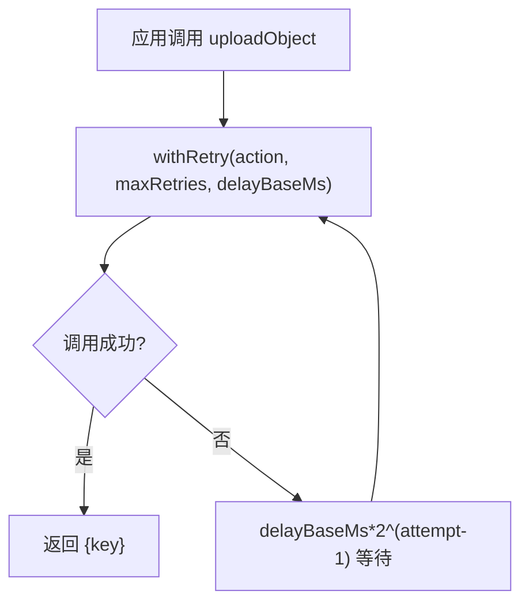
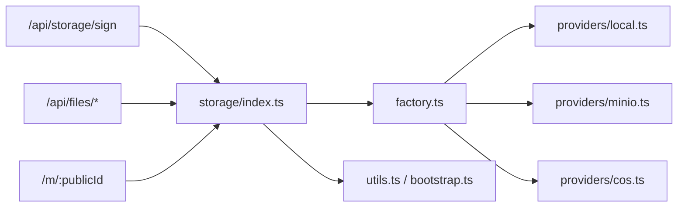

# 存储后端扩展

<cite>
**本文引用的文件**
- [src/lib/storage/index.ts](file://src/lib/storage/index.ts)
- [src/lib/storage/types.ts](file://src/lib/storage/types.ts)
- [src/lib/storage/factory.ts](file://src/lib/storage/factory.ts)
- [src/lib/storage/utils.ts](file://src/lib/storage/utils.ts)
- [src/lib/storage/errors.ts](file://src/lib/storage/errors.ts)
- [src/lib/storage/providers/local.ts](file://src/lib/storage/providers/local.ts)
- [src/lib/storage/providers/minio.ts](file://src/lib/storage/providers/minio.ts)
- [src/lib/storage/providers/cos.ts](file://src/lib/storage/providers/cos.ts)
- [src/lib/storage/bootstrap.ts](file://src/lib/storage/bootstrap.ts)
- [src/app/api/storage/sign/route.ts](file://src/app/api/storage/sign/route.ts)
- [src/app/api/files/[...path]/route.ts](file://src/app/api/files/[...path]/route.ts)
- [src/app/m/[publicId]/route.ts](file://src/app/m/[publicId]/route.ts)
- [src/lib/image-cache.ts](file://src/lib/image-cache.ts)
- [src/lib/workers/user-concurrency-gate.ts](file://src/lib/workers/user-concurrency-gate.ts)
- [tests/unit/storage/factory.test.ts](file://tests/unit/storage/factory.test.ts)
- [tests/unit/storage/bootstrap.test.ts](file://tests/unit/storage/bootstrap.test.ts)
- [scripts/media-safety-backup.ts](file://scripts/media-safety-backup.ts)
- [scripts/media-restore-dry-run.ts](file://scripts/media-restore-dry-run.ts)
- [scripts/migrate-local-to-minio.ts](file://scripts/migrate-local-to-minio.ts)
- [scripts/migrate-to-minio.ts](file://scripts/migrate-to-minio.ts)
</cite>

## 目录
1. [简介](#简介)
2. [项目结构](#项目结构)
3. [核心组件](#核心组件)
4. [架构总览](#架构总览)
5. [详细组件分析](#详细组件分析)
6. [依赖关系分析](#依赖关系分析)
7. [性能考虑](#性能考虑)
8. [故障排查指南](#故障排查指南)
9. [结论](#结论)
10. [附录](#附录)

## 简介
本指南面向需要为 Waoowaoo 扩展存储后端的开发者，系统性阐述存储抽象层的设计与接口规范，覆盖本地存储、MinIO（兼容 S3）与 COS（当前未实现）的集成方案；详解文件上传、下载、删除与元数据管理的实现路径；给出存储桶配置、访问权限与安全策略建议；提供性能优化（缓存、并发与带宽）实践；并包含存储迁移、备份恢复与数据一致性的实现思路及测试与监控要点。

## 项目结构
存储子系统采用“抽象层 + 多提供商实现 + 工厂模式”的分层设计：
- 抽象层定义统一接口与通用工具
- 工厂根据环境变量选择具体提供商
- 提供商实现本地文件系统、MinIO（S3 兼容）、以及预留的 COS 实现
- API 层提供签名 URL 重定向与本地文件直链服务
- 辅助模块提供图片缓存、并发门控、启动引导与迁移脚本

图表来源
- [src/lib/storage/index.ts:1-88](file://src/lib/storage/index.ts#L1-L88)
- [src/lib/storage/factory.ts:1-27](file://src/lib/storage/factory.ts#L1-L27)
- [src/lib/storage/providers/local.ts:1-37](file://src/lib/storage/providers/local.ts#L1-L37)
- [src/lib/storage/providers/minio.ts:1-114](file://src/lib/storage/providers/minio.ts#L1-L114)
- [src/lib/storage/providers/cos.ts:1-43](file://src/lib/storage/providers/cos.ts#L1-L43)
- [src/app/api/storage/sign/route.ts:1-22](file://src/app/api/storage/sign/route.ts#L1-L22)
- [src/app/api/files/[...path]/route.ts:1-83](file://src/app/api/files/[...path]/route.ts#L1-L83)
- [src/app/m/[publicId]/route.ts:1-96](file://src/app/m/[publicId]/route.ts#L1-L96)

章节来源
- [src/lib/storage/index.ts:1-88](file://src/lib/storage/index.ts#L1-L88)
- [src/lib/storage/factory.ts:1-27](file://src/lib/storage/factory.ts#L1-L27)
- [src/lib/storage/utils.ts:1-83](file://src/lib/storage/utils.ts#L1-L83)
- [src/lib/storage/providers/local.ts:1-37](file://src/lib/storage/providers/local.ts#L1-L37)
- [src/lib/storage/providers/minio.ts:1-114](file://src/lib/storage/providers/minio.ts#L1-L114)
- [src/lib/storage/providers/cos.ts:1-43](file://src/lib/storage/providers/cos.ts#L1-L43)
- [src/app/api/storage/sign/route.ts:1-22](file://src/app/api/storage/sign/route.ts#L1-L22)
- [src/app/api/files/[...path]/route.ts:1-83](file://src/app/api/files/[...path]/route.ts#L1-L83)
- [src/app/m/[publicId]/route.ts:1-96](file://src/app/m/[publicId]/route.ts#L1-L96)

## 核心组件
- 存储入口与高层 API
  - 单例获取存储提供商、上传/删除/批量删除、提取键、获取对象缓冲、生成签名 URL、批量签名 URL
  - 上传默认重试机制与日志记录
- 类型与错误
  - 统一的存储类型枚举与 Provider 接口
  - 配置错误与“尚未实现”错误
- 工厂与工具
  - 根据 STORAGE_TYPE 选择提供商
  - 环境变量校验、URL 规范化、重试策略、流到 Buffer 转换
- 提供商实现
  - 本地：文件系统写入、删除、批量删除、本地文件服务路由
  - MinIO：S3 SDK 客户端封装、签名 URL 生成、桶存在性检查与创建
  - COS：预留实现，抛出“尚未实现”错误
- API 路由
  - 签名 URL 重定向：统一对外暴露短时可访问链接
  - 本地文件服务：仅在本地模式下提供静态文件访问
  - 媒体公开访问：基于 ETag/Range 的缓存与断点续传支持

章节来源
- [src/lib/storage/index.ts:1-88](file://src/lib/storage/index.ts#L1-L88)
- [src/lib/storage/types.ts:1-37](file://src/lib/storage/types.ts#L1-L37)
- [src/lib/storage/errors.ts:1-13](file://src/lib/storage/errors.ts#L1-L13)
- [src/lib/storage/factory.ts:1-27](file://src/lib/storage/factory.ts#L1-L27)
- [src/lib/storage/utils.ts:1-83](file://src/lib/storage/utils.ts#L1-L83)
- [src/lib/storage/providers/local.ts:1-37](file://src/lib/storage/providers/local.ts#L1-L37)
- [src/lib/storage/providers/minio.ts:1-114](file://src/lib/storage/providers/minio.ts#L1-L114)
- [src/lib/storage/providers/cos.ts:1-43](file://src/lib/storage/providers/cos.ts#L1-L43)
- [src/app/api/storage/sign/route.ts:1-22](file://src/app/api/storage/sign/route.ts#L1-L22)
- [src/app/api/files/[...path]/route.ts:1-83](file://src/app/api/files/[...path]/route.ts#L1-L83)
- [src/app/m/[publicId]/route.ts:1-96](file://src/app/m/[publicId]/route.ts#L1-L96)

## 架构总览
存储抽象层通过工厂模式屏蔽不同提供商差异，统一对外提供上传、删除、签名 URL 与对象读取能力。MinIO 提供商在启动阶段自动确保桶存在；本地提供商通过 API 路由提供静态文件访问；COS 当前未实现但接口预留。

图表来源
- [src/lib/storage/types.ts:23-33](file://src/lib/storage/types.ts#L23-L33)
- [src/lib/storage/providers/local.ts:12-37](file://src/lib/storage/providers/local.ts#L12-L37)
- [src/lib/storage/providers/minio.ts:22-40](file://src/lib/storage/providers/minio.ts#L22-L40)
- [src/lib/storage/providers/cos.ts:4-43](file://src/lib/storage/providers/cos.ts#L4-L43)

## 详细组件分析

### 抽象层与工厂
- 抽象接口定义了统一的存储能力边界，便于替换与扩展
- 工厂根据 STORAGE_TYPE 选择提供商，并对未知类型抛出配置错误
- 错误类型区分“尚未实现”与“配置错误”，便于快速定位问题

图表来源
- [src/lib/storage/factory.ts:7-26](file://src/lib/storage/factory.ts#L7-L26)
- [src/lib/storage/errors.ts:8-13](file://src/lib/storage/errors.ts#L8-L13)

章节来源
- [src/lib/storage/factory.ts:1-27](file://src/lib/storage/factory.ts#L1-L27)
- [src/lib/storage/types.ts:1-37](file://src/lib/storage/types.ts#L1-L37)
- [src/lib/storage/errors.ts:1-13](file://src/lib/storage/errors.ts#L1-L13)

### 本地存储实现
- 文件系统写入与删除，支持批量删除
- 本地文件服务路由提供静态文件访问，含路径逃逸防护与 MIME 类型识别
- 本地模式下签名 URL 直接重定向到本地文件服务

图表来源
- [src/app/api/files/[...path]/route.ts:37-83](file://src/app/api/files/[...path]/route.ts#L37-L83)

章节来源
- [src/lib/storage/providers/local.ts:12-37](file://src/lib/storage/providers/local.ts#L12-L37)
- [src/app/api/files/[...path]/route.ts:1-83](file://src/app/api/files/[...path]/route.ts#L1-L83)

### MinIO（S3）存储实现
- 延迟加载 SDK 与签名器，按需创建 S3 客户端
- 支持上传、单对象删除、批量删除与签名 URL 生成
- 启动阶段自动检测/创建桶，确保运行时可用

图表来源
- [src/lib/storage/providers/minio.ts:68-114](file://src/lib/storage/providers/minio.ts#L68-L114)
- [src/lib/storage/bootstrap.ts:35-74](file://src/lib/storage/bootstrap.ts#L35-L74)

章节来源
- [src/lib/storage/providers/minio.ts:1-114](file://src/lib/storage/providers/minio.ts#L1-L114)
- [src/lib/storage/bootstrap.ts:1-74](file://src/lib/storage/bootstrap.ts#L1-L74)

### COS 存储（预留）
- 当前抛出“尚未实现”错误，接口已预留，便于后续接入
- 建议遵循现有 Provider 接口与错误约定进行实现

章节来源
- [src/lib/storage/providers/cos.ts:1-43](file://src/lib/storage/providers/cos.ts#L1-L43)

### 签名 URL 与媒体公开访问
- 签名 URL 重定向：统一对外暴露短期可访问链接，避免泄露真实存储凭据
- 媒体公开访问：基于 ETag/Range 的缓存与断点续传，提升大文件传输体验

图表来源
- [src/app/api/storage/sign/route.ts:7-22](file://src/app/api/storage/sign/route.ts#L7-L22)
- [src/lib/storage/index.ts:70-75](file://src/lib/storage/index.ts#L70-L75)

章节来源
- [src/app/api/storage/sign/route.ts:1-22](file://src/app/api/storage/sign/route.ts#L1-L22)
- [src/app/m/[publicId]/route.ts:12-96](file://src/app/m/[publicId]/route.ts#L12-L96)

### 文件上传流程（含重试）
- 应用层调用高层 API，内部通过 withRetry 实现指数退避重试
- 上传成功后返回存储键，用于后续签名与访问

图表来源
- [src/lib/storage/index.ts:35-52](file://src/lib/storage/index.ts#L35-L52)
- [src/lib/storage/utils.ts:36-55](file://src/lib/storage/utils.ts#L36-L55)

章节来源
- [src/lib/storage/index.ts:1-88](file://src/lib/storage/index.ts#L1-L88)
- [src/lib/storage/utils.ts:1-83](file://src/lib/storage/utils.ts#L1-L83)

## 依赖关系分析
- 存储入口依赖工厂与工具模块，向上提供高层 API
- 工厂依赖各提供商类，向下屏蔽 SDK 细节
- API 路由依赖存储入口，形成“控制器-服务-存储”三层
- 测试覆盖工厂选择逻辑与 MinIO 启动引导行为

图表来源
- [src/app/api/storage/sign/route.ts:1-22](file://src/app/api/storage/sign/route.ts#L1-L22)
- [src/app/api/files/[...path]/route.ts:1-83](file://src/app/api/files/[...path]/route.ts#L1-L83)
- [src/app/m/[publicId]/route.ts:1-96](file://src/app/m/[publicId]/route.ts#L1-L96)
- [src/lib/storage/index.ts:1-88](file://src/lib/storage/index.ts#L1-L88)
- [src/lib/storage/factory.ts:1-27](file://src/lib/storage/factory.ts#L1-L27)

章节来源
- [tests/unit/storage/factory.test.ts:1-31](file://tests/unit/storage/factory.test.ts#L1-L31)
- [tests/unit/storage/bootstrap.test.ts:77-97](file://tests/unit/storage/bootstrap.test.ts#L77-L97)

## 性能考虑
- 缓存策略
  - 图片下载缓存：LRU 缓存 + 并发共享下载 Promise，降低重复下载开销
  - 本地文件服务：设置长缓存头，减少重复请求
  - 媒体公开访问：基于 ETag 的条件请求与断点续传，节省带宽
- 并发处理
  - 用户级并发门控：限制同一用户在图像/视频场景下的并发度，避免资源争用
  - 图片预加载：批量预取唯一 URL，提升批量生成场景吞吐
- 带宽管理
  - 短时签名 URL：限制有效期，避免长期暴露
  - 断点续传：结合 Range 请求与 ETag，提高大文件传输稳定性
- 重试与幂等
  - 上传重试：指数退避，避免雪崩效应
  - 删除幂等：本地删除忽略不存在错误，MinIO 批量删除统计成功/失败数

章节来源
- [src/lib/image-cache.ts:1-253](file://src/lib/image-cache.ts#L1-L253)
- [src/lib/workers/user-concurrency-gate.ts:1-69](file://src/lib/workers/user-concurrency-gate.ts#L1-L69)
- [src/lib/storage/utils.ts:36-55](file://src/lib/storage/utils.ts#L36-L55)
- [src/lib/storage/providers/local.ts:23-37](file://src/lib/storage/providers/local.ts#L23-L37)
- [src/lib/storage/providers/minio.ts:90-109](file://src/lib/storage/providers/minio.ts#L90-L109)

## 故障排查指南
- 配置错误
  - 缺少必要环境变量或类型不支持：抛出 StorageConfigError
  - 本地/MinIO/COS 三者之外的类型：工厂拒绝
- “尚未实现”
  - COS 提供商当前未实现，调用会抛出 StorageProviderNotImplementedError
- 启动引导
  - MinIO 启动阶段若桶不存在则自动创建；非“桶缺失”错误会直接抛出
- API 行为
  - 签名 URL：缺少 key 参数会返回参数错误；默认有效期与路由一致
  - 本地文件服务：路径逃逸会被拒绝；文件不存在返回 404
- 单元测试
  - 工厂测试覆盖类型选择与错误分支
  - MinIO 启动引导测试覆盖“桶存在/创建/异常”三种情形

章节来源
- [src/lib/storage/errors.ts:1-13](file://src/lib/storage/errors.ts#L1-L13)
- [src/lib/storage/factory.ts:7-13](file://src/lib/storage/factory.ts#L7-L13)
- [src/lib/storage/providers/cos.ts:8-9](file://src/lib/storage/providers/cos.ts#L8-L9)
- [src/lib/storage/bootstrap.ts:19-33](file://src/lib/storage/bootstrap.ts#L19-L33)
- [src/app/api/storage/sign/route.ts:12-14](file://src/app/api/storage/sign/route.ts#L12-L14)
- [src/app/api/files/[...path]/route.ts:48-55](file://src/app/api/files/[...path]/route.ts#L48-L55)
- [tests/unit/storage/factory.test.ts:23-29](file://tests/unit/storage/factory.test.ts#L23-L29)
- [tests/unit/storage/bootstrap.test.ts:77-97](file://tests/unit/storage/bootstrap.test.ts#L77-L97)

## 结论
Waoowaoo 的存储后端以抽象接口为核心，通过工厂模式灵活切换本地与 MinIO 提供商，并为未来扩展（如 COS）预留接口。配合签名 URL、本地文件服务、图片缓存、并发门控与启动引导机制，形成了可维护、可扩展且具备一定性能优化的存储体系。建议在新增提供商时严格遵循接口契约与错误约定，并配套完善测试与监控。

## 附录

### 存储桶配置与安全策略
- MinIO 桶配置
  - 自动检测/创建：启动阶段通过 HeadBucket/ CreateBucket 确保桶存在
  - 区域与路径风格：可通过环境变量配置
- 访问权限控制
  - 使用短期签名 URL 替代永久凭证
  - 本地文件服务仅在本地模式启用，避免生产暴露
- 安全建议
  - 限制 STORAGE_TYPE 与相关环境变量注入范围
  - 对外只暴露 /api/storage/sign 与必要的公开访问路由
  - 定期轮换密钥与缩短签名有效期

章节来源
- [src/lib/storage/bootstrap.ts:35-74](file://src/lib/storage/bootstrap.ts#L35-L74)
- [src/lib/storage/providers/minio.ts:33-40](file://src/lib/storage/providers/minio.ts#L33-L40)
- [src/app/api/storage/sign/route.ts:1-22](file://src/app/api/storage/sign/route.ts#L1-L22)
- [src/app/api/files/[...path]/route.ts:1-83](file://src/app/api/files/[...path]/route.ts#L1-L83)

### 文件操作与元数据管理
- 上传
  - 应用层调用高层 API，内部执行重试与返回存储键
- 下载
  - 通过签名 URL 或本地文件服务路由访问
  - 媒体公开访问支持 ETag/Range，利于缓存与断点续传
- 删除
  - 支持单对象与批量删除；本地删除忽略不存在错误；MinIO 批量删除统计结果
- 元数据
  - 通过媒体模型与存储键关联，公开访问时可携带 MIME、大小等信息

章节来源
- [src/lib/storage/index.ts:35-88](file://src/lib/storage/index.ts#L35-L88)
- [src/lib/storage/providers/local.ts:23-37](file://src/lib/storage/providers/local.ts#L23-L37)
- [src/lib/storage/providers/minio.ts:81-109](file://src/lib/storage/providers/minio.ts#L81-L109)
- [src/app/m/[publicId]/route.ts:12-96](file://src/app/m/[publicId]/route.ts#L12-L96)

### 性能优化技巧
- 缓存策略
  - 图片缓存：TTL、最大容量、清理周期、命中率统计
  - 本地文件服务：1 年缓存头
  - 媒体公开访问：ETag 条件请求与 Range 支持
- 并发处理
  - 用户级并发门控：按用户与场景维度限制并发
  - 图片预加载：批量预取唯一 URL，提升吞吐
- 带宽管理
  - 短时签名 URL 与断点续传
  - 上传重试与幂等删除

章节来源
- [src/lib/image-cache.ts:22-32](file://src/lib/image-cache.ts#L22-L32)
- [src/lib/image-cache.ts:164-198](file://src/lib/image-cache.ts#L164-L198)
- [src/lib/workers/user-concurrency-gate.ts:26-54](file://src/lib/workers/user-concurrency-gate.ts#L26-L54)
- [src/lib/storage/utils.ts:36-55](file://src/lib/storage/utils.ts#L36-L55)

### 存储迁移、备份与一致性
- 迁移脚本
  - 本地到 MinIO 迁移：将本地文件复制到 MinIO 桶
  - MinIO 初始化：确保桶存在
- 备份与恢复
  - 安全备份：导出数据库快照与存储索引，计算哈希与大小
  - 恢复干跑：比对表计数，验证一致性后再执行恢复
- 一致性保障
  - 媒体公开访问基于 ETag/更新时间构建强缓存标识
  - 删除操作幂等，批量删除统计成功/失败数

章节来源
- [scripts/migrate-local-to-minio.ts](file://scripts/migrate-local-to-minio.ts)
- [scripts/migrate-to-minio.ts](file://scripts/migrate-to-minio.ts)
- [scripts/media-safety-backup.ts:1-61](file://scripts/media-safety-backup.ts#L1-L61)
- [scripts/media-restore-dry-run.ts:1-111](file://scripts/media-restore-dry-run.ts#L1-L111)
- [src/app/m/[publicId]/route.ts:7-41](file://src/app/m/[publicId]/route.ts#L7-L41)

### 测试与监控
- 单元测试
  - 工厂：覆盖类型选择与错误分支
  - 启动引导：覆盖“桶存在/创建/异常”场景
- 监控指标（建议）
  - 上传成功率与重试次数
  - 签名 URL 生成耗时与命中率
  - 图片缓存命中率与总下载时长
  - 并发门控等待队列长度
  - MinIO 批量删除成功/失败数

章节来源
- [tests/unit/storage/factory.test.ts:1-31](file://tests/unit/storage/factory.test.ts#L1-L31)
- [tests/unit/storage/bootstrap.test.ts:77-97](file://tests/unit/storage/bootstrap.test.ts#L77-L97)
- [src/lib/image-cache.ts:216-239](file://src/lib/image-cache.ts#L216-L239)