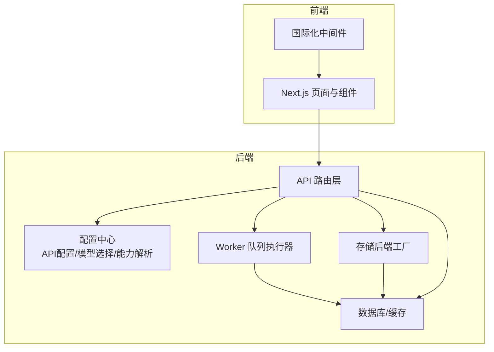
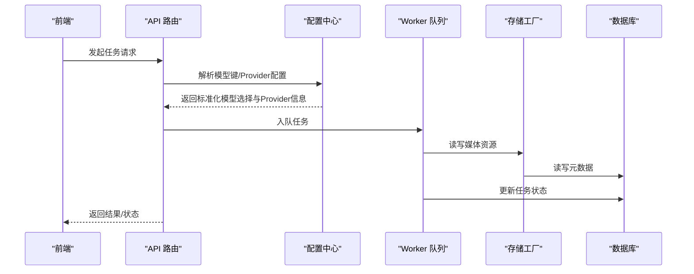
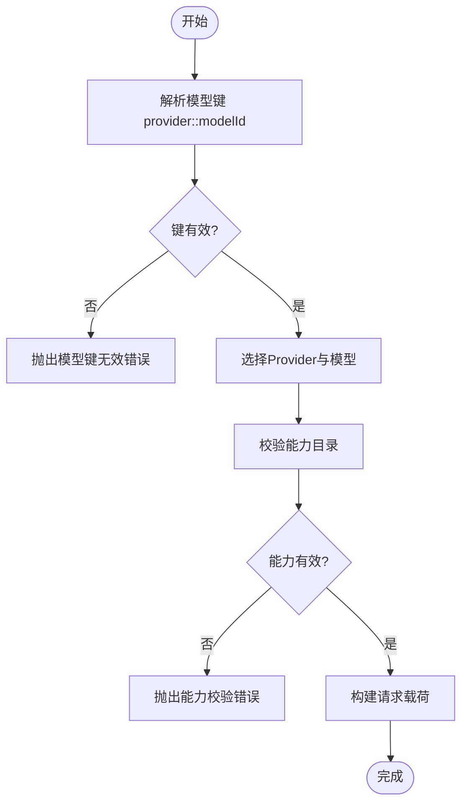
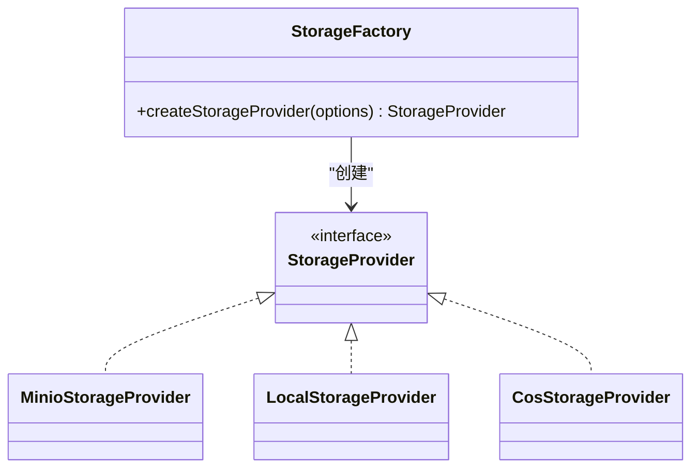
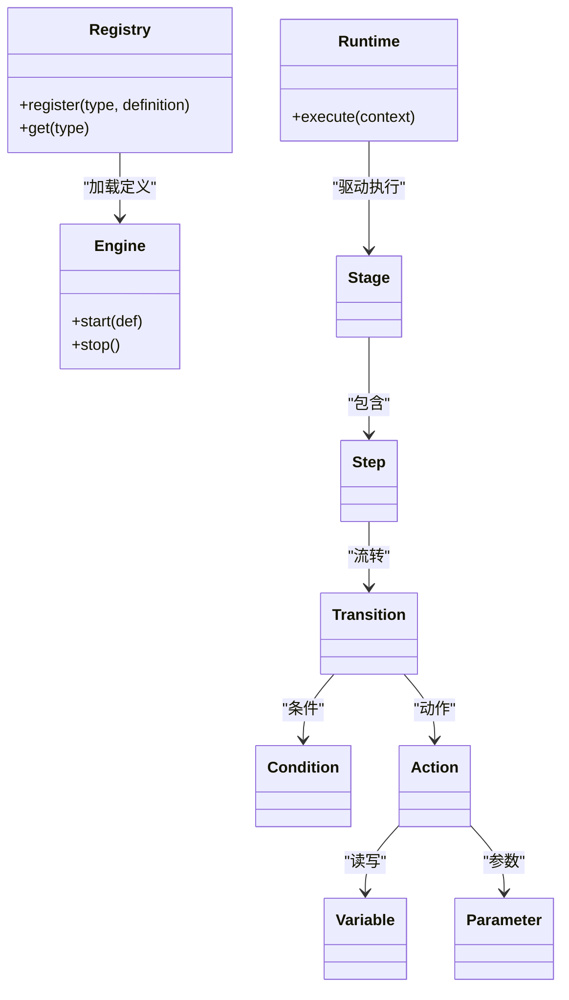
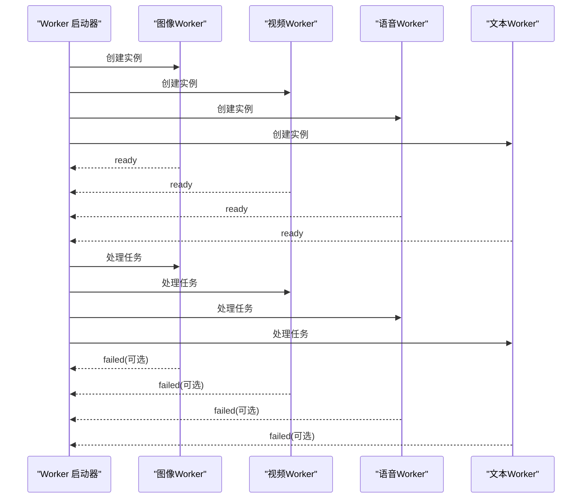
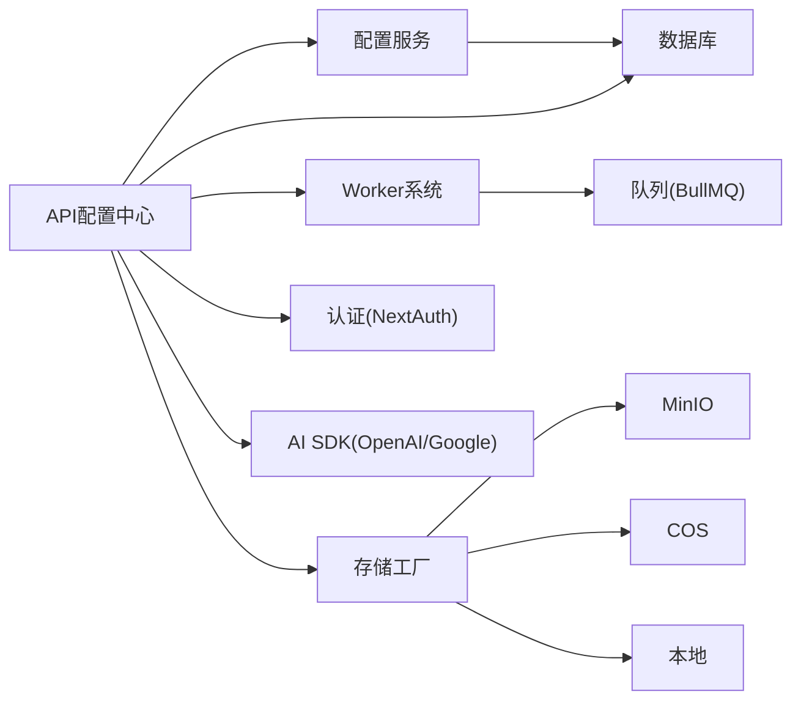

# 扩展开发

<cite>
**本文引用的文件**   
- [package.json](file://package.json)
- [src/lib/api-config.ts](file://src/lib/api-config.ts)
- [src/lib/config-service.ts](file://src/lib/config-service.ts)
- [src/lib/model-config-contract.ts](file://src/lib/model-config-contract.ts)
- [src/lib/storage/factory.ts](file://src/lib/storage/factory.ts)
- [src/lib/workers/index.ts](file://src/lib/workers/index.ts)
- [src/middleware.ts](file://src/middleware.ts)
- [standards/capabilities/catalog.example.json](file://standards/capabilities/catalog.example.json)
- [standards/pricing/image-video.pricing.json](file://standards/pricing/image-video.pricing.json)
- [standards/prompt-canary/screenplay_conversion.canary.json](file://standards/prompt-canary/screenplay_conversion.canary.json)
- [standards/prompt-canary/story_to_script_clips.canary.json](file://standards/prompt-canary/story_to_script_clips.canary.json)
- [standards/prompt-canary/storyboard_panels.canary.json](file://standards/prompt-canary/storyboard_panels.canary.json)
- [standards/prompt-canary/voice_analysis.canary.json](file://standards/prompt-canary/voice_analysis.canary.json)
- [src/lib/workers/image.worker.ts](file://src/lib/workers/image.worker.ts)
- [src/lib/workers/video.worker.ts](file://src/lib/workers/video.worker.ts)
- [src/lib/workers/voice.worker.ts](file://src/lib/workers/voice.worker.ts)
- [src/lib/workers/text.worker.ts](file://src/lib/workers/text.worker.ts)
- [src/lib/workers/shared.ts](file://src/lib/workers/shared.ts)
- [src/lib/workers/utils.ts](file://src/lib/workers/utils.ts)
- [src/lib/workers/user-concurrency-gate.ts](file://src/lib/workers/user-concurrency-gate.ts)
- [src/lib/workers/utils.ts](file://src/lib/workers/utils.ts)
- [src/lib/workflow-concurrency.ts](file://src/lib/workflow-concurrency.ts)
- [src/lib/model-capabilities/lookup.ts](file://src/lib/model-capabilities/lookup.ts)
- [src/lib/model-capabilities/catalog.ts](file://src/lib/model-capabilities/catalog.ts)
- [src/lib/openai-compat-media-template.ts](file://src/lib/openai-compat-media-template.ts)
- [src/lib/user-api/model-template/validator.ts](file://src/lib/user-api/model-template/validator.ts)
- [src/lib/crypto-utils.ts](file://src/lib/crypto-utils.ts)
- [src/lib/prisma.ts](file://src/lib/prisma.ts)
- [src/lib/logging/core.ts](file://src/lib/logging/core.ts)
- [src/lib/storage/providers/local.ts](file://src/lib/storage/providers/local.ts)
- [src/lib/storage/providers/minio.ts](file://src/lib/storage/providers/minio.ts)
- [src/lib/storage/providers/cos.ts](file://src/lib/storage/providers/cos.ts)
- [src/lib/storage/types.ts](file://src/lib/storage/types.ts)
- [src/lib/storage/errors.ts](file://src/lib/storage/errors.ts)
- [src/lib/storage/init.ts](file://src/lib/storage/init.ts)
- [src/lib/run-runtime/reconcile-active-runs.integration.test.ts](file://tests/integration/run-runtime/reconcile-active-runs.integration.test.ts)
- [src/lib/run-runtime/retry-failed-step.integration.test.ts](file://tests/integration/run-runtime/retry-failed-step.integration.test.ts)
- [src/lib/workflow-engine/registry.test.ts](file://tests/unit/workflow-engine/registry.test.ts)
- [src/lib/workflow-engine/registry.ts](file://src/lib/workflow-engine/registry.ts)
- [src/lib/workflow-engine/runtime.ts](file://src/lib/workflow-engine/runtime.ts)
- [src/lib/workflow-engine/types.ts](file://src/lib/workflow-engine/types.ts)
- [src/lib/workflow-engine/errors.ts](file://src/lib/workflow-engine/errors.ts)
- [src/lib/workflow-engine/stage.ts](file://src/lib/workflow-engine/stage.ts)
- [src/lib/workflow-engine/step.ts](file://src/lib/workflow-engine/step.ts)
- [src/lib/workflow-engine/transition.ts](file://src/lib/workflow-engine/transition.ts)
- [src/lib/workflow-engine/state.ts](file://src/lib/workflow-engine/state.ts)
- [src/lib/workflow-engine/context.ts](file://src/lib/workflow-engine/context.ts)
- [src/lib/workflow-engine/executor.ts](file://src/lib/workflow-engine/executor.ts)
- [src/lib/workflow-engine/engine.ts](file://src/lib/workflow-engine/engine.ts)
- [src/lib/workflow-engine/runner.ts](file://src/lib/workflow-engine/runner.ts)
- [src/lib/workflow-engine/serializer.ts](file://src/lib/workflow-engine/serializer.ts)
- [src/lib/workflow-engine/validator.ts](file://src/lib/workflow-engine/validator.ts)
- [src/lib/workflow-engine/transformer.ts](file://src/lib/workflow-engine/transformer.ts)
- [src/lib/workflow-engine/trigger.ts](file://src/lib/workflow-engine/trigger.ts)
- [src/lib/workflow-engine/event.ts](file://src/lib/workflow-engine/event.ts)
- [src/lib/workflow-engine/condition.ts](file://src/lib/workflow-engine/condition.ts)
- [src/lib/workflow-engine/action.ts](file://src/lib/workflow-engine/action.ts)
- [src/lib/workflow-engine/variable.ts](file://src/lib/workflow-engine/variable.ts)
- [src/lib/workflow-engine/parameter.ts](file://src/lib/workflow-engine/parameter.ts)
- [src/lib/workflow-engine/definition.ts](file://src/lib/workflow-engine/definition.ts)
- [src/lib/workflow-engine/parser.ts](file://src/lib/workflow-engine/parser.ts)
- [src/lib/workflow-engine/interpreter.ts](file://src/lib/workflow-engine/interpreter.ts)
- [src/lib/workflow-engine/compiler.ts](file://src/lib/workflow-engine/compiler.ts)
- [src/lib/workflow-engine/emitter.ts](file://src/lib/workflow-engine/emitter.ts)
- [src/lib/workflow-engine/scheduler.ts](file://src/lib/workflow-engine/scheduler.ts)
- [src/lib/workflow-engine/queue.ts](file://src/lib/workflow-engine/queue.ts)
- [src/lib/workflow-engine/job.ts](file://src/lib/workflow-engine/job.ts)
- [src/lib/workflow-engine/result.ts](file://src/lib/workflow-engine/result.ts)
- [src/lib/workflow-engine/error.ts](file://src/lib/workflow-engine/error.ts)
- [src/lib/workflow-engine/status.ts](file://src/lib/workflow-engine/status.ts)
- [src/lib/workflow-engine/trace.ts](file://src/lib/workflow-engine/trace.ts)
- [src/lib/workflow-engine/metrics.ts](file://src/lib/workflow-engine/metrics.ts)
- [src/lib/workflow-engine/logger.ts](file://src/lib/workflow-engine/logger.ts)
- [src/lib/workflow-engine/telemetry.ts](file://src/lib/workflow-engine/telemetry.ts)
- [src/lib/workflow-engine/audit.ts](file://src/lib/workflow-engine/audit.ts)
- [src/lib/workflow-engine/history.ts](file://src/lib/workflow-engine/history.ts)
- [src/lib/workflow-engine/version.ts](file://src/lib/workflow-engine/version.ts)
- [src/lib/workflow-engine/lock.ts](file://src/lib/workflow-engine/lock.ts)
- [src/lib/workflow-engine/semaphore.ts](file://src/lib/workflow-engine/semaphore.ts)
- [src/lib/workflow-engine/timeout.ts](file://src/lib/workflow-engine/timeout.ts)
- [src/lib/workflow-engine/retry.ts](file://src/lib/workflow-engine/retry.ts)
- [src/lib/workflow-engine/backoff.ts](file://src/lib/workflow-engine/backoff.ts)
- [src/lib/workflow-engine/schedule.ts](file://src/lib/workflow-engine/schedule.ts)
- [src/lib/workflow-engine/cron.ts](file://src/lib/workflow-engine/cron.ts)
- [src/lib/workflow-engine/interval.ts](file://src/lib/workflow-engine/interval.ts)
- [src/lib/workflow-engine/timer.ts](file://src/lib/workflow-engine/timer.ts)
- [src/lib/workflow-engine/trigger.ts](file://src/lib/workflow-engine/trigger.ts)
- [src/lib/workflow-engine/event.ts](file://src/lib/workflow-engine/event.ts)
- [src/lib/workflow-engine/condition.ts](file://src/lib/workflow-engine/condition.ts)
- [src/lib/workflow-engine/action.ts](file://src/lib/workflow-engine/action.ts)
- [src/lib/workflow-engine/variable.ts](file://src/lib/workflow-engine/variable.ts)
- [src/lib/workflow-engine/parameter.ts](file://src/lib/workflow-engine/parameter.ts)
- [src/lib/workflow-engine/definition.ts](file://src/lib/workflow-engine/definition.ts)
- [src/lib/workflow-engine/parser.ts](file://src/lib/workflow-engine/parser.ts)
- [src/lib/workflow-engine/interpreter.ts](file://src/lib/workflow-engine/interpreter.ts)
- [src/lib/workflow-engine/compiler.ts](file://src/lib/workflow-engine/compiler.ts)
- [src/lib/workflow-engine/emitter.ts](file://src/lib/workflow-engine/emitter.ts)
- [src/lib/workflow-engine/scheduler.ts](file://src/lib/workflow-engine/scheduler.ts)
- [src/lib/workflow-engine/queue.ts](file://src/lib/workflow-engine/queue.ts)
- [src/lib/workflow-engine/job.ts](file://src/lib/workflow-engine/job.ts)
- [src/lib/workflow-engine/result.ts](file://src/lib/workflow-engine/result.ts)
- [src/lib/workflow-engine/error.ts](file://src/lib/workflow-engine/error.ts)
- [src/lib/workflow-engine/status.ts](file://src/lib/workflow-engine/status.ts)
- [src/lib/workflow-engine/trace.ts](file://src/lib/workflow-engine/trace.ts)
- [src/lib/workflow-engine/metrics.ts](file://src/lib/workflow-engine/metrics.ts)
- [src/lib/workflow-engine/logger.ts](file://src/lib/workflow-engine/logger.ts)
- [src/lib/workflow-engine/telemetry.ts](file://src/lib/workflow-engine/telemetry.ts)
- [src/lib/workflow-engine/audit.ts](file://src/lib/workflow-engine/audit.ts)
- [src/lib/workflow-engine/history.ts](file://src/lib/workflow-engine/history.ts)
- [src/lib/workflow-engine/version.ts](file://src/lib/workflow-engine/version.ts)
- [src/lib/workflow-engine/lock.ts](file://src/lib/workflow-engine/lock.ts)
- [src/lib/workflow-engine/semaphore.ts](file://src/lib/workflow-engine/semaphore.ts)
- [src/lib/workflow-engine/timeout.ts](file://src/lib/workflow-engine/timeout.ts)
- [src/lib/workflow-engine/retry.ts](file://src/lib/workflow-engine/retry.ts)
- [src/lib/workflow-engine/backoff.ts](file://src/lib/workflow-engine/backoff.ts)
- [src/lib/workflow-engine/schedule.ts](file://src/lib/workflow-engine/schedule.ts)
- [src/lib/workflow-engine/cron.ts](file://src/lib/workflow-engine/cron.ts)
- [src/lib/workflow-engine/interval.ts](file://src/lib/workflow-engine/interval.ts)
- [src/lib/workflow-engine/timer.ts](file://src/lib/workflow-engine/timer.ts)
- [src/lib/workflow-engine/trigger.ts](file://src/lib/workflow-engine/trigger.ts)
- [src/lib/workflow-engine/event.ts](file://src/lib/workflow-engine/event.ts)
- [src/lib/workflow-engine/condition.ts](file://src/lib/workflow-engine/condition.ts)
- [src/lib/workflow-engine/action.ts](file://src/lib/workflow-engine/action.ts)
- [src/lib/workflow-engine/variable.ts](file://src/lib/workflow-engine/variable.ts)
- [src/lib/workflow-engine/parameter.ts](file://src/lib/workflow-engine/parameter.ts)
- [src/lib/workflow-engine/definition.ts](file://src/lib/workflow-engine/definition.ts)
- [src/lib/workflow-engine/parser.ts](file://src/lib/workflow-engine/parser.ts)
- [src/lib/workflow-engine/interpreter.ts](file://src/lib/workflow-engine/interpreter.ts)
- [src/lib/workflow-engine/compiler.ts](file://src/lib/workflow-engine/compiler.ts)
- [src/lib/workflow-engine/emitter.ts](file://src/lib/workflow-engine/emitter.ts)
- [src/lib/workflow-engine/scheduler.ts](file://src/lib/workflow-engine/scheduler.ts)
- [src/lib/workflow-engine/queue.ts](file://src/lib/workflow-engine/queue.ts)
- [src/lib/workflow-engine/job.ts](file://src/lib/workflow-engine/job.ts)
- [src/lib/workflow-engine/result.ts](file://src/lib/workflow-engine/result.ts)
- [src/lib/workflow-engine/error.ts](file://src/lib/workflow-engine/error.ts)
- [src/lib/workflow-engine/status.ts](file://src/lib/workflow-engine/status.ts)
- [src/lib/workflow-engine/trace.ts](file://src/lib/workflow-engine/trace.ts)
- [src/lib/workflow-engine/metrics.ts](file://src/lib/workflow-engine/metrics.ts)
- [src/lib/workflow-engine/logger.ts](file://src/lib/workflow-engine/logger.ts)
- [src/lib/workflow-engine/telemetry.ts](file://src/lib/workflow-engine/telemetry.ts)
- [src/lib/workflow-engine/audit.ts](file://src/lib/workflow-engine/audit.ts)
- [src/lib/workflow-engine/history.ts](file://src/lib/workflow-engine/history.ts)
- [src/lib/workflow-engine/version.ts](file://src/lib/workflow-engine/version.ts)
- [src/lib/workflow-engine/lock.ts](file://src/lib/workflow-engine/lock.ts)
- [src/lib/workflow-engine/semaphore.ts](file://src/lib/workflow-engine/semaphore.ts)
- [src/lib/workflow-engine/timeout.ts](file://src/lib/workflow-engine/timeout.ts)
- [src/lib/workflow-engine/retry.ts](file://src/lib/workflow-engine/retry.ts)
- [src/lib/workflow-engine/backoff.ts](file://src/lib/workflow-engine/backoff.ts)
- [src/lib/workflow-engine/schedule.ts](file://src/lib/workflow-engine/schedule.ts)
- [src/lib/workflow-engine/cron.ts](file://src/lib/workflow-engine/cron.ts)
- [src/lib/workflow-engine/interval.ts](file://src/lib/workflow-engine/interval.ts)
- [src/lib/workflow-engine/timer.ts](file://src/lib/workflow-engine/timer.ts)
</cite>

## 目录
1. [简介](#简介)
2. [项目结构](#项目结构)
3. [核心组件](#核心组件)
4. [架构总览](#架构总览)
5. [详细组件分析](#详细组件分析)
6. [依赖分析](#依赖分析)
7. [性能考量](#性能考量)
8. [故障排查指南](#故障排查指南)
9. [结论](#结论)
10. [附录](#附录)

## 简介
本指南面向希望在Waoowaoo平台上进行扩展开发的工程师，系统性阐述插件开发框架、自定义AI模型集成、存储后端扩展、认证方式扩展、配置中心扩展、中间件系统、工作流引擎扩展、任务类型自定义与Worker开发、标准配置文件格式与版本管理、第三方服务集成与API适配器开发、协议扩展、扩展点识别与接口设计、向后兼容性最佳实践、打包分发与版本控制策略，以及安全、性能与测试要求。

## 项目结构
Waoowaoo采用前后端一体化的Next.js应用，结合后端脚本与Worker队列执行系统，形成“前端界面 + 后端API + 队列Worker + 存储后端”的整体架构。关键目录与职责概览：
- src/app：Next.js页面与路由层，包含国际化中间件与API路由。
- src/lib：核心业务逻辑库，包括API配置中心、模型能力与定价、存储工厂、Worker运行时等。
- src/middleware.ts：国际化中间件，强制语言前缀，避免语言漂移。
- standards：标准配置样例（能力目录、定价、提示词canary）。
- scripts：运维与质量门禁脚本（迁移、检查、监控）。
- tests：行为契约、集成与回归测试，覆盖API、Provider、Worker、Billing等。
- prisma：数据库Schema与迁移。

**章节来源**
- [package.json:1-186](file://package.json#L1-L186)
- [src/middleware.ts:1-28](file://src/middleware.ts#L1-L28)

## 核心组件
- 配置中心与API配置
  - API配置中心严格模式：模型键必须为provider::modelId，禁止provider猜测与默认降级，运行时仅从配置中心读取provider与密钥。
  - 支持用户自定义Provider与模型，提供严格解析与校验，包含OpenAI兼容媒体模板校验。
- 统一配置服务
  - 项目级与用户级模型配置合并，支持能力默认值与覆盖，统一构建图片类任务的计费载荷。
- 模型能力与定价
  - 统一模型能力结构与校验规则，支持LLM/图像/视频/音频/口型同步五类能力。
  - 定价目录以JSON形式描述不同Provider与Model的计费模式（按能力分档或固定费用）。
- 存储后端工厂
  - 支持MinIO、本地、COS三种存储类型，通过环境变量或构造参数选择，不支持的类型抛出配置错误。
- Worker系统
  - 启动图像、视频、语音、文本四类Worker，统一事件监听与优雅关闭流程。
- 国际化中间件
  - 强制语言前缀，禁用自动语言检测，避免无前缀跳转导致的语言漂移。

**章节来源**
- [src/lib/api-config.ts:1-509](file://src/lib/api-config.ts#L1-L509)
- [src/lib/config-service.ts:1-346](file://src/lib/config-service.ts#L1-L346)
- [src/lib/model-config-contract.ts:1-528](file://src/lib/model-config-contract.ts#L1-L528)
- [standards/capabilities/catalog.example.json:1-50](file://standards/capabilities/catalog.example.json#L1-L50)
- [standards/pricing/image-video.pricing.json:1-800](file://standards/pricing/image-video.pricing.json#L1-L800)
- [src/lib/storage/factory.ts:1-27](file://src/lib/storage/factory.ts#L1-L27)
- [src/lib/workers/index.ts:1-39](file://src/lib/workers/index.ts#L1-L39)
- [src/middleware.ts:1-28](file://src/middleware.ts#L1-L28)

## 架构总览
下图展示扩展开发的关键交互路径：前端请求经API路由进入，配置中心解析模型与Provider，Worker队列执行具体任务，存储后端负责持久化，数据库支撑用户偏好与项目配置。

**图表来源**
- [src/lib/api-config.ts:323-352](file://src/lib/api-config.ts#L323-L352)
- [src/lib/config-service.ts:147-169](file://src/lib/config-service.ts#L147-L169)
- [src/lib/workers/index.ts:8-29](file://src/lib/workers/index.ts#L8-L29)
- [src/lib/storage/factory.ts:15-26](file://src/lib/storage/factory.ts#L15-L26)
- [src/lib/prisma.ts](file://src/lib/prisma.ts)

## 详细组件分析

### 插件开发框架与扩展点
- 扩展点识别
  - API配置中心：提供模型键解析、Provider选择、OpenAI兼容模板校验。
  - 配置服务：项目/用户级配置合并、能力默认值与覆盖、计费载荷构建。
  - 存储工厂：抽象存储Provider，便于新增后端（如S3、阿里云OSS等）。
  - Worker系统：统一任务执行入口，便于新增任务类型与Worker。
  - 国际化中间件：统一语言前缀策略，便于多语言扩展。
- 接口设计建议
  - 使用统一模型键（provider::modelId），避免硬编码Provider与模型名。
  - 通过配置中心严格校验Provider与密钥，禁止猜测与默认降级。
  - 对外暴露最小接口，内部通过工厂/注册表模式扩展。
- 向后兼容性
  - 保持模型键格式不变，新增能力字段需在能力目录中声明。
  - Provider与模型变更应通过配置中心迁移脚本与守卫检查。

**章节来源**
- [src/lib/api-config.ts:113-120](file://src/lib/api-config.ts#L113-L120)
- [src/lib/config-service.ts:28-59](file://src/lib/config-service.ts#L28-L59)
- [src/lib/model-config-contract.ts:444-465](file://src/lib/model-config-contract.ts#L444-L465)

### 自定义AI模型集成
- 模型键与Provider
  - 必须使用provider::modelId格式，解析失败将抛出错误。
  - Provider支持OpenAI兼容路由与官方SDK两种模式，API模式与网关路由需严格匹配。
- 能力目录与定价
  - 能力目录定义各模型支持的能力字段与选项，定价目录定义计费模式。
  - 新增模型需在能力目录中声明，并在定价目录中配置计费策略。
- OpenAI兼容模板
  - 可选的兼容媒体模板用于统一图像/视频生成输出格式，需通过校验器验证。

**图表来源**
- [src/lib/api-config.ts:323-352](file://src/lib/api-config.ts#L323-L352)
- [src/lib/model-config-contract.ts:471-527](file://src/lib/model-config-contract.ts#L471-L527)
- [standards/capabilities/catalog.example.json:1-50](file://standards/capabilities/catalog.example.json#L1-L50)

**章节来源**
- [src/lib/api-config.ts:193-279](file://src/lib/api-config.ts#L193-L279)
- [src/lib/api-config.ts:418-434](file://src/lib/api-config.ts#L418-L434)
- [src/lib/user-api/model-template/validator.ts](file://src/lib/user-api/model-template/validator.ts)
- [src/lib/openai-compat-media-template.ts](file://src/lib/openai-compat-media-template.ts)

### 存储后端扩展
- 工厂模式
  - createStorageProvider根据类型返回对应Provider实例，支持minio/local/cos。
  - 不支持的类型将抛出配置错误。
- Provider接口
  - 抽象StorageProvider接口，新增后端需实现统一方法集合。
- 初始化
  - 提供初始化脚本，确保后端可用性与权限正确。

**图表来源**
- [src/lib/storage/factory.ts:15-26](file://src/lib/storage/factory.ts#L15-L26)
- [src/lib/storage/types.ts](file://src/lib/storage/types.ts)
- [src/lib/storage/providers/minio.ts](file://src/lib/storage/providers/minio.ts)
- [src/lib/storage/providers/local.ts](file://src/lib/storage/providers/local.ts)
- [src/lib/storage/providers/cos.ts](file://src/lib/storage/providers/cos.ts)
- [src/lib/storage/errors.ts](file://src/lib/storage/errors.ts)
- [src/lib/storage/init.ts](file://src/lib/storage/init.ts)

**章节来源**
- [src/lib/storage/factory.ts:7-13](file://src/lib/storage/factory.ts#L7-L13)
- [src/lib/storage/types.ts](file://src/lib/storage/types.ts)

### 认证方式扩展
- API配置中心严格模式
  - 运行时仅从配置中心读取Provider与密钥，禁止猜测与默认降级。
  - 密钥通过解密工具解密后使用，避免明文存储。
- Provider选择
  - 严格从已启用模型中选择Provider，禁止绕过校验直接传入未校验的ProviderId。

**章节来源**
- [src/lib/api-config.ts:1-8](file://src/lib/api-config.ts#L1-L8)
- [src/lib/api-config.ts:418-434](file://src/lib/api-config.ts#L418-L434)
- [src/lib/crypto-utils.ts](file://src/lib/crypto-utils.ts)

### 配置中心扩展
- 项目级与用户级配置合并
  - 项目配置优先于用户偏好，支持能力默认值与覆盖。
- 计费载荷构建
  - 图片类任务统一构建计费载荷，包含generationOptions与imageModel。
- 工作流并发配置
  - 支持用户级并发限制，统一归一化配置。

**章节来源**
- [src/lib/config-service.ts:147-169](file://src/lib/config-service.ts#L147-L169)
- [src/lib/config-service.ts:286-313](file://src/lib/config-service.ts#L286-L313)
- [src/lib/config-service.ts:320-345](file://src/lib/config-service.ts#L320-L345)
- [src/lib/workflow-concurrency.ts](file://src/lib/workflow-concurrency.ts)

### 中间件系统开发规范
- 国际化中间件
  - 强制语言前缀，禁用自动语言检测，避免语言漂移。
  - 匹配除API、静态资源、图标等以外的所有路径，确保重定向到带语言前缀的路径。

**章节来源**
- [src/middleware.ts:1-28](file://src/middleware.ts#L1-L28)

### 工作流引擎扩展
- 注册表与运行时
  - 提供工作流注册表、运行时、状态机、执行器、调度器等核心组件。
  - 支持阶段、步骤、转换、条件、动作、变量、参数等扩展点。
- 任务类型自定义
  - 通过注册表扩展新的任务类型，结合Worker系统执行。
- 并发与锁
  - 提供并发门控、信号量、锁、超时、重试、退避等机制保障稳定性。

**图表来源**
- [src/lib/workflow-engine/registry.ts](file://src/lib/workflow-engine/registry.ts)
- [src/lib/workflow-engine/runtime.ts](file://src/lib/workflow-engine/runtime.ts)
- [src/lib/workflow-engine/engine.ts](file://src/lib/workflow-engine/engine.ts)
- [src/lib/workflow-engine/stage.ts](file://src/lib/workflow-engine/stage.ts)
- [src/lib/workflow-engine/step.ts](file://src/lib/workflow-engine/step.ts)
- [src/lib/workflow-engine/transition.ts](file://src/lib/workflow-engine/transition.ts)
- [src/lib/workflow-engine/condition.ts](file://src/lib/workflow-engine/condition.ts)
- [src/lib/workflow-engine/action.ts](file://src/lib/workflow-engine/action.ts)
- [src/lib/workflow-engine/variable.ts](file://src/lib/workflow-engine/variable.ts)
- [src/lib/workflow-engine/parameter.ts](file://src/lib/workflow-engine/parameter.ts)

**章节来源**
- [src/lib/workflow-engine/registry.test.ts](file://src/lib/workflow-engine/registry.test.ts)
- [src/lib/workflow-engine/registry.ts](file://src/lib/workflow-engine/registry.ts)
- [src/lib/workflow-engine/runtime.ts](file://src/lib/workflow-engine/runtime.ts)
- [src/lib/workflow-engine/engine.ts](file://src/lib/workflow-engine/engine.ts)

### 任务类型自定义与Worker开发
- Worker启动与事件
  - 统一启动图像、视频、语音、文本Worker，监听ready/error/failed事件，支持优雅关闭。
- 任务处理
  - 通过共享工具与并发门控实现任务隔离与限流。
- 日志与监控
  - 使用统一日志模块记录Worker状态与错误。

**图表来源**
- [src/lib/workers/index.ts:8-29](file://src/lib/workers/index.ts#L8-L29)
- [src/lib/workers/image.worker.ts](file://src/lib/workers/image.worker.ts)
- [src/lib/workers/video.worker.ts](file://src/lib/workers/video.worker.ts)
- [src/lib/workers/voice.worker.ts](file://src/lib/workers/voice.worker.ts)
- [src/lib/workers/text.worker.ts](file://src/lib/workers/text.worker.ts)
- [src/lib/workers/shared.ts](file://src/lib/workers/shared.ts)
- [src/lib/workers/utils.ts](file://src/lib/workers/utils.ts)
- [src/lib/workers/user-concurrency-gate.ts](file://src/lib/workers/user-concurrency-gate.ts)
- [src/lib/logging/core.ts](file://src/lib/logging/core.ts)

**章节来源**
- [src/lib/workers/index.ts:1-39](file://src/lib/workers/index.ts#L1-L39)

### 标准配置文件格式、验证规则与版本管理
- 能力目录
  - 定义模型类型、Provider、ModelId与能力字段及选项，支持i18n标签。
- 定价目录
  - 定义API类型、Provider、ModelId与计费模式（按能力分档或固定费用）。
- 提示词canary
  - 提供关键提示词的回归校验样例，确保提示词稳定性。
- 版本管理
  - 通过迁移脚本与守卫检查保证配置变更的向后兼容与一致性。

**章节来源**
- [standards/capabilities/catalog.example.json:1-50](file://standards/capabilities/catalog.example.json#L1-L50)
- [standards/pricing/image-video.pricing.json:1-800](file://standards/pricing/image-video.pricing.json#L1-L800)
- [standards/prompt-canary/screenplay_conversion.canary.json](file://standards/prompt-canary/screenplay_conversion.canary.json)
- [standards/prompt-canary/story_to_script_clips.canary.json](file://standards/prompt-canary/story_to_script_clips.canary.json)
- [standards/prompt-canary/storyboard_panels.canary.json](file://standards/prompt-canary/storyboard_panels.canary.json)
- [standards/prompt-canary/voice_analysis.canary.json](file://standards/prompt-canary/voice_analysis.canary.json)

### 第三方服务集成、API适配器开发与协议扩展
- Provider配置
  - 支持自定义Provider与模型，提供baseUrl、apiKey、apiMode、gatewayRoute等字段。
  - OpenAI兼容路由与官方SDK模式需严格匹配，避免错误配置。
- 协议扩展
  - 通过OpenAI兼容媒体模板统一输出格式，便于跨Provider一致性。
- 适配器开发
  - 在API配置中心与Provider配置处扩展新Provider，确保密钥解密与URL规范化。

**章节来源**
- [src/lib/api-config.ts:51-58](file://src/lib/api-config.ts#L51-L58)
- [src/lib/api-config.ts:62-85](file://src/lib/api-config.ts#L62-L85)
- [src/lib/api-config.ts:121-191](file://src/lib/api-config.ts#L121-L191)
- [src/lib/api-config.ts:418-434](file://src/lib/api-config.ts#L418-L434)
- [src/lib/openai-compat-media-template.ts](file://src/lib/openai-compat-media-template.ts)

### 扩展的打包、分发与版本控制策略
- 包管理与脚本
  - 使用NPM脚本统一开发、构建、测试与发布流程，包含守卫检查与覆盖率统计。
- 分发
  - 通过Docker与脚本初始化存储后端，配合环境变量控制运行时行为。
- 版本控制
  - 通过迁移脚本与守卫检查确保配置与代码变更的向后兼容。

**章节来源**
- [package.json:9-111](file://package.json#L9-L111)
- [package.json:112-186](file://package.json#L112-L186)

## 依赖分析
- 组件耦合
  - API配置中心与配置服务紧密耦合，前者负责Provider与模型解析，后者负责配置合并与计费载荷构建。
  - Worker系统与存储工厂松耦合，通过抽象接口扩展新存储后端。
- 外部依赖
  - 数据库（Prisma）、队列（BullMQ）、存储（AWS S3、COS）、认证（NextAuth）、AI SDK（OpenAI、Google GenAI等）。
- 循环依赖
  - 当前结构通过模块化与工厂模式避免循环依赖风险。

**图表来源**
- [src/lib/api-config.ts:291-304](file://src/lib/api-config.ts#L291-L304)
- [src/lib/config-service.ts:147-169](file://src/lib/config-service.ts#L147-L169)
- [src/lib/storage/factory.ts:15-26](file://src/lib/storage/factory.ts#L15-L26)
- [package.json:112-162](file://package.json#L112-L162)

**章节来源**
- [package.json:112-162](file://package.json#L112-L162)

## 性能考量
- 并发控制
  - 使用用户级并发门控与工作流并发配置，避免资源争用。
- 缓存与索引
  - 媒体备份与未引用索引构建脚本提升存储访问效率。
- 队列与批处理
  - 通过队列与批处理减少瞬时峰值压力。
- 监控与告警
  - Worker事件与日志模块提供可观测性基础。

**章节来源**
- [src/lib/workers/user-concurrency-gate.ts](file://src/lib/workers/user-concurrency-gate.ts)
- [src/lib/workflow-concurrency.ts](file://src/lib/workflow-concurrency.ts)
- [src/lib/storage/init.ts](file://src/lib/storage/init.ts)

## 故障排查指南
- API配置错误
  - 模型键无效、Provider未找到、API密钥缺失等错误均会抛出明确异常，需检查配置中心与Provider配置。
- 能力校验失败
  - 能力字段非法、命名空间错误、值不在允许范围内等，需对照能力目录修正。
- 存储配置错误
  - 不支持的存储类型将抛出配置错误，需检查环境变量或构造参数。
- Worker异常
  - 监听failed事件，记录jobId、taskId、taskType与错误信息，定位问题后重试或补偿。

**章节来源**
- [src/lib/api-config.ts:113-120](file://src/lib/api-config.ts#L113-L120)
- [src/lib/model-config-contract.ts:471-527](file://src/lib/model-config-contract.ts#L471-L527)
- [src/lib/storage/factory.ts:7-13](file://src/lib/storage/factory.ts#L7-L13)
- [src/lib/workers/index.ts:21-28](file://src/lib/workers/index.ts#L21-L28)

## 结论
Waoowaoo提供了完善的扩展开发框架：严格的API配置中心、统一的配置服务、可扩展的存储工厂、稳定的Worker系统与工作流引擎。通过能力目录与定价目录实现标准化配置，借助国际化中间件与守卫检查保障一致性与安全性。遵循本文的最佳实践与规范，可高效、安全地扩展AI模型、存储后端、第三方服务与任务类型。

## 附录
- 测试与回归
  - 行为契约矩阵、Provider合约测试、Worker生命周期测试、运行时恢复与重试测试等，确保扩展的稳定性与可维护性。
- 开发工具链
  - ESLint、TypeScript、Vitest、Concurrently、Docker等工具链贯穿开发、构建与部署流程。

**章节来源**
- [src/lib/run-runtime/reconcile-active-runs.integration.test.ts](file://src/lib/run-runtime/reconcile-active-runs.integration.test.ts)
- [src/lib/run-runtime/retry-failed-step.integration.test.ts](file://src/lib/run-runtime/retry-failed-step.integration.test.ts)
- [package.json:75-96](file://package.json#L75-L96)