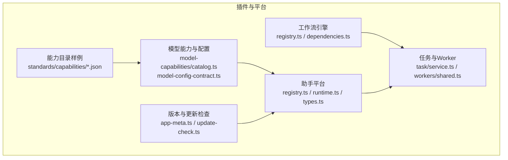
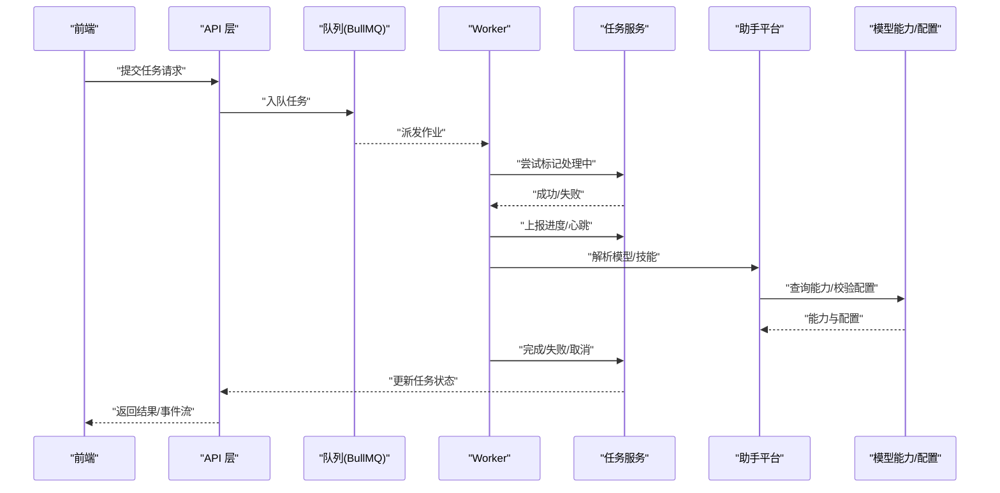
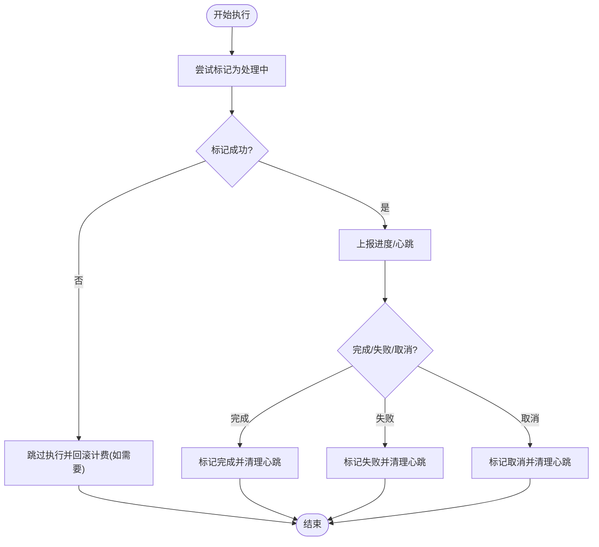
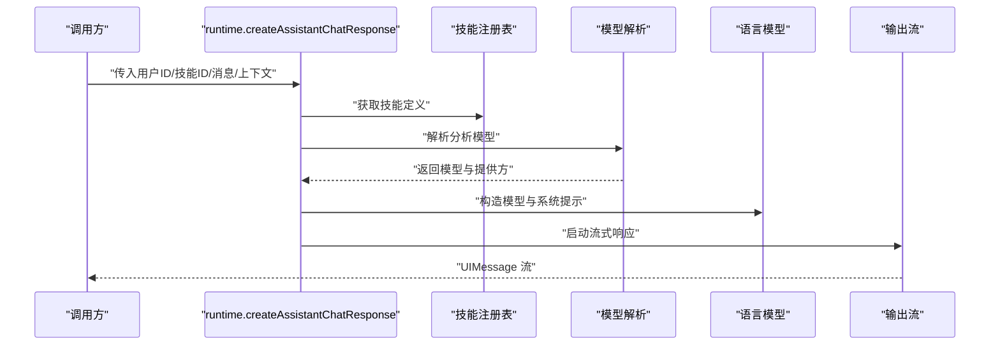
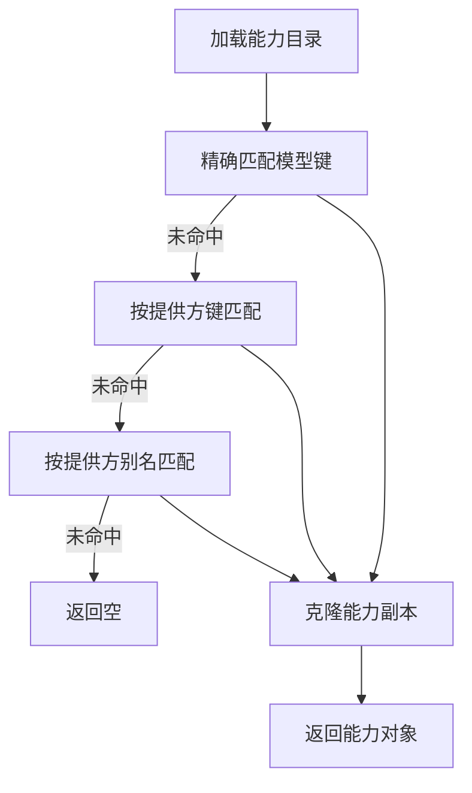
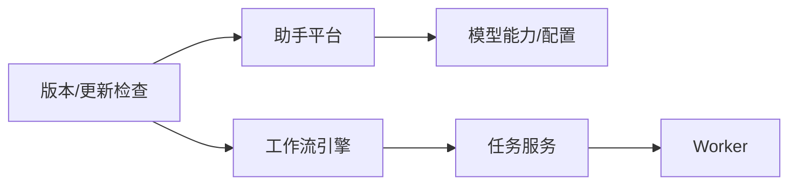

# 插件开发

<cite>
**本文引用的文件**
- [package.json](file://package.json)
- [src/lib/workflow-engine/registry.ts](file://src/lib/workflow-engine/registry.ts)
- [src/lib/workflow-engine/dependencies.ts](file://src/lib/workflow-engine/dependencies.ts)
- [src/lib/assistant-platform/registry.ts](file://src/lib/assistant-platform/registry.ts)
- [src/lib/assistant-platform/runtime.ts](file://src/lib/assistant-platform/runtime.ts)
- [src/lib/assistant-platform/types.ts](file://src/lib/assistant-platform/types.ts)
- [standards/capabilities/catalog.example.json](file://standards/capabilities/catalog.example.json)
- [standards/capabilities/image-video.catalog.json](file://standards/capabilities/image-video.catalog.json)
- [src/lib/model-capabilities/catalog.ts](file://src/lib/model-capabilities/catalog.ts)
- [src/lib/model-config-contract.ts](file://src/lib/model-config-contract.ts)
- [src/lib/workers/shared.ts](file://src/lib/workers/shared.ts)
- [src/lib/task/service.ts](file://src/lib/task/service.ts)
- [src/lib/task/state-service.ts](file://src/lib/task/state-service.ts)
- [src/lib/app-meta.ts](file://src/lib/app-meta.ts)
- [src/lib/update-check.ts](file://src/lib/update-check.ts)
- [scripts/check-capability-catalog.mjs](file://scripts/check-capability-catalog.mjs)
- [scripts/check-model-config-contract.mjs](file://scripts/check-model-config-contract.mjs)
- [scripts/guards/no-hardcoded-model-capabilities.mjs](file://scripts/guards/no-hardcoded-model-capabilities.mjs)
- [tests/unit/assets/registry.test.ts](file://tests/unit/assets/registry.test.ts)
- [tests/unit/helpers/task-state-service.test.ts](file://tests/unit/helpers/task-state-service.test.ts)
- [tests/unit/helpers/update-check.test.ts](file://tests/unit/helpers/update-check.test.ts)
</cite>

## 目录
1. [简介](#简介)
2. [项目结构](#项目结构)
3. [核心组件](#核心组件)
4. [架构总览](#架构总览)
5. [详细组件分析](#详细组件分析)
6. [依赖关系分析](#依赖关系分析)
7. [性能考量](#性能考量)
8. [故障排查指南](#故障排查指南)
9. [结论](#结论)
10. [附录](#附录)

## 简介
本指南面向在 Waoowaoo 平台上进行插件开发的工程师，系统阐述插件架构设计、生命周期与注册机制、AI 模型插件与工作流引擎插件的开发规范、打包分发与版本管理策略，并提供最佳实践（错误处理、性能优化、安全考虑）、完整示例路径与调试方法。读者无需深入源码即可按图索骥完成高质量插件开发。

## 项目结构
Waoowaoo 的插件能力主要由以下模块构成：
- 工作流引擎：定义工作流步骤、依赖与重试失效范围解析。
- 助手平台：定义技能（Skill）注册表、运行时与工具集。
- 模型能力与配置：内置能力目录、能力校验、配置契约校验。
- 任务与 Worker：任务状态服务、Worker 执行与心跳、进度上报。
- 版本与更新检查：应用版本、语义化版本比较与 GitHub 发布检查。
- 校验与守卫：能力目录与配置契约的静态校验脚本，避免硬编码常量等违规。

**图表来源**
- [src/lib/workflow-engine/registry.ts:1-215](file://src/lib/workflow-engine/registry.ts#L1-L215)
- [src/lib/workflow-engine/dependencies.ts:1-10](file://src/lib/workflow-engine/dependencies.ts#L1-L10)
- [src/lib/assistant-platform/registry.ts:1-17](file://src/lib/assistant-platform/registry.ts#L1-L17)
- [src/lib/assistant-platform/runtime.ts:1-131](file://src/lib/assistant-platform/runtime.ts#L1-L131)
- [src/lib/assistant-platform/types.ts:1-59](file://src/lib/assistant-platform/types.ts#L1-L59)
- [src/lib/model-capabilities/catalog.ts:169-223](file://src/lib/model-capabilities/catalog.ts#L169-L223)
- [src/lib/model-config-contract.ts:246-282](file://src/lib/model-config-contract.ts#L246-L282)
- [standards/capabilities/catalog.example.json:1-50](file://standards/capabilities/catalog.example.json#L1-L50)
- [src/lib/task/service.ts:375-504](file://src/lib/task/service.ts#L375-L504)
- [src/lib/workers/shared.ts:333-675](file://src/lib/workers/shared.ts#L333-L675)
- [src/lib/app-meta.ts:1-16](file://src/lib/app-meta.ts#L1-L16)
- [src/lib/update-check.ts:1-134](file://src/lib/update-check.ts#L1-L134)

**章节来源**
- [package.json:1-186](file://package.json#L1-L186)

## 核心组件
- 工作流引擎
  - 定义工作流类型、有序步骤、依赖关系、可重试性、产物类型与失败模式。
  - 提供重试失效步骤键集合解析函数，用于在部分步骤失败或重试时，正确回滚受影响的下游步骤。
- 助手平台
  - 技能注册表：集中声明可用技能 ID 与定义。
  - 运行时：解析用户模型配置、选择语言模型、构造工具集与系统提示，驱动对话流式响应。
  - 类型：定义技能、上下文、运行时上下文与工具结果的数据契约。
- 模型能力与配置
  - 内置能力目录：按模型类型与提供方聚合能力选项，支持别名映射与缓存。
  - 配置契约校验：对能力命名空间、字段合法性、国际化标签等进行严格校验。
  - 能力目录校验脚本：确保目录结构与字段符合约定。
- 任务与 Worker
  - 任务服务：标记任务状态（处理中/完成/失败/取消）、心跳、进度更新、外部 ID 绑定。
  - Worker 共享：接收队列作业、尝试进入处理态、上报进度、记录日志、抛出不可恢复错误以触发上层状态机。
  - 任务状态服务：标准化布尔/字符串/对象/进度值归一化，构建空闲态。
- 版本与更新检查
  - 应用版本：从包配置读取版本号并校验。
  - 语义化版本：规范化、解析、比较；GitHub 发布检查返回“无发布/无需更新/可更新/错误”等结果。

**章节来源**
- [src/lib/workflow-engine/registry.ts:1-215](file://src/lib/workflow-engine/registry.ts#L1-L215)
- [src/lib/workflow-engine/dependencies.ts:1-10](file://src/lib/workflow-engine/dependencies.ts#L1-L10)
- [src/lib/assistant-platform/registry.ts:1-17](file://src/lib/assistant-platform/registry.ts#L1-L17)
- [src/lib/assistant-platform/runtime.ts:1-131](file://src/lib/assistant-platform/runtime.ts#L1-L131)
- [src/lib/assistant-platform/types.ts:1-59](file://src/lib/assistant-platform/types.ts#L1-L59)
- [src/lib/model-capabilities/catalog.ts:169-223](file://src/lib/model-capabilities/catalog.ts#L169-L223)
- [src/lib/model-config-contract.ts:246-282](file://src/lib/model-config-contract.ts#L246-L282)
- [standards/capabilities/catalog.example.json:1-50](file://standards/capabilities/catalog.example.json#L1-L50)
- [src/lib/task/service.ts:375-504](file://src/lib/task/service.ts#L375-L504)
- [src/lib/workers/shared.ts:333-675](file://src/lib/workers/shared.ts#L333-L675)
- [src/lib/task/state-service.ts:1-31](file://src/lib/task/state-service.ts#L1-L31)
- [src/lib/app-meta.ts:1-16](file://src/lib/app-meta.ts#L1-L16)
- [src/lib/update-check.ts:1-134](file://src/lib/update-check.ts#L1-L134)

## 架构总览
下图展示插件体系在运行期的交互：前端通过 API 触发任务，Worker 从队列拉取任务并执行，期间通过任务服务更新状态与进度；助手平台根据用户配置与技能定义生成对话流；模型能力目录与配置契约保障能力声明与配置合法。

**图表来源**
- [src/lib/workers/shared.ts:333-675](file://src/lib/workers/shared.ts#L333-L675)
- [src/lib/task/service.ts:375-504](file://src/lib/task/service.ts#L375-L504)
- [src/lib/assistant-platform/runtime.ts:77-131](file://src/lib/assistant-platform/runtime.ts#L77-L131)
- [src/lib/model-capabilities/catalog.ts:169-223](file://src/lib/model-capabilities/catalog.ts#L169-L223)
- [src/lib/model-config-contract.ts:246-282](file://src/lib/model-config-contract.ts#L246-L282)

## 详细组件分析

### 工作流引擎插件开发
- 任务类型与步骤定义
  - 使用工作流定义描述步骤键、前置依赖、是否可重试、产物类型与失败模式。
  - 通过重试失效解析函数，确保在部分步骤失败时，仅回滚受影响的下游步骤，提升健壮性。
- Worker 注册与状态管理
  - Worker 接收队列作业后，先尝试将任务标记为“处理中”，再上报进度、记录心跳，最后根据结果标记完成/失败/取消。
  - 任务服务提供统一的状态变更接口，保证并发安全与幂等。
- 示例路径
  - 步骤定义与失效解析：[工作流定义与解析函数:1-215](file://src/lib/workflow-engine/registry.ts#L1-L215)
  - Worker 生命周期与进度上报：[Worker 共享逻辑:333-675](file://src/lib/workers/shared.ts#L333-L675)
  - 任务状态变更接口：[任务服务:375-504](file://src/lib/task/service.ts#L375-L504)

**图表来源**
- [src/lib/workers/shared.ts:333-675](file://src/lib/workers/shared.ts#L333-L675)
- [src/lib/task/service.ts:375-504](file://src/lib/task/service.ts#L375-L504)

**章节来源**
- [src/lib/workflow-engine/registry.ts:1-215](file://src/lib/workflow-engine/registry.ts#L1-L215)
- [src/lib/workflow-engine/dependencies.ts:1-10](file://src/lib/workflow-engine/dependencies.ts#L1-L10)
- [src/lib/workers/shared.ts:333-675](file://src/lib/workers/shared.ts#L333-L675)
- [src/lib/task/service.ts:375-504](file://src/lib/task/service.ts#L375-L504)

### 助手平台插件（技能）开发
- 技能注册与运行时
  - 在注册表中声明技能 ID 与定义，运行时根据用户配置解析模型、构造系统提示与工具集，驱动流式对话。
  - 类型定义明确上下文、运行时上下文与工具结果的数据结构。
- 示例路径
  - 技能注册表：[技能注册:1-17](file://src/lib/assistant-platform/registry.ts#L1-L17)
  - 运行时实现：[助手运行时:1-131](file://src/lib/assistant-platform/runtime.ts#L1-L131)
  - 类型定义：[助手类型:1-59](file://src/lib/assistant-platform/types.ts#L1-L59)

**图表来源**
- [src/lib/assistant-platform/runtime.ts:77-131](file://src/lib/assistant-platform/runtime.ts#L77-L131)
- [src/lib/assistant-platform/registry.ts:1-17](file://src/lib/assistant-platform/registry.ts#L1-L17)
- [src/lib/assistant-platform/types.ts:1-59](file://src/lib/assistant-platform/types.ts#L1-L59)

**章节来源**
- [src/lib/assistant-platform/registry.ts:1-17](file://src/lib/assistant-platform/registry.ts#L1-L17)
- [src/lib/assistant-platform/runtime.ts:1-131](file://src/lib/assistant-platform/runtime.ts#L1-L131)
- [src/lib/assistant-platform/types.ts:1-59](file://src/lib/assistant-platform/types.ts#L1-L59)

### AI 模型插件开发规范
- 模型抽象层实现
  - 通过能力目录按模型类型与提供方聚合能力选项，支持别名映射与缓存，避免硬编码。
  - 运行时根据用户配置解析模型，兼容不同提供方的 SDK。
- 能力声明格式
  - 能力目录采用 JSON 结构，按模型类型声明命名空间与字段，支持国际化标签。
  - 示例参考：[能力目录样例:1-50](file://standards/capabilities/catalog.example.json#L1-L50)、[图像/视频能力目录:1-800](file://standards/capabilities/image-video.catalog.json#L1-L800)。
- 配置验证规则
  - 配置契约校验严格限制命名空间、字段合法性、国际化标签等，禁止未知字段与非法格式。
  - 能力目录校验脚本确保目录结构与字段符合约定。
- 示例路径
  - 能力目录加载与别名映射：[能力目录:169-223](file://src/lib/model-capabilities/catalog.ts#L169-L223)
  - 配置契约校验（字段与 i18n）：[配置契约:246-282](file://src/lib/model-config-contract.ts#L246-L282)
  - 能力目录校验脚本：[能力目录校验:152-187](file://scripts/check-capability-catalog.mjs#L152-L187)
  - 禁止硬编码能力常量守卫：[硬编码守卫:53-73](file://scripts/guards/no-hardcoded-model-capabilities.mjs#L53-L73)

**图表来源**
- [src/lib/model-capabilities/catalog.ts:169-223](file://src/lib/model-capabilities/catalog.ts#L169-L223)

**章节来源**
- [standards/capabilities/catalog.example.json:1-50](file://standards/capabilities/catalog.example.json#L1-L50)
- [standards/capabilities/image-video.catalog.json:1-800](file://standards/capabilities/image-video.catalog.json#L1-L800)
- [src/lib/model-capabilities/catalog.ts:169-223](file://src/lib/model-capabilities/catalog.ts#L169-L223)
- [src/lib/model-config-contract.ts:246-282](file://src/lib/model-config-contract.ts#L246-L282)
- [scripts/check-capability-catalog.mjs:152-187](file://scripts/check-capability-catalog.mjs#L152-L187)
- [scripts/guards/no-hardcoded-model-capabilities.mjs:53-73](file://scripts/guards/no-hardcoded-model-capabilities.mjs#L53-L73)

### 任务类型定义、Worker 注册与状态管理
- 任务类型与步骤
  - 工作流定义包含步骤键、依赖、可重试性、产物类型与失败模式；通过失效解析函数确定重试影响范围。
- Worker 注册
  - Worker 从队列拉取作业，尝试标记为处理中，上报进度与心跳，最终根据结果标记完成/失败/取消。
- 状态管理
  - 任务服务提供统一的状态变更接口，任务状态服务负责参数归一化与空闲态构建。
- 示例路径
  - 工作流定义与失效解析：[工作流注册表:1-215](file://src/lib/workflow-engine/registry.ts#L1-L215)
  - Worker 生命周期：[Worker 共享:333-675](file://src/lib/workers/shared.ts#L333-L675)
  - 任务状态变更接口：[任务服务:375-504](file://src/lib/task/service.ts#L375-L504)
  - 任务状态服务辅助函数：[任务状态服务:1-31](file://src/lib/task/state-service.ts#L1-L31)

**章节来源**
- [src/lib/workflow-engine/registry.ts:1-215](file://src/lib/workflow-engine/registry.ts#L1-L215)
- [src/lib/workers/shared.ts:333-675](file://src/lib/workers/shared.ts#L333-L675)
- [src/lib/task/service.ts:375-504](file://src/lib/task/service.ts#L375-L504)
- [src/lib/task/state-service.ts:1-31](file://src/lib/task/state-service.ts#L1-L31)

## 依赖关系分析
- 组件耦合
  - 助手平台依赖模型能力与配置契约，确保技能运行时具备正确的模型与能力约束。
  - 工作流引擎与任务服务共同驱动 Worker 的执行与状态流转。
- 外部依赖
  - 任务队列使用 BullMQ，日志与监控通过 Worker 日志与任务服务状态写入数据库。
- 版本与更新检查
  - 应用版本来自包配置，更新检查通过 GitHub Releases API 获取最新版本并进行语义化比较。

**图表来源**
- [src/lib/assistant-platform/runtime.ts:1-131](file://src/lib/assistant-platform/runtime.ts#L1-L131)
- [src/lib/model-capabilities/catalog.ts:169-223](file://src/lib/model-capabilities/catalog.ts#L169-L223)
- [src/lib/workflow-engine/registry.ts:1-215](file://src/lib/workflow-engine/registry.ts#L1-L215)
- [src/lib/task/service.ts:375-504](file://src/lib/task/service.ts#L375-L504)
- [src/lib/workers/shared.ts:333-675](file://src/lib/workers/shared.ts#L333-L675)
- [src/lib/app-meta.ts:1-16](file://src/lib/app-meta.ts#L1-L16)
- [src/lib/update-check.ts:1-134](file://src/lib/update-check.ts#L1-L134)

**章节来源**
- [package.json:112-162](file://package.json#L112-L162)

## 性能考量
- 队列与并发
  - 合理设置 Worker 数量与队列优先级，避免热点任务阻塞。
- 心跳与超时
  - Worker 应定期上报心跳，任务服务应设置合理的超时阈值与重试策略。
- 能力缓存
  - 能力目录加载应使用缓存，避免重复解析与 IO。
- 响应流式化
  - 助手平台使用流式响应，降低首字节延迟，提升用户体验。

## 故障排查指南
- 常见问题定位
  - 任务无法进入处理态：检查任务是否处于活跃状态、是否被其他 Worker 占用。
  - Worker 未上报进度：确认进度上报逻辑与日志记录是否正常。
  - 能力声明不合法：检查能力目录与配置契约校验脚本输出。
- 关键测试与守卫
  - 资产种类注册测试：验证资产种类与能力契约稳定性。
  - 任务状态服务测试：验证状态归一化与空闲态构建。
  - 更新检查测试：验证语义化版本比较与 GitHub 发布检查。
- 示例路径
  - 资产种类注册测试：[资产注册测试:1-44](file://tests/unit/assets/registry.test.ts#L1-L44)
  - 任务状态服务测试：[任务状态服务测试:1-31](file://tests/unit/helpers/task-state-service.test.ts#L1-L31)
  - 更新检查测试：[更新检查测试:1-84](file://tests/unit/helpers/update-check.test.ts#L1-L84)

**章节来源**
- [tests/unit/assets/registry.test.ts:1-44](file://tests/unit/assets/registry.test.ts#L1-L44)
- [tests/unit/helpers/task-state-service.test.ts:1-31](file://tests/unit/helpers/task-state-service.test.ts#L1-L31)
- [tests/unit/helpers/update-check.test.ts:1-84](file://tests/unit/helpers/update-check.test.ts#L1-L84)

## 结论
Waoowaoo 的插件体系以“工作流引擎 + 助手平台 + 模型能力与配置”为核心，辅以严格的配置契约与能力目录校验、完善的任务状态与 Worker 生命周期管理，以及版本与更新检查机制。遵循本文档的开发规范与最佳实践，可高效、稳定地扩展 AI 与媒体生成类插件。

## 附录
- 打包与分发
  - 使用包管理器安装依赖与生成构建产物，遵循脚本中的开发与生产命令。
- 版本管理
  - 使用语义化版本与 GitHub Releases，结合更新检查逻辑实现自动升级提示。
- 最佳实践清单
  - 错误处理：Worker 抛出不可恢复错误，任务服务统一记录错误码与消息。
  - 性能优化：合理并发、心跳与缓存、流式响应。
  - 安全考虑：避免硬编码能力常量、严格校验输入与配置、最小权限访问外部服务。

**章节来源**
- [package.json:9-111](file://package.json#L9-L111)
- [src/lib/app-meta.ts:1-16](file://src/lib/app-meta.ts#L1-L16)
- [src/lib/update-check.ts:1-134](file://src/lib/update-check.ts#L1-L134)