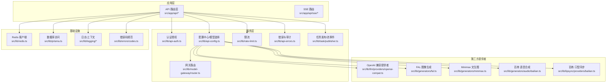
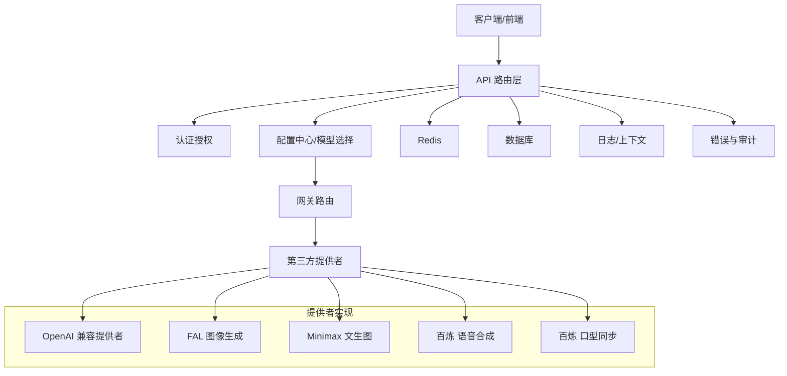
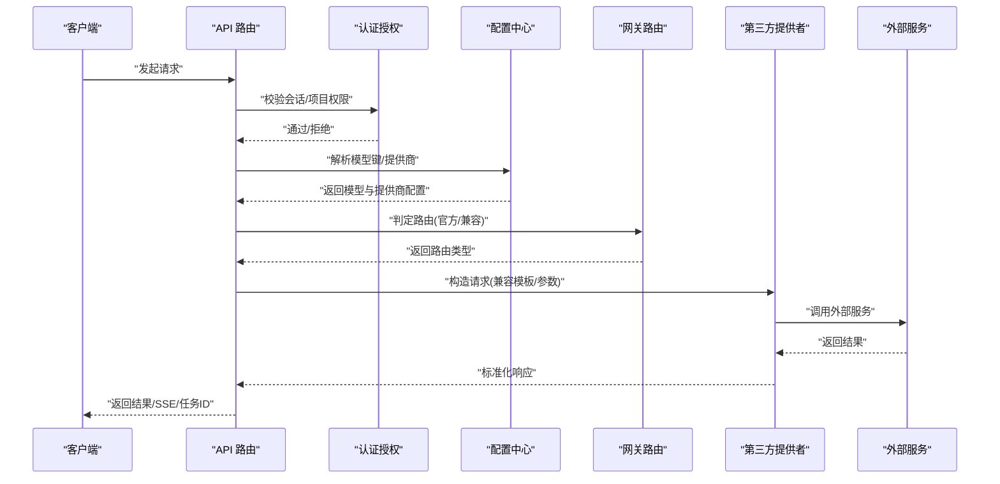
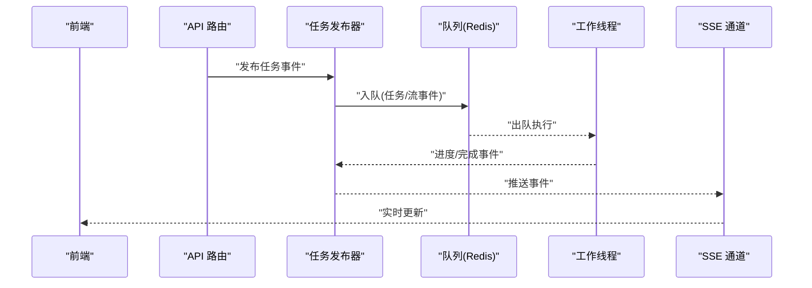
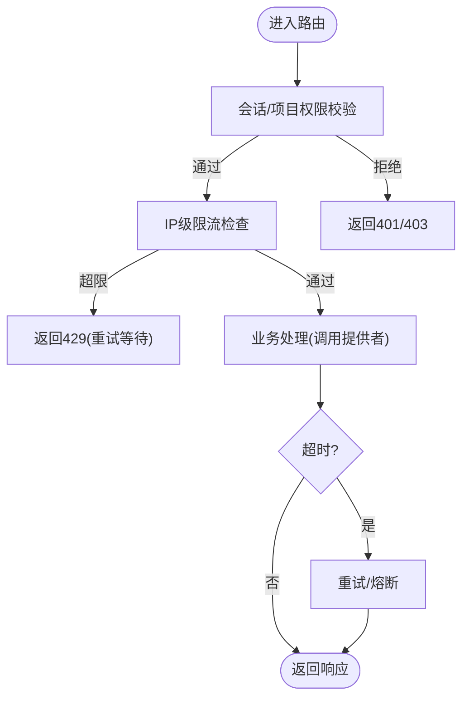
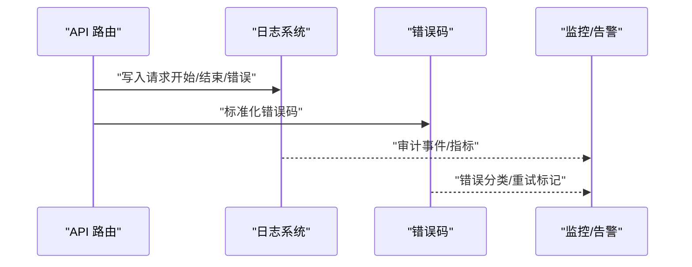
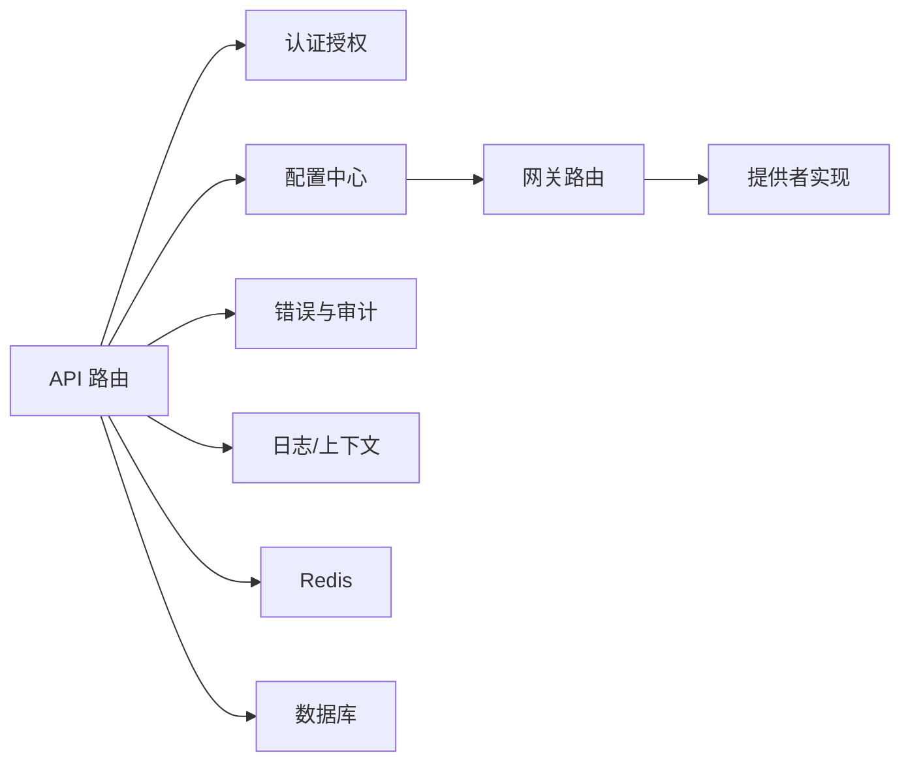

# 第三方服务集成

<cite>
**本文引用的文件**
- [src/lib/api-config.ts](file://src/lib/api-config.ts)
- [src/lib/model-gateway/router.ts](file://src/lib/model-gateway/router.ts)
- [src/lib/model-gateway/types.ts](file://src/lib/model-gateway/types.ts)
- [src/lib/api-auth.ts](file://src/lib/api-auth.ts)
- [src/lib/rate-limit.ts](file://src/lib/rate-limit.ts)
- [src/lib/redis.ts](file://src/lib/redis.ts)
- [src/lib/api-errors.ts](file://src/lib/api-errors.ts)
- [src/lib/llm/providers/openai-compat.ts](file://src/lib/llm/providers/openai-compat.ts)
- [src/lib/generators/fal.ts](file://src/lib/generators/fal.ts)
- [src/lib/generators/minimax.ts](file://src/lib/generators/minimax.ts)
- [src/lib/generators/audio/bailian.ts](file://src/lib/generators/audio/bailian.ts)
- [src/lib/lipsync/providers/bailian.ts](file://src/lib/lipsync/providers/bailian.ts)
- [src/lib/providers/index.ts](file://src/lib/providers/index.ts)
- [src/lib/workflow-engine/index.ts](file://src/lib/workflow-engine/index.ts)
- [src/lib/task/publisher.ts](file://src/lib/task/publisher.ts)
- [src/lib/logging/core.ts](file://src/lib/logging/core.ts)
- [src/lib/logging/context.ts](file://src/lib/logging/context.ts)
- [src/lib/errors/codes.ts](file://src/lib/errors/codes.ts)
- [src/lib/llm-observe/internal-stream-context.ts](file://src/lib/llm-observe/internal-stream-context.ts)
- [src/lib/llm-observe/stage-pipeline.ts](file://src/lib/llm-observe/stage-pipeline.ts)
- [src/lib/task/types.ts](file://src/lib/task/types.ts)
- [src/lib/async-poll.ts](file://src/lib/async-poll.ts)
- [src/lib/async-submit.ts](file://src/lib/async-submit.ts)
- [src/lib/async-task-utils.ts](file://src/lib/async-task-utils.ts)
- [src/lib/workflow-concurrency.ts](file://src/lib/workflow-concurrency.ts)
- [src/lib/model-capabilities/index.ts](file://src/lib/model-capabilities/index.ts)
- [src/lib/model-pricing/index.ts](file://src/lib/model-pricing/index.ts)
- [src/lib/storage/index.ts](file://src/lib/storage/index.ts)
- [src/lib/sse/index.ts](file://src/lib/sse/index.ts)
- [src/lib/workers/index.ts](file://src/lib/workers/index.ts)
- [src/lib/config-service.ts](file://src/lib/config-service.ts)
- [src/lib/crypto-utils.ts](file://src/lib/crypto-utils.ts)
- [src/lib/prisma.ts](file://src/lib/prisma.ts)
- [src/lib/prisma-retry.ts](file://src/lib/prisma-retry.ts)
- [src/lib/env.ts](file://src/lib/env.ts)
- [src/lib/auth.ts](file://src/lib/auth.ts)
- [src/lib/server-boot.ts](file://src/lib/server-boot.ts)
- [src/middleware.ts](file://src/middleware.ts)
- [src/instrumentation.ts](file://src/instrumentation.ts)
- [src/app/api/tasks/route.ts](file://src/app/api/tasks/route.ts)
- [src/app/api/sse/route.ts](file://src/app/api/sse/route.ts)
- [src/app/api/runs/route.ts](file://src/app/api/runs/route.ts)
- [src/app/api/projects/route.ts](file://src/app/api/projects/route.ts)
- [src/app/api/user/route.ts](file://src/app/api/user/route.ts)
- [src/app/api/user-preference/route.ts](file://src/app/api/user-preference/route.ts)
- [src/app/api/system/boot-id/route.ts](file://src/app/api/system/boot-id/route.ts)
- [src/app/api/novel-promotion/[projectId]/route.ts](file://src/app/api/novel-promotion/[projectId]/route.ts)
- [src/app/api/novel-promotion/[projectId]/analyze/route.ts](file://src/app/api/novel-promotion/[projectId]/analyze/route.ts)
- [src/app/api/novel-promotion/[projectId]/character/[characterId]/route.ts](file://src/app/api/novel-promotion/[projectId]/character/[characterId]/route.ts)
- [src/app/api/novel-promotion/[projectId]/assets/route.ts](file://src/app/api/novel-promotion/[projectId]/assets/route.ts)
- [src/app/api/novel-promotion/[projectId]/ai-create-character/route.ts](file://src/app/api/novel-promotion/[projectId]/ai-create-character/route.ts)
- [src/app/api/novel-promotion/[projectId]/ai-create-location/route.ts](file://src/app/api/novel-promotion/[projectId]/ai-create-location/route.ts)
- [src/app/api/novel-promotion/[projectId]/ai-modify-appearance/route.ts](file://src/app/api/novel-promotion/[projectId]/ai-modify-appearance/route.ts)
- [src/app/api/novel-promotion/[projectId]/ai-modify-location/route.ts](file://src/app/api/novel-promotion/[projectId]/ai-modify-location/route.ts)
- [src/app/api/novel-promotion/[projectId]/ai-modify-prop/route.ts](file://src/app/api/novel-promotion/[projectId]/ai-modify-prop/route.ts)
- [src/app/api/novel-promotion/[projectId]/ai-modify-shot-prompt/route.ts](file://src/app/api/novel-promotion/[projectId]/ai-modify-shot-prompt/route.ts)
- [src/app/api/novel-promotion/[projectId]/analyze-global/route.ts](file://src/app/api/novel-promotion/[projectId]/analyze-global/route.ts)
- [src/app/api/novel-promotion/[projectId]/analyze-shot-variants/route.ts](file://src/app/api/novel-promotion/[projectId]/analyze-shot-variants/route.ts)
- [src/app/api/novel-promotion/[projectId]/character-profile/route.ts](file://src/app/api/novel-promotion/[projectId]/character-profile/route.ts)
- [src/app/api/novel-promotion/[projectId]/character-voice/route.ts](file://src/app/api/novel-promotion/[projectId]/character-voice/route.ts)
- [src/app/api/novel-promotion/[projectId]/character/[characterId]/ai-modify-appearance/route.ts](file://src/app/api/novel-promotion/[projectId]/character/[characterId]/ai-modify-appearance/route.ts)
- [src/app/api/novel-promotion/[projectId]/character/[characterId]/ai-modify-location/route.ts](file://src/app/api/novel-promotion/[projectId]/character/[characterId]/ai-modify-location/route.ts)
- [src/app/api/novel-promotion/[projectId]/character/[characterId]/ai-modify-prop/route.ts](file://src/app/api/novel-promotion/[projectId]/character/[characterId]/ai-modify-prop/route.ts)
- [src/app/api/novel-promotion/[projectId]/character/[characterId]/ai-modify-shot-prompt/route.ts](file://src/app/api/novel-promotion/[projectId]/character/[characterId]/ai-modify-shot-prompt/route.ts)
- [src/app/api/novel-promotion/[projectId]/character/[characterId]/ai-modify-character/route.ts](file://src/app/api/novel-promotion/[projectId]/character/[characterId]/ai-modify-character/route.ts)
- [src/app/api/novel-promotion/[projectId]/character/[characterId]/ai-modify-character/route.ts](file://src/app/api/novel-promotion/[projectId]/character/[characterId]/ai-modify-character/route.ts)
- [src/app/api/novel-promotion/[projectId]/character/[characterId]/ai-modify-character/route.ts](file://src/app/api/novel-promotion/[projectId]/character/[characterId]/ai-modify-character/route.ts)
- [src/app/api/novel-promotion/[projectId]/character/[characterId]/ai-modify-character/route.ts](file://src/app/api/novel-promotion/[projectId]/character/[characterId]/ai-modify-character/route.ts)
- [src/app/api/novel-promotion/[projectId]/character/[characterId]/ai-modify-character/route.ts](file://src/app/api/novel-promotion/[projectId]/character/[characterId]/ai-modify-character/route.ts)
- [src/app/api/novel-promotion/[projectId]/character/[characterId]/ai-modify-character/route.ts](file://src/app/api/novel-promotion/[projectId]/character/[characterId]/ai-modify-character/route.ts)
- [src/app/api/novel-promotion/[projectId]/character/[characterId]/ai-modify-character/route.ts](file://src/app/api/novel-promotion/[projectId]/character/[characterId]/ai-modify-character/route.ts)
- [src/app/api/novel-promotion/[projectId]/character/[characterId]/ai-modify-character/route.ts](file://src/app/api/novel-promotion/[projectId]/character/[characterId]/ai-modify-character/route.ts)
- [src/app/api/novel-promotion/[projectId]/character/[characterId]/ai-modify-character/route.ts](file://src/app/api/novel-promotion/[projectId]/character/[characterId]/ai-modify-character/route.ts)
- [src/app/api/novel-promotion/[projectId]/character/[characterId]/ai-modify-character/route.ts](file://src/app/api/novel-promotion/[projectId]/character/[characterId]/ai-modify-character/route......
</cite>

## 目录
1. [引言](#引言)
2. [项目结构](#项目结构)
3. [核心组件](#核心组件)
4. [架构总览](#架构总览)
5. [详细组件分析](#详细组件分析)
6. [依赖关系分析](#依赖关系分析)
7. [性能考量](#性能考量)
8. [故障排查指南](#故障排查指南)
9. [结论](#结论)
10. [附录](#附录)

## 引言
本技术指南面向在Waoowaoo中集成第三方服务（LLM、图像生成、视频生成、语音合成、口型同步等）的开发者，系统阐述API适配器设计模式、协议转换机制、RESTful API、WebSocket与消息队列的集成方案，以及服务发现、健康检查、故障转移策略。同时覆盖认证授权、请求限流、超时处理、监控与日志、服务版本管理、兼容性测试与回滚策略，并提供最佳实践与常见问题解决方案。

## 项目结构
Waoowaoo采用Next.js应用结构，核心第三方服务集成能力集中在以下模块：
- 配置中心与模型选择：统一解析用户配置、模型键、提供商路由
- 网关路由：根据提供商类型自动选择官方或OpenAI兼容路由
- 认证授权：基于NextAuth的会话与项目级权限控制
- 限流：基于Redis的滑动窗口限流
- 日志与错误：统一请求ID、审计日志、错误码与标准化错误响应
- 任务与工作流：异步任务发布、事件流、并发控制
- SSE与WebSocket：实时进度推送
- 存储与媒体：对象存储签名与媒体归档
- 监控与可观测性：日志、指标、告警接入点

**图表来源**
- [src/lib/api-config.ts:1-509](file://src/lib/api-config.ts#L1-L509)
- [src/lib/model-gateway/router.ts:1-22](file://src/lib/model-gateway/router.ts#L1-L22)
- [src/lib/api-auth.ts:1-355](file://src/lib/api-auth.ts#L1-L355)
- [src/lib/rate-limit.ts:1-146](file://src/lib/rate-limit.ts#L1-L146)
- [src/lib/api-errors.ts:1-571](file://src/lib/api-errors.ts#L1-L571)
- [src/lib/redis.ts:1-76](file://src/lib/redis.ts#L1-L76)
- [src/lib/prisma.ts](file://src/lib/prisma.ts)
- [src/lib/logging/core.ts](file://src/lib/logging/core.ts)
- [src/lib/logging/context.ts](file://src/lib/logging/context.ts)
- [src/lib/errors/codes.ts](file://src/lib/errors/codes.ts)
- [src/lib/llm/providers/openai-compat.ts](file://src/lib/llm/providers/openai-compat.ts)
- [src/lib/generators/fal.ts](file://src/lib/generators/fal.ts)
- [src/lib/generators/minimax.ts](file://src/lib/generators/minimax.ts)
- [src/lib/generators/audio/bailian.ts](file://src/lib/generators/audio/bailian.ts)
- [src/lib/lipsync/providers/bailian.ts](file://src/lib/lipsync/providers/bailian.ts)

**章节来源**
- [src/lib/api-config.ts:1-509](file://src/lib/api-config.ts#L1-L509)
- [src/lib/model-gateway/router.ts:1-22](file://src/lib/model-gateway/router.ts#L1-L22)
- [src/lib/api-auth.ts:1-355](file://src/lib/api-auth.ts#L1-L355)
- [src/lib/rate-limit.ts:1-146](file://src/lib/rate-limit.ts#L1-L146)
- [src/lib/api-errors.ts:1-571](file://src/lib/api-errors.ts#L1-L571)
- [src/lib/redis.ts:1-76](file://src/lib/redis.ts#L1-L76)

## 核心组件
- 配置中心与模型选择：解析用户自定义提供商与模型，严格校验模型键，提供统一的提供商配置与模型选择接口，支持OpenAI兼容媒体模板与协议探测。
- 网关路由：根据提供商类型自动判定走官方还是OpenAI兼容路由，确保协议一致性。
- 认证授权：集中处理会话、内部任务令牌、项目权限与资源所有权校验，统一错误响应。
- 限流：基于Redis滑动窗口实现IP级限流，预置登录/注册阈值，异常情况下安全降级。
- 错误与审计：统一请求ID、审计日志、错误码映射与标准化错误响应，支持内部任务流回调。
- 日志与上下文：请求级日志上下文绑定，支持审计事件输出。
- 任务与事件：任务进度与流事件发布，支持内部任务流回调与持久化。
- SSE与WebSocket：SSE路由用于实时进度推送，配合任务事件系统。
- 存储与媒体：对象存储签名与媒体归档，保障外部资源访问安全。
- 监控与可观测性：日志、错误码、审计事件、任务事件构成基础监控面。

**章节来源**
- [src/lib/api-config.ts:1-509](file://src/lib/api-config.ts#L1-L509)
- [src/lib/model-gateway/router.ts:1-22](file://src/lib/model-gateway/router.ts#L1-L22)
- [src/lib/api-auth.ts:1-355](file://src/lib/api-auth.ts#L1-L355)
- [src/lib/rate-limit.ts:1-146](file://src/lib/rate-limit.ts#L1-L146)
- [src/lib/api-errors.ts:1-571](file://src/lib/api-errors.ts#L1-L571)
- [src/lib/logging/core.ts](file://src/lib/logging/core.ts)
- [src/lib/logging/context.ts](file://src/lib/logging/context.ts)
- [src/lib/task/publisher.ts](file://src/lib/task/publisher.ts)
- [src/lib/sse/index.ts](file://src/lib/sse/index.ts)

## 架构总览
下图展示第三方服务集成的整体架构：API路由层负责入口与鉴权，配置中心解析模型与提供商，网关路由决定协议，具体提供者执行调用，Redis与数据库提供基础设施支撑，日志与错误系统贯穿始终。

**图表来源**
- [src/lib/api-config.ts:1-509](file://src/lib/api-config.ts#L1-L509)
- [src/lib/model-gateway/router.ts:1-22](file://src/lib/model-gateway/router.ts#L1-L22)
- [src/lib/llm/providers/openai-compat.ts](file://src/lib/llm/providers/openai-compat.ts)
- [src/lib/generators/fal.ts](file://src/lib/generators/fal.ts)
- [src/lib/generators/minimax.ts](file://src/lib/generators/minimax.ts)
- [src/lib/generators/audio/bailian.ts](file://src/lib/generators/audio/bailian.ts)
- [src/lib/lipsync/providers/bailian.ts](file://src/lib/lipsync/providers/bailian.ts)

## 详细组件分析

### API适配器与协议转换
- 设计模式：以“配置中心 + 网关路由 + 提供者实现”的分层适配器模式，屏蔽第三方差异，统一对外协议。
- 协议转换：
  - OpenAI兼容：统一聊天补全与媒体模板渲染，支持图片/视频生成的兼容模板。
  - 官方协议：针对特定提供商（如百炼）的官方SDK或HTTP接口。
- 关键流程：
  - 解析模型键与提供商，校验启用状态。
  - 根据提供商类型选择路由（官方/兼容）。
  - 渲染兼容模板（如适用），构造请求参数。
  - 发起调用并处理响应，统一错误与重试策略。

**图表来源**
- [src/lib/api-auth.ts:173-292](file://src/lib/api-auth.ts#L173-L292)
- [src/lib/api-config.ts:323-352](file://src/lib/api-config.ts#L323-L352)
- [src/lib/model-gateway/router.ts:17-21](file://src/lib/model-gateway/router.ts#L17-L21)
- [src/lib/llm/providers/openai-compat.ts](file://src/lib/llm/providers/openai-compat.ts)
- [src/lib/generators/fal.ts](file://src/lib/generators/fal.ts)
- [src/lib/generators/minimax.ts](file://src/lib/generators/minimax.ts)
- [src/lib/generators/audio/bailian.ts](file://src/lib/generators/audio/bailian.ts)
- [src/lib/lipsync/providers/bailian.ts](file://src/lib/lipsync/providers/bailian.ts)

**章节来源**
- [src/lib/api-config.ts:113-352](file://src/lib/api-config.ts#L113-L352)
- [src/lib/model-gateway/router.ts:1-22](file://src/lib/model-gateway/router.ts#L1-L22)
- [src/lib/model-gateway/types.ts:1-46](file://src/lib/model-gateway/types.ts#L1-L46)

### RESTful API、WebSocket与消息队列集成
- RESTful API：
  - 路由组织：按功能域划分（novel-promotion、asset-hub、user等），统一使用Next.js App Router。
  - 统一错误与审计：通过包装器捕获异常、设置请求ID、记录审计事件。
- WebSocket/SSE：
  - SSE路由：用于实时进度推送，结合任务事件发布器，前端可订阅。
  - 任务事件：内部任务通过事件发布器推送进度与流事件，支持持久化。
- 消息队列：
  - 使用Redis作为队列后端（BullMQ风格），通过专用Redis实例承载作业队列，具备重试与失败处理能力。
  - 任务并发控制：通过并发门禁与队列策略控制吞吐。

**图表来源**
- [src/lib/task/publisher.ts](file://src/lib/task/publisher.ts)
- [src/lib/workers/index.ts](file://src/lib/workers/index.ts)
- [src/lib/redis.ts:1-76](file://src/lib/redis.ts#L1-L76)
- [src/lib/sse/index.ts](file://src/lib/sse/index.ts)

**章节来源**
- [src/lib/api-errors.ts:440-562](file://src/lib/api-errors.ts#L440-L562)
- [src/lib/task/publisher.ts](file://src/lib/task/publisher.ts)
- [src/lib/workers/index.ts](file://src/lib/workers/index.ts)
- [src/lib/redis.ts:1-76](file://src/lib/redis.ts#L1-L76)
- [src/app/api/sse/route.ts](file://src/app/api/sse/route.ts)

### 服务发现、健康检查与故障转移
- 服务发现：通过配置中心统一管理提供商URL与路由类型，避免硬编码。
- 健康检查：建议在网关层对关键提供商进行探活（如ping接口或轻量调用），失败时切换至备用路由或降级。
- 故障转移：在提供者实现中增加重试与熔断策略，必要时回退到兼容协议或本地缓存。

**章节来源**
- [src/lib/api-config.ts:62-85](file://src/lib/api-config.ts#L62-L85)
- [src/lib/model-gateway/router.ts:1-22](file://src/lib/model-gateway/router.ts#L1-L22)

### 认证授权、请求限流与超时处理
- 认证授权：
  - 会话校验：NextAuth会话与内部任务令牌双重校验。
  - 项目权限：所有权校验与可选关联数据加载。
- 请求限流：
  - 基于Redis滑动窗口，区分动作维度（如登录/注册），异常时安全降级。
- 超时处理：
  - 外部调用设置合理超时，结合重试与指数退避，避免级联故障。

**图表来源**
- [src/lib/api-auth.ts:173-292](file://src/lib/api-auth.ts#L173-L292)
- [src/lib/rate-limit.ts:58-118](file://src/lib/rate-limit.ts#L58-L118)
- [src/lib/api-errors.ts:504-558](file://src/lib/api-errors.ts#L504-L558)

**章节来源**
- [src/lib/api-auth.ts:1-355](file://src/lib/api-auth.ts#L1-L355)
- [src/lib/rate-limit.ts:1-146](file://src/lib/rate-limit.ts#L1-L146)
- [src/lib/api-errors.ts:1-571](file://src/lib/api-errors.ts#L1-L571)

### 监控集成（指标、日志、告警）
- 指标与日志：
  - 请求ID贯穿全链路，审计事件记录关键操作。
  - 日志上下文绑定用户、项目、任务等上下文。
- 告警：
  - 基于错误码分类与重试标记，结合外部监控系统（如Prometheus/Grafana）建立告警规则。

**图表来源**
- [src/lib/api-errors.ts:440-562](file://src/lib/api-errors.ts#L440-L562)
- [src/lib/logging/core.ts](file://src/lib/logging/core.ts)
- [src/lib/logging/context.ts](file://src/lib/logging/context.ts)
- [src/lib/errors/codes.ts](file://src/lib/errors/codes.ts)

**章节来源**
- [src/lib/api-errors.ts:1-571](file://src/lib/api-errors.ts#L1-L571)
- [src/lib/logging/core.ts](file://src/lib/logging/core.ts)
- [src/lib/logging/context.ts](file://src/lib/logging/context.ts)
- [src/lib/errors/codes.ts](file://src/lib/errors/codes.ts)

### 版本管理、兼容性测试与回滚策略
- 版本管理：
  - 通过模型键（provider::modelId）与兼容模板版本控制，避免硬编码。
- 兼容性测试：
  - 提供者契约测试（contract test）与集成测试矩阵，覆盖路由、协议、模板渲染。
- 回滚策略：
  - 通过配置中心切换提供商与模板版本，快速回滚；任务系统支持重试与补偿。

**章节来源**
- [src/lib/api-config.ts:1-509](file://src/lib/api-config.ts#L1-L509)
- [src/lib/workflow-engine/index.ts](file://src/lib/workflow-engine/index.ts)
- [src/lib/async-task-utils.ts](file://src/lib/async-task-utils.ts)

## 依赖关系分析

**图表来源**
- [src/lib/api-auth.ts:1-355](file://src/lib/api-auth.ts#L1-L355)
- [src/lib/api-config.ts:1-509](file://src/lib/api-config.ts#L1-L509)
- [src/lib/model-gateway/router.ts:1-22](file://src/lib/model-gateway/router.ts#L1-L22)
- [src/lib/api-errors.ts:1-571](file://src/lib/api-errors.ts#L1-L571)
- [src/lib/logging/core.ts](file://src/lib/logging/core.ts)
- [src/lib/logging/context.ts](file://src/lib/logging/context.ts)
- [src/lib/redis.ts:1-76](file://src/lib/redis.ts#L1-L76)
- [src/lib/prisma.ts](file://src/lib/prisma.ts)

**章节来源**
- [src/lib/api-auth.ts:1-355](file://src/lib/api-auth.ts#L1-L355)
- [src/lib/api-config.ts:1-509](file://src/lib/api-config.ts#L1-L509)
- [src/lib/model-gateway/router.ts:1-22](file://src/lib/model-gateway/router.ts#L1-L22)
- [src/lib/api-errors.ts:1-571](file://src/lib/api-errors.ts#L1-L571)
- [src/lib/redis.ts:1-76](file://src/lib/redis.ts#L1-L76)
- [src/lib/prisma.ts](file://src/lib/prisma.ts)

## 性能考量
- 缓存与降级：Redis缓存热点配置与限流状态，异常时安全降级。
- 并发与限流：队列与并发门禁控制吞吐，避免下游过载。
- 超时与重试：合理设置超时与指数退避，避免雪崩。
- 日志与审计：减少高成本日志，保留关键审计事件。

## 故障排查指南
- 常见错误与定位：
  - 401/403：检查会话与内部任务令牌；确认项目所有权。
  - 429：查看限流配置与剩余配额；调整阈值或客户端退避。
  - 5xx：检查错误码分类与重试标记；关注外部服务可用性。
- 日志与审计：
  - 通过请求ID关联日志；审计事件定位用户操作轨迹。
- 任务与事件：
  - 检查队列状态与工作线程健康；确认事件发布与SSE订阅。

**章节来源**
- [src/lib/api-auth.ts:145-163](file://src/lib/api-auth.ts#L145-L163)
- [src/lib/rate-limit.ts:114-118](file://src/lib/rate-limit.ts#L114-L118)
- [src/lib/api-errors.ts:504-558](file://src/lib/api-errors.ts#L504-L558)
- [src/lib/logging/context.ts](file://src/lib/logging/context.ts)

## 结论
Waoowaoo通过“配置中心 + 网关路由 + 提供者实现”的分层架构，实现了对多种第三方服务的统一适配与协议转换。结合认证授权、限流、错误与审计、日志与任务事件系统，形成了完整的第三方服务集成方案。建议在生产环境中完善健康检查与故障转移、加强监控与告警、持续进行兼容性测试与回滚演练，以确保系统的稳定性与可维护性。

## 附录
- 最佳实践：
  - 明确模型键与提供商路由，避免猜测与默认降级。
  - 使用兼容模板与协议探测，保证跨提供商一致性。
  - 合理设置限流与超时，结合重试与熔断。
  - 通过审计事件与日志上下文实现可追溯性。
- 常见问题：
  - 模型键格式错误：确保使用 provider::modelId 格式。
  - 路由类型不匹配：检查提供商类型与路由判定逻辑。
  - 限流触发：优化阈值或客户端退避策略。
  - 任务无进度：检查队列、工作线程与SSE订阅。