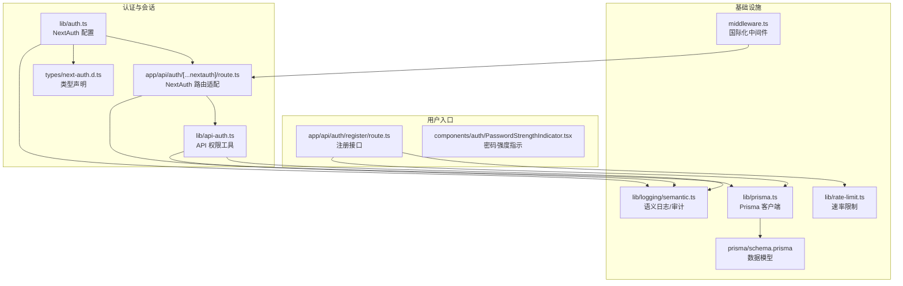
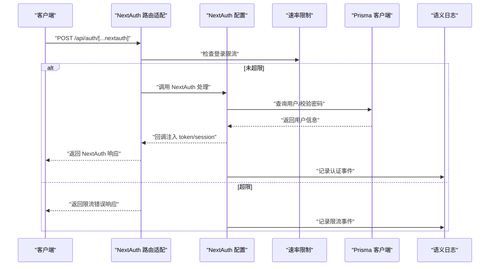
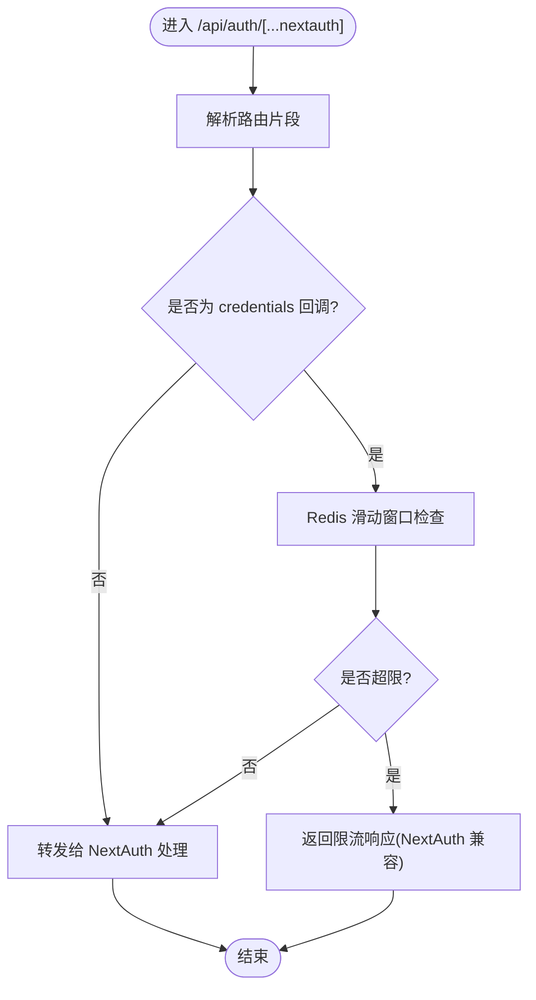
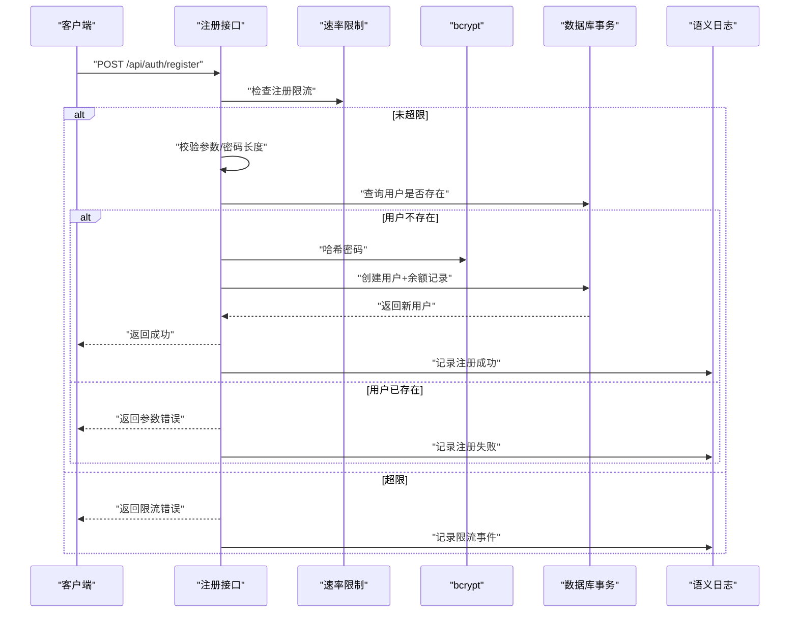
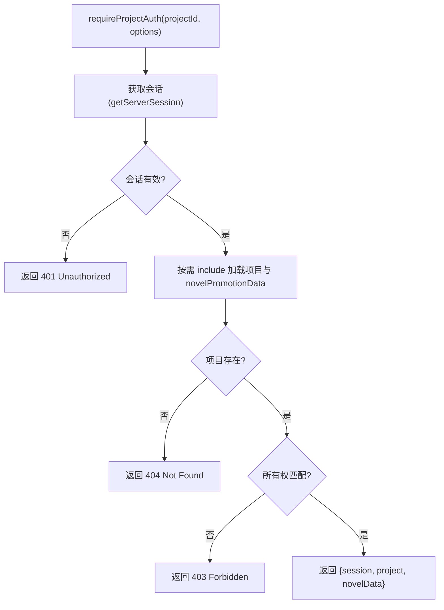
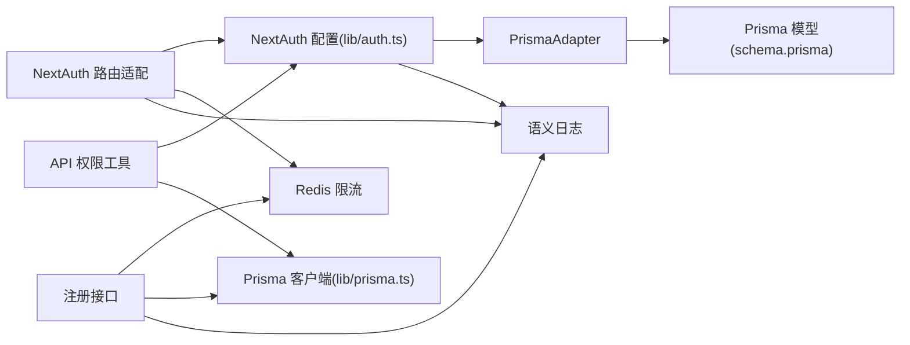

# 认证方式扩展

<cite>
**本文引用的文件**
- [src/lib/auth.ts](file://src/lib/auth.ts)
- [src/app/api/auth/[...nextauth]/route.ts](file://src/app/api/auth/[...nextauth]/route.ts)
- [src/app/api/auth/register/route.ts](file://src/app/api/auth/register/route.ts)
- [src/types/next-auth.d.ts](file://src/types/next-auth.d.ts)
- [src/lib/logging/semantic.ts](file://src/lib/logging/semantic.ts)
- [src/lib/rate-limit.ts](file://src/lib/rate-limit.ts)
- [src/lib/api-auth.ts](file://src/lib/api-auth.ts)
- [src/components/auth/PasswordStrengthIndicator.tsx](file://src/components/auth/PasswordStrengthIndicator.tsx)
- [src/middleware.ts](file://src/middleware.ts)
- [prisma/schema.prisma](file://prisma/schema.prisma)
- [src/lib/prisma.ts](file://src/lib/prisma.ts)
</cite>

## 目录
1. [引言](#引言)
2. [项目结构](#项目结构)
3. [核心组件](#核心组件)
4. [架构总览](#架构总览)
5. [详细组件分析](#详细组件分析)
6. [依赖分析](#依赖分析)
7. [性能考虑](#性能考虑)
8. [故障排查指南](#故障排查指南)
9. [结论](#结论)
10. [附录](#附录)

## 引言
本指南面向希望在 Waoowaoo 项目中扩展认证能力的开发者，重点围绕 NextAuth 框架的扩展机制与自定义认证提供程序的开发方法，系统讲解 OAuth、OIDC、JWT 等多种认证协议的集成思路；同时覆盖多因素认证、单点登录（SSO）、会话管理、用户权限模型与访问控制扩展、自定义认证流程（回调、用户信息同步、权限验证）、安全最佳实践、性能优化与故障处理策略，并提供测试与调试建议。

## 项目结构
认证相关代码主要分布在以下位置：
- NextAuth 配置与路由适配层：src/lib/auth.ts、src/app/api/auth/[...nextauth]/route.ts
- 注册与登录接口：src/app/api/auth/register/route.ts
- 类型声明：src/types/next-auth.d.ts
- 日志与审计：src/lib/logging/semantic.ts
- 速率限制：src/lib/rate-limit.ts
- API 权限与会话校验：src/lib/api-auth.ts
- 密码强度提示组件：src/components/auth/PasswordStrengthIndicator.tsx
- 国际化中间件：src/middleware.ts
- 数据模型（Prisma）：prisma/schema.prisma
- Prisma 客户端封装：src/lib/prisma.ts



图表来源
- [src/lib/auth.ts:1-79](file://src/lib/auth.ts#L1-L79)
- [src/app/api/auth/[...nextauth]/route.ts:1-50](file://src/app/api/auth/[...nextauth]/route.ts#L1-L50)
- [src/app/api/auth/register/route.ts:1-88](file://src/app/api/auth/register/route.ts#L1-L88)
- [src/types/next-auth.d.ts:1-22](file://src/types/next-auth.d.ts#L1-L22)
- [src/lib/api-auth.ts:1-355](file://src/lib/api-auth.ts#L1-L355)
- [src/lib/logging/semantic.ts:218-236](file://src/lib/logging/semantic.ts#L218-L236)
- [src/lib/rate-limit.ts:1-146](file://src/lib/rate-limit.ts#L1-L146)
- [src/middleware.ts:1-28](file://src/middleware.ts#L1-L28)
- [src/lib/prisma.ts:1-7](file://src/lib/prisma.ts#L1-L7)
- [prisma/schema.prisma:402-429](file://prisma/schema.prisma#L402-L429)

章节来源
- [src/lib/auth.ts:1-79](file://src/lib/auth.ts#L1-L79)
- [src/app/api/auth/[...nextauth]/route.ts:1-50](file://src/app/api/auth/[...nextauth]/route.ts#L1-L50)
- [src/app/api/auth/register/route.ts:1-88](file://src/app/api/auth/register/route.ts#L1-L88)
- [src/types/next-auth.d.ts:1-22](file://src/types/next-auth.d.ts#L1-L22)
- [src/lib/api-auth.ts:1-355](file://src/lib/api-auth.ts#L1-L355)
- [src/lib/logging/semantic.ts:218-236](file://src/lib/logging/semantic.ts#L218-L236)
- [src/lib/rate-limit.ts:1-146](file://src/lib/rate-limit.ts#L1-L146)
- [src/middleware.ts:1-28](file://src/middleware.ts#L1-L28)
- [src/lib/prisma.ts:1-7](file://src/lib/prisma.ts#L1-L7)
- [prisma/schema.prisma:402-429](file://prisma/schema.prisma#L402-L429)

## 核心组件
- NextAuth 配置与回调：负责会话策略（JWT）、登录授权、回调注入用户 ID。
- NextAuth 路由适配：统一处理 NextAuth 内部路由，对凭据登录进行限流保护。
- 注册接口：提供用户名+密码注册，密码哈希、事务创建用户与余额记录。
- API 权限工具：统一获取会话、校验登录、校验项目权限与资源归属。
- 速率限制：基于 Redis 的滑动窗口实现，保护登录/注册敏感接口。
- 日志与审计：统一的语义日志模块，支持认证事件审计。
- 数据模型：User/Account/Session 等模型支撑 NextAuth 适配器与会话持久化。

章节来源
- [src/lib/auth.ts:8-78](file://src/lib/auth.ts#L8-L78)
- [src/app/api/auth/[...nextauth]/route.ts:8-44](file://src/app/api/auth/[...nextauth]/route.ts#L8-L44)
- [src/app/api/auth/register/route.ts:8-87](file://src/app/api/auth/register/route.ts#L8-L87)
- [src/lib/api-auth.ts:173-343](file://src/lib/api-auth.ts#L173-L343)
- [src/lib/rate-limit.ts:58-118](file://src/lib/rate-limit.ts#L58-L118)
- [src/lib/logging/semantic.ts:218-236](file://src/lib/logging/semantic.ts#L218-L236)
- [prisma/schema.prisma:10-28](file://prisma/schema.prisma#L10-L28)
- [prisma/schema.prisma:402-429](file://prisma/schema.prisma#L402-L429)

## 架构总览
下图展示了认证扩展的整体交互：浏览器通过 NextAuth 路由发起登录/注册，服务端执行速率限制与授权逻辑，随后通过回调将用户信息注入 JWT/Session，API 层通过 getServerSession 或 api-auth 工具进行权限校验。



图表来源
- [src/app/api/auth/[...nextauth]/route.ts:19-44](file://src/app/api/auth/[...nextauth]/route.ts#L19-L44)
- [src/lib/auth.ts:22-54](file://src/lib/auth.ts#L22-L54)
- [src/lib/rate-limit.ts:58-118](file://src/lib/rate-limit.ts#L58-L118)
- [src/lib/logging/semantic.ts:218-236](file://src/lib/logging/semantic.ts#L218-L236)
- [src/lib/prisma.ts:1-7](file://src/lib/prisma.ts#L1-L7)

## 详细组件分析

### NextAuth 配置与回调
- 适配器：使用 PrismaAdapter，结合 Prisma 模型 Account/User/Session 实现 NextAuth 的账户与会话持久化。
- 提供商：内置 CredentialsProvider，支持用户名/密码登录。
- 会话策略：采用 JWT 策略，通过 callbacks 将用户 ID 注入 token 并回填到 session.user.id。
- 页面重定向：登录页指向 /auth/signin。

```mermaid
classDiagram
class AuthOptions {
+adapter
+providers
+session
+pages
+callbacks
}
class CredentialsProvider {
+authorize(credentials)
}
class JWTCallbacks {
+jwt({token,user})
+session({session,token})
}
class PrismaAdapter {
+createUser()
+getUser()
+getUserByAccount()
+linkAccount()
+deleteSession()
}
AuthOptions --> CredentialsProvider : "使用"
AuthOptions --> JWTCallbacks : "回调"
AuthOptions --> PrismaAdapter : "适配器"
```

图表来源
- [src/lib/auth.ts:8-78](file://src/lib/auth.ts#L8-L78)
- [prisma/schema.prisma:10-28](file://prisma/schema.prisma#L10-L28)
- [prisma/schema.prisma:402-429](file://prisma/schema.prisma#L402-L429)

章节来源
- [src/lib/auth.ts:8-78](file://src/lib/auth.ts#L8-L78)
- [prisma/schema.prisma:10-28](file://prisma/schema.prisma#L10-L28)
- [prisma/schema.prisma:402-429](file://prisma/schema.prisma#L402-L429)

### NextAuth 路由适配与限流
- 统一处理 NextAuth GET/POST 请求，内部以 NextAuth handler 转发。
- 对 callback/credentials 路径进行登录限流，使用 Redis 滑动窗口实现，返回 NextAuth 兼容的错误格式。
- 使用语义日志记录登录事件与限流事件。



图表来源
- [src/app/api/auth/[...nextauth]/route.ts:19-44](file://src/app/api/auth/[...nextauth]/route.ts#L19-L44)
- [src/lib/rate-limit.ts:58-118](file://src/lib/rate-limit.ts#L58-L118)
- [src/lib/logging/semantic.ts:218-236](file://src/lib/logging/semantic.ts#L218-L236)

章节来源
- [src/app/api/auth/[...nextauth]/route.ts:19-44](file://src/app/api/auth/[...nextauth]/route.ts#L19-L44)
- [src/lib/rate-limit.ts:58-118](file://src/lib/rate-limit.ts#L58-L118)
- [src/lib/logging/semantic.ts:218-236](file://src/lib/logging/semantic.ts#L218-L236)

### 注册接口与密码安全
- 输入校验：用户名与密码必填，密码长度至少 6。
- 去重检查：按用户名唯一性检查。
- 密码哈希：使用 bcrypt 进行安全哈希。
- 事务创建：用户与初始余额记录在事务中保证一致性。
- 速率限制：注册接口同样应用 Redis 限流。
- 日志审计：记录注册成功/失败事件。



图表来源
- [src/app/api/auth/register/route.ts:8-87](file://src/app/api/auth/register/route.ts#L8-L87)
- [src/lib/rate-limit.ts:58-118](file://src/lib/rate-limit.ts#L58-L118)
- [src/lib/logging/semantic.ts:218-236](file://src/lib/logging/semantic.ts#L218-L236)

章节来源
- [src/app/api/auth/register/route.ts:8-87](file://src/app/api/auth/register/route.ts#L8-L87)
- [src/lib/rate-limit.ts:58-118](file://src/lib/rate-limit.ts#L58-L118)
- [src/lib/logging/semantic.ts:218-236](file://src/lib/logging/semantic.ts#L218-L236)

### API 权限与会话校验
- getServerSession：在服务端获取当前会话，支持内部任务令牌场景。
- requireAuth：要求登录，否则返回 401。
- requireProjectAuth：校验项目存在、所有权与 novelPromotionData，支持按需加载关联数据。
- requireUserAuth：仅校验会话，适用于用户级 API。
- requireProjectAuthLight：轻量校验，不强制 novelPromotionData。
- 错误响应：统一构建错误响应，包含错误码、HTTP 状态与用户可读消息键。



图表来源
- [src/lib/api-auth.ts:173-343](file://src/lib/api-auth.ts#L173-L343)

章节来源
- [src/lib/api-auth.ts:173-343](file://src/lib/api-auth.ts#L173-L343)

### 密码强度提示组件
- 前端组件，根据字符类型多样性、长度与重复/顺序规则评估强度，输出弱/一般/良好/强等级。
- 与国际化消息配合，提供本地化提示文案。

章节来源
- [src/components/auth/PasswordStrengthIndicator.tsx:32-72](file://src/components/auth/PasswordStrengthIndicator.tsx#L32-L72)

### 数据模型与会话持久化
- User：用户名唯一，关联 Account/Session/Project/UsageCost/Balance/Preference。
- Account：第三方账号绑定，唯一索引(provider, providerAccountId)。
- Session：会话令牌与过期时间。
- PrismaAdapter 通过这些模型实现 NextAuth 的账户与会话功能。

章节来源
- [prisma/schema.prisma:10-28](file://prisma/schema.prisma#L10-L28)
- [prisma/schema.prisma:402-429](file://prisma/schema.prisma#L402-L429)
- [src/lib/prisma.ts:1-7](file://src/lib/prisma.ts#L1-L7)

## 依赖分析
- NextAuth 与 Prisma：通过 PrismaAdapter 将 NextAuth 的用户/会话/账户抽象映射到 Prisma 模型。
- 速率限制：Redis 滑动窗口脚本，按 (action, ip) 维度计数。
- 日志：统一的语义日志模块，认证事件作为审计项。
- 国际化中间件：不影响认证流程，但影响路由与页面重定向。



图表来源
- [src/lib/auth.ts:8-78](file://src/lib/auth.ts#L8-L78)
- [src/app/api/auth/[...nextauth]/route.ts:8-44](file://src/app/api/auth/[...nextauth]/route.ts#L8-L44)
- [src/app/api/auth/register/route.ts:8-87](file://src/app/api/auth/register/route.ts#L8-L87)
- [src/lib/rate-limit.ts:58-118](file://src/lib/rate-limit.ts#L58-L118)
- [src/lib/prisma.ts:1-7](file://src/lib/prisma.ts#L1-L7)
- [prisma/schema.prisma:10-28](file://prisma/schema.prisma#L10-L28)
- [src/lib/logging/semantic.ts:218-236](file://src/lib/logging/semantic.ts#L218-L236)

章节来源
- [src/lib/auth.ts:8-78](file://src/lib/auth.ts#L8-L78)
- [src/app/api/auth/[...nextauth]/route.ts:8-44](file://src/app/api/auth/[...nextauth]/route.ts#L8-L44)
- [src/app/api/auth/register/route.ts:8-87](file://src/app/api/auth/register/route.ts#L8-L87)
- [src/lib/rate-limit.ts:58-118](file://src/lib/rate-limit.ts#L58-L118)
- [src/lib/prisma.ts:1-7](file://src/lib/prisma.ts#L1-L7)
- [prisma/schema.prisma:10-28](file://prisma/schema.prisma#L10-L28)
- [src/lib/logging/semantic.ts:218-236](file://src/lib/logging/semantic.ts#L218-L236)

## 性能考虑
- 会话策略：采用 JWT 策略，减少数据库查询压力；注意 token 大小与过期时间设置。
- 速率限制：Redis 滑动窗口脚本原子执行，避免竞态；网络抖动时降级放行，确保稳定性。
- 查询优化：Prisma 查询尽量使用唯一索引字段（如用户名），避免全表扫描。
- 缓存：可考虑在应用层缓存热点用户信息（谨慎处理一致性）。
- 日志：审计日志异步落盘或批量上报，避免阻塞主流程。

## 故障排查指南
- 登录失败/限流
  - 检查 Redis 是否可用与连通性。
  - 查看限流窗口与阈值配置，确认是否误判。
  - 核对客户端 IP 提取逻辑（x-forwarded-for/x-real-ip/ip 属性）。
- 会话无效
  - 确认 NEXTAUTH_URL 协议与 useSecureCookies 设置一致。
  - 检查 Cookie 域名与 SameSite 设置。
  - 核对 JWT 回调是否正确注入/回填用户 ID。
- 权限拒绝
  - 使用 requireAuth/requireProjectAuth 排查会话与所有权。
  - 检查 novelPromotionData 是否存在。
- 注册失败
  - 校验用户名唯一性与密码长度。
  - 查看事务是否成功提交，余额记录是否创建。

章节来源
- [src/lib/rate-limit.ts:128-145](file://src/lib/rate-limit.ts#L128-L145)
- [src/lib/auth.ts:10-14](file://src/lib/auth.ts#L10-L14)
- [src/lib/api-auth.ts:184-343](file://src/lib/api-auth.ts#L184-L343)

## 结论
Waoowaoo 的认证体系以 NextAuth 为核心，结合 Prisma 适配器、JWT 会话策略与统一的 API 权限工具，提供了可扩展的认证基础。通过速率限制、语义日志与严格的权限校验，系统在安全性与可观测性方面具备良好保障。后续扩展 OAuth/OIDC/JWT 等协议时，可在现有 NextAuth 配置与回调基础上进行提供商接入与回调扩展，同时复用现有的权限与日志体系。

## 附录

### OAuth/OIDC/JWT 扩展要点
- OAuth/OIDC 提供商接入
  - 在 providers 中新增对应提供商配置，参考 NextAuth 官方文档。
  - 在 callbacks 中处理用户信息同步（如昵称、头像、邮箱），并写入数据库。
- JWT 与 Session
  - 保持 JWT 回调注入用户 ID，确保 API 层通过 getServerSession 能稳定获取会话。
- SSO 与多因素认证
  - SSO：通过 OIDC 提供商实现，注意处理 id_token 与用户声明。
  - MFA：可在回调阶段增加二次验证流程，或引入外部 MFA 服务，成功后才完成会话建立。
- 单点登录
  - 通过共享的 issuer 与 JWKS 端点，结合 JWT 验签与用户映射，实现跨应用登录。

### 自定义认证流程开发指南
- 认证回调
  - 在 jwt 与 session 回调中注入/回填用户标识，确保 API 层可读取。
- 用户信息同步
  - 在 callbacks.userProfile 或自定义流程中拉取第三方用户资料，合并到本地用户。
- 权限验证
  - 使用 requireAuth/requireProjectAuth 等工具，必要时扩展角色/权限模型并在回调中注入。

### 安全最佳实践
- 传输安全：生产环境使用 HTTPS，useSecureCookies 与 SameSite 应合理配置。
- 密码安全：使用 bcrypt，最小长度与复杂度策略，前端强度提示辅助。
- 速率限制：对登录/注册等敏感接口启用限流，Redis 不可用时降级放行。
- 审计日志：统一记录认证事件，便于追踪与合规。

### 测试与调试
- 单元测试：针对登录/注册接口与速率限制逻辑编写用例。
- 集成测试：模拟 NextAuth 回调、会话获取与权限校验。
- 调试技巧：开启语义日志，定位限流、登录失败与权限拒绝的具体原因；使用浏览器开发者工具查看 Cookie 与响应头。