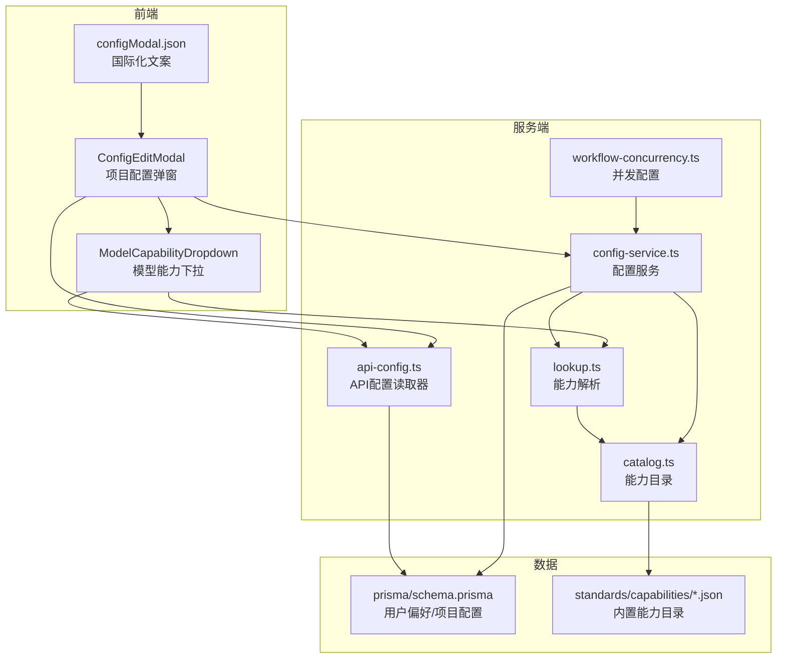
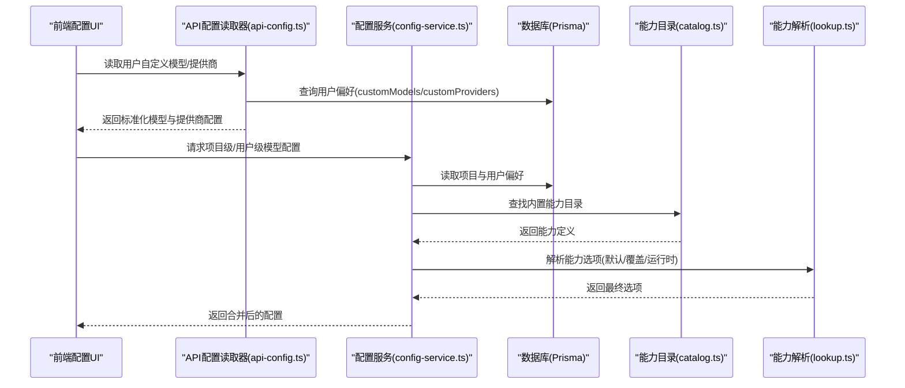
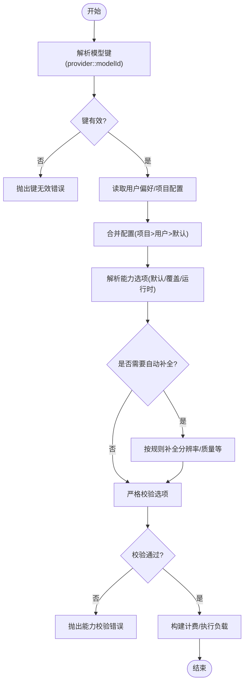
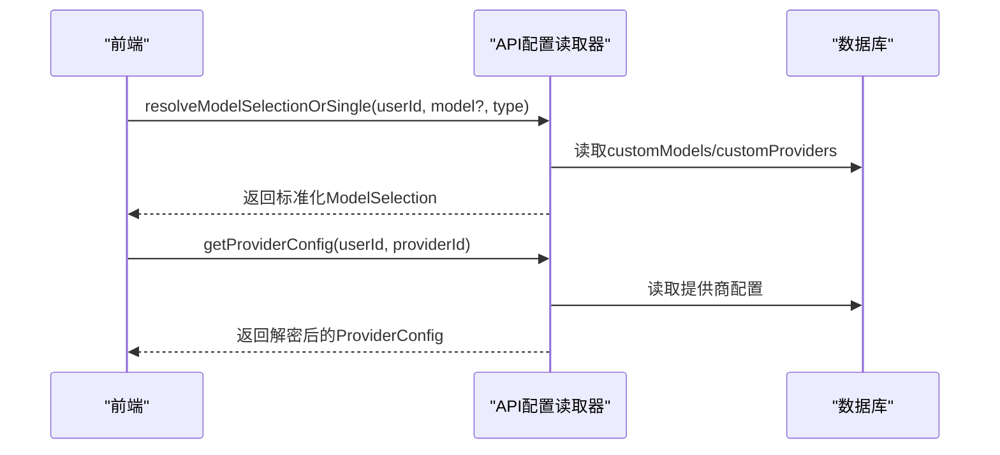
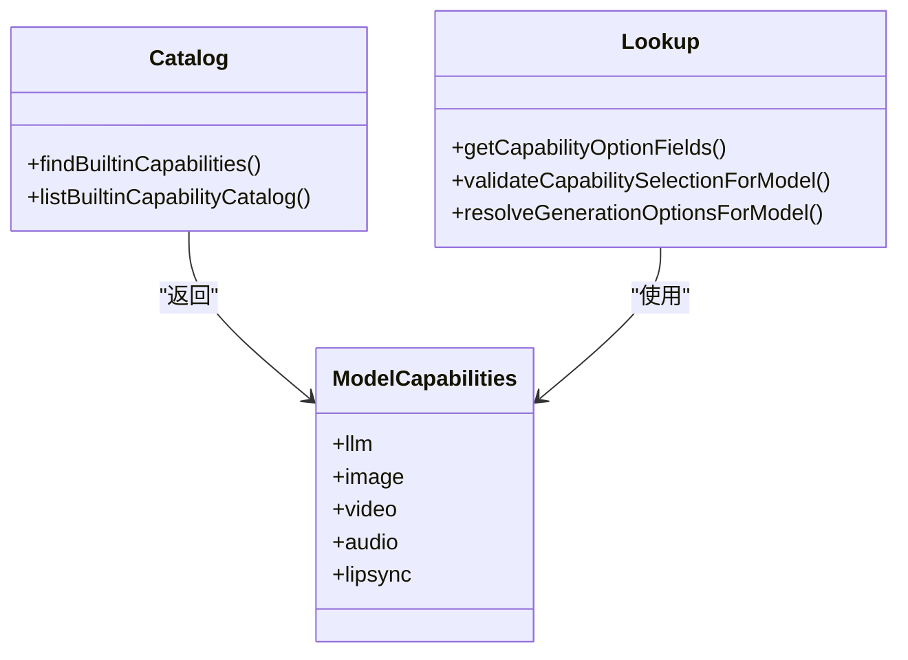
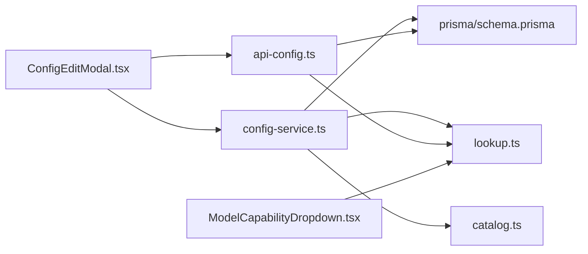

# 配置中心扩展

<cite>
**本文引用的文件**
- [src/lib/config-service.ts](file://src/lib/config-service.ts)
- [src/lib/api-config.ts](file://src/lib/api-config.ts)
- [src/lib/model-config-contract.ts](file://src/lib/model-config-contract.ts)
- [src/lib/model-capabilities/catalog.ts](file://src/lib/model-capabilities/catalog.ts)
- [src/lib/model-capabilities/lookup.ts](file://src/lib/model-capabilities/lookup.ts)
- [src/lib/workflow-concurrency.ts](file://src/lib/workflow-concurrency.ts)
- [src/components/ui/config-modals/ConfigEditModal.tsx](file://src/components/ui/config-modals/ConfigEditModal.tsx)
- [src/components/ui/config-modals/ModelCapabilityDropdown.tsx](file://src/components/ui/config-modals/ModelCapabilityDropdown.tsx)
- [messages/zh/configModal.json](file://messages/zh/configModal.json)
- [messages/en/configModal.json](file://messages/en/configModal.json)
- [standards/capabilities/catalog.example.json](file://standards/capabilities/catalog.example.json)
- [prisma/schema.prisma](file://prisma/schema.prisma)
</cite>

## 目录
1. [简介](#简介)
2. [项目结构](#项目结构)
3. [核心组件](#核心组件)
4. [架构总览](#架构总览)
5. [详细组件分析](#详细组件分析)
6. [依赖分析](#依赖分析)
7. [性能考虑](#性能考虑)
8. [故障排查指南](#故障排查指南)
9. [结论](#结论)
10. [附录](#附录)

## 简介
本开发指南面向“配置中心扩展”的二次开发需求，围绕以下目标展开：
- 设计并实现统一的配置抽象层，支持API配置、模型配置与系统配置的扩展。
- 明确配置项管理机制：验证、默认值、动态更新、存储与版本化。
- 提供自定义配置类型的开发流程：模板、字段校验、UI渲染。
- 实现配置热重载、批量更新与权限控制方案。
- 建立监控指标、审计日志与故障排查方法。

本指南以仓库现有实现为基础，结合UI组件与能力目录，给出可操作的扩展路径与最佳实践。

## 项目结构
配置中心相关的关键模块分布如下：
- 服务端配置读取与解析：统一API配置读取器、模型配置解析与能力目录查询。
- 配置服务：项目级与用户级配置合并、能力选项解析与计费负载构建。
- 能力目录与解析：内置能力目录加载、能力字段提取与运行时校验。
- 前端配置UI：项目配置弹窗、模型能力下拉选择器、国际化文案。
- 数据模型：Prisma Schema中与配置相关的实体与字段。
- 示例与规范：能力目录示例JSON，指导自定义配置类型开发。

**图表来源**
- [src/components/ui/config-modals/ConfigEditModal.tsx](file://src/components/ui/config-modals/ConfigEditModal.tsx)
- [src/components/ui/config-modals/ModelCapabilityDropdown.tsx](file://src/components/ui/config-modals/ModelCapabilityDropdown.tsx)
- [src/lib/api-config.ts](file://src/lib/api-config.ts)
- [src/lib/config-service.ts](file://src/lib/config-service.ts)
- [src/lib/model-capabilities/catalog.ts](file://src/lib/model-capabilities/catalog.ts)
- [src/lib/model-capabilities/lookup.ts](file://src/lib/model-capabilities/lookup.ts)
- [src/lib/workflow-concurrency.ts](file://src/lib/workflow-concurrency.ts)
- [prisma/schema.prisma](file://prisma/schema.prisma)
- [standards/capabilities/catalog.example.json](file://standards/capabilities/catalog.example.json)

**章节来源**
- [src/lib/config-service.ts](file://src/lib/config-service.ts)
- [src/lib/api-config.ts](file://src/lib/api-config.ts)
- [src/lib/model-capabilities/catalog.ts](file://src/lib/model-capabilities/catalog.ts)
- [src/lib/model-capabilities/lookup.ts](file://src/lib/model-capabilities/lookup.ts)
- [src/components/ui/config-modals/ConfigEditModal.tsx](file://src/components/ui/config-modals/ConfigEditModal.tsx)
- [src/components/ui/config-modals/ModelCapabilityDropdown.tsx](file://src/components/ui/config-modals/ModelCapabilityDropdown.tsx)
- [prisma/schema.prisma](file://prisma/schema.prisma)
- [standards/capabilities/catalog.example.json](file://standards/capabilities/catalog.example.json)

## 核心组件
- 配置服务（config-service.ts）
  - 提供项目级与用户级模型配置读取与合并。
  - 解析模型能力选项，支持默认值、覆盖与运行时选择。
  - 构建图片类任务的计费负载，保证计费与执行参数一致。
- API配置读取器（api-config.ts）
  - 严格模式读取用户自定义模型与提供商配置。
  - 校验模型键格式、提供商路由与协议，返回解密后的API Key。
- 能力目录与解析（model-capabilities）
  - 加载内置能力目录，按模型类型与提供商键匹配。
  - 提供能力字段提取、选项合法性校验与自动补全策略。
- 并发配置（workflow-concurrency.ts）
  - 归一化用户偏好中的工作流并发限制，提供默认值。
- 前端配置UI（ConfigEditModal/ModelCapabilityDropdown）
  - 支持项目级配置弹窗与模型能力参数选择。
  - 国际化文案与参数摘要展示，便于用户感知配置状态。

**章节来源**
- [src/lib/config-service.ts](file://src/lib/config-service.ts)
- [src/lib/api-config.ts](file://src/lib/api-config.ts)
- [src/lib/model-config-contract.ts](file://src/lib/model-config-contract.ts)
- [src/lib/model-capabilities/catalog.ts](file://src/lib/model-capabilities/catalog.ts)
- [src/lib/model-capabilities/lookup.ts](file://src/lib/model-capabilities/lookup.ts)
- [src/lib/workflow-concurrency.ts](file://src/lib/workflow-concurrency.ts)
- [src/components/ui/config-modals/ConfigEditModal.tsx](file://src/components/ui/config-modals/ConfigEditModal.tsx)
- [src/components/ui/config-modals/ModelCapabilityDropdown.tsx](file://src/components/ui/config-modals/ModelCapabilityDropdown.tsx)

## 架构总览
配置中心采用“前端UI + 服务端解析 + 数据持久化”的分层设计：
- 前端负责交互与参数收集，调用后端接口读取与写入配置。
- 后端提供严格解析与校验，确保模型键、提供商路由、协议与能力选项合法。
- 数据层通过Prisma Schema存储用户偏好与项目配置，支持默认值与覆盖策略。

**图表来源**
- [src/lib/api-config.ts](file://src/lib/api-config.ts)
- [src/lib/config-service.ts](file://src/lib/config-service.ts)
- [src/lib/model-capabilities/catalog.ts](file://src/lib/model-capabilities/catalog.ts)
- [src/lib/model-capabilities/lookup.ts](file://src/lib/model-capabilities/lookup.ts)
- [prisma/schema.prisma](file://prisma/schema.prisma)

## 详细组件分析

### 配置抽象层与配置项管理机制
- 抽象层设计原则
  - 严格模式：模型键必须为“provider::modelId”，禁止猜测与降级。
  - 优先级：项目配置 > 用户偏好 > 默认值。
  - 分层合并：能力默认值、覆盖与运行时选择三段式合并。
- 配置项管理
  - 验证：模型键、提供商路由、协议、能力字段与值的合法性。
  - 默认值：针对图片/视频模型在缺失必要字段时自动补全最高质量/分辨率。
  - 动态更新：前端参数变更即时触发保存状态反馈，后端解析与持久化。
  - 存储：用户偏好与项目配置通过Prisma Schema持久化。
  - 版本与回滚：建议在Schema中引入版本字段与审计日志，实现回滚与追踪。

**图表来源**
- [src/lib/config-service.ts](file://src/lib/config-service.ts)
- [src/lib/model-capabilities/lookup.ts](file://src/lib/model-capabilities/lookup.ts)
- [src/lib/model-config-contract.ts](file://src/lib/model-config-contract.ts)

**章节来源**
- [src/lib/config-service.ts](file://src/lib/config-service.ts)
- [src/lib/model-capabilities/lookup.ts](file://src/lib/model-capabilities/lookup.ts)
- [src/lib/model-config-contract.ts](file://src/lib/model-config-contract.ts)

### API配置扩展方法
- 自定义模型与提供商
  - 在用户偏好中存储自定义模型数组与提供商数组，遵循严格校验规则。
  - 提供商路由与协议需满足“官方/兼容”约束，避免冲突。
- API Key管理
  - 提供商API Key在读取时进行解密，确保安全存储与传输。
- 选择解析
  - 支持显式模型键与隐式单模型选择，避免歧义。

**图表来源**
- [src/lib/api-config.ts](file://src/lib/api-config.ts)

**章节来源**
- [src/lib/api-config.ts](file://src/lib/api-config.ts)

### 模型配置扩展方法
- 能力目录
  - 内置能力目录以JSON文件形式维护，按模型类型与提供商键匹配。
  - 支持别名映射（如gemini-compatible → google），提升兼容性。
- 能力解析
  - 提取模型能力字段集合，进行字段与值的合法性校验。
  - 对图片/视频模型在缺失必要字段时自动补全，减少用户配置负担。
- 字段国际化
  - 通过fieldI18n配置标签与单位键，配合前端翻译资源实现本地化展示。

**图表来源**
- [src/lib/model-capabilities/catalog.ts](file://src/lib/model-capabilities/catalog.ts)
- [src/lib/model-capabilities/lookup.ts](file://src/lib/model-capabilities/lookup.ts)
- [src/lib/model-config-contract.ts](file://src/lib/model-config-contract.ts)

**章节来源**
- [src/lib/model-capabilities/catalog.ts](file://src/lib/model-capabilities/catalog.ts)
- [src/lib/model-capabilities/lookup.ts](file://src/lib/model-capabilities/lookup.ts)
- [src/lib/model-config-contract.ts](file://src/lib/model-config-contract.ts)
- [standards/capabilities/catalog.example.json](file://standards/capabilities/catalog.example.json)

### 系统配置扩展方法
- 工作流并发配置
  - 从用户偏好中读取分析/图像/视频并发限制，归一化为正整数，提供默认值。
- 项目级视觉参数
  - 项目配置支持画面风格与画面比例，作为全局默认值影响任务执行参数。

**章节来源**
- [src/lib/workflow-concurrency.ts](file://src/lib/workflow-concurrency.ts)
- [src/lib/config-service.ts](file://src/lib/config-service.ts)

### 配置验证、默认值与动态更新
- 验证
  - 模型键格式、提供商路由与协议、能力字段与值的合法性。
  - 能力目录校验与字段国际化配置校验。
- 默认值
  - 图片/视频模型在缺失resolution/quality时自动补全最高值。
- 动态更新
  - 前端参数变更触发保存状态反馈，后端解析并持久化。

**章节来源**
- [src/lib/api-config.ts](file://src/lib/api-config.ts)
- [src/lib/model-capabilities/lookup.ts](file://src/lib/model-capabilities/lookup.ts)
- [src/components/ui/config-modals/ConfigEditModal.tsx](file://src/components/ui/config-modals/ConfigEditModal.tsx)

### 配置存储、版本管理与回滚
- 存储
  - 用户偏好与项目配置通过Prisma Schema持久化，包含自定义模型、提供商与能力覆盖等。
- 版本与回滚
  - 建议在Schema中增加版本号与审计日志字段，记录每次变更的时间、用户与差异，支持回滚与追踪。

**章节来源**
- [prisma/schema.prisma](file://prisma/schema.prisma)

### 自定义配置类型的开发指南
- 配置模板
  - 参考能力目录示例JSON，定义模型类型、提供商键、模型ID与能力字段。
- 字段验证
  - 使用能力校验工具链，确保字段名称、类型与取值范围符合预期。
- UI渲染
  - 使用ModelCapabilityDropdown组件渲染模型与能力参数，支持分组、摘要与本地化标签。

**章节来源**
- [standards/capabilities/catalog.example.json](file://standards/capabilities/catalog.example.json)
- [src/components/ui/config-modals/ModelCapabilityDropdown.tsx](file://src/components/ui/config-modals/ModelCapabilityDropdown.tsx)
- [messages/zh/configModal.json](file://messages/zh/configModal.json)
- [messages/en/configModal.json](file://messages/en/configModal.json)

### 配置热重载、批量更新与权限控制
- 热重载
  - 前端监听配置变更事件，触发局部刷新或重新解析能力选项。
- 批量更新
  - 前端聚合多个配置项变更，后端一次性校验与持久化，减少冲突。
- 权限控制
  - API配置读取器严格校验模型归属与提供商可用性，避免越权访问。

**章节来源**
- [src/lib/api-config.ts](file://src/lib/api-config.ts)
- [src/lib/config-service.ts](file://src/lib/config-service.ts)

## 依赖分析
- 组件耦合
  - 配置服务依赖能力目录与解析模块，以及Prisma数据层。
  - API配置读取器依赖加密工具与能力模板校验。
  - 前端UI依赖国际化资源与能力解析结果。
- 外部依赖
  - Prisma Schema定义配置数据结构。
  - 能力目录JSON提供内置能力定义。

**图表来源**
- [src/lib/config-service.ts](file://src/lib/config-service.ts)
- [src/lib/api-config.ts](file://src/lib/api-config.ts)
- [src/lib/model-capabilities/catalog.ts](file://src/lib/model-capabilities/catalog.ts)
- [src/lib/model-capabilities/lookup.ts](file://src/lib/model-capabilities/lookup.ts)
- [src/components/ui/config-modals/ConfigEditModal.tsx](file://src/components/ui/config-modals/ConfigEditModal.tsx)
- [src/components/ui/config-modals/ModelCapabilityDropdown.tsx](file://src/components/ui/config-modals/ModelCapabilityDropdown.tsx)
- [prisma/schema.prisma](file://prisma/schema.prisma)

**章节来源**
- [src/lib/config-service.ts](file://src/lib/config-service.ts)
- [src/lib/api-config.ts](file://src/lib/api-config.ts)
- [src/lib/model-capabilities/catalog.ts](file://src/lib/model-capabilities/catalog.ts)
- [src/lib/model-capabilities/lookup.ts](file://src/lib/model-capabilities/lookup.ts)
- [src/components/ui/config-modals/ConfigEditModal.tsx](file://src/components/ui/config-modals/ConfigEditModal.tsx)
- [src/components/ui/config-modals/ModelCapabilityDropdown.tsx](file://src/components/ui/config-modals/ModelCapabilityDropdown.tsx)
- [prisma/schema.prisma](file://prisma/schema.prisma)

## 性能考虑
- 能力目录缓存
  - 能力目录按文件签名缓存，避免重复解析与IO开销。
- 解析与校验
  - 能力解析采用分步校验与自动补全策略，减少无效请求与重试。
- 并发限制
  - 工作流并发配置归一化处理，防止超大并发导致资源争用。

[本节为通用指导，无需列出具体文件来源]

## 故障排查指南
- 常见错误与定位
  - 模型键无效：检查“provider::modelId”格式与空格处理。
  - 能力字段非法：核对字段名称与取值范围，参考能力目录示例。
  - 提供商路由冲突：确保非openai-compatible提供商不使用openai-compat路由。
  - API Key缺失：确认用户偏好中提供商API Key已正确配置并解密。
- 审计与日志
  - 建议在Schema中增加审计字段，记录配置变更时间、用户与差异，便于回溯。

**章节来源**
- [src/lib/api-config.ts](file://src/lib/api-config.ts)
- [src/lib/model-capabilities/lookup.ts](file://src/lib/model-capabilities/lookup.ts)
- [src/lib/model-capabilities/catalog.ts](file://src/lib/model-capabilities/catalog.ts)
- [prisma/schema.prisma](file://prisma/schema.prisma)

## 结论
本指南基于现有实现总结了配置中心的抽象层设计、配置项管理机制与扩展路径，并提供了自定义配置类型、热重载、批量更新与权限控制的实施方案。建议在后续迭代中完善版本与回滚机制、增强监控与审计能力，以支撑更复杂的生产环境需求。

[本节为总结性内容，无需列出具体文件来源]

## 附录
- 关键接口与职责
  - 配置服务：项目/用户配置读取、能力解析、计费负载构建。
  - API配置读取器：严格解析用户自定义模型与提供商，返回解密后的提供商配置。
  - 能力目录与解析：加载内置能力、提取字段、校验与自动补全。
  - 前端UI：项目配置弹窗与模型能力下拉选择器，支持国际化与参数摘要。
- 数据模型要点
  - 用户偏好：包含自定义模型、提供商与能力覆盖等字段。
  - 项目配置：包含模型键、画面风格、比例等项目级参数。

**章节来源**
- [src/lib/config-service.ts](file://src/lib/config-service.ts)
- [src/lib/api-config.ts](file://src/lib/api-config.ts)
- [src/lib/model-capabilities/catalog.ts](file://src/lib/model-capabilities/catalog.ts)
- [src/lib/model-capabilities/lookup.ts](file://src/lib/model-capabilities/lookup.ts)
- [src/components/ui/config-modals/ConfigEditModal.tsx](file://src/components/ui/config-modals/ConfigEditModal.tsx)
- [src/components/ui/config-modals/ModelCapabilityDropdown.tsx](file://src/components/ui/config-modals/ModelCapabilityDropdown.tsx)
- [prisma/schema.prisma](file://prisma/schema.prisma)