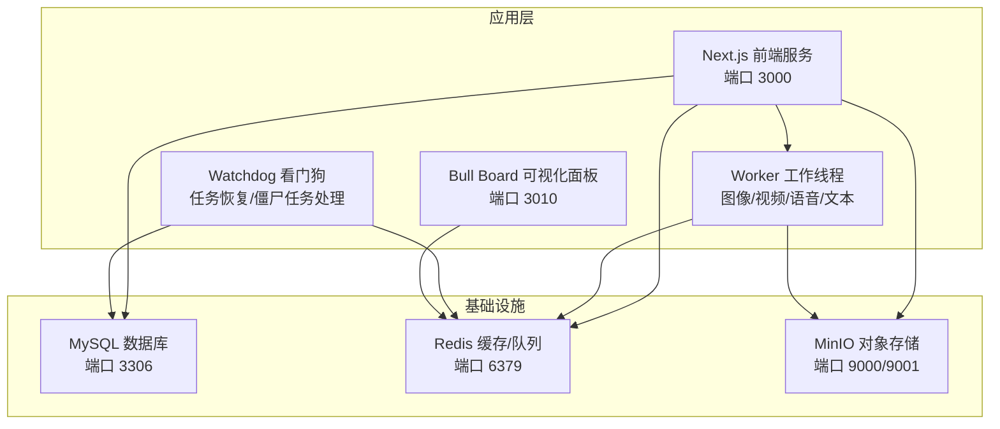
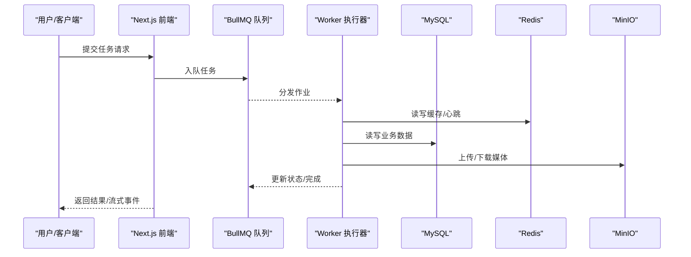
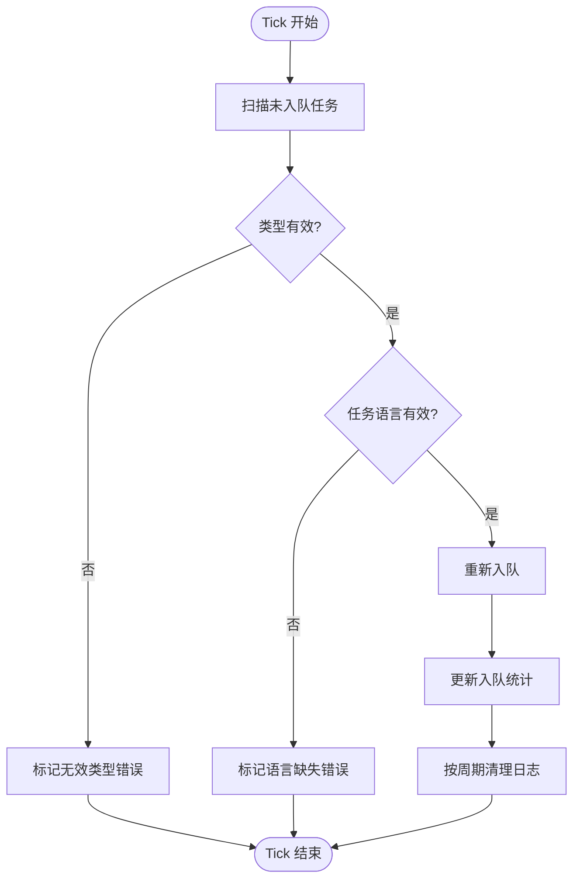
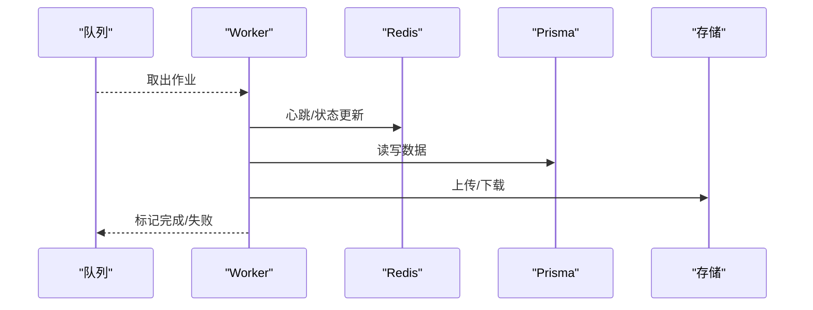
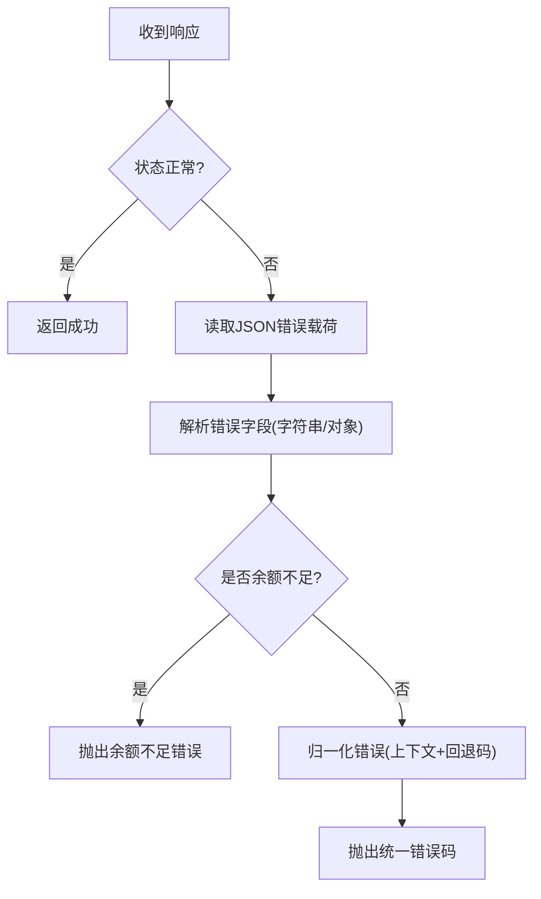
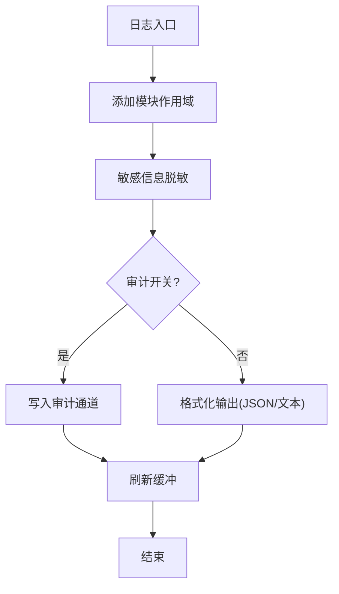
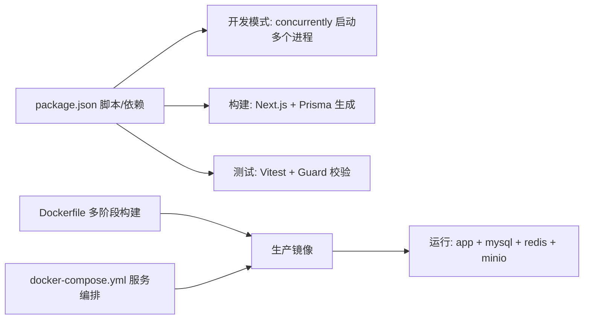

# 故障排除

<cite>
**本文引用的文件**
- [package.json](file://package.json)
- [Dockerfile](file://Dockerfile)
- [docker-compose.yml](file://docker-compose.yml)
- [src/lib/env.ts](file://src/lib/env.ts)
- [src/lib/error-handler.ts](file://src/lib/error-handler.ts)
- [src/lib/prisma.ts](file://src/lib/prisma.ts)
- [src/lib/redis.ts](file://src/lib/redis.ts)
- [src/lib/storage/index.ts](file://src/lib/storage/index.ts)
- [scripts/watchdog.ts](file://scripts/watchdog.ts)
- [src/lib/task/queues.ts](file://src/lib/task/queues.ts)
- [src/lib/workers/index.ts](file://src/lib/workers/index.ts)
- [scripts/bull-board.ts](file://scripts/bull-board.ts)
- [src/lib/logging/core.ts](file://src/lib/logging/core.ts)
- [src/lib/logging/config.ts](file://src/lib/logging/config.ts)
- [src/lib/logging/file-writer.ts](file://src/lib/logging/file-writer.ts)
- [src/lib/logging/semantic.ts](file://src/lib/logging/semantic.ts)
- [src/lib/logging/redact.ts](file://src/lib/logging/redact.ts)
- [src/lib/errors/codes.ts](file://src/lib/errors/codes.ts)
- [src/lib/errors/normalize.ts](file://src/lib/errors/normalize.ts)
- [src/lib/errors/types.ts](file://src/lib/errors/types.ts)
- [src/lib/errors/display.ts](file://src/lib/errors/display.ts)
- [src/lib/errors/user-messages.ts](file://src/lib/errors/user-messages.ts)
- [src/lib/errors/extract.ts](file://src/lib/errors/extract.ts)
</cite>

## 目录
1. [简介](#简介)
2. [项目结构](#项目结构)
3. [核心组件](#核心组件)
4. [架构总览](#架构总览)
5. [详细组件分析](#详细组件分析)
6. [依赖关系分析](#依赖关系分析)
7. [性能考量](#性能考量)
8. [故障排除指南](#故障排除指南)
9. [结论](#结论)
10. [附录](#附录)

## 简介
本文件面向Waoowaoo项目的运维与开发人员，提供系统化的故障排除与诊断手册。内容覆盖启动失败、连接超时、内存泄漏、日志分析、错误追踪、性能监控、数据库连接问题、任务队列异常、AI服务调用失败、网络与权限配置、环境变量错误、系统资源监控、性能瓶颈分析与容量规划、紧急故障处理与数据恢复、系统重建标准操作程序、预防性维护与健康检查、预警机制配置、问题升级与影响评估、根因分析流程等。

## 项目结构
Waoowaoo采用前后端一体化的Next.js应用，配合多进程运行模式：前端Next.js服务、后台Worker工作线程、Watchdog看门狗、以及BullMQ可视化面板Bull Board。后端依赖MySQL数据库、Redis缓存/队列、MinIO对象存储；通过Docker Compose编排各服务，统一暴露端口并集中日志输出。

图表来源
- [docker-compose.yml:63-147](file://docker-compose.yml#L63-L147)
- [Dockerfile:64-61](file://Dockerfile#L64-L61)
- [package.json:12-25](file://package.json#L12-L25)

章节来源
- [docker-compose.yml:1-153](file://docker-compose.yml#L1-L153)
- [Dockerfile:1-61](file://Dockerfile#L1-L61)
- [package.json:9-111](file://package.json#L9-L111)

## 核心组件
- 应用与环境
  - 基础URL解析与API拼接：用于区分外部访问与内部自调用地址，避免跨容器或反向代理导致的重定向/鉴权问题。
  - 环境变量加载：通过dotenv在开发/生产模式下注入，确保Worker、Watchdog、Bull Board正确读取配置。
- 数据库与缓存
  - Prisma客户端单例：避免重复连接与资源泄漏。
  - Redis连接池与重试策略：区分应用与队列客户端，设置指数退避与延迟上限。
- 存储
  - 统一存储抽象：支持本地/MinIO等后端，提供上传、签名URL、下载与压缩等能力，并内置重试。
- 任务与队列
  - BullMQ队列：按任务类型分发到图像/视频/语音/文本队列，统一默认重试与优先级策略。
  - Worker：注册四类Worker，监听错误与失败事件，统一日志输出。
  - Watchdog：周期性恢复“入队中”状态的任务、标记心跳超时的僵尸任务、定时清理日志。
  - Bull Board：可视化查看队列状态，可选Basic认证。
- 错误与日志
  - 统一错误码与消息映射、API响应解析与归一化、余额不足等特殊分支处理。
  - 结构化日志：格式化、脱敏、审计开关、文件落盘与轮转。

章节来源
- [src/lib/env.ts:1-38](file://src/lib/env.ts#L1-L38)
- [src/lib/prisma.ts:1-9](file://src/lib/prisma.ts#L1-L9)
- [src/lib/redis.ts:1-76](file://src/lib/redis.ts#L1-L76)
- [src/lib/storage/index.ts:1-142](file://src/lib/storage/index.ts#L1-L142)
- [src/lib/task/queues.ts:1-112](file://src/lib/task/queues.ts#L1-L112)
- [src/lib/workers/index.ts:1-39](file://src/lib/workers/index.ts#L1-L39)
- [scripts/watchdog.ts:1-226](file://scripts/watchdog.ts#L1-L226)
- [scripts/bull-board.ts:1-106](file://scripts/bull-board.ts#L1-L106)
- [src/lib/error-handler.ts:1-98](file://src/lib/error-handler.ts#L1-L98)
- [src/lib/logging/core.ts](file://src/lib/logging/core.ts)
- [src/lib/logging/config.ts](file://src/lib/logging/config.ts)
- [src/lib/logging/file-writer.ts](file://src/lib/logging/file-writer.ts)
- [src/lib/logging/semantic.ts](file://src/lib/logging/semantic.ts)
- [src/lib/logging/redact.ts](file://src/lib/logging/redact.ts)

## 架构总览
Waoowaoo的运行时由“应用服务 + 多进程Worker + 看门狗 + 队列可视化”构成，数据流经Prisma/Redis/MinIO，错误与日志贯穿全链路。

图表来源
- [src/lib/task/queues.ts:88-101](file://src/lib/task/queues.ts#L88-L101)
- [src/lib/workers/index.ts:3-6](file://src/lib/workers/index.ts#L3-L6)
- [src/lib/redis.ts:65-66](file://src/lib/redis.ts#L65-L66)
- [src/lib/storage/index.ts:35-52](file://src/lib/storage/index.ts#L35-L52)
- [src/lib/prisma.ts:5](file://src/lib/prisma.ts#L5)

## 详细组件分析

### 看门狗（Watchdog）与任务队列恢复
- 角色职责
  - 恢复未正确入队的“已创建但未入队”的任务。
  - 标记心跳超时的“处理中”僵尸任务为失败并发布事件。
  - 定时清理项目日志。
- 关键参数
  - 间隔与心跳超时时间来自环境变量，支持动态调整。
- 常见问题定位
  - 任务长时间停滞：检查心跳超时阈值是否过短或过长。
  - 任务反复失败：结合Worker日志与队列重试策略分析。
  - 日志堆积：确认定时清理逻辑是否按预期执行。

图表来源
- [scripts/watchdog.ts:35-126](file://scripts/watchdog.ts#L35-L126)
- [scripts/watchdog.ts:128-185](file://scripts/watchdog.ts#L128-L185)
- [scripts/watchdog.ts:187-226](file://scripts/watchdog.ts#L187-L226)

章节来源
- [scripts/watchdog.ts:1-226](file://scripts/watchdog.ts#L1-L226)
- [src/lib/task/queues.ts:1-112](file://src/lib/task/queues.ts#L1-L112)

### Worker与队列执行
- Worker注册
  - 图像/视频/语音/文本四类Worker分别创建并监听错误与失败事件。
- 队列策略
  - 默认重试与指数退避，部分一次性任务仅尝试一次。
- 故障定位
  - 查看Worker日志中的任务ID、类型与错误摘要。
  - 使用Bull Board观察队列积压、失败作业与重试次数。

图表来源
- [src/lib/workers/index.ts:3-29](file://src/lib/workers/index.ts#L3-L29)
- [src/lib/task/queues.ts:88-101](file://src/lib/task/queues.ts#L88-L101)
- [src/lib/redis.ts:65-66](file://src/lib/redis.ts#L65-L66)
- [src/lib/storage/index.ts:35-52](file://src/lib/storage/index.ts#L35-L52)
- [src/lib/prisma.ts:5](file://src/lib/prisma.ts#L5)

章节来源
- [src/lib/workers/index.ts:1-39](file://src/lib/workers/index.ts#L1-L39)
- [src/lib/task/queues.ts:1-112](file://src/lib/task/queues.ts#L1-L112)

### 错误处理与API响应解析
- 统一错误码与HTTP状态映射。
- 解析API响应体中的错误字段，支持字符串与对象两种形态。
- 特殊分支：余额不足直接抛出特定错误类型。
- 归一化：根据上下文与回退码生成统一错误标识。

图表来源
- [src/lib/error-handler.ts:52-93](file://src/lib/error-handler.ts#L52-L93)
- [src/lib/errors/codes.ts](file://src/lib/errors/codes.ts)
- [src/lib/errors/normalize.ts](file://src/lib/errors/normalize.ts)

章节来源
- [src/lib/error-handler.ts:1-98](file://src/lib/error-handler.ts#L1-L98)
- [src/lib/errors/codes.ts](file://src/lib/errors/codes.ts)
- [src/lib/errors/normalize.ts](file://src/lib/errors/normalize.ts)

### 日志系统与脱敏
- 结构化日志：模块化作用域、统一格式、可选JSON输出。
- 脱敏策略：对敏感键进行替换，避免日志泄露。
- 审计与调试：可开启审计日志与调试日志，便于问题定位。
- 文件落盘：支持按项目清理旧日志，防止磁盘膨胀。

图表来源
- [src/lib/logging/core.ts](file://src/lib/logging/core.ts)
- [src/lib/logging/redact.ts](file://src/lib/logging/redact.ts)
- [src/lib/logging/config.ts](file://src/lib/logging/config.ts)
- [src/lib/logging/file-writer.ts](file://src/lib/logging/file-writer.ts)
- [src/lib/logging/semantic.ts](file://src/lib/logging/semantic.ts)

章节来源
- [src/lib/logging/core.ts](file://src/lib/logging/core.ts)
- [src/lib/logging/config.ts](file://src/lib/logging/config.ts)
- [src/lib/logging/file-writer.ts](file://src/lib/logging/file-writer.ts)
- [src/lib/logging/semantic.ts](file://src/lib/logging/semantic.ts)
- [src/lib/logging/redact.ts](file://src/lib/logging/redact.ts)

## 依赖关系分析
- 运行时依赖
  - Next.js、React、BullMQ、ioredis、@prisma/client、MinIO SDK等。
- 开发与脚本
  - 并发启动开发进程、构建与测试脚本、迁移与校验脚本。
- Docker与Compose
  - 多阶段构建、生产镜像、端口映射、健康检查、卷挂载与环境注入。

图表来源
- [package.json:9-111](file://package.json#L9-L111)
- [Dockerfile:1-61](file://Dockerfile#L1-L61)
- [docker-compose.yml:1-153](file://docker-compose.yml#L1-L153)

章节来源
- [package.json:1-186](file://package.json#L1-L186)
- [Dockerfile:1-61](file://Dockerfile#L1-L61)
- [docker-compose.yml:1-153](file://docker-compose.yml#L1-L153)

## 性能考量
- 队列并发与重试
  - 不同队列类型并发度可通过环境变量配置，建议按资源与SLA调优。
  - 默认指数退避，避免瞬时抖动放大。
- Worker生命周期
  - 正确处理SIGINT/SIGTERM，优雅关闭Worker，减少任务中断。
- 存储与网络
  - 下载/上传带重试与压缩策略，注意带宽与CPU占用平衡。
- Redis连接
  - 区分应用与队列客户端，避免命令重试副作用；合理设置最大重试次数与延迟上限。

章节来源
- [src/lib/task/queues.ts:12-20](file://src/lib/task/queues.ts#L12-L20)
- [src/lib/workers/index.ts:31-39](file://src/lib/workers/index.ts#L31-L39)
- [src/lib/storage/index.ts:90-139](file://src/lib/storage/index.ts#L90-L139)
- [src/lib/redis.ts:29-33](file://src/lib/redis.ts#L29-L33)

## 故障排除指南

### 启动失败
- 症状
  - 容器启动后立即退出或健康检查失败。
- 排查步骤
  - 查看容器日志与启动命令输出，确认Prisma数据库推送是否成功。
  - 检查数据库、Redis、MinIO健康检查状态与端口映射。
  - 确认环境变量（DATABASE_URL、REDIS_*、MINIO_*、NEXTAUTH_URL等）是否正确注入。
- 建议
  - 在Compose命令中加入延迟与提示输出，便于定位初始化顺序问题。

章节来源
- [docker-compose.yml:132-147](file://docker-compose.yml#L132-L147)
- [Dockerfile:54-61](file://Dockerfile#L54-L61)

### 连接超时
- 数据库连接
  - 检查Prisma客户端初始化与连接参数，确认主机名、端口、凭据与SQL模式。
  - 在开发环境使用独立数据库实例，避免端口冲突。
- 缓存/队列连接
  - 核对Redis主机、端口、TLS与认证配置，关注重连策略与延迟上限。
- 对象存储
  - 校验MinIO端点、区域、桶名、AccessKey/SecretKey与路径风格。
- 网络与代理
  - 若通过反向代理访问，确认NEXTAUTH_URL与INTERNAL_APP_URL一致且可达。

章节来源
- [src/lib/prisma.ts:1-9](file://src/lib/prisma.ts#L1-L9)
- [src/lib/redis.ts:13-34](file://src/lib/redis.ts#L13-L34)
- [src/lib/storage/index.ts:15-21](file://src/lib/storage/index.ts#L15-L21)
- [src/lib/env.ts:6-37](file://src/lib/env.ts#L6-L37)

### 内存泄漏
- 症状
  - Worker或Next服务内存持续增长，GC无法回收。
- 排查步骤
  - 使用Node堆快照与heapdump工具定位大对象与泄漏点。
  - 检查队列作业是否持有全局引用，避免闭包捕获过大对象。
  - 关注图片/视频处理链路，确认流式处理与及时释放资源。
- 建议
  - 限制单个作业处理时长与内存阈值，必要时拆分任务。
  - 定期重启Worker以释放累积的内存碎片。

章节来源
- [src/lib/workers/index.ts:31-39](file://src/lib/workers/index.ts#L31-L39)
- [src/lib/storage/index.ts:90-139](file://src/lib/storage/index.ts#L90-L139)

### 日志分析
- 结构化与脱敏
  - 使用统一日志模块，开启审计与调试开关，避免敏感信息泄露。
- 关键指标
  - 错误码分布、队列积压、Worker失败率、存储上传耗时。
- 工具与实践
  - 将日志输出到文件卷，定期清理旧日志，避免磁盘占满。

章节来源
- [src/lib/logging/core.ts](file://src/lib/logging/core.ts)
- [src/lib/logging/redact.ts](file://src/lib/logging/redact.ts)
- [src/lib/logging/file-writer.ts](file://src/lib/logging/file-writer.ts)

### 错误追踪
- API错误
  - 使用统一错误处理器解析响应体，识别余额不足等特殊错误。
  - 结合错误码映射与归一化，快速定位上游服务或参数问题。
- 任务错误
  - 在Worker失败回调中记录作业ID、任务类型与错误详情。
  - 通过Bull Board查看失败作业与重试历史。

章节来源
- [src/lib/error-handler.ts:52-93](file://src/lib/error-handler.ts#L52-L93)
- [src/lib/workers/index.ts:21-28](file://src/lib/workers/index.ts#L21-L28)
- [scripts/bull-board.ts:77-89](file://scripts/bull-board.ts#L77-L89)

### 性能监控
- 指标采集
  - 队列长度、作业耗时、Worker活跃度、数据库连接数、Redis命中率。
- 告警阈值
  - 队列积压超过阈值触发告警；Worker失败率异常上升需人工干预。
- 调优建议
  - 动态调整队列并发度与重试策略；优化慢查询与热点键。

章节来源
- [src/lib/task/queues.ts:12-20](file://src/lib/task/queues.ts#L12-L20)
- [scripts/bull-board.ts:63-71](file://scripts/bull-board.ts#L63-L71)

### 数据库连接问题
- 症状
  - 启动时报数据库不可达、连接拒绝或认证失败。
- 排查步骤
  - 确认DATABASE_URL格式与凭据；检查容器间网络与服务名解析。
  - 查看MySQL健康检查状态与日志。
- 建议
  - 使用固定的服务名作为主机名，避免localhost在容器内解析差异。

章节来源
- [docker-compose.yml:68-70](file://docker-compose.yml#L68-L70)
- [src/lib/prisma.ts:5](file://src/lib/prisma.ts#L5)

### 任务队列异常
- 症状
  - 作业长期停滞、失败率高、队列积压严重。
- 排查步骤
  - 使用Bull Board查看队列状态与失败作业。
  - 检查Worker日志与错误事件，核对任务类型与参数。
  - 通过Watchdog日志确认是否被判定为心跳超时并重入队。
- 建议
  - 调整队列并发度与重试策略；对长耗时任务拆分。

章节来源
- [scripts/bull-board.ts:63-71](file://scripts/bull-board.ts#L63-L71)
- [src/lib/workers/index.ts:21-28](file://src/lib/workers/index.ts#L21-L28)
- [scripts/watchdog.ts:128-185](file://scripts/watchdog.ts#L128-L185)

### AI服务调用失败
- 症状
  - 文本/图像/视频/语音生成接口报错或无响应。
- 排查步骤
  - 检查对应Provider的API密钥与配额；确认模板渲染与协议兼容。
  - 关注网络代理与超时设置；验证下游服务可用性。
- 建议
  - 为不同模型与任务类型配置独立的并发与超时策略。

章节来源
- [src/lib/storage/index.ts:90-139](file://src/lib/storage/index.ts#L90-L139)

### 网络问题
- 症状
  - 外部访问失败、内部自调用超时、跨容器通信异常。
- 排查步骤
  - 校验NEXTAUTH_URL与INTERNAL_APP_URL一致性；确认端口映射与防火墙。
  - 使用curl或浏览器开发者工具验证API可达性与CORS设置。
- 建议
  - 在反向代理后统一入口，避免相对路径与重定向陷阱。

章节来源
- [src/lib/env.ts:6-37](file://src/lib/env.ts#L6-L37)
- [docker-compose.yml:119-121](file://docker-compose.yml#L119-L121)

### 权限配置与环境变量错误
- 症状
  - Worker无法连接Redis/MinIO、存储签名URL失败、任务入队异常。
- 排查步骤
  - 核对REDIS_HOST/PORT/TLS/USERNAME/PASSWORD；MINIO_ENDPOINT/REGION/BUCKET/KEYS。
  - 确认Bull Board用户名密码与Basic认证配置。
- 建议
  - 使用Compose secrets或外部密管注入敏感变量；避免明文写入配置文件。

章节来源
- [docker-compose.yml:68-106](file://docker-compose.yml#L68-L106)
- [src/lib/redis.ts:13-17](file://src/lib/redis.ts#L13-L17)
- [src/lib/storage/index.ts:77-84](file://src/lib/storage/index.ts#L77-L84)
- [scripts/bull-board.ts:11-12](file://scripts/bull-board.ts#L11-L12)

### 系统资源监控、性能瓶颈与容量规划
- 监控项
  - CPU/内存/磁盘IO、队列长度、Worker吞吐、数据库连接数、Redis内存使用。
- 瓶颈识别
  - I/O密集型任务（存储/网络）优先优化并发与缓存；CPU密集型任务（图像/视频）考虑分布式或专用节点。
- 容量规划
  - 基于峰值队列长度与平均处理时长估算所需Worker数量；预留重试与突发流量空间。

章节来源
- [src/lib/task/queues.ts:12-20](file://src/lib/task/queues.ts#L12-L20)
- [src/lib/storage/index.ts:90-139](file://src/lib/storage/index.ts#L90-L139)

### 紧急故障处理、数据恢复与系统重建
- 紧急处理
  - 临时降级：暂停高并发队列，启用只读模式；切换到备用Provider。
  - 快速回滚：锁定版本，回退到上一个稳定镜像与Schema。
- 数据恢复
  - MySQL备份与恢复：使用mysqldump或物理备份；确认Binlog与GTID。
  - MinIO备份：导出桶内对象；验证完整性与签名URL有效性。
- 系统重建
  - 清理卷与容器，重新执行Prisma迁移；重建索引与缓存预热。
- 建议
  - 制定SOP并演练；建立自动化备份与灾备演练计划。

章节来源
- [docker-compose.yml:149-153](file://docker-compose.yml#L149-L153)

### 预防性维护、健康检查与预警机制
- 健康检查
  - MySQL/Redis/MinIO均配置健康检查；Compose等待服务健康后再启动应用。
- 预防性维护
  - 定期清理日志与过期对象；更新依赖与安全补丁；压测与容量评估。
- 预警机制
  - 基于日志与指标设置阈值告警；分级响应与升级流程。

章节来源
- [docker-compose.yml:18-23](file://docker-compose.yml#L18-L23)
- [docker-compose.yml:35-40](file://docker-compose.yml#L35-L40)
- [docker-compose.yml:56-61](file://docker-compose.yml#L56-L61)
- [scripts/watchdog.ts:187-226](file://scripts/watchdog.ts#L187-L226)

### 问题升级、影响评估与根因分析
- 升级流程
  - 从一线支持到二线专家再到架构师；明确升级时限与责任人。
- 影响评估
  - 评估用户规模、业务影响面与SLA违约风险。
- 根因分析
  - 使用错误码与日志时间线交叉验证；绘制变更树与依赖图；沉淀改进措施。

章节来源
- [src/lib/error-handler.ts:34-37](file://src/lib/error-handler.ts#L34-L37)
- [src/lib/logging/core.ts](file://src/lib/logging/core.ts)

## 结论
Waoowaoo的故障排除应围绕“环境变量与网络可达性、数据库与缓存连接、队列与Worker执行、存储与网络I/O、日志与错误归一化”五大维度展开。通过结构化日志、统一错误处理、可视化队列面板与健康检查，可显著缩短MTTR并提升系统稳定性。建议建立完善的监控告警、容量规划与灾难恢复机制，并将根因分析与改进闭环纳入日常运维流程。

## 附录
- 常用命令与脚本
  - 开发：并发启动前端、Worker、Watchdog、Bull Board。
  - 生产：构建镜像、启动容器、等待健康检查、查看日志。
  - 调试：检查API处理器契约、日志语义、媒体规范化与成功率。
- 关键环境变量
  - 数据库：DATABASE_URL
  - 缓存：REDIS_HOST/PORT/USERNAME/PASSWORD/TLS
  - 存储：STORAGE_TYPE/MINIO_ENDPOINT/REGION/BUCKET/ACCESS_KEY/SECRET_KEY/FORCE_PATH_STYLE
  - 应用：NEXTAUTH_URL/INTERNAL_APP_URL/NEXTAUTH_SECRET
  - 队列：BULL_BOARD_HOST/PORT/BASE_PATH/USER/PASSWORD
  - 运行：WATCHDOG_INTERVAL_MS/TASK_HEARTBEAT_TIMEOUT_MS/QUEUE_CONCURRENCY_*

章节来源
- [package.json:12-25](file://package.json#L12-L25)
- [docker-compose.yml:68-119](file://docker-compose.yml#L68-L119)
- [scripts/watchdog.ts:10-11](file://scripts/watchdog.ts#L10-L11)
- [scripts/bull-board.ts:8-12](file://scripts/bull-board.ts#L8-L12)