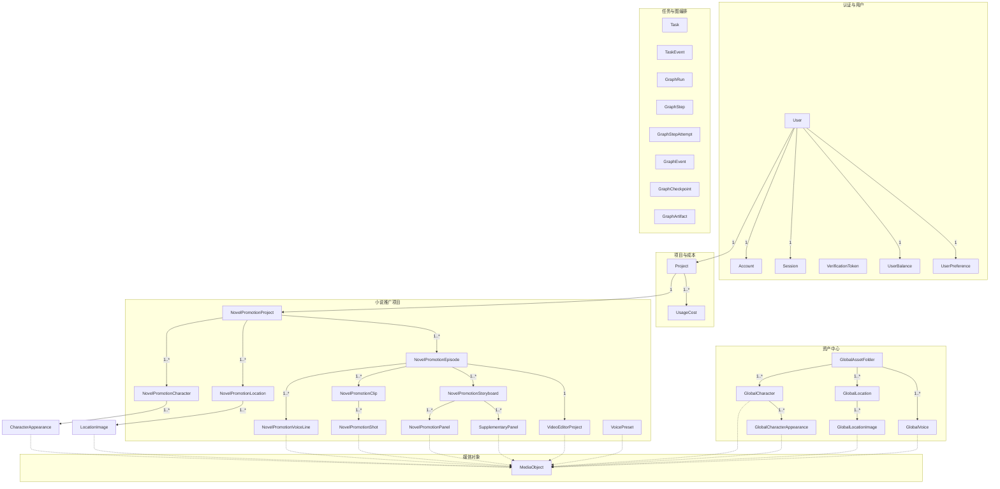
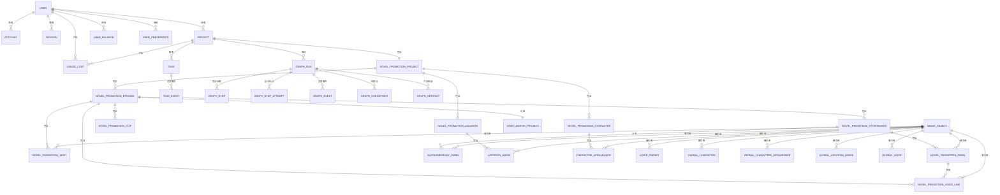
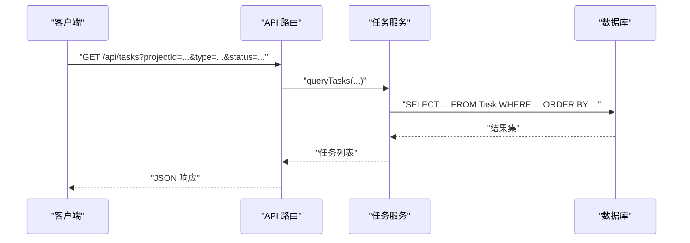
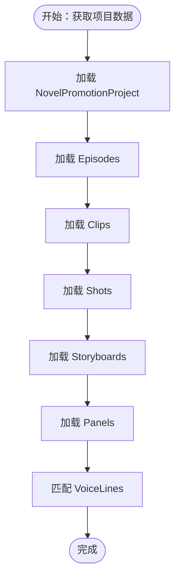
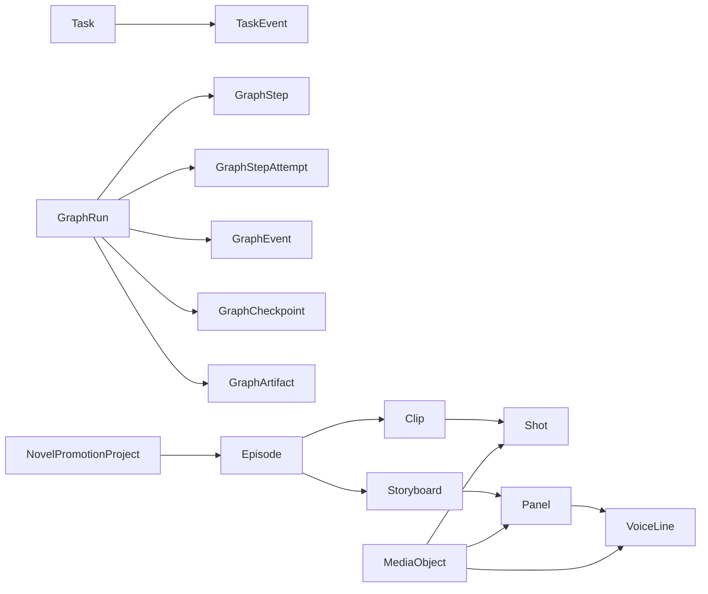

# 关系设计

<cite>
**本文档引用的文件**
- [schema.prisma](file://prisma/schema.prisma)
- [schema.sqlit.prisma](file://prisma/schema.sqlit.prisma)
- [20260317120000_add_asset_kind_to_locations/migration.sql](file://prisma/migrations/20260317120000_add_asset_kind_to_locations/migration.sql)
- [20260324120000_drop_project_mode/migration.sql](file://prisma/migrations/20260324120000_drop_project_mode/migration.sql)
- [20260328110000_add_location_available_slots/migration.sql](file://prisma/migrations/20260328110000_add_location_available_slots/migration.sql)
- [diagnose-project.ts](file://scripts/diagnose-project.ts)
- [route.ts](file://src/app/api/tasks/route.ts)
- [useTaskStatus.ts](file://src/lib/query/hooks/useTaskStatus.ts)
- [stage-readiness.ts](file://src/lib/novel-promotion/stage-readiness.ts)
- [insert-panel.ts](file://src/lib/novel-promotion/insert-panel.ts)
- [migrate-graph-artifacts-unique-index.ts](file://scripts/migrations/migrate-graph-artifacts-unique-index.ts)
</cite>

## 目录
1. [简介](#简介)
2. [项目结构](#项目结构)
3. [核心组件](#核心组件)
4. [架构总览](#架构总览)
5. [详细组件分析](#详细组件分析)
6. [依赖分析](#依赖分析)
7. [性能考量](#性能考量)
8. [故障排查指南](#故障排查指南)
9. [结论](#结论)
10. [附录](#附录)

## 简介
本文件系统性梳理 Waoowaoo 的数据库关系设计，聚焦于三层关系（用户-项目-任务）与小说推广项目的多层级数据结构（项目-剧集-分镜片段-面板）。文档涵盖外键约束、级联操作、参照完整性、中间表与关联表的使用场景、ERD、关系查询优化策略、反范式化与性能权衡、以及关系变更影响与迁移策略。

## 项目结构
数据库模型由 Prisma 定义，采用 MySQL 与 SQLite 双环境 schema，核心围绕用户、项目与小说推广工作流展开，并通过媒体对象统一管理各类媒体资源。

图表来源
- [schema.prisma:10-1002](file://prisma/schema.prisma#L10-L1002)
- [schema.sqlit.prisma:10-839](file://prisma/schema.sqlit.prisma#L10-L839)

章节来源
- [schema.prisma:1-1002](file://prisma/schema.prisma#L1-L1002)
- [schema.sqlit.prisma:1-839](file://prisma/schema.sqlit.prisma#L1-L839)

## 核心组件
- 用户与认证：User、Account、Session、VerificationToken、UserBalance、UserPreference
- 项目与成本：Project、UsageCost
- 小说推广工作流：NovelPromotionProject、NovelPromotionEpisode、NovelPromotionClip、NovelPromotionShot、NovelPromotionPanel、NovelPromotionStoryboard、SupplementaryPanel、NovelPromotionLocation、NovelPromotionCharacter、NovelPromotionVoiceLine、VideoEditorProject、VoicePreset
- 资产中心：GlobalAssetFolder、GlobalCharacter、GlobalLocation、GlobalVoice、GlobalCharacterAppearance、GlobalLocationImage
- 媒体对象：MediaObject（统一媒体引用）
- 任务与图编排：Task、TaskEvent、GraphRun、GraphStep、GraphStepAttempt、GraphEvent、GraphCheckpoint、GraphArtifact

章节来源
- [schema.prisma:10-1002](file://prisma/schema.prisma#L10-L1002)
- [schema.sqlit.prisma:10-839](file://prisma/schema.sqlit.prisma#L10-L839)

## 架构总览
三层关系（用户-项目-任务）与小说推广工作流的关系如下：

图表来源
- [schema.prisma:10-1002](file://prisma/schema.prisma#L10-L1002)
- [schema.sqlit.prisma:10-839](file://prisma/schema.sqlit.prisma#L10-L839)

## 详细组件分析

### 用户-项目-任务三层关系
- 外键与级联
  - User → Project: 外键字段为 Project.userId，删除策略为 Cascade，确保用户删除时其项目级联删除。
  - User → Task: 外键字段为 Task.userId，删除策略为 Cascade。
  - Project → Task: 外键字段为 Task.projectId，删除策略为 Cascade。
- 参照完整性
  - 所有外键均在 Prisma 层声明，保证引用一致性；同时配合唯一索引与组合索引提升查询效率。
- 查询优化建议
  - 在 Task 表上建立复合索引：(status, type, targetType/targetId, projectId, userId, heartbeatAt)，以覆盖常见过滤条件。
  - 使用选择性投影（select）减少不必要的字段加载。

图表来源
- [route.ts:16-42](file://src/app/api/tasks/route.ts#L16-L42)
- [useTaskStatus.ts:78-96](file://src/lib/query/hooks/useTaskStatus.ts#L78-L96)

章节来源
- [schema.prisma:353-427](file://prisma/schema.prisma#L353-L427)
- [schema.prisma:587-628](file://prisma/schema.prisma#L587-L628)
- [route.ts:1-42](file://src/app/api/tasks/route.ts#L1-L42)
- [useTaskStatus.ts:57-140](file://src/lib/query/hooks/useTaskStatus.ts#L57-L140)

### 小说推广项目的多层级数据结构
- 实体关系
  - NovelPromotionProject 作为顶层容器，包含多个 Episode；每个 Episode 包含 Clip、Shot、Storyboard、VoiceLine，并可关联 VideoEditorProject。
  - Storyboard 下挂 Panel 与 SupplementaryPanel；Panel 可与 VoiceLine 匹配。
  - Project 与 NovelPromotionProject 一对一关联，通过外键 Project.id 引用 NovelPromotionProject.projectId。
- 外键与级联
  - 所有子实体均以 onDelete: Cascade 级联删除，确保数据一致性。
  - MediaObject 作为统一媒体引用，通过关系字段反向引用多处实体，避免重复存储。
- 关键索引
  - 在 NovelPromotionPanel 上对 storyboardId、imageMediaId、videoMediaId、lipSyncVideoMediaId、sketchImageMediaId、previousImageMediaId 建立索引，加速面板查询与媒体关联。
  - 在 NovelPromotionVoiceLine 上对 episodeId、matchedPanelId、audioMediaId 建立索引，支撑语音与面板匹配查询。

图表来源
- [schema.prisma:244-274](file://prisma/schema.prisma#L244-L274)
- [schema.prisma:121-146](file://prisma/schema.prisma#L121-L146)
- [schema.prisma:163-186](file://prisma/schema.prisma#L163-L186)
- [schema.prisma:276-307](file://prisma/schema.prisma#L276-L307)
- [schema.prisma:309-330](file://prisma/schema.prisma#L309-L330)
- [schema.prisma:188-242](file://prisma/schema.prisma#L188-L242)
- [schema.prisma:483-509](file://prisma/schema.prisma#L483-L509)

章节来源
- [schema.prisma:244-330](file://prisma/schema.prisma#L244-L330)
- [schema.prisma:188-242](file://prisma/schema.prisma#L188-L242)
- [schema.prisma:483-509](file://prisma/schema.prisma#L483-L509)

### 媒体对象与中间表/关联表
- 中间表与关联表
  - MediaObject 作为“中间表”，被多个实体通过关系字段引用，实现媒体资源的统一管理与去重。
  - 例如：CharacterAppearance、LocationImage、NovelPromotionVoiceLine、NovelPromotionShot、NovelPromotionPanel、SupplementaryPanel、VoicePreset、GlobalCharacter、GlobalCharacterAppearance、GlobalLocationImage、GlobalVoice 等均通过 imageMedia、audioMedia、videoMedia 等字段关联到 MediaObject。
- 设计原则
  - 通过外键与 onDelete: SetNull 或 Cascade 控制媒体引用的生命周期。
  - 对 MediaObject 建立 createdAt 索引，便于按时间检索媒体。
- 反范式化考虑
  - 部分实体保留冗余字段（如 Panel 的 imagePrompt、videoPrompt 等）以支持快速渲染与回放，换取查询时的额外 IO；可通过缓存或物化视图优化。

章节来源
- [schema.prisma:951-986](file://prisma/schema.prisma#L951-L986)
- [schema.prisma:30-54](file://prisma/schema.prisma#L30-L54)
- [schema.prisma:56-77](file://prisma/schema.prisma#L56-L77)
- [schema.prisma:483-509](file://prisma/schema.prisma#L483-L509)
- [schema.prisma:276-307](file://prisma/schema.prisma#L276-L307)
- [schema.prisma:188-242](file://prisma/schema.prisma#L188-L242)
- [schema.prisma:326-351](file://prisma/schema.prisma#L326-L351)
- [schema.prisma:511-524](file://prisma/schema.prisma#L511-L524)
- [schema.prisma:816-842](file://prisma/schema.prisma#L816-L842)
- [schema.prisma:844-874](file://prisma/schema.prisma#L844-L874)
- [schema.prisma:897-922](file://prisma/schema.prisma#L897-L922)
- [schema.prisma:924-949](file://prisma/schema.prisma#L924-L949)

### 关系查询优化策略
- JOIN 优化
  - 使用内连接（INNER JOIN）时，优先以高选择性的过滤条件作为连接键，减少中间结果集大小。
  - 对频繁出现的连接路径（如 Project → NovelPromotionProject → Episode → Clip → Shot）建立复合索引，降低排序与临时表开销。
- 子查询
  - 在统计类查询中，优先使用 EXISTS/IN 替代 JOIN，减少重复行。
  - 对聚合查询（如按项目统计任务状态）使用窗口函数或物化汇总表。
- 索引使用
  - Task：(status, type, targetType/targetId, projectId, userId, heartbeatAt)
  - NovelPromotionPanel：(storyboardId, imageMediaId, videoMediaId, lipSyncVideoMediaId, sketchImageMediaId, previousImageMediaId)
  - NovelPromotionVoiceLine：(episodeId, matchedPanelId, audioMediaId)
  - MediaObject：(createdAt)
- 反范式化与缓存
  - 对高频读取的派生字段（如 Panel 的 imagePrompt、videoPrompt）进行缓存或物化，降低计算与 IO。

章节来源
- [schema.prisma:587-628](file://prisma/schema.prisma#L587-L628)
- [schema.prisma:188-242](file://prisma/schema.prisma#L188-L242)
- [schema.prisma:483-509](file://prisma/schema.prisma#L483-L509)
- [schema.prisma:951-986](file://prisma/schema.prisma#L951-L986)

### 关系设计中的反范式化与性能权衡
- 反范式化场景
  - Panel 表中保留 imagePrompt、videoPrompt、firstLastFramePrompt 等字段，便于直接渲染，避免多次 JOIN。
  - Project 与 NovelPromotionProject 之间通过外键关联，避免重复存储项目元数据。
- 性能权衡
  - 冗余字段带来写入放大与存储占用，但显著降低读取时的 JOIN 成本。
  - 建议通过后台任务定期清理历史冗余数据，或使用归档表隔离冷数据。

章节来源
- [schema.prisma:188-242](file://prisma/schema.prisma#L188-L242)
- [schema.prisma:244-274](file://prisma/schema.prisma#L244-L274)

### 关系变更的影响分析与迁移策略
- 迁移示例
  - 添加字段：为 novel_promotion_locations 与 global_locations 添加 assetKind 字段；为 novel_promotion_clips 与 novel_promotion_panels 添加 props 字段。
  - 删除字段：从 projects 表删除 mode 列。
  - 新增列：为 location_images 与 global_location_images 添加 availableSlots 字段。
- 影响分析
  - 结构变更需评估对现有查询路径的影响，必要时重建索引或调整查询计划。
  - 对于大表，建议使用在线 DDL 工具或分批迁移，避免锁表。
- 迁移策略
  - 使用 Prisma Migrate 管理版本化迁移，先在测试环境验证，再灰度发布。
  - 对关键表（如 Task、GraphArtifact）迁移前备份，迁移后校验唯一性与完整性。

章节来源
- [20260317120000_add_asset_kind_to_locations/migration.sql:1-12](file://prisma/migrations/20260317120000_add_asset_kind_to_locations/migration.sql#L1-L12)
- [20260324120000_drop_project_mode/migration.sql:1-3](file://prisma/migrations/20260324120000_drop_project_mode/migration.sql#L1-L3)
- [20260328110000_add_location_available_slots/migration.sql:1-6](file://prisma/migrations/20260328110000_add_location_available_slots/migration.sql#L1-L6)
- [migrate-graph-artifacts-unique-index.ts:58-93](file://scripts/migrations/migrate-graph-artifacts-unique-index.ts#L58-L93)

## 依赖分析
- 组件耦合
  - Task 与 TaskEvent 通过 taskId 强关联，GraphRun 与其子表（GraphStep、GraphStepAttempt、GraphEvent、GraphCheckpoint、GraphArtifact）形成强依赖链。
  - 小说推广工作流各层级（Project → Episode → Clip → Shot → Panel）逐层依赖，删除策略为 Cascade，确保数据一致性。
- 外部依赖
  - MediaObject 作为外部媒体存储的统一入口，所有媒体引用均通过该表进行管理。

图表来源
- [schema.prisma:587-646](file://prisma/schema.prisma#L587-L646)
- [schema.prisma:244-330](file://prisma/schema.prisma#L244-L330)
- [schema.prisma:951-986](file://prisma/schema.prisma#L951-L986)

章节来源
- [schema.prisma:587-646](file://prisma/schema.prisma#L587-L646)
- [schema.prisma:244-330](file://prisma/schema.prisma#L244-L330)
- [schema.prisma:951-986](file://prisma/schema.prisma#L951-L986)

## 性能考量
- 索引策略
  - 为高频过滤字段建立复合索引，减少全表扫描。
  - 对时间序列字段（如 createdAt、updatedAt）建立索引，支持高效排序与范围查询。
- 查询模式
  - 读多写少场景下，优先使用物化视图或汇总表承载统计查询。
  - 对长文本字段（如 Text/JSON）尽量延迟加载，使用投影选择必要字段。
- 并发与重试
  - 对数据库异常进行幂等处理与指数退避重试，避免瞬时抖动扩大。

## 故障排查指南
- 诊断脚本
  - 通过诊断脚本列出项目下的任务与事件，定位错误码与错误信息，辅助问题根因分析。
- API 查询
  - 使用 /api/tasks 接口按项目、类型、状态筛选任务，结合前端 hooks 缓存与分页，降低请求压力。
- 数据一致性
  - 对关键表（如 GraphArtifact）迁移前检查唯一索引是否存在，避免重复数据导致的运行时异常。

章节来源
- [diagnose-project.ts:89-124](file://scripts/diagnose-project.ts#L89-L124)
- [route.ts:16-42](file://src/app/api/tasks/route.ts#L16-L42)
- [useTaskStatus.ts:57-140](file://src/lib/query/hooks/useTaskStatus.ts#L57-L140)
- [migrate-graph-artifacts-unique-index.ts:58-93](file://scripts/migrations/migrate-graph-artifacts-unique-index.ts#L58-L93)

## 结论
Waoowaoo 的数据库关系设计以三层关系（用户-项目-任务）与小说推广工作流为核心，通过外键约束与级联删除保障参照完整性；借助 MediaObject 实现媒体资源的统一管理；在高频读取场景采用适度反范式化与索引优化；迁移策略遵循版本化与灰度发布，确保演进过程中的稳定性与可追溯性。

## 附录
- 术语
  - 外键：用于建立两个表之间的链接，确保引用完整性。
  - 级联：当父记录被删除时，自动删除或更新子记录。
  - 反范式化：为提高查询性能而引入冗余数据的设计策略。
- 参考实现路径
  - 用户与项目：[schema.prisma:402-429](file://prisma/schema.prisma#L402-L429)、[schema.prisma:353-367](file://prisma/schema.prisma#L353-L367)
  - 小说推广工作流：[schema.prisma:244-330](file://prisma/schema.prisma#L244-L330)、[schema.prisma:188-242](file://prisma/schema.prisma#L188-L242)
  - 媒体对象：[schema.prisma:951-986](file://prisma/schema.prisma#L951-L986)
  - 任务与图编排：[schema.prisma:587-646](file://prisma/schema.prisma#L587-L646)
  - 迁移脚本：[20260317120000_add_asset_kind_to_locations/migration.sql:1-12](file://prisma/migrations/20260317120000_add_asset_kind_to_locations/migration.sql#L1-L12)、[20260324120000_drop_project_mode/migration.sql:1-3](file://prisma/migrations/20260324120000_drop_project_mode/migration.sql#L1-L3)、[20260328110000_add_location_available_slots/migration.sql:1-6](file://prisma/migrations/20260328110000_add_location_available_slots/migration.sql#L1-L6)