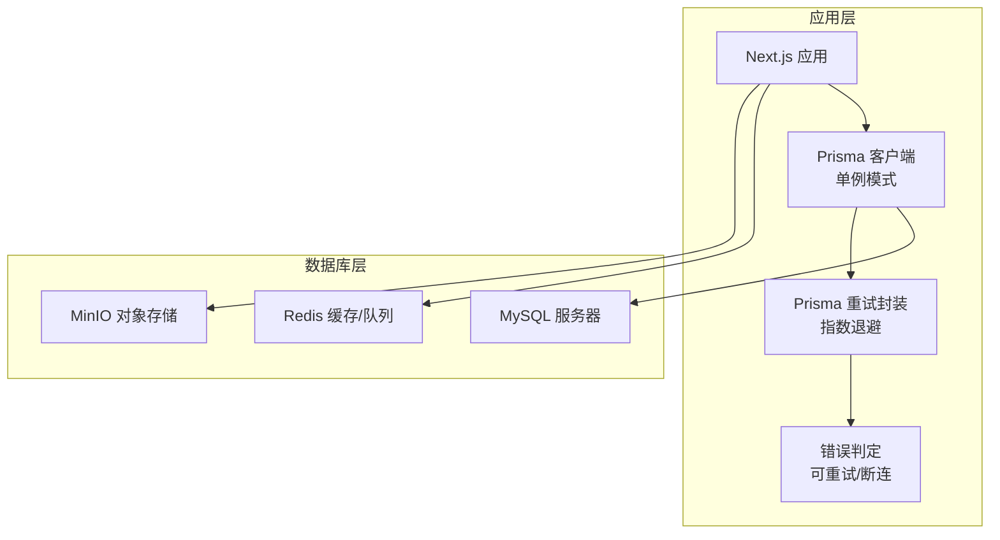
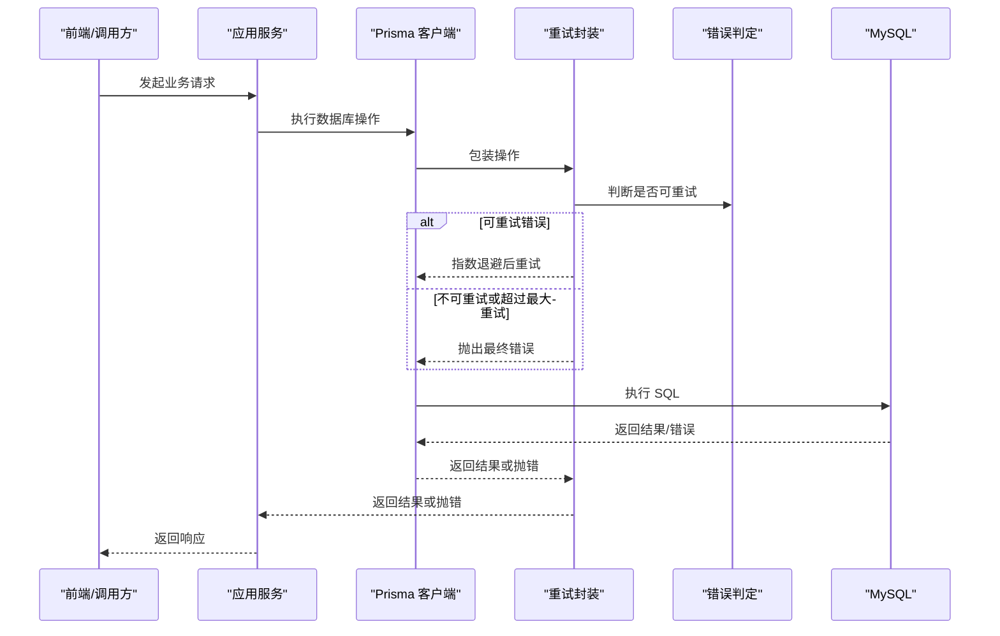
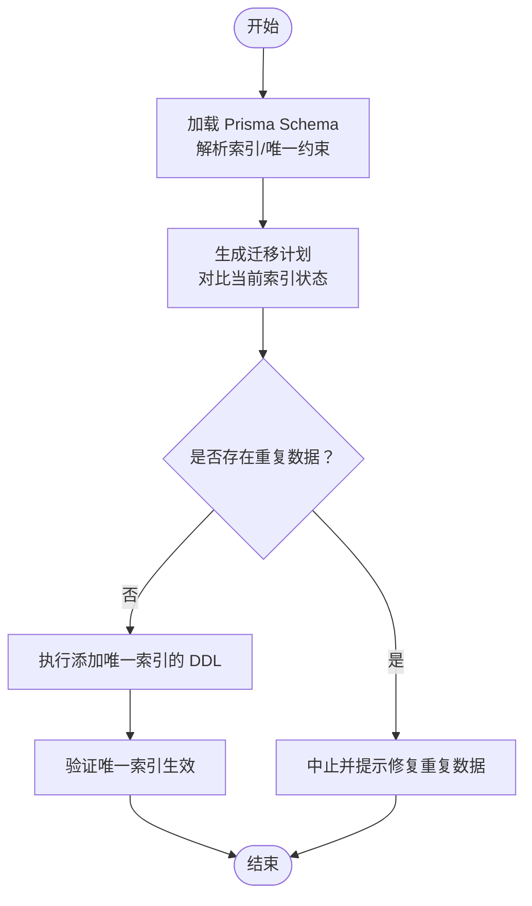
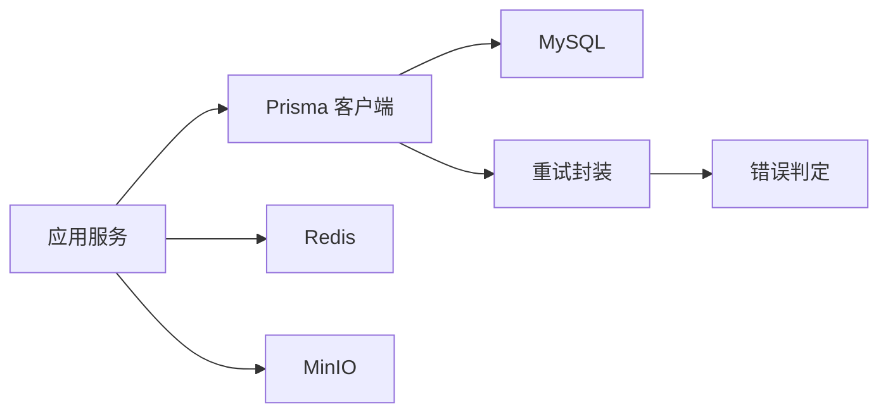

# 性能优化

<cite>
**本文引用的文件**   
- [schema.prisma](file://prisma/schema.prisma)
- [prisma.ts](file://src/lib/prisma.ts)
- [prisma-retry.ts](file://src/lib/prisma-retry.ts)
- [prisma-error.ts](file://src/lib/prisma-error.ts)
- [docker-compose.yml](file://docker-compose.yml)
- [docker-compose.test.yml](file://docker-compose.test.yml)
- [migrate-graph-artifacts-unique-index.ts](file://scripts/migrations/migrate-graph-artifacts-unique-index.ts)
- [service.ts](file://src/lib/run-runtime/service.ts)
- [media-safety-backup.ts](file://scripts/media-safety-backup.ts)
- [global-setup.ts](file://tests/setup/global-setup.ts)
</cite>

## 目录
1. [简介](#简介)
2. [项目结构](#项目结构)
3. [核心组件](#核心组件)
4. [架构总览](#架构总览)
5. [详细组件分析](#详细组件分析)
6. [依赖分析](#依赖分析)
7. [性能考量](#性能考量)
8. [故障排查指南](#故障排查指南)
9. [结论](#结论)
10. [附录](#附录)

## 简介
本指南面向 Waoowaoo 的数据库性能优化，围绕索引策略、查询优化、连接池与连接复用、监控与基准测试、分区与分片、内存与 I/O 优化、网络延迟优化以及高并发场景下的读写分离、负载均衡与故障转移等主题，结合仓库中现有的 Prisma Schema、运行时重试与错误判定、容器化环境与迁移脚本进行系统性梳理，并提供可操作的优化建议与排障思路。

## 项目结构
- 数据库客户端与连接管理
  - Prisma 客户端在应用层以单例模式持有，避免重复创建连接，降低连接开销。
  - 运行时对 Prisma 错误进行分类，仅对可重试错误进行指数退避重试，提升稳定性。
- 数据库与中间件
  - 使用 MySQL 作为主数据库；Redis 用于缓存与队列相关能力；MinIO 作为对象存储。
- 迁移与索引
  - 通过 Prisma Schema 定义索引；迁移脚本确保唯一索引一致性，避免重复数据导致的查询性能下降。
- 测试与准备
  - 启动脚本等待 MySQL/Redis 就绪，保证服务启动时数据库可用。

**图表来源**
- [prisma.ts:1-9](file://src/lib/prisma.ts#L1-L9)
- [prisma-retry.ts:28-50](file://src/lib/prisma-retry.ts#L28-L50)
- [prisma-error.ts:49-53](file://src/lib/prisma-error.ts#L49-L53)
- [docker-compose.yml:63-147](file://docker-compose.yml#L63-L147)

**章节来源**
- [prisma.ts:1-9](file://src/lib/prisma.ts#L1-L9)
- [prisma-retry.ts:1-51](file://src/lib/prisma-retry.ts#L1-L51)
- [prisma-error.ts:1-54](file://src/lib/prisma-error.ts#L1-L54)
- [docker-compose.yml:1-153](file://docker-compose.yml#L1-L153)

## 核心组件
- Prisma 单例客户端：避免频繁创建连接，减少握手与上下文切换成本。
- 可重试错误判定：基于 Prisma 错误码与常见断连信息，自动区分可恢复与不可恢复错误。
- 指数退避重试：对可重试错误按尝试次数递增延迟，缓解瞬时抖动。
- 唯一索引保障：迁移脚本校验并补齐关键唯一索引，避免重复键引发的锁竞争与扫描放大。
- 容器化依赖：MySQL/Redis/MinIO 通过 compose 统一编排，便于本地与 CI 环境快速就绪。

**章节来源**
- [prisma.ts:1-9](file://src/lib/prisma.ts#L1-L9)
- [prisma-retry.ts:28-50](file://src/lib/prisma-retry.ts#L28-L50)
- [prisma-error.ts:8-35](file://src/lib/prisma-error.ts#L8-L35)
- [migrate-graph-artifacts-unique-index.ts:75-135](file://scripts/migrations/migrate-graph-artifacts-unique-index.ts#L75-L135)
- [docker-compose.yml:1-153](file://docker-compose.yml#L1-L153)

## 架构总览
下图展示了应用与数据库、缓存、存储之间的交互关系，以及重试与错误判定在请求链路中的位置。

**图表来源**
- [prisma-retry.ts:28-50](file://src/lib/prisma-retry.ts#L28-L50)
- [prisma-error.ts:49-53](file://src/lib/prisma-error.ts#L49-L53)
- [prisma.ts:1-9](file://src/lib/prisma.ts#L1-L9)

## 详细组件分析

### 索引策略设计与实现
- 设计原则
  - 单列索引：适用于等值过滤、范围扫描较少的列；避免在低选择性的列上建立过多单列索引。
  - 复合索引：将最左前缀匹配的过滤条件放在前面，兼顾多条件过滤与排序需求。
  - 唯一索引：对业务唯一约束字段建立唯一索引，避免重复键带来的锁冲突与维护成本。
- 实践要点
  - 在 Prisma Schema 中显式声明索引与唯一约束，确保迁移一致性。
  - 通过迁移脚本检查并补齐关键唯一索引，防止重复数据导致的查询/更新异常。
- 代码映射
  - Prisma Schema 中的索引与唯一约束定义。
  - 迁移脚本对 graph_artifacts 表的唯一索引校验与创建。

**图表来源**
- [migrate-graph-artifacts-unique-index.ts:75-135](file://scripts/migrations/migrate-graph-artifacts-unique-index.ts#L75-L135)
- [service.ts:304-333](file://src/lib/run-runtime/service.ts#L304-L333)

**章节来源**
- [schema.prisma:10-28](file://prisma/schema.prisma#L10-L28)
- [schema.prisma:244-274](file://prisma/schema.prisma#L244-L274)
- [schema.prisma:587-628](file://prisma/schema.prisma#L587-L628)
- [schema.prisma:648-795](file://prisma/schema.prisma#L648-L795)
- [migrate-graph-artifacts-unique-index.ts:75-135](file://scripts/migrations/migrate-graph-artifacts-unique-index.ts#L75-L135)
- [service.ts:304-333](file://src/lib/run-runtime/service.ts#L304-L333)

### 查询优化技术
- 查询计划分析
  - 使用 EXPLAIN/ANALYZE 分析 SQL 执行路径，关注全表扫描、临时表、排序与 Join 类型。
  - 结合索引选择性与过滤率评估，优先命中覆盖索引或最左前缀索引。
- 执行路径优化
  - 避免 SELECT *，只取必要列；对大字段采用分页或延迟加载。
  - 合理拆分复杂查询，利用物化视图或汇总表降低热点查询成本。
- 缓存策略
  - 对热点读取结果进行短期缓存（Redis），设置合理过期时间与失效策略。
  - 对于强一致要求的数据，采用“先更新后删除”或“写穿透”策略，避免脏读。

[本节为通用优化建议，不直接分析具体文件，故无章节来源]

### 数据库连接池配置与连接复用
- 连接池参数建议
  - 最小/最大连接数：根据并发请求数与数据库承载能力设定，避免连接不足或过度占用。
  - 空闲超时与健康检查：定期回收空闲连接，保持连接有效性。
  - 超时设置：合理设置连接、读写超时，避免线程长时间阻塞。
- 连接复用
  - 应用侧使用单例 Prisma 客户端，减少连接创建与销毁开销。
  - 在事务中复用同一连接，避免跨连接事务带来的额外成本。

**章节来源**
- [prisma.ts:1-9](file://src/lib/prisma.ts#L1-L9)

### 性能监控指标与基准测试
- 监控指标
  - QPS、P95/P99 延迟、连接池使用率、慢查询数量、错误率（含可重试与不可重试）。
  - 数据库层面：缓冲池命中率、锁等待、临时表与排序、文件描述符使用。
- 基准测试
  - 使用压力测试工具模拟峰值流量，观察数据库与应用的资源占用与瓶颈点。
  - 对关键路径（如任务状态查询、资产检索）进行回归测试，确保变更不会引入性能回退。

**章节来源**
- [prisma-retry.ts:28-50](file://src/lib/prisma-retry.ts#L28-L50)
- [prisma-error.ts:37-53](file://src/lib/prisma-error.ts#L37-L53)

### 分区表与分片策略
- 分区表
  - 按时间维度（如创建时间、账单时间）对大表进行分区，提升扫描效率与维护便利性。
- 分片策略
  - 基于业务键（如用户 ID、项目 ID）进行水平分片，配合路由层实现读写分离与就近访问。
  - 分片键选择需兼顾均匀性与热点规避，避免冷热不均。

[本节为通用优化建议，不直接分析具体文件，故无章节来源]

### 内存使用优化、磁盘 I/O 优化与网络延迟优化
- 内存优化
  - 控制单次查询返回量，使用游标/分页；启用数据库端压缩与合适的字符集。
- 磁盘 I/O 优化
  - 合理设置 innodb_buffer_pool_size，确保热点数据驻留内存；对日志与临时文件路径进行分离。
- 网络延迟优化
  - 将应用与数据库部署在同一可用区或同 VPC，缩短 RTT；使用连接池与长连接减少握手开销。

[本节为通用优化建议，不直接分析具体文件，故无章节来源]

### 高并发场景下的数据库调优
- 读写分离
  - 主库负责写入，从库承担读取；热点读取走缓存，非热点走从库。
- 负载均衡与故障转移
  - 使用代理层（如读写分离中间件）实现自动路由与故障剔除；结合健康检查与重试策略提升可用性。
- 并发控制
  - 对高并发写入场景，采用批量提交、削峰填谷与幂等设计，避免数据库拥塞。

**章节来源**
- [docker-compose.yml:63-147](file://docker-compose.yml#L63-L147)

### 性能问题诊断工具与调试技巧
- 诊断工具
  - 慢查询日志、进程列表、状态变量快照；结合 EXPLAIN 分析热点 SQL。
- 调试技巧
  - 逐步缩小范围：先定位到具体表/索引，再分析 SQL 语句与参数绑定。
  - 压测回归：在变更前后进行对比，确认收益与副作用。

**章节来源**
- [prisma-error.ts:37-53](file://src/lib/prisma-error.ts#L37-L53)

## 依赖分析
- 组件耦合
  - 应用层通过 Prisma 客户端访问数据库；重试与错误判定模块独立，便于扩展与替换。
- 外部依赖
  - MySQL 提供持久化；Redis 提供缓存与队列；MinIO 提供对象存储。
- 潜在风险
  - 未命中索引导致的全表扫描；重复数据破坏唯一约束；连接池配置不当引发的连接争用。

**图表来源**
- [prisma.ts:1-9](file://src/lib/prisma.ts#L1-L9)
- [prisma-retry.ts:28-50](file://src/lib/prisma-retry.ts#L28-L50)
- [prisma-error.ts:49-53](file://src/lib/prisma-error.ts#L49-L53)
- [docker-compose.yml:1-153](file://docker-compose.yml#L1-L153)

**章节来源**
- [prisma.ts:1-9](file://src/lib/prisma.ts#L1-L9)
- [prisma-retry.ts:1-51](file://src/lib/prisma-retry.ts#L1-L51)
- [prisma-error.ts:1-54](file://src/lib/prisma-error.ts#L1-L54)
- [docker-compose.yml:1-153](file://docker-compose.yml#L1-L153)

## 性能考量
- 索引与查询
  - 依据访问模式设计索引，优先满足高频过滤与排序需求；定期审查慢查询日志，调整索引策略。
- 连接与重试
  - 合理配置连接池与超时；对可重试错误进行指数退避，避免雪崩效应。
- 缓存与存储
  - 对热点数据进行缓存；对大文件采用对象存储，数据库仅保留元数据。
- 监控与压测
  - 建立完善的监控体系与回归基线，持续跟踪性能变化。

[本节为通用优化建议，不直接分析具体文件，故无章节来源]

## 故障排查指南
- 断连与超时
  - 若出现连接关闭、无法启动事务或连接超时，优先检查网络连通性与数据库健康状态。
- 可重试错误
  - 对 P1001、P1002、P2024、P2028 等错误进行自动重试；若仍失败，检查上游依赖与限流策略。
- 唯一约束冲突
  - 当唯一索引缺失或存在重复数据时，DDL 创建会失败；应先清理重复数据再创建唯一索引。

**章节来源**
- [prisma-error.ts:8-35](file://src/lib/prisma-error.ts#L8-L35)
- [prisma-retry.ts:28-50](file://src/lib/prisma-retry.ts#L28-L50)
- [migrate-graph-artifacts-unique-index.ts:110-135](file://scripts/migrations/migrate-graph-artifacts-unique-index.ts#L110-L135)

## 结论
通过对 Prisma Schema 的索引与唯一约束设计、迁移脚本的唯一索引保障、运行时重试与错误判定机制，以及容器化环境的统一编排，Waoowaoo 已具备良好的数据库性能优化基础。后续可在查询计划分析、缓存策略、连接池参数、监控与压测等方面进一步细化落地，以应对高并发与大规模数据场景下的性能挑战。

## 附录
- 启动与就绪检查
  - 应用启动前等待数据库与缓存服务就绪，确保初始化阶段的稳定性。
- 数据备份与快照
  - 提供数据库文件备份与表快照能力，便于回滚与审计。

**章节来源**
- [docker-compose.test.yml:1-32](file://docker-compose.test.yml#L1-L32)
- [global-setup.ts:19-41](file://tests/setup/global-setup.ts#L19-L41)
- [media-safety-backup.ts:194-224](file://scripts/media-safety-backup.ts#L194-L224)