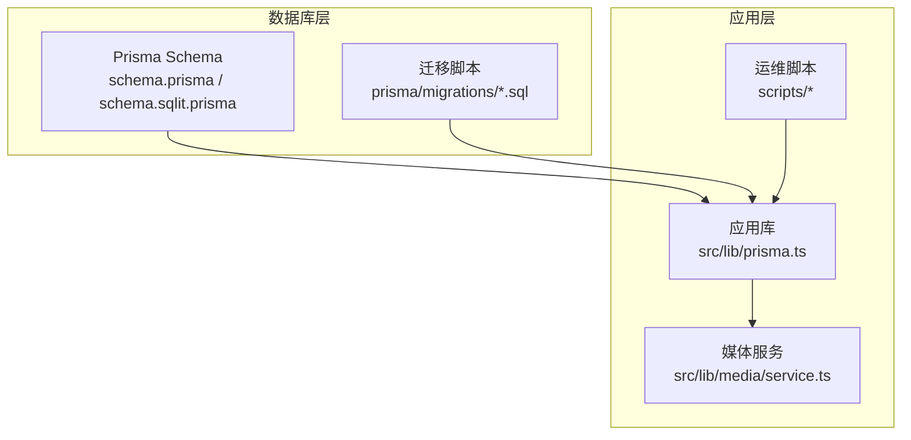
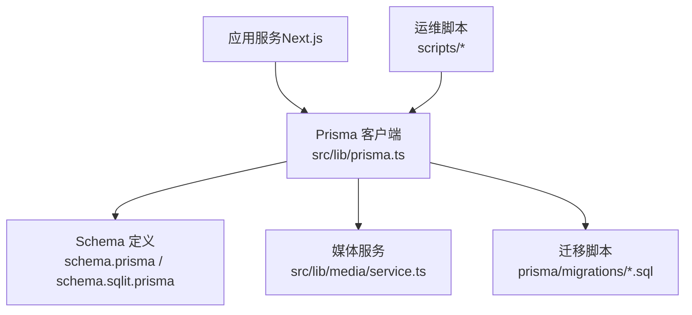
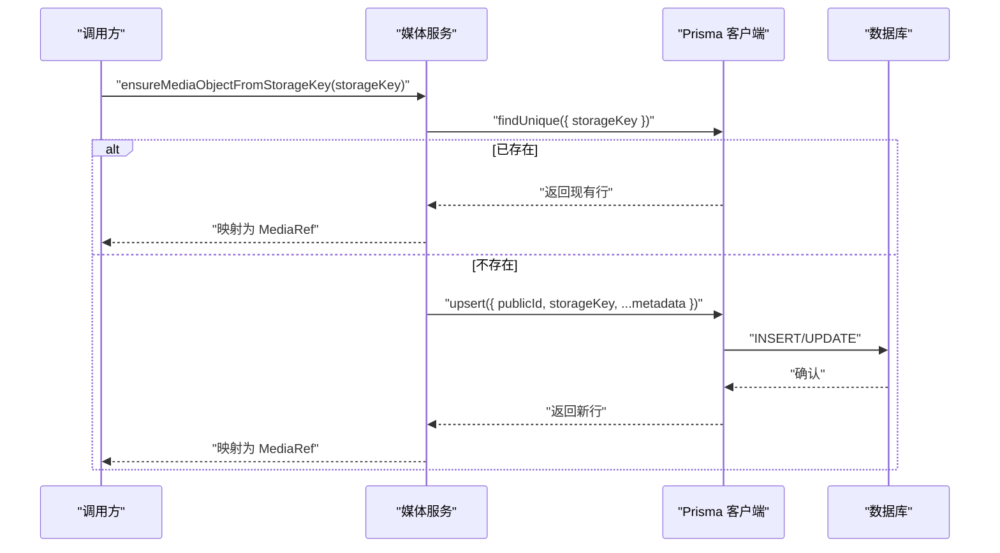
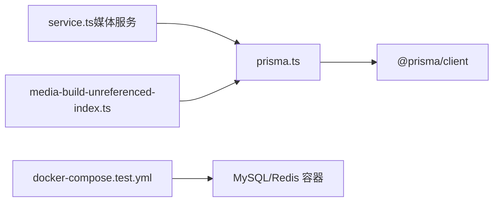

# 数据库设计

<cite>
**本文引用的文件**
- [schema.prisma](file://prisma/schema.prisma)
- [schema.sqlit.prisma](file://prisma/schema.sqlit.prisma)
- [migration.sql（资产类型与位置）](file://prisma/migrations/20260317120000_add_asset_kind_to_locations/migration.sql)
- [migration.sql（移除项目模式）](file://prisma/migrations/20260324120000_drop_project_mode/migration.sql)
- [migration.sql（位置可用槽位）](file://prisma/migrations/20260328110000_add_location_available_slots/migration.sql)
- [prisma.ts](file://src/lib/prisma.ts)
- [service.ts（媒体服务）](file://src/lib/media/service.ts)
- [media-build-unreferenced-index.ts](file://scripts/media-build-unreferenced-index.ts)
- [docker-compose.test.yml](file://docker-compose.test.yml)
- [package.json](file://package.json)
</cite>

## 目录
1. [简介](#简介)
2. [项目结构](#项目结构)
3. [核心组件](#核心组件)
4. [架构总览](#架构总览)
5. [详细组件分析](#详细组件分析)
6. [依赖分析](#依赖分析)
7. [性能考量](#性能考量)
8. [故障排查指南](#故障排查指南)
9. [结论](#结论)
10. [附录](#附录)

## 简介
本文件面向 Waoowaoo 的数据库设计，围绕基于 Prisma ORM 的 MySQL/SQLite 数据模式展开，系统梳理实体关系、字段定义与数据类型，并重点阐释核心模型（Project、Task、Asset/MediaObject）的设计理念与约束。同时覆盖索引策略、查询优化、迁移机制与版本管理、数据验证与业务规则、缓存与高可用、备份与灾难恢复以及与应用的集成实践。

## 项目结构
数据库层由 Prisma Schema 定义，分别提供 MySQL 与 SQLite 的两套 schema 文件，用于开发与测试环境；迁移脚本位于 prisma/migrations 下，配合运行时脚本完成介质对象索引构建与清理。



图表来源
- [schema.prisma](file://prisma/schema.prisma)
- [schema.sqlit.prisma](file://prisma/schema.sqlit.prisma)
- [prisma.ts](file://src/lib/prisma.ts)
- [service.ts（媒体服务）](file://src/lib/media/service.ts)
- [media-build-unreferenced-index.ts](file://scripts/media-build-unreferenced-index.ts)

章节来源
- [schema.prisma](file://prisma/schema.prisma)
- [schema.sqlit.prisma](file://prisma/schema.sqlit.prisma)
- [prisma.ts](file://src/lib/prisma.ts)
- [package.json](file://package.json)

## 核心组件
- 用户与鉴权：Account、Session、User、VerificationToken
- 项目与用量：Project、UsageCost
- 小说推广工作流：NovelPromotionProject、NovelPromotionEpisode、NovelPromotionClip、NovelPromotionShot、NovelPromotionStoryboard、NovelPromotionPanel、SupplementaryPanel、NovelPromotionVoiceLine、VideoEditorProject
- 媒体对象与资产中心：MediaObject、GlobalAssetFolder、GlobalCharacter、GlobalCharacterAppearance、GlobalLocation、GlobalLocationImage、GlobalVoice、VoicePreset
- 任务与图执行：Task、TaskEvent、GraphRun、GraphStep、GraphStepAttempt、GraphEvent、GraphCheckpoint、GraphArtifact
- 账务与余额：UserBalance、BalanceFreeze、BalanceTransaction
- 偏好设置：UserPreference

章节来源
- [schema.prisma](file://prisma/schema.prisma)
- [schema.sqlit.prisma](file://prisma/schema.sqlit.prisma)

## 架构总览
下图展示数据库层与应用层的交互关系，强调 Prisma 客户端、媒体服务与运维脚本对数据访问与维护的作用。



图表来源
- [prisma.ts](file://src/lib/prisma.ts)
- [schema.prisma](file://prisma/schema.prisma)
- [schema.sqlit.prisma](file://prisma/schema.sqlit.prisma)
- [service.ts（媒体服务）](file://src/lib/media/service.ts)
- [media-build-unreferenced-index.ts](file://scripts/media-build-unreferenced-index.ts)

## 详细组件分析

### 实体关系与数据模型
- Project 与 NovelPromotionProject：一对一关联，Project 通过外键指向 Project.id，用于承载小说推广项目的配置与元数据。
- Episode/Clip/Shot/Storyboard/Panel：按层级组织，形成“剧集-场次-镜头-分镜-面板”的创作管线。
- MediaObject：作为统一的媒体元数据中心，被多处实体通过外键引用，实现去重与一致性管理。
- Asset 中心：GlobalAssetFolder/GlobalCharacter/GlobalCharacterAppearance/GlobalLocation/GlobalLocationImage/GlobalVoice，与小说推广实体结构相似，但独立于具体项目，便于跨项目复用。

```mermaid
erDiagram
USER {
string id PK
string name UK
string email
datetime createdAt
datetime updatedAt
}
ACCOUNT {
string id PK
string userId FK
string type
string provider
string providerAccountId
string refreshToken
string accessToken
int expiresAt
string tokenType
string scope
string idToken
string sessionState
}
SESSION {
string id PK
string sessionToken UK
string userId FK
datetime expires
}
PROJECT {
string id PK
string userId FK
string name
string description
datetime lastAccessedAt
string novelPromotionDataId FK
datetime createdAt
datetime updatedAt
}
NOVEL_PROMOTION_PROJECT {
string id PK
string projectId UK FK
string analysisModel
string imageModel
string videoModel
string audioModel
string videoRatio
string ttsRate
string globalAssetText
string artStyle
string artStylePrompt
string characterModel
string locationModel
string storyboardModel
string editModel
string videoResolution
string capabilityOverrides
string workflowMode
string lastEpisodeId
string imageResolution
string importStatus
datetime createdAt
datetime updatedAt
}
NOVEL_PROMOTION_EPISODE {
string id PK
string novelPromotionProjectId FK
int episodeNumber
string name
string description
string novelText
string audioUrl
string audioMediaId FK
string srtContent
datetime createdAt
datetime updatedAt
string speakerVoices
}
NOVEL_PROMOTION_CLIP {
string id PK
string episodeId FK
int start
int end
int duration
string summary
string location
string content
datetime createdAt
datetime updatedAt
string characters
string props
string endText
int shotCount
string startText
string screenplay
}
NOVEL_PROMOTION_SHOT {
string id PK
string episodeId FK
string clipId FK
string shotId
int srtStart
int srtEnd
float srtDuration
string sequence
string locations
string characters
string plot
string imagePrompt
string scale
string module
string focus
string zhSummarize
string imageUrl
string imageMediaId FK
datetime createdAt
datetime updatedAt
string pov
}
NOVEL_PROMOTION_STORYBOARD {
string id PK
string episodeId FK
string clipId UK FK
string storyboardImageUrl
datetime createdAt
datetime updatedAt
int panelCount
string storyboardTextJson
string imageHistory
string candidateImages
string lastError
string photographyPlan
}
NOVEL_PROMOTION_PANEL {
string id PK
string storyboardId FK
int panelIndex
int panelNumber
string shotType
string cameraMove
string description
string location
string characters
string props
string srtSegment
float srtStart
float srtEnd
float duration
string imagePrompt
string imageUrl
string imageMediaId FK
string imageHistory
string videoPrompt
string firstLastFramePrompt
string videoUrl
string videoGenerationMode
string videoMediaId FK
datetime createdAt
datetime updatedAt
string sceneType
string candidateImages
boolean linkedToNextPanel
string lipSyncTaskId
string lipSyncVideoUrl
string lipSyncVideoMediaId FK
string sketchImageUrl
string sketchImageMediaId FK
string photographyRules
string actingNotes
string previousImageUrl
string previousImageMediaId FK
}
SUPPLEMENTARY_PANEL {
string id PK
string storyboardId FK
string sourceType
string sourcePanelId
string description
string imagePrompt
string imageUrl
string imageMediaId FK
string characters
string location
datetime createdAt
datetime updatedAt
}
VIDEO_EDITOR_PROJECT {
string id PK
string episodeId UK FK
string projectData
string renderStatus
string renderTaskId
string outputUrl
datetime createdAt
datetime updatedAt
}
NOVEL_PROMOTION_VOICE_LINE {
string id PK
string episodeId FK
int lineIndex
string speaker
string content
string voicePresetId
string audioUrl
string audioMediaId FK
datetime createdAt
datetime updatedAt
float emotionStrength
int matchedPanelIndex
string matchedStoryboardId
int audioDuration
string matchedPanelId FK
}
VOICE_PRESET {
string id PK
string name
string audioUrl
string audioMediaId FK
string description
string gender
boolean isSystem
datetime createdAt
}
MEDIA_OBJECT {
string id PK
string publicId UK
string storageKey UK
string sha256
string mimeType
bigint sizeBytes
int width
int height
int durationMs
datetime createdAt
datetime updatedAt
}
GLOBAL_ASSET_FOLDER {
string id PK
string userId FK
string name
datetime createdAt
datetime updatedAt
}
GLOBAL_CHARACTER {
string id PK
string userId FK
string folderId FK
string name
string aliases
string profileData
boolean profileConfirmed
string voiceId
string voiceType
string customVoiceUrl
string customVoiceMediaId FK
string globalVoiceId
datetime createdAt
datetime updatedAt
}
GLOBAL_CHARACTER_APPEARANCE {
string id PK
string characterId FK
int appearanceIndex
string changeReason
string artStyle
string description
string descriptions
string imageUrl
string imageMediaId FK
string imageUrls
int selectedIndex
string previousImageUrl
string previousImageMediaId FK
string previousImageUrls
string previousDescription
string previousDescriptions
datetime createdAt
datetime updatedAt
}
GLOBAL_LOCATION {
string id PK
string userId FK
string folderId FK
string name
string artStyle
string summary
string assetKind
datetime createdAt
datetime updatedAt
}
GLOBAL_LOCATION_IMAGE {
string id PK
string locationId FK
int imageIndex
string description
string availableSlots
string imageUrl
string imageMediaId FK
boolean isSelected
string previousImageUrl
string previousImageMediaId FK
string previousDescription
datetime createdAt
datetime updatedAt
}
GLOBAL_VOICE {
string id PK
string userId FK
string folderId FK
string name
string description
string voiceId
string voiceType
string customVoiceUrl
string customVoiceMediaId FK
string voicePrompt
string gender
string language
datetime createdAt
datetime updatedAt
}
TASK {
string id PK
string userId FK
string projectId FK
string episodeId
string type
string targetType
string targetId
string status
int progress
int attempt
int maxAttempts
int priority
string dedupeKey UK
string externalId
json payload
json result
json billingInfo
datetime billedAt
datetime queuedAt
datetime startedAt
datetime finishedAt
datetime heartbeatAt
datetime enqueuedAt
int enqueueAttempts
string lastEnqueueError
datetime createdAt
datetime updatedAt
}
TASK_EVENT {
int id PK
string taskId FK
string projectId FK
string userId FK
string eventType
json payload
datetime createdAt
}
GRAPH_RUN {
string id PK
string userId FK
string projectId FK
string episodeId
string workflowType
string taskType
string taskId UK
string targetType
string targetId
string status
json input
json output
string errorCode
string errorMessage
datetime cancelRequestedAt
string leaseOwner
datetime leaseExpiresAt
datetime heartbeatAt
int workflowVersion
datetime queuedAt
datetime startedAt
datetime finishedAt
int lastSeq
datetime createdAt
datetime updatedAt
}
GRAPH_STEP {
string id PK
string runId FK
string stepKey
string stepTitle
string status
int currentAttempt
int stepIndex
int stepTotal
datetime startedAt
datetime finishedAt
string lastErrorCode
string lastErrorMessage
datetime createdAt
datetime updatedAt
}
GRAPH_STEP_ATTEMPT {
string id PK
string runId FK
string stepKey
int attempt
string status
string provider
string modelKey
string inputHash
json input
string outputText
string outputReasoning
json usageJson
string errorCode
string errorMessage
datetime startedAt
datetime finishedAt
datetime createdAt
datetime updatedAt
}
GRAPH_EVENT {
bigint id PK
string runId FK
string projectId FK
string userId FK
int seq
string eventType
string stepKey
int attempt
string lane
json payload
datetime createdAt
}
GRAPH_CHECKPOINT {
string id PK
string runId FK
string nodeKey
int version
json stateJson
int stateBytes
datetime createdAt
}
GRAPH_ARTIFACT {
string id PK
string runId FK
string stepKey
string artifactType
string refId
string versionHash
json payload
datetime createdAt
}
USER_BALANCE {
string id PK
string userId UK
decimal balance
decimal frozenAmount
decimal totalSpent
datetime createdAt
datetime updatedAt
}
BALANCE_FREEZE {
string id PK
string userId FK
decimal amount
string status
string source
string taskId
string requestId
string idempotencyKey UK
string metadata
datetime expiresAt
datetime createdAt
datetime updatedAt
}
BALANCE_TRANSACTION {
string id PK
string userId FK
string type
decimal amount
decimal balanceAfter
string description
string relatedId
string freezeId FK
string operatorId
string externalOrderId
string idempotencyKey
string projectId
string episodeId
string taskType
string billingMeta
datetime createdAt
}
USER_PREFERENCE {
string id PK
string userId UK
string analysisModel
string characterModel
string locationModel
string storyboardModel
string editModel
string videoModel
string audioModel
string lipSyncModel
string voiceDesignModel
int analysisConcurrency
int imageConcurrency
int videoConcurrency
string videoRatio
string videoResolution
string artStyle
string ttsRate
string imageResolution
string capabilityDefaults
string llmBaseUrl
string llmApiKey
string falApiKey
string googleAiKey
string arkApiKey
string qwenApiKey
string customModels
string customProviders
datetime createdAt
datetime updatedAt
}
USER {
string id PK
string name UK
string email
datetime emailVerified
string image
string password
datetime createdAt
datetime updatedAt
}
ACCOUNT }o--|| USER : "belongsTo"
SESSION }o--|| USER : "belongsTo"
PROJECT }o--|| USER : "belongsTo"
NOVEL_PROMOTION_PROJECT }o--|| PROJECT : "belongsTo"
NOVEL_PROMOTION_EPISODE }o--|| NOVEL_PROMOTION_PROJECT : "belongsTo"
NOVEL_PROMOTION_CLIP }o--|| NOVEL_PROMOTION_EPISODE : "belongsTo"
NOVEL_PROMOTION_SHOT }o--|| NOVEL_PROMOTION_EPISODE : "belongsTo"
NOVEL_PROMOTION_STORYBOARD }o--|| NOVEL_PROMOTION_EPISODE : "belongsTo"
NOVEL_PROMOTION_PANEL }o--|| NOVEL_PROMOTION_STORYBOARD : "belongsTo"
SUPPLEMENTARY_PANEL }o--|| NOVEL_PROMOTION_STORYBOARD : "belongsTo"
VIDEO_EDITOR_PROJECT }o--|| NOVEL_PROMOTION_EPISODE : "belongsTo"
NOVEL_PROMOTION_VOICE_LINE }o--|| NOVEL_PROMOTION_EPISODE : "belongsTo"
VOICE_PRESET ||--o{ NOVEL_PROMOTION_VOICE_LINE : "references"
MEDIA_OBJECT ||--o{ NOVEL_PROMOTION_PANEL : "references"
MEDIA_OBJECT ||--o{ NOVEL_PROMOTION_SHOT : "references"
MEDIA_OBJECT ||--o{ NOVEL_PROMOTION_EPISODE : "references"
MEDIA_OBJECT ||--o{ NOVEL_PROMOTION_PROJECT : "references"
MEDIA_OBJECT ||--o{ GLOBAL_CHARACTER : "references"
MEDIA_OBJECT ||--o{ GLOBAL_LOCATION_IMAGE : "references"
MEDIA_OBJECT ||--o{ GLOBAL_VOICE : "references"
GLOBAL_ASSET_FOLDER ||--o{ GLOBAL_CHARACTER : "contains"
GLOBAL_ASSET_FOLDER ||--o{ GLOBAL_LOCATION : "contains"
GLOBAL_ASSET_FOLDER ||--o{ GLOBAL_VOICE : "contains"
GLOBAL_CHARACTER ||--o{ GLOBAL_CHARACTER_APPEARANCE : "has"
GLOBAL_LOCATION ||--o{ GLOBAL_LOCATION_IMAGE : "has"
TASK }o--|| USER : "belongsTo"
TASK }o--|| PROJECT : "belongsTo"
TASK_EVENT }o--|| TASK : "belongsTo"
TASK_EVENT }o--|| USER : "belongsTo"
GRAPH_RUN }o--|| USER : "belongsTo"
GRAPH_RUN }o--|| PROJECT : "belongsTo"
GRAPH_STEP }o--|| GRAPH_RUN : "belongsTo"
GRAPH_STEP_ATTEMPT }o--|| GRAPH_RUN : "belongsTo"
GRAPH_EVENT }o--|| GRAPH_RUN : "belongsTo"
GRAPH_EVENT }o--|| USER : "belongsTo"
GRAPH_CHECKPOINT }o--|| GRAPH_RUN : "belongsTo"
GRAPH_ARTIFACT }o--|| GRAPH_RUN : "belongsTo"
USER_BALANCE }o--|| USER : "belongsTo"
BALANCE_FREEZE }o--|| USER : "belongsTo"
BALANCE_TRANSACTION }o--|| USER : "belongsTo"
USER_PREFERENCE }o--|| USER : "belongsTo"
```

图表来源
- [schema.prisma](file://prisma/schema.prisma)
- [schema.sqlit.prisma](file://prisma/schema.sqlit.prisma)

### 主要实体与关系详解

#### Project 与 NovelPromotionProject
- 设计理念：将通用项目元数据与小说推广工作流配置解耦，通过外键关联，既保留通用项目能力，又提供推广特化配置。
- 约束：novelPromotionProject.projectId 唯一，指向 Project.id。

章节来源
- [schema.prisma](file://prisma/schema.prisma)

#### 剧情创作管线（Episode/Clip/Shot/Storyboard/Panel）
- 设计理念：以“剧集-场次-镜头-分镜-面板”层层细化，支撑从文本到画面/视频的生成与编辑。
- 约束：多处唯一索引（如 panel 唯一、episode+序号唯一）确保结构稳定；外键级联删除保障数据一致性。

章节来源
- [schema.prisma](file://prisma/schema.prisma)

#### MediaObject 与资产中心
- 设计理念：MediaObject 作为媒体元数据中心，统一存储 publicId、storageKey、mimeType、尺寸、时长等，被多个实体引用，避免重复与不一致。
- 资产中心：GlobalAssetFolder/GlobalCharacter/GlobalLocation/GlobalVoice 等与推广实体结构一致，便于跨项目复用。

章节来源
- [schema.prisma](file://prisma/schema.prisma)
- [service.ts（媒体服务）](file://src/lib/media/service.ts)

#### 任务与图执行（Task/Graph*）
- 设计理念：Task 提供任务队列与重试控制；GraphRun/GraphStep/GraphStepAttempt/GraphEvent/GraphCheckpoint/GraphArtifact 支撑复杂工作流的可观测性与可恢复性。
- 约束：多处索引加速查询；唯一索引保证幂等与去重。

章节来源
- [schema.prisma](file://prisma/schema.prisma)

#### 账务与余额（UserBalance/BalanceFreeze/BalanceTransaction）
- 设计理念：精细化账务追踪，冻结与交易记录确保资金安全与审计可追溯。

章节来源
- [schema.prisma](file://prisma/schema.prisma)

### 数据模型与字段定义要点
- 字段类型：广泛使用字符串、整数、浮点、布尔、日期时间、JSON 与大整型；部分字段采用 Text/VarChar 等变长类型以适配长文本。
- 外键与级联：大量使用 @relation 并指定 onDelete 行为（Cascade/SetNull），确保父子关系一致性。
- 唯一索引：dedupeKey、publicId、storageKey、episodeNumber、clipId、panelIndex 等关键字段设置唯一索引。
- 复合索引：按查询热点建立复合索引（如用户+状态、项目+时间、任务目标等）。

章节来源
- [schema.prisma](file://prisma/schema.prisma)
- [schema.sqlit.prisma](file://prisma/schema.sqlit.prisma)

### 查询流程示例（媒体对象归一化）


图表来源
- [service.ts（媒体服务）](file://src/lib/media/service.ts)
- [prisma.ts](file://src/lib/prisma.ts)

## 依赖分析
- Prisma 客户端：通过 src/lib/prisma.ts 单例化，避免重复连接；在开发环境启用全局缓存以提升启动速度。
- 运维脚本：scripts/media-build-unreferenced-index.ts 扫描媒体引用，辅助清理与审计。
- 测试环境：docker-compose.test.yml 提供 MySQL 与 Redis 的健康检查容器，确保测试稳定性。



图表来源
- [prisma.ts](file://src/lib/prisma.ts)
- [service.ts（媒体服务）](file://src/lib/media/service.ts)
- [media-build-unreferenced-index.ts](file://scripts/media-build-unreferenced-index.ts)
- [docker-compose.test.yml](file://docker-compose.test.yml)

章节来源
- [prisma.ts](file://src/lib/prisma.ts)
- [package.json](file://package.json)

## 性能考量
- 索引策略
  - 用户维度：User.id、User.name 唯一键；UserPreference.userId 唯一键；UserBalance.userId 唯一键。
  - 项目与任务：Project.userId；Task.status、Task.type、Task.targetType/targetId、Task.projectId、Task.userId、Task.heartbeatAt；GraphRun.projectId/status、GraphRun.userId/createdAt、GraphRun.taskId、GraphRun.targetType/targetId、GraphRun.workflowType/targetType/targetId/status、GraphRun.leaseExpiresAt。
  - 媒体与资产：MediaObject.publicId、MediaObject.storageKey、MediaObject.createdAt；GlobalAssetFolder.userId；GlobalCharacter.userId/folderId/customVoiceMediaId；GlobalLocation.userId/folderId；GlobalLocationImage.locationId/imageMediaId/previousImageMediaId；GlobalVoice.userId/folderId/customVoiceMediaId。
- 查询优化建议
  - 使用复合索引覆盖常见过滤条件（如用户+状态、项目+时间）。
  - 对高频聚合查询（如 UsageCost）使用分区或物化视图（若数据库支持）。
  - 控制 JSON 字段的写入规模，必要时拆分为子表。
- 缓存与高可用
  - 应用侧使用 Redis（通过 ioredis）进行会话、任务队列与临时数据缓存；生产环境建议部署哨兵/集群以提升可用性。
  - 媒体对象归一化采用 upsert 并处理并发冲突（P2002），降低锁竞争。
- 读写分离
  - 建议将只读报表查询路由至只读副本；写操作集中在主库；任务队列与事件日志可异步落库。

[本节为通用性能建议，无需特定文件引用]

## 故障排查指南
- 媒体对象冲突
  - 现象：并发 upsert 报错 P2002。
  - 处理：捕获错误后回退到 findUnique，避免崩溃。
- 媒体引用清理
  - 使用 scripts/media-build-unreferenced-index.ts 构建未引用对象索引，结合备份策略进行清理。
- 数据库健康
  - 测试环境通过 docker-compose.test.yml 启动 MySQL 与 Redis，利用健康检查定位问题。

章节来源
- [service.ts（媒体服务）](file://src/lib/media/service.ts)
- [media-build-unreferenced-index.ts](file://scripts/media-build-unreferenced-index.ts)
- [docker-compose.test.yml](file://docker-compose.test.yml)

## 结论
该数据库设计以 Prisma 为核心，围绕小说推广创作管线与资产中心构建了清晰的实体关系与约束体系。通过 MediaObject 统一媒体元数据、Task/Graph* 支撑复杂工作流、完善的索引策略与运维脚本，实现了高一致性、可扩展与可维护性。建议在生产环境中进一步完善读写分离、缓存与灾备方案，并持续通过迁移脚本与校验工具保障演进过程中的数据质量。

## 附录

### 数据迁移与版本管理
- 迁移脚本
  - 添加资产类型与位置字段：为 novel_promotion_locations/global_locations 增加 assetKind，默认值为 location；为 novel_promotion_clips/novel_promotion_panels 增加 props 字段。
  - 移除项目模式字段：从 projects 表删除 mode 列。
  - 位置可用槽位：为 location_images/global_location_images 增加 availableSlots 字段。
- 版本管理
  - 通过 Prisma 迁移目录与 SQL 文件管理演进；配合脚本（如 migrate-graph-artifacts-unique-index.ts）确保索引一致性与唯一性。

章节来源
- [migration.sql（资产类型与位置）](file://prisma/migrations/20260317120000_add_asset_kind_to_locations/migration.sql)
- [migration.sql（移除项目模式）](file://prisma/migrations/20260324120000_drop_project_mode/migration.sql)
- [migration.sql（位置可用槽位）](file://prisma/migrations/20260328110000_add_location_available_slots/migration.sql)

### 数据验证与业务规则
- 通过 Prisma 约束（唯一、索引、外键）与应用层校验（如 capability 选择校验）共同保障数据完整性。
- 媒体服务对存储键进行归一化与类型推断，减少脏数据进入数据库。

章节来源
- [schema.prisma](file://prisma/schema.prisma)
- [service.ts（媒体服务）](file://src/lib/media/service.ts)

### 缓存策略、读写分离与高可用
- 缓存：Redis 用于会话与任务队列；建议对热点查询结果进行缓存。
- 读写分离：将报表查询与只读请求路由至只读副本。
- 高可用：Redis 建议哨兵/集群；数据库建议主从复制与自动切换。

章节来源
- [docker-compose.test.yml](file://docker-compose.test.yml)
- [package.json](file://package.json)

### 备份、恢复与灾难恢复
- 媒体备份与索引：使用 scripts/media-safety-backup.ts 与 scripts/media-build-unreferenced-index.ts 辅助备份与清理。
- 建议：定期导出数据库快照，验证恢复流程；对关键表（如 GraphArtifact）确保唯一索引以避免重复。

章节来源
- [media-build-unreferenced-index.ts](file://scripts/media-build-unreferenced-index.ts)
- [package.json](file://package.json)

### 与应用程序的集成实践
- Prisma 客户端单例化，避免重复连接；在开发环境启用全局缓存。
- 媒体服务封装存储键解析与媒体对象归一化，统一写路径。
- 运维脚本与测试环境容器化，保障开发与测试一致性。

章节来源
- [prisma.ts](file://src/lib/prisma.ts)
- [service.ts（媒体服务）](file://src/lib/media/service.ts)
- [docker-compose.test.yml](file://docker-compose.test.yml)
- [package.json](file://package.json)