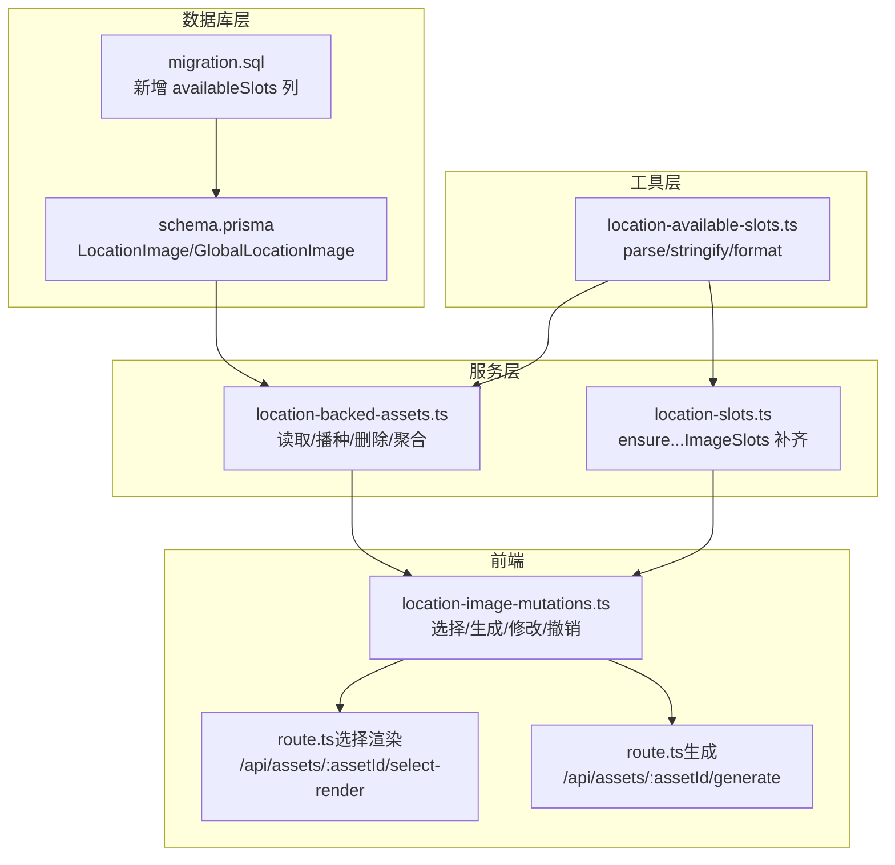
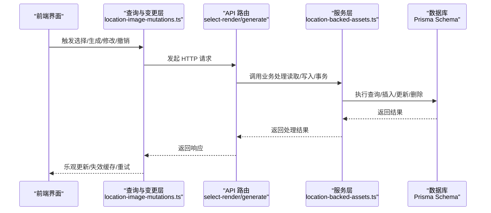
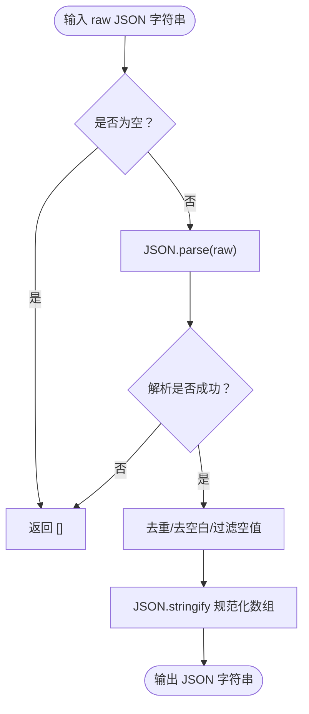
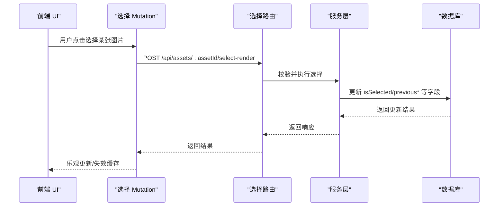
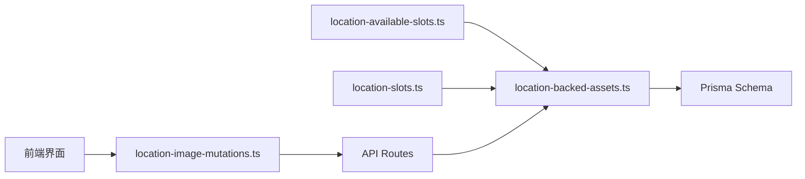

# 场景图片模型

<cite>
**本文档引用的文件**
- [schema.prisma](file://prisma/schema.prisma)
- [migration.sql](file://prisma/migrations/20260328110000_add_location_available_slots/migration.sql)
- [location-available-slots.ts](file://src/lib/location-available-slots.ts)
- [location-backed-assets.ts](file://src/lib/assets/services/location-backed-assets.ts)
- [location-image-mutations.ts](file://src/lib/query/mutations/location-image-mutations.ts)
- [location-slots.ts](file://src/lib/image-generation/location-slots.ts)
- [route.ts（选择渲染）](file://src/app/api/assets/[assetId]/select-render/route.ts)
- [route.ts（生成）](file://src/app/api/assets/[assetId]/generate/route.ts)
- [location-available-slots.test.ts](file://tests/unit/location-available-slots.test.ts)
- [location-backed-assets.test.ts](file://tests/unit/assets/location-backed-assets.test.ts)
</cite>

## 目录
1. [简介](#简介)
2. [项目结构](#项目结构)
3. [核心组件](#核心组件)
4. [架构总览](#架构总览)
5. [详细组件分析](#详细组件分析)
6. [依赖分析](#依赖分析)
7. [性能考量](#性能考量)
8. [故障排查指南](#故障排查指南)
9. [结论](#结论)
10. [附录](#附录)

## 简介
本文件系统性梳理 Waoowaoo 中“场景图片模型”的设计与实现，聚焦 LocationImage 实体在数据库层、服务层与前端交互层的职责边界与协作关系。重点覆盖以下主题：
- 场景图片索引与可用槽位管理
- availableSlots 字段的 JSON 设计与解析
- 场景图片的动态分配与选择机制
- 与场景实体的多对多关联及 selectedByLocations 的作用
- 生命周期管理：创建、分配、使用与版本控制
- 查询优化策略与索引设计
- 版本控制与图片切换逻辑

## 项目结构
围绕场景图片模型的关键文件分布如下：
- 数据库与迁移：Prisma Schema 定义、availableSlots 列迁移
- 工具与解析：availableSlots 的序列化/反序列化工具
- 服务层：场景图片的读取、播种、删除与槽位补齐
- 前端查询与变更：选择、生成、修改、撤销等操作的本地乐观更新与后端同步
- API 层：选择渲染与生成请求的后端路由
- 单元测试：验证 availableSlots 文本格式与播种行为

图表来源
- [schema.prisma](file://prisma/schema.prisma)
- [migration.sql](file://prisma/migrations/20260328110000_add_location_available_slots/migration.sql)
- [location-available-slots.ts](file://src/lib/location-available-slots.ts)
- [location-backed-assets.ts](file://src/lib/assets/services/location-backed-assets.ts)
- [location-slots.ts](file://src/lib/image-generation/location-slots.ts)
- [location-image-mutations.ts](file://src/lib/query/mutations/location-image-mutations.ts)
- [route.ts（选择渲染）](file://src/app/api/assets/[assetId]/select-render/route.ts)
- [route.ts（生成）](file://src/app/api/assets/[assetId]/generate/route.ts)

章节来源
- [schema.prisma](file://prisma/schema.prisma)
- [migration.sql](file://prisma/migrations/20260328110000_add_location_available_slots/migration.sql)

## 核心组件
- LocationImage 实体：承载每个场景的多张图片变体，含索引 imageIndex、描述 description、可用槽位 availableSlots、当前是否被选中 isSelected 等字段，并与场景 NovelPromotionLocation 及媒体对象关联。
- GlobalLocationImage 实体：与 LocationImage 结构一致，用于全局资产场景图片。
- availableSlots 字段：以 JSON 文本形式存储字符串数组，表示该图片变体可供“站位”的角色槽位集合；通过工具函数进行解析与格式化。
- 服务层函数：负责按场景批量读取图片、播种初始图片槽位、补齐缺失槽位、删除资产等。
- 前端查询与变更：提供选择、生成、修改、撤销等 Mutation，配合本地乐观更新与后端同步。

章节来源
- [schema.prisma](file://prisma/schema.prisma)
- [location-available-slots.ts](file://src/lib/location-available-slots.ts)
- [location-backed-assets.ts](file://src/lib/assets/services/location-backed-assets.ts)
- [location-slots.ts](file://src/lib/image-generation/location-slots.ts)
- [location-image-mutations.ts](file://src/lib/query/mutations/location-image-mutations.ts)

## 架构总览
场景图片模型在系统中的交互路径如下：

图表来源
- [location-image-mutations.ts](file://src/lib/query/mutations/location-image-mutations.ts)
- [route.ts（选择渲染）](file://src/app/api/assets/[assetId]/select-render/route.ts)
- [route.ts（生成）](file://src/app/api/assets/[assetId]/generate/route.ts)
- [location-backed-assets.ts](file://src/lib/assets/services/location-backed-assets.ts)
- [schema.prisma](file://prisma/schema.prisma)

## 详细组件分析

### LocationImage 实体设计与字段语义
- 主键与唯一性：id；唯一索引为 (locationId, imageIndex)，保证同一场景下每张图片变体的唯一性。
- 外键关系：
  - locationId → NovelPromotionLocation(id)，级联删除。
  - imageMediaId → MediaObject(id)，图片媒体对象关联。
  - selectedByLocations：与 NovelPromotionLocation 的多对多关联，表示哪些场景选择了该图片作为其“当前图片”。
- 关键字段：
  - imageIndex：图片在场景内的排序索引。
  - description：图片描述。
  - availableSlots：JSON 文本，字符串数组，表示该图片可用于哪些角色站位槽位。
  - imageUrl/previousImageUrl：当前/上一次生成的图片地址。
  - isSelected：标记该图片是否为场景当前选中图片。
  - createdAt/updatedAt：时间戳。

章节来源
- [schema.prisma](file://prisma/schema.prisma)

### availableSlots 字段的 JSON 设计与解析
- 存储格式：JSON 字符串数组，元素为字符串类型的“站位描述”。
- 解析与序列化：
  - parseLocationAvailableSlots：将 JSON 字符串安全解析为字符串数组，异常时返回空数组。
  - stringifyLocationAvailableSlots：将字符串数组规范化并序列化为 JSON。
  - formatLocationAvailableSlotsText：根据语言环境输出带标题的文本，便于 UI 展示。
- 规范化规则：去重、去空白、过滤空值。

图表来源
- [location-available-slots.ts](file://src/lib/location-available-slots.ts)

章节来源
- [location-available-slots.ts](file://src/lib/location-available-slots.ts)
- [location-available-slots.test.ts](file://tests/unit/location-available-slots.test.ts)

### 场景图片索引与可用槽位管理
- 索引策略：
  - imageIndex：用于在同一场景内对图片变体排序。
  - locationId：用于快速定位某场景的所有图片变体。
  - imageMediaId：用于媒体对象关联。
- 槽位补齐：
  - ensureProjectLocationImageSlots / ensureGlobalLocationImageSlots：确保场景图片槽位数量达到目标 count，自动补齐缺失的 imageIndex 与默认描述。
- 种植初始槽位：
  - seedProjectLocationBackedImageSlots / seedGlobalLocationBackedImageSlots：基于描述列表与 availableSlots 初始化图片变体。

章节来源
- [location-slots.ts](file://src/lib/image-generation/location-slots.ts)
- [location-backed-assets.ts](file://src/lib/assets/services/location-backed-assets.ts)

### 场景图片与场景实体的多对多关联
- 关联关系：
  - LocationImage.location → NovelPromotionLocation
  - LocationImage.selectedByLocations → NovelPromotionLocation[]（多对多）
  - NovelPromotionLocation.selectedImage → LocationImage（外键 selectedImageId）
- 业务含义：
  - selectedByLocations 表示“哪些场景选择了该图片”，用于统计与联动。
  - selectedImageId 用于记录场景当前选中的图片，便于快速渲染与一致性维护。

章节来源
- [schema.prisma](file://prisma/schema.prisma)

### 图片选择机制与版本控制
- 选择流程：
  - 前端调用 useSelectProjectLocationImage 提交选择请求。
  - 后端路由 route.ts（选择渲染）校验参数与权限，调用服务层执行选择。
  - 乐观更新：前端在 onMutate 中对缓存进行局部更新，失败时回滚。
- 版本控制：
  - isSelected：标记当前选中图片。
  - previousImageUrl/previousDescription：保存上一次生成或修改后的状态，支持撤销。
  - 撤销：通过 useUndoProjectLocationImage 触发后端撤销逻辑，恢复上一版本。

图表来源
- [location-image-mutations.ts](file://src/lib/query/mutations/location-image-mutations.ts)
- [route.ts（选择渲染）](file://src/app/api/assets/[assetId]/select-render/route.ts)
- [location-backed-assets.ts](file://src/lib/assets/services/location-backed-assets.ts)

章节来源
- [location-image-mutations.ts](file://src/lib/query/mutations/location-image-mutations.ts)
- [route.ts（选择渲染）](file://src/app/api/assets/[assetId]/select-render/route.ts)

### 生命周期管理：从创建到使用的全流程
- 创建：通过 seedProjectLocationBackedImageSlots / seedGlobalLocationBackedImageSlots 初始化图片变体与 availableSlots。
- 分配：通过 ensure...ImageSlots 补齐槽位，保证 imageIndex 连续且数量达标。
- 使用：用户选择图片，selectedImageId 与 isSelected 字段更新，selectedByLocations 反向关联生效。
- 修改与撤销：通过 modify/render 与 revert 接口更新/回退版本。
- 删除：deleteProjectLocationBackedAsset/deleteGlobalLocationBackedAsset 清理场景与图片。

章节来源
- [location-backed-assets.ts](file://src/lib/assets/services/location-backed-assets.ts)
- [location-slots.ts](file://src/lib/image-generation/location-slots.ts)
- [location-image-mutations.ts](file://src/lib/query/mutations/location-image-mutations.ts)

### 查询优化策略与索引设计
- 现有索引：
  - LocationImage：唯一索引 (locationId, imageIndex)、索引 locationId、imageMediaId。
  - GlobalLocationImage：唯一索引 (locationId, imageIndex)、索引 locationId、imageMediaId。
- 优化建议：
  - 为 availableSlots 建立虚拟列或应用层预处理：由于该字段为 JSON 文本，直接全文检索成本高，建议在业务层通过解析后的数组进行匹配或在 UI 层做前端过滤。
  - 对常用查询组合（如 locationId + imageIndex）保持现有复合索引，避免重复索引造成写入开销。
  - 对 selectedImageId 建立索引以加速场景当前图片的查询（schema 已存在外键索引）。

章节来源
- [schema.prisma](file://prisma/schema.prisma)
- [migration.sql](file://prisma/migrations/20260328110000_add_location_available_slots/migration.sql)

## 依赖分析
- 组件耦合：
  - 工具层与服务层低耦合：availableSlots 工具仅负责序列化/解析，不依赖业务上下文。
  - 服务层与数据库层紧耦合：通过 Prisma ORM 直接访问表结构与索引。
  - 前端与后端通过 API 路由解耦：Mutation 与路由分离，便于扩展与测试。
- 外部依赖：
  - Prisma Client：提供类型安全的数据库访问。
  - Next.js API Routes：提供统一的 HTTP 接口入口。
  - React Query：提供缓存、乐观更新与失效策略。

图表来源
- [location-available-slots.ts](file://src/lib/location-available-slots.ts)
- [location-backed-assets.ts](file://src/lib/assets/services/location-backed-assets.ts)
- [location-slots.ts](file://src/lib/image-generation/location-slots.ts)
- [location-image-mutations.ts](file://src/lib/query/mutations/location-image-mutations.ts)
- [route.ts（选择渲染）](file://src/app/api/assets/[assetId]/select-render/route.ts)
- [route.ts（生成）](file://src/app/api/assets/[assetId]/generate/route.ts)
- [schema.prisma](file://prisma/schema.prisma)

## 性能考量
- 写入性能：
  - createMany 批量插入图片变体，减少往返次数。
  - ensure...ImageSlots 仅在需要时插入，避免冗余写入。
- 读取性能：
  - 使用 locationId IN (...) 批量查询，配合 ORDER BY locationId ASC, imageIndex ASC，提升聚合效率。
  - 通过 Prisma 原生 SQL 查询减少 ORM 层开销。
- 缓存与失效：
  - React Query 在选择/生成/修改/撤销后主动失效相关查询键，保证 UI 与后端一致。
- JSON 字段优化：
  - availableSlots 为 JSON 文本，建议在应用层进行解析与缓存，避免数据库层面复杂查询。

章节来源
- [location-backed-assets.ts](file://src/lib/assets/services/location-backed-assets.ts)
- [location-slots.ts](file://src/lib/image-generation/location-slots.ts)
- [location-image-mutations.ts](file://src/lib/query/mutations/location-image-mutations.ts)

## 故障排查指南
- availableSlots 解析失败：
  - 现象：解析返回空数组。
  - 排查：检查 JSON 是否合法，确认字段类型为字符串数组。
- 选择失败：
  - 现象：前端未更新或报错。
  - 排查：确认路由参数 scope/kind/projectId 是否正确，权限校验是否通过。
- 图片未显示：
  - 现象：UI 无图片或占位。
  - 排查：检查 imageUrl 是否为空，isSelected 是否为真，selectedImageId 是否正确。
- 撤销无效：
  - 现象：撤销后仍显示旧图。
  - 排查：确认 previousImageUrl 是否存在，后端撤销逻辑是否执行成功。

章节来源
- [location-available-slots.ts](file://src/lib/location-available-slots.ts)
- [route.ts（选择渲染）](file://src/app/api/assets/[assetId]/select-render/route.ts)
- [location-image-mutations.ts](file://src/lib/query/mutations/location-image-mutations.ts)

## 结论
场景图片模型通过 LocationImage 与 GlobalLocationImage 实体实现了对场景图片的结构化管理，结合 availableSlots 的 JSON 设计与服务层的批量播种与补齐能力，提供了灵活的图片变体与站位管理。前端通过 React Query 的乐观更新与后端 API 路由形成清晰的职责边界，配合现有索引与批量查询策略，在功能完整性与性能之间取得平衡。未来可在应用层对 availableSlots 做更高效的匹配与缓存，进一步降低数据库层面的复杂度。

## 附录
- 相关测试：
  - location-available-slots.test.ts：验证 availableSlots 文本格式国际化输出。
  - location-backed-assets.test.ts：验证播种时 availableSlots 的默认值与写入行为。

章节来源
- [location-available-slots.test.ts](file://tests/unit/location-available-slots.test.ts)
- [location-backed-assets.test.ts](file://tests/unit/assets/location-backed-assets.test.ts)