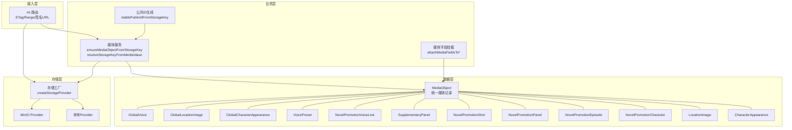
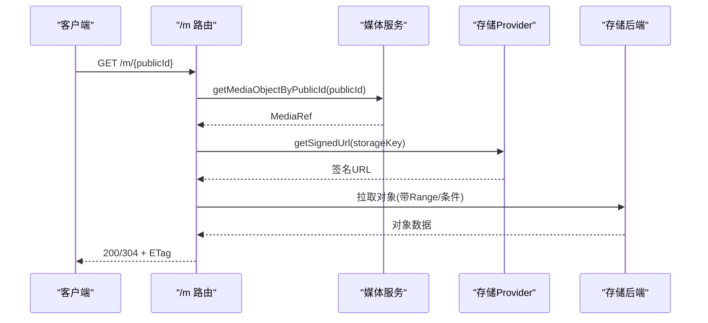
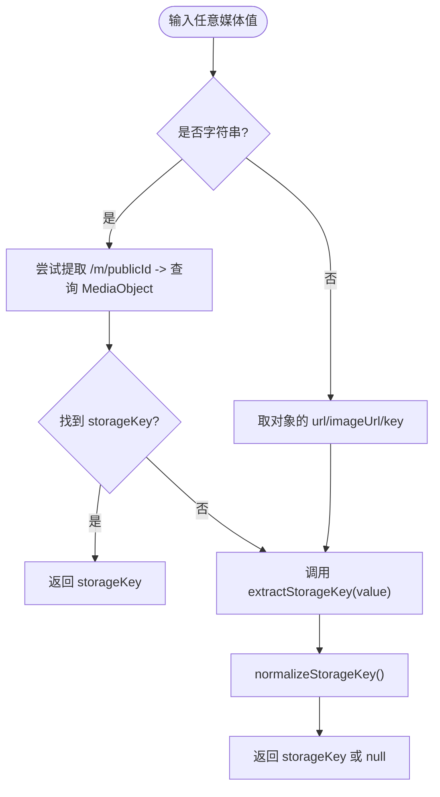
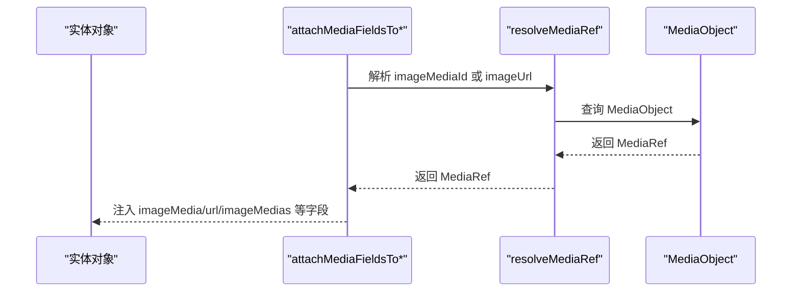
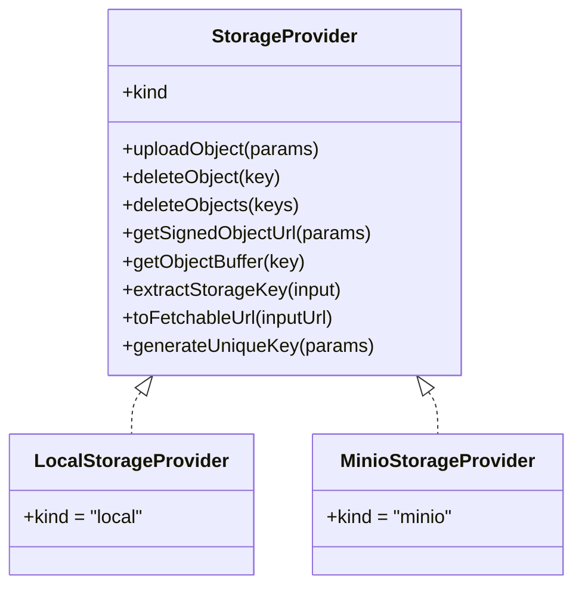
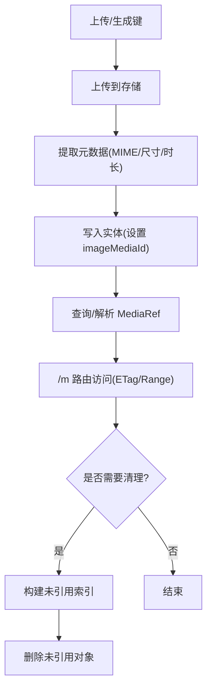
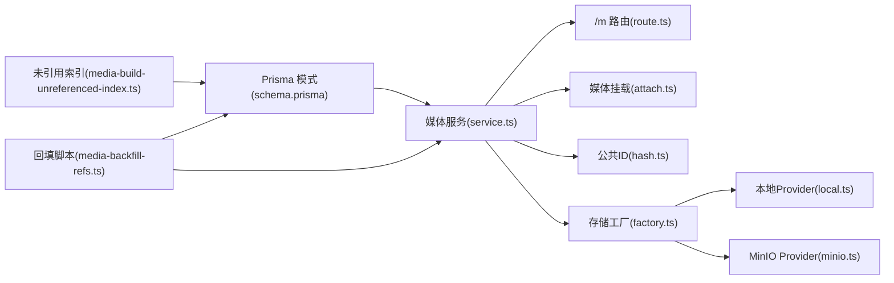

# 媒体对象模型

<cite>
**本文档引用的文件**
- [schema.prisma](file://prisma/schema.prisma)
- [service.ts](file://src/lib/media/service.ts)
- [types.ts](file://src/lib/media/types.ts)
- [attach.ts](file://src/lib/media/attach.ts)
- [hash.ts](file://src/lib/media/hash.ts)
- [route.ts](file://src/app/m/[publicId]/route.ts)
- [factory.ts](file://src/lib/storage/factory.ts)
- [types.ts](file://src/lib/storage/types.ts)
- [local.ts](file://src/lib/storage/providers/local.ts)
- [minio.ts](file://src/lib/storage/providers/minio.ts)
- [media-build-unreferenced-index.ts](file://scripts/media-build-unreferenced-index.ts)
- [media-backfill-refs.ts](file://scripts/media-backfill-refs.ts)
- [media-mapping.ts](file://scripts/media-mapping.ts)
- [image-label.ts](file://src/lib/image-label.ts)
- [download-images/route.ts](file://src/app/api/novel-promotion/[projectId]/download-images/route.ts)
</cite>

## 目录
1. [简介](#简介)
2. [项目结构](#项目结构)
3. [核心组件](#核心组件)
4. [架构总览](#架构总览)
5. [详细组件分析](#详细组件分析)
6. [依赖分析](#依赖分析)
7. [性能考量](#性能考量)
8. [故障排查指南](#故障排查指南)
9. [结论](#结论)
10. [附录](#附录)

## 简介
本文件系统性阐述 Waoowaoo 的媒体对象模型（MediaObject）设计与实现，覆盖统一存储结构、元数据管理、多态关联关系、文件存储策略、生命周期管理、版本与回滚、以及性能优化（含大文件与 CDN）。重点围绕 Prisma 数据模型、媒体服务层、存储抽象层与路由访问层展开，并通过脚本工具说明迁移、索引与清理策略。

## 项目结构
媒体对象模型横跨以下层次：
- 数据层：Prisma 模式定义 MediaObject 及其多态关联
- 业务层：媒体服务（创建/解析/查询）、媒体字段挂载（将 legacy 字段转为 MediaRef）
- 存储层：抽象存储工厂与多种 Provider（本地/MinIO/COS），统一签名 URL 与键管理
- 接入层：Next.js 路由对 /m/{publicId} 提供带缓存与范围请求的代理访问
- 工具层：迁移/回填脚本、未引用对象索引与清理

**图表来源**
- [schema.prisma](file://prisma/schema.prisma)
- [service.ts](file://src/lib/media/service.ts)
- [attach.ts](file://src/lib/media/attach.ts)
- [hash.ts](file://src/lib/media/hash.ts)
- [factory.ts](file://src/lib/storage/factory.ts)
- [local.ts](file://src/lib/storage/providers/local.ts)
- [minio.ts](file://src/lib/storage/providers/minio.ts)
- [route.ts](file://src/app/m/[publicId]/route.ts)

**章节来源**
- [schema.prisma](file://prisma/schema.prisma)
- [service.ts](file://src/lib/media/service.ts)
- [attach.ts](file://src/lib/media/attach.ts)
- [hash.ts](file://src/lib/media/hash.ts)
- [factory.ts](file://src/lib/storage/factory.ts)
- [route.ts](file://src/app/m/[publicId]/route.ts)

## 核心组件
- MediaObject 实体：统一存储键、派生公共 ID、元数据（MIME、尺寸、时长、哈希）与时间戳
- 多态关联：CharacterAppearanceImageMedia、LocationImageMedia、NovelPromotionCharacterVoiceMedia 等
- 媒体服务：根据存储键创建/更新 MediaObject，解析任意媒体值为存储键
- 媒体字段挂载：将 legacy 字段（如 imageUrl）转换为 MediaRef 并注入 URL
- 存储抽象：统一上传、删除、签名 URL、键提取与可拉取 URL
- 路由访问：/m/{publicId} 提供 ETag 缓存与 Range 支持

**章节来源**
- [schema.prisma](file://prisma/schema.prisma)
- [service.ts](file://src/lib/media/service.ts)
- [types.ts](file://src/lib/media/types.ts)
- [attach.ts](file://src/lib/media/attach.ts)
- [hash.ts](file://src/lib/media/hash.ts)
- [route.ts](file://src/app/m/[publicId]/route.ts)

## 架构总览
媒体对象模型采用“统一存储 + 关系解耦”的设计：
- 存储键（storageKey）作为唯一标识，避免重复存储与分散引用
- MediaObject 仅保存元数据与派生 publicId，不存放实际内容
- 各实体通过外键（如 imageMediaId）指向 MediaObject，形成多态关联
- 媒体服务负责幂等创建与并发安全（P2002 唯一约束回退）
- 路由层统一签名与转发，支持缓存与范围请求

**图表来源**
- [route.ts](file://src/app/m/[publicId]/route.ts)
- [service.ts](file://src/lib/media/service.ts)
- [types.ts](file://src/lib/storage/types.ts)
- [local.ts](file://src/lib/storage/providers/local.ts)
- [minio.ts](file://src/lib/storage/providers/minio.ts)

## 详细组件分析

### MediaObject 实体与多态关联
- 字段要点：唯一 publicId、唯一 storageKey、可空元数据（mimeType、sizeBytes、width、height、durationMs、sha256）、时间戳
- 多态关系：通过 @relation(...) 在多个实体中以相同字段名（如 imageMediaId）指向 MediaObject，形成“多对一”关系
- 典型关联：
  - 角色外观图像：CharacterAppearance.imageMedia
  - 场景图像：LocationImage.imageMedia
  - 角色自定义音色：NovelPromotionCharacter.customVoiceMedia
  - 分镜面板图像/视频/口型同步视频/草图：NovelPromotionPanel.imageMedia、videoMedia、lipSyncVideoMedia、sketchImageMedia
  - 镜头图像：NovelPromotionShot.imageMedia
  - 声线音频：NovelPromotionVoiceLine.audioMedia
  - 全局资产：GlobalCharacterAppearance、GlobalLocationImage、GlobalVoice 的对应媒体字段

```mermaid
erDiagram
MEDIA_OBJECT {
string id PK
string publicId UK
string storageKey UK
string sha256
string mimeType
bigint sizeBytes
int width
int height
int durationMs
datetime createdAt
datetime updatedAt
}
CHARACTER_APPEARANCE {
string id PK
string imageMediaId FK
}
LOCATION_IMAGE {
string id PK
string imageMediaId FK
}
NOVEL_PROMOTION_CHARACTER {
string id PK
string customVoiceMediaId FK
}
NOVEL_PROMOTION_PANEL {
string id PK
string imageMediaId FK
string videoMediaId FK
string lipSyncVideoMediaId FK
string sketchImageMediaId FK
string previousImageMediaId FK
}
NOVEL_PROMOTION_SHOT {
string id PK
string imageMediaId FK
}
NOVEL_PROMOTION_VOICE_LINE {
string id PK
string audioMediaId FK
}
GLOBAL_CHARACTER_APPEARANCE {
string id PK
string imageMediaId FK
string previousImageMediaId FK
}
GLOBAL_LOCATION_IMAGE {
string id PK
string imageMediaId FK
string previousImageMediaId FK
}
GLOBAL_VOICE {
string id PK
string customVoiceMediaId FK
}
MEDIA_OBJECT ||--o| CHARACTER_APPEARANCE : "CharacterAppearanceImageMedia"
MEDIA_OBJECT ||--o| LOCATION_IMAGE : "LocationImageMedia"
MEDIA_OBJECT ||--o| NOVEL_PROMOTION_CHARACTER : "NovelPromotionCharacterVoiceMedia"
MEDIA_OBJECT ||--o| NOVEL_PROMOTION_PANEL : "NovelPromotionPanelImageMedia"
MEDIA_OBJECT ||--o| NOVEL_PROMOTION_PANEL : "NovelPromotionPanelVideoMedia"
MEDIA_OBJECT ||--o| NOVEL_PROMOTION_PANEL : "NovelPromotionPanelLipSyncVideoMedia"
MEDIA_OBJECT ||--o| NOVEL_PROMOTION_PANEL : "NovelPromotionPanelSketchMedia"
MEDIA_OBJECT ||--o| NOVEL_PROMOTION_PANEL : "NovelPromotionPanelPreviousImageMedia"
MEDIA_OBJECT ||--o| NOVEL_PROMOTION_SHOT : "NovelPromotionShotImageMedia"
MEDIA_OBJECT ||--o| NOVEL_PROMOTION_VOICE_LINE : "NovelPromotionVoiceLineAudioMedia"
MEDIA_OBJECT ||--o| GLOBAL_CHARACTER_APPEARANCE : "GlobalCharacterAppearanceImageMedia"
MEDIA_OBJECT ||--o| GLOBAL_CHARACTER_APPEARANCE : "GlobalCharacterAppearancePreviousImageMedia"
MEDIA_OBJECT ||--o| GLOBAL_LOCATION_IMAGE : "GlobalLocationImageMedia"
MEDIA_OBJECT ||--o| GLOBAL_LOCATION_IMAGE : "GlobalLocationImagePreviousImageMedia"
MEDIA_OBJECT ||--o| GLOBAL_VOICE : "GlobalVoiceCustomVoiceMedia"
```

**图表来源**
- [schema.prisma](file://prisma/schema.prisma)

**章节来源**
- [schema.prisma](file://prisma/schema.prisma)

### 媒体服务：创建、解析与查询
- ensureMediaObjectFromStorageKey：规范化存储键，按 storageKey 查询；不存在则 upsert，使用 stablePublicIdFromStorageKey 生成 publicId；并发冲突回退重查
- resolveStorageKeyFromMediaValue：支持字符串 URL（含 /m/{publicId}）、签名 URL、本地路径或对象形态（优先取 url/imageUrl/key）
- getMediaObjectByPublicId/getMediaObjectById：查询并映射为 MediaRef
- MIME 推断：基于扩展名推断
- URL 生成：/m/{publicId}

**图表来源**
- [service.ts](file://src/lib/media/service.ts)
- [hash.ts](file://src/lib/media/hash.ts)

**章节来源**
- [service.ts](file://src/lib/media/service.ts)
- [hash.ts](file://src/lib/media/hash.ts)

### 媒体字段挂载：多态注入
- attachMediaFieldsTo*：在角色、场景、镜头、分镜面板、声线等对象上，将 legacy 字段（如 imageUrl、videoUrl 等）解析为 MediaRef，并注入 url 列表
- 支持数组/JSON 编码的多图字段（如 appearance.imageUrls），统一解析为 MediaRef 列表与 URL 列表
- 作用：对外输出统一的 MediaRef.url，屏蔽底层存储差异

**图表来源**
- [attach.ts](file://src/lib/media/attach.ts)
- [service.ts](file://src/lib/media/service.ts)

**章节来源**
- [attach.ts](file://src/lib/media/attach.ts)
- [service.ts](file://src/lib/media/service.ts)

### 存储抽象与访问策略
- 存储工厂：根据 STORAGE_TYPE 选择本地/MinIO/COS Provider
- 通用接口：uploadObject/deleteObject/deleteObjects/getSignedObjectUrl/getObjectBuffer/extractStorageKey/toFetchableUrl/generateUniqueKey
- 本地 Provider：生成 images/{prefix}-{timestamp}-{random}.{ext} 键，签名 URL 直接映射到 /api/files
- MinIO Provider：AWS SDK 客户端封装，支持签名 URL 与批量删除
- 访问路由：/m/{publicId} 支持 ETag 缓存与 Range 请求，内部通过 toFetchableUrl + getSignedUrl 获取上游对象

**图表来源**
- [types.ts](file://src/lib/storage/types.ts)
- [factory.ts](file://src/lib/storage/factory.ts)
- [local.ts](file://src/lib/storage/providers/local.ts)
- [minio.ts](file://src/lib/storage/providers/minio.ts)

**章节来源**
- [types.ts](file://src/lib/storage/types.ts)
- [factory.ts](file://src/lib/storage/factory.ts)
- [local.ts](file://src/lib/storage/providers/local.ts)
- [minio.ts](file://src/lib/storage/providers/minio.ts)
- [route.ts](file://src/app/m/[publicId]/route.ts)

### 生命周期管理：从上传到清理
- 上传阶段：生成唯一键（generateUniqueKey），上传字节流，记录 storageKey
- 元数据提取：根据扩展名推断 MIME，必要时通过图像/视频库读取宽高/时长
- 引用建立：在目标实体写入 imageMediaId 等字段，建立多态关联
- 访问阶段：/m/{publicId} 提供缓存与范围请求，内部通过签名 URL 拉取
- 清理阶段：未引用对象索引脚本扫描 storageKey，结合 legacy 字段回填脚本进行清理与迁移

**图表来源**
- [service.ts](file://src/lib/media/service.ts)
- [route.ts](file://src/app/m/[publicId]/route.ts)
- [media-build-unreferenced-index.ts](file://scripts/media-build-unreferenced-index.ts)
- [media-backfill-refs.ts](file://scripts/media-backfill-refs.ts)

**章节来源**
- [service.ts](file://src/lib/media/service.ts)
- [route.ts](file://src/app/m/[publicId]/route.ts)
- [media-build-unreferenced-index.ts](file://scripts/media-build-unreferenced-index.ts)
- [media-backfill-refs.ts](file://scripts/media-backfill-refs.ts)
- [media-mapping.ts](file://scripts/media-mapping.ts)

### 版本管理与回滚
- 角色/场景图像支持 previousImageMediaId/previousImageUrl 等字段，便于回滚至上一个版本
- 分镜面板支持 previousImageMediaId，配合历史记录字段 imageHistory 使用
- 回滚策略：将当前字段替换为 previous 字段值，必要时重建 MediaObject 引用

**章节来源**
- [schema.prisma](file://prisma/schema.prisma)

### 文件存储策略与 URL 构建
- 存储键生成：本地 Provider 默认 images/{prefix}-{timestamp}-{random}.{ext}；可通过 generateUniqueKey 扩展前缀与扩展名
- URL 构建：/m/{publicId} 作为稳定公开 URL；签名 URL 用于临时访问
- 访问控制：路由层通过 getSignedUrl 生成短期有效 URL；toFetchableUrl 保证可被服务端直连拉取
- 外链处理：isLikelyExternalUrl 识别外部 URL，download-images 路由支持直接下载外部资源

**章节来源**
- [local.ts](file://src/lib/storage/providers/local.ts)
- [route.ts](file://src/app/m/[publicId]/route.ts)
- [download-images/route.ts](file://src/app/api/novel-promotion/[projectId]/download-images/route.ts)

## 依赖分析
- 媒体服务依赖 Prisma 模型与存储工厂
- 路由依赖媒体服务与存储工厂
- 挂载工具依赖媒体服务与 JSON 编解码
- 脚本工具依赖 Prisma 动态模型与媒体服务

**图表来源**
- [schema.prisma](file://prisma/schema.prisma)
- [service.ts](file://src/lib/media/service.ts)
- [attach.ts](file://src/lib/media/attach.ts)
- [hash.ts](file://src/lib/media/hash.ts)
- [factory.ts](file://src/lib/storage/factory.ts)
- [local.ts](file://src/lib/storage/providers/local.ts)
- [minio.ts](file://src/lib/storage/providers/minio.ts)
- [media-build-unreferenced-index.ts](file://scripts/media-build-unreferenced-index.ts)
- [media-backfill-refs.ts](file://scripts/media-backfill-refs.ts)

**章节来源**
- [schema.prisma](file://prisma/schema.prisma)
- [service.ts](file://src/lib/media/service.ts)
- [attach.ts](file://src/lib/media/attach.ts)
- [hash.ts](file://src/lib/media/hash.ts)
- [factory.ts](file://src/lib/storage/factory.ts)
- [local.ts](file://src/lib/storage/providers/local.ts)
- [minio.ts](file://src/lib/storage/providers/minio.ts)
- [media-build-unreferenced-index.ts](file://scripts/media-build-unreferenced-index.ts)
- [media-backfill-refs.ts](file://scripts/media-backfill-refs.ts)

## 性能考量
- 缓存与 ETag：/m 路由使用 sha256 或组合 ETag，命中 304 减少带宽
- 范围请求：支持 Range，提升大图/视频播放体验
- 并发安全：ensureMediaObjectFromStorageKey 面对 P2002 冲突回退重查，避免重复写入
- 存储选择：MinIO/COS 支持大规模对象与签名 URL，适合 CDN 前置
- 元数据延迟加载：仅在需要时解析 MIME/尺寸/时长，减少 IO
- 批量操作：deleteObjects 支持批量删除，配合清理脚本降低碎片

[本节为通用性能建议，无需特定文件引用]

## 故障排查指南
- 媒体对象缺失：检查 ensureMediaObjectFromStorageKey 是否正确解析 storageKey；确认 resolveStorageKeyFromMediaValue 输入类型
- 并发冲突：P2002 唯一约束错误时会自动回退重查；若仍失败，检查数据库连接与索引
- 访问 404/500：确认 /m 路由能正确解析 publicId 并查询到 storageKey；检查签名 URL 有效期
- 未引用对象堆积：运行 media-build-unreferenced-index 生成未引用清单，结合 media-backfill-refs 清理
- 外链下载：download-images 路由对 http/https 外链直接下载，注意 Content-Type 推断与扩展名匹配

**章节来源**
- [service.ts](file://src/lib/media/service.ts)
- [route.ts](file://src/app/m/[publicId]/route.ts)
- [media-build-unreferenced-index.ts](file://scripts/media-build-unreferenced-index.ts)
- [media-backfill-refs.ts](file://scripts/media-backfill-refs.ts)
- [download-images/route.ts](file://src/app/api/novel-promotion/[projectId]/download-images/route.ts)

## 结论
MediaObject 模型通过统一存储键与多态关联，实现了媒体资源的集中治理与灵活复用。配合媒体服务的幂等创建、路由层的缓存与范围支持、以及脚本化的迁移与清理，整体具备良好的可维护性与扩展性。建议在生产环境启用 MinIO/COS 并前置 CDN，结合 ETag 与 Range 提升大文件访问性能。

## 附录
- 常用工具
  - 未引用对象索引：扫描 storageKey 与 legacy 字段，生成未引用清单
  - 回填脚本：将 legacy 字段迁移为 imageMediaId 等多态引用
  - 标签水印：对图像添加标签栏并重新上传
- 最佳实践
  - 上传时尽量提供准确的 MIME 与尺寸/时长，减少二次解析
  - 使用 stablePublicIdFromStorageKey 生成稳定的公开 URL
  - 对大文件启用 CDN 与签名 URL，限制有效期
  - 定期运行清理脚本，保持存储整洁

**章节来源**
- [media-build-unreferenced-index.ts](file://scripts/media-build-unreferenced-index.ts)
- [media-backfill-refs.ts](file://scripts/media-backfill-refs.ts)
- [image-label.ts](file://src/lib/image-label.ts)